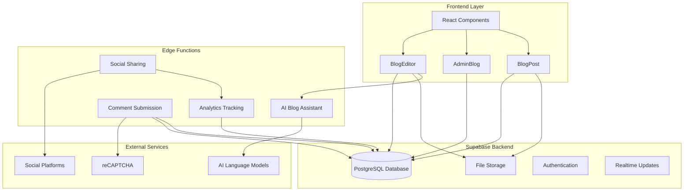
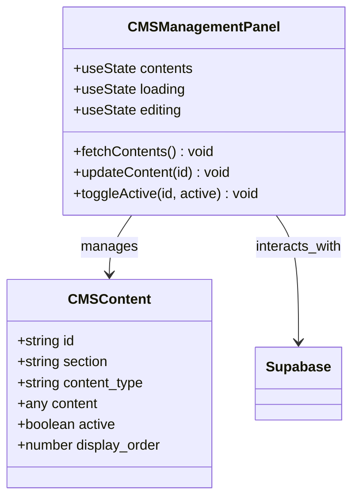
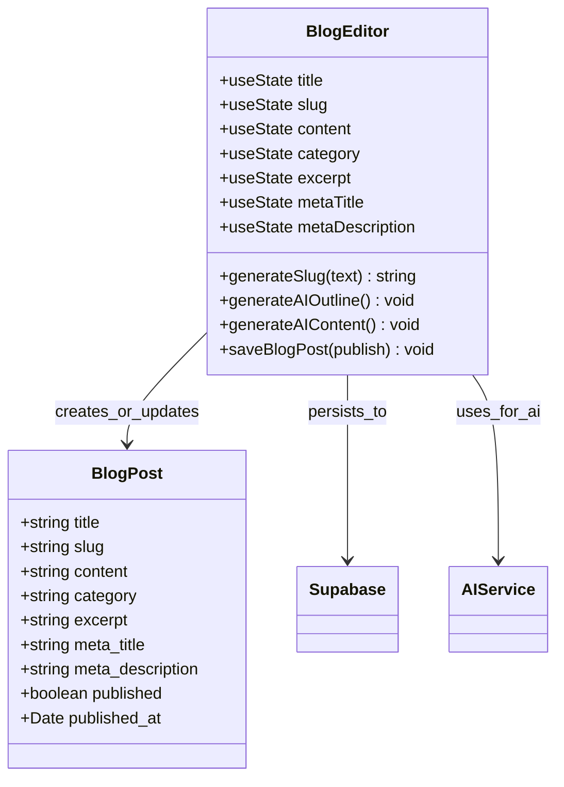
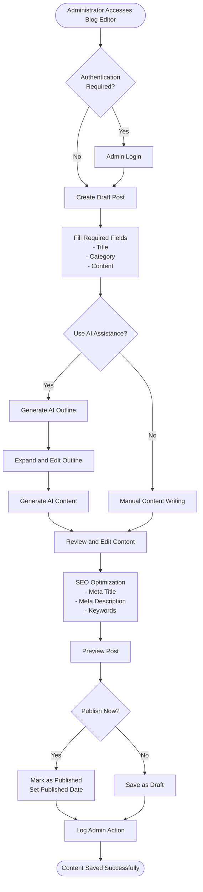
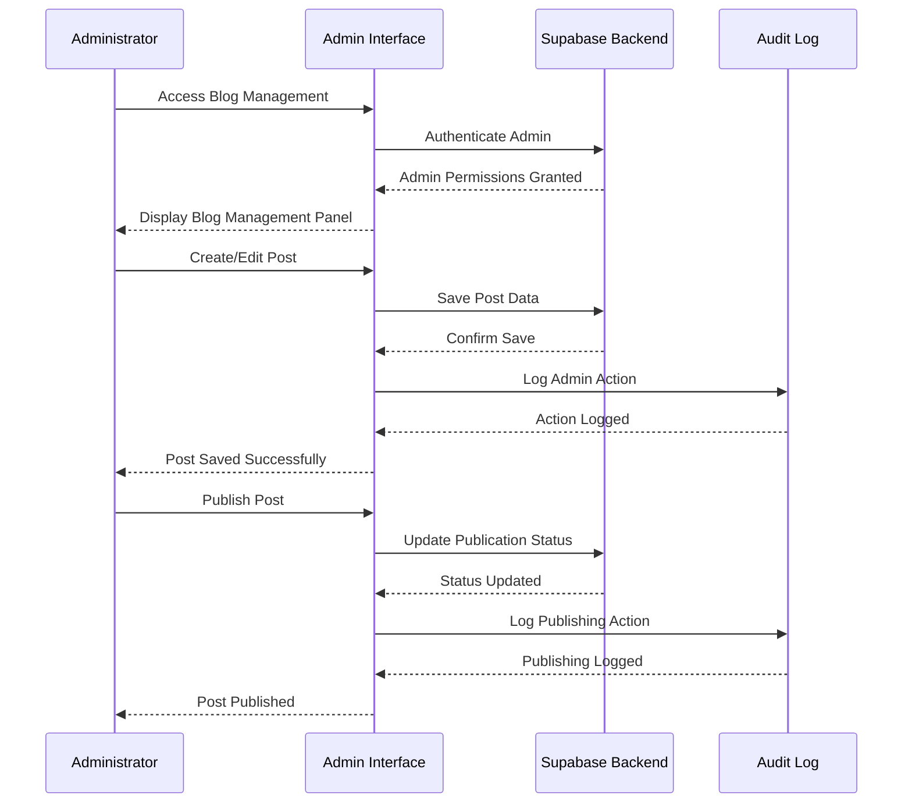
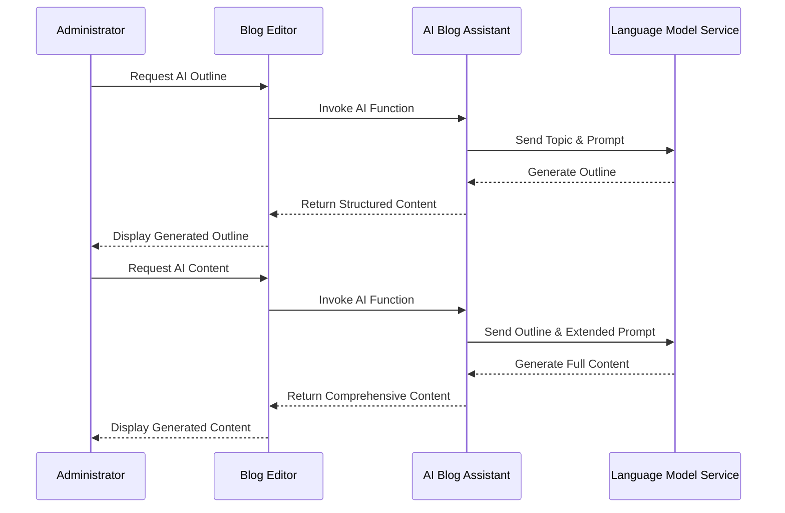
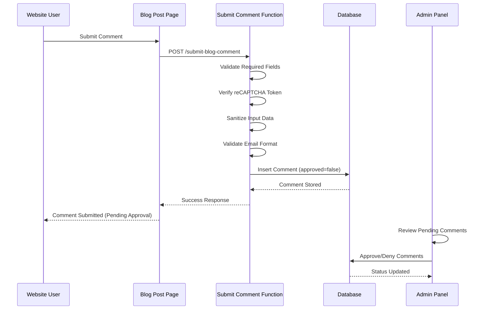
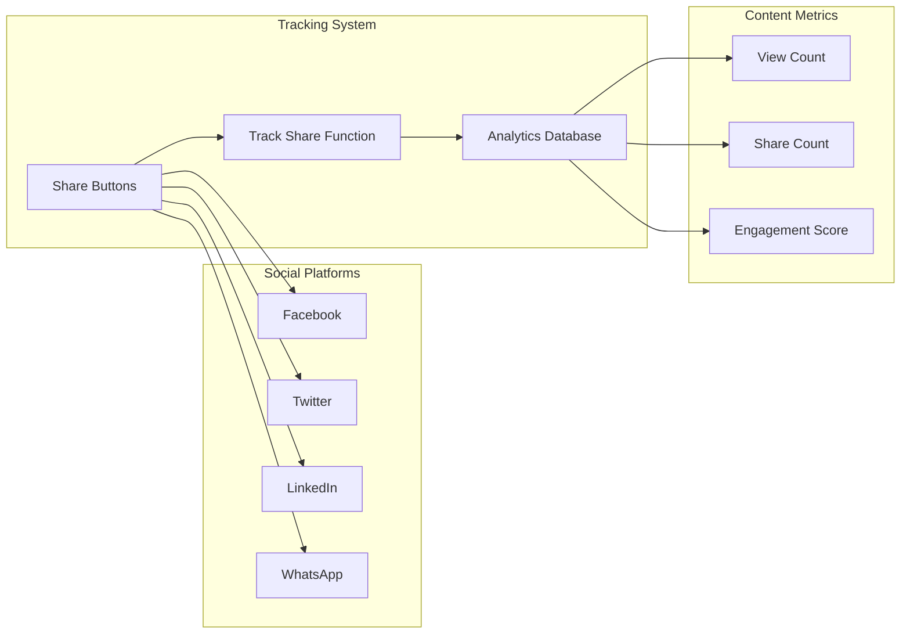
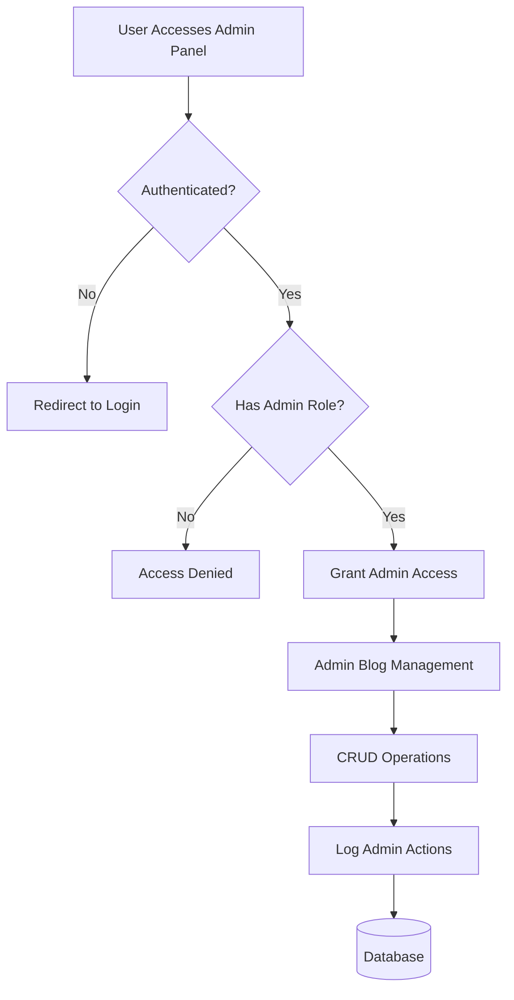
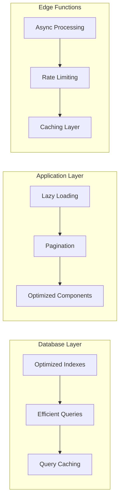

# Content Management System

<cite>
**Referenced Files in This Document**
- [CMSManagementPanel.tsx](file://src/components/admin/CMSManagementPanel.tsx)
- [BlogEditor.tsx](file://src/components/blog/BlogEditor.tsx)
- [AdminBlog.tsx](file://src/pages/AdminBlog.tsx)
- [AdminBlogEditor.tsx](file://src/pages/AdminBlogEditor.tsx)
- [Blog.tsx](file://src/pages/Blog.tsx)
- [BlogPost.tsx](file://src/pages/BlogPost.tsx)
- [BlogPostCard.tsx](file://src/components/blog/BlogPostCard.tsx)
- [submit-blog-comment/index.ts](file://supabase/functions/submit-blog-comment/index.ts)
- [ai-blog-assistant/index.ts](file://supabase/functions/ai-blog-assistant/index.ts)
- [SocialShareButtons.tsx](file://src/components/blog/SocialShareButtons.tsx)
- [client.ts](file://src/integrations/supabase/client.ts)
- [supabaseHelpers.ts](file://src/lib/supabaseHelpers.ts)
- [types.ts](file://src/integrations/supabase/types.ts)
</cite>

## Table of Contents
1. [Introduction](#introduction)
2. [System Architecture](#system-architecture)
3. [Core Components](#core-components)
4. [Content Creation Workflow](#content-creation-workflow)
5. [Blog Management Features](#blog-management-features)
6. [AI-Powered Content Tools](#ai-powered-content-tools)
7. [Comment System](#comment-system)
8. [SEO and Analytics](#seo-and-analytics)
9. [Security and Authentication](#security-and-authentication)
10. [Performance Considerations](#performance-considerations)
11. [Troubleshooting Guide](#troubleshooting-guide)
12. [Best Practices](#best-practices)

## Introduction

The Content Management System (CMS) is a comprehensive solution built on React and Supabase that enables dynamic website content updates through an intuitive CMS interface. The system provides administrators with powerful tools for managing blog content, while offering users seamless content consumption experiences with advanced features like AI-powered content generation, social sharing, and comment moderation.

The CMS integrates seamlessly with Supabase storage for reliable data persistence and leverages Edge Functions for serverless processing capabilities. It supports real-time content updates, automated workflows, and comprehensive administrative controls for maintaining high-quality content standards.

## System Architecture

The Content Management System follows a modern full-stack architecture combining React frontend components with Supabase backend services and Edge Functions for specialized processing tasks.

**Diagram sources**
- [CMSManagementPanel.tsx](file://src/components/admin/CMSManagementPanel.tsx#L1-L204)
- [BlogEditor.tsx](file://src/components/blog/BlogEditor.tsx#L1-L297)
- [AdminBlog.tsx](file://src/pages/AdminBlog.tsx#L1-L217)
- [submit-blog-comment/index.ts](file://supabase/functions/submit-blog-comment/index.ts#L1-L129)

**Section sources**
- [client.ts](file://src/integrations/supabase/client.ts#L1-L20)
- [types.ts](file://src/integrations/supabase/types.ts#L466-L488)

## Core Components

### CMS Management Panel

The CMS Management Panel serves as the central hub for content administration, providing a comprehensive interface for managing all website content sections.

**Diagram sources**
- [CMSManagementPanel.tsx](file://src/components/admin/CMSManagementPanel.tsx#L12-L19)

### Blog Editor Component

The Blog Editor provides a rich, feature-rich interface for creating and editing blog content with AI assistance and comprehensive SEO optimization tools.

**Diagram sources**
- [BlogEditor.tsx](file://src/components/blog/BlogEditor.tsx#L12-L297)

**Section sources**
- [BlogEditor.tsx](file://src/components/blog/BlogEditor.tsx#L1-L297)
- [AdminBlogEditor.tsx](file://src/pages/AdminBlogEditor.tsx#L1-L326)

## Content Creation Workflow

The content creation process follows a structured workflow that ensures quality and consistency across all blog posts.

**Diagram sources**
- [AdminBlogEditor.tsx](file://src/pages/AdminBlogEditor.tsx#L95-L166)
- [BlogEditor.tsx](file://src/components/blog/BlogEditor.tsx#L99-L144)

### Practical Example: Creating a New Blog Post

1. **Access the Blog Editor**: Navigate to `/admin/blog/new` and authenticate as an administrator
2. **Fill Basic Information**: Enter title, category, and initial content outline
3. **AI Assistance**: Use AI tools to generate comprehensive outlines and full content
4. **SEO Optimization**: Configure meta titles, descriptions, and keywords
5. **Preview and Publish**: Review the post and either save as draft or publish immediately

**Section sources**
- [AdminBlogEditor.tsx](file://src/pages/AdminBlogEditor.tsx#L95-L166)
- [BlogEditor.tsx](file://src/components/blog/BlogEditor.tsx#L99-L144)

## Blog Management Features

### Post Lifecycle Management

The system provides comprehensive tools for managing the complete lifecycle of blog posts from creation to publication and beyond.

| Feature | Description | Admin Actions | User Impact |
|---------|-------------|---------------|-------------|
| **Draft Management** | Save incomplete posts for later completion | Create, edit, delete drafts | Authors can work on posts incrementally |
| **Publish Control** | Toggle posts between draft and published states | Publish/unpublish posts | Users see only published content |
| **Scheduled Publishing** | Set future publication dates | Schedule posts for automatic publishing | Automated content rollout |
| **Content Editing** | Modify existing posts with version control | Edit post content, metadata, images | Maintain up-to-date information |
| **Post Deletion** | Remove posts permanently | Delete posts with confirmation | Clean content archives |
| **View Tracking** | Monitor post popularity and engagement | View analytics dashboard | Understand content performance |

### Administrative Controls

**Diagram sources**
- [AdminBlog.tsx](file://src/pages/AdminBlog.tsx#L61-L90)
- [AdminBlogEditor.tsx](file://src/pages/AdminBlogEditor.tsx#L120-L156)

**Section sources**
- [AdminBlog.tsx](file://src/pages/AdminBlog.tsx#L1-L217)
- [AdminBlogEditor.tsx](file://src/pages/AdminBlogEditor.tsx#L1-L326)

## AI-Powered Content Tools

### AI Blog Assistant Integration

The system integrates with advanced AI services to enhance content creation and improve productivity for administrators.

**Diagram sources**
- [ai-blog-assistant/index.ts](file://supabase/functions/ai-blog-assistant/index.ts#L1-L84)
- [BlogEditor.tsx](file://src/components/blog/BlogEditor.tsx#L45-L96)

### AI Capabilities

| AI Function | Purpose | Model Used | Output Format |
|-------------|---------|------------|---------------|
| **Outline Generation** | Create comprehensive blog post structures | Google Gemini Flash | JSON with sections and subpoints |
| **Content Writing** | Generate full-length blog articles | Google Gemini Pro | Formatted Markdown/HTML |
| **SEO Optimization** | Suggest keywords and meta tags | Integrated analysis | Comma-separated values |
| **Content Enhancement** | Improve readability and engagement | Language optimization | Refined text blocks |

**Section sources**
- [ai-blog-assistant/index.ts](file://supabase/functions/ai-blog-assistant/index.ts#L1-L84)
- [BlogEditor.tsx](file://src/components/blog/BlogEditor.tsx#L45-L96)

## Comment System

### Secure Comment Submission

The comment system provides a robust, secure platform for user engagement with comprehensive spam protection and moderation capabilities.

**Diagram sources**
- [submit-blog-comment/index.ts](file://supabase/functions/submit-blog-comment/index.ts#L1-L129)

### Comment Moderation Features

| Feature | Description | Security Benefit | Admin Control |
|---------|-------------|------------------|---------------|
| **reCAPTCHA Protection** | Prevents automated submissions | Blocks bots and spam | Configurable threshold |
| **Input Sanitization** | Cleans user input data | Prevents XSS attacks | Automatic filtering |
| **Email Validation** | Ensures valid email addresses | Reduces spam | Format verification |
| **Pending Approval** | Requires admin review | Filters inappropriate content | Manual approval queue |
| **Rate Limiting** | Prevents abuse | Protects against flooding | Built-in throttling |
| **Content Filtering** | Removes harmful content | Maintains community standards | AI/Manual review |

**Section sources**
- [submit-blog-comment/index.ts](file://supabase/functions/submit-blog-comment/index.ts#L1-L129)

## SEO and Analytics

### Social Sharing Integration

The system provides comprehensive social sharing capabilities with tracking and analytics for measuring content performance across multiple platforms.

**Diagram sources**
- [SocialShareButtons.tsx](file://src/components/blog/SocialShareButtons.tsx#L1-L137)

### SEO Optimization Features

| Feature | Implementation | Benefits | Configuration Options |
|---------|----------------|----------|----------------------|
| **Dynamic Meta Tags** | Runtime generation from post data | Improved search rankings | Customizable templates |
| **Canonical URLs** | Automatic canonical tag generation | Prevents duplicate content | Automatic detection |
| **Structured Data** | JSON-LD schema markup | Rich snippets in search results | Automatic schema generation |
| **Image Optimization** | Lazy loading with responsive images | Faster page loads | Configurable breakpoints |
| **Mobile Responsiveness** | Adaptive design patterns | Better mobile experience | CSS media queries |
| **Performance Monitoring** | Built-in performance metrics | Identifies optimization opportunities | Real-time analytics |

**Section sources**
- [BlogPost.tsx](file://src/pages/BlogPost.tsx#L1-L252)
- [SocialShareButtons.tsx](file://src/components/blog/SocialShareButtons.tsx#L1-L137)

## Security and Authentication

### Admin Authentication System

The CMS implements a robust authentication system specifically designed for administrative access to content management features.

**Diagram sources**
- [AdminBlog.tsx](file://src/pages/AdminBlog.tsx#L26-L36)
- [AdminBlogEditor.tsx](file://src/pages/AdminBlogEditor.tsx#L17-L20)

### Security Measures

| Security Layer | Implementation | Purpose | Protection Against |
|----------------|----------------|---------|-------------------|
| **Role-Based Access** | Admin role validation | Restrict access to authorized users | Unauthorized modifications |
| **Input Validation** | Field-level validation | Ensure data integrity | Malformed data injection |
| **Output Sanitization** | DOMPurify for HTML content | Prevent XSS attacks | Cross-site scripting |
| **Rate Limiting** | Edge function throttling | Prevent abuse | DDoS and spam attacks |
| **HTTPS Enforcement** | Secure protocol usage | Encrypt data in transit | Man-in-the-middle attacks |
| **Audit Logging** | Comprehensive action logging | Track changes and accountability | Unauthorized modifications |

**Section sources**
- [AdminBlog.tsx](file://src/pages/AdminBlog.tsx#L61-L90)
- [AdminBlogEditor.tsx](file://src/pages/AdminBlogEditor.tsx#L120-L156)

## Performance Considerations

### Database Optimization

The system employs several strategies to ensure optimal performance across all content management operations.

### Performance Metrics

| Metric | Target | Current Implementation | Optimization Opportunities |
|--------|--------|----------------------|---------------------------|
| **Page Load Time** | < 2 seconds | Lazy loading, optimized images | CDN integration, image compression |
| **Database Query Time** | < 100ms | Indexed queries, efficient joins | Query optimization, connection pooling |
| **AI Response Time** | < 3 seconds | Asynchronous processing | Model caching, parallel requests |
| **Comment Submission** | < 500ms | Edge function processing | Connection optimization, retry logic |
| **Content Editing** | < 1 second | Optimized React components | Component memoization, state optimization |

## Troubleshooting Guide

### Common Issues and Solutions

#### Content Saving Problems

**Issue**: Blog posts fail to save or publish
**Symptoms**: Error messages during save operation, no changes reflected in database
**Solution**: 
1. Verify internet connectivity and database connection
2. Check field validation requirements (title, content, category)
3. Review browser console for JavaScript errors
4. Ensure proper authentication as admin user

#### AI Assistant Not Working

**Issue**: AI-generated content fails to load
**Symptoms**: Loading spinner indefinitely, error messages in console
**Solution**:
1. Verify AI API key configuration in environment variables
2. Check network connectivity to AI service providers
3. Review rate limit quotas for AI service usage
4. Test with simpler prompts to isolate issues

#### Comment Submission Failures

**Issue**: Users cannot submit comments
**Symptoms**: Form submits but no comment appears, error messages appear
**Solution**:
1. Verify reCAPTCHA configuration and token validation
2. Check database permissions for comment insertion
3. Review spam filtering settings and thresholds
4. Test with different user agents and IP addresses

#### Performance Issues

**Issue**: Slow loading times for blog content
**Symptoms**: Long wait times, browser freezing during content loading
**Solution**:
1. Optimize database queries with proper indexing
2. Implement pagination for large content sets
3. Enable image lazy loading and compression
4. Review CDN configuration and caching strategies

**Section sources**
- [Blog.tsx](file://src/pages/Blog.tsx#L30-L122)
- [submit-blog-comment/index.ts](file://supabase/functions/submit-blog-comment/index.ts#L121-L129)

## Best Practices

### Content Creation Guidelines

1. **SEO Optimization**: Always optimize content for search engines using appropriate meta tags and keywords
2. **Content Quality**: Maintain high editorial standards with fact-checked information
3. **Visual Elements**: Use high-quality images with proper alt text for accessibility
4. **Mobile First**: Design content with mobile devices as the primary viewing platform
5. **Regular Updates**: Keep content fresh and relevant with periodic reviews and updates

### Administrative Procedures

1. **Backup Strategy**: Regular backups of all content and database snapshots
2. **Version Control**: Maintain version history for major content changes
3. **Moderation**: Establish clear guidelines for comment moderation and community management
4. **Analytics Review**: Regularly review content performance metrics and adjust strategies
5. **Security Monitoring**: Monitor access logs and implement security updates promptly

### Technical Maintenance

1. **Database Optimization**: Regular maintenance of database indexes and query performance
2. **Edge Function Monitoring**: Monitor Edge Function execution times and error rates
3. **AI Service Management**: Track AI service usage and optimize costs
4. **Security Updates**: Keep all dependencies and frameworks updated with latest security patches
5. **Performance Monitoring**: Implement comprehensive monitoring for all system components