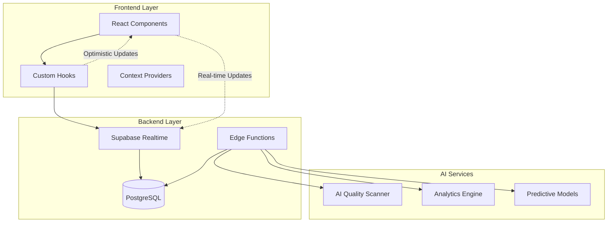
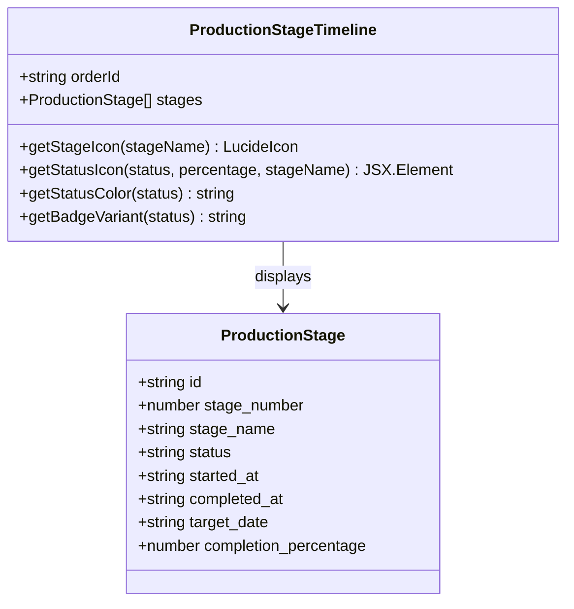
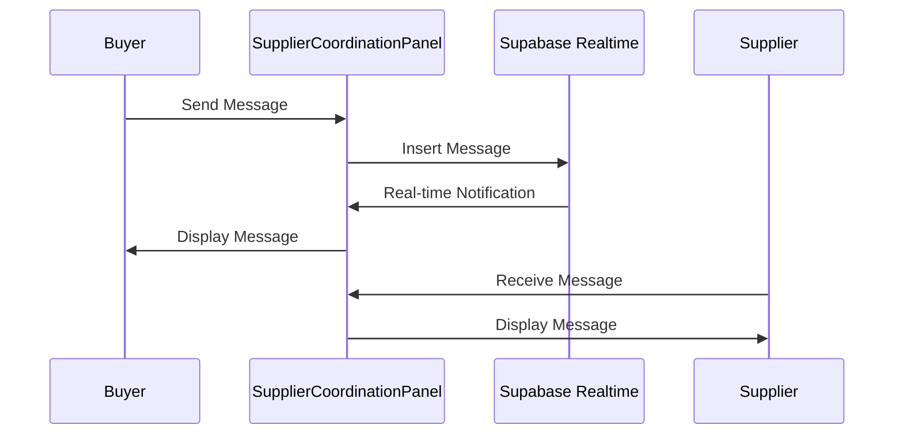
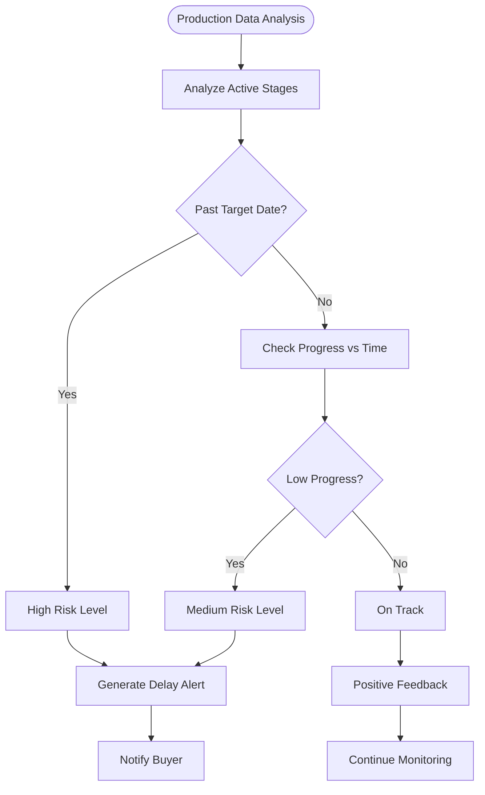
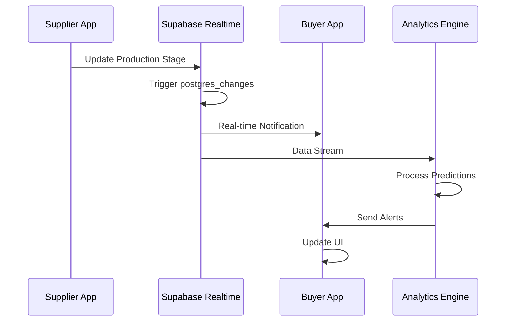
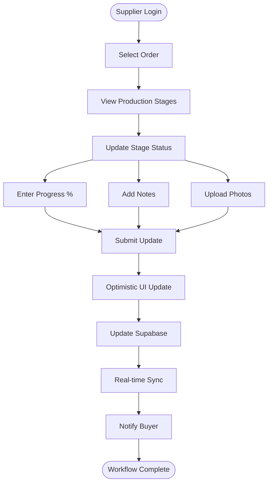
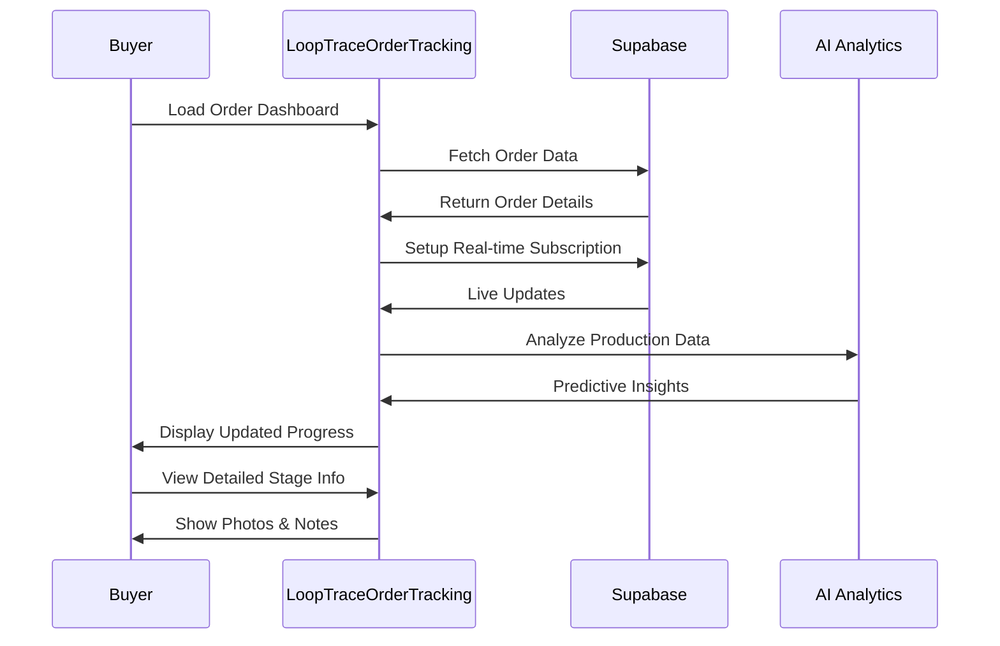
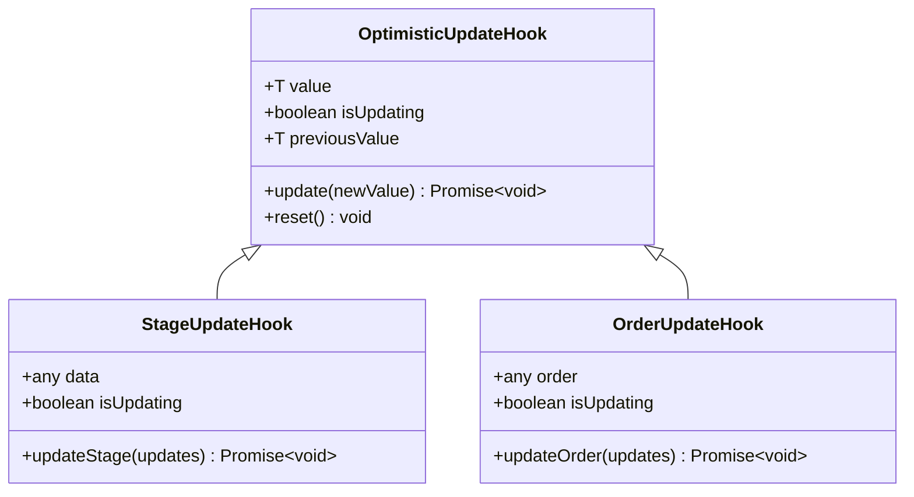
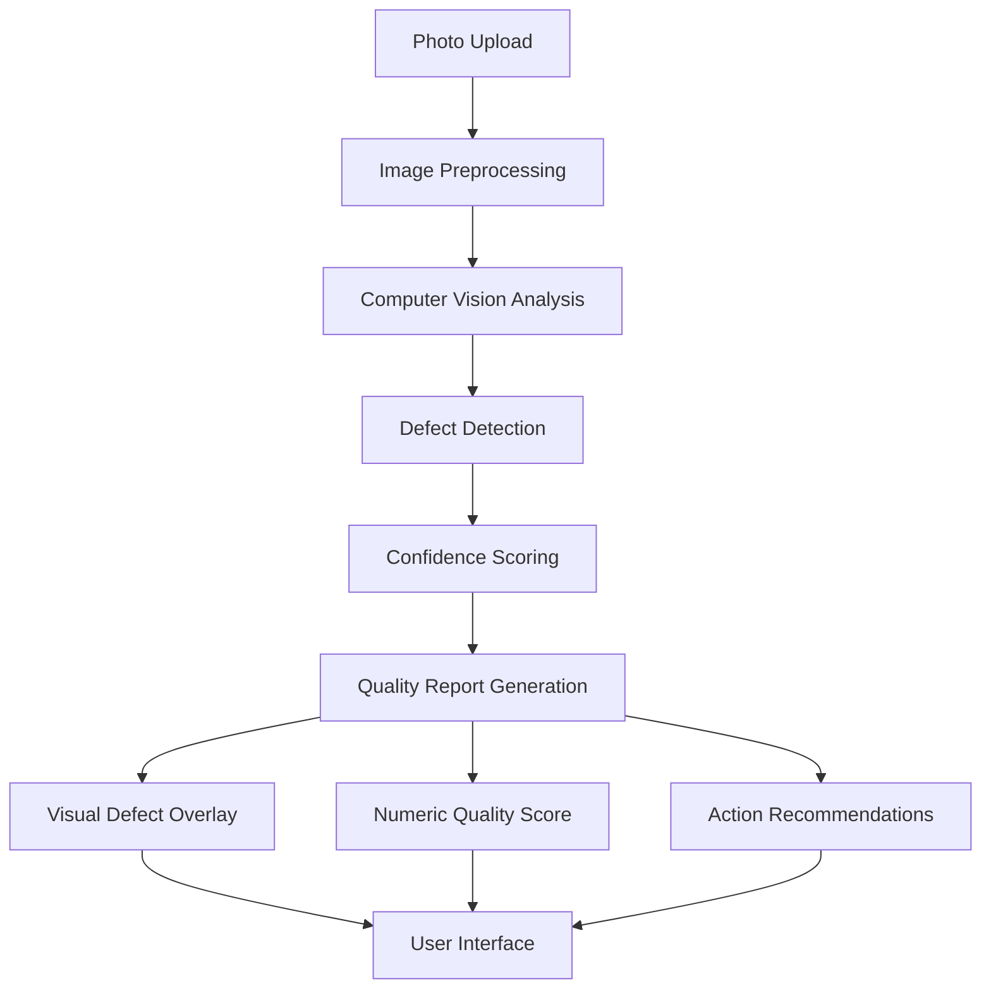

# LoopTrace™ Production Tracking

<cite>
**Referenced Files in This Document**
- [ProductionTracking.tsx](file://src/pages/ProductionTracking.tsx)
- [ProductionStageTimeline.tsx](file://src/components/production/ProductionStageTimeline.tsx)
- [SupplierCoordinationPanel.tsx](file://src/components/production/SupplierCoordinationPanel.tsx)
- [PredictiveDelayAlert.tsx](file://src/components/production/PredictiveDelayAlert.tsx)
- [LoopTraceOrderTracking.tsx](file://src/components/buyer/LoopTraceOrderTracking.tsx)
- [ProductionAnalytics.tsx](file://src/components/production/ProductionAnalytics.tsx)
- [ProductionStageCard.tsx](file://src/components/production/ProductionStageCard.tsx)
- [AIQualityScanner.tsx](file://src/components/production/AIQualityScanner.tsx)
- [useOptimisticUpdate.ts](file://src/hooks/useOptimisticUpdate.ts)
- [client.ts](file://src/integrations/supabase/client.ts)
- [types.ts](file://src/integrations/supabase/types.ts)
- [20250123000000_relax_production_stages.sql](file://supabase/migrations/20250123000000_relax_production_stages.sql)
- [initialize-production-stages/index.ts](file://supabase/functions/initialize-production-stages/index.ts)
- [predict-quality-risks/index.ts](file://supabase/functions/predict-quality-risks/index.ts)
</cite>

## Table of Contents
1. [Introduction](#introduction)
2. [System Architecture](#system-architecture)
3. [Core Components](#core-components)
4. [Production Stages Overview](#production-stages-overview)
5. [Real-time Data Flow](#real-time-data-flow)
6. [Key Features](#key-features)
7. [User Workflows](#user-workflows)
8. [Technical Implementation](#technical-implementation)
9. [AI-Powered Analytics](#ai-powered-analytics)
10. [Performance Considerations](#performance-considerations)
11. [Troubleshooting Guide](#troubleshooting-guide)
12. [Conclusion](#conclusion)

## Introduction

LoopTrace™ Production Tracking is a comprehensive real-time visibility platform designed to provide end-to-end transparency across the entire manufacturing lifecycle. Built on React with Supabase real-time subscriptions, the system enables seamless coordination between buyers and suppliers while offering advanced AI-powered insights for optimal production management.

The platform covers eight critical manufacturing stages: Order Confirmation, Fabric Sourcing, Accessories Procurement, Cutting & Pattern Making, Sewing & Assembly, Quality Control, Finishing & Packaging, and Shipment & Delivery. Through sophisticated real-time data synchronization and predictive analytics, LoopTrace™ transforms traditional production tracking into an intelligent, proactive management system.

## System Architecture

LoopTrace™ follows a modern React-based architecture with Supabase serving as the real-time backend foundation. The system employs a reactive design pattern with optimistic updates and real-time subscriptions for immediate data synchronization.

**Diagram sources**
- [client.ts](file://src/integrations/supabase/client.ts#L1-L20)
- [useOptimisticUpdate.ts](file://src/hooks/useOptimisticUpdate.ts#L1-L176)

**Section sources**
- [client.ts](file://src/integrations/supabase/client.ts#L1-L20)
- [types.ts](file://src/integrations/supabase/types.ts#L1-L800)

## Core Components

The LoopTrace™ system consists of several interconnected components that work together to provide comprehensive production tracking capabilities:

### ProductionStageTimeline Component

The ProductionStageTimeline serves as the primary visual representation of the production journey, displaying all eight manufacturing stages in chronological order with real-time progress indicators.

**Diagram sources**
- [ProductionStageTimeline.tsx](file://src/components/production/ProductionStageTimeline.tsx#L6-L21)

### SupplierCoordinationPanel Component

This component facilitates direct communication between buyers and suppliers, enabling real-time collaboration and document sharing throughout the production process.

**Diagram sources**
- [SupplierCoordinationPanel.tsx](file://src/components/production/SupplierCoordinationPanel.tsx#L45-L67)

### PredictiveDelayAlert Component

The PredictiveDelayAlert component uses AI-powered algorithms to analyze production data and identify potential delays before they occur, providing proactive risk mitigation.

**Diagram sources**
- [PredictiveDelayAlert.tsx](file://src/components/production/PredictiveDelayAlert.tsx#L43-L119)

**Section sources**
- [ProductionStageTimeline.tsx](file://src/components/production/ProductionStageTimeline.tsx#L1-L183)
- [SupplierCoordinationPanel.tsx](file://src/components/production/SupplierCoordinationPanel.tsx#L1-L256)
- [PredictiveDelayAlert.tsx](file://src/components/production/PredictiveDelayAlert.tsx#L1-L247)

## Production Stages Overview

The LoopTrace™ system organizes production into eight standardized stages, each representing a critical phase in the manufacturing process:

| Stage Number | Stage Name | Duration | Description |
|--------------|------------|----------|-------------|
| 1 | Order Confirmation | 2 days | Initial order review and confirmation |
| 2 | Fabric & Trim Sourcing | 10 days | Sourcing of all necessary materials |
| 3 | Pattern & Grading | 5 days | Creating patterns and grading sizes |
| 4 | Cutting | 3 days | Cutting fabric according to patterns |
| 5 | Printing / Embroidery | 5 days | Applying prints or embroidery if applicable |
| 6 | Sewing & Assembly | 14 days | Main production phase |
| 7 | Washing & Finishing | 3 days | Washing, ironing, and finishing touches |
| 8 | Quality Control (Internal) | 2 days | Factory internal quality inspection |
| 9 | Final Inspection | 2 days | Third-party or final quality check |
| 10 | Packaging | 2 days | Packing items for shipment |

**Section sources**
- [20250123000000_relax_production_stages.sql](file://supabase/migrations/20250123000000_relax_production_stages.sql#L12-L23)

## Real-time Data Flow

LoopTrace™ employs Supabase's real-time capabilities to ensure immediate data synchronization across all connected clients. The system uses PostgreSQL change data capture (CDC) to trigger real-time updates whenever production data changes.

**Diagram sources**
- [ProductionTracking.tsx](file://src/pages/ProductionTracking.tsx#L48-L56)
- [LoopTraceOrderTracking.tsx](file://src/components/buyer/LoopTraceOrderTracking.tsx#L58-L119)

The real-time subscription mechanism ensures that all connected clients receive immediate updates without requiring manual refreshes. This creates a synchronized ecosystem where both buyers and suppliers can monitor production progress in real-time.

**Section sources**
- [ProductionTracking.tsx](file://src/pages/ProductionTracking.tsx#L48-L119)
- [LoopTraceOrderTracking.tsx](file://src/components/buyer/LoopTraceOrderTracking.tsx#L58-L119)

## Key Features

### AI-Powered Predictive Delay Alerts

The system employs sophisticated algorithms to predict potential production delays before they occur. By analyzing historical data, current progress, and external factors, the AI engine generates proactive alerts to help stakeholders take preventive actions.

**Key Capabilities:**
- Real-time progress tracking against target timelines
- Historical trend analysis for predictive modeling
- Automated risk assessment with confidence scoring
- Proactive alert generation with recommended actions
- Simulation mode for testing and training scenarios

### Photo Documentation at Each Stage

LoopTrace™ integrates visual documentation capabilities, allowing suppliers to upload photos at each production stage. This feature provides tangible evidence of production progress and quality standards.

**Implementation Features:**
- Drag-and-drop photo upload interface
- Cloud storage integration for scalable image hosting
- Responsive gallery display with zoom functionality
- Automatic thumbnail generation and preview
- Compliance verification through visual evidence

### Direct Messaging Between Buyers and Suppliers

The SupplierCoordinationPanel enables seamless communication between all parties involved in the production process. This feature fosters collaboration and ensures timely resolution of production issues.

**Communication Features:**
- Real-time message notifications
- Sender identification and role differentiation
- Attachment support for documents and images
- Read receipt tracking
- Threaded conversation organization

### Production Analytics Dashboard

The analytics dashboard provides comprehensive insights into production performance, quality metrics, and delivery predictions. Data visualization helps stakeholders make informed decisions and identify optimization opportunities.

**Analytics Capabilities:**
- Overall production progress tracking
- Stage-specific performance metrics
- Quality control effectiveness analysis
- Delivery timeline projections
- Comparative performance benchmarking

**Section sources**
- [PredictiveDelayAlert.tsx](file://src/components/production/PredictiveDelayAlert.tsx#L35-L247)
- [SupplierCoordinationPanel.tsx](file://src/components/production/SupplierCoordinationPanel.tsx#L37-L256)
- [ProductionAnalytics.tsx](file://src/components/production/ProductionAnalytics.tsx#L30-L249)

## User Workflows

### Supplier Workflow: Updating Production Stages

Suppliers use the ProductionStageCard component to update production status in real-time:

**Diagram sources**
- [ProductionStageCard.tsx](file://src/components/production/ProductionStageCard.tsx#L52-L412)

### Buyer Workflow: Monitoring Production Progress

Buyers utilize the LoopTraceOrderTracking component to monitor their orders in real-time:

**Diagram sources**
- [LoopTraceOrderTracking.tsx](file://src/components/buyer/LoopTraceOrderTracking.tsx#L41-L365)

**Section sources**
- [ProductionStageCard.tsx](file://src/components/production/ProductionStageCard.tsx#L52-L412)
- [LoopTraceOrderTracking.tsx](file://src/components/buyer/LoopTraceOrderTracking.tsx#L41-L365)

## Technical Implementation

### Optimistic Updates Architecture

LoopTrace™ implements optimistic updates to enhance user experience by immediately reflecting changes in the UI before server confirmation. This approach reduces perceived latency and improves interactivity.

**Diagram sources**
- [useOptimisticUpdate.ts](file://src/hooks/useOptimisticUpdate.ts#L16-L176)

### Supabase Integration

The system leverages Supabase's comprehensive suite of services for data management and real-time capabilities:

**Database Schema:**
- Production stages with status tracking
- Supplier coordination messages
- Quality control records
- Analytics and prediction data

**Real-time Features:**
- PostgreSQL change data capture
- WebSocket connections for instant updates
- Channel-based subscription management
- Automatic reconnection handling

**Section sources**
- [useOptimisticUpdate.ts](file://src/hooks/useOptimisticUpdate.ts#L1-L176)
- [client.ts](file://src/integrations/supabase/client.ts#L1-L20)

## AI-Powered Analytics

### Quality Control Integration

The AIQualityScanner component demonstrates the system's advanced AI capabilities, using computer vision to analyze production quality in real-time:

**Diagram sources**
- [AIQualityScanner.tsx](file://src/components/production/AIQualityScanner.tsx#L8-L224)

### Predictive Analytics Engine

The predictive analytics system combines historical data with machine learning to forecast production outcomes:

**Data Sources:**
- Historical production stage completion times
- Supplier performance metrics
- Material availability data
- Seasonal demand patterns

**Prediction Models:**
- Delivery timeline forecasting
- Quality risk assessment
- Capacity utilization optimization
- Bottleneck identification

**Section sources**
- [AIQualityScanner.tsx](file://src/components/production/AIQualityScanner.tsx#L1-L224)
- [predict-quality-risks/index.ts](file://supabase/functions/predict-quality-risks/index.ts#L68-L107)

## Performance Considerations

### Real-time Subscription Management

The system implements efficient subscription management to handle multiple concurrent connections:

**Optimization Strategies:**
- Channel-based filtering to reduce network traffic
- Automatic cleanup of unused subscriptions
- Connection pooling for database efficiency
- Debounced updates to prevent excessive API calls

### Scalability Architecture

LoopTrace™ is designed to scale horizontally with growing user bases and production volumes:

**Scaling Features:**
- Stateless frontend architecture
- Database indexing for fast queries
- Edge functions for distributed processing
- CDN integration for static assets

### Caching Strategies

Intelligent caching reduces server load and improves response times:

**Cache Layers:**
- Browser caching for static resources
- Application-level caching for frequently accessed data
- Database query result caching
- CDN caching for production images

## Troubleshooting Guide

### Common Issues and Solutions

**Real-time Updates Not Working:**
1. Verify internet connectivity
2. Check browser WebSocket support
3. Review Supabase connection status
4. Clear browser cache and reload

**Optimistic Updates Failing:**
1. Confirm database connectivity
2. Check for network timeouts
3. Verify user authentication
4. Review error logs for specific failures

**AI Analysis Not Responding:**
1. Verify AI service availability
2. Check API rate limits
3. Review image format compatibility
4. Test with smaller images

**Section sources**
- [useOptimisticUpdate.ts](file://src/hooks/useOptimisticUpdate.ts#L50-L62)
- [SupplierCoordinationPanel.tsx](file://src/components/production/SupplierCoordinationPanel.tsx#L65-L67)

## Conclusion

LoopTrace™ Production Tracking represents a paradigm shift in manufacturing visibility and control. By combining real-time data synchronization, AI-powered analytics, and intuitive user interfaces, the system empowers both buyers and suppliers to collaborate effectively while maintaining strict oversight of production processes.

The platform's modular architecture ensures scalability and maintainability, while its emphasis on optimistic updates and real-time subscriptions delivers exceptional user experiences. As manufacturing continues to evolve toward digital transformation, LoopTrace™ provides the foundation for intelligent, data-driven production management that adapts to the dynamic demands of modern supply chains.

Through continuous innovation in AI capabilities, user experience design, and system architecture, LoopTrace™ sets a new standard for production tracking solutions, enabling businesses to achieve unprecedented levels of efficiency, quality, and customer satisfaction.