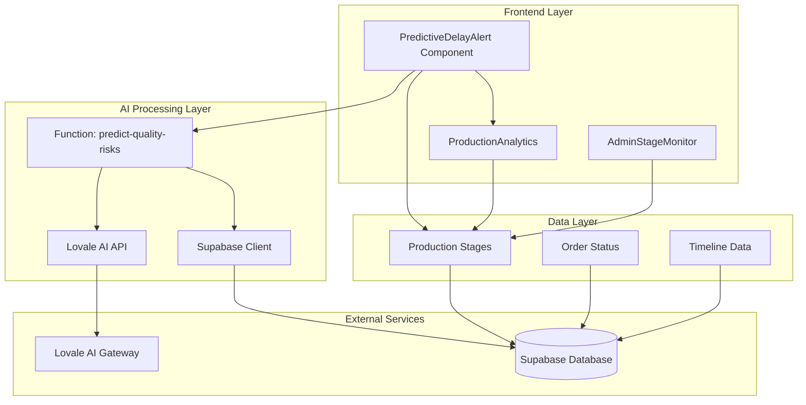
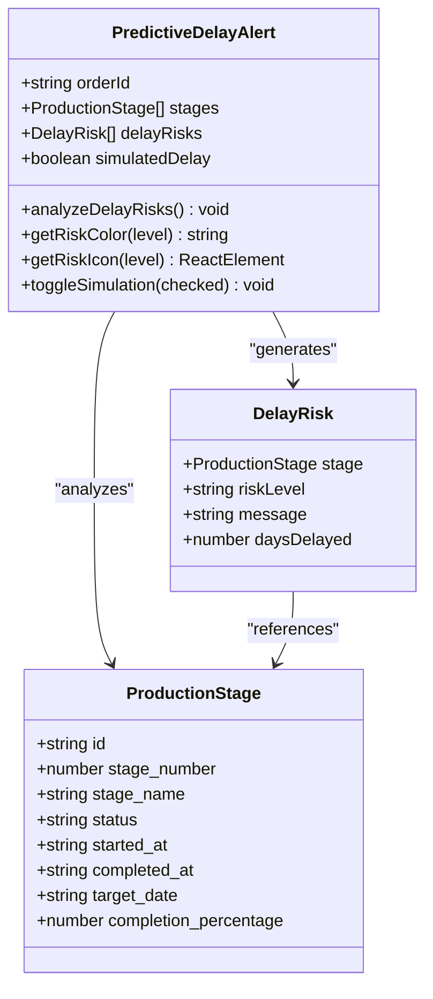
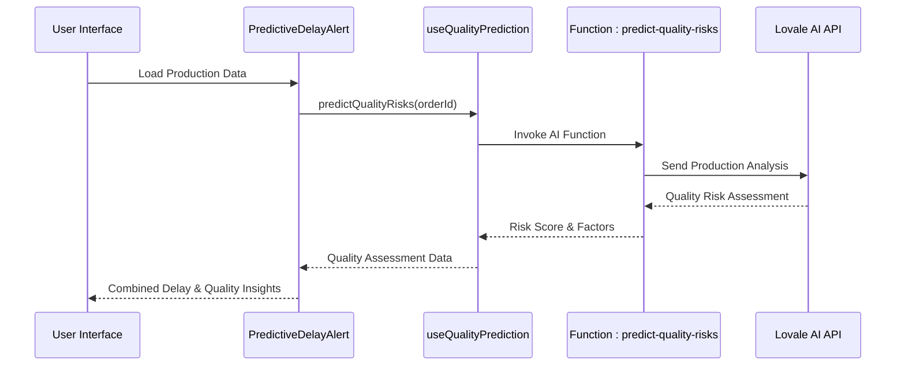
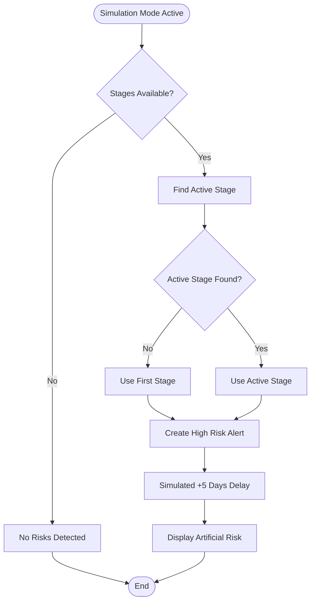
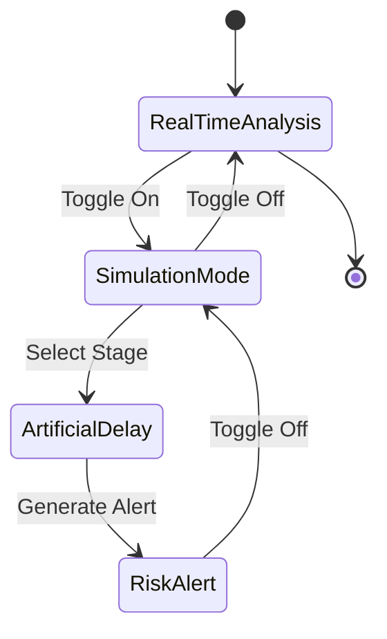
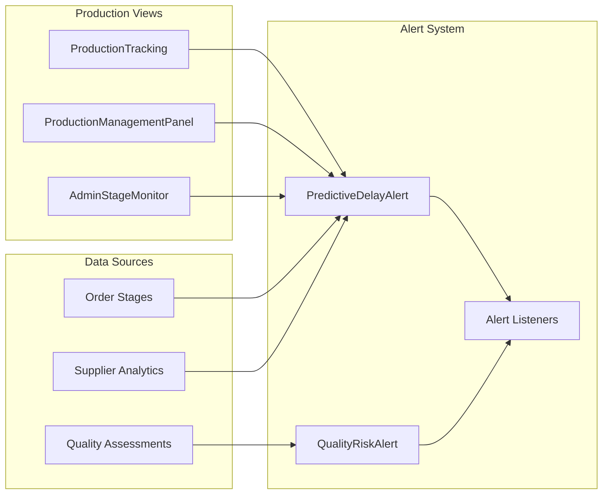
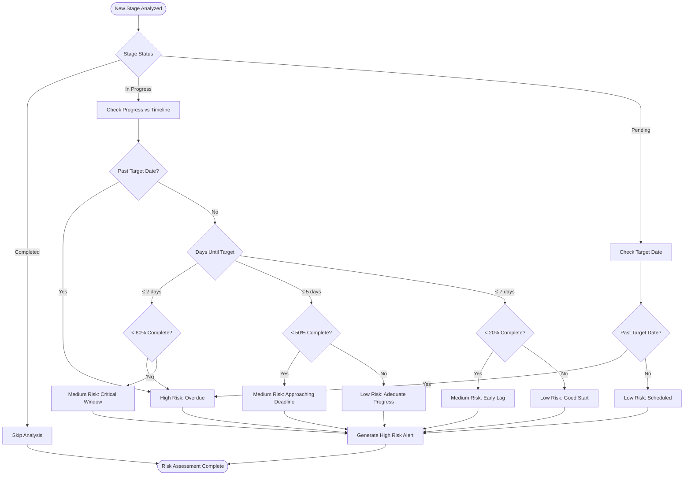
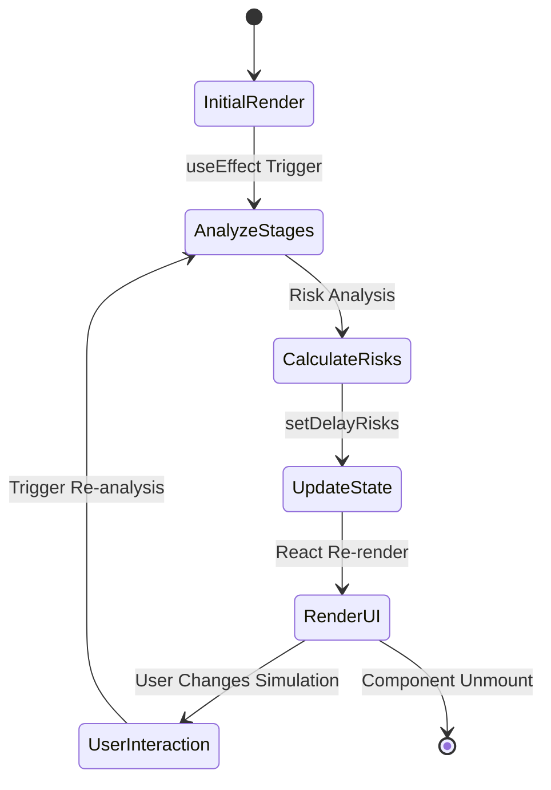

# Predictive Delay Alerts

<cite>
**Referenced Files in This Document**
- [PredictiveDelayAlert.tsx](file://src/components/production/PredictiveDelayAlert.tsx)
- [ProductionTracking.tsx](file://src/pages/ProductionTracking.tsx)
- [ProductionAnalytics.tsx](file://src/components/production/ProductionAnalytics.tsx)
- [QualityRiskAlert.tsx](file://src/components/production/QualityRiskAlert.tsx)
- [useQualityPrediction.ts](file://src/hooks/useQualityPrediction.ts)
- [predict-quality-risks/index.ts](file://supabase/functions/predict-quality-risks/index.ts)
- [AdminStageMonitor.tsx](file://src/components/admin/AdminStageMonitor.tsx)
- [ProductionStageManager.tsx](file://src/components/supplier/ProductionStageManager.tsx)
</cite>

## Table of Contents
1. [Introduction](#introduction)
2. [System Architecture](#system-architecture)
3. [Core Components](#core-components)
4. [Risk Analysis Logic](#risk-analysis-logic)
5. [Interface and Props](#interface-and-props)
6. [Simulation Mode](#simulation-mode)
7. [Integration Points](#integration-points)
8. [Risk Level Classification](#risk-level-classification)
9. [Common Issues and Solutions](#common-issues-and-solutions)
10. [Technical Implementation Details](#technical-implementation-details)
11. [Best Practices](#best-practices)
12. [Conclusion](#conclusion)

## Introduction

The Predictive Delay Alert system is an AI-powered risk detection component designed to analyze production stage data and identify potential delays in manufacturing processes. Built as part of the Sleek Apparels production tracking platform, this system provides real-time insights into production timelines by evaluating target dates, completion percentages, and current status against sophisticated heuristics.

The system operates as a proactive monitoring tool that helps stakeholders anticipate bottlenecks, manage supply chain disruptions, and optimize production schedules. It combines simple heuristic analysis with AI-driven predictions to deliver actionable insights for production management.

## System Architecture

The Predictive Delay Alert system follows a modular architecture with clear separation between frontend presentation logic and backend AI processing capabilities.



**Diagram sources**
- [PredictiveDelayAlert.tsx](file://src/components/production/PredictiveDelayAlert.tsx#L34-L36)
- [predict-quality-risks/index.ts](file://supabase/functions/predict-quality-risks/index.ts#L14-L131)

## Core Components

The system consists of several interconnected components that work together to provide comprehensive delay prediction capabilities.

### PredictiveDelayAlert Component

The main component serves as the primary interface for delay risk analysis, implementing a sophisticated heuristic-based evaluation system.



**Diagram sources**
- [PredictiveDelayAlert.tsx](file://src/components/production/PredictiveDelayAlert.tsx#L12-L33)

### Quality Risk Assessment Integration

The system integrates with quality risk assessment capabilities to provide comprehensive production insights.



**Diagram sources**
- [PredictiveDelayAlert.tsx](file://src/components/production/PredictiveDelayAlert.tsx#L34-L36)
- [useQualityPrediction.ts](file://src/hooks/useQualityPrediction.ts#L16-L55)

**Section sources**
- [PredictiveDelayAlert.tsx](file://src/components/production/PredictiveDelayAlert.tsx#L1-L247)
- [useQualityPrediction.ts](file://src/hooks/useQualityPrediction.ts#L1-L56)

## Risk Analysis Logic

The predictive delay alert system employs a multi-layered heuristic approach to evaluate production stages and identify potential delays.

### Primary Risk Detection Criteria

The system evaluates stages based on several key indicators:

1. **Overdue Stages**: Stages that have exceeded their target dates
2. **Progress Lag**: Insufficient completion percentage nearing deadline
3. **Pending Bottlenecks**: Stages scheduled to start but haven't begun
4. **Velocity Analysis**: Current production speed compared to targets

### Heuristic Evaluation Matrix

| Condition | Risk Level | Days Until Target | Completion Percentage | Message Pattern |
|-----------|------------|-------------------|----------------------|-----------------|
| Past target date | High | N/A | N/A | "Stage is X days overdue" |
| ≤ 2 days left, < 80% complete | High | ≤ 2 | < 80 | "Critical: X days left but Y% complete" |
| ≤ 5 days left, < 50% complete | Medium | ≤ 5 | < 50 | "At Risk: X days until deadline, Y% complete" |
| < 20% complete, ≤ 7 days left | Medium | ≤ 7 | < 20 | "Progress lagging: only Y% complete with 1 week remaining" |
| Target date passed, pending stage | High | < 0 | N/A | "Bottleneck: Stage hasn't started but target date has passed" |

### Simulation Mode Logic

During simulation mode, the system injects artificial delays to test alert responsiveness:



**Diagram sources**
- [PredictiveDelayAlert.tsx](file://src/components/production/PredictiveDelayAlert.tsx#L47-L57)

**Section sources**
- [PredictiveDelayAlert.tsx](file://src/components/production/PredictiveDelayAlert.tsx#L43-L119)

## Interface and Props

The Predictive Delay Alert component follows a clean, declarative interface pattern that makes it easy to integrate into various production tracking views.

### Component Interface

```typescript
interface PredictiveDelayAlertProps {
  orderId: string;
  stages: ProductionStage[];
}

interface ProductionStage {
  id: string;
  stage_number: number;
  stage_name: string;
  status: string;
  started_at: string | null;
  completed_at: string | null;
  target_date: string | null;
  completion_percentage: number | null;
}
```

### Props Usage Patterns

The component accepts two primary props that drive its analytical capabilities:

- **orderId**: Unique identifier for the production order, used for logging and correlation
- **stages**: Array of production stages containing temporal and progress data

### Integration Examples

The component is seamlessly integrated into the production tracking dashboard:

```typescript
// Production Tracking Page Integration
<PredictiveDelayAlert 
  orderId={selectedOrder.id}
  stages={selectedOrder.production_stages || []}
/>
```

**Section sources**
- [PredictiveDelayAlert.tsx](file://src/components/production/PredictiveDelayAlert.tsx#L23-L33)
- [ProductionTracking.tsx](file://src/pages/ProductionTracking.tsx#L511-L514)

## Simulation Mode

The simulation mode feature provides a powerful testing capability that allows users to validate the alert system's responsiveness without relying on real production data.

### Simulation Features

1. **Artificial Delay Injection**: Randomly selects an active stage and applies a 5-day delay
2. **Real-time Feedback**: Provides immediate visual and auditory notifications
3. **Educational Tool**: Helps users understand alert triggers and thresholds
4. **Development Testing**: Enables QA teams to verify alert logic

### Simulation Implementation

The simulation mode toggles between real-time analysis and artificial scenario generation:



**Diagram sources**
- [PredictiveDelayAlert.tsx](file://src/components/production/PredictiveDelayAlert.tsx#L148-L159)

### User Experience

The simulation mode provides intuitive feedback mechanisms:

- **Visual Indicators**: Color-coded alerts with pulsing animations
- **Toast Notifications**: Contextual messages about mode activation/deactivation
- **Descriptive Messages**: Clear explanations of simulated scenarios

**Section sources**
- [PredictiveDelayAlert.tsx](file://src/components/production/PredictiveDelayAlert.tsx#L47-L57)
- [PredictiveDelayAlert.tsx](file://src/components/production/PredictiveDelayAlert.tsx#L148-L159)

## Integration Points

The Predictive Delay Alert system integrates with multiple components across the production ecosystem to provide comprehensive monitoring capabilities.

### Frontend Integration



**Diagram sources**
- [ProductionTracking.tsx](file://src/pages\ProductionTracking.tsx#L511-L514)
- [AdminStageMonitor.tsx](file://src/components\admin\AdminStageMonitor.tsx#L12-L13)

### Backend Integration

The system leverages Supabase for data persistence and AI function invocation:

- **Data Storage**: Production stages stored in `production_stages` table
- **AI Processing**: Quality risk assessments via serverless function
- **Real-time Updates**: WebSocket connections for live data streaming

**Section sources**
- [ProductionTracking.tsx](file://src/pages\ProductionTracking.tsx#L506-L515)
- [predict-quality-risks/index.ts](file://supabase/functions\predict-quality-risks\index.ts#L24-L41)

## Risk Level Classification

The system employs a three-tier risk classification system that provides clear, actionable insights for production management.

### Risk Level Definitions

| Risk Level | Color Coding | Icon | Threshold Conditions | Recommended Action |
|------------|--------------|------|---------------------|-------------------|
| **High** | Red border, red text | ⚠️ (Pulsing) | Overdue stages, critical progress lag | Expedite current stage or adjust deadlines |
| **Medium** | Yellow border, yellow text | ⏰ | Approaching deadlines, moderate progress lag | Monitor closely, prepare contingency plans |
| **Low** | Blue border, blue text | ↗️ (Static) | On-track production, minor delays acceptable | Continue current pace, periodic checks |

### Risk Level Calculation Logic



**Diagram sources**
- [PredictiveDelayAlert.tsx](file://src/components\production\PredictiveDelayAlert.tsx#L60-L117)

### Visual Representation

The risk levels are visually represented through consistent color schemes and iconography:

- **High Risk**: Red borders with pulsing warning icons
- **Medium Risk**: Yellow borders with static clock icons  
- **Low Risk**: Blue borders with upward trend indicators

**Section sources**
- [PredictiveDelayAlert.tsx](file://src/components\production\PredictiveDelayAlert.tsx#L122-L146)
- [PredictiveDelayAlert.tsx](file://src/components\production\PredictiveDelayAlert.tsx#L60-L117)

## Common Issues and Solutions

### False Positive Prevention

The system implements several strategies to minimize false positive alerts:

1. **Historical Context Analysis**: Considers previous stage performance trends
2. **External Factor Recognition**: Accounts for supply chain disruptions
3. **Progress Velocity Tracking**: Evaluates acceleration/deceleration patterns
4. **Multiple Data Point Validation**: Cross-references with quality assessments

### Accuracy Improvement Strategies

#### Data Quality Enhancements
- **Timestamp Precision**: Ensures accurate day calculations using date-fns library
- **Percentage Validation**: Enforces completion percentage bounds (0-100)
- **Null Handling**: Gracefully manages missing target dates or completion data

#### Algorithm Refinements
- **Progress Weighting**: Applies different weights to early vs late-stage activities
- **Stage Duration Normalization**: Adjusts expectations based on typical stage durations
- **Supplier Performance Integration**: Incorporates historical supplier reliability metrics

### Performance Optimization

#### Computational Efficiency
- **Memoization**: Uses React.memo for expensive calculations
- **Selective Re-rendering**: Only updates when stages or simulation mode change
- **Debounced Calculations**: Prevents excessive re-computation during rapid updates

#### Memory Management
- **State Optimization**: Minimizes state updates to essential changes
- **Cleanup Functions**: Properly handles effect cleanup in React components
- **Resource Pooling**: Reuses calculation resources across multiple analyses

**Section sources**
- [PredictiveDelayAlert.tsx](file://src/components\production\PredictiveDelayAlert.tsx#L39-L41)
- [PredictiveDelayAlert.tsx](file://src/components\production\PredictiveDelayAlert.tsx#L119-L120)

## Technical Implementation Details

### Date and Time Management

The system relies heavily on precise date calculations using the date-fns library:

```typescript
// Key date calculation utilities
const daysUntilTarget = differenceInDays(targetDate, now);
const progress = stage.completion_percentage || 0;
```

### State Management Architecture

The component implements a reactive state management pattern:



**Diagram sources**
- [PredictiveDelayAlert.tsx](file://src/components\production\PredictiveDelayAlert.tsx#L39-L41)

### Error Handling and Resilience

The system implements robust error handling mechanisms:

- **Graceful Degradation**: Continues functioning even with partial data failures
- **Validation Layers**: Checks for null values and invalid date formats
- **Fallback Logic**: Provides default values when calculations fail
- **Logging Integration**: Comprehensive console logging for debugging

### Accessibility Features

The component incorporates accessibility best practices:

- **Semantic HTML**: Proper use of HTML elements for screen readers
- **Keyboard Navigation**: Full keyboard support for interactive elements
- **Color Contrast**: High contrast ratios for risk level differentiation
- **ARIA Labels**: Descriptive labels for complex visual elements

**Section sources**
- [PredictiveDelayAlert.tsx](file://src/components\production\PredictiveDelayAlert.tsx#L8-L9)
- [PredictiveDelayAlert.tsx](file://src/components\production\PredictiveDelayAlert.tsx#L39-L41)

## Best Practices

### Development Guidelines

1. **Component Composition**: Use the PredictiveDelayAlert as a standalone component
2. **Data Validation**: Always validate stage data before passing to the component
3. **Error Boundaries**: Implement proper error boundaries around AI function calls
4. **Performance Monitoring**: Monitor component render times and optimize accordingly

### Operational Best Practices

1. **Regular Testing**: Use simulation mode for regular system validation
2. **Threshold Tuning**: Adjust heuristic parameters based on production patterns
3. **User Training**: Educate stakeholders on interpreting risk levels
4. **Feedback Collection**: Gather user feedback to improve alert accuracy

### Integration Recommendations

1. **Consistent Data Format**: Maintain uniform stage data structures across systems
2. **Real-time Updates**: Implement WebSocket connections for live data streaming
3. **Multi-user Support**: Ensure thread-safe data access patterns
4. **Scalability Planning**: Design for handling large numbers of concurrent orders

## Conclusion

The Predictive Delay Alert system represents a sophisticated approach to production risk management, combining simple heuristic analysis with AI-powered insights to provide actionable delay predictions. Its modular architecture enables seamless integration across the production ecosystem while maintaining flexibility for customization and enhancement.

The system's strength lies in its dual approach: simple, reliable heuristics for immediate insights combined with AI-driven quality assessments for comprehensive risk evaluation. The simulation mode feature adds significant value by enabling testing and training without affecting real production data.

Future enhancements could include machine learning model integration for more accurate predictions, expanded supplier performance metrics, and enhanced visualization capabilities for complex production networks. The current implementation provides a solid foundation for these advanced features while maintaining operational reliability and user accessibility.