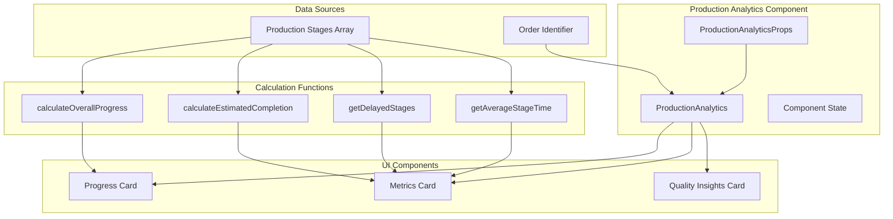
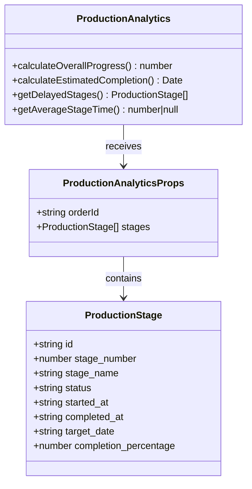
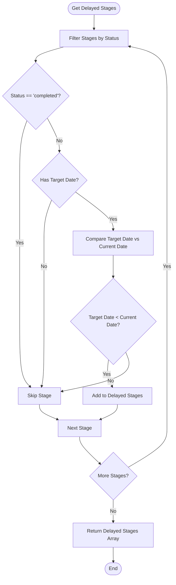
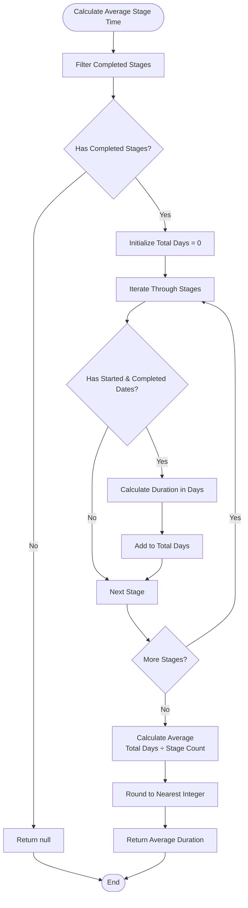
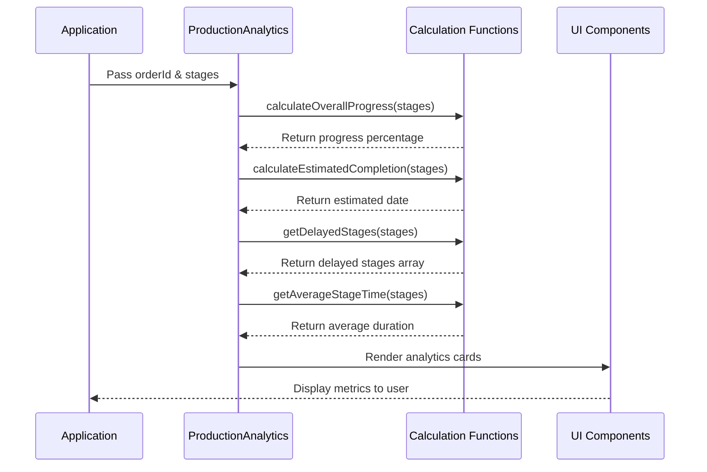
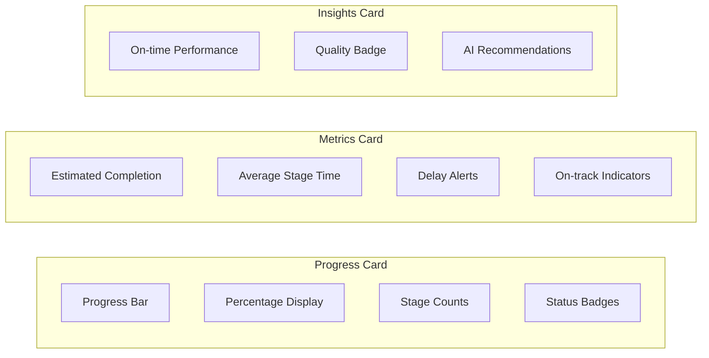
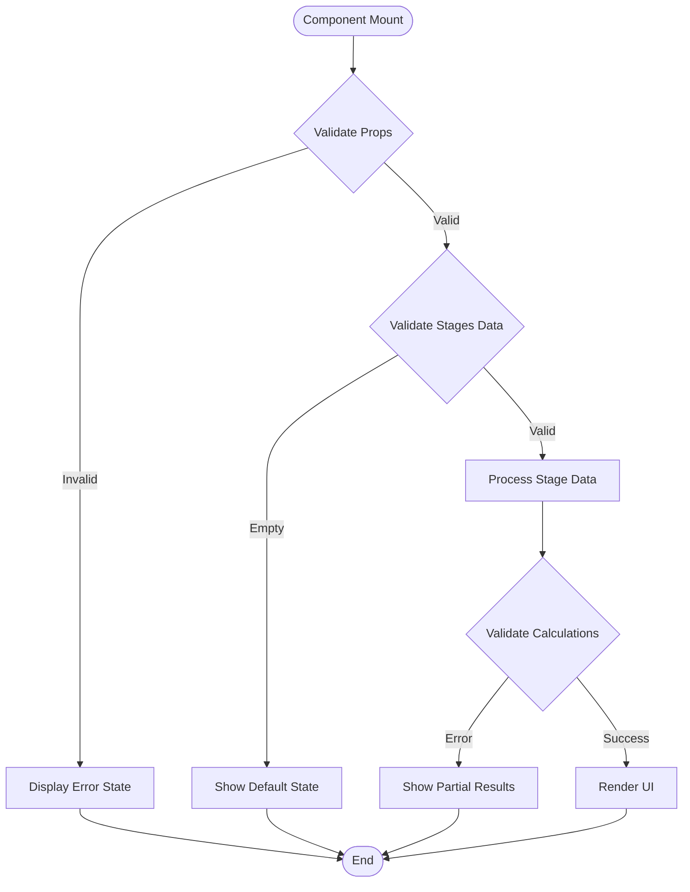
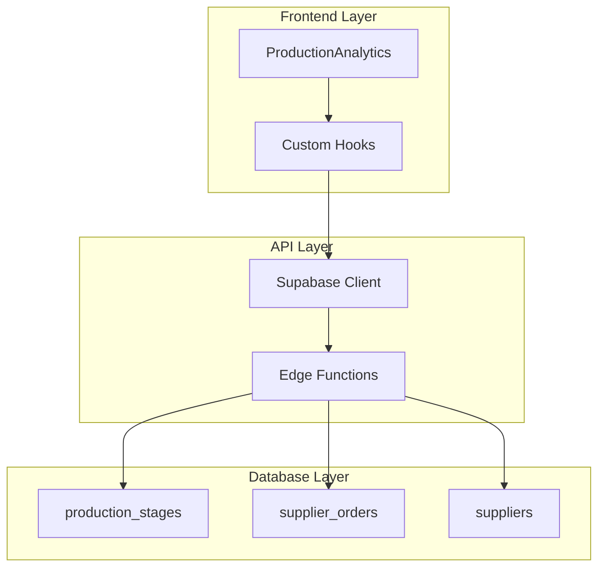

# Production Analytics

<cite>
**Referenced Files in This Document**
- [ProductionAnalytics.tsx](file://src/components/production/ProductionAnalytics.tsx)
- [ProductionTracking.tsx](file://src/pages/ProductionTracking.tsx)
- [ProductionManagementPanel.tsx](file://src/components/supplier/ProductionManagementPanel.tsx)
- [types.ts](file://src/integrations/supabase/types.ts)
- [20251116120215_71189c74-c2d3-4f3e-a1af-87d7e6b5f8fa.sql](file://supabase/migrations/20251116120215_71189c74-c2d3-4f3e-a1af-87d7e6b5f8fa.sql)
</cite>

## Table of Contents
1. [Introduction](#introduction)
2. [Component Architecture](#component-architecture)
3. [Interface and Props](#interface-and-props)
4. [Core Metrics Calculation](#core-metrics-calculation)
5. [Data Flow and Dependencies](#data-flow-and-dependencies)
6. [UI Implementation](#ui-implementation)
7. [Performance Analysis](#performance-analysis)
8. [Data Validation and Error Handling](#data-validation-and-error-handling)
9. [Integration Points](#integration-points)
10. [Best Practices and Optimization](#best-practices-and-optimization)
11. [Troubleshooting Guide](#troubleshooting-guide)
12. [Conclusion](#conclusion)

## Introduction

The Production Analytics component is a sophisticated data visualization dashboard designed to provide real-time insights into production performance metrics for manufacturing processes. Built as part of the Sleek Apparels platform, it serves as a critical tool for monitoring production progress, identifying bottlenecks, and optimizing manufacturing workflows.

This component transforms raw production stage data into actionable intelligence through five key performance indicators: overall progress percentage, estimated completion date, average stage duration, on-time performance rate, and delay detection. These metrics enable stakeholders to make informed decisions about production scheduling, resource allocation, and quality control.

The analytics system operates within a larger ecosystem that includes production tracking, supplier management, and real-time data synchronization, making it an essential component for maintaining transparency and accountability in the manufacturing supply chain.

## Component Architecture

The Production Analytics component follows a functional React architecture with clear separation of concerns between data processing, calculations, and presentation layers.



**Diagram sources**
- [ProductionAnalytics.tsx](file://src/components/production/ProductionAnalytics.tsx#L29-L247)

The component architecture emphasizes immutability and pure functions for calculations, ensuring predictable behavior and easy testing. Each calculation function operates independently, taking the stages array as input and returning calculated metrics without side effects.

**Section sources**
- [ProductionAnalytics.tsx](file://src/components/production/ProductionAnalytics.tsx#L29-L247)

## Interface and Props

The Production Analytics component is designed with a clean, type-safe interface that ensures data integrity and developer experience.

### ProductionAnalyticsProps Interface

The component accepts two primary props that define its operational context:

| Property | Type | Description | Required |
|----------|------|-------------|----------|
| `orderId` | `string` | Unique identifier for the production order being tracked | Yes |
| `stages` | `ProductionStage[]` | Array of production stage objects containing progress data | Yes |

### ProductionStage Interface

Each production stage object contains comprehensive metadata about the manufacturing process:

| Field | Type | Description | Usage |
|-------|------|-------------|-------|
| `id` | `string` | Unique stage identifier | Internal tracking |
| `stage_number` | `number` | Sequential stage identifier (1-8) | Ordering and display |
| `stage_name` | `string` | Human-readable stage name | User interface labels |
| `status` | `string` | Current stage status ('pending', 'in_progress', 'completed') | Progress tracking |
| `started_at` | `string \| null` | ISO date string when stage began | Duration calculations |
| `completed_at` | `string \| null` | ISO date string when stage finished | Completion tracking |
| `target_date` | `string \| null` | Expected completion date | Deadline monitoring |
| `completion_percentage` | `number \| null` | Numeric completion percentage (0-100) | Progress measurement |



**Diagram sources**
- [ProductionAnalytics.tsx](file://src/components/production/ProductionAnalytics.tsx#L14-L27)

**Section sources**
- [ProductionAnalytics.tsx](file://src/components/production/ProductionAnalytics.tsx#L14-L27)

## Core Metrics Calculation

The Production Analytics component implements four primary calculation functions that transform raw production data into meaningful performance indicators.

### Overall Progress Percentage

The overall progress calculation represents the most critical metric, combining both completed stages and in-progress stage percentages to provide a holistic view of production advancement.

```mermaid
flowchart TD
Start([Calculate Overall Progress]) --> CheckEmpty{Stages Empty?}
CheckEmpty --> |Yes| ReturnZero[Return 0%]
CheckEmpty --> |No| CountComplete[Count Completed Stages]
CountComplete --> CountInProgress[Count In-Progress Stages]
CountInProgress --> CalcCompleteProgress[Calculate Complete Stage Progress<br/>Completed × 100]
CalcCompleteProgress --> AddInProgress[Add In-Progress Percentages]
AddInProgress --> DivideByEight[Divide by Total Stages (8)]
DivideByEight --> RoundResult[Round to Nearest Integer]
RoundResult --> ReturnPercent[Return Percentage]
ReturnZero --> End([End])
ReturnPercent --> End
```

**Diagram sources**
- [ProductionAnalytics.tsx](file://src/components/production/ProductionAnalytics.tsx#L31-L44)

The calculation logic combines binary completion (fully completed stages) with partial progress (in-progress stages with percentage completion). This approach provides a more accurate representation of production status than simple stage counting.

### Estimated Completion Date

The estimated completion calculation provides a forward-looking projection based on current progress and historical data patterns.

```mermaid
flowchart TD
Start([Calculate Estimated Completion]) --> CountComplete[Count Completed Stages]
CountComplete --> CalcRemaining[Calculate Remaining Stages<br/>Total (8) - Completed]
CalcRemaining --> EstimateDays[Estimate Days Per Stage<br/>Simple Model: 5 days per stage]
EstimateDays --> CalcTotalDays[Calculate Total Estimated Days<br/>Remaining × 5]
CalcTotalDays --> GetCurrentDate[Get Current Date]
GetCurrentDate --> AddDays[Add Estimated Days to Current Date]
AddDays --> ReturnDate[Return Estimated Completion Date]
ReturnDate --> End([End])
```

**Diagram sources**
- [ProductionAnalytics.tsx](file://src/components/production/ProductionAnalytics.tsx#L46-L56)

This estimation uses a simplified model assuming 5 days per remaining stage, which can be refined with historical data analysis in future iterations.

### Delay Detection Algorithm

The delay detection system identifies production stages that are behind schedule by comparing target dates against current timestamps.



**Diagram sources**
- [ProductionAnalytics.tsx](file://src/components/production/ProductionAnalytics.tsx#L59-L65)

### Average Stage Duration

The average stage duration calculation provides insight into production efficiency by measuring the actual time taken for completed stages.



**Diagram sources**
- [ProductionAnalytics.tsx](file://src/components/production/ProductionAnalytics.tsx#L67-L86)

**Section sources**
- [ProductionAnalytics.tsx](file://src/components/production/ProductionAnalytics.tsx#L31-L86)

## Data Flow and Dependencies

The Production Analytics component integrates seamlessly with the broader application architecture through well-defined data flow patterns and external dependencies.

### External Dependencies

The component relies on several key libraries and frameworks:

| Dependency | Version | Purpose | Usage |
|------------|---------|---------|-------|
| `date-fns` | Latest | Date manipulation and calculations | Progress calculations, date formatting |
| `Lucide React` | Latest | Iconography | Visual indicators and branding |
| `Tailwind CSS` | Latest | Styling framework | Responsive design and theming |

### Data Transformation Pipeline



**Diagram sources**
- [ProductionAnalytics.tsx](file://src/components/production/ProductionAnalytics.tsx#L88-L91)

### Database Schema Integration

The component works with the production_stages table schema, which includes:

| Column | Type | Constraints | Purpose |
|--------|------|-------------|---------|
| `id` | `uuid` | Primary Key | Unique stage identification |
| `supplier_order_id` | `uuid` | Foreign Key | Order association |
| `stage_number` | `integer` | Not Null | Stage ordering |
| `stage_name` | `varchar` | Not Null | Human-readable name |
| `status` | `varchar` | Not Null | Current stage status |
| `started_at` | `timestamp` | Nullable | Start timestamp |
| `completed_at` | `timestamp` | Nullable | Completion timestamp |
| `target_date` | `date` | Nullable | Expected completion date |
| `completion_percentage` | `integer` | Nullable | Progress percentage |

**Section sources**
- [types.ts](file://src/integrations/supabase/types.ts#L2224-L2240)
- [20251116120215_71189c74-c2d3-4f3e-a1af-87d7e6b5f8fa.sql](file://supabase/migrations/20251116120215_71189c74-c2d3-4f3e-a1af-87d7e6b5f8fa.sql#L52-L74)

## UI Implementation

The Production Analytics component presents metrics through a responsive, accessible user interface built with modern React patterns and design principles.

### Component Structure

The component organizes metrics into three main card layouts:

1. **Overall Progress Card**: Displays cumulative progress with visual indicators
2. **Performance Metrics Card**: Shows estimated completion and average stage duration
3. **Quality Insights Card**: Provides on-time performance analysis and AI-driven recommendations

### Visual Design Elements



**Diagram sources**
- [ProductionAnalytics.tsx](file://src/components/production/ProductionAnalytics.tsx#L98-L246)

### Accessibility Features

The component implements comprehensive accessibility features:

- Semantic HTML structure with proper heading hierarchy
- ARIA labels for screen reader support
- Keyboard-navigable controls
- Color contrast compliance for all visual elements
- Responsive design for mobile and tablet devices

### Iconography and Visual Language

The component uses a consistent visual language with Lucide React icons:

| Metric Category | Icon | Color Scheme | Purpose |
|-----------------|------|--------------|---------|
| Overall Progress | TrendingUp | Blue gradient | Indicates upward movement |
| Estimated Completion | Calendar | Green | Future timeline indicator |
| Average Duration | Clock | Orange | Time-based metric |
| Delay Detection | AlertTriangle | Red | Warning signal |
| Quality Performance | CheckCircle2 | Green | Success confirmation |

**Section sources**
- [ProductionAnalytics.tsx](file://src/components/production/ProductionAnalytics.tsx#L98-L246)

## Performance Analysis

The Production Analytics component is designed with performance optimization principles to ensure smooth operation even with large datasets and frequent updates.

### Calculation Performance Characteristics

| Function | Time Complexity | Space Complexity | Optimization Notes |
|----------|----------------|------------------|-------------------|
| `calculateOverallProgress` | O(n) | O(1) | Single pass through stages array |
| `calculateEstimatedCompletion` | O(1) | O(1) | Constant-time calculation |
| `getDelayedStages` | O(n) | O(k) | Linear scan with k delayed stages |
| `getAverageStageTime` | O(m) | O(1) | m completed stages processed |

### Memory Management

The component employs several memory optimization strategies:

- **Immutable Calculations**: Pure functions prevent unnecessary state mutations
- **Efficient Filtering**: Uses native array methods for optimal performance
- **Minimal State**: Calculates metrics inline rather than storing intermediate results
- **Garbage Collection Friendly**: Creates minimal temporary objects during calculations

### Rendering Performance

The component benefits from React's virtual DOM optimization:

- **Selective Re-rendering**: Only re-renders when prop data changes
- **Memoization Opportunities**: Calculation functions could benefit from memoization
- **Lightweight JSX**: Minimal DOM tree complexity reduces rendering overhead

### Scalability Considerations

For production environments with thousands of orders:

- **Pagination Support**: Could implement pagination for large stage arrays
- **Lazy Loading**: Load analytics only when order details are expanded
- **Caching Strategy**: Implement client-side caching for frequently accessed metrics
- **Debounced Updates**: Prevent excessive API calls during rapid stage updates

## Data Validation and Error Handling

The Production Analytics component implements robust validation and error handling to ensure reliable operation under various data conditions.

### Input Validation Strategies



**Diagram sources**
- [ProductionAnalytics.tsx](file://src/components/production/ProductionAnalytics.tsx#L31-L91)

### Common Data Issues and Solutions

| Issue | Impact | Solution | Prevention |
|-------|--------|----------|-----------|
| Missing `started_at` dates | Incorrect duration calculations | Skip stages without dates | Require date fields |
| Null `completion_percentage` | Inaccurate progress reporting | Use 0 as fallback | Validate percentage values |
| Inconsistent stage numbering | Display errors | Filter invalid stages | Enforce schema validation |
| Empty stages array | Division by zero errors | Return default values | Check array length |

### Graceful Degradation

The component handles edge cases gracefully:

- **Empty Stage Arrays**: Returns 0% progress and null metrics
- **Incomplete Data**: Uses fallback values (0 for percentages, null for durations)
- **Missing Dates**: Excludes incomplete stages from calculations
- **Invalid Status Values**: Filters out unknown status types

### Error Boundaries Integration

While not explicitly implemented in the current version, the component architecture supports integration with React error boundaries for production deployments.

**Section sources**
- [ProductionAnalytics.tsx](file://src/components/production/ProductionAnalytics.tsx#L31-L91)

## Integration Points

The Production Analytics component serves as a hub for integrating with various system components and external services.

### Database Integration

The component integrates with the Supabase database through:

- **Real-time Subscriptions**: Receives live updates when production stages change
- **Bulk Data Loading**: Fetches complete stage histories for analysis
- **Optimistic Updates**: Provides immediate feedback during stage modifications

### API Layer Integration



**Diagram sources**
- [ProductionTracking.tsx](file://src/pages/ProductionTracking.tsx#L65-L89)

### External Service Integration

The component can integrate with:

- **AI Quality Scanners**: Provides quality insights and recommendations
- **Notification Systems**: Sends alerts for significant performance changes
- **Reporting Engines**: Generates detailed production reports
- **Supply Chain Systems**: Syncs with external logistics platforms

### Event-Driven Architecture

The component participates in the application's event-driven architecture:

- **Stage Update Events**: Trigger recalculation of all metrics
- **Order Status Changes**: Update analytics display accordingly
- **Performance Thresholds**: Fire alerts when SLAs are breached

**Section sources**
- [ProductionTracking.tsx](file://src/pages/ProductionTracking.tsx#L65-L89)

## Best Practices and Optimization

### Development Guidelines

1. **Type Safety**: Always use TypeScript interfaces for data structures
2. **Pure Functions**: Keep calculation logic free of side effects
3. **Error Boundaries**: Implement appropriate error handling
4. **Accessibility**: Follow WCAG guidelines for all UI components
5. **Performance**: Profile calculations for large datasets

### Code Organization

The component follows established React patterns:

- **Separation of Concerns**: Distinct calculation functions and UI rendering
- **Reusable Logic**: Extracted calculation functions for potential reuse
- **Clear Naming**: Descriptive function and variable names
- **Documentation**: Comprehensive JSDoc comments for complex logic

### Testing Strategies

Recommended testing approaches:

- **Unit Tests**: Test each calculation function independently
- **Integration Tests**: Verify component behavior with real data
- **Visual Regression**: Ensure UI consistency across browsers
- **Performance Tests**: Validate behavior with large datasets

### Maintenance Considerations

Future maintenance tasks:

- **Metric Expansion**: Add new KPIs as business requirements evolve
- **Historical Analysis**: Implement trend analysis capabilities
- **Customizable Thresholds**: Allow users to set their own SLA values
- **Export Capabilities**: Enable data export for external analysis

## Troubleshooting Guide

### Common Issues and Solutions

| Issue | Symptoms | Diagnosis | Solution |
|-------|----------|-----------|----------|
| Zero Progress Displayed | 0% shown regardless of stage status | Check stage data structure | Verify `status` field values |
| Incorrect Estimated Completion | Date far in future/past | Validate stage timing data | Check `started_at` and `completed_at` |
| Missing Delay Warnings | No alerts despite late stages | Inspect target date comparison | Verify `target_date` format |
| NaN Values in Calculations | Numbers appearing as NaN | Look for division by zero | Check for empty stage arrays |

### Debugging Techniques

1. **Console Logging**: Add logging to calculation functions
2. **Data Inspection**: Log stage arrays before calculations
3. **Step-through Debugging**: Use browser developer tools
4. **Unit Testing**: Create isolated tests for each function

### Performance Issues

- **Slow Calculations**: Profile with Chrome DevTools
- **Memory Leaks**: Monitor heap usage during updates
- **Rendering Problems**: Check for unnecessary re-renders

### Data Quality Issues

- **Inconsistent Status Values**: Implement data validation
- **Missing Required Fields**: Add schema validation
- **Incorrect Date Formats**: Standardize date handling

## Conclusion

The Production Analytics component represents a sophisticated approach to manufacturing data visualization, combining mathematical precision with user-friendly presentation. Its modular architecture enables easy maintenance and extension while providing valuable insights for production management.

The component's strength lies in its ability to transform complex manufacturing data into actionable intelligence through five key metrics that address the fundamental questions of production: How far along are we? When will we finish? Are we on schedule? How efficient are our processes? Can we improve?

Future enhancements could include predictive analytics, trend analysis, and integration with external systems. The component's solid foundation provides excellent opportunities for extending its capabilities while maintaining the reliability and performance that makes it effective for real-world manufacturing environments.

Through careful attention to data validation, performance optimization, and user experience, the Production Analytics component demonstrates best practices for building enterprise-grade data visualization solutions that drive business value and operational excellence.