# Production Stage Timeline

<cite>
**Referenced Files in This Document**
- [ProductionStageTimeline.tsx](file://src/components/production/ProductionStageTimeline.tsx)
- [ProductionTracking.tsx](file://src/pages/ProductionTracking.tsx)
- [ProductionStageCard.tsx](file://src/components/production/ProductionStageCard.tsx)
- [useOptimisticUpdate.ts](file://src/hooks/useOptimisticUpdate.ts)
- [initialize-production-stages/index.ts](file://supabase/functions/initialize-production-stages/index.ts)
- [20250123000000_relax_production_stages.sql](file://supabase/migrations/20250123000000_relax_production_stages.sql)
- [20251115150759_remix_migration_from_pg_dump.sql](file://supabase/migrations/20251115150759_remix_migration_from_pg_dump.sql)
</cite>

## Table of Contents
1. [Introduction](#introduction)
2. [Component Architecture](#component-architecture)
3. [Interface and Props](#interface-and-props)
4. [Data Structure and Flow](#data-structure-and-flow)
5. [Visual Representation System](#visual-representation-system)
6. [Sorting and Rendering Logic](#sorting-and-rendering-logic)
7. [Real-time Updates](#real-time-updates)
8. [Error Handling and Fallback States](#error-handling-and-fallback-states)
9. [Integration with Parent Components](#integration-with-parent-components)
10. [Common Issues and Solutions](#common-issues-and-solutions)
11. [Technical Implementation Details](#technical-implementation-details)
12. [Best Practices](#best-practices)

## Introduction

The Production Stage Timeline is a sophisticated vertical timeline visualization component that displays all 8 manufacturing stages in a production pipeline with real-time status updates. Built as part of the LoopTrace™ Technology platform, it provides comprehensive visibility into the manufacturing process for apparel production orders.

This component serves as a central hub for monitoring production progress, displaying stage-specific information, and enabling real-time collaboration between buyers, suppliers, and administrators. It transforms complex manufacturing data into an intuitive visual representation that enhances decision-making and process transparency.

## Component Architecture

The Production Stage Timeline follows a modular architecture with clear separation of concerns:

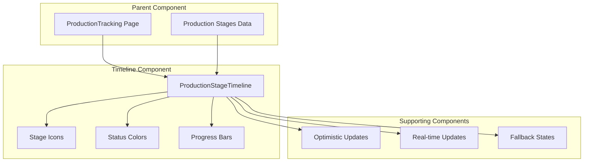

**Diagram sources**
- [ProductionTracking.tsx](file://src/pages/ProductionTracking.tsx#L475-L479)
- [ProductionStageTimeline.tsx](file://src/components/production/ProductionStageTimeline.tsx#L17-L183)

**Section sources**
- [ProductionStageTimeline.tsx](file://src/components/production/ProductionStageTimeline.tsx#L1-L183)
- [ProductionTracking.tsx](file://src/pages/ProductionTracking.tsx#L475-L479)

## Interface and Props

The component accepts two primary props that define its behavior and data source:

### ProductionStageTimelineProps Interface

| Property | Type | Description | Required |
|----------|------|-------------|----------|
| `orderId` | `string` | Unique identifier for the production order | Yes |
| `stages` | `ProductionStage[]` | Array of production stage objects containing status and timing data | Yes |

### ProductionStage Data Structure

Each production stage object contains comprehensive information about the manufacturing process:

| Field | Type | Description | Example Values |
|-------|------|-------------|----------------|
| `id` | `string` | Unique stage identifier | `"uuid-string"` |
| `stage_number` | `number` | Sequential stage identifier (1-8) | `1, 2, 3, ...` |
| `stage_name` | `string` | Human-readable stage name | `"Order Confirmation"`, `"Cutting & Pattern Making"` |
| `status` | `string` | Current stage status | `"pending"`, `"in_progress"`, `"completed"`, `"delayed"` |
| `started_at` | `string \| null` | ISO timestamp when stage began | `"2024-01-15T10:30:00Z"` |
| `completed_at` | `string \| null` | ISO timestamp when stage finished | `"2024-01-16T15:45:00Z"` |
| `target_date` | `string \| null` | Expected completion date | `"2024-01-17"` |
| `completion_percentage` | `number \| null` | Progress percentage (0-100) | `75` |

**Section sources**
- [ProductionStageTimeline.tsx](file://src/components/production/ProductionStageTimeline.tsx#L6-L16)

## Data Structure and Flow

The component receives production stage data from the parent ProductionTracking page through a structured data flow:

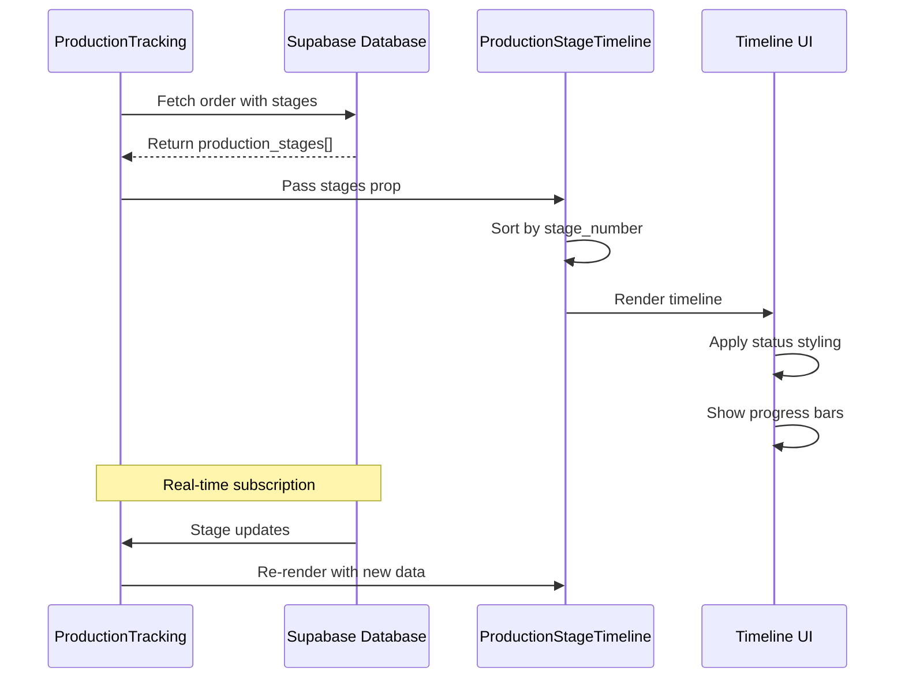

**Diagram sources**
- [ProductionTracking.tsx](file://src/pages/ProductionTracking.tsx#L65-L90)
- [ProductionStageTimeline.tsx](file://src/components/production/ProductionStageTimeline.tsx#L75-L76)

### Database Schema Integration

The component integrates with a PostgreSQL database schema that supports flexible production stage management:

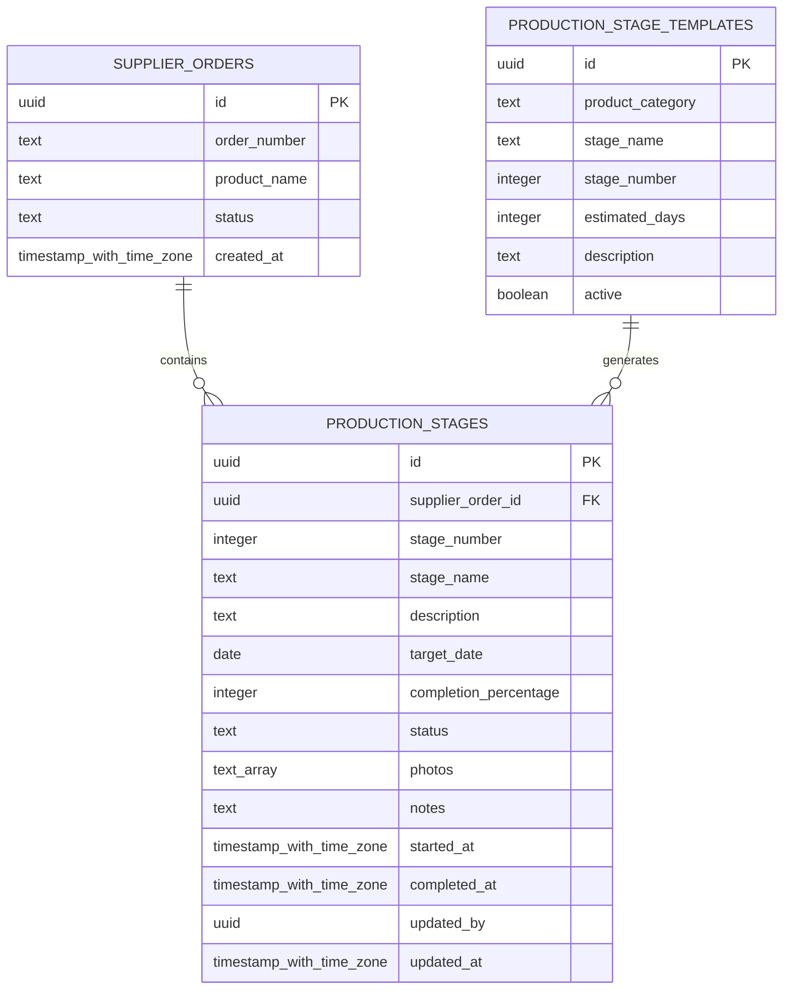

**Diagram sources**
- [20251115150759_remix_migration_from_pg_dump.sql](file://supabase/migrations/20251115150759_remix_migration_from_pg_dump.sql#L1393-L1408)
- [20250123000000_relax_production_stages.sql](file://supabase/migrations/20250123000000_relax_production_stages.sql#L12-L24)

**Section sources**
- [20251115150759_remix_migration_from_pg_dump.sql](file://supabase/migrations/20251115150759_remix_migration_from_pg_dump.sql#L1393-L1408)
- [ProductionTracking.tsx](file://src/pages/ProductionTracking.tsx#L65-L90)

## Visual Representation System

The component employs a sophisticated visual system that uses icons, colors, and animations to convey production stage status:

### Status-Based Visual Elements

| Status | Icon | Color | Animation | Description |
|--------|------|-------|-----------|-------------|
| `completed` | CheckCircle2 | Green-500 | Static | Stage successfully finished |
| `in_progress` | Dynamic (based on stage) | Blue-500 | Pulse animation | Active production stage |
| `delayed` | AlertTriangle | Red-500 | Static | Production delay detected |
| `pending` | Circle | Gray-300 | Static | Stage not yet started |

### Icon Mapping System

The component automatically assigns appropriate icons based on stage name patterns:

```mermaid
flowchart TD
SN[Stage Name] --> LC{Convert to lowercase}
LC --> SC{Contains "sourcing"?}
SC --> |Yes| SB[ShoppingBag Icon]
SC --> |No| PC{Contains "pattern" or "cutting"?}
PC --> |Yes| SCISSORS[Scissors Icon]
PC --> |No| QC{Contains "inspection" or "quality"?}
QC --> |Yes| CC[ClipboardCheck Icon]
QC --> |No| FC{Contains "packaging"?}
FC --> |Yes| PKG[Package Icon]
FC --> |No| LC2{Contains "logistics" or "shipment"?}
LC2 --> |Yes| TRUCK[Truck Icon]
LC2 --> |No| OC{Contains "order"?}
OC --> |Yes| TAG[Tag Icon]
OC --> |No| CIRCLE[Circle Icon]
```

**Diagram sources**
- [ProductionStageTimeline.tsx](file://src/components/production/ProductionStageTimeline.tsx#L23-L33)

### Progress Bar Implementation

For in-progress stages, the component displays dynamic progress bars with percentage indicators:

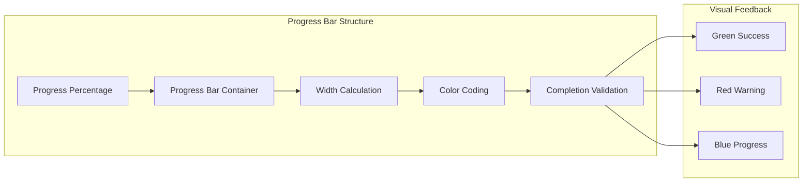

**Diagram sources**
- [ProductionStageTimeline.tsx](file://src/components/production/ProductionStageTimeline.tsx#L127-L139)

**Section sources**
- [ProductionStageTimeline.tsx](file://src/components/production/ProductionStageTimeline.tsx#L36-L63)
- [ProductionStageTimeline.tsx](file://src/components/production/ProductionStageTimeline.tsx#L127-L139)

## Sorting and Rendering Logic

The component implements intelligent sorting and rendering mechanisms to ensure optimal user experience:

### Stage Number Sorting

The component automatically sorts stages by their numerical sequence using JavaScript's sort function:

```typescript
// Sorting logic implementation
const sortedStages = [...stages].sort((a, b) => a.stage_number - b.stage_number);
```

This ensures that stages appear in the correct manufacturing sequence regardless of how they were initially ordered in the database.

### Conditional Rendering Patterns

The component employs sophisticated conditional rendering to handle various data states:

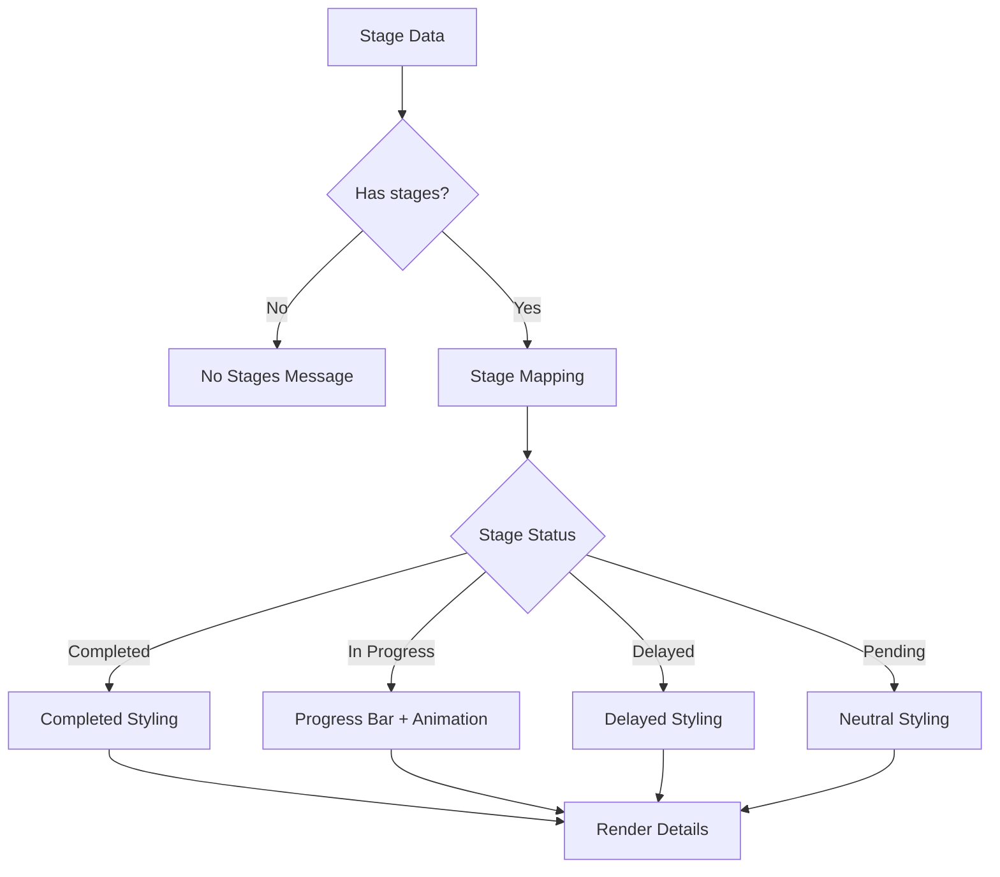

**Diagram sources**
- [ProductionStageTimeline.tsx](file://src/components/production/ProductionStageTimeline.tsx#L90-L177)

### Responsive Design Considerations

The component adapts to different screen sizes while maintaining visual hierarchy and readability:

| Breakpoint | Layout Strategy | Key Features |
|------------|----------------|--------------|
| Mobile (< 768px) | Single column | Collapsible content, stacked icons |
| Tablet (768-1024px) | Dual column | Balanced spacing, medium icons |
| Desktop (> 1024px) | Multi-column | Full feature set, detailed progress |

**Section sources**
- [ProductionStageTimeline.tsx](file://src/components/production/ProductionStageTimeline.tsx#L75-L76)
- [ProductionStageTimeline.tsx](file://src/components/production/ProductionStageTimeline.tsx#L90-L177)

## Real-time Updates

The component supports real-time updates through Supabase's real-time capabilities, ensuring users always see the most current production status:

### Subscription Management

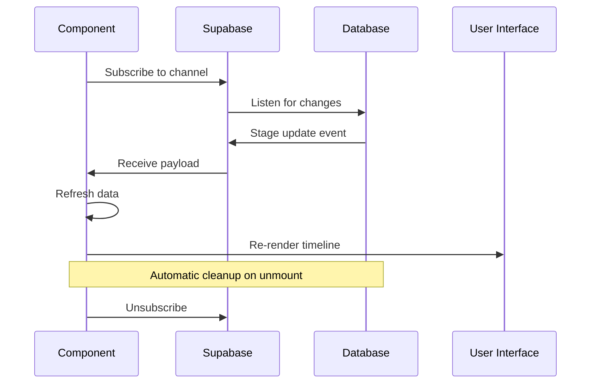

**Diagram sources**
- [ProductionTracking.tsx](file://src/pages/ProductionTracking.tsx#L65-L90)

### Optimistic Update Integration

The component integrates with optimistic update hooks to provide immediate feedback during stage modifications:

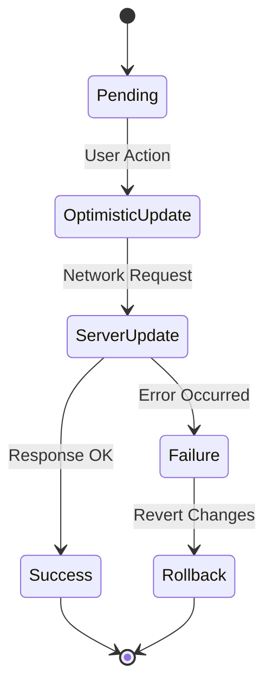

**Diagram sources**
- [useOptimisticUpdate.ts](file://src/hooks/useOptimisticUpdate.ts#L79-L125)

**Section sources**
- [ProductionTracking.tsx](file://src/pages/ProductionTracking.tsx#L65-L90)
- [useOptimisticUpdate.ts](file://src/hooks/useOptimisticUpdate.ts#L79-L125)

## Error Handling and Fallback States

The component implements comprehensive error handling and fallback mechanisms to ensure graceful degradation under various failure conditions:

### Missing Stage Data Handling

When production stage data is unavailable or incomplete, the component displays appropriate fallback messages:

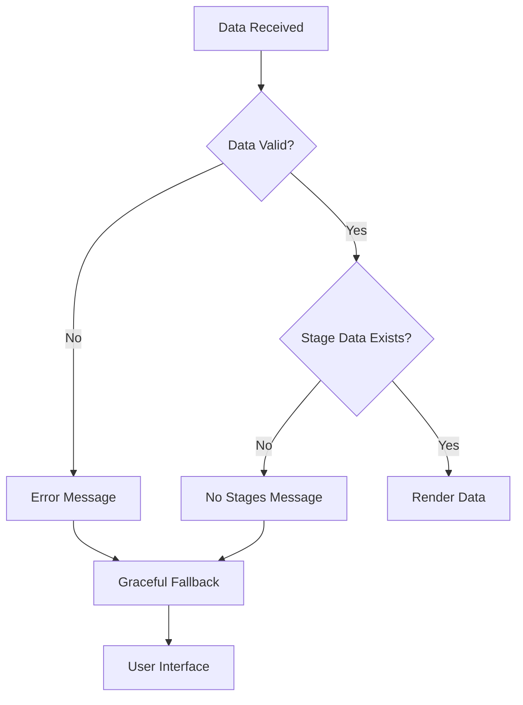

**Diagram sources**
- [ProductionStageTimeline.tsx](file://src/components/production/ProductionStageTimeline.tsx#L90-L94)

### Error State Visual Design

| Error Condition | Visual Treatment | User Guidance |
|----------------|------------------|---------------|
| No production stages | Centered message with icon | "No production stages available yet" |
| Network errors | Loading spinner with retry | "Failed to load data - retry" |
| Data corruption | Warning banner | "Corrupted data detected" |
| Permission denied | Access restricted message | "Insufficient permissions" |

### Graceful Degradation Strategies

The component implements several strategies to handle edge cases:

1. **Null Safety**: All optional fields are properly null-checked
2. **Type Validation**: Runtime type checking for incoming data
3. **Default Values**: Appropriate defaults for missing data
4. **Fallback Icons**: Generic icons when specific icons fail to load

**Section sources**
- [ProductionStageTimeline.tsx](file://src/components/production/ProductionStageTimeline.tsx#L90-L94)
- [ProductionStageTimeline.tsx](file://src/components/production/ProductionStageTimeline.tsx#L178-L183)

## Integration with Parent Components

The Production Stage Timeline seamlessly integrates with the parent ProductionTracking page through a well-defined interface:

### Data Flow Integration

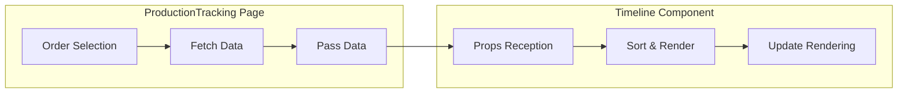

**Diagram sources**
- [ProductionTracking.tsx](file://src/pages/ProductionTracking.tsx#L475-L479)
- [ProductionStageTimeline.tsx](file://src/components/production/ProductionStageTimeline.tsx#L22-L22)

### Component Lifecycle Management

The integration follows React's component lifecycle patterns:

1. **Mount Phase**: Initial data fetching and subscription setup
2. **Update Phase**: Real-time data synchronization
3. **Unmount Phase**: Cleanup of subscriptions and memory leaks

### State Management Integration

The component coordinates with the parent's state management system:

| State Element | Parent Responsibility | Timeline Responsibility |
|---------------|----------------------|-------------------------|
| Selected Order | Order selection and filtering | Stage data rendering |
| User Permissions | Access control | Feature availability |
| Real-time Updates | Subscription management | UI synchronization |
| Error States | Global error handling | Local error presentation |

**Section sources**
- [ProductionTracking.tsx](file://src/pages/ProductionTracking.tsx#L475-L479)
- [ProductionTracking.tsx](file://src/pages/ProductionTracking.tsx#L65-L90)

## Common Issues and Solutions

### Issue: Stages Not Appearing in Correct Order

**Symptoms**: Stages display out of sequence (e.g., Stage 8 before Stage 1)

**Root Cause**: Database returns unordered stage arrays

**Solution**: The component implements explicit sorting using `stage_number` field

**Code Reference**: [ProductionStageTimeline.tsx](file://src/components/production/ProductionStageTimeline.tsx#L75-L76)

### Issue: Missing or Incorrect Icons

**Symptoms**: Generic circle icons instead of stage-specific icons

**Root Cause**: Stage name doesn't match expected patterns

**Solution**: The icon mapping system uses pattern matching with case-insensitive comparison

**Code Reference**: [ProductionStageTimeline.tsx](file://src/components/production/ProductionStageTimeline.tsx#L23-L33)

### Issue: Real-time Updates Not Working

**Symptoms**: Stage status changes don't reflect immediately

**Root Cause**: Subscription not properly established or data not updating

**Solution**: Verify subscription setup and ensure data structure consistency

**Code Reference**: [ProductionTracking.tsx](file://src/pages/ProductionTracking.tsx#L65-L90)

### Issue: Performance with Large Stage Sets

**Symptoms**: Slow rendering with many stages

**Root Cause**: Unoptimized re-rendering of large datasets

**Solution**: Component uses efficient sorting and minimal re-rendering strategies

**Code Reference**: [ProductionStageTimeline.tsx](file://src/components/production/ProductionStageTimeline.tsx#L75-L76)

### Issue: Missing Progress Indicators

**Symptoms**: No progress bars for in-progress stages

**Root Cause**: `completion_percentage` field missing or invalid

**Solution**: Ensure proper data validation and default value handling

**Code Reference**: [ProductionStageTimeline.tsx](file://src/components/production/ProductionStageTimeline.tsx#L127-L139)

## Technical Implementation Details

### Database Initialization

The system includes automated production stage initialization through Supabase functions:

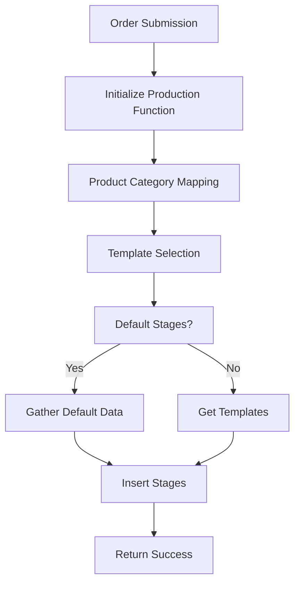

**Diagram sources**
- [initialize-production-stages/index.ts](file://supabase/functions/initialize-production-stages/index.ts#L20-L133)

### Status Transition Logic

The database includes triggers for automatic status management:

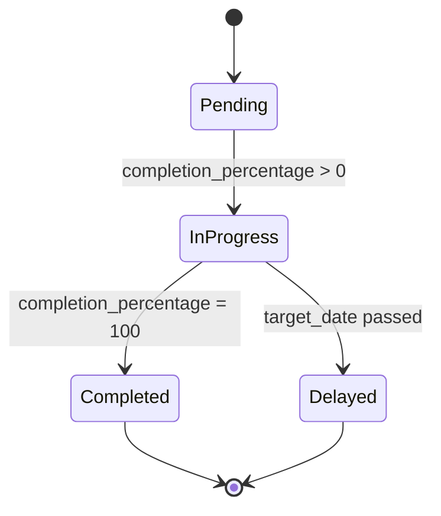

**Diagram sources**
- [20251116120215_71189c74-c2d3-4f3e-a1af-87d7e6b5f8fa.sql](file://supabase/functions/initialize-production-stages/index.ts#L52-L73)

### Optimistic Update Implementation

The component uses sophisticated optimistic updates for improved user experience:

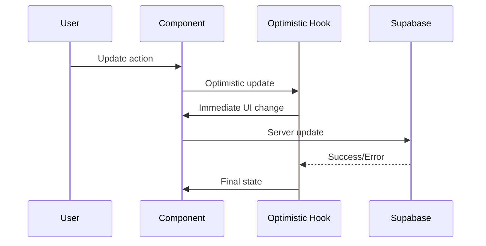

**Diagram sources**
- [useOptimisticUpdate.ts](file://src/hooks/useOptimisticUpdate.ts#L79-L125)

**Section sources**
- [initialize-production-stages/index.ts](file://supabase/functions/initialize-production-stages/index.ts#L20-L133)
- [20251116120215_71189c74-c2d3-4f3e-a1af-87d7e6b5f8fa.sql](file://supabase/functions/initialize-production-stages/index.ts#L52-L73)
- [useOptimisticUpdate.ts](file://src/hooks/useOptimisticUpdate.ts#L79-L125)

## Best Practices

### Data Validation

Always validate incoming stage data before rendering:

```typescript
// Recommended validation pattern
const isValidStage = (stage: any): stage is ProductionStage => {
  return typeof stage.id === 'string' &&
         typeof stage.stage_number === 'number' &&
         typeof stage.stage_name === 'string' &&
         ['pending', 'in_progress', 'completed', 'delayed'].includes(stage.status);
};
```

### Performance Optimization

1. **Memoization**: Use React.memo for expensive computations
2. **Virtualization**: Consider for large stage sets
3. **Debouncing**: Implement debounced updates for rapid changes
4. **Lazy Loading**: Load additional stage details on demand

### Accessibility Considerations

1. **ARIA Labels**: Add descriptive labels for screen readers
2. **Keyboard Navigation**: Ensure full keyboard accessibility
3. **Color Contrast**: Maintain WCAG compliance for color usage
4. **Focus Management**: Proper focus handling for interactive elements

### Error Boundaries

Implement error boundaries around the timeline component:

```typescript
class ProductionTimelineErrorBoundary extends React.Component {
  componentDidCatch(error: Error, errorInfo: React.ErrorInfo) {
    console.error('Production Timeline Error:', error, errorInfo);
    // Log to monitoring service
  }
  
  render() {
    if (this.state.hasError) {
      return <div>Error loading production timeline</div>;
    }
    return this.props.children;
  }
}
```

### Testing Strategies

1. **Unit Tests**: Test individual functions and utilities
2. **Integration Tests**: Verify component interaction with data sources
3. **Visual Regression**: Monitor UI changes with automated testing
4. **Performance Tests**: Measure rendering performance with large datasets