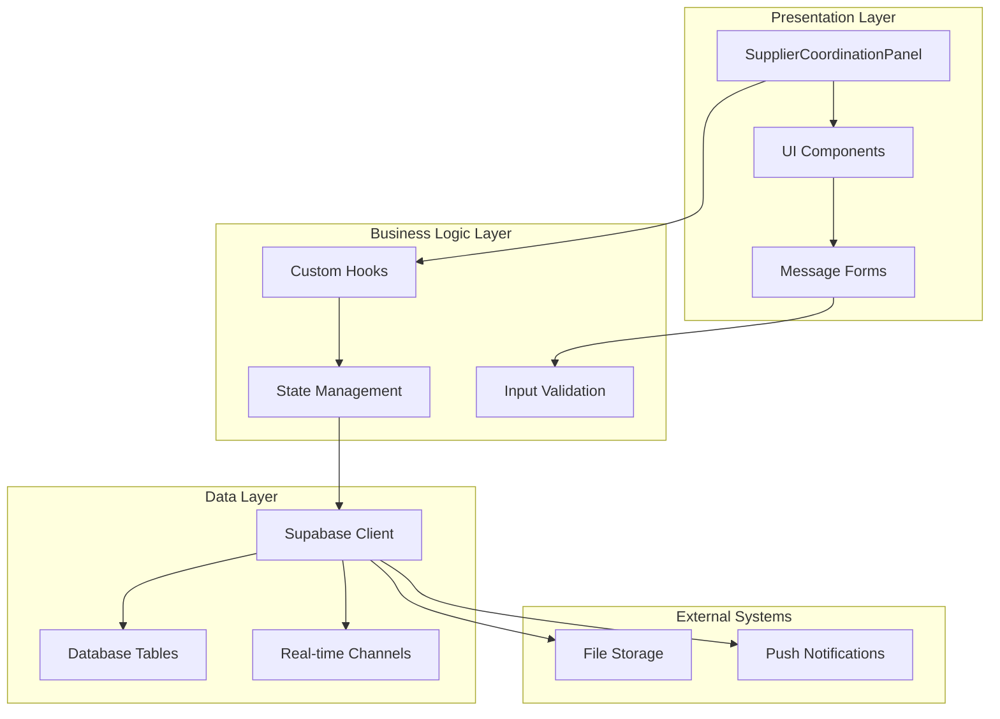
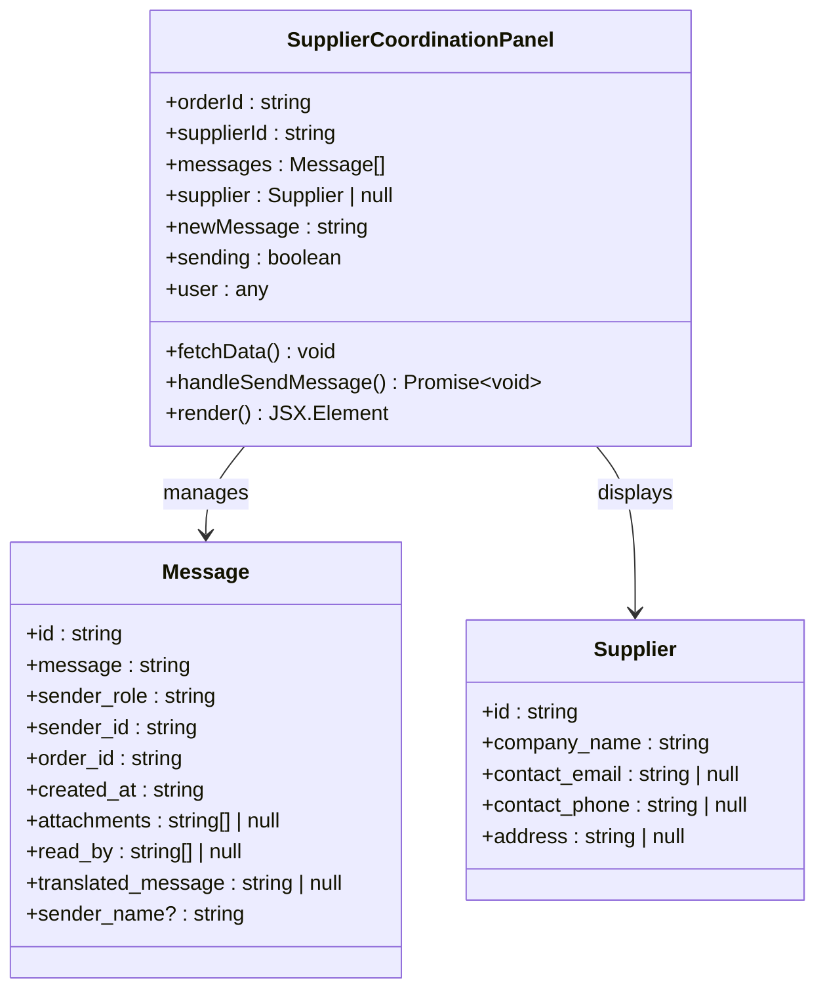
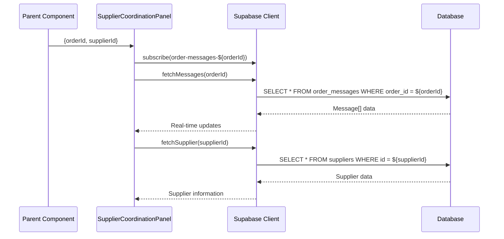
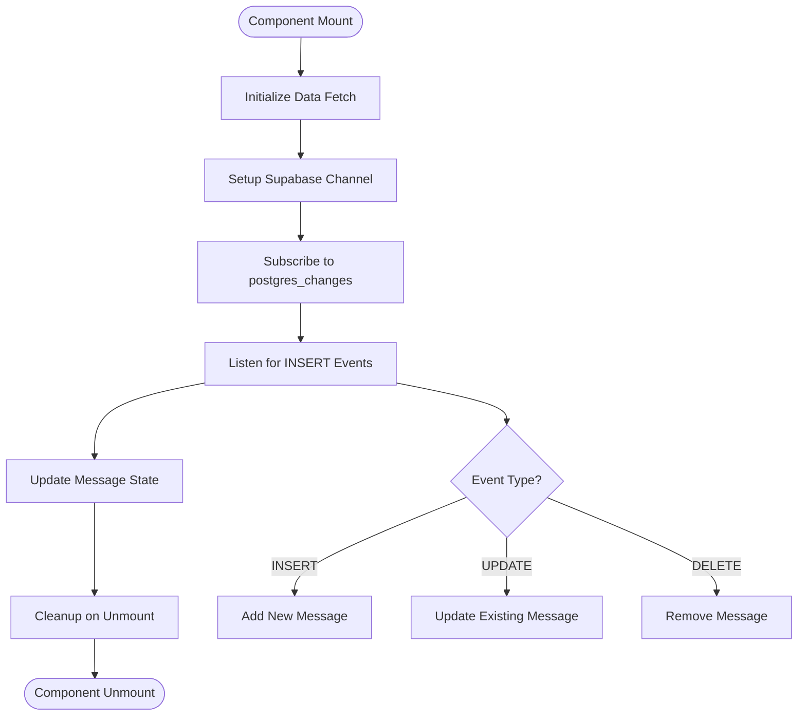
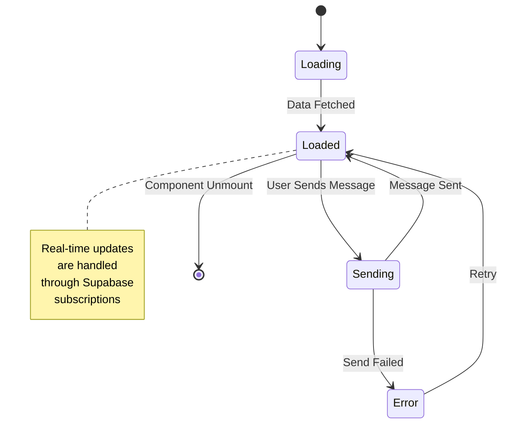
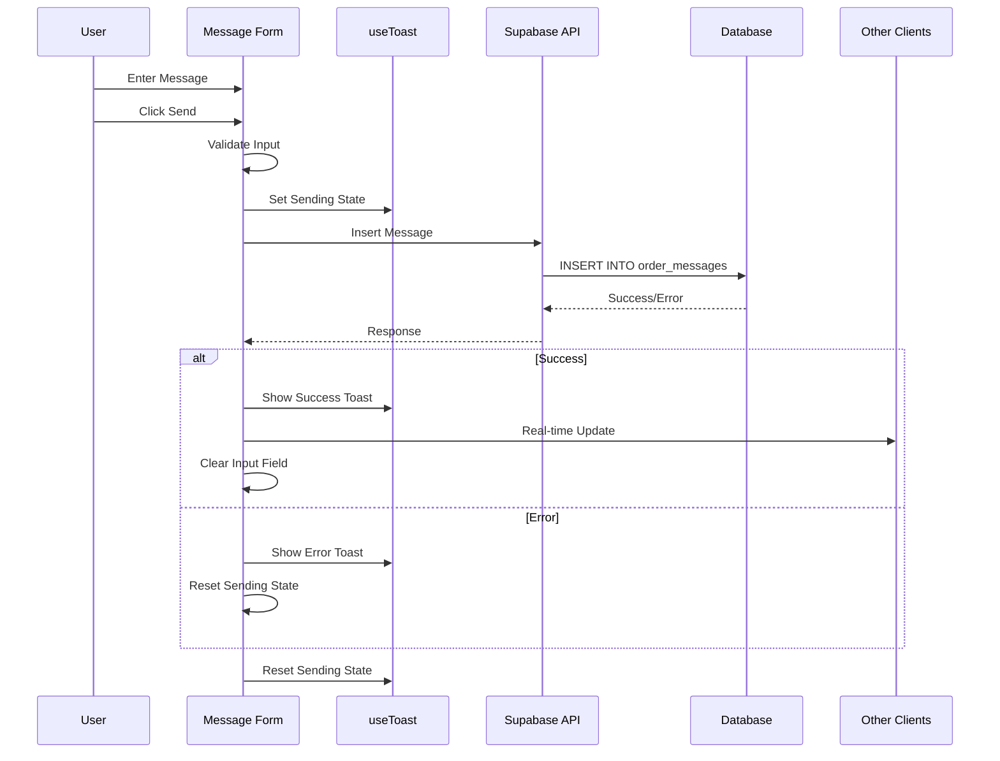
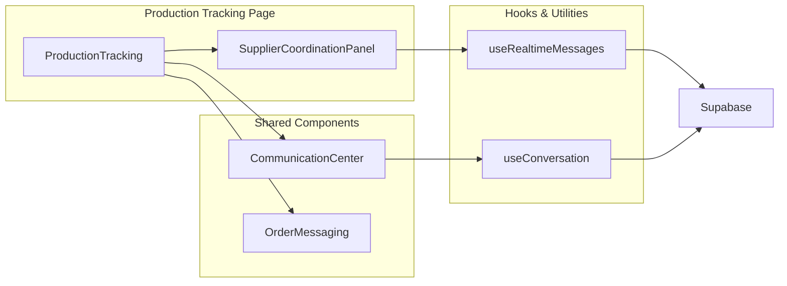
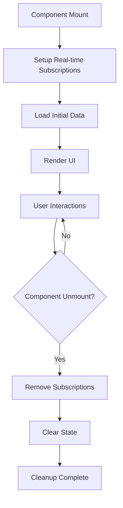

# Supplier Coordination Panel

<cite>
**Referenced Files in This Document**
- [SupplierCoordinationPanel.tsx](file://src/components/production/SupplierCoordinationPanel.tsx)
- [ProductionTracking.tsx](file://src/pages/ProductionTracking.tsx)
- [useRealtimeMessages.ts](file://src/hooks/useRealtimeMessages.ts)
- [CommunicationCenter.tsx](file://src/components/shared/CommunicationCenter.tsx)
- [OrderMessaging.tsx](file://src/components/supplier/OrderMessaging.tsx)
- [useConversation.ts](file://src/hooks/useConversation.ts)
- [types.ts](file://src/integrations/supabase/types.ts)
- [20251115150759_remix_migration_from_pg_dump.sql](file://supabase/migrations/20251115150759_remix_migration_from_pg_dump.sql)
</cite>

## Table of Contents
1. [Introduction](#introduction)
2. [System Architecture](#system-architecture)
3. [Core Implementation](#core-implementation)
4. [Interface and Props](#interface-and-props)
5. [Real-Time Communication](#real-time-communication)
6. [Message State Management](#message-state-management)
7. [Integration Patterns](#integration-patterns)
8. [Performance Optimization](#performance-optimization)
9. [Common Issues and Solutions](#common-issues-and-solutions)
10. [Best Practices](#best-practices)
11. [Troubleshooting Guide](#troubleshooting-guide)

## Introduction

The Supplier Coordination Panel serves as a centralized communication hub within the LoopTrace™ production tracking interface, enabling seamless direct messaging between buyers and suppliers during manufacturing processes. This component reduces reliance on email correspondence and improves response times through real-time collaboration capabilities.

The panel integrates multiple communication systems, including order-specific messaging, supplier coordination, and real-time notifications, creating a unified platform for production-related discussions. It supports both buyer-supplier interactions and internal administrative communications, making it a critical component for efficient supply chain management.

## System Architecture

The Supplier Coordination Panel operates within a multi-layered architecture that separates concerns between presentation, business logic, and data persistence:

**Diagram sources**
- [SupplierCoordinationPanel.tsx](file://src/components/production/SupplierCoordinationPanel.tsx#L37-L256)
- [useRealtimeMessages.ts](file://src/hooks/useRealtimeMessages.ts)

## Core Implementation

The Supplier Coordination Panel is implemented as a React functional component with TypeScript interfaces for type safety and comprehensive functionality for production tracking communication.

### Component Structure

The component follows a modular architecture with distinct sections for supplier information display and message communication:

**Diagram sources**
- [SupplierCoordinationPanel.tsx](file://src/components/production/SupplierCoordinationPanel.tsx#L11-L35)

**Section sources**
- [SupplierCoordinationPanel.tsx](file://src/components/production/SupplierCoordinationPanel.tsx#L37-L256)

## Interface and Props

The component accepts two primary props that define its operational context within the production tracking system:

### Props Definition

| Prop | Type | Description | Required |
|------|------|-------------|----------|
| `orderId` | `string` | Unique identifier for the production order being tracked | Yes |
| `supplierId` | `string` | Unique identifier for the supplier associated with the order | Yes |

### Interface Implementation

The component validates these props and uses them to establish real-time subscriptions and fetch relevant data:

**Diagram sources**
- [SupplierCoordinationPanel.tsx](file://src/components/production/SupplierCoordinationPanel.tsx#L45-L96)

**Section sources**
- [SupplierCoordinationPanel.tsx](file://src/components/production/SupplierCoordinationPanel.tsx#L32-L35)

## Real-Time Communication

The panel implements sophisticated real-time communication using Supabase's PostgreSQL change data capture (CDC) system, ensuring immediate message delivery and synchronization across all connected clients.

### Real-Time Subscription Setup

The component establishes multiple real-time channels for comprehensive coverage:

**Diagram sources**
- [SupplierCoordinationPanel.tsx](file://src/components/production/SupplierCoordinationPanel.tsx#L48-L67)

### Message Synchronization

The real-time system ensures message synchronization through multiple mechanisms:

1. **PostgreSQL CDC**: Automatic detection of new messages in the database
2. **WebSocket Connections**: Persistent connections for real-time updates
3. **Client-Side Caching**: Local state management for immediate UI updates
4. **Conflict Resolution**: Handling of concurrent message submissions

**Section sources**
- [SupplierCoordinationPanel.tsx](file://src/components/production/SupplierCoordinationPanel.tsx#L48-L67)
- [useRealtimeMessages.ts](file://src/hooks/useRealtimeMessages.ts#L17-L61)

## Message State Management

The component employs a comprehensive state management strategy that handles message loading, sending, and real-time updates efficiently:

### State Architecture

### Message Lifecycle

The message handling follows a structured lifecycle with proper error handling and user feedback:

**Diagram sources**
- [SupplierCoordinationPanel.tsx](file://src/components/production/SupplierCoordinationPanel.tsx#L98-L138)

**Section sources**
- [SupplierCoordinationPanel.tsx](file://src/components/production/SupplierCoordinationPanel.tsx#L39-L42)
- [SupplierCoordinationPanel.tsx](file://src/components/production/SupplierCoordinationPanel.tsx#L98-L138)

## Integration Patterns

The Supplier Coordination Panel integrates with multiple system components to provide comprehensive functionality:

### Database Schema Integration

The component interacts with several database tables to provide complete functionality:

| Table | Purpose | Key Fields |
|-------|---------|------------|
| `order_messages` | Order-specific messaging | `order_id`, `sender_id`, `message`, `created_at` |
| `suppliers` | Supplier information | `id`, `company_name`, `contact_email`, `contact_phone` |
| `user_roles` | User role determination | `user_id`, `role` |

### Cross-Component Communication

The panel coordinates with other components through well-defined interfaces:

**Diagram sources**
- [ProductionTracking.tsx](file://src/pages/ProductionTracking.tsx#L500-L503)
- [CommunicationCenter.tsx](file://src/components/shared/CommunicationCenter.tsx#L28-L451)

**Section sources**
- [ProductionTracking.tsx](file://src/pages/ProductionTracking.tsx#L500-L503)
- [types.ts](file://src/integrations/supabase/types.ts#L1626-L1668)

## Performance Optimization

The component implements several performance optimization strategies to ensure smooth operation under various load conditions:

### Loading Strategies

1. **Lazy Loading**: Messages are loaded only when the component mounts
2. **Pagination**: Large message histories are paginated for better performance
3. **Virtual Scrolling**: Long message lists use virtual scrolling to maintain performance
4. **Debounced Input**: Message composition is debounced to reduce API calls

### Memory Management

The component implements proper cleanup to prevent memory leaks:

**Diagram sources**
- [SupplierCoordinationPanel.tsx](file://src/components/production/SupplierCoordinationPanel.tsx#L65-L67)

**Section sources**
- [SupplierCoordinationPanel.tsx](file://src/components/production/SupplierCoordinationPanel.tsx#L45-L67)

## Common Issues and Solutions

### Message Synchronization Delays

**Problem**: Messages appear with delays or don't show up immediately.

**Causes**:
- Network connectivity issues
- Supabase WebSocket disconnections
- Database write latency
- Client-side caching conflicts

**Solutions**:
1. Implement exponential backoff for reconnection attempts
2. Add local message queuing for offline scenarios
3. Use optimistic updates with rollback capabilities
4. Implement message acknowledgment systems

### Conversation Context Loss

**Problem**: Users lose conversation context when switching between sessions or refreshing the page.

**Solutions**:
1. Implement server-side conversation persistence
2. Use local storage for temporary context preservation
3. Establish session-based conversation recovery
4. Provide conversation export/import functionality

### Authentication and Authorization Issues

**Problem**: Users cannot access messages due to permission errors.

**Solutions**:
1. Implement role-based access controls
2. Add user session validation
3. Provide clear error messaging
4. Implement graceful degradation

**Section sources**
- [useConversation.ts](file://src/hooks/useConversation.ts#L124-L149)

## Best Practices

### Development Guidelines

1. **Type Safety**: Always use TypeScript interfaces for data structures
2. **Error Handling**: Implement comprehensive error boundaries and user feedback
3. **Performance**: Use memoization for expensive computations
4. **Accessibility**: Ensure keyboard navigation and screen reader compatibility

### Security Considerations

1. **Input Validation**: Sanitize all user inputs to prevent injection attacks
2. **Authorization**: Verify user permissions before displaying sensitive data
3. **Rate Limiting**: Implement rate limiting for message sending
4. **Data Encryption**: Encrypt sensitive data in transit and at rest

### User Experience

1. **Immediate Feedback**: Provide instant visual feedback for user actions
2. **Progress Indicators**: Show loading states during data operations
3. **Offline Support**: Implement offline message queuing
4. **Responsive Design**: Ensure mobile-friendly interfaces

## Troubleshooting Guide

### Component Not Rendering

**Symptoms**: The Supplier Coordination Panel appears empty or fails to load.

**Diagnosis Steps**:
1. Check if `orderId` and `supplierId` props are provided
2. Verify database connectivity and table permissions
3. Review browser console for JavaScript errors
4. Check network tab for failed API requests

**Resolution**:
- Ensure proper prop passing from parent components
- Verify database schema and relationships
- Check Supabase connection credentials
- Review authentication state

### Real-Time Updates Not Working

**Symptoms**: New messages don't appear until page refresh.

**Diagnosis Steps**:
1. Verify WebSocket connection status
2. Check Supabase channel subscription
3. Review PostgreSQL trigger configurations
4. Test with multiple browser tabs

**Resolution**:
- Restart real-time subscriptions on connection loss
- Implement automatic reconnection logic
- Verify database triggers are active
- Check firewall and proxy configurations

### Message Sending Failures

**Symptoms**: Users can't send messages or receive error messages.

**Diagnosis Steps**:
1. Check user authentication status
2. Verify database insert permissions
3. Review message content validation
4. Test with different message types

**Resolution**:
- Implement authentication fallbacks
- Add content sanitization
- Provide meaningful error messages
- Implement retry mechanisms

**Section sources**
- [SupplierCoordinationPanel.tsx](file://src/components/production/SupplierCoordinationPanel.tsx#L129-L135)
- [useConversation.ts](file://src/hooks/useConversation.ts#L124-L149)