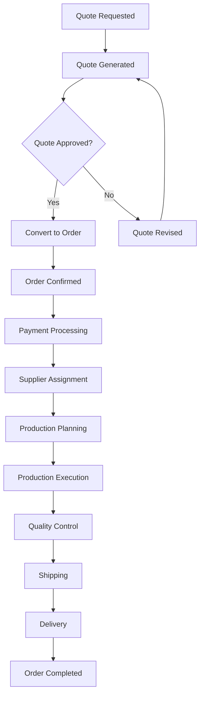
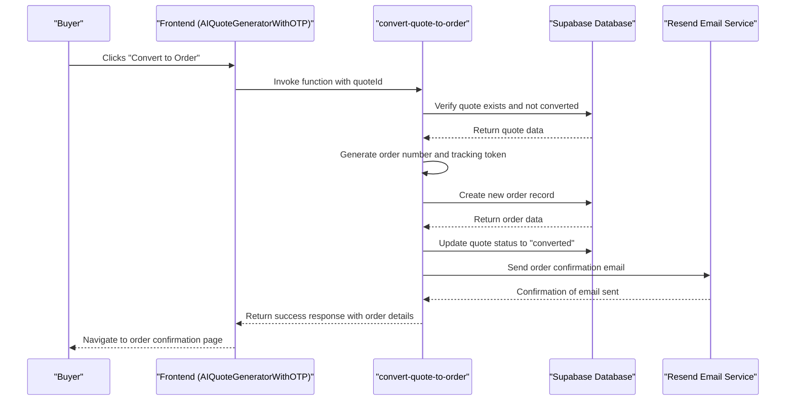
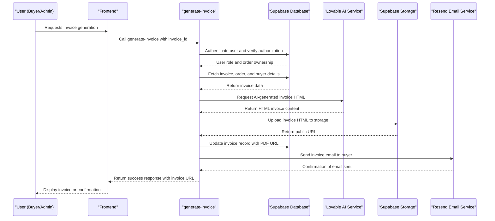
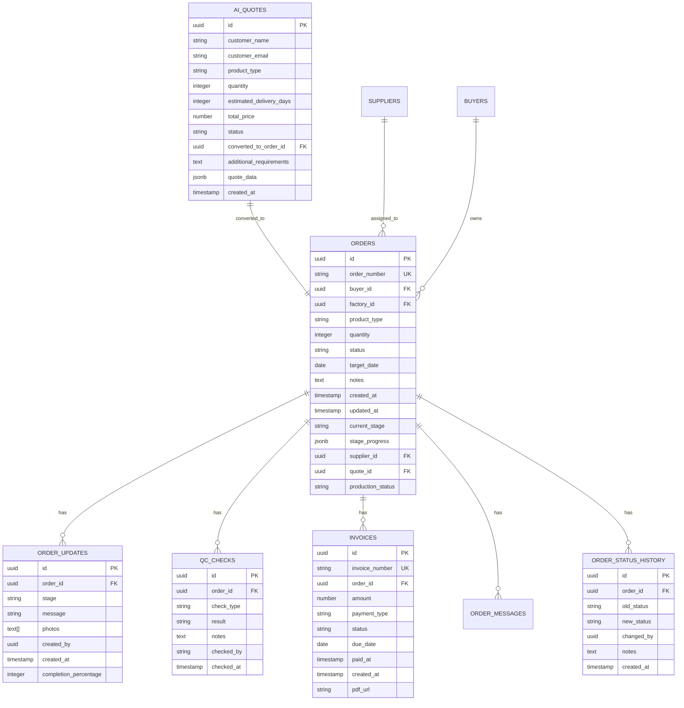
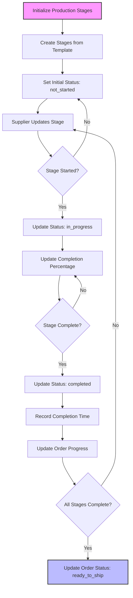

# Order Management

<cite>
**Referenced Files in This Document**   
- [AIQuoteGeneratorWithOTP.tsx](file://src/components/AIQuoteGeneratorWithOTP.tsx)
- [convert-quote-to-order/index.ts](file://supabase/functions/convert-quote-to-order/index.ts)
- [OrderDetails.tsx](file://src/pages/OrderDetails.tsx)
- [OrderConfirmation.tsx](file://src/pages/OrderConfirmation.tsx)
- [QuotesManagementSection.tsx](file://src/components/buyer/QuotesManagementSection.tsx)
- [InvoiceViewer.tsx](file://src/components/payment/InvoiceViewer.tsx)
- [PaymentManagement.tsx](file://src/components/admin/PaymentManagement.tsx)
- [generate-invoice/index.ts](file://supabase/functions/generate-invoice/index.ts)
- [useOrderManagement.ts](file://src/hooks/useOrderManagement.ts)
- [usePayment.ts](file://src/hooks/usePayment.ts)
- [order.ts](file://src/types/order.ts)
- [types.ts](file://src/integrations/supabase/types.ts)
- [OrderTimeline.tsx](file://src/components/OrderTimeline.tsx)
- [OrderStatusTimeline.tsx](file://src/components/OrderStatusTimeline.tsx)
- [ProductionAnalytics.tsx](file://src/components/production/ProductionAnalytics.tsx)
- [Orders.tsx](file://src/pages/Orders.tsx)
- [OrdersList.tsx](file://src/components/OrdersList.tsx)
- [TrackOrder.tsx](file://src/pages/TrackOrder.tsx)
</cite>

## Table of Contents
1. [Introduction](#introduction)
2. [Order Lifecycle Management](#order-lifecycle-management)
3. [Quote to Order Conversion Process](#quote-to-order-conversion-process)
4. [Invoice Generation and Payment Tracking](#invoice-generation-and-payment-tracking)
5. [Frontend Components and User Interfaces](#frontend-components-and-user-interfaces)
6. [Data Model and State Management](#data-model-and-state-management)
7. [Production Stage Management](#production-stage-management)
8. [Common Issues and Troubleshooting](#common-issues-and-troubleshooting)
9. [Conclusion](#conclusion)

## Introduction

The Order Management system in the Sleek Apparels platform provides a comprehensive solution for managing the entire order lifecycle from initial quote generation to final delivery. This document details the implementation of order management functionality, focusing on the conversion of quotes to orders, invoice generation, payment tracking, and production stage management. The system is designed to support multiple user roles including buyers, suppliers, and administrators, with appropriate access controls and workflows for each role.

The platform leverages a modern tech stack with React for the frontend, Supabase for the backend and database, and various edge functions for business logic processing. The order management system is tightly integrated with AI-powered features for quote generation, cost estimation, and production forecasting, providing users with intelligent insights throughout the ordering process.

**Section sources**
- [README.md](file://README.md#L108-L134)

## Order Lifecycle Management

The order lifecycle in the Sleek Apparels platform follows a structured progression from quote request to final delivery. The system maintains comprehensive state tracking for each order, allowing all stakeholders to monitor progress and take appropriate actions at each stage.

The order lifecycle begins with a quote request, which can be initiated by potential buyers through various channels including the AI-powered quote generator. Once a quote is approved, it can be converted to an order, triggering a series of automated processes including invoice generation, supplier assignment, and production planning.

Key stages in the order lifecycle include:
- Quote requested and generated
- Quote approval by buyer
- Order creation and confirmation
- Payment processing (deposit and balance)
- Supplier assignment and production planning
- Production execution with stage-by-stage updates
- Quality control and inspection
- Shipping and delivery
- Order completion and feedback

Each order maintains a detailed status history that records all state changes, providing an audit trail for compliance and troubleshooting purposes. The system also tracks key performance indicators such as production progress, delivery timelines, and quality metrics.

**Diagram sources**
- [OrderStatusTimeline.tsx](file://src/components/OrderStatusTimeline.tsx#L15-L31)
- [OrderTimeline.tsx](file://src/components/OrderTimeline.tsx#L17-L24)

**Section sources**
- [OrderStatusTimeline.tsx](file://src/components/OrderStatusTimeline.tsx#L1-L49)
- [OrderTimeline.tsx](file://src/components/OrderTimeline.tsx#L1-L42)

## Quote to Order Conversion Process

The conversion of quotes to orders is a critical process in the Sleek Apparels platform, serving as the transition point from sales to production. This process is implemented through a dedicated edge function that handles the business logic and data transformations required to create a formal order from an approved quote.

The conversion process begins when a buyer clicks the "Convert to Order" button on an approved quote. This action triggers the `convert-quote-to-order` edge function, which performs several key operations:

1. Validates that the quote exists and has not already been converted to an order
2. Generates a unique order number using a timestamp-based algorithm
3. Creates a new order record with relevant details from the quote
4. Updates the quote status to "converted" and links it to the new order
5. Sends a confirmation email to the buyer with order details and tracking information

The frontend implementation in `AIQuoteGeneratorWithOTP.tsx` shows how the conversion is initiated through a button click that invokes the edge function via Supabase's function invocation API. The component displays the quote details including estimated delivery days and AI-generated recommendations before allowing the conversion.

The backend implementation in `convert-quote-to-order/index.ts` demonstrates robust error handling and security measures. The function first authenticates the user and verifies their authorization to perform the conversion. It then checks whether the quote has already been converted to prevent duplicate orders. The function generates a secure tracking token using `crypto.randomUUID()` and calculates the expected delivery date based on the quote's estimated delivery days.

**Diagram sources**
- [AIQuoteGeneratorWithOTP.tsx](file://src/components/AIQuoteGeneratorWithOTP.tsx#L573-L584)
- [convert-quote-to-order/index.ts](file://supabase/functions/convert-quote-to-order/index.ts#L38-L222)

**Section sources**
- [AIQuoteGeneratorWithOTP.tsx](file://src/components/AIQuoteGeneratorWithOTP.tsx#L551-L584)
- [convert-quote-to-order/index.ts](file://supabase/functions/convert-quote-to-order/index.ts#L38-L222)
- [QuotesManagementSection.tsx](file://src/components/buyer/QuotesManagementSection.tsx#L173-L194)
- [OrderConfirmation.tsx](file://src/pages/OrderConfirmation.tsx#L208-L238)

## Invoice Generation and Payment Tracking

The invoice generation and payment tracking system in Sleek Apparels provides a comprehensive solution for financial transactions throughout the order lifecycle. The system supports multiple payment types including deposits, balance payments, and full payments, with appropriate invoicing for each transaction.

Invoice generation is handled by the `generate-invoice` edge function, which creates professional HTML invoices using AI-generated content. The function first authenticates the user and verifies their authorization to generate the invoice (either as the order's buyer or an administrator). It then fetches the invoice details along with associated order and buyer information from the database.

The invoice generation process leverages the Lovable AI service to create well-formatted HTML invoices with appropriate styling and layout. The AI is prompted with specific instructions to include key elements such as:
- Professional header with company logo placeholder
- Clean table layout for order details
- Payment terms (Net 7 days)
- Bank details section placeholder
- Contact information in the footer
- Print-friendly design

Once generated, the invoice HTML is stored in Supabase storage with a predictable filename based on the invoice number. The public URL of the stored invoice is then updated in the database record, making it accessible to authorized users. The system also sends an email notification to the buyer with a link to view the invoice.

Payment tracking is implemented through the `create-payment-intent` edge function and associated frontend components. The payment system supports Stripe integration for secure payment processing. The `usePayment` hook provides a clean API for creating payment intents, with validation to ensure orders are in an appropriate state for payment and amounts are reasonable.

The frontend components `InvoiceViewer.tsx` and `PaymentManagement.tsx` provide user interfaces for viewing and managing invoices. The `InvoiceViewer` component displays key invoice details including amount, payment type, status, and dates, with visual indicators for the payment status. The `PaymentManagement` component provides administrators with a comprehensive view of all invoices, including filtering and search capabilities.

**Diagram sources**
- [generate-invoice/index.ts](file://supabase/functions/generate-invoice/index.ts#L1-L243)
- [InvoiceViewer.tsx](file://src/components/payment/InvoiceViewer.tsx#L1-L82)
- [PaymentManagement.tsx](file://src/components/admin/PaymentManagement.tsx#L46-L134)
- [usePayment.ts](file://src/hooks/usePayment.ts#L9-L34)

**Section sources**
- [generate-invoice/index.ts](file://supabase/functions/generate-invoice/index.ts#L1-L243)
- [InvoiceViewer.tsx](file://src/components/payment/InvoiceViewer.tsx#L1-L82)
- [PaymentManagement.tsx](file://src/components/admin/PaymentManagement.tsx#L46-L134)
- [usePayment.ts](file://src/hooks/usePayment.ts#L9-L34)
- [create-payment-intent/index.ts](file://supabase/functions/create-payment-intent/index.ts#L144-L179)

## Frontend Components and User Interfaces

The frontend components for order management in the Sleek Apparels platform provide intuitive user interfaces for different user roles to interact with orders, quotes, and related functionality. These components are built using React with TypeScript and leverage the ShadCN UI component library for consistent styling and accessibility.

The `OrderDetails.tsx` page serves as the primary interface for viewing comprehensive order information. It displays key order details such as order number, product type, quantity, and status in a clean, card-based layout. The component also shows buyer and factory information, order notes, and integrates several specialized components for production tracking and quality control.

For buyers, the `OrdersList.tsx` component provides a summary view of their orders, showing the most recent orders with key information including order number, product type, quantity, target date, and current production stage. The component adapts its content based on the user's role, showing appropriate messaging and calls to action for different user types.

The `OrderStatusTimeline.tsx` and `OrderTimeline.tsx` components visualize the order's progress through different stages. These timeline components use icons and color coding to indicate completed, current, and upcoming stages, providing users with an at-a-glance understanding of where their order stands in the production process.

Administrators have access to enhanced views through components like `OrderStatusBoard.tsx` and `PaymentManagement.tsx`, which provide aggregated views of multiple orders and invoices with filtering and search capabilities. These components enable administrators to efficiently manage the order portfolio and identify any issues that require attention.

The `ProductionAnalytics.tsx` component provides detailed insights into production progress, calculating overall completion percentage and estimating the completion date based on current progress and historical data. This component helps both suppliers and administrators monitor production efficiency and identify potential delays.

```mermaid
graph TD
A[OrderDetails.tsx] --> B[Order Summary]
A --> C[Production Timeline]
A --> D[Quality Control Checks]
A --> E[Production Updates]
A --> F[AI Insights]
G[OrdersList.tsx] --> H[Recent Orders]
G --> I[Order Status]
G --> J[Progress Indicators]
K[OrderStatusTimeline.tsx] --> L[Status Flow]
K --> M[Completion Tracking]
K --> N[Timeline Visualization]
O[ProductionAnalytics.tsx] --> P[Progress Calculation]
O --> Q[Completion Estimation]
O --> R[Performance Metrics]
B --> A
C --> A
D --> A
E --> A
F --> A
H --> G
I --> G
J --> G
L --> K
M --> K
N --> K
P --> O
Q --> O
R --> O
```

**Diagram sources**
- [OrderDetails.tsx](file://src/pages/OrderDetails.tsx#L1-L262)
- [OrdersList.tsx](file://src/components/OrdersList.tsx#L1-L114)
- [OrderStatusTimeline.tsx](file://src/components/OrderStatusTimeline.tsx#L1-L49)
- [ProductionAnalytics.tsx](file://src/components/production/ProductionAnalytics.tsx#L1-L46)

**Section sources**
- [OrderDetails.tsx](file://src/pages/OrderDetails.tsx#L1-L262)
- [OrdersList.tsx](file://src/components/OrdersList.tsx#L1-L114)
- [OrderStatusTimeline.tsx](file://src/components/OrderStatusTimeline.tsx#L1-L49)
- [ProductionAnalytics.tsx](file://src/components/production/ProductionAnalytics.tsx#L1-L46)
- [TrackOrder.tsx](file://src/pages/TrackOrder.tsx#L186-L239)
- [Orders.tsx](file://src/pages/Orders.tsx#L1-L198)

## Data Model and State Management

The data model for order management in the Sleek Apparels platform is designed to support the complex relationships between quotes, orders, production stages, and financial transactions. The system uses a relational database schema with carefully defined tables and relationships to ensure data integrity and efficient querying.

The core data model is defined in the Supabase database schema and TypeScript type definitions. The `types.ts` file in the `supabase` integration provides comprehensive type definitions for all database tables, ensuring type safety throughout the application. Key tables include:

- **orders**: The main table storing order information including order number, buyer and factory IDs, product type, quantity, status, and timestamps
- **ai_quotes**: Stores quote information with fields for pricing, delivery estimates, and AI-generated suggestions
- **invoices**: Tracks financial transactions with fields for amount, payment type, status, and due dates
- **order_status_history**: Maintains an audit trail of all status changes for orders
- **order_updates**: Stores production updates with photos, videos, and progress percentages
- **qc_checks**: Records quality control inspections with results and notes

The `order.ts` type definition file provides TypeScript interfaces for order-related data, including `OrderData`, `OrderUpdate`, and `QualityCheck`. These interfaces define the shape of data objects used throughout the application, ensuring consistency between frontend and backend.

State management is implemented using React hooks and Supabase's real-time capabilities. The `useOrderManagement.ts` hook provides a clean API for common order operations such as updating order status, calculating margins, and assigning suppliers to orders. The hook uses Supabase's RPC (Remote Procedure Call) functions for complex operations that require database transactions.

The system also leverages Supabase's real-time subscriptions to keep the UI synchronized with database changes. When an order status is updated or a new production update is added, all connected clients receive the changes automatically, ensuring that all stakeholders have the most current information.

**Diagram sources**
- [types.ts](file://src/integrations/supabase/types.ts#L1665-L1708)
- [order.ts](file://src/types/order.ts#L5-L47)
- [20251115150759_remix_migration_from_pg_dump.sql](file://supabase/migrations/20251115150759_remix_migration_from_pg_dump.sql#L1216-L1290)

**Section sources**
- [types.ts](file://src/integrations/supabase/types.ts#L1665-L1708)
- [order.ts](file://src/types/order.ts#L5-L47)
- [useOrderManagement.ts](file://src/hooks/useOrderManagement.ts#L7-L130)
- [20251115150759_remix_migration_from_pg_dump.sql](file://supabase/migrations/20251115150759_remix_migration_from_pg_dump.sql#L1216-L1290)

## Production Stage Management

The production stage management system in Sleek Apparels provides a structured framework for tracking the progress of orders through various manufacturing stages. This system enables both suppliers and administrators to monitor production efficiency, identify bottlenecks, and ensure timely delivery.

Production stages are defined in the database with a flexible schema that allows for customization based on product type and manufacturing requirements. The system initially used a fixed enum for production stages but was later modified to use text fields, providing greater flexibility for different manufacturing processes.

The `ProductionStageManager.tsx` component allows suppliers to manage production stages for their assigned orders. It provides a user interface for viewing, editing, and updating the status of each production stage. The component displays key information such as stage name, description, estimated days, and completion status.

The `initialize-production-stages` edge function is responsible for setting up the initial production stages for a new order. This function can create either default stages or stages based on templates defined for specific product categories. The function ensures that each order has a complete set of production stages before manufacturing begins.

Production progress is tracked using a combination of stage status and completion percentage. Each stage can have one of several statuses: not_started, in_progress, completed, or delayed. The completion percentage provides a more granular measure of progress within a stage, allowing for more accurate forecasting of completion times.

The system also supports production updates with multimedia attachments. Suppliers can upload photos and videos to document the progress of each stage, providing visual evidence of work completed. These updates are stored in Supabase storage and linked to the corresponding order update record.

**Diagram sources**
- [ProductionStageManager.tsx](file://src/components/supplier/ProductionStageManager.tsx#L1-L42)
- [initialize-production-stages/index.ts](file://supabase/functions/initialize-production-stages/index.ts#L65-L102)
- [20250123000000_relax_production_stages.sql](file://supabase/migrations/20250123000000_relax_production_stages.sql#L1-L23)

**Section sources**
- [ProductionStageManager.tsx](file://src/components/supplier/ProductionStageManager.tsx#L1-L42)
- [initialize-production-stages/index.ts](file://supabase/functions/initialize-production-stages/index.ts#L65-L102)
- [20250123000000_relax_production_stages.sql](file://supabase/migrations/20250123000000_relax_production_stages.sql#L1-L23)
- [ProductionAnalytics.tsx](file://src/components/production/ProductionAnalytics.tsx#L30-L46)

## Common Issues and Troubleshooting

The Order Management system in Sleek Apparels may encounter several common issues that require troubleshooting and resolution. Understanding these issues and their solutions is essential for maintaining smooth operations and ensuring customer satisfaction.

One common issue is order status synchronization between different systems and user interfaces. Due to the distributed nature of the application, there may be delays in status updates being reflected across all components. This can be addressed by ensuring proper implementation of Supabase's real-time subscriptions and implementing appropriate loading states and refresh mechanisms in the frontend components.

Payment confirmation delays can occur due to various factors including network issues, payment gateway processing times, or webhook delivery failures. The system includes mechanisms to handle these delays, such as the `stripe-webhook` function that processes payment confirmation events from Stripe. Administrators can monitor payment status through the `PaymentManagement` component and manually update invoice status if necessary.

Another potential issue is incomplete or incorrect production stage updates from suppliers. To mitigate this, the system includes validation rules and default templates for production stages. The `ProductionStageManager` component guides suppliers through the update process and provides clear instructions for each stage.

Quote conversion failures can occur if a quote has already been converted to an order or if there are database connectivity issues. The `convert-quote-to-order` function includes comprehensive error handling to prevent duplicate conversions and provide meaningful error messages to users.

Data consistency issues may arise when multiple users attempt to update the same order simultaneously. The system uses database transactions and row-level locking to prevent race conditions and ensure data integrity. Additionally, the audit logging system records all changes to orders, providing a trail for troubleshooting and accountability.

For troubleshooting, administrators can use the following approaches:
- Check the Supabase logs for edge function execution and error messages
- Review the order status history to understand the sequence of state changes
- Verify webhook delivery and processing for external services like Stripe and Resend
- Monitor database performance and query execution times
- Use the audit logging system to identify unauthorized or unexpected changes

**Section sources**
- [convert-quote-to-order/index.ts](file://supabase/functions/convert-quote-to-order/index.ts#L38-L222)
- [create-payment-intent/index.ts](file://supabase/functions/create-payment-intent/index.ts#L144-L179)
- [stripe-webhook/index.ts](file://supabase/functions/stripe-webhook/index.ts)
- [log-audit-action/index.ts](file://supabase/functions/log-audit-action/index.ts)

## Conclusion

The Order Management system in the Sleek Apparels platform provides a comprehensive solution for managing the entire order lifecycle from quote generation to final delivery. The system is designed with a clear separation of concerns between frontend components, backend edge functions, and database operations, ensuring maintainability and scalability.

Key strengths of the system include:
- Seamless integration between quotes and orders with automated conversion processes
- Robust invoice generation using AI-powered content creation
- Comprehensive payment tracking with support for multiple payment types
- Detailed production stage management with progress tracking and multimedia updates
- Real-time synchronization across all stakeholders using Supabase's real-time capabilities
- Strong security and authorization controls to protect sensitive data

The system effectively addresses the needs of different user roles, providing tailored interfaces and functionality for buyers, suppliers, and administrators. The use of modern technologies like React, Supabase, and AI services enables a responsive and intelligent user experience.

For future improvements, consider implementing additional features such as:
- Automated production delay predictions using machine learning
- Enhanced supplier performance analytics
- Integrated shipping and logistics tracking
- Customer feedback and review collection
- Advanced reporting and business intelligence capabilities

The current implementation provides a solid foundation for order management that can be extended to support additional manufacturing processes and business requirements.