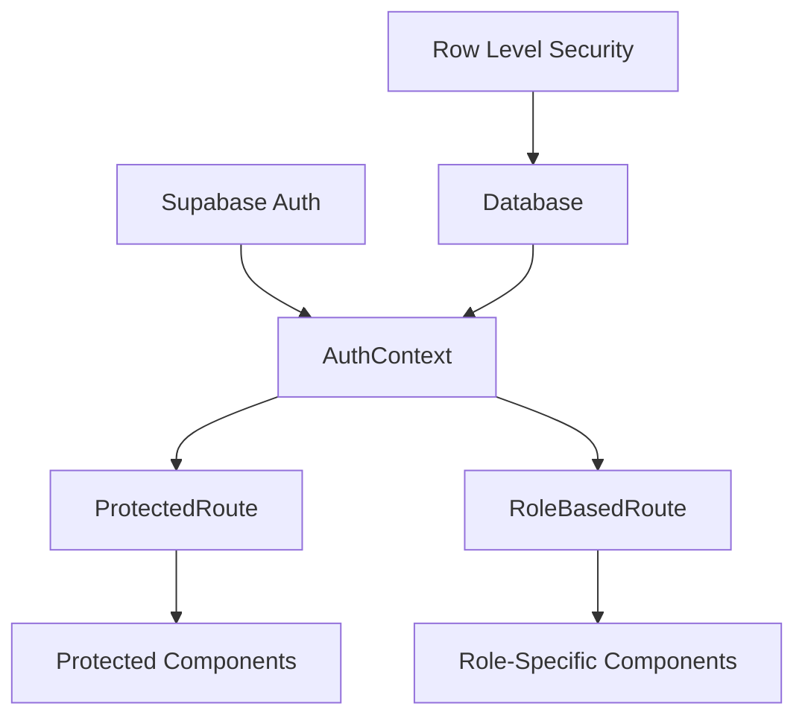
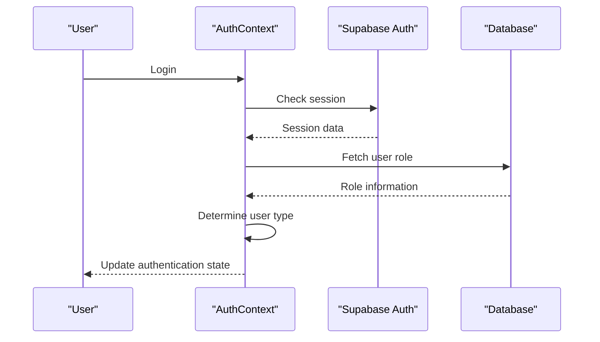
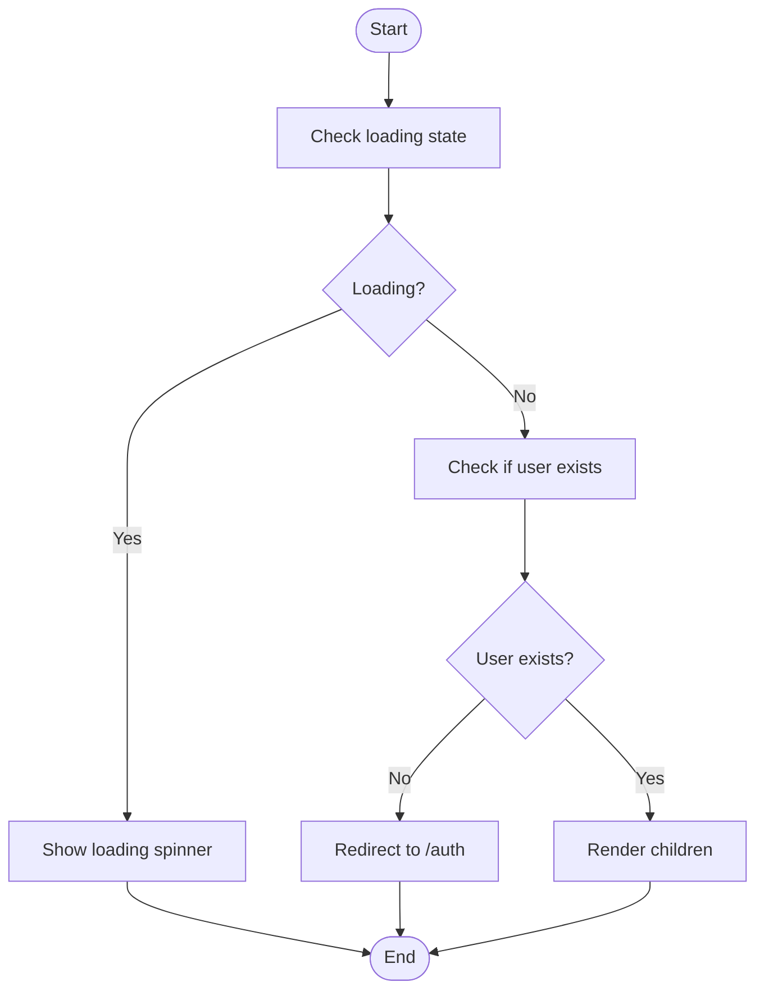
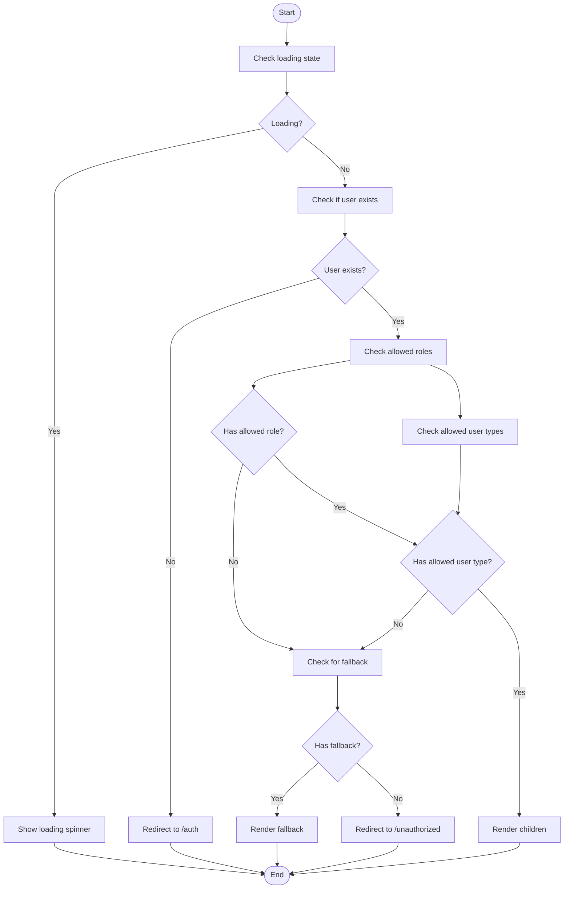
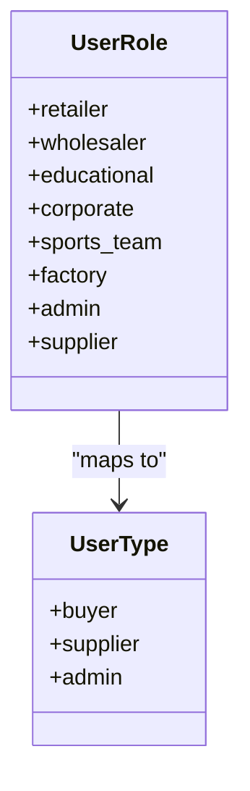
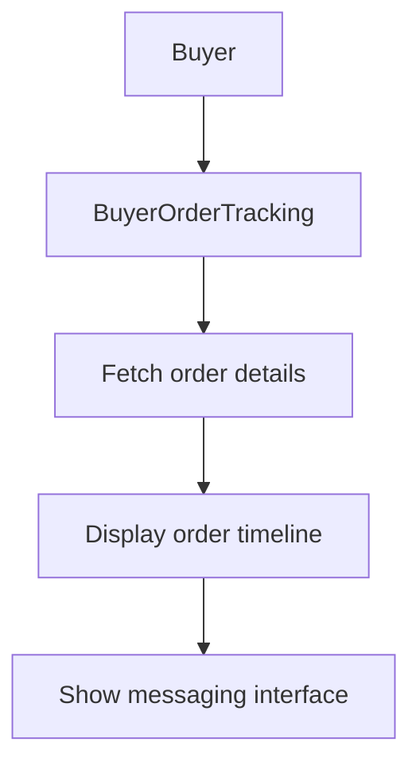
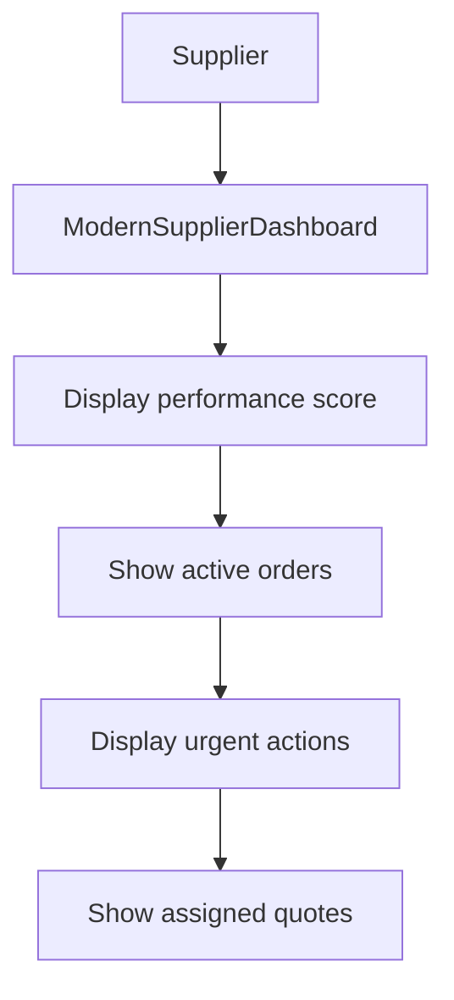
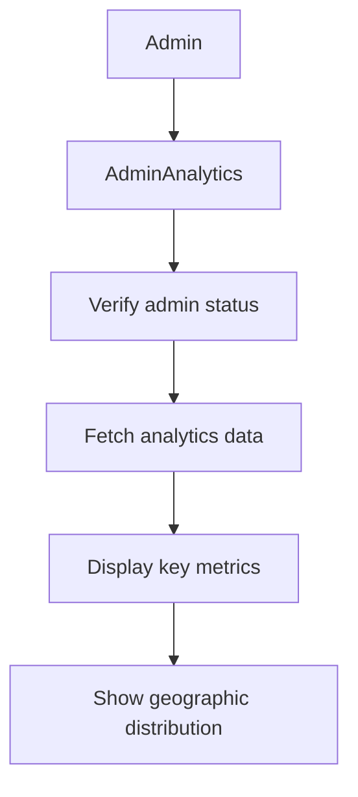
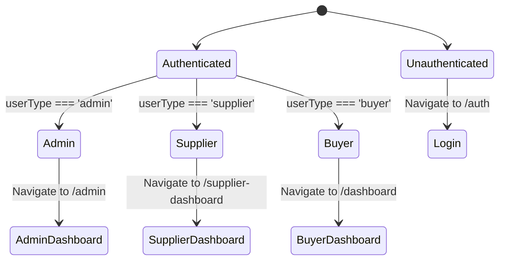
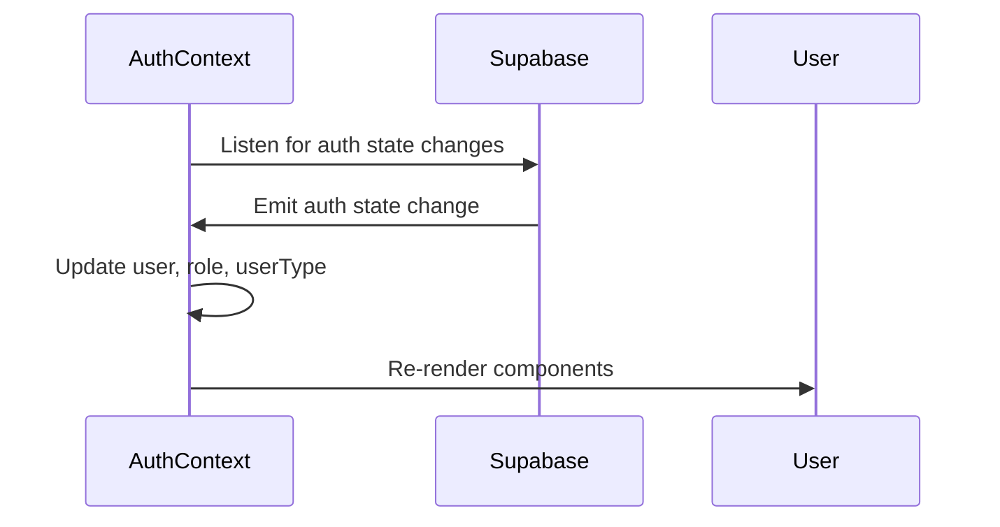

# Role-Based Access Control

<cite>
**Referenced Files in This Document**   
- [AuthContext.tsx](file://src/contexts/AuthContext.tsx)
- [ProtectedRoute.tsx](file://src/components/routes/ProtectedRoute.tsx)
- [RoleBasedRoute.tsx](file://src/components/routes/RoleBasedRoute.tsx)
- [BuyerOrderTracking.tsx](file://src/pages/BuyerOrderTracking.tsx)
- [ModernSupplierDashboard.tsx](file://src/pages/ModernSupplierDashboard.tsx)
- [AdminAnalytics.tsx](file://src/pages/AdminAnalytics.tsx)
- [supabaseHelpers.ts](file://src/lib/supabaseHelpers.ts)
- [App.tsx](file://src/App.tsx)
- [Unauthorized.tsx](file://src/pages/Unauthorized.tsx)
- [20251115150759_remix_migration_from_pg_dump.sql](file://supabase/migrations/20251115150759_remix_migration_from_pg_dump.sql)
- [admin-check/index.ts](file://supabase/functions/admin-check/index.ts)
</cite>

## Table of Contents
1. [Introduction](#introduction)
2. [Core Architecture](#core-architecture)
3. [Authentication Flow](#authentication-flow)
4. [Role-Based Access Implementation](#role-based-access-implementation)
5. [User Roles and Types](#user-roles-and-types)
6. [Database Schema and Row Level Security](#database-schema-and-row-level-security)
7. [Practical Examples](#practical-examples)
8. [Common Issues and Solutions](#common-issues-and-solutions)
9. [Conclusion](#conclusion)

## Introduction

The Role-Based Access Control (RBAC) system in this application manages permissions for four distinct roles: Buyer, Supplier, Admin, and Staff. The system is built on React Context (AuthContext) combined with ProtectedRoute and RoleBasedRoute components to enforce access policies. User roles are stored in the database and validated via Supabase authentication with Row Level Security (RLS). This documentation explains the architecture, implementation, and practical usage of the RBAC system.

**Section sources**
- [AuthContext.tsx](file://src/contexts/AuthContext.tsx#L1-L166)
- [App.tsx](file://src/App.tsx#L1-L362)

## Core Architecture

The RBAC system is built on three core components:

1. **AuthContext**: Manages authentication state and user roles
2. **ProtectedRoute**: Ensures users are authenticated before accessing protected routes
3. **RoleBasedRoute**: Enforces role-specific access to routes and components

The system uses React Context to provide authentication state throughout the application, with Supabase handling the backend authentication and database operations.



**Diagram sources**
- [AuthContext.tsx](file://src/contexts/AuthContext.tsx#L1-L166)
- [ProtectedRoute.tsx](file://src/components/routes/ProtectedRoute.tsx#L1-L36)
- [RoleBasedRoute.tsx](file://src/components/routes/RoleBasedRoute.tsx#L1-L60)

## Authentication Flow

The authentication flow begins when a user logs in through Supabase. The AuthContext listens for authentication state changes and fetches the user's role from the database. The role is then used to determine the user's type (buyer, supplier, or admin) and set appropriate flags.



**Diagram sources**
- [AuthContext.tsx](file://src/contexts/AuthContext.tsx#L121-L145)
- [supabaseHelpers.ts](file://src/lib/supabaseHelpers.ts#L228-L256)

## Role-Based Access Implementation

### ProtectedRoute Component

The ProtectedRoute component ensures that only authenticated users can access protected routes. It displays a loading spinner while authentication state is being determined and redirects unauthenticated users to the authentication page.



**Section sources**
- [ProtectedRoute.tsx](file://src/components/routes/ProtectedRoute.tsx#L1-L36)

### RoleBasedRoute Component

The RoleBasedRoute component extends ProtectedRoute by adding role-based access control. It can check for specific roles or user types and provides options for redirection or fallback content when access is denied.



**Section sources**
- [RoleBasedRoute.tsx](file://src/components/routes/RoleBasedRoute.tsx#L1-L60)

## User Roles and Types

The system defines multiple user roles and maps them to broader user types for simplified access control.

### Role Definitions

```typescript
export type UserRole =
  | 'retailer'
  | 'wholesaler'
  | 'educational'
  | 'corporate'
  | 'sports_team'
  | 'factory'
  | 'admin'
  | 'supplier';

export type UserType = 'buyer' | 'supplier' | 'admin';
```

### Role to Type Mapping

The system maps specific roles to broader user types:
- **Buyer**: retailer, wholesaler, educational, corporate, sports_team
- **Supplier**: supplier, factory
- **Admin**: admin

This hierarchical approach allows for both granular role-based access and simpler type-based access control.



**Section sources**
- [AuthContext.tsx](file://src/contexts/AuthContext.tsx#L5-L24)
- [AuthContext.tsx](file://src/contexts/AuthContext.tsx#L67-L74)

## Database Schema and Row Level Security

### User Roles Table

User roles are stored in the `user_roles` table in the database, with a one-to-one relationship between users and roles.

```sql
CREATE TABLE user_roles (
  user_id UUID REFERENCES auth.users(id) ON DELETE CASCADE,
  role TEXT NOT NULL,
  PRIMARY KEY (user_id, role)
);
```

### Row Level Security

The system implements Row Level Security (RLS) policies to ensure that users can only access data they are authorized to see. For example, the lead capture system has policies that allow public insertion but restrict reading and updating to admins only.

```sql
-- Lead captures: Public can insert, only admins can read/update
CREATE POLICY "Anyone can submit lead capture form"
  ON public.lead_captures
  FOR INSERT
  TO public
  WITH CHECK (true);

CREATE POLICY "Admins can view all lead captures"
  ON public.lead_captures
  FOR SELECT
  TO authenticated
  USING (
    EXISTS (
      SELECT 1 FROM public.user_roles
      WHERE user_roles.user_id = auth.uid()
      AND user_roles.role = 'admin'
    )
  );
```

### Admin Verification

Admin status is verified through a server-side function that checks the user's role in the database, preventing client-side manipulation.

```typescript
// Server-side admin check
const { data, error } = await supabase.functions.invoke('admin-check', {
  headers: {
    Authorization: `Bearer ${session.access_token}`,
  },
});
```

**Section sources**
- [20251115150759_remix_migration_from_pg_dump.sql](file://supabase/migrations/20251115150759_remix_migration_from_pg_dump.sql#L320-L323)
- [admin-check/index.ts](file://supabase/functions/admin-check/index.ts#L44-L64)
- [useAdminAuth.ts](file://src/hooks/useAdminAuth.ts#L24-L29)

## Practical Examples

### Buyer-Specific Access

Buyers have access to order tracking and quote management features. The BuyerOrderTracking page is protected by the ProtectedRoute component and displays order-specific information.



**Section sources**
- [BuyerOrderTracking.tsx](file://src/pages/BuyerOrderTracking.tsx#L1-L217)

### Supplier-Specific Access

Suppliers have access to production management tools and performance metrics. The ModernSupplierDashboard provides a comprehensive view of the supplier's operations.



**Section sources**
- [ModernSupplierDashboard.tsx](file://src/pages/ModernSupplierDashboard.tsx#L1-L660)

### Admin-Specific Access

Admins have access to analytics, user management, and system monitoring features. The AdminAnalytics page includes server-side role verification to prevent unauthorized access.



**Section sources**
- [AdminAnalytics.tsx](file://src/pages/AdminAnalytics.tsx#L1-L342)

## Common Issues and Solutions

### Unauthorized Access Attempts

When users attempt to access unauthorized routes, they are redirected to the Unauthorized page, which provides appropriate navigation options based on their authentication state.



**Section sources**
- [Unauthorized.tsx](file://src/pages/Unauthorized.tsx#L1-L107)

### Session Management

The system handles session management through Supabase's authentication system, with the AuthContext listening for authentication state changes and updating the application state accordingly.



**Section sources**
- [AuthContext.tsx](file://src/contexts/AuthContext.tsx#L125-L145)

## Conclusion

The Role-Based Access Control system in this application provides a robust and secure way to manage permissions for different user roles. By combining React Context, ProtectedRoute, and RoleBasedRoute components with Supabase authentication and Row Level Security, the system ensures that users can only access the features and data appropriate to their role. The hierarchical approach of mapping specific roles to broader user types simplifies access control while maintaining flexibility for granular permissions when needed.