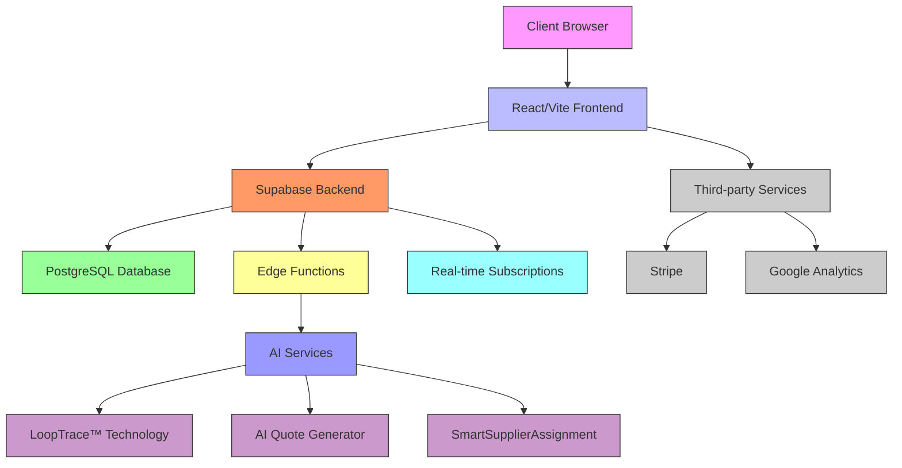
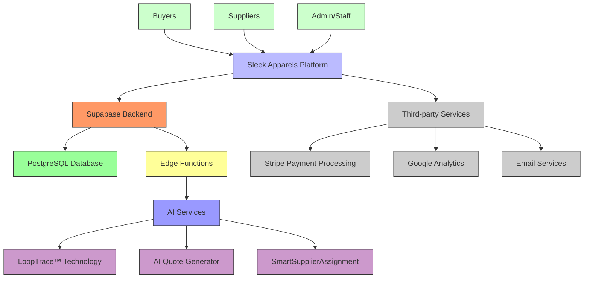
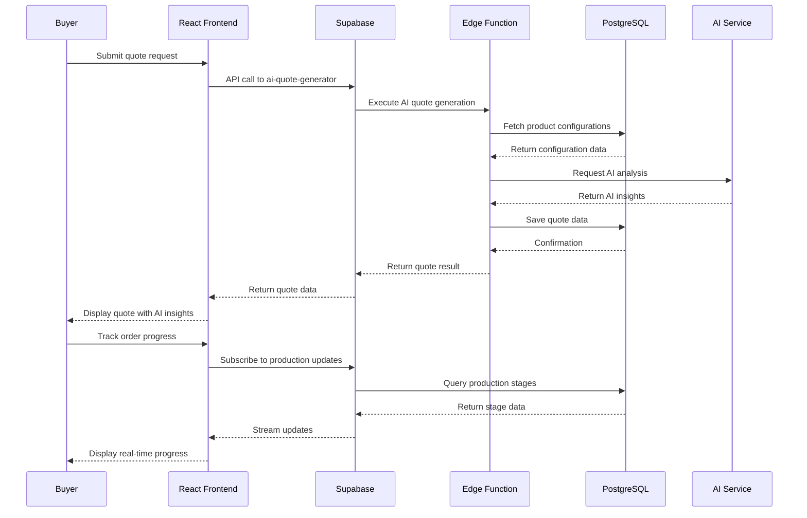

# System Overview

<cite>
**Referenced Files in This Document**   
- [README.md](file://README.md)
- [App.tsx](file://src/App.tsx)
- [main.tsx](file://src/main.tsx)
- [vite.config.ts](file://vite.config.ts)
- [supabase/config.toml](file://supabase/config.toml)
- [client.ts](file://src/integrations/supabase/client.ts)
- [AIQuoteGenerator.tsx](file://src/components/AIQuoteGenerator.tsx)
- [ProductionStageTimeline.tsx](file://src/components/production/ProductionStageTimeline.tsx)
- [ProductionTracking.tsx](file://src/pages/ProductionTracking.tsx)
- [database.ts](file://src/types/database.ts)
- [RoleBasedRoute.tsx](file://src/components/routes/RoleBasedRoute.tsx)
- [ai-quote-generator/index.ts](file://supabase/functions/ai-quote-generator/index.ts)
- [ai-supplier-assignment/index.ts](file://supabase/functions/ai-supplier-assignment/index.ts)
</cite>

## Table of Contents
1. [Introduction](#introduction)
2. [Core Features](#core-features)
3. [Architecture Overview](#architecture-overview)
4. [Technology Stack](#technology-stack)
5. [User Roles and Workflows](#user-roles-and-workflows)
6. [System Context Diagram](#system-context-diagram)
7. [Component Interaction Diagram](#component-interaction-diagram)

## Introduction

Sleek Apparels is a comprehensive knitwear manufacturing and supply chain management platform that leverages advanced technology to streamline the apparel production process. The platform combines AI-powered production tracking (LoopTrace™ Technology) with intelligent quote generation to provide end-to-end visibility and efficiency for buyers, suppliers, and administrators.

As a full-stack application built with React/Vite for the frontend and Supabase for the backend, Sleek Apparels offers a modern, responsive interface with real-time capabilities. The system is designed to address the complexities of global apparel manufacturing by providing transparent production tracking, predictive analytics, and automated supplier assignment.

The platform serves as a digital bridge between apparel brands (buyers) and manufacturing partners (suppliers), facilitating seamless collaboration throughout the production lifecycle. With features like role-based access control, real-time communication, and CMS capabilities, Sleek Apparels creates an integrated ecosystem that enhances decision-making and operational efficiency.

**Section sources**
- [README.md](file://README.md#L1-L362)

## Core Features

Sleek Apparels offers a comprehensive suite of features designed to optimize the apparel manufacturing process:

### LoopTrace™ Production Tracking
The LoopTrace™ technology provides real-time visibility across eight manufacturing stages:
- Order Confirmation
- Fabric Sourcing
- Accessories Procurement
- Cutting & Pattern Making
- Sewing & Assembly
- Quality Control
- Finishing & Packaging
- Shipment & Delivery

Key capabilities include AI-powered predictive delay alerts, multi-supplier coordination, automated status notifications, production analytics, photo documentation at each stage, and direct messaging with suppliers.

### AI Quote Generator
The intelligent pricing system features:
- Real-time market research integration
- OTP verification for security
- Historical quote comparison
- Alternative material suggestions
- Automated lead capture
- AI-powered cost optimization recommendations

### Role-Based Access Control
The platform implements a sophisticated permission system with four distinct user roles:
- **Buyers**: View orders and track production progress
- **Suppliers**: Update production stages and communicate with buyers
- **Admin/Staff**: Full oversight and management capabilities
- **Factory**: Production-specific operations and reporting

### Additional Key Features
- Real-time communication between stakeholders
- Predictive analytics for production timelines and quality risks
- CMS capabilities for content management
- SmartSupplierAssignment using AI algorithms
- Financial management and invoicing
- Production analytics and performance metrics

**Section sources**
- [README.md](file://README.md#L11-L263)

## Architecture Overview

Sleek Apparels follows a modern full-stack architecture with a clear separation between frontend and backend components. The system is built on a React/Vite frontend with a Supabase backend, leveraging Edge Functions for AI-powered features and PostgreSQL for data persistence.

The architecture is designed for scalability and real-time performance, with React Query for efficient data fetching and caching on the frontend, and Supabase's real-time subscriptions for instant updates across the system. The use of TypeScript throughout the codebase ensures type safety and reduces runtime errors.

**Diagram sources**
- [App.tsx](file://src/App.tsx#L1-L362)
- [main.tsx](file://src/main.tsx#L1-L39)
- [vite.config.ts](file://vite.config.ts#L1-L216)
- [supabase/config.toml](file://supabase/config.toml#L1-L80)
- [client.ts](file://src/integrations/supabase/client.ts#L1-L20)

## Technology Stack

### Frontend
The frontend is built with modern web technologies:
- **React 18**: Component-based UI framework
- **TypeScript**: Type safety and enhanced developer experience
- **Vite**: Fast build tool with hot module replacement
- **shadcn/ui**: Component library for consistent UI patterns
- **Tailwind CSS**: Utility-first CSS framework
- **Framer Motion**: Animation library
- **React Query**: Data fetching and state management
- **Zod**: Schema validation
- **Lucide React**: Icon library

### Backend
The backend infrastructure leverages Supabase as a Backend-as-a-Service:
- **PostgreSQL**: Relational database for data persistence
- **Real-time Subscriptions**: WebSocket-based real-time updates
- **Edge Functions**: Serverless functions for AI processing
- **Authentication & Authorization**: User management and security
- **Storage**: File storage for product images and documents

### Key Libraries and Tools
- **React Router**: Client-side routing
- **Date-fns**: Date manipulation
- **React Hook Form**: Form handling
- **Recharts**: Data visualization
- **Sonner**: Toast notifications
- **Radix UI**: Accessible UI primitives
- **Vite Compression**: Build optimization

**Section sources**
- [README.md](file://README.md#L57-L80)
- [package.json](file://package.json#L1-L115)
- [vite.config.ts](file://vite.config.ts#L1-L216)

## User Roles and Workflows

### Buyer Workflow
1. **Quote Request**: Buyers use the AI Quote Generator to submit product requirements
2. **Quote Review**: Receive instant pricing with AI-powered insights and recommendations
3. **Order Placement**: Convert approved quotes to production orders
4. **Production Tracking**: Monitor real-time progress through the LoopTrace™ timeline
5. **Communication**: Direct messaging with suppliers for coordination
6. **Quality Control**: Review QC reports and approve final products
7. **Delivery**: Track shipment and receive products

### Supplier Workflow
1. **Order Assignment**: Receive assigned orders through SmartSupplierAssignment
2. **Production Planning**: Review order specifications and plan production
3. **Stage Updates**: Update production stages with progress, photos, and notes
4. **Communication**: Direct messaging with buyers for clarification
5. **Quality Reporting**: Submit QC inspection results
6. **Shipping Coordination**: Prepare and ship completed orders
7. **Performance Review**: View performance metrics and feedback

### Admin Workflow
1. **Dashboard Oversight**: Monitor overall platform performance and key metrics
2. **Order Management**: Oversee all orders and intervene when necessary
3. **Supplier Management**: Verify and manage supplier accounts
4. **Analytics**: Review business analytics and production insights
5. **Content Management**: Update CMS content and marketing materials
6. **Security Monitoring**: Monitor system security and audit logs
7. **Automation Rules**: Configure and manage business automation rules

Each role has a dedicated dashboard with role-specific features and data views, ensuring users only see information relevant to their responsibilities.

**Section sources**
- [README.md](file://README.md#L50-L54)
- [App.tsx](file://src/App.tsx#L180-L310)
- [RoleBasedRoute.tsx](file://src/components/routes/RoleBasedRoute.tsx#L1-L60)

## System Context Diagram

**Diagram sources**
- [App.tsx](file://src/App.tsx#L1-L362)
- [supabase/config.toml](file://supabase/config.toml#L1-L80)
- [client.ts](file://src/integrations/supabase/client.ts#L1-L20)

## Component Interaction Diagram

**Diagram sources**
- [AIQuoteGenerator.tsx](file://src/components/AIQuoteGenerator.tsx#L1-L575)
- [ai-quote-generator/index.ts](file://supabase/functions/ai-quote-generator/index.ts#L1-L807)
- [ProductionTracking.tsx](file://src/pages/ProductionTracking.tsx#L1-L540)
- [ProductionStageTimeline.tsx](file://src/components/production/ProductionStageTimeline.tsx#L1-L183)
- [database.ts](file://src/types/database.ts#L1-L579)