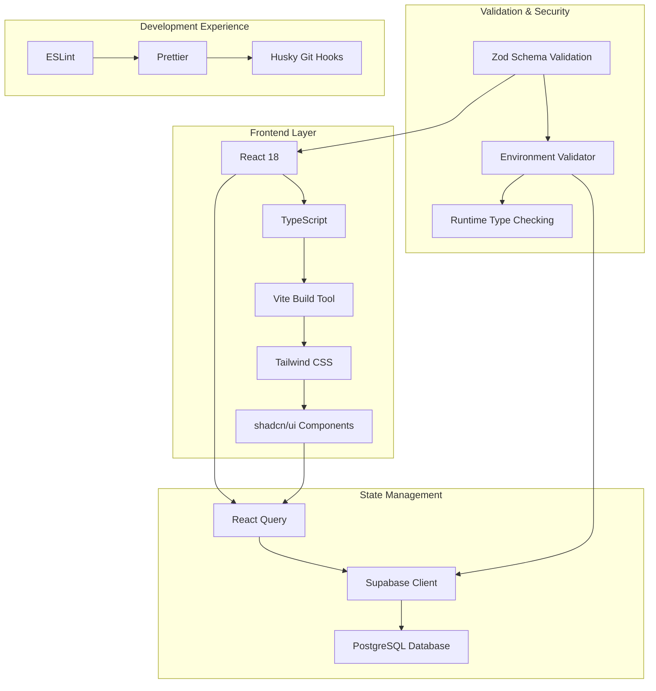
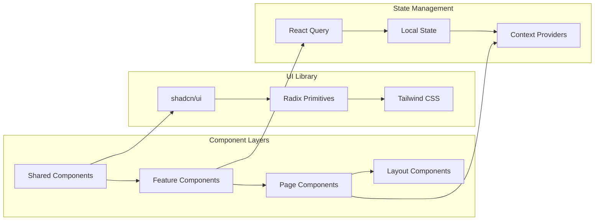
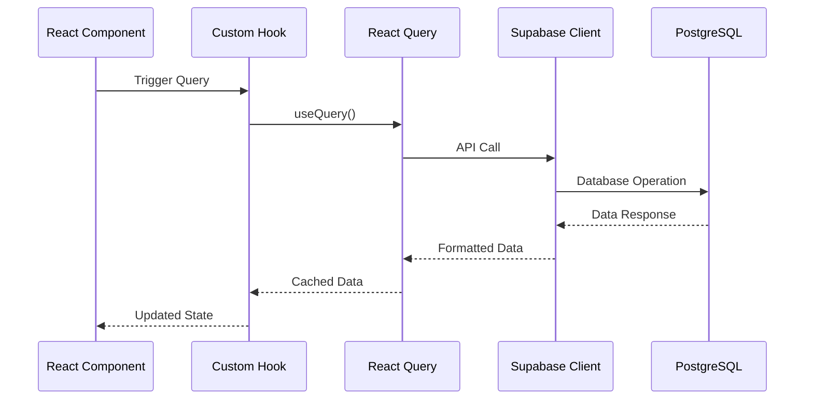
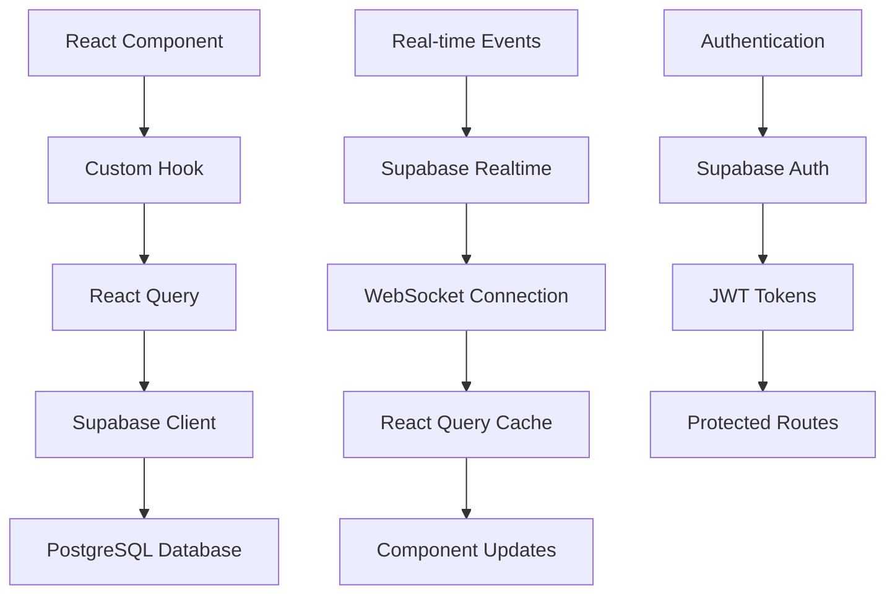

# Technology Stack & Dependencies

<cite>
**Referenced Files in This Document**
- [package.json](file://package.json)
- [vite.config.ts](file://vite.config.ts)
- [tailwind.config.ts](file://tailwind.config.ts)
- [tsconfig.json](file://tsconfig.json)
- [src/vite-env.d.ts](file://src/vite-env.d.ts)
- [src/App.tsx](file://src/App.tsx)
- [src/integrations/supabase/client.ts](file://src/integrations/supabase/client.ts)
- [src/integrations/supabase/types.ts](file://src/integrations/supabase/types.ts)
- [src/hooks/useSuppliers.ts](file://src/hooks/useSuppliers.ts)
- [src/hooks/useNotifications.ts](file://src/hooks/useNotifications.ts)
- [src/hooks/queries/index.ts](file://src/hooks/queries/index.ts)
- [src/components/ui/button.tsx](file://src/components/ui/button.tsx)
- [src/lib/env-validator.ts](file://src/lib/env-validator.ts)
- [components.json](file://components.json)
</cite>

## Table of Contents
1. [Introduction](#introduction)
2. [Technology Stack Overview](#technology-stack-overview)
3. [Core Technologies](#core-technologies)
4. [Frontend Architecture](#frontend-architecture)
5. [Backend Integration](#backend-integration)
6. [Development Tools](#development-tools)
7. [Performance Optimization](#performance-optimization)
8. [Integration Patterns](#integration-patterns)
9. [Configuration Management](#configuration-management)
10. [Best Practices](#best-practices)

## Introduction

Sleekapp-v100 is built on a modern React 18 application architecture that leverages cutting-edge web technologies to deliver a scalable, performant, and developer-friendly platform. The technology stack combines frontend excellence with robust backend capabilities, creating a seamless development experience while maintaining production-ready performance standards.

This comprehensive technology stack emphasizes developer productivity, type safety, and performance optimization through carefully selected tools and frameworks that work harmoniously together.

## Technology Stack Overview

The sleekapp-v100 technology stack follows a layered architecture pattern with clear separation of concerns:

**Diagram sources**
- [package.json](file://package.json#L13-L91)
- [vite.config.ts](file://vite.config.ts#L1-L216)
- [tailwind.config.ts](file://tailwind.config.ts#L1-L196)

**Section sources**
- [package.json](file://package.json#L13-L91)
- [vite.config.ts](file://vite.config.ts#L1-L216)

## Core Technologies

### React 18 - Component-Based UI Framework

React 18 serves as the foundation of the application, providing modern rendering capabilities and enhanced developer experience.

**Key Features:**
- Concurrent Rendering for improved performance
- Automatic batching of updates for better efficiency
- New APIs for suspense and streaming server-side rendering
- Built-in support for TypeScript with excellent type inference

**Implementation Details:**
- Version: ^18.3.1 (latest stable release)
- Strict Mode enabled for early detection of potential issues
- Concurrent features utilized for optimal user experience
- Server-side rendering capabilities for SEO and performance

**Section sources**
- [package.json](file://package.json#L71-L72)
- [src/App.tsx](file://src/App.tsx#L1-L344)

### TypeScript - Type Safety & Developer Experience

TypeScript provides comprehensive type safety and enhances the development workflow with intelligent code completion and refactoring support.

**Configuration:**
- Version: ^5.8.3 (latest stable)
- Strict type checking enabled with minimal exceptions
- Path mapping configured for clean imports
- Declaration files generated for external packages

**Type System Benefits:**
- Compile-time error detection
- Enhanced IDE support with IntelliSense
- Better code documentation through type annotations
- Improved maintainability and refactoring capabilities

**Section sources**
- [package.json](file://package.json#L110)
- [tsconfig.json](file://tsconfig.json#L1-L16)
- [src/vite-env.d.ts](file://src/vite-env.d.ts#L1-L2)

### Vite - Fast Development Builds

Vite serves as the build tool and development server, providing lightning-fast development experience and optimized production builds.

**Key Features:**
- Instant server start with ES module-based architecture
- Lightning-fast hot module replacement (HMR)
- Optimized production builds with automatic code splitting
- Built-in support for TypeScript, JSX, and CSS preprocessing

**Build Optimizations:**
- ESBuild-powered JavaScript compilation
- LightningCSS for faster CSS processing
- Automatic code splitting based on usage patterns
- Asset optimization and compression

**Section sources**
- [package.json](file://package.json#L112)
- [vite.config.ts](file://vite.config.ts#L1-L216)

### Supabase - Backend-as-a-Service

Supabase provides a comprehensive backend solution with real-time capabilities, authentication, and database management.

**Components:**
- PostgreSQL database with real-time subscriptions
- Authentication service with OAuth providers
- Storage service for file management
- Edge functions for serverless computing

**Integration Benefits:**
- Real-time data synchronization
- Built-in authentication and authorization
- Scalable infrastructure with automatic scaling
- Comprehensive API surface for frontend consumption

**Section sources**
- [package.json](file://package.json#L44)
- [src/integrations/supabase/client.ts](file://src/integrations/supabase/client.ts#L1-L20)
- [src/integrations/supabase/types.ts](file://src/integrations/supabase/types.ts#L1-L800)

## Frontend Architecture

### Component System Architecture

The application follows a modular component architecture with clear separation of concerns:

**Diagram sources**
- [src/components/ui/button.tsx](file://src/components/ui/button.tsx#L1-L51)
- [src/App.tsx](file://src/App.tsx#L1-L344)

### shadcn/ui - Accessible UI Components

shadcn/ui provides a collection of accessible, customizable React components built on Radix primitives.

**Benefits:**
- Accessibility-first design principles
- Consistent design system across the application
- Highly customizable with CSS variables
- Zero runtime dependencies beyond Radix

**Component Categories:**
- Form controls (inputs, selects, checkboxes)
- Navigation (menus, breadcrumbs, pagination)
- Feedback (alerts, modals, tooltips)
- Layout (cards, grids, spacing)

**Section sources**
- [package.json](file://package.json#L15-L89)
- [components.json](file://components.json#L1-L21)
- [src/components/ui/button.tsx](file://src/components/ui/button.tsx#L1-L51)

### Tailwind CSS - Utility-First Styling

Tailwind CSS provides a utility-first approach to styling with comprehensive customization capabilities.

**Configuration Highlights:**
- CSS Variables for theme consistency
- Dark mode support out of the box
- Custom color palette and typography scales
- Animation and transition utilities

**Customizations:**
- Extended spacing scale for consistent layouts
- Custom font families with fallbacks
- Shadow and border radius variations
- Animation keyframes for interactive elements

**Section sources**
- [tailwind.config.ts](file://tailwind.config.ts#L1-L196)
- [components.json](file://components.json#L6-L11)

## Backend Integration

### React Query - Data Fetching & State Management

React Query provides powerful data fetching, caching, and synchronization capabilities for the frontend.

**Key Features:**
- Automatic background updates
- Intelligent caching with garbage collection
- Optimistic updates for responsive UI
- Real-time data synchronization

**Implementation Pattern:**

**Diagram sources**
- [src/hooks/useSuppliers.ts](file://src/hooks/useSuppliers.ts#L1-L215)
- [src/hooks/useNotifications.ts](file://src/hooks/useNotifications.ts#L1-L106)

**Section sources**
- [package.json](file://package.json#L45-L46)
- [src/hooks/useSuppliers.ts](file://src/hooks/useSuppliers.ts#L1-L215)
- [src/App.tsx](file://src/App.tsx#L127-L145)

### Zod - Schema Validation

Zod provides compile-time and runtime type safety through schema validation.

**Use Cases:**
- Form validation with TypeScript inference
- API response validation
- Environment variable validation
- Data transformation and sanitization

**Benefits:**
- Compile-time type safety
- Runtime validation with detailed error messages
- Seamless integration with TypeScript
- Lightweight and performant

**Section sources**
- [package.json](file://package.json#L91)
- [src/lib/env-validator.ts](file://src/lib/env-validator.ts#L1-L143)

## Development Tools

### ESLint & TypeScript Configuration

The development environment includes comprehensive linting and type checking:

**ESLint Configuration:**
- TypeScript-specific rules enabled
- React Hooks linting
- Modern JavaScript best practices
- Custom rule sets for the project

**TypeScript Settings:**
- Strict type checking with minimal exceptions
- Path mapping for cleaner imports
- Declaration generation for external packages
- Module resolution optimization

**Section sources**
- [package.json](file://package.json#L93-L111)
- [tsconfig.json](file://tsconfig.json#L1-L16)

### Environment Management

The application includes robust environment validation and management:

**Features:**
- Automatic environment variable validation
- Type-safe configuration access
- Development vs production environment handling
- Secure credential management

**Section sources**
- [src/lib/env-validator.ts](file://src/lib/env-validator.ts#L1-L143)
- [vite.config.ts](file://vite.config.ts#L80-L85)

## Performance Optimization

### Build-Time Optimizations

Vite's build system includes numerous performance optimizations:

**JavaScript Compilation:**
- ESBuild for ultra-fast JavaScript bundling
- Tree shaking for unused code elimination
- Code splitting based on usage patterns

**CSS Processing:**
- LightningCSS for faster CSS optimization
- PurgeCSS for removing unused styles
- CSS inlining for critical styles

**Asset Optimization:**
- Image compression and optimization
- Gzip and Brotli compression
- CDN-friendly asset naming

**Section sources**
- [vite.config.ts](file://vite.config.ts#L55-L89)

### Runtime Optimizations

**React Optimizations:**
- Memoization with React.memo and useMemo
- Lazy loading for non-critical components
- Suspense boundaries for progressive loading

**Data Fetching Optimizations:**
- Intelligent caching with React Query
- Background refetching strategies
- Optimistic updates for responsiveness

**Section sources**
- [src/App.tsx](file://src/App.tsx#L15-L16)
- [src/hooks/useSuppliers.ts](file://src/hooks/useSuppliers.ts#L95-L97)

## Integration Patterns

### Frontend-Supabase Integration

The application demonstrates sophisticated integration patterns between frontend and backend:

**Diagram sources**
- [src/hooks/useNotifications.ts](file://src/hooks/useNotifications.ts#L38-L64)
- [src/integrations/supabase/client.ts](file://src/integrations/supabase/client.ts#L14-L20)

### Query Hook Architecture

The application uses a centralized query hook system for consistent data management:

**Pattern Benefits:**
- Consistent error handling across all queries
- Centralized caching and invalidation logic
- Reusable query configurations
- Type-safe data fetching

**Section sources**
- [src/hooks/queries/index.ts](file://src/hooks/queries/index.ts#L1-L5)
- [src/hooks/useSuppliers.ts](file://src/hooks/useSuppliers.ts#L48-L98)

## Configuration Management

### Vite Configuration

The Vite configuration demonstrates advanced build optimization techniques:

**Key Configuration Areas:**
- Alias configuration for clean imports
- Plugin system for build enhancements
- Environment variable injection
- Code splitting strategies

**Advanced Features:**
- Custom CSS transformation for preloading
- Bundle analysis and optimization
- Development server configuration
- Production build optimizations

**Section sources**
- [vite.config.ts](file://vite.config.ts#L1-L216)

### Tailwind Configuration

The Tailwind configuration provides a comprehensive design system:

**Customizations:**
- Theme variables for consistent design
- Custom color palette integration
- Typography scales for readability
- Animation and transition systems

**Section sources**
- [tailwind.config.ts](file://tailwind.config.ts#L1-L196)

## Best Practices

### Development Workflow

The technology stack enforces several best practices:

**Code Quality:**
- Comprehensive TypeScript coverage
- Automated linting and formatting
- Type-safe API integrations
- Consistent component patterns

**Performance:**
- Lazy loading for non-critical features
- Intelligent caching strategies
- Optimized bundle sizes
- Progressive enhancement

**Maintainability:**
- Modular component architecture
- Centralized configuration management
- Clear separation of concerns
- Comprehensive testing infrastructure

### Security Considerations

**Environment Security:**
- Runtime environment validation
- Secure credential management
- HTTPS enforcement in production
- CSP header configuration

**Data Security:**
- Type-safe API communications
- Input validation with Zod
- Secure authentication flows
- Authorization patterns

**Section sources**
- [src/lib/env-validator.ts](file://src/lib/env-validator.ts#L134-L143)
- [src/integrations/supabase/client.ts](file://src/integrations/supabase/client.ts#L14-L20)