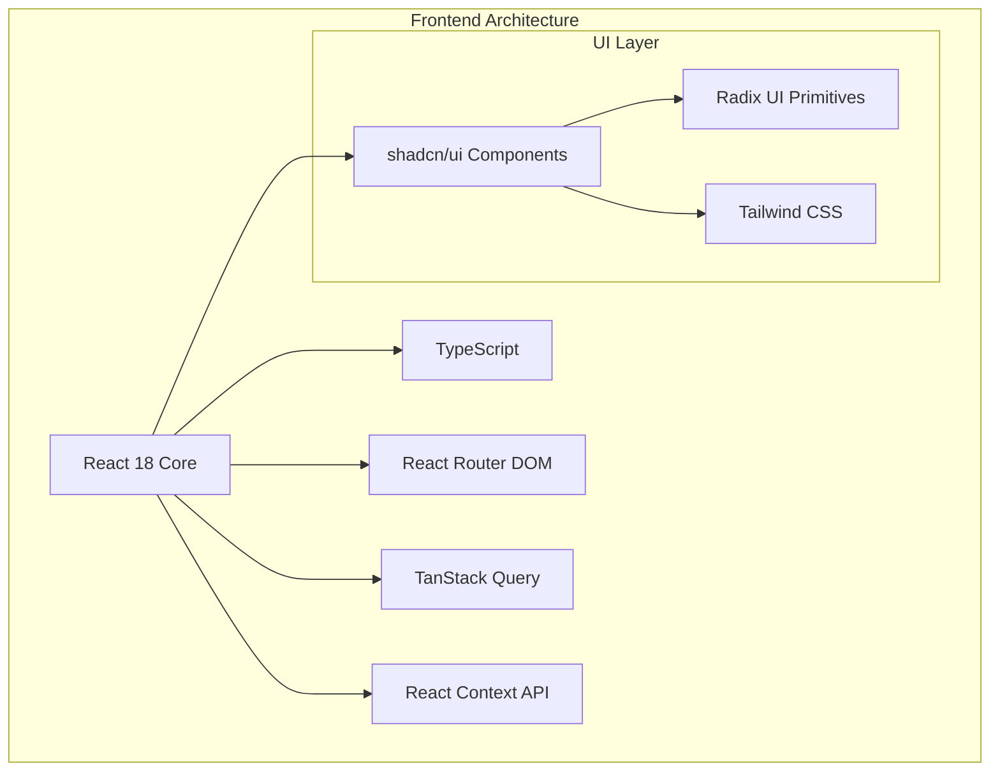
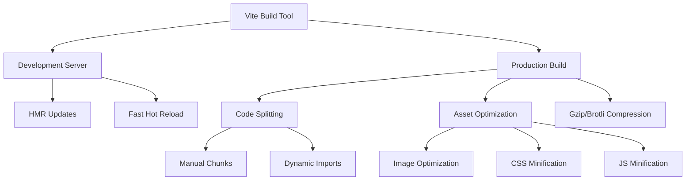
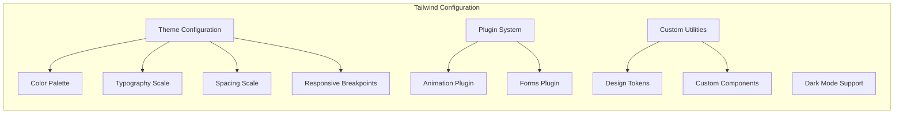
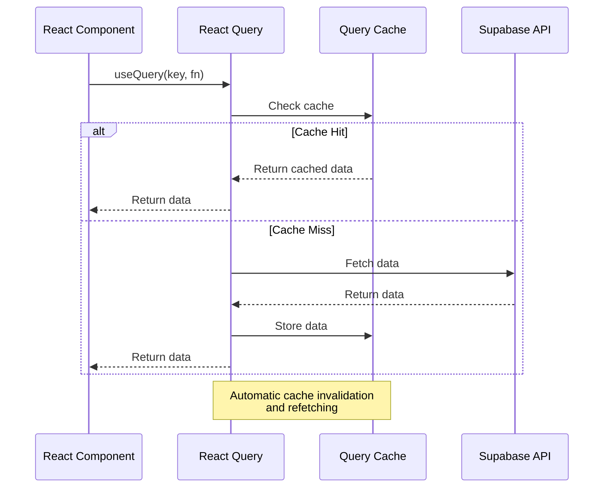
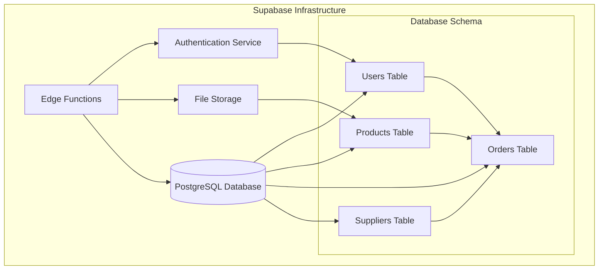
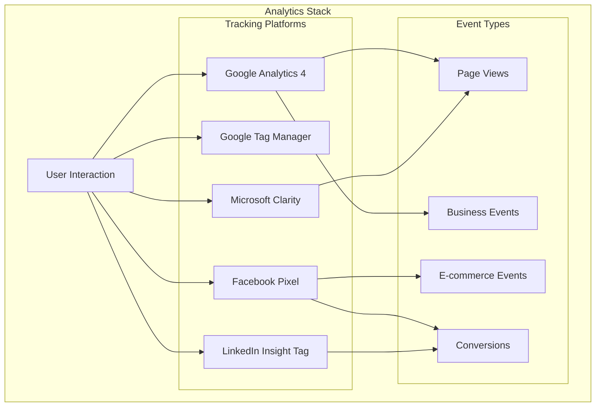

# Technology Stack

<cite>
**Referenced Files in This Document**
- [package.json](file://package.json)
- [vite.config.ts](file://vite.config.ts)
- [tailwind.config.ts](file://tailwind.config.ts)
- [tsconfig.json](file://tsconfig.json)
- [eslint.config.js](file://eslint.config.js)
- [vitest.config.ts](file://vitest.config.ts)
- [index.html](file://index.html)
- [src/main.tsx](file://src/main.tsx)
- [src/App.tsx](file://src/App.tsx)
- [src/integrations/supabase/client.ts](file://src/integrations/supabase/client.ts)
- [src/contexts/AuthContext.tsx](file://src/contexts/AuthContext.tsx)
- [src/lib/analytics.ts](file://src/lib/analytics.ts)
- [src/components/AnalyticsProvider.tsx](file://src/components/AnalyticsProvider.tsx)
- [src/components/ui/button.tsx](file://src/components/ui/button.tsx)
- [components.json](file://components.json)
</cite>

## Table of Contents
1. [Introduction](#introduction)
2. [Frontend Architecture](#frontend-architecture)
3. [Build Tools and Configuration](#build-tools-and-configuration)
4. [Styling System](#styling-system)
5. [State Management](#state-management)
6. [Backend Infrastructure](#backend-infrastructure)
7. [Analytics and Tracking](#analytics-and-tracking)
8. [Testing Framework](#testing-framework)
9. [Performance Optimizations](#performance-optimizations)
10. [Development Workflow](#development-workflow)

## Introduction

The Sleek Apparels application employs a modern, full-stack technology stack built around React 18 with TypeScript, utilizing cutting-edge tools and frameworks for optimal performance, developer experience, and user experience. The architecture emphasizes scalability, maintainability, and performance while providing a seamless multi-user experience across buyer, supplier, and admin roles.

## Frontend Architecture

### React 18 with TypeScript

The application leverages React 18 as the primary frontend framework, providing concurrent rendering capabilities and improved performance. TypeScript integration ensures type safety and enhanced developer productivity.

**Diagram sources**
- [src/App.tsx](file://src/App.tsx#L1-L362)
- [package.json](file://package.json#L71-L72)

### Component Library: shadcn/ui

The application utilizes shadcn/ui as its primary component library, providing a cohesive design system with customizable themes and accessibility features. The configuration enables TypeScript support and Tailwind CSS integration.

**Section sources**
- [components.json](file://components.json#L1-L21)
- [src/components/ui/button.tsx](file://src/components/ui/button.tsx#L1-L51)

### Routing and Navigation

React Router DOM handles client-side routing with protected routes and role-based access control. The router supports lazy loading for optimal performance and SEO-friendly URL structures.

**Section sources**
- [src/App.tsx](file://src/App.tsx#L180-L313)

## Build Tools and Configuration

### Vite Configuration

Vite serves as the primary build tool, providing fast development server startup and optimized production builds. The configuration includes advanced optimizations for code splitting, asset handling, and performance.

**Diagram sources**
- [vite.config.ts](file://vite.config.ts#L1-L216)

#### Key Build Optimizations

The Vite configuration implements several advanced optimizations:

- **Code Splitting Strategy**: Intelligent chunking based on usage patterns and critical path analysis
- **Asset Optimization**: Automatic compression and optimization for images and static assets
- **Performance Monitoring**: Built-in bundle analysis and performance tracking
- **Environment Variables**: Secure environment variable handling with fallbacks

**Section sources**
- [vite.config.ts](file://vite.config.ts#L1-L216)

### TypeScript Configuration

The TypeScript setup provides strict type checking with flexible configurations for different environments and use cases.

**Section sources**
- [tsconfig.json](file://tsconfig.json#L1-L27)

### ESLint Configuration

ESLint ensures code quality and consistency across the development team with custom rules for React and TypeScript projects.

**Section sources**
- [eslint.config.js](file://eslint.config.js#L1-L44)

## Styling System

### Tailwind CSS Implementation

Tailwind CSS provides a utility-first approach to styling, enabling rapid development and consistent design systems. The configuration includes custom design tokens and responsive breakpoints.

**Diagram sources**
- [tailwind.config.ts](file://tailwind.config.ts#L1-L196)

#### Design System Features

The Tailwind configuration includes:

- **Custom Color Palette**: Brand-specific colors with light/dark mode variants
- **Typography Scale**: Responsive typography with multiple weight variations
- **Spacing System**: Consistent spacing with mobile-first responsive design
- **Animation System**: Custom animations and transitions
- **Custom Design Tokens**: Brand-specific design tokens for consistency

**Section sources**
- [tailwind.config.ts](file://tailwind.config.ts#L1-L196)

### Utility-First Methodology

The utility-first approach enables rapid prototyping and maintains design consistency while allowing for component abstraction when needed.

## State Management

### React Query for Data Fetching

TanStack Query (formerly React Query) manages server state, caching, and synchronization across the application. The configuration optimizes for performance and user experience.

**Diagram sources**
- [src/App.tsx](file://src/App.tsx#L131-L149)
- [src/hooks/useProducts.ts](file://src/hooks/useProducts.ts#L144-L149)

#### Query Configuration Benefits

- **Automatic Refetching**: Intelligent cache invalidation based on user activity
- **Background Updates**: Seamless data synchronization without disrupting user experience
- **Error Handling**: Built-in error boundaries and retry mechanisms
- **Optimistic Updates**: Immediate UI updates with rollback on failure

**Section sources**
- [src/App.tsx](file://src/App.tsx#L131-L149)

### Context API for Local State

React Context API manages local application state including authentication, user preferences, and UI state.

**Section sources**
- [src/contexts/AuthContext.tsx](file://src/contexts/AuthContext.tsx#L1-L166)

## Backend Infrastructure

### Supabase Platform

Supabase provides a comprehensive backend solution with PostgreSQL database, authentication, storage, and edge functions.

**Diagram sources**
- [src/integrations/supabase/client.ts](file://src/integrations/supabase/client.ts#L1-L20)

#### Supabase Features Utilized

- **PostgreSQL Database**: Relational database with full SQL capabilities
- **Authentication**: JWT-based authentication with role-based access control
- **Storage**: Cloud storage for product images and documents
- **Edge Functions**: Serverless functions for business logic and integrations

**Section sources**
- [src/integrations/supabase/client.ts](file://src/integrations/supabase/client.ts#L1-L20)

### Edge Functions

Supabase Edge Functions provide serverless compute capabilities for business logic, integrations, and data processing.

## Analytics and Tracking

### Multi-Platform Analytics Integration

The application integrates multiple analytics platforms for comprehensive tracking and insights.

**Diagram sources**
- [src/lib/analytics.ts](file://src/lib/analytics.ts#L1-L183)
- [src/components/AnalyticsProvider.tsx](file://src/components/AnalyticsProvider.tsx#L1-L256)

#### Analytics Implementation Features

- **Deferred Loading**: Analytics scripts load only on user interaction
- **Multi-Platform Tracking**: Unified tracking across all platforms
- **Business Event Tracking**: Custom events for business metrics
- **Performance Monitoring**: Built-in performance tracking and optimization

**Section sources**
- [src/lib/analytics.ts](file://src/lib/analytics.ts#L1-L183)
- [src/components/AnalyticsProvider.tsx](file://src/components/AnalyticsProvider.tsx#L1-L256)

### Privacy-First Approach

The analytics implementation prioritizes user privacy with consent management and minimal data collection.

## Testing Framework

### Vitest Configuration

Vitest provides a fast testing environment with JSDOM for DOM testing and comprehensive coverage reporting.

**Section sources**
- [vitest.config.ts](file://vitest.config.ts#L1-L29)

#### Testing Features

- **Fast Execution**: Sub-second test execution with instant feedback
- **JSDOM Environment**: Full DOM simulation for component testing
- **Coverage Reporting**: Multiple coverage formats and thresholds
- **Setup Files**: Global test configuration and utilities

## Performance Optimizations

### Bundle Optimization

The build configuration implements advanced bundle optimization strategies:

- **Manual Chunking**: Strategic code splitting based on usage patterns
- **Tree Shaking**: Dead code elimination for smaller bundles
- **Asset Optimization**: Image compression and format optimization
- **Lazy Loading**: Dynamic imports for non-critical components

### Runtime Optimizations

- **React.memo**: Component memoization for expensive renders
- **Suspense**: Concurrent rendering for better UX
- **Error Boundaries**: Graceful error handling and recovery
- **Performance Monitoring**: Built-in performance tracking

**Section sources**
- [vite.config.ts](file://vite.config.ts#L103-L187)
- [src/main.tsx](file://src/main.tsx#L1-L39)

## Development Workflow

### Development Environment

The development setup provides:

- **Hot Module Replacement**: Instant updates during development
- **TypeScript Support**: Full IDE integration with type checking
- **ESLint Integration**: Real-time code quality feedback
- **Debugging Tools**: React Developer Tools and Query DevTools

### Production Deployment

The production build includes:

- **Code Minification**: ESBuild and Lightning CSS for fast builds
- **Asset Compression**: Gzip and Brotli compression
- **Bundle Analysis**: Visualizer for optimization insights
- **Environment Optimization**: Production-specific configurations

**Section sources**
- [package.json](file://package.json#L6-L12)