# Integration Testing

<cite>
**Referenced Files in This Document**
- [Auth.test.tsx](file://src/pages/__tests__/Auth.test.tsx)
- [test-utils.tsx](file://src/test/utils/test-utils.tsx)
- [Auth.tsx](file://src/pages/Auth.tsx)
- [AuthContext.tsx](file://src/contexts/AuthContext.tsx)
- [supabase.ts](file://src/test/mocks/supabase.ts)
- [setup.ts](file://src/test/setup.ts)
- [useAdminAuth.test.ts](file://src/hooks/__tests__/useAdminAuth.test.ts)
- [ProtectedRoute.tsx](file://src/components/routes/ProtectedRoute.tsx)
- [vitest.config.ts](file://vitest.config.ts)
- [package.json](file://package.json)
</cite>

## Table of Contents
1. [Introduction](#introduction)
2. [Testing Infrastructure Overview](#testing-infrastructure-overview)
3. [Custom Test Utilities](#custom-test-utilities)
4. [Auth Component Integration Testing](#auth-component-integration-testing)
5. [Context Provider Testing](#context-provider-testing)
6. [Protected Routes Testing](#protected-routes-testing)
7. [Mock Implementation Patterns](#mock-implementation-patterns)
8. [Asynchronous Testing Strategies](#asynchronous-testing-strategies)
9. [UI State Management Testing](#ui-state-management-testing)
10. [Best Practices and Guidelines](#best-practices-and-guidelines)

## Introduction

Integration testing in the Sleek Apparels application focuses on verifying the seamless interaction between multiple components, particularly around authentication flows, context providers, and route protection mechanisms. This comprehensive testing approach ensures that user journeys remain intact across component boundaries while maintaining proper state management and error handling.

The testing strategy emphasizes realistic user scenarios, mocking external dependencies like Supabase authentication, and validating complex interactions that span multiple layers of the application architecture.

## Testing Infrastructure Overview

The Sleek Apparels testing infrastructure is built on Vitest with JSDOM environment, providing a robust foundation for integration testing. The setup includes custom test utilities, comprehensive mocking capabilities, and specialized wrappers for simulating application context.

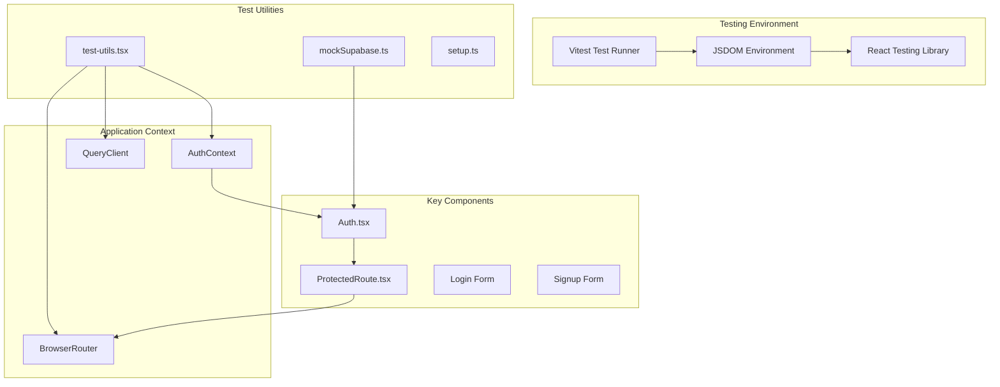

**Diagram sources**
- [vitest.config.ts](file://vitest.config.ts#L1-L29)
- [test-utils.tsx](file://src/test/utils/test-utils.tsx#L1-L39)
- [setup.ts](file://src/test/setup.ts#L1-L43)

**Section sources**
- [vitest.config.ts](file://vitest.config.ts#L1-L29)
- [package.json](file://package.json#L1-L115)

## Custom Test Utilities

The test utilities provide a sophisticated wrapper system that simulates the complete application context for integration testing. The `test-utils.tsx` file defines a comprehensive testing environment that includes React Router, TanStack Query, and custom render functions.

### Test Wrapper Architecture

The custom render system creates a complete application context by wrapping components with essential providers:

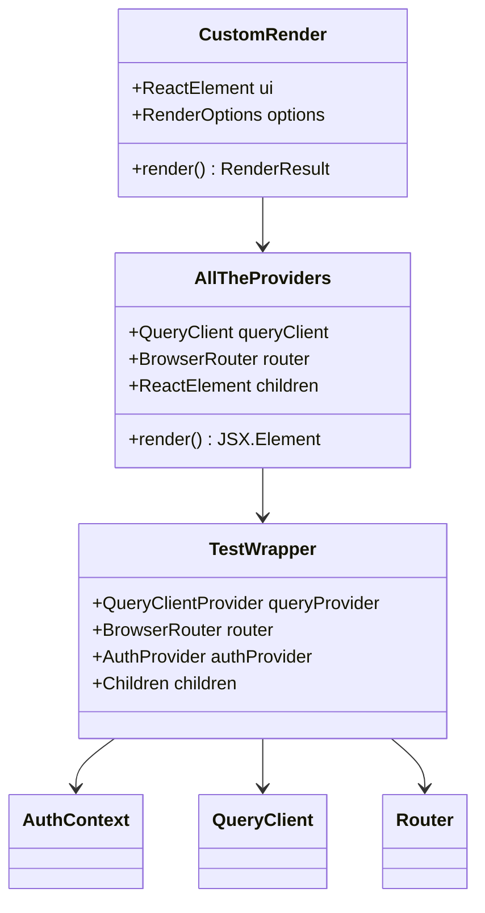

**Diagram sources**
- [test-utils.tsx](file://src/test/utils/test-utils.tsx#L19-L32)

### Query Client Configuration

The test environment uses a specialized QueryClient configuration that disables retries to ensure predictable test execution:

| Configuration Option | Value | Purpose |
|---------------------|-------|---------|
| `retry` | `false` | Prevents flaky tests due to network delays |
| `defaultOptions.queries` | `{}` | Minimal configuration for reliable test results |
| `QueryClientProvider` | Wrapped around components | Provides React Query context |

**Section sources**
- [test-utils.tsx](file://src/test/utils/test-utils.tsx#L1-L39)

## Auth Component Integration Testing

The Auth component serves as the primary integration testing target, demonstrating comprehensive user flow simulation, form validation, and state management across multiple components. The Auth.test.tsx file provides extensive coverage of login, signup, and OAuth flows.

### Authentication Flow Testing

The authentication testing suite covers multiple user scenarios with detailed state validation:

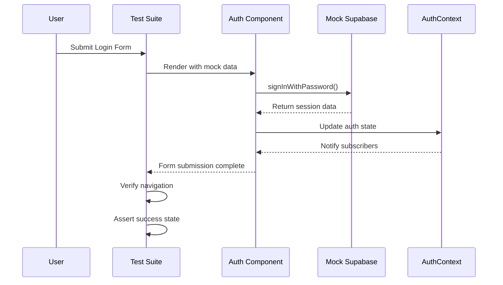

**Diagram sources**
- [Auth.test.tsx](file://src/pages/__tests__/Auth.test.tsx#L49-L68)
- [Auth.tsx](file://src/pages/Auth.tsx#L403-L458)

### Form Validation and Error Handling

The testing framework validates comprehensive form validation scenarios:

| Test Scenario | Validation Type | Expected Behavior |
|--------------|----------------|-------------------|
| Empty Credentials | Client-side | Toast error display |
| Invalid Email Format | Zod Schema | Field-specific error messages |
| Weak Password | Regex Validation | Password strength indicators |
| Network Failure | API Call | Graceful error handling |
| Rate Limiting | Server Response | Appropriate user feedback |

### OAuth Integration Testing

Social authentication flows are thoroughly tested with mock provider responses:

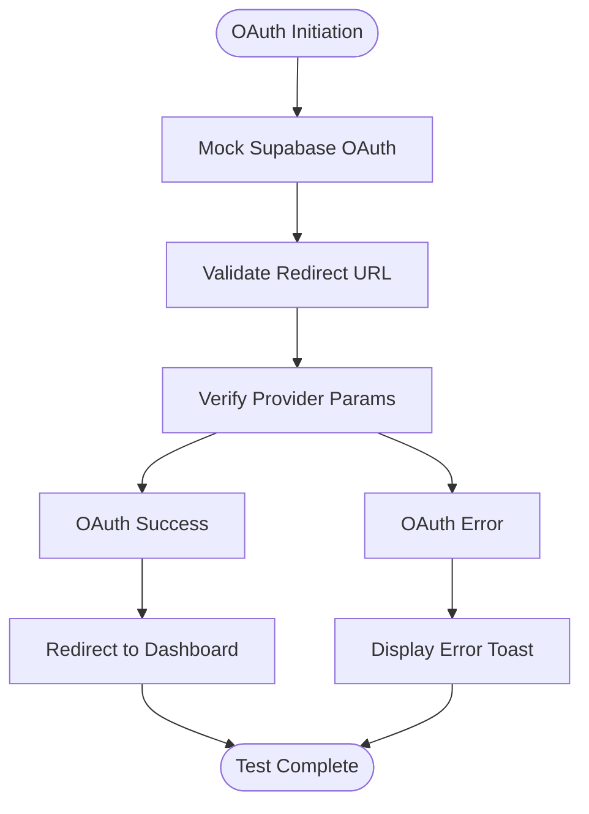

**Diagram sources**
- [Auth.test.tsx](file://src/pages/__tests__/Auth.test.tsx#L225-L263)
- [Auth.tsx](file://src/pages/Auth.tsx#L57-L83)

**Section sources**
- [Auth.test.tsx](file://src/pages/__tests__/Auth.test.tsx#L1-L460)
- [Auth.tsx](file://src/pages/Auth.tsx#L1-L688)

## Context Provider Testing

The AuthContext provides centralized authentication state management that integrates seamlessly with the testing infrastructure. The context testing demonstrates proper provider setup and consumer integration.

### Context State Management

The AuthContext manages complex authentication state with multiple derived properties:

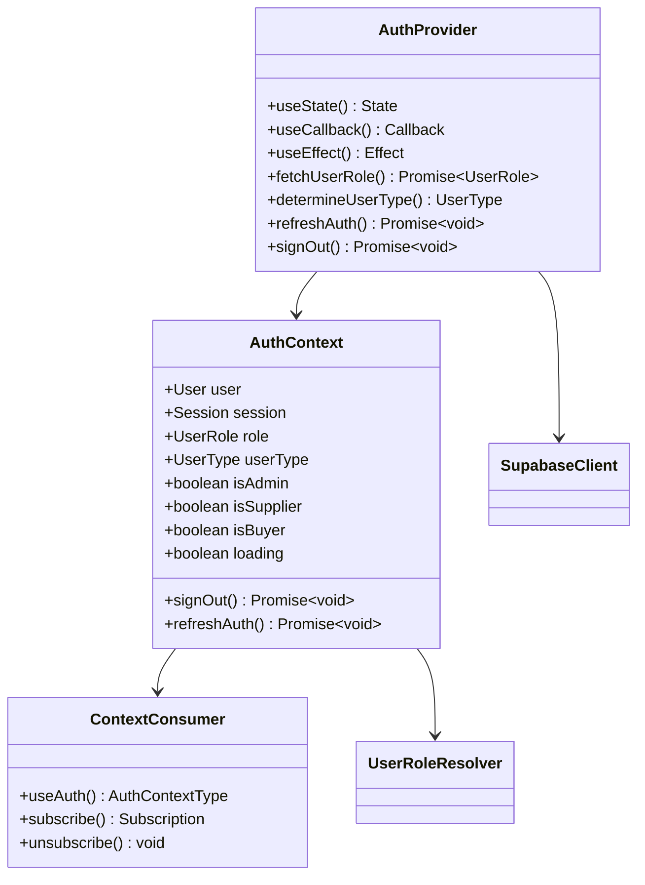

**Diagram sources**
- [AuthContext.tsx](file://src/contexts/AuthContext.tsx#L17-L166)

### Context Integration Patterns

The testing framework validates context integration through multiple patterns:

| Pattern | Purpose | Implementation |
|---------|---------|----------------|
| Provider Wrapping | Test component with context | Custom render wrapper |
| Consumer Hooks | Validate context consumption | `useAuth()` hook testing |
| State Propagation | Verify context updates | Async assertion patterns |
| Error Boundaries | Test context failures | Mock error scenarios |

**Section sources**
- [AuthContext.tsx](file://src/contexts/AuthContext.tsx#L1-L166)

## Protected Routes Testing

Protected routes ensure that authenticated users can access secured areas while unauthorized users are redirected appropriately. The ProtectedRoute component integrates with the AuthContext to provide seamless route protection.

### Route Protection Mechanism

The ProtectedRoute component implements sophisticated authentication checking:

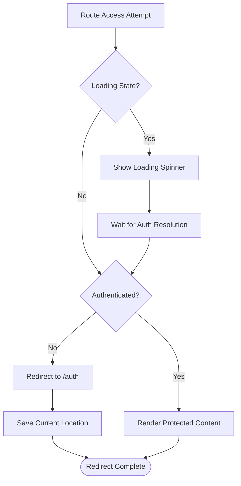

**Diagram sources**
- [ProtectedRoute.tsx](file://src/components/routes/ProtectedRoute.tsx#L14-L35)

### Authentication State Testing

The testing framework validates various authentication scenarios:

| Scenario | Auth State | Expected Behavior |
|----------|------------|-------------------|
| Logged In | `user !== null` | Render protected content |
| Logged Out | `user === null` | Redirect to auth page |
| Loading | `loading === true` | Show loading spinner |
| Expired Session | Invalid token | Redirect with error |
| Role-Based Access | Insufficient permissions | Redirect or show 403 |

**Section sources**
- [ProtectedRoute.tsx](file://src/components/routes/ProtectedRoute.tsx#L1-L36)

## Mock Implementation Patterns

The testing infrastructure employs sophisticated mocking patterns to isolate components while maintaining realistic behavior. The mock Supabase implementation provides comprehensive API coverage for authentication and database operations.

### Mock Architecture

The mock system provides granular control over external dependencies:

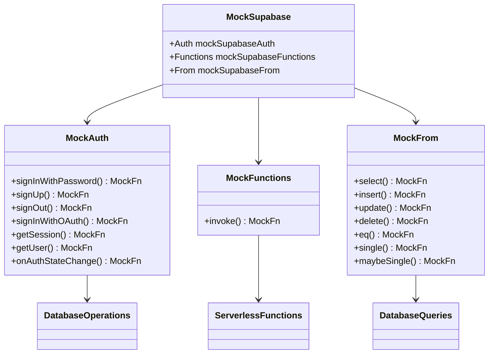

**Diagram sources**
- [supabase.ts](file://src/test/mocks/supabase.ts#L1-L38)

### Mock Configuration Patterns

The testing framework demonstrates various mock configuration approaches:

| Pattern | Use Case | Example |
|---------|----------|---------|
| Static Mocks | Fixed responses | Successful login |
| Dynamic Mocks | Conditional responses | Role-based access |
| Error Mocks | Exception handling | Network failures |
| Timing Mocks | Async behavior | Delayed responses |

**Section sources**
- [supabase.ts](file://src/test/mocks/supabase.ts#L1-L38)

## Asynchronous Testing Strategies

Integration tests often involve complex asynchronous operations that require careful timing and state management. The testing framework employs several strategies to handle async scenarios effectively.

### Async Assertion Patterns

The testing suite demonstrates comprehensive async testing patterns:

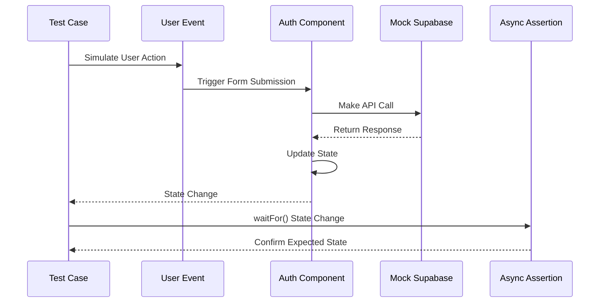

**Diagram sources**
- [Auth.test.tsx](file://src/pages/__tests__/Auth.test.tsx#L56-L68)

### Waiting Strategies

The framework employs multiple waiting strategies for reliable async testing:

| Strategy | Purpose | Implementation |
|----------|---------|----------------|
| `waitFor()` | Wait for state changes | Polling with timeout |
| `waitForElementToBeRemoved` | Element lifecycle | Mutation observation |
| `waitForNextUpdate` | React state updates | Component re-render |
| `setTimeout` | Fixed delays | Controlled timing |

### Error Handling in Async Tests

The testing framework validates error handling in async scenarios:

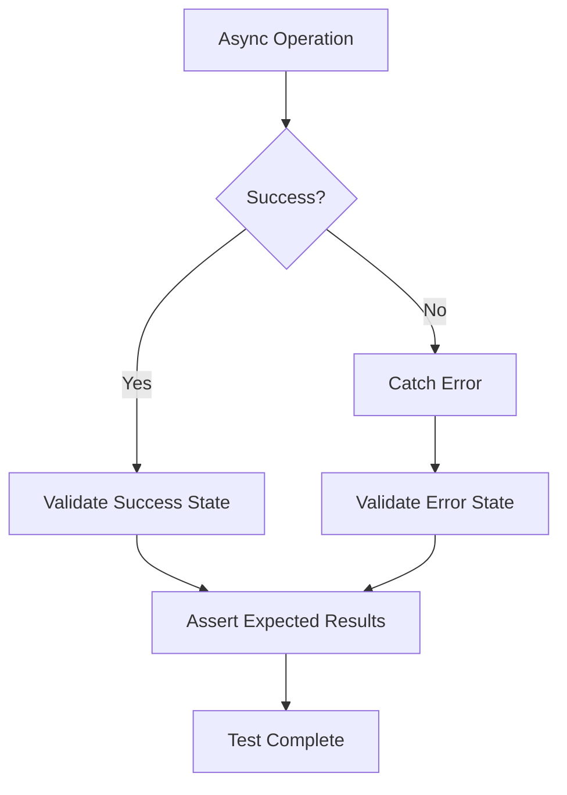

**Section sources**
- [Auth.test.tsx](file://src/pages/__tests__/Auth.test.tsx#L71-L121)
- [useAdminAuth.test.ts](file://src/hooks/__tests__/useAdminAuth.test.ts#L27-L180)

## UI State Management Testing

Integration tests validate complex UI state transitions that occur during user interactions. The testing framework captures state changes across multiple components and maintains consistency throughout the user journey.

### State Transition Patterns

The Auth component demonstrates complex state management with multiple UI states:

| State | Trigger | Expected Outcome |
|-------|---------|------------------|
| Loading | Form submission | Disable buttons, show spinner |
| Success | API success | Navigate, show success toast |
| Error | API failure | Show error messages, keep form |
| Validation | Field change | Real-time validation feedback |

### Multi-Component State Coordination

Integration tests verify state coordination across component boundaries:

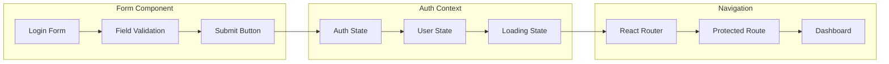

**Diagram sources**
- [Auth.tsx](file://src/pages/Auth.tsx#L403-L458)
- [AuthContext.tsx](file://src/contexts/AuthContext.tsx#L40-L166)

### Form State Persistence

The testing framework validates form state persistence across navigation and state changes:

| Scenario | Behavior | Validation |
|----------|----------|------------|
| Tab Switching | Clear form errors | Empty input fields |
| Navigation Away | Preserve data | Restore on return |
| Error Recovery | Fix validation | Enable submission |
| Multi-step Forms | Persist intermediate data | Validate on completion |

**Section sources**
- [Auth.test.tsx](file://src/pages/__tests__/Auth.test.tsx#L380-L437)

## Best Practices and Guidelines

The integration testing approach in Sleek Apparels follows established best practices for comprehensive, maintainable test suites that provide confidence in application behavior.

### Test Organization Principles

Effective test organization ensures maintainability and clarity:

| Principle | Implementation | Benefit |
|-----------|----------------|---------|
| Descriptive Names | `describe('Login Flow', () => {...})` | Clear test purpose |
| Focused Scenarios | Single responsibility per test | Isolated failures |
| Shared Setup | `beforeEach()` hooks | Consistent state |
| Clear Assertions | Specific expectations | Meaningful failures |

### Mock Strategy Guidelines

The testing framework demonstrates effective mocking strategies:

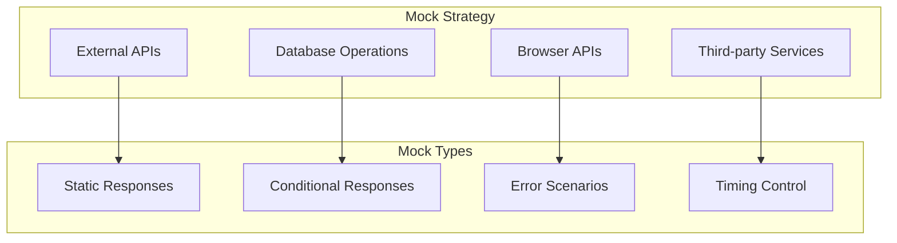

### Performance and Reliability

Integration tests prioritize reliability over speed:

| Practice | Rationale | Implementation |
|----------|-----------|----------------|
| Disable Retries | Predictable test results | QueryClient configuration |
| Clear Mocks | Isolated test runs | `resetMocks()` in `beforeEach` |
| Specific Assertions | Meaningful failures | Targeted DOM queries |
| Comprehensive Setup | Reliable baseline | Custom render wrapper |

### Maintenance Considerations

The testing infrastructure supports long-term maintenance:

- **Modular Mocks**: Individual mock modules for easy updates
- **Centralized Setup**: Shared configuration across test suites  
- **Type Safety**: TypeScript integration for reliable refactoring
- **Documentation**: Clear test structure and naming conventions

### Testing Coverage Guidelines

The integration testing approach covers critical user journeys:

- **Authentication Flows**: Login, signup, OAuth, password reset
- **Protected Routes**: Role-based access control
- **Form Interactions**: Validation, submission, error handling
- **State Transitions**: Loading states, success/error states
- **Navigation**: Route protection, redirect handling

**Section sources**
- [Auth.test.tsx](file://src/pages/__tests__/Auth.test.tsx#L33-L460)
- [setup.ts](file://src/test/setup.ts#L1-L43)