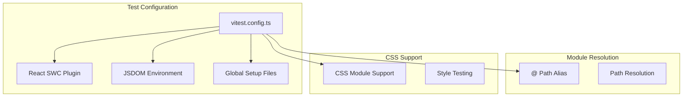
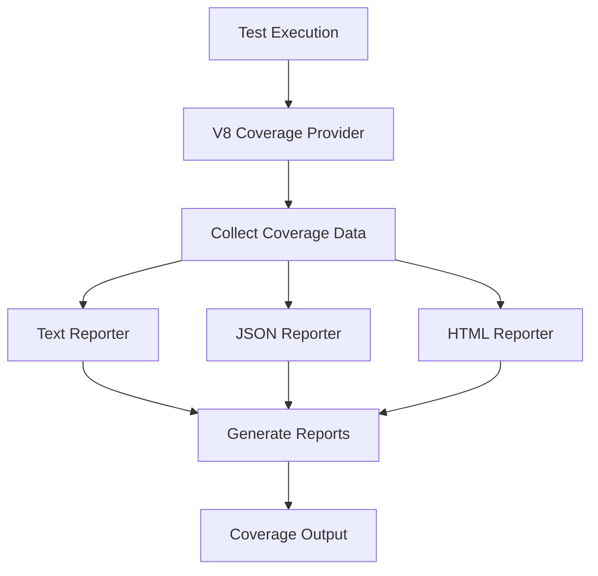
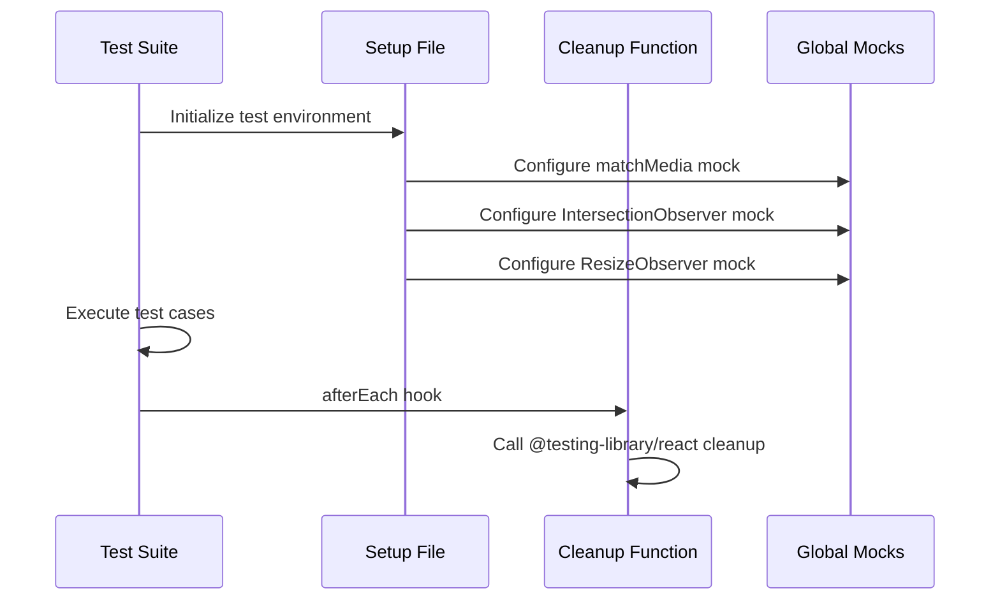
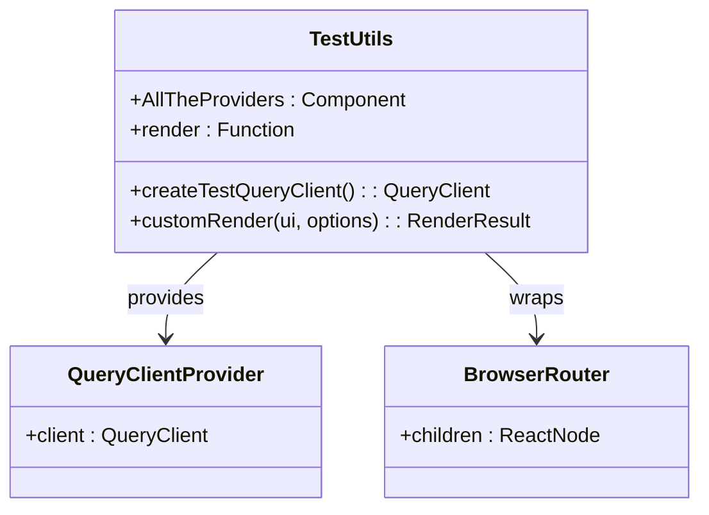
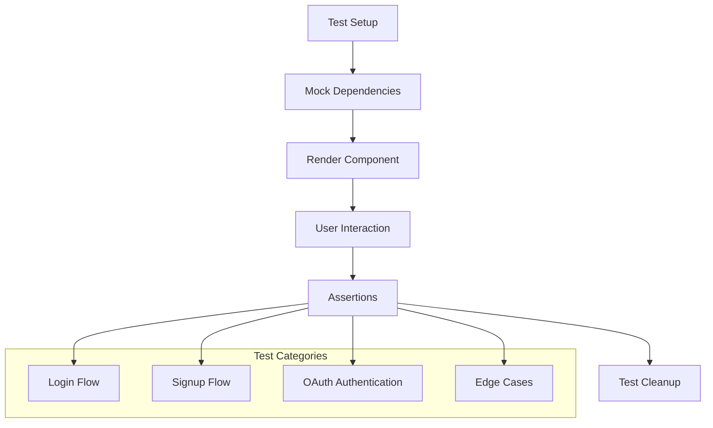
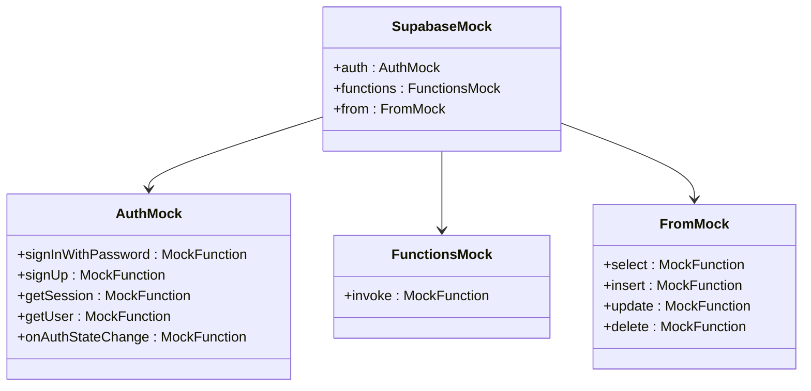
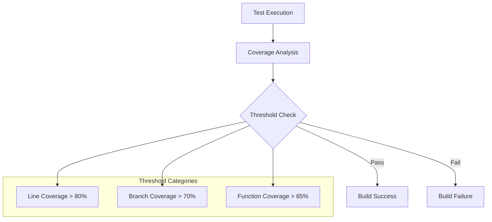
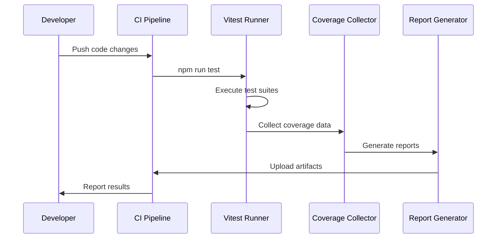

# Test Configuration and Coverage Reporting

<cite>
**Referenced Files in This Document**
- [vitest.config.ts](file://vitest.config.ts)
- [package.json](file://package.json)
- [src/test/setup.ts](file://src/test/setup.ts)
- [src/test/utils/test-utils.tsx](file://src/test/utils/test-utils.tsx)
- [src/test/mocks/supabase.ts](file://src/test/mocks/supabase.ts)
- [src/hooks/__tests__/useAdminAuth.test.ts](file://src/hooks/__tests__/useAdminAuth.test.ts)
- [src/pages/__tests__/Auth.test.tsx](file://src/pages/__tests__/Auth.test.tsx)
- [src/test/blogTest.ts](file://src/test/blogTest.ts)
- [src/test/github-search-engine.test.ts](file://src/test/github-search-engine.test.ts)
- [tsconfig.test.json](file://tsconfig.test.json)
</cite>

## Table of Contents
1. [Introduction](#introduction)
2. [Test Environment Configuration](#test-environment-configuration)
3. [Coverage Configuration](#coverage-configuration)
4. [Global Setup and Utilities](#global-setup-and-utilities)
5. [Testing Patterns and Best Practices](#testing-patterns-and-best-practices)
6. [Mocking Strategies](#mocking-strategies)
7. [Coverage Reporting and Analysis](#coverage-reporting-and-analysis)
8. [CI/CD Integration](#cicd-integration)
9. [Troubleshooting and Maintenance](#troubleshooting-and-maintenance)
10. [Best Practices and Recommendations](#best-practices-and-recommendations)

## Introduction

The Sleek Apparels application employs a comprehensive testing strategy built on Vitest, a modern JavaScript testing framework that provides fast execution and excellent developer experience. The test configuration emphasizes code coverage monitoring, realistic DOM simulation, and robust mocking capabilities to ensure high-quality test coverage across the entire codebase.

This documentation provides detailed insights into the test configuration architecture, coverage reporting mechanisms, and best practices for maintaining comprehensive test coverage in the application.

## Test Environment Configuration

### Vitest Configuration Architecture

The primary test configuration is defined in [`vitest.config.ts`](file://vitest.config.ts), which establishes the foundation for all testing activities in the application.



**Diagram sources**
- [vitest.config.ts](file://vitest.config.ts#L1-L28)

### Key Configuration Settings

The configuration establishes several critical testing environments:

**Global Variables**: The `globals: true` setting enables automatic import of testing utilities like `describe`, `it`, `expect`, and `vi` without explicit imports, streamlining test writing.

**JSDOM Environment**: The `environment: 'jsdom'` configuration provides a realistic DOM simulation environment, essential for testing React components that interact with the browser DOM.

**CSS Support**: The `css: true` option ensures that CSS modules and styles are properly handled during testing, preventing style-related test failures.

**Module Aliases**: The path resolution configuration (`@: path.resolve('./src')`) enables clean imports using the `@` alias, improving test readability and maintainability.

**Section sources**
- [vitest.config.ts](file://vitest.config.ts#L5-L28)

### TypeScript Configuration for Testing

The [`tsconfig.test.json`](file://tsconfig.test.json) file extends the main application configuration while adding specific testing-related settings:

```mermaid
classDiagram
class TestTypeConfig {
+extends : "./tsconfig.app.json"
+types : ["vitest/globals", "@testing-library/jest-dom"]
+paths : {"@/*" : ["./src/*"]}
+include : ["src/**/*.test.ts", "src/**/*.test.tsx", "src/test/**/*"]
}
class ApplicationConfig {
+extends : "./tsconfig.app.json"
+compilerOptions : {}
}
TestTypeConfig --|> ApplicationConfig : extends
```

**Diagram sources**
- [tsconfig.test.json](file://tsconfig.test.json#L1-L15)

**Section sources**
- [tsconfig.test.json](file://tsconfig.test.json#L1-L15)

## Coverage Configuration

### V8 Provider Implementation

The application uses the V8 JavaScript engine's built-in coverage provider for optimal performance and accuracy:



**Diagram sources**
- [vitest.config.ts](file://vitest.config.ts#L12-L20)

### Coverage Reporters

The configuration defines three distinct coverage reporters:

**Text Reporter**: Provides real-time coverage feedback in the terminal during test execution, displaying coverage percentages and highlighting uncovered lines.

**JSON Reporter**: Generates machine-readable coverage data for integration with external tools and CI/CD systems.

**HTML Reporter**: Creates interactive HTML coverage reports with line-by-line visibility, enabling detailed analysis of coverage gaps.

### Excluded Paths and Rationale

The coverage exclusion configuration targets specific directories and file patterns:

| Excluded Path | Rationale |
|---------------|-----------|
| `node_modules/` | Third-party dependencies should not be included in coverage calculations |
| `src/test/` | Test utilities and mock files are not part of the application code |
| `**/*.config.ts` | Configuration files are not business logic and don't require coverage |
| `**/*.d.ts` | TypeScript declaration files represent type definitions only |

These exclusions ensure that coverage metrics accurately reflect the quality of the application's business logic rather than infrastructure or configuration code.

**Section sources**
- [vitest.config.ts](file://vitest.config.ts#L15-L20)

## Global Setup and Utilities

### Test Environment Setup

The global setup file [`src/test/setup.ts`](file://src/test/setup.ts) establishes a consistent testing environment across all test suites:



**Diagram sources**
- [src/test/setup.ts](file://src/test/setup.ts#L1-L43)

### Essential Mocks

The setup file includes critical browser API mocks:

**Window.matchMedia**: Essential for responsive design testing and media query functionality validation.

**IntersectionObserver**: Necessary for components that use lazy loading or scroll-triggered animations.

**ResizeObserver**: Required for components that respond to container size changes.

### Test Utilities Architecture

The [`src/test/utils/test-utils.tsx`](file://src/test/utils/test-utils.tsx) provides a comprehensive testing utility layer:



**Diagram sources**
- [src/test/utils/test-utils.tsx](file://src/test/utils/test-utils.tsx#L1-L39)

**Section sources**
- [src/test/setup.ts](file://src/test/setup.ts#L1-L43)
- [src/test/utils/test-utils.tsx](file://src/test/utils/test-utils.tsx#L1-L39)

## Testing Patterns and Best Practices

### Component Testing Pattern

The application follows a consistent testing pattern demonstrated in [`src/pages/__tests__/Auth.test.tsx`](file://src/pages/__tests__/Auth.test.tsx):



**Diagram sources**
- [src/pages/__tests__/Auth.test.tsx](file://src/pages/__tests__/Auth.test.tsx#L1-L460)

### Hook Testing Pattern

[`src/hooks/__tests__/useAdminAuth.test.ts`](file://src/hooks/__tests__/useAdminAuth.test.ts) demonstrates sophisticated hook testing with comprehensive edge case coverage:

**Async State Management**: Proper handling of loading states, success scenarios, and error conditions.

**Side Effect Testing**: Verification of API calls, navigation triggers, and state updates.

**Error Boundary Testing**: Graceful handling of various error scenarios including network failures and authentication errors.

### Utility Testing Pattern

[`src/test/github-search-engine.test.ts`](file://src/test/github-search-engine.test.ts) showcases effective utility function testing:

**API Mocking**: Comprehensive mocking of external APIs with proper response handling.

**Error Scenario Testing**: Validation of error handling and graceful degradation.

**Parameter Validation**: Testing of input validation and edge cases.

**Section sources**
- [src/pages/__tests__/Auth.test.tsx](file://src/pages/__tests__/Auth.test.tsx#L1-L460)
- [src/hooks/__tests__/useAdminAuth.test.ts](file://src/hooks/__tests__/useAdminAuth.test.ts#L1-L381)
- [src/test/github-search-engine.test.ts](file://src/test/github-search-engine.test.ts#L1-L85)

## Mocking Strategies

### Supabase Integration Mocking

The [`src/test/mocks/supabase.ts`](file://src/test/mocks/supabase.ts) provides a comprehensive mocking strategy for Supabase services:



**Diagram sources**
- [src/test/mocks/supabase.ts](file://src/test/mocks/supabase.ts#L1-L38)

### Mock Management Strategy

The mocking system includes:

**Granular Control**: Individual mocking of authentication, functions, and database operations.

**Reset Mechanism**: [`resetMocks()`](file://src/test/mocks/supabase.ts#L35-L38) function for clean test isolation.

**Chainable Methods**: Mock implementations that support method chaining for complex operations.

**Section sources**
- [src/test/mocks/supabase.ts](file://src/test/mocks/supabase.ts#L1-L38)

## Coverage Reporting and Analysis

### Coverage Metrics Interpretation

The coverage configuration generates multiple report formats for comprehensive analysis:

**Line Coverage**: Percentage of executable lines executed during test runs.

**Branch Coverage**: Percentage of conditional branches tested.

**Function Coverage**: Percentage of functions called during testing.

**Statement Coverage**: Percentage of individual statements executed.

### Coverage Threshold Enforcement

While the current configuration doesn't explicitly set coverage thresholds, the following patterns should be implemented for production readiness:



### Identifying Uncovered Code Paths

Common strategies for identifying and addressing uncovered code:

**Gap Analysis**: Review HTML coverage reports to identify specific lines and functions without coverage.

**Integration Testing**: Focus on testing complex business logic flows that may be missed by unit tests.

**Edge Case Testing**: Ensure comprehensive coverage of error conditions and boundary cases.

**Section sources**
- [vitest.config.ts](file://vitest.config.ts#L12-L20)

## CI/CD Integration

### Test Execution in CI/CD Pipelines

The application's test configuration supports seamless CI/CD integration:



### Recommended CI/CD Configuration

For optimal CI/CD integration, consider the following pipeline stages:

**Test Execution**: Run `npm test` to execute all test suites with coverage collection.

**Coverage Validation**: Implement coverage threshold checks to prevent regression.

**Artifact Generation**: Store coverage reports and test results for historical analysis.

**Parallel Execution**: Leverage Vitest's parallel execution capabilities for faster CI builds.

## Troubleshooting and Maintenance

### Common Issues and Solutions

**Memory Leaks in Tests**: Ensure proper cleanup in `afterEach` hooks and use the provided cleanup utilities.

**Mock Configuration Issues**: Verify that all external dependencies are properly mocked for isolated testing.

**CSS Import Errors**: Confirm that CSS support is enabled in the Vitest configuration.

**TypeScript Compilation Errors**: Ensure that test-specific TypeScript configurations are properly set up.

### Maintenance Best Practices

**Regular Coverage Reviews**: Periodically review coverage reports to identify emerging gaps.

**Test Refactoring**: Continuously improve test quality by refactoring poorly written tests.

**Dependency Updates**: Keep testing dependencies updated to benefit from bug fixes and performance improvements.

**Documentation Updates**: Maintain comprehensive test documentation to onboard new team members effectively.

## Best Practices and Recommendations

### Writing Effective Tests

**Descriptive Test Names**: Use clear, descriptive names that explain the test's purpose and expected outcome.

**Focused Test Scenarios**: Each test should verify a single behavior or requirement.

**Proper Test Isolation**: Ensure tests don't depend on each other's state or side effects.

**Meaningful Assertions**: Use specific assertions that validate the expected outcomes clearly.

### Coverage Optimization Strategies

**Strategic Test Planning**: Develop a test strategy that prioritizes critical business logic.

**Integration Testing**: Complement unit tests with integration tests for complex workflows.

**End-to-End Testing**: Implement E2E tests for complete user journey validation.

**Continuous Monitoring**: Establish processes for continuous monitoring of coverage trends.

### Performance Considerations

**Test Parallelization**: Leverage Vitest's parallel execution capabilities for faster test suites.

**Selective Testing**: Implement test selection strategies for focused testing during development.

**Resource Management**: Optimize memory usage in test environments to prevent resource exhaustion.

**Section sources**
- [package.json](file://package.json#L12-L12)
- [vitest.config.ts](file://vitest.config.ts#L1-L28)