# Test Utilities and Mocks

<cite>
**Referenced Files in This Document**
- [src/test/mocks/supabase.ts](file://src/test/mocks/supabase.ts)
- [src/test/utils/test-utils.tsx](file://src/test/utils/test-utils.tsx)
- [src/test/setup.ts](file://src/test/setup.ts)
- [src/pages/__tests__/Auth.test.tsx](file://src/pages/__tests__/Auth.test.tsx)
- [src/hooks/__tests__/useAdminAuth.test.ts](file://src/hooks/__tests__/useAdminAuth.test.ts)
- [src/integrations/supabase/client.ts](file://src/integrations/supabase/client.ts)
- [src/contexts/AuthContext.tsx](file://src/contexts/AuthContext.tsx)
- [src/contexts/WishlistContext.tsx](file://src/contexts/WishlistContext.tsx)
- [src/hooks/useWishlist.ts](file://src/hooks/useWishlist.ts)
- [vitest.config.ts](file://vitest.config.ts)
- [package.json](file://package.json)
</cite>

## Table of Contents
1. [Introduction](#introduction)
2. [Test Infrastructure Overview](#test-infrastructure-overview)
3. [Supabase Mocking System](#supabase-mocking-system)
4. [Test Utils and Provider Wrappers](#test-utils-and-provider-wrappers)
5. [Global Test Environment Setup](#global-test-environment-setup)
6. [Usage Patterns and Best Practices](#usage-patterns-and-best-practices)
7. [Testing Authentication Flows](#testing-authentication-flows)
8. [Testing API Responses and Asynchronous Operations](#testing-api-responses-and-asynchronous-operations)
9. [Isolating Test Cases](#isolating-test-cases)
10. [Performance and Reliability Considerations](#performance-and-reliability-considerations)
11. [Troubleshooting and Debugging](#troubleshooting-and-debugging)
12. [Conclusion](#conclusion)

## Introduction

The Sleek Apparels application employs a sophisticated test utilities and mocking infrastructure built around Vitest, React Testing Library, and Supabase integration. This comprehensive testing framework provides consistent mocking for Supabase authentication, database, and storage APIs while offering reusable test wrappers that include essential providers like AuthContext, WishlistContext, and QueryClient.

The testing infrastructure reduces boilerplate code, ensures reliable test execution, and provides isolation from external dependencies through carefully crafted mock implementations. This system enables developers to write focused, maintainable tests that verify business logic without relying on live database connections or external services.

## Test Infrastructure Overview

The testing framework is structured around three core components that work together to provide a robust testing environment:

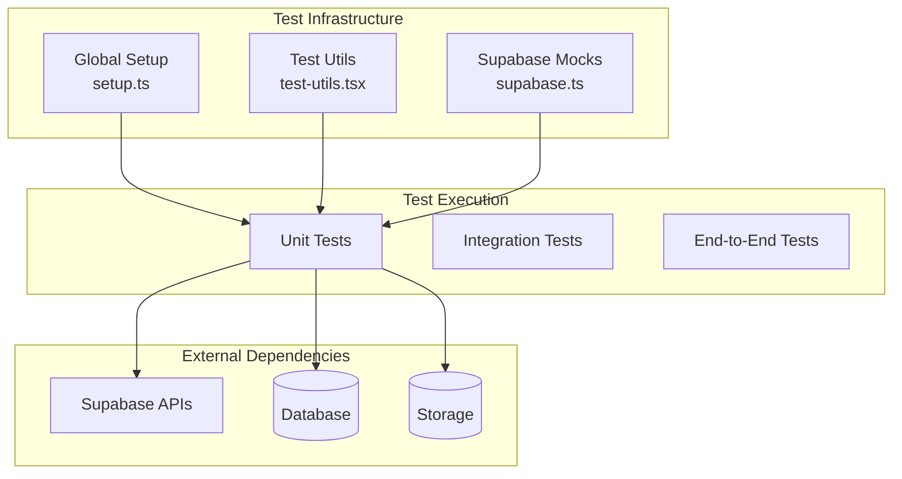
```mermaid
graph TB
subgraph "Test Infrastructure"
Setup[Global Setup<br/>setup.ts]
Utils[Test Utils<br/>test-utils.tsx]
Mocks[Supabase Mocks<br/>supabase.ts]
end
subgraph "Test Execution"
Tests[Unit Tests]
Integration[Integration Tests]
E2E[End-to-End Tests]
end
subgraph "External Dependencies"
Supabase[Supabase APIs]
Database[(Database)]
Storage[(Storage)]
end
Setup --> Tests
Utils --> Tests
Mocks --> Tests
Tests --> Supabase
Tests --> Database
Tests --> Storage
```

**Diagram sources**
- [src/test/setup.ts](file://src/test/setup.ts#L1-L43)
- [src/test/utils/test-utils.tsx](file://src/test/utils/test-utils.tsx#L1-L39)
- [src/test/mocks/supabase.ts](file://src/test/mocks/supabase.ts#L1-L38)

The infrastructure provides:
- **Global Environment Setup**: Browser API mocking and cleanup routines
- **Reusable Test Wrappers**: Provider composition for React context dependencies
- **Consistent Mocking**: Standardized Supabase API mocks across all tests
- **Isolation Mechanisms**: Clean test state management and dependency isolation

**Section sources**
- [src/test/setup.ts](file://src/test/setup.ts#L1-L43)
- [src/test/utils/test-utils.tsx](file://src/test/utils/test-utils.tsx#L1-L39)
- [src/test/mocks/supabase.ts](file://src/test/mocks/supabase.ts#L1-L38)

## Supabase Mocking System

The Supabase mocking system provides comprehensive coverage of all Supabase APIs used throughout the application, ensuring consistent behavior across all test scenarios.

### Mock Architecture

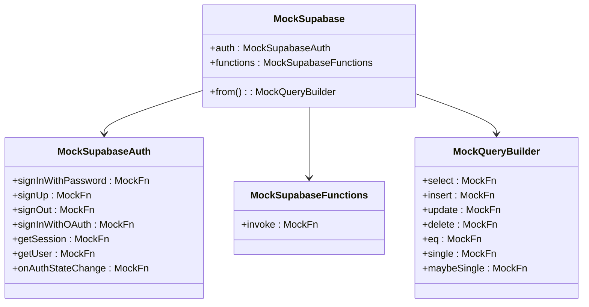
```mermaid
classDiagram
class MockSupabase {
+auth : MockSupabaseAuth
+functions : MockSupabaseFunctions
+from() : MockQueryBuilder
}
class MockSupabaseAuth {
+signInWithPassword : MockFn
+signUp : MockFn
+signOut : MockFn
+signInWithOAuth : MockFn
+getSession : MockFn
+getUser : MockFn
+onAuthStateChange : MockFn
}
class MockSupabaseFunctions {
+invoke : MockFn
}
class MockQueryBuilder {
+select : MockFn
+insert : MockFn
+update : MockFn
+delete : MockFn
+eq : MockFn
+single : MockFn
+maybeSingle : MockFn
}
MockSupabase --> MockSupabaseAuth
MockSupabase --> MockSupabaseFunctions
MockSupabase --> MockQueryBuilder
```

**Diagram sources**
- [src/test/mocks/supabase.ts](file://src/test/mocks/supabase.ts#L3-L33)

### Authentication Mocks

The authentication mocking system covers all Supabase auth operations with realistic mock implementations:

| Method | Purpose | Mock Behavior |
|--------|---------|---------------|
| `signInWithPassword` | Email/password authentication | Resolves with user/session or rejects with error |
| `signUp` | User registration | Validates input and returns user data or error |
| `signOut` | Logout operation | Clears session and user state |
| `signInWithOAuth` | OAuth provider authentication | Simulates OAuth flow completion |
| `getSession` | Current session retrieval | Returns cached session or null |
| `getUser` | Current user retrieval | Returns user object or null |
| `onAuthStateChange` | Auth event subscription | Returns subscription object with unsubscribe |

### Database Operation Mocks

The database mocking system provides chainable query builders that support the fluent API pattern:

| Method | Purpose | Mock Behavior |
|--------|---------|---------------|
| `select()` | Data selection | Returns mock data or null |
| `insert()` | Data insertion | Accepts data and returns inserted record |
| `update()` | Data modification | Updates matching records |
| `delete()` | Record removal | Removes matching records |
| `eq()` | Equality filtering | Filters by column equality |
| `single()` | Single record retrieval | Returns single record or null |
| `maybeSingle()` | Optional single record | Returns record or null |

### Reset Mechanism

The mocking system includes a comprehensive reset mechanism to ensure test isolation:

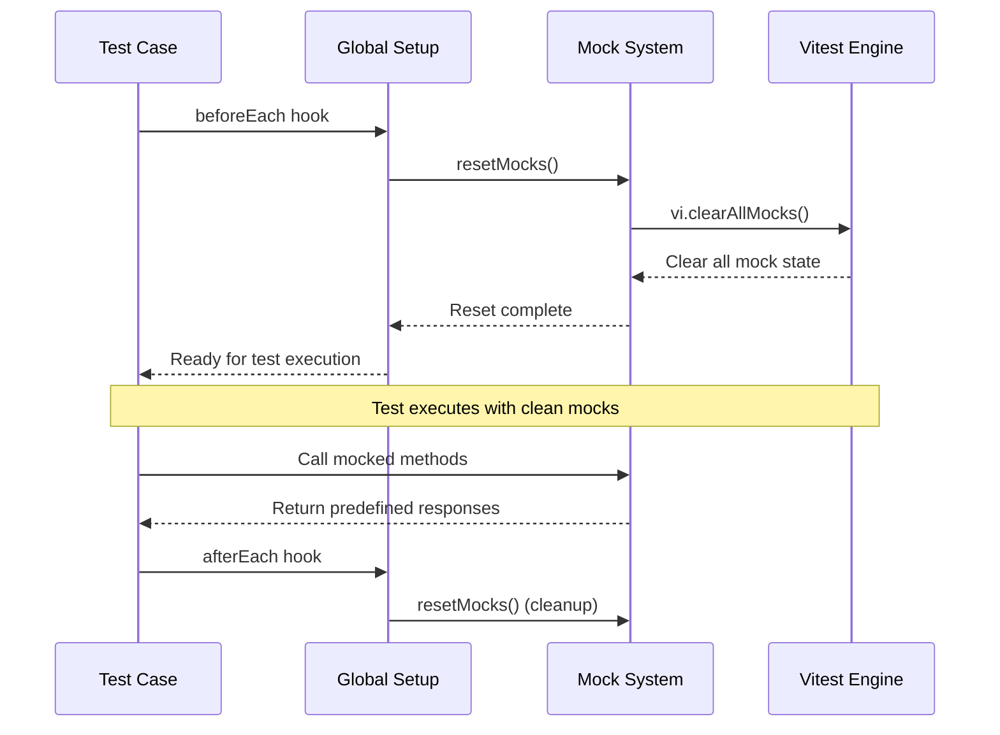
```mermaid
sequenceDiagram
participant Test as Test Case
participant Setup as Global Setup
participant Mocks as Mock System
participant Vitest as Vitest Engine
Test->>Setup : beforeEach hook
Setup->>Mocks : resetMocks()
Mocks->>Vitest : vi.clearAllMocks()
Vitest-->>Mocks : Clear all mock state
Mocks-->>Setup : Reset complete
Setup-->>Test : Ready for test execution
Note over Test,Vitest : Test executes with clean mocks
Test->>Mocks : Call mocked methods
Mocks-->>Test : Return predefined responses
Test->>Setup : afterEach hook
Setup->>Mocks : resetMocks() (cleanup)
```

**Diagram sources**
- [src/test/mocks/supabase.ts](file://src/test/mocks/supabase.ts#L35-L37)
- [src/test/setup.ts](file://src/test/setup.ts#L5-L8)

**Section sources**
- [src/test/mocks/supabase.ts](file://src/test/mocks/supabase.ts#L1-L38)

## Test Utils and Provider Wrappers

The test utilities system provides reusable React component wrappers that include all necessary context providers for comprehensive testing of components that depend on application state.

### Provider Composition Architecture

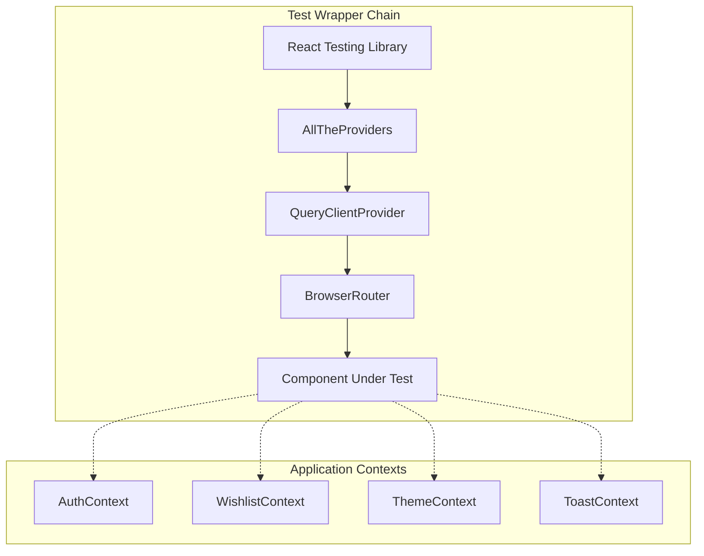
```mermaid
graph TD
subgraph "Test Wrapper Chain"
RTL[React Testing Library]
Providers[AllTheProviders]
QueryClient[QueryClientProvider]
Router[BrowserRouter]
Children[Component Under Test]
end
subgraph "Application Contexts"
Auth[AuthContext]
Wishlist[WishlistContext]
Theme[ThemeContext]
Toast[ToastContext]
end
RTL --> Providers
Providers --> QueryClient
QueryClient --> Router
Router --> Children
Children -.-> Auth
Children -.-> Wishlist
Children -.-> Theme
Children -.-> Toast
```

**Diagram sources**
- [src/test/utils/test-utils.tsx](file://src/test/utils/test-utils.tsx#L19-L26)

### Query Client Configuration

The test query client is configured with specific options to optimize test performance and reliability:

| Configuration | Value | Purpose |
|---------------|-------|---------|
| `retry` | `false` | Prevents automatic retry of failed requests |
| `defaultOptions.queries` | `{ retry: false }` | Disables retry for all queries |
| `defaultOptions.mutations` | `{ retry: false }` | Disables retry for mutations |

### Custom Render Function

The custom render function provides a standardized way to render components with all necessary providers:

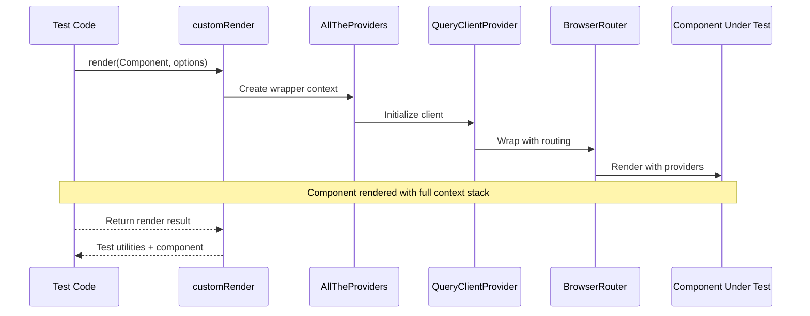
```mermaid
sequenceDiagram
participant Test as Test Code
participant Render as customRender
participant Providers as AllTheProviders
participant QueryClient as QueryClientProvider
participant Router as BrowserRouter
participant Component as Component Under Test
Test->>Render : render(Component, options)
Render->>Providers : Create wrapper context
Providers->>QueryClient : Initialize client
QueryClient->>Router : Wrap with routing
Router->>Component : Render with providers
Note over Test,Component : Component rendered with full context stack
Test-->>Render : Return render result
Render-->>Test : Test utilities + component
```

**Diagram sources**
- [src/test/utils/test-utils.tsx](file://src/test/utils/test-utils.tsx#L29-L35)

**Section sources**
- [src/test/utils/test-utils.tsx](file://src/test/utils/test-utils.tsx#L1-L39)

## Global Test Environment Setup

The global test environment setup ensures consistent behavior across all test suites by mocking browser APIs and providing cleanup mechanisms.

### Browser API Mocking

The setup includes comprehensive mocking of browser APIs commonly used in web applications:

| API | Purpose | Mock Implementation |
|-----|---------|-------------------|
| `window.matchMedia` | Media query support | Returns static match results |
| `IntersectionObserver` | Element visibility detection | No-op implementation |
| `ResizeObserver` | Element size monitoring | No-op implementation |

### Cleanup Mechanisms

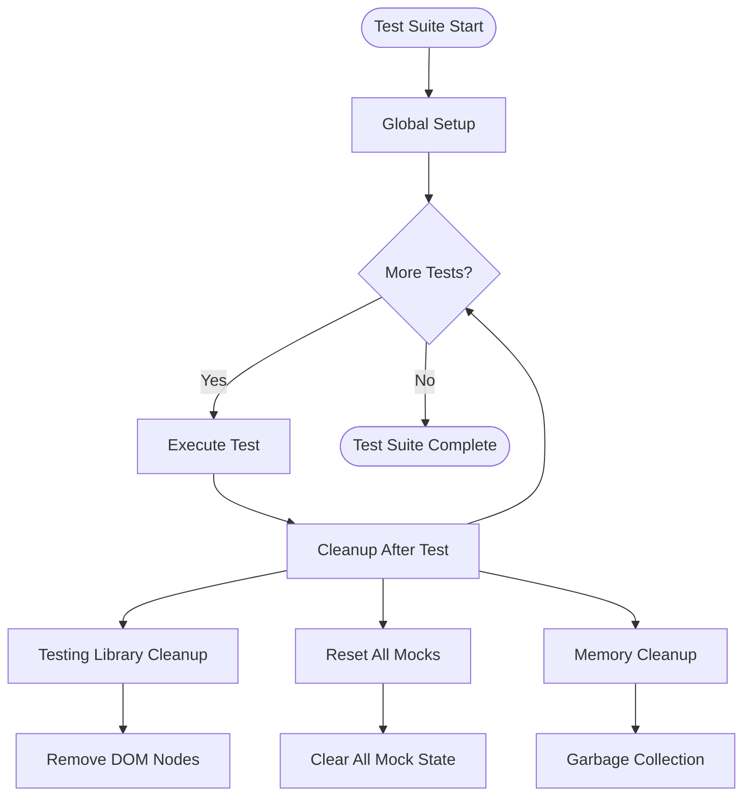
```mermaid
flowchart TD
Start([Test Suite Start]) --> Setup[Global Setup]
Setup --> TestLoop{More Tests?}
TestLoop --> |Yes| TestExecution[Execute Test]
TestExecution --> Cleanup[Cleanup After Test]
Cleanup --> TestLoop
TestLoop --> |No| Complete([Test Suite Complete])
Cleanup --> RTL[Testing Library Cleanup]
Cleanup --> MockReset[Reset All Mocks]
Cleanup --> Memory[Memory Cleanup]
RTL --> DOMCleanup[Remove DOM Nodes]
MockReset --> ClearMocks[Clear All Mock State]
Memory --> GC[Garbage Collection]
```

**Diagram sources**
- [src/test/setup.ts](file://src/test/setup.ts#L5-L8)

### Jest DOM Matchers

The setup includes Jest DOM matchers for enhanced assertion capabilities:

- **Accessibility Assertions**: `toBeInTheDocument()`, `toHaveAttribute()`, `toHaveClass()`
- **Content Assertions**: `toHaveTextContent()`, `toContainElement()`
- **State Assertions**: `toBeDisabled()`, `toBeChecked()`

**Section sources**
- [src/test/setup.ts](file://src/test/setup.ts#L1-L43)

## Usage Patterns and Best Practices

### Basic Test Structure Pattern

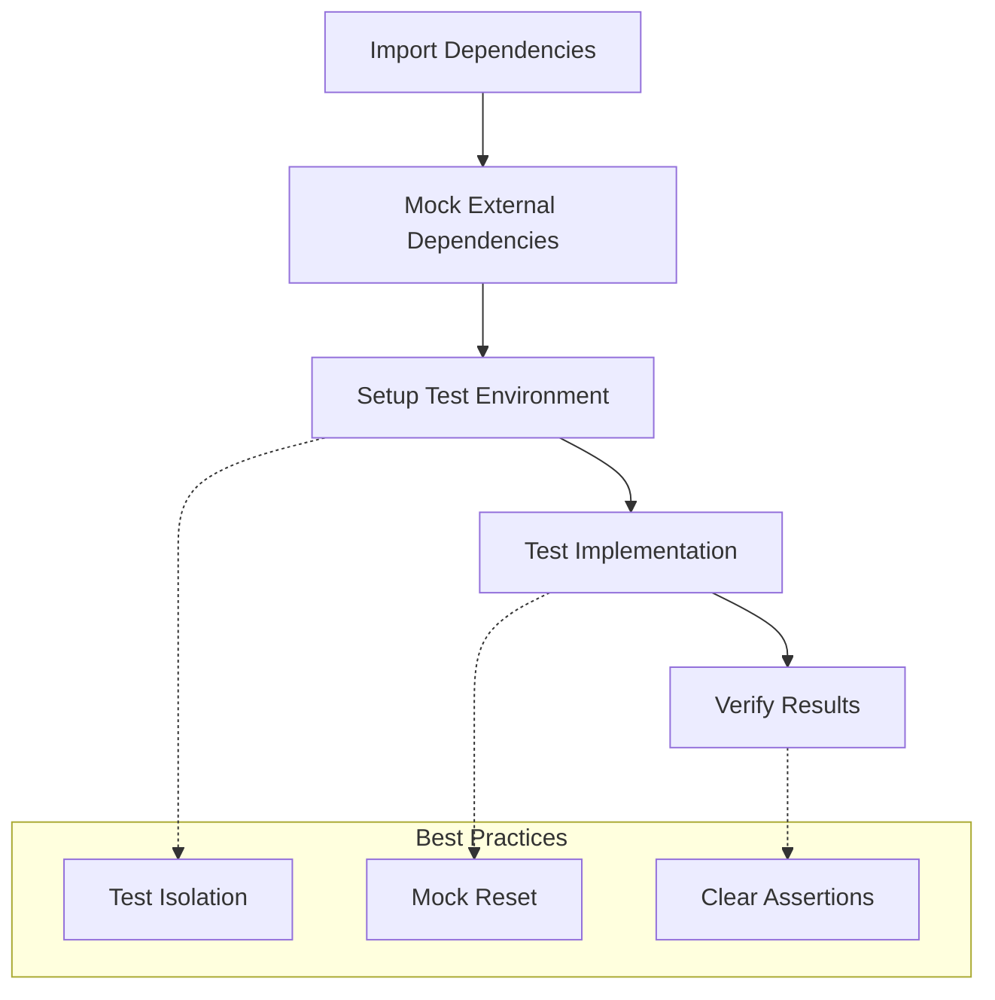
```mermaid
flowchart TD
Import[Import Dependencies]
Mock[Mock External Dependencies]
Setup[Setup Test Environment]
Test[Test Implementation]
Verify[Verify Results]
Import --> Mock
Mock --> Setup
Setup --> Test
Test --> Verify
subgraph "Best Practices"
Isolation[Test Isolation]
Reset[Mock Reset]
Assertions[Clear Assertions]
end
Setup -.-> Isolation
Test -.-> Reset
Verify -.-> Assertions
```

### Mock Implementation Patterns

The testing framework follows consistent patterns for mocking different types of dependencies:

#### Authentication Mock Pattern
- **Setup**: Configure authentication state before rendering
- **Execution**: Call component actions that trigger auth operations
- **Verification**: Assert mock calls with expected parameters
- **Cleanup**: Reset mocks between tests

#### API Response Mock Pattern
- **Response Definition**: Define expected API responses
- **Async Handling**: Use `waitFor` for asynchronous operations
- **Error Simulation**: Mock error responses for edge case testing
- **Validation**: Verify API calls with proper parameters

#### Context Provider Pattern
- **Wrapper Usage**: Use custom render with test providers
- **State Management**: Mock context values when needed
- **Interaction Testing**: Test component interactions with providers
- **Isolation**: Ensure context state doesn't leak between tests

**Section sources**
- [src/pages/__tests__/Auth.test.tsx](file://src/pages/__tests__/Auth.test.tsx#L1-L460)
- [src/hooks/__tests__/useAdminAuth.test.ts](file://src/hooks/__tests__/useAdminAuth.test.ts#L1-L381)

## Testing Authentication Flows

The authentication testing system demonstrates how the mocking infrastructure handles complex user interaction flows with realistic API responses.

### Login Flow Testing

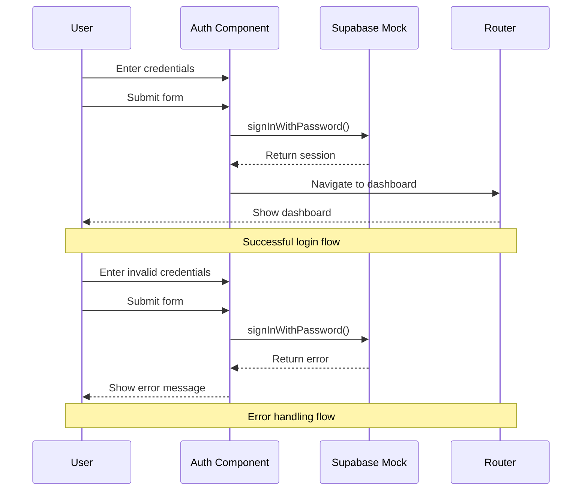
```mermaid
sequenceDiagram
participant User as User
participant Component as Auth Component
participant Mock as Supabase Mock
participant Navigation as Router
User->>Component : Enter credentials
User->>Component : Submit form
Component->>Mock : signInWithPassword()
Mock-->>Component : Return session
Component->>Navigation : Navigate to dashboard
Navigation-->>User : Show dashboard
Note over User,Navigation : Successful login flow
User->>Component : Enter invalid credentials
User->>Component : Submit form
Component->>Mock : signInWithPassword()
Mock-->>Component : Return error
Component-->>User : Show error message
Note over User,Navigation : Error handling flow
```

**Diagram sources**
- [src/pages/__tests__/Auth.test.tsx](file://src/pages/__tests__/Auth.test.tsx#L49-L68)

### Signup Flow Testing

The signup flow testing covers form validation, API integration, and error handling:

| Test Scenario | Mock Configuration | Expected Outcome |
|---------------|-------------------|------------------|
| Valid Registration | Success response | User navigated to dashboard |
| Invalid Email Format | Error response | Validation error displayed |
| Weak Password | Error response | Password strength indicator |
| Duplicate Email | Error response | Duplicate email error |
| Network Failure | Rejected promise | Network error handling |

### OAuth Authentication Testing

OAuth flow testing verifies third-party authentication integration:

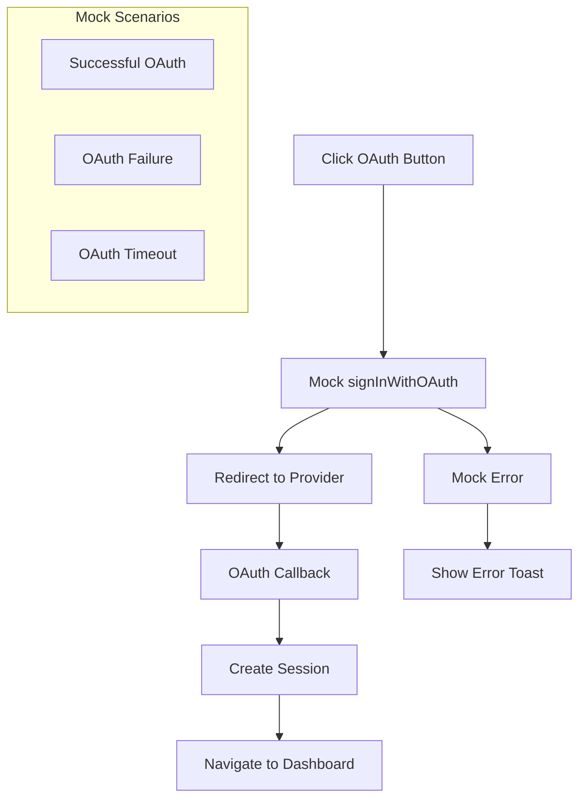
```mermaid
flowchart TD
Click[Click OAuth Button] --> MockCall[Mock signInWithOAuth]
MockCall --> Redirect[Redirect to Provider]
Redirect --> Callback[OAuth Callback]
Callback --> Session[Create Session]
Session --> Navigate[Navigate to Dashboard]
MockCall --> Error[Mock Error]
Error --> Toast[Show Error Toast]
subgraph "Mock Scenarios"
Success[Successful OAuth]
Failure[OAuth Failure]
Timeout[OAuth Timeout]
end
```

**Diagram sources**
- [src/pages/__tests__/Auth.test.tsx](file://src/pages/__tests__/Auth.test.tsx#L225-L262)

**Section sources**
- [src/pages/__tests__/Auth.test.tsx](file://src/pages/__tests__/Auth.test.tsx#L1-L460)

## Testing API Responses and Asynchronous Operations

The testing framework provides robust support for handling asynchronous operations and API responses through consistent mocking patterns.

### Async Operation Handling

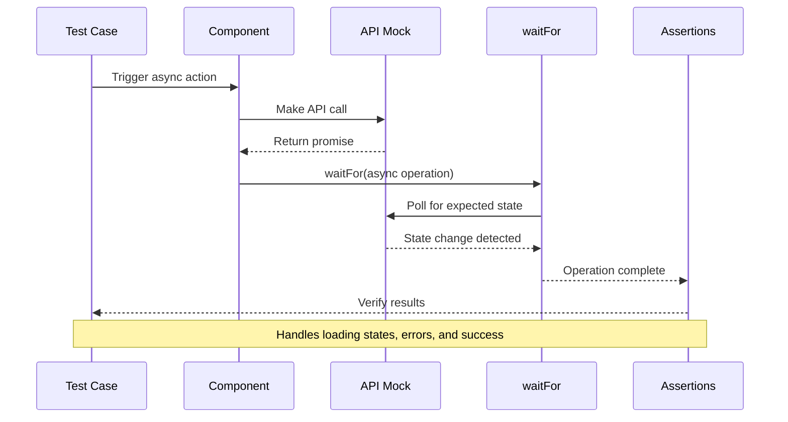
```mermaid
sequenceDiagram
participant Test as Test Case
participant Component as Component
participant Mock as API Mock
participant Wait as waitFor
participant Assert as Assertions
Test->>Component : Trigger async action
Component->>Mock : Make API call
Mock-->>Component : Return promise
Component->>Wait : waitFor(async operation)
Wait->>Mock : Poll for expected state
Mock-->>Wait : State change detected
Wait-->>Assert : Operation complete
Assert-->>Test : Verify results
Note over Test,Assert : Handles loading states, errors, and success
```

### API Response Mocking Patterns

The framework supports various API response scenarios:

#### Success Responses
- **Immediate Success**: Mock resolves immediately with data
- **Delayed Success**: Mock resolves after timeout
- **Streaming Data**: Mock returns partial data progressively

#### Error Responses
- **HTTP Errors**: Mock rejects with error object
- **Network Errors**: Mock throws network exception
- **Validation Errors**: Mock returns validation failures

#### Edge Cases
- **Empty Responses**: Mock returns empty data sets
- **Rate Limiting**: Mock simulates rate limit exceeded
- **Timeout**: Mock simulates request timeout

### Testing Hooks with Async Dependencies

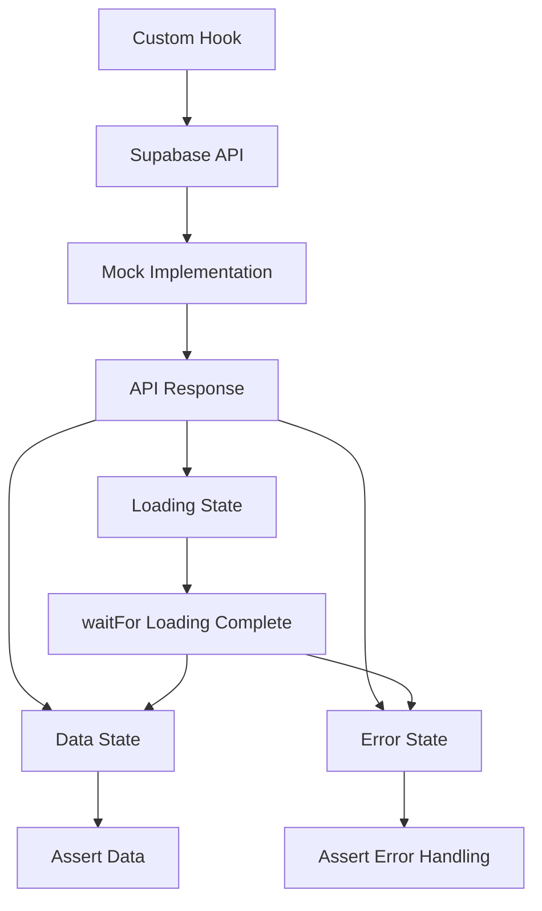
```mermaid
flowchart TD
Hook[Custom Hook] --> Supabase[Supabase API]
Supabase --> Mock[Mock Implementation]
Mock --> Response[API Response]
Response --> Loading[Loading State]
Response --> Data[Data State]
Response --> Error[Error State]
Loading --> WaitFor[waitFor Loading Complete]
Data --> AssertData[Assert Data]
Error --> AssertError[Assert Error Handling]
WaitFor --> Data
WaitFor --> Error
```

**Diagram sources**
- [src/hooks/__tests__/useAdminAuth.test.ts](file://src/hooks/__tests__/useAdminAuth.test.ts#L27-L50)

**Section sources**
- [src/hooks/__tests__/useAdminAuth.test.ts](file://src/hooks/__tests__/useAdminAuth.test.ts#L1-L381)

## Isolating Test Cases

Test isolation is achieved through multiple mechanisms that prevent test interference and ensure reproducible results.

### Mock Isolation Strategy

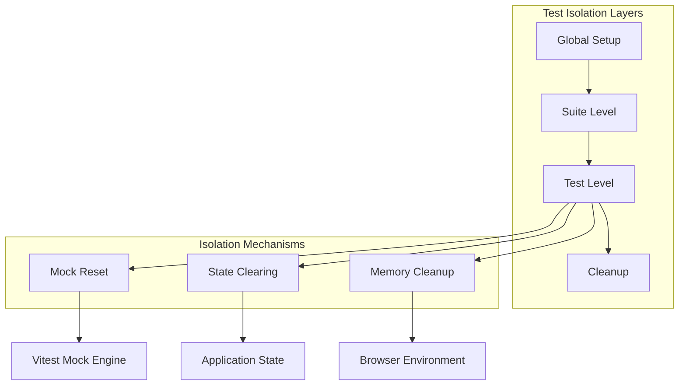
```mermaid
graph TB
subgraph "Test Isolation Layers"
Global[Global Setup]
Suite[Suite Level]
Test[Test Level]
Cleanup[Cleanup]
end
subgraph "Isolation Mechanisms"
MockReset[Mock Reset]
StateClear[State Clearing]
MemoryClean[Memory Cleanup]
end
Global --> Suite
Suite --> Test
Test --> Cleanup
Test --> MockReset
Test --> StateClear
Test --> MemoryClean
MockReset --> Vitest[Vitest Mock Engine]
StateClear --> Application[Application State]
MemoryClean --> Browser[Browser Environment]
```

### Test State Management

Each test receives a clean slate through systematic state management:

| Scope | Responsibility | Cleanup Method |
|-------|---------------|----------------|
| Global | Environment setup | `afterEach` cleanup |
| Suite | Shared mocks | Suite-level reset |
| Test | Individual mocks | `beforeEach` setup |
| Component | Render state | Testing Library cleanup |

### Dependency Isolation

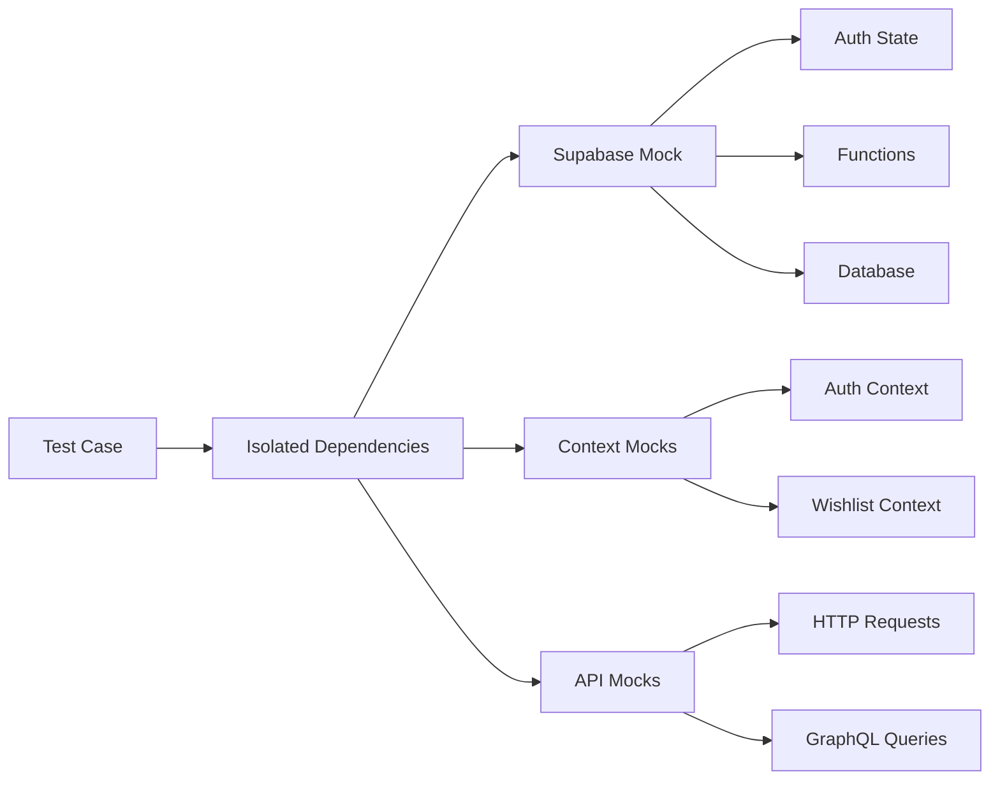
```mermaid
flowchart LR
Test[Test Case] --> Isolated[Isolated Dependencies]
Isolated --> SupabaseMock[Supabase Mock]
Isolated --> ContextMock[Context Mocks]
Isolated --> APIMock[API Mocks]
SupabaseMock --> Auth[Auth State]
SupabaseMock --> Functions[Functions]
SupabaseMock --> Database[Database]
ContextMock --> AuthContext[Auth Context]
ContextMock --> WishlistContext[Wishlist Context]
APIMock --> HTTP[HTTP Requests]
APIMock --> GraphQL[GraphQL Queries]
```

**Section sources**
- [src/test/setup.ts](file://src/test/setup.ts#L5-L8)
- [src/test/mocks/supabase.ts](file://src/test/mocks/supabase.ts#L35-L37)

## Performance and Reliability Considerations

The testing infrastructure is designed with performance and reliability as primary concerns, implementing several optimization strategies.

### Test Performance Optimization

| Optimization | Implementation | Benefit |
|--------------|---------------|---------|
| Query Client Caching | Disabled in tests | Prevents unnecessary cache hits |
| Auto Refresh | Disabled in auth mocks | Eliminates background polling |
| Retry Logic | Disabled globally | Prevents exponential delays |
| Parallel Execution | Vitest configuration | Faster test suite execution |

### Memory Management

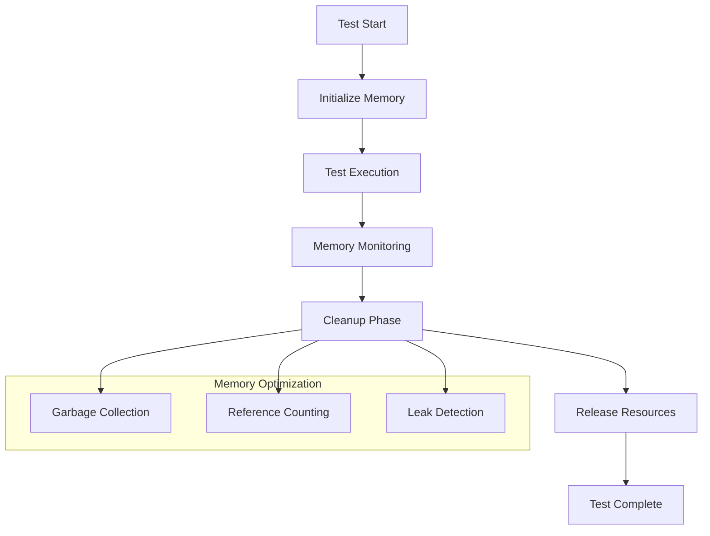
```mermaid
flowchart TD
TestStart[Test Start] --> MemoryInit[Initialize Memory]
MemoryInit --> TestExec[Test Execution]
TestExec --> MemoryCheck[Memory Monitoring]
MemoryCheck --> Cleanup[Cleanup Phase]
Cleanup --> MemoryRelease[Release Resources]
MemoryRelease --> TestComplete[Test Complete]
subgraph "Memory Optimization"
GC[Garbage Collection]
RefCount[Reference Counting]
LeakDetection[Leak Detection]
end
Cleanup --> GC
Cleanup --> RefCount
Cleanup --> LeakDetection
```

### Reliability Patterns

The framework implements several reliability patterns to ensure consistent test execution:

- **Deterministic Mocks**: Consistent return values across test runs
- **Error Boundary Testing**: Comprehensive error scenario coverage
- **Timeout Management**: Configurable timeouts for async operations
- **Retry Strategies**: Controlled retry logic for flaky operations

**Section sources**
- [src/test/utils/test-utils.tsx](file://src/test/utils/test-utils.tsx#L6-L13)
- [vitest.config.ts](file://vitest.config.ts#L7-L21)

## Troubleshooting and Debugging

Common issues and their solutions when working with the test utilities and mocking infrastructure.

### Common Issues and Solutions

| Issue | Symptoms | Solution |
|-------|----------|----------|
| Mock Not Called | Test passes but mock assertions fail | Check mock import and setup |
| Stale Mock State | Tests interfere with each other | Ensure proper mock reset |
| Async Timing Issues | Tests pass locally but fail in CI | Add explicit `waitFor` statements |
| Context Provider Errors | Components render incorrectly | Verify provider wrapper usage |

### Debugging Strategies

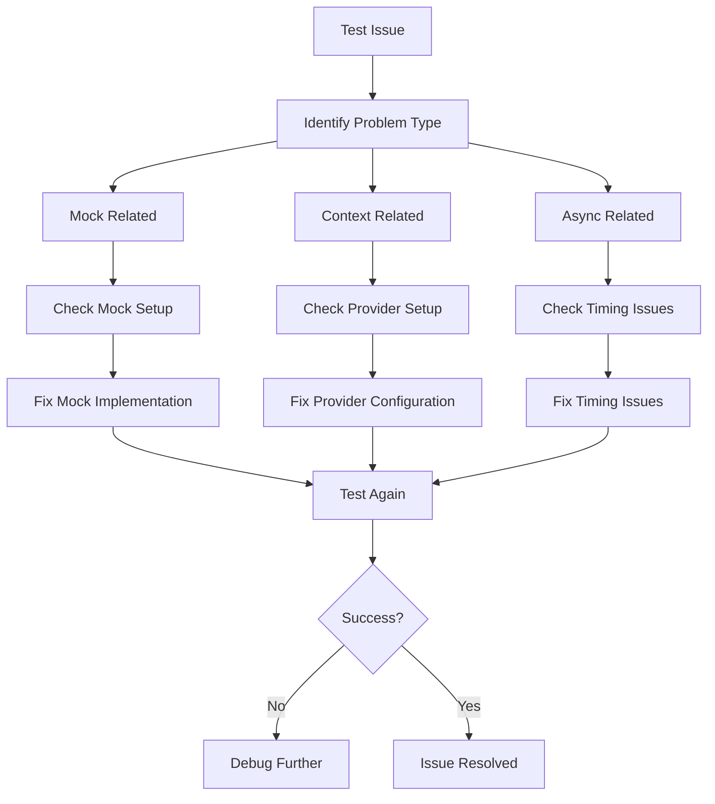
```mermaid
flowchart TD
Issue[Test Issue] --> Identify[Identify Problem Type]
Identify --> MockIssue[Mock Related]
Identify --> ContextIssue[Context Related]
Identify --> AsyncIssue[Async Related]
MockIssue --> CheckMocks[Check Mock Setup]
ContextIssue --> CheckProviders[Check Provider Setup]
AsyncIssue --> CheckTiming[Check Timing Issues]
CheckMocks --> FixMocks[Fix Mock Implementation]
CheckProviders --> FixProviders[Fix Provider Configuration]
CheckTiming --> FixTiming[Fix Timing Issues]
FixMocks --> TestAgain[Test Again]
FixProviders --> TestAgain
FixTiming --> TestAgain
TestAgain --> Success{Success?}
Success --> |No| DebugFurther[Debug Further]
Success --> |Yes| Complete[Issue Resolved]
```

### Logging and Monitoring

The framework includes comprehensive logging capabilities for debugging test failures:

- **Console Logging**: Detailed logs for test execution
- **Mock Call Tracking**: All mock invocations are logged
- **Error Stack Traces**: Complete error information for failures
- **Performance Metrics**: Test execution timing information

**Section sources**
- [src/test/setup.ts](file://src/test/setup.ts#L1-L43)

## Conclusion

The Sleek Apparels test utilities and mocking infrastructure provides a comprehensive foundation for reliable, maintainable, and efficient testing of the application. Through the combination of consistent Supabase mocking, reusable test wrappers, and global environment setup, developers can write focused tests that verify business logic without external dependencies.

Key benefits of this testing infrastructure include:

- **Reduced Boilerplate**: Standardized test setup across all test files
- **Consistent Behavior**: Reliable mock implementations across test suites  
- **Test Isolation**: Clean separation between test cases and dependencies
- **Performance Optimization**: Efficient test execution with minimal overhead
- **Comprehensive Coverage**: Support for all application features and edge cases

The framework's modular design allows for easy extension and customization while maintaining consistency across the entire codebase. By following the established patterns and best practices, teams can build confidence in their codebase through comprehensive test coverage that scales with application growth.

Future enhancements could include expanded mocking for additional external services, enhanced error simulation capabilities, and improved debugging tools for complex test scenarios. The current infrastructure provides a solid foundation for these improvements while maintaining backward compatibility and developer productivity.