# Testing Strategy

<cite>
**Referenced Files in This Document**
- [vitest.config.ts](file://vitest.config.ts)
- [src/test/setup.ts](file://src/test/setup.ts)
- [src/test/utils/test-utils.tsx](file://src/test/utils/test-utils.tsx)
- [src/test/mocks/supabase.ts](file://src/test/mocks/supabase.ts)
- [src/hooks/__tests__/useAdminAuth.test.ts](file://src/hooks/__tests__/useAdminAuth.test.ts)
- [src/pages/__tests__/Auth.test.tsx](file://src/pages/__tests__/Auth.test.tsx)
- [src/test/github-search-engine.test.ts](file://src/test/github-search-engine.test.ts)
- [src/test/blogTest.ts](file://src/test/blogTest.ts)
- [src/hooks/useAdminAuth.ts](file://src/hooks/useAdminAuth.ts)
- [package.json](file://package.json)
- [tsconfig.test.json](file://tsconfig.test.json)
</cite>

## Table of Contents
1. [Introduction](#introduction)
2. [Testing Framework Setup](#testing-framework-setup)
3. [Testing Pyramid Implementation](#testing-pyramid-implementation)
4. [Test Organization Structure](#test-organization-structure)
5. [Mock Strategy for External Dependencies](#mock-strategy-for-external-dependencies)
6. [Test Utilities and Helpers](#test-utilities-and-helpers)
7. [Component Testing Patterns](#component-testing-patterns)
8. [Hook Testing Strategies](#hook-testing-strategies)
9. [Integration Testing Approach](#integration-testing-approach)
10. [End-to-End Testing Guidelines](#end-to-end-testing-guidelines)
11. [Test Coverage and Reporting](#test-coverage-and-reporting)
12. [Best Practices and Guidelines](#best-practices-and-guidelines)
13. [Troubleshooting Common Issues](#troubleshooting-common-issues)

## Introduction

The Sleek Apparels application employs a comprehensive testing strategy built around the Vitest testing framework, implementing a robust testing pyramid that ensures reliable, maintainable, and efficient test suites. This approach covers unit tests for hooks and utilities, integration tests for components, and strategic end-to-end tests for critical user flows.

The testing infrastructure is designed to handle the complexities of a modern React application with Supabase integration, React Query, and various third-party libraries while maintaining high code quality and reliability standards.

## Testing Framework Setup

### Vitest Configuration

The application uses Vitest as its primary testing framework, configured through [`vitest.config.ts`](file://vitest.config.ts) to provide optimal testing environment settings:

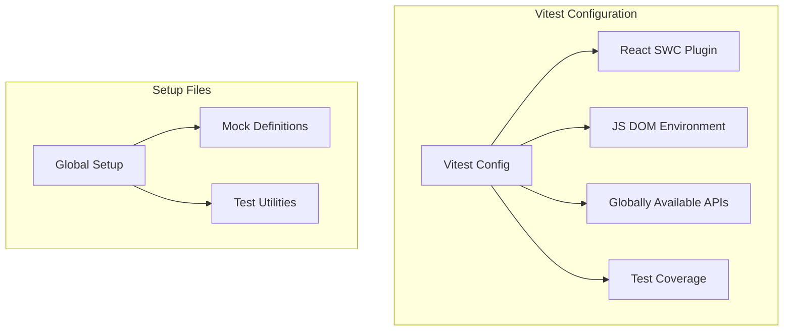

**Diagram sources**
- [vitest.config.ts](file://vitest.config.ts#L5-L28)
- [src/test/setup.ts](file://src/test/setup.ts#L1-L43)

The configuration provides several key features:
- **Global APIs**: Enables `describe`, `it`, `expect`, and other testing utilities globally
- **JS DOM Environment**: Provides browser-like environment for component testing
- **CSS Support**: Handles CSS modules and styling in tests
- **Coverage Reporting**: Generates comprehensive coverage reports in multiple formats
- **Path Aliases**: Supports the `@/` path alias for cleaner imports

**Section sources**
- [vitest.config.ts](file://vitest.config.ts#L1-L29)
- [src/test/setup.ts](file://src/test/setup.ts#L1-L43)

### TypeScript Configuration for Tests

The test-specific TypeScript configuration in [`tsconfig.test.json`](file://tsconfig.test.json) extends the main application configuration with test-specific type definitions and path mappings, ensuring proper type checking for test files.

**Section sources**
- [tsconfig.test.json](file://tsconfig.test.json#L1-L15)

## Testing Pyramid Implementation

### Unit Tests for Hooks and Utilities

The foundation of the testing pyramid consists of comprehensive unit tests for custom hooks and utility functions. These tests focus on individual functionality in isolation, ensuring that core business logic works correctly.

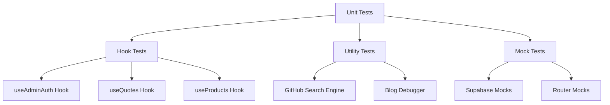

**Diagram sources**
- [src/hooks/__tests__/useAdminAuth.test.ts](file://src/hooks/__tests__/useAdminAuth.test.ts#L1-L381)
- [src/test/mocks/supabase.ts](file://src/test/mocks/supabase.ts#L1-L38)

The [`useAdminAuth`](file://src/hooks/useAdminAuth.ts) hook demonstrates exemplary unit testing patterns, covering:
- Authentication state validation
- Admin status checking via Supabase functions
- Error handling and edge cases
- Session management
- Concurrent request handling

**Section sources**
- [src/hooks/__tests__/useAdminAuth.test.ts](file://src/hooks/__tests__/useAdminAuth.test.ts#L1-L381)
- [src/hooks/useAdminAuth.ts](file://src/hooks/useAdminAuth.ts#L1-L47)

### Integration Tests for Components

Integration tests verify that components work correctly when combined with other components and external systems. These tests focus on user interactions and component collaboration.

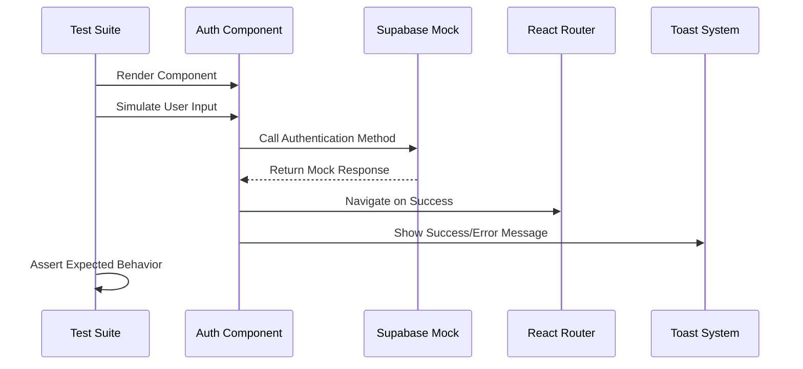

**Diagram sources**
- [src/pages/__tests__/Auth.test.tsx](file://src/pages/__tests__/Auth.test.tsx#L1-L460)

**Section sources**
- [src/pages/__tests__/Auth.test.tsx](file://src/pages/__tests__/Auth.test.tsx#L1-L460)

### End-to-End Testing for Critical User Flows

While the current implementation focuses primarily on unit and integration tests, the framework is designed to support end-to-end testing for critical user flows such as:
- Complete authentication journeys
- Order creation and management workflows
- Admin dashboard interactions
- Supplier registration processes

## Test Organization Structure

### Directory Structure

The testing infrastructure is organized in the [`src/test/`](file://src/test/) directory with clear separation of concerns:

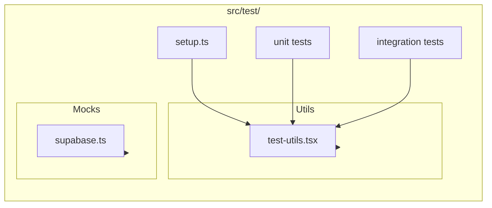

**Diagram sources**
- [src/test/setup.ts](file://src/test/setup.ts#L1-L43)
- [src/test/utils/test-utils.tsx](file://src/test/utils/test-utils.tsx#L1-L39)
- [src/test/mocks/supabase.ts](file://src/test/mocks/supabase.ts#L1-L38)

### Test File Naming Conventions

The application follows consistent naming conventions:
- **Hook tests**: `use*HookName*.test.ts`
- **Component tests**: `*Component*.test.tsx`
- **Utility tests**: `*Utility*.test.ts`

**Section sources**
- [src/test/setup.ts](file://src/test/setup.ts#L1-L43)
- [src/test/utils/test-utils.tsx](file://src/test/utils/test-utils.tsx#L1-L39)

## Mock Strategy for External Dependencies

### Supabase Integration Mocking

The application implements comprehensive mocking for Supabase dependencies, allowing isolated testing of application logic without external service dependencies.

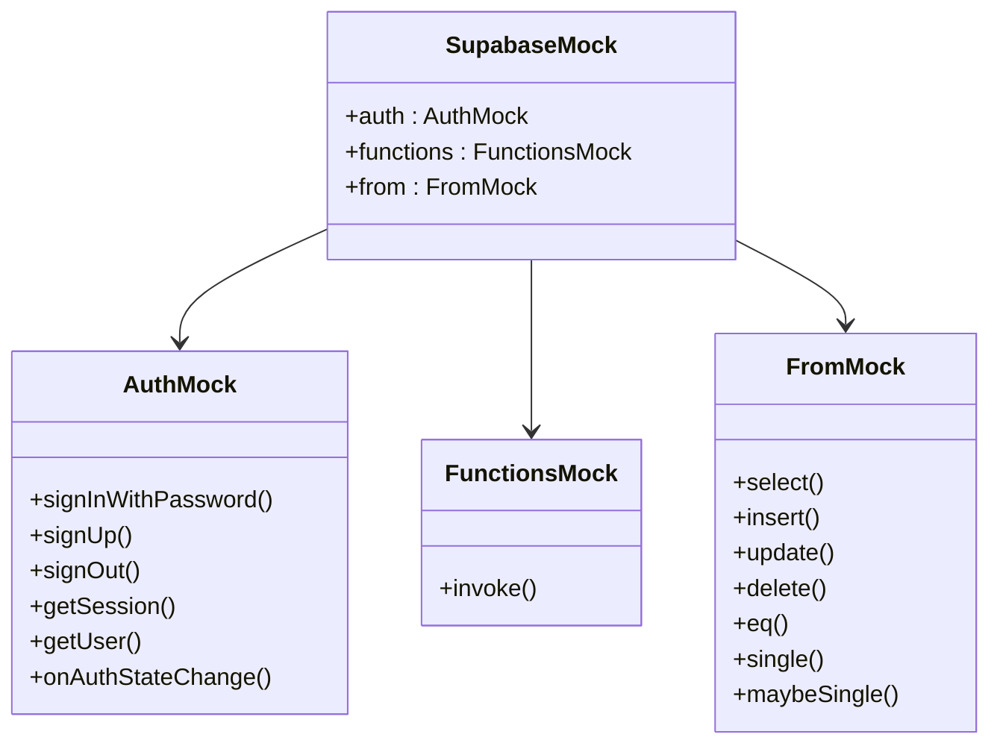

**Diagram sources**
- [src/test/mocks/supabase.ts](file://src/test/mocks/supabase.ts#L3-L37)

The mock implementation provides:
- **Authentication methods**: Sign in, sign up, sign out, session management
- **Function invocation**: Edge function calls with proper authorization headers
- **Database operations**: CRUD operations with chainable method calls
- **Reset capabilities**: Clean state between tests

**Section sources**
- [src/test/mocks/supabase.ts](file://src/test/mocks/supabase.ts#L1-L38)

### Global Mock Setup

The global setup in [`src/test/setup.ts`](file://src/test/setup.ts) establishes essential browser APIs that are typically unavailable in the test environment:

- **window.matchMedia**: Mocks responsive design media queries
- **IntersectionObserver**: Handles lazy loading and scroll-based features
- **ResizeObserver**: Manages dynamic layout calculations
- **Cleanup utilities**: Ensures proper test isolation

**Section sources**
- [src/test/setup.ts](file://src/test/setup.ts#L1-L43)

## Test Utilities and Helpers

### Custom Test Renderer

The [`test-utils.tsx`](file://src/test/utils/test-utils.tsx) provides a custom rendering solution that wraps components with necessary providers:

```mermaid
graph TB
subgraph "Custom Test Renderer"
CustomRender[customRender Function]
Providers[Provider Wrapper]
QueryClient[React Query Client]
BrowserRouter[React Router]
end
CustomRender --> Providers
Providers --> QueryClient
Providers --> BrowserRouter
subgraph "Test Usage"
TestFile[Test File]
RenderCall[render(ui, options)]
end
TestFile --> RenderCall
RenderCall --> CustomRender
```

**Diagram sources**
- [src/test/utils/test-utils.tsx](file://src/test/utils/test-utils.tsx#L19-L38)

This utility automatically:
- Sets up React Query with disabled retries for faster tests
- Provides routing context for navigation-dependent components
- Exports all Testing Library utilities for convenience

**Section sources**
- [src/test/utils/test-utils.tsx](file://src/test/utils/test-utils.tsx#L1-L39)

### Test Helper Functions

Additional helper functions provide common testing patterns:
- **Mock reset utilities**: Clean state between tests
- **Async wait helpers**: Properly handle asynchronous operations
- **User event simulation**: Realistic user interaction testing

## Component Testing Patterns

### Authentication Component Testing

The [`Auth.test.tsx`](file://src/pages/__tests__/Auth.test.tsx) demonstrates comprehensive component testing patterns:

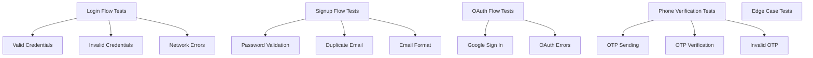

**Diagram sources**
- [src/pages/__tests__/Auth.test.tsx](file://src/pages/__tests__/Auth.test.tsx#L32-L460)

### Testing User Interactions

The authentication tests demonstrate sophisticated user interaction testing using `@testing-library/user-event`:

- **Form validation**: Real-time validation feedback
- **Error handling**: Graceful error display and recovery
- **State transitions**: Smooth UI state changes
- **Navigation**: Programmatic routing after successful operations

**Section sources**
- [src/pages/__tests__/Auth.test.tsx](file://src/pages/__tests__/Auth.test.tsx#L1-L460)

## Hook Testing Strategies

### Asynchronous Hook Testing

The [`useAdminAuth.test.ts`](file://src/hooks/__tests__/useAdminAuth.test.ts) showcases advanced hook testing patterns:

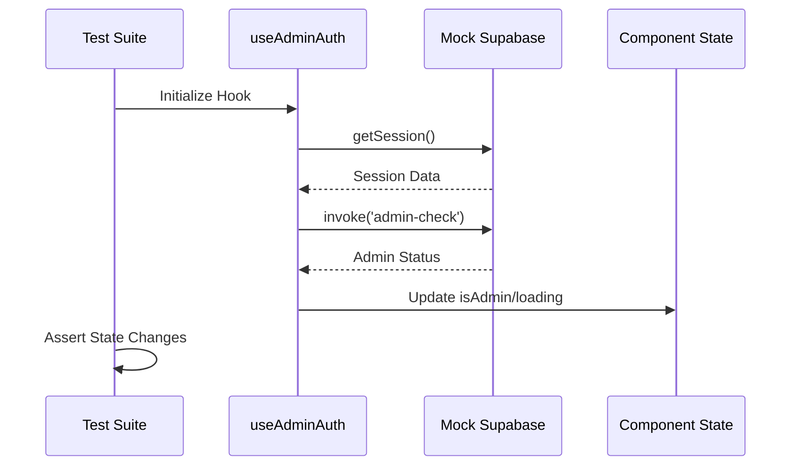

**Diagram sources**
- [src/hooks/__tests__/useAdminAuth.test.ts](file://src/hooks/__tests__/useAdminAuth.test.ts#L43-L50)

### Edge Case and Error Handling

The hook tests cover comprehensive edge cases:
- **Missing sessions**: Graceful fallback to non-admin state
- **Network failures**: Proper error handling and user feedback
- **Malformed responses**: Defensive programming against unexpected data
- **Concurrent requests**: Race condition prevention
- **Security validation**: Server-side verification enforcement

**Section sources**
- [src/hooks/__tests__/useAdminAuth.test.ts](file://src/hooks/__tests__/useAdminAuth.test.ts#L1-L381)

## Integration Testing Approach

### Utility Function Testing

The [`github-search-engine.test.ts`](file://src/test/github-search-engine.test.ts) demonstrates testing of utility functions that integrate with external APIs:

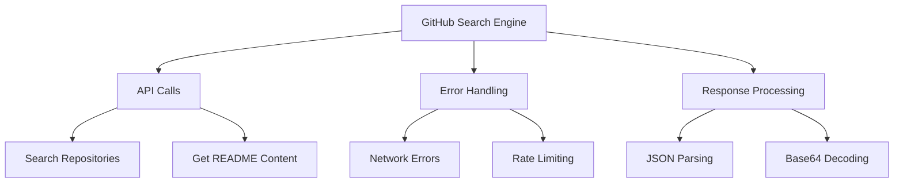

**Diagram sources**
- [src/test/github-search-engine.test.ts](file://src/test/github-search-engine.test.ts#L1-L85)

### Blog System Testing

The [`blogTest.ts`](file://src/test/blogTest.ts) provides a comprehensive testing script for blog functionality:

- **Debugger availability**: Module loading verification
- **Database connectivity**: Connection status checking
- **Permission validation**: Access rights verification
- **Component integrity**: Error boundary and state handling
- **Manual testing guidance**: Interactive test scenarios

**Section sources**
- [src/test/github-search-engine.test.ts](file://src/test/github-search-engine.test.ts#L1-L85)
- [src/test/blogTest.ts](file://src/test/blogTest.ts#L1-L77)

## End-to-End Testing Guidelines

### Strategic E2E Test Selection

While the current implementation focuses on unit and integration tests, the framework supports end-to-end testing for critical user journeys:

| Test Type | Coverage Area | Priority Level |
|-----------|---------------|----------------|
| Authentication | Login, Registration, OAuth flows | High |
| Order Management | Quote creation, Order processing | High |
| Admin Operations | Dashboard access, User management | Medium |
| Supplier Workflows | Supplier registration, Order assignment | Medium |
| Buyer Experience | Product browsing, Purchase flow | High |

### E2E Test Implementation Pattern

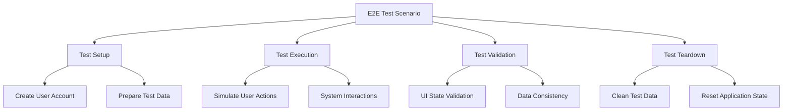

## Test Coverage and Reporting

### Coverage Configuration

The Vitest configuration generates comprehensive coverage reports using the V8 engine:

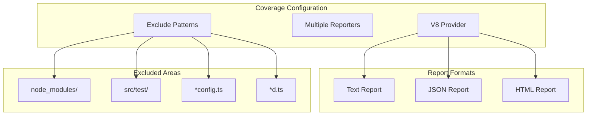

**Diagram sources**
- [vitest.config.ts](file://vitest.config.ts#L12-L20)

### Coverage Metrics

The coverage configuration excludes:
- **Node modules**: Third-party dependencies
- **Test directories**: Self-contained testing infrastructure
- **TypeScript config files**: Build configuration
- **Type declaration files**: TypeScript definitions

**Section sources**
- [vitest.config.ts](file://vitest.config.ts#L12-L20)

## Best Practices and Guidelines

### Writing Effective Tests

1. **Descriptive Test Names**: Use clear, descriptive names that explain the test's purpose
2. **Arrange-Act-Assert Pattern**: Structure tests consistently with setup, execution, and validation
3. **Isolation**: Ensure tests don't depend on each other's state
4. **Mock Appropriately**: Mock external dependencies while testing internal logic
5. **Edge Cases**: Test boundary conditions and error scenarios

### Test Organization Principles

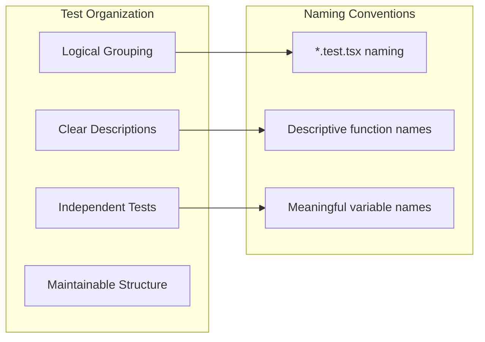

### Performance Considerations

- **Parallel Execution**: Leverage Vitest's parallel test execution
- **Mock Efficiency**: Use efficient mocking strategies to minimize test overhead
- **Selective Testing**: Focus on critical paths and high-risk areas
- **CI/CD Integration**: Automated testing in continuous integration pipelines

## Troubleshooting Common Issues

### Common Testing Problems

| Problem | Symptoms | Solution |
|---------|----------|----------|
| Mock Not Applied | Real API calls in tests | Verify mock setup and module path |
| Async Test Failures | Timing-related failures | Use `waitFor` for async operations |
| State Pollution | Tests affecting each other | Implement proper cleanup in `afterEach` |
| Missing Dependencies | Import errors in tests | Check TypeScript configuration and paths |
| Coverage Gaps | Low coverage metrics | Add tests for uncovered branches |

### Debugging Strategies

1. **Console Logging**: Use `console.log` statements for debugging test execution
2. **Snapshot Testing**: Compare component output snapshots for regression detection
3. **Coverage Analysis**: Review coverage reports to identify untested code
4. **Isolation Testing**: Run individual tests to isolate issues
5. **Environment Verification**: Ensure test environment matches production setup

### Performance Optimization

- **Test Parallelization**: Configure appropriate parallel test execution
- **Mock Optimization**: Minimize mock complexity and improve performance
- **Selective Running**: Use test filtering for focused development cycles
- **Resource Management**: Properly clean up resources between tests

**Section sources**
- [src/test/setup.ts](file://src/test/setup.ts#L5-L8)