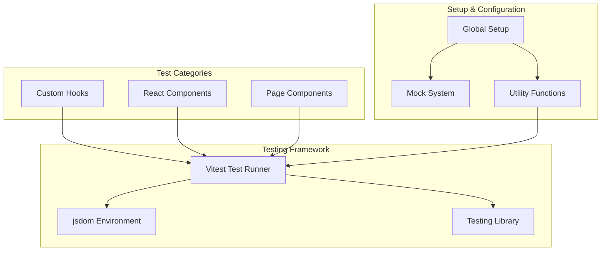
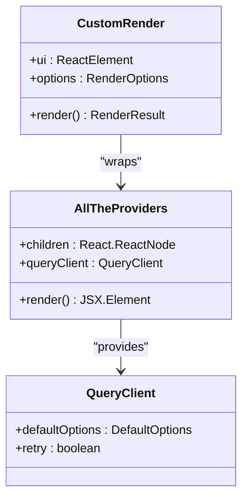
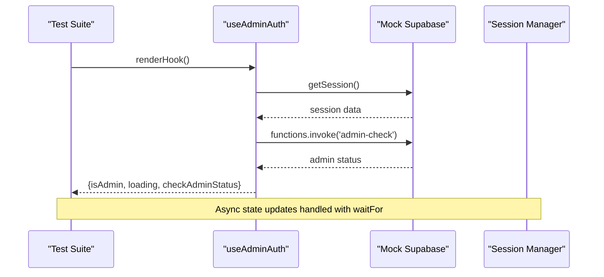
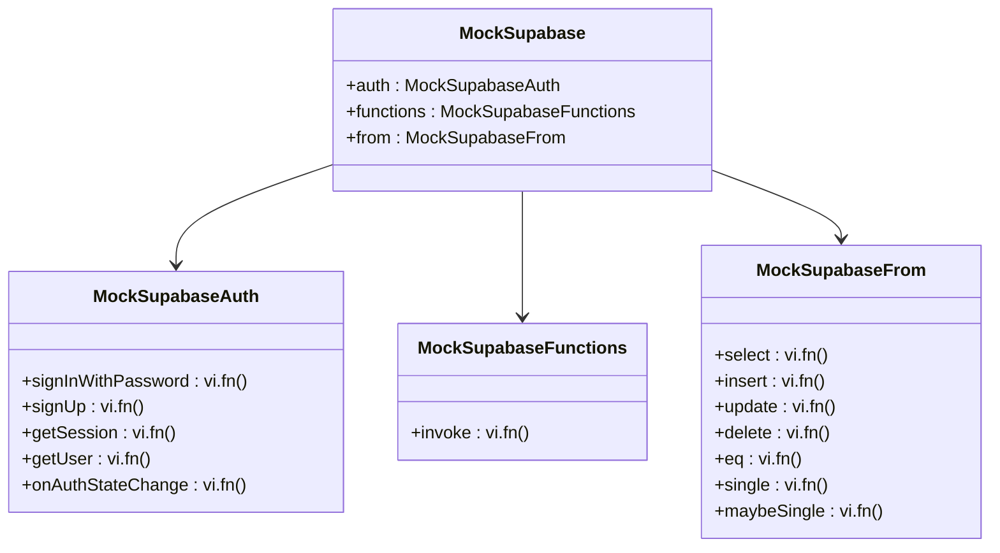
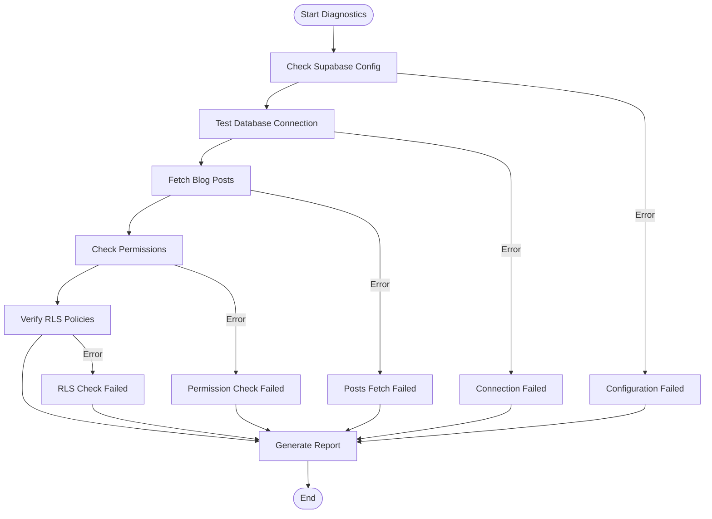

# Unit Testing

<cite>
**Referenced Files in This Document**
- [vitest.config.ts](file://vitest.config.ts)
- [src/test/setup.ts](file://src/test/setup.ts)
- [src/hooks/__tests__/useAdminAuth.test.ts](file://src/hooks/__tests__/useAdminAuth.test.ts)
- [src/test/blogTest.ts](file://src/test/blogTest.ts)
- [src/test/utils/test-utils.tsx](file://src/test/utils/test-utils.tsx)
- [src/hooks/useAdminAuth.ts](file://src/hooks/useAdminAuth.ts)
- [src/test/mocks/supabase.ts](file://src/test/mocks/supabase.ts)
- [src/pages/__tests__/Auth.test.tsx](file://src/pages/__tests__/Auth.test.tsx)
- [src/lib/blogDebugger.ts](file://src/lib/blogDebugger.ts)
- [src/test/github-search-engine.test.ts](file://src/test/github-search-engine.test.ts)
- [package.json](file://package.json)
</cite>

## Table of Contents
1. [Introduction](#introduction)
2. [Testing Infrastructure](#testing-infrastructure)
3. [Vitest Configuration](#vitest-configuration)
4. [Global Setup and Mocks](#global-setup-and-mocks)
5. [Custom Test Utilities](#custom-test-utilities)
6. [Testing Custom Hooks](#testing-custom-hooks)
7. [Mock Authentication Testing](#mock-authentication-testing)
8. [Utility Function Testing](#utility-function-testing)
9. [Assertion Patterns](#assertion-patterns)
10. [Mock Strategies](#mock-strategies)
11. [Snapshot Testing](#snapshot-testing)
12. [Best Practices](#best-practices)
13. [Code Coverage](#code-coverage)
14. [Troubleshooting](#troubleshooting)

## Introduction

The Sleek Apparels application employs a comprehensive unit testing strategy built around Vitest as the primary test runner, utilizing the jsdom environment for DOM manipulation testing and a robust global setup system. This testing framework ensures high code quality, maintainable business logic, and reliable component behavior through isolated unit tests.

The testing architecture focuses on testing individual units of logic including custom React hooks, utility functions, and business logic components. The framework provides extensive mocking capabilities, assertion patterns, and testing utilities specifically designed for the application's React-based architecture and Supabase integration.

## Testing Infrastructure

The testing infrastructure is built on several key technologies and patterns that work together to provide comprehensive unit testing coverage:



**Diagram sources**
- [vitest.config.ts](file://vitest.config.ts#L1-L29)
- [src/test/setup.ts](file://src/test/setup.ts#L1-L43)

**Section sources**
- [vitest.config.ts](file://vitest.config.ts#L1-L29)
- [package.json](file://package.json#L12-L12)

## Vitest Configuration

The Vitest configuration establishes the foundation for all unit testing activities in the application. It enables global test functions, sets up the jsdom environment for DOM testing, and configures comprehensive coverage reporting.

### Core Configuration Features

The configuration includes several essential features:

- **Global Functions**: Enables `describe`, `it`, `expect`, `vi`, and `beforeEach` globally
- **Environment**: Uses jsdom for DOM manipulation testing
- **Setup Files**: Loads global setup from `src/test/setup.ts`
- **CSS Support**: Enables CSS module testing
- **Coverage Reporting**: Configures V8 provider with multiple reporters (text, JSON, HTML)

### Coverage Configuration

The coverage system excludes several categories to maintain focused metrics:
- Node modules to avoid third-party code coverage
- Test directories themselves to prevent self-inclusion
- Configuration files and TypeScript declaration files

**Section sources**
- [vitest.config.ts](file://vitest.config.ts#L1-L29)

## Global Setup and Mocks

The global setup system provides essential mocking and environment preparation for all tests, ensuring consistent test execution across the application.

### Essential Mocks

The setup includes critical mocks for browser APIs that are not natively available in the Node.js environment:

#### Window.matchMedia Mock
Provides MediaQuery support for responsive design testing:
- Returns `matches: false` by default
- Implements all required MediaQuery API methods
- Supports event listener registration and removal

#### IntersectionObserver Mock
Enables testing of intersection-based functionality:
- Provides basic observer methods
- Implements disconnect, observe, unobserve, and takeRecords
- Maintains compatibility with React components using intersection detection

#### ResizeObserver Mock
Supports resize-based component testing:
- Implements constructor, disconnect, observe, and unobserve methods
- Essential for components using resize detection

### Test Cleanup

The setup includes automatic cleanup after each test:
- Calls `cleanup()` from Testing Library to remove rendered components
- Prevents memory leaks and cross-test contamination
- Ensures fresh test environments

**Section sources**
- [src/test/setup.ts](file://src/test/setup.ts#L1-L43)

## Custom Test Utilities

The application provides specialized test utilities that simplify common testing patterns and reduce boilerplate code.

### Query Client Provider

The test utilities include a custom Query Client provider that wraps components with React Query functionality:



**Diagram sources**
- [src/test/utils/test-utils.tsx](file://src/test/utils/test-utils.tsx#L19-L38)

### Provider Configuration

The Query Client is configured with:
- Disabled retry mechanism for faster test execution
- Browser router wrapping for routing-dependent tests
- Proper provider hierarchy for React Query and React Router integration

### Utility Exports

The test utilities export:
- Custom `render` function with providers
- All Testing Library exports for convenience
- Type-safe rendering with proper provider context

**Section sources**
- [src/test/utils/test-utils.tsx](file://src/test/utils/test-utils.tsx#L1-L39)

## Testing Custom Hooks

Custom hooks represent a significant portion of the application's business logic and require specialized testing approaches to ensure proper state management and side effect handling.

### useAdminAuth Hook Testing Pattern

The `useAdminAuth` hook serves as the primary example of custom hook testing, demonstrating comprehensive authentication flow validation:



**Diagram sources**
- [src/hooks/__tests__/useAdminAuth.test.ts](file://src/hooks/__tests__/useAdminAuth.test.ts#L27-L50)
- [src/hooks/useAdminAuth.ts](file://src/hooks/useAdminAuth.ts#L14-L46)

### Testing Patterns

The hook testing follows established patterns:

#### Initial State Testing
Verifies correct initial state values:
- Loading state starts as `true`
- Admin status starts as `false`
- No side effects during initialization

#### Async State Updates
Uses `waitFor` to handle asynchronous state changes:
- Waits for loading to complete
- Validates state transitions
- Ensures proper cleanup

#### Error Handling
Tests various error scenarios:
- Network failures
- Authentication errors
- Malformed responses
- Edge cases

**Section sources**
- [src/hooks/__tests__/useAdminAuth.test.ts](file://src/hooks/__tests__/useAdminAuth.test.ts#L1-L381)
- [src/hooks/useAdminAuth.ts](file://src/hooks/useAdminAuth.ts#L1-L47)

## Mock Authentication Testing

Authentication testing requires sophisticated mocking strategies to simulate various authentication states and edge cases without requiring actual authentication services.

### Supabase Mock Implementation

The Supabase mock system provides comprehensive authentication simulation:



**Diagram sources**
- [src/test/mocks/supabase.ts](file://src/test/mocks/supabase.ts#L1-L38)

### Authentication Flow Testing

The authentication testing covers complete user journeys:

#### Login Flow
- Valid credential submission
- Error handling for invalid credentials
- Network error scenarios
- Password validation

#### Signup Flow
- Form validation
- Duplicate email detection
- Role selection
- Company information handling

#### OAuth Integration
- Google authentication
- Redirect handling
- Error scenarios

### Mock Reset Strategy

The testing framework includes a reset mechanism:
- `resetMocks()` clears all mock implementations
- Ensures clean state between tests
- Prevents test interference

**Section sources**
- [src/test/mocks/supabase.ts](file://src/test/mocks/supabase.ts#L1-L38)
- [src/pages/__tests__/Auth.test.tsx](file://src/pages/__tests__/Auth.test.tsx#L1-L460)

## Utility Function Testing

Utility functions require focused testing to validate mathematical calculations, data transformations, and business logic operations.

### GitHub Search Engine Testing

The GitHub search engine demonstrates comprehensive utility testing patterns:

#### API Interaction Testing
Tests external API communication:
- Request construction with proper headers
- Parameter encoding
- Response parsing
- Error handling

#### Content Retrieval Testing
Validates content extraction:
- Base64 decoding
- README content retrieval
- Repository metadata parsing

#### Error Scenario Testing
Handles various failure modes:
- Network timeouts
- API rate limits
- Invalid responses
- Authentication failures

### Blog Debugger Testing

The blog debugger provides comprehensive diagnostic testing:



**Diagram sources**
- [src/lib/blogDebugger.ts](file://src/lib/blogDebugger.ts#L31-L158)

**Section sources**
- [src/test/github-search-engine.test.ts](file://src/test/github-search-engine.test.ts#L1-L85)
- [src/lib/blogDebugger.ts](file://src/lib/blogDebugger.ts#L1-L246)

## Assertion Patterns

The testing framework employs consistent assertion patterns to ensure reliable and readable test validation.

### Basic Assertions

Common assertion patterns include:

#### Truthiness Testing
- `expect(value).toBeTruthy()` for positive validation
- `expect(value).toBeFalsy()` for negative validation
- `expect(value).toBe(true/false)` for explicit boolean checks

#### Equality Testing
- `expect(value).toBe(expected)` for primitive comparison
- `expect(value).toEqual(expected)` for deep equality
- `expect(value).toMatchObject(expected)` for partial object matching

#### Function Behavior Testing
- `expect(fn).toHaveBeenCalled()` for function invocation
- `expect(fn).toHaveBeenCalledWith(args)` for argument validation
- `expect(fn).toHaveBeenCalledTimes(count)` for invocation counting

### Asynchronous Testing

Asynchronous operations require specialized assertion patterns:

#### Promise Resolution
- `await expect(promise).resolves.toBe(expected)`
- `await expect(promise).rejects.toThrow(error)`

#### State Changes
- `await waitFor(() => expect(condition).toBe(true))`
- `await waitFor(() => expect(state).toMatchSnapshot())`

### DOM Assertions

React component testing uses Testing Library assertions:

#### Element Presence
- `expect(element).toBeInTheDocument()`
- `expect(element).toHaveTextContent(text)`
- `expect(element).toHaveAttribute(attribute)`

#### Event Handling
- `await user.click(element)`
- `await user.type(element, text)`
- `await user.selectOptions(element, value)`

## Mock Strategies

Effective mocking is crucial for isolating units under test and controlling external dependencies.

### vi.fn() Usage Patterns

The framework extensively uses `vi.fn()` for function mocking:

#### Basic Mock Implementation
```typescript
// Simple function mock
const mockFn = vi.fn();

// Mock with return value
const mockFn = vi.fn().mockReturnValue(value);

// Mock with implementation
const mockFn = vi.fn().mockImplementation(fn);
```

#### Chainable Mocks
Database operations use chainable mock patterns:
- `select().where().execute()` mocking
- Method chaining preservation
- Return value customization per method

### Mock Reset Strategies

Proper mock management prevents test interference:

#### Per-Test Reset
```typescript
beforeEach(() => {
  vi.clearAllMocks();
});
```

#### Granular Reset
```typescript
beforeEach(() => {
  mockSupabase.auth.getSession.mockClear();
});
```

### External Service Mocking

Third-party service mocking follows established patterns:

#### API Endpoint Mocking
- Request URL validation
- Header verification
- Response body simulation
- Error condition simulation

#### Authentication Mocking
- Token validation
- Session persistence
- User metadata simulation
- Role-based access control

**Section sources**
- [src/test/mocks/supabase.ts](file://src/test/mocks/supabase.ts#L1-L38)

## Snapshot Testing

Snapshot testing provides regression protection for component rendering and data structures.

### Component Snapshots

While the current codebase doesn't extensively use snapshots, the framework supports snapshot testing patterns:

#### Basic Snapshot Usage
```typescript
expect(renderedComponent).toMatchSnapshot();
```

#### Conditional Snapshots
```typescript
if (condition) {
  expect(component).toMatchSnapshot();
}
```

### Data Structure Snapshots

Utility functions benefit from data structure snapshots:

#### API Response Snapshots
```typescript
const response = await fetchData();
expect(response).toMatchSnapshot();
```

#### Configuration Snapshots
```typescript
const config = generateConfig();
expect(config).toMatchSnapshot();
```

### Snapshot Management

Snapshot testing requires careful management:

#### Update Strategy
- Manual snapshot updates for intentional changes
- Automated CI integration for regression detection
- Clear commit messages for snapshot changes

#### Maintenance Considerations
- Regular snapshot review
- Meaningful snapshot names
- Avoid overly complex snapshots

## Best Practices

Effective unit testing requires adherence to established best practices that ensure maintainable, reliable, and meaningful tests.

### Test Organization

#### Descriptive Naming
- Use clear, descriptive test names
- Include context and expected outcome
- Follow AAA (Arrange, Act, Assert) pattern in names

#### Logical Grouping
- Group related tests with `describe` blocks
- Use `beforeEach` for common setup
- Separate concerns with nested `describe` blocks

### Test Isolation

#### Clean State Management
- Reset mocks between tests
- Use fresh test instances
- Avoid global state modification

#### Independent Execution
- Each test should be runnable independently
- No test dependencies
- Consistent preconditions

### Assertion Quality

#### Specific Assertions
- Use appropriate assertion methods
- Avoid generic `.toEqual` when specific alternatives exist
- Include meaningful error messages

#### Error Handling
- Test error conditions explicitly
- Verify error messages and codes
- Handle edge cases

### Performance Considerations

#### Fast Test Execution
- Minimize async operations
- Use appropriate timeouts
- Avoid unnecessary network calls

#### Resource Management
- Clean up resources after tests
- Close connections and subscriptions
- Release memory allocations

### Maintainability

#### Refactor Tests
- Extract common patterns into utilities
- Use factories for test data
- Keep tests DRY (Don't Repeat Yourself)

#### Documentation
- Comment complex test logic
- Explain why tests exist
- Document edge cases

## Code Coverage

The testing framework includes comprehensive coverage reporting to ensure adequate test coverage across the codebase.

### Coverage Configuration

The V8 coverage provider generates multiple report formats:
- Text output for terminal display
- JSON for CI integration
- HTML for detailed coverage analysis

### Coverage Targets

Recommended coverage targets:
- **Critical business logic**: 90%+
- **Utility functions**: 85%+
- **Components**: 70%+
- **Integration points**: 80%

### Coverage Analysis

Coverage reports provide insights into:
- Line coverage percentages
- Branch coverage identification
- Function coverage tracking
- Uncovered code identification

### Improvement Strategies

#### Targeted Testing
- Focus on uncovered critical paths
- Test edge cases and error conditions
- Validate complex business logic

#### Continuous Monitoring
- Monitor coverage trends
- Identify regression areas
- Maintain coverage goals

**Section sources**
- [vitest.config.ts](file://vitest.config.ts#L12-L20)

## Troubleshooting

Common testing issues and their solutions help maintain smooth development workflows.

### Common Issues

#### Mock Not Working
- Verify mock setup before test execution
- Check mock restoration between tests
- Ensure proper import paths

#### Asynchronous Test Failures
- Use `waitFor` for async state changes
- Check promise resolution/rejection
- Verify timeout values

#### DOM Testing Issues
- Ensure proper provider wrapping
- Check element selectors
- Verify component rendering

### Debugging Strategies

#### Test Isolation
- Run individual tests to isolate issues
- Check for global state interference
- Verify mock cleanup

#### Assertion Debugging
- Add console logs for intermediate values
- Use `expect().toMatchInlineSnapshot()`
- Compare actual vs expected values

### Environment Issues

#### Node.js Version Compatibility
- Verify Node.js version requirements
- Check V8 engine compatibility
- Test in clean environment

#### Dependency Conflicts
- Review package version conflicts
- Check for peer dependency issues
- Verify TypeScript configuration

### Performance Issues

#### Slow Test Execution
- Optimize async operations
- Reduce unnecessary rendering
- Use shallow rendering when appropriate

#### Memory Leaks
- Check for unclosed subscriptions
- Verify proper cleanup
- Monitor test resource usage

**Section sources**
- [src/test/setup.ts](file://src/test/setup.ts#L1-L43)