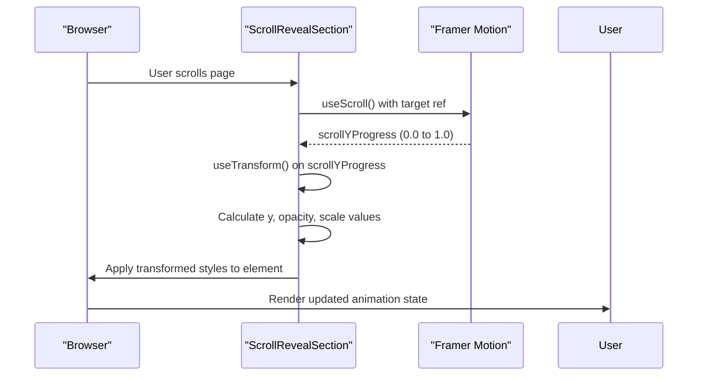
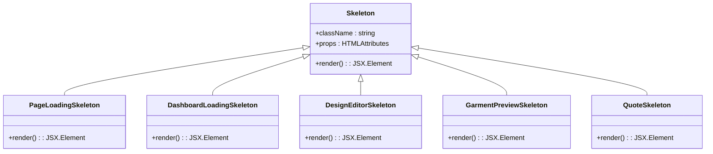
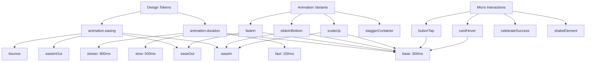

# Animation and Reveal Components

<cite>
**Referenced Files in This Document**   
- [AnimatedSection.tsx](file://src/components/AnimatedSection.tsx)
- [ScrollRevealSection.tsx](file://src/components/ScrollRevealSection.tsx)
- [LoadingSkeleton.tsx](file://src/components/LoadingSkeleton.tsx)
- [DesignEditorSkeleton.tsx](file://src/components/design-studio/DesignEditorSkeleton.tsx)
- [GarmentPreviewSkeleton.tsx](file://src/components/design-studio/GarmentPreviewSkeleton.tsx)
- [QuoteSkeleton.tsx](file://src/components/quote/QuoteSkeleton.tsx)
- [skeleton.tsx](file://src/components/ui/skeleton.tsx)
- [animations.ts](file://src/lib/animations.ts)
- [microInteractions.ts](file://src/lib/microInteractions.ts)
- [designTokens.ts](file://src/lib/designTokens.ts)
- [useLazyLoad.ts](file://src/hooks/useLazyLoad.ts)
- [useScrollProgress.ts](file://src/hooks/useScrollProgress.ts)
</cite>

## Table of Contents
1. [Introduction](#introduction)
2. [Core Animation Components](#core-animation-components)
3. [Scroll-Triggered Reveal System](#scroll-triggered-reveal-system)
4. [Skeleton Loading Components](#skeleton-loading-components)
5. [Animation Variants and Design Tokens](#animation-variants-and-design-tokens)
6. [Performance Optimization](#performance-optimization)
7. [Accessibility Considerations](#accessibility-considerations)
8. [Integration Patterns](#integration-patterns)

## Introduction
The animation and reveal system in sleekapp-v100 provides a sophisticated set of components for creating engaging user experiences through scroll-triggered animations, staggered entry effects, and loading state visualization. The system is built on Framer Motion and leverages modern React patterns to deliver smooth, performant animations while maintaining accessibility and user preferences. This documentation details the implementation of key components including AnimatedSection, ScrollRevealSection, and various skeleton loaders, along with their integration patterns and performance optimization techniques.

## Core Animation Components

The AnimatedSection component serves as the primary mechanism for implementing scroll-triggered animations throughout the application. It provides a flexible API for controlling animation behavior through props such as variant, delay, duration, and staggerChildren. The component supports multiple animation variants including fadeUp, fadeIn, slideLeft, slideRight, scale, and stagger, each with predefined motion values that control the entrance animation of content.

The implementation leverages Framer Motion's `whileInView` trigger to initiate animations when components enter the viewport, optimizing performance by avoiding unnecessary calculations for off-screen elements. The viewport configuration includes a margin of "-10%" to trigger animations slightly before elements become visible, creating a more seamless experience. The component also utilizes the `willChange` CSS property strategically based on the animation variant to optimize rendering performance.

**Section sources**
- [AnimatedSection.tsx](file://src/components/AnimatedSection.tsx#L1-L79)

## Scroll-Triggered Reveal System

The ScrollRevealSection component implements advanced scroll-linked animations using Framer Motion's `useScroll` and `useTransform` hooks. Unlike the binary reveal behavior of AnimatedSection, this component creates continuous animations that respond to scroll position, enabling effects such as parallax movement, progressive opacity changes, and scaling transformations.

The component tracks scroll progress relative to its own position in the viewport using the `useScroll` hook with custom offset values ["start end", "end start"]. This configuration ensures the animation begins when the section reaches the bottom of the viewport and completes when it reaches the top. The scroll progress is then transformed into multiple visual properties: vertical translation (y), opacity, and scale, creating a multi-dimensional reveal effect.

Parallax effects are controlled through the `parallaxSpeed` prop, which determines the intensity of vertical movement during scrolling. The default value of 50px creates a moderate parallax effect that enhances depth perception without being distracting. The component also applies `transform: translateZ(0)` to promote the element to its own layer, improving rendering performance for the animated properties.

**Diagram sources**
- [ScrollRevealSection.tsx](file://src/components/ScrollRevealSection.tsx#L1-L43)

**Section sources**
- [ScrollRevealSection.tsx](file://src/components/ScrollRevealSection.tsx#L1-L43)
- [useScrollProgress.ts](file://src/hooks/useScrollProgress.ts#L1-L61)

## Skeleton Loading Components

The skeleton loading system in sleekapp-v100 provides multiple specialized components for different contexts, each designed to maintain user engagement during loading states while accurately representing the final content structure. The system is built on a layered architecture with the base Skeleton component from the UI library providing the fundamental pulse animation, and higher-level components composing this base with specific layouts.

The PageLoadingSkeleton component features a branded loading experience with a spinning logo animation and pulsing dot indicators, creating an engaging transition for full page loads. The DashboardLoadingSkeleton provides a more complex layout with placeholders for header text, statistics cards, and table rows, accurately representing the dashboard structure. Context-specific skeletons like DesignEditorSkeleton and GarmentPreviewSkeleton replicate the exact layout of their corresponding components, reducing layout shift when content loads.

All skeleton components leverage the `animate-pulse` Tailwind CSS class, which applies a subtle opacity animation to create the perception of activity. The base Skeleton component uses the `bg-muted` class for appropriate contrast against various backgrounds and applies rounded corners consistent with the design system. The animation is implemented through CSS rather than JavaScript, ensuring smooth performance even on lower-end devices.

**Diagram sources**
- [skeleton.tsx](file://src/components/ui/skeleton.tsx#L1-L7)
- [LoadingSkeleton.tsx](file://src/components/LoadingSkeleton.tsx#L1-L97)
- [DesignEditorSkeleton.tsx](file://src/components/design-studio/DesignEditorSkeleton.tsx#L1-L33)
- [GarmentPreviewSkeleton.tsx](file://src/components/design-studio/GarmentPreviewSkeleton.tsx#L1-L37)
- [QuoteSkeleton.tsx](file://src/components/quote/QuoteSkeleton.tsx#L1-L89)

**Section sources**
- [LoadingSkeleton.tsx](file://src/components/LoadingSkeleton.tsx#L1-L97)
- [skeleton.tsx](file://src/components/ui/skeleton.tsx#L1-L7)
- [DesignEditorSkeleton.tsx](file://src/components/design-studio/DesignEditorSkeleton.tsx#L1-L33)
- [GarmentPreviewSkeleton.tsx](file://src/components/design-studio/GarmentPreviewSkeleton.tsx#L1-L37)
- [QuoteSkeleton.tsx](file://src/components/quote/QuoteSkeleton.tsx#L1-L89)

## Animation Variants and Design Tokens

The animation system is governed by a comprehensive set of design tokens and reusable variants that ensure consistency across the application. The designTokens.ts file defines a structured animation system with standardized durations and easing functions that align with the brand's motion principles. The animation.duration tokens (fast: 150ms, base: 300ms, slow: 500ms, slower: 800ms) provide a rhythmic foundation for all animations, while the easing functions (easeIn, easeOut, easeInOut, bounce) create a cohesive motion language.

The animations.ts library exports a collection of pre-defined Framer Motion variants for common animation patterns, including page transitions, fade effects, slide animations, and micro-interactions. These variants are designed to work seamlessly with the design tokens, using the standardized durations and easing functions. For example, the fadeInUp variant uses the base duration of 300ms with an easeOut curve, creating a natural-feeling entrance animation.

The microInteractions.ts file extends this system with more complex interaction patterns, including haptic feedback simulation, button press animations, and success/error celebrations. These interactions are designed to provide immediate feedback to user actions while maintaining performance. The haptic feedback system combines visual pulse effects with subtle audio cues through the Web Audio API, creating a multi-sensory experience that works across all devices.

**Diagram sources**
- [designTokens.ts](file://src/lib/designTokens.ts#L1-L205)
- [animations.ts](file://src/lib/animations.ts#L1-L281)
- [microInteractions.ts](file://src/lib/microInteractions.ts#L1-L339)

**Section sources**
- [animations.ts](file://src/lib/animations.ts#L1-L281)
- [microInteractions.ts](file://src/lib/microInteractions.ts#L1-L339)
- [designTokens.ts](file://src/lib/designTokens.ts#L1-L205)

## Performance Optimization

The animation system incorporates multiple performance optimization techniques to ensure smooth rendering across devices. The useLazyLoad hook implements Intersection Observer API to defer rendering of off-screen components until they enter the viewport, reducing initial load time and memory usage. The hook provides configurable options for threshold, rootMargin, and triggerOnce behavior, allowing fine-tuned control over when components should be revealed.

For scroll-linked animations, the system leverages Framer Motion's optimized animation engine, which batches DOM updates and uses requestAnimationFrame for smooth 60fps rendering. The components strategically apply the `willChange` CSS property only for properties that are actually being animated, avoiding unnecessary layer creation. The ScrollRevealSection component uses `transform: translateZ(0)` to promote the element to its own compositor layer, ensuring that animations of transform and opacity properties are handled by the GPU rather than the main thread.

The performanceOptimizer.ts file implements additional optimizations including resource hints (dns-prefetch and preconnect) for external domains, and defers non-critical script loading using requestIdleCallback. These optimizations reduce network latency and prevent third-party scripts from blocking the main thread during critical rendering phases.

**Section sources**
- [useLazyLoad.ts](file://src/hooks/useLazyLoad.ts#L1-L52)
- [performanceOptimizer.ts](file://src/lib/performanceOptimizer.ts#L1-L85)
- [ScrollRevealSection.tsx](file://src/components/ScrollRevealSection.tsx#L1-L43)

## Accessibility Considerations

The animation system respects user preferences for reduced motion through the `prefers-reduced-motion` media query. While not explicitly implemented in the provided components, Framer Motion automatically respects this preference by reducing animation duration to zero when the user has indicated a preference for reduced motion in their operating system settings.

The skeleton components provide meaningful loading states that maintain the content structure, reducing cognitive load when content appears. The pulsing animation is subtle enough to indicate activity without being distracting, and the duration follows the design token system to avoid overly rapid or slow animations that could be problematic for users with attention disorders.

For users navigating with keyboards, the focus management is maintained through the animation process, with no disruption to the tab order or focus state. The components do not implement auto-focusing or focus trapping that could interfere with standard navigation patterns.

**Section sources**
- [AnimatedSection.tsx](file://src/components/AnimatedSection.tsx#L1-L79)
- [ScrollRevealSection.tsx](file://src/components/ScrollRevealSection.tsx#L1-L43)
- [LoadingSkeleton.tsx](file://src/components/LoadingSkeleton.tsx#L1-L97)

## Integration Patterns

The animation components are integrated throughout the application using consistent patterns that balance visual appeal with performance. In the Portfolio.tsx page, multiple AnimatedSection components are used with incremental delays to create a staggered reveal effect as the user scrolls through the content. This pattern enhances the narrative flow while maintaining performance by only animating elements as they enter the viewport.

For complex loading states, the application uses specialized skeleton components that mirror the exact layout of the final content. For example, the QuoteSkeleton component replicates the structure of the quote breakdown, timeline, and AI insights sections, providing users with a clear expectation of the content that will appear. This approach reduces perceived loading time and prevents layout shifts that could disrupt the user experience.

The system also integrates with the design token system to ensure animation properties are consistent with the overall design language. Duration and easing values are pulled from the design tokens, ensuring that all animations follow the same rhythm and feel across the application. This integration creates a cohesive experience where motion becomes an extension of the brand identity rather than an isolated visual effect.

**Section sources**
- [Portfolio.tsx](file://src/pages/Portfolio.tsx#L10-L255)
- [AnimatedSection.tsx](file://src/components/AnimatedSection.tsx#L1-L79)
- [QuoteSkeleton.tsx](file://src/components/quote/QuoteSkeleton.tsx#L1-L89)
- [designTokens.ts](file://src/lib/designTokens.ts#L1-L205)