# Custom UI Components

<cite>
**Referenced Files in This Document**
- [LoopTraceFeatures.tsx](file://src/components/home/LoopTraceFeatures.tsx)
- [ProductionTimeline.tsx](file://src/components/production/ProductionTimeline.tsx)
- [OrderStatusTimeline.tsx](file://src/components/OrderStatusTimeline.tsx)
- [LoopTraceTimeline.tsx](file://src/components/modern/LoopTraceTimeline.tsx)
- [StatCard.tsx](file://src/components/modern/StatCard.tsx)
- [ProgressRing.tsx](file://src/components/modern/ProgressRing.tsx)
- [AnimatedSection.tsx](file://src/components/AnimatedSection.tsx)
- [ScrollRevealSection.tsx](file://src/components/ScrollRevealSection.tsx)
- [animations.ts](file://src/lib/animations.ts)
- [designTokens.ts](file://src/lib/designTokens.ts)
- [card.tsx](file://src/components/ui/card.tsx)
- [button.tsx](file://src/components/ui/button.tsx)
- [badge.tsx](file://src/components/ui/badge.tsx)
- [Index.tsx](file://src/pages/Index.tsx)
</cite>

## Table of Contents
1. [Introduction](#introduction)
2. [Architecture Overview](#architecture-overview)
3. [Core Components Analysis](#core-components-analysis)
4. [Animation System](#animation-system)
5. [Design System Integration](#design-system-integration)
6. [Performance Optimization](#performance-optimization)
7. [Responsive Design](#responsive-design)
8. [Integration Patterns](#integration-patterns)
9. [Best Practices](#best-practices)
10. [Troubleshooting Guide](#troubleshooting-guide)

## Introduction

The sleekapp-v100 custom UI component library represents a sophisticated collection of production-ready React components designed for modern manufacturing applications. Built on top of shadcn/ui primitives and powered by Framer Motion for animations, these components deliver exceptional user experiences through engaging visual storytelling, real-time data visualization, and seamless interactivity.

The component ecosystem focuses on three core domains: **production tracking**, **business intelligence**, and **user engagement**. Each component is engineered with performance, accessibility, and maintainability as primary concerns, leveraging modern React patterns and TypeScript for robust type safety.

## Architecture Overview

The custom UI components follow a modular architecture pattern that separates concerns between presentation, behavior, and data management. The system integrates seamlessly with the shadcn/ui design system while maintaining brand consistency through custom design tokens.

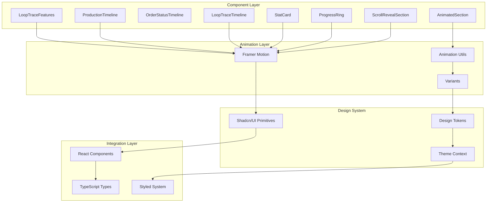

**Diagram sources**
- [LoopTraceFeatures.tsx](file://src/components/home/LoopTraceFeatures.tsx#L1-L50)
- [animations.ts](file://src/lib/animations.ts#L1-L50)
- [designTokens.ts](file://src/lib/designTokens.ts#L1-L50)

## Core Components Analysis

### LoopTraceFeatures Component

The LoopTraceFeatures component serves as a flagship showcase for AI-powered manufacturing capabilities, featuring animated step-by-step workflows, real-time statistics, and interactive timeline visualizations.

#### Implementation Details

The component utilizes sophisticated state management with multiple concurrent animations:

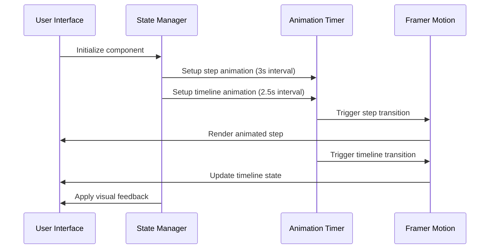

**Diagram sources**
- [LoopTraceFeatures.tsx](file://src/components/home/LoopTraceFeatures.tsx#L115-L136)

#### Key Features

| Feature | Implementation | Purpose |
|---------|---------------|---------|
| **AI Quote Generator** | Animated step progression with hover effects | Demonstrates AI processing workflow |
| **Real-Time Statistics** | Dynamic stat cards with percentage changes | Shows system performance metrics |
| **Production Timeline** | Interactive timeline with status indicators | Visualizes manufacturing stages |
| **Gradient Animations** | CSS gradients with Framer Motion | Creates engaging visual transitions |
| **Responsive Layout** | Grid system with breakpoint-aware design | Ensures optimal viewing across devices |

**Section sources**
- [LoopTraceFeatures.tsx](file://src/components/home/LoopTraceFeatures.tsx#L1-L412)

### LoopTraceTimeline Component

The LoopTraceTimeline component provides comprehensive production tracking with detailed stage-by-stage visualization, photo galleries, and predictive analytics.

#### Component Architecture

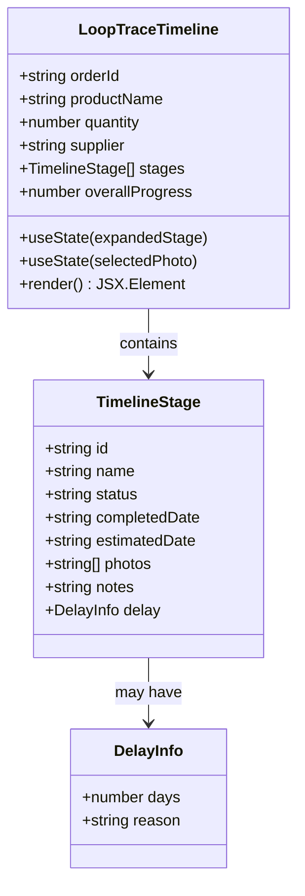

**Diagram sources**
- [LoopTraceTimeline.tsx](file://src/components/modern/LoopTraceTimeline.tsx#L19-L38)

#### Advanced Features

| Feature | Technology | Benefit |
|---------|------------|---------|
| **Interactive Stages** | Click-to-expand functionality | Provides detailed information access |
| **Photo Gallery** | Lightbox with zoom capability | Enables visual quality inspection |
| **Predictive Analytics** | AI-powered delivery forecasting | Enhances customer confidence |
| **Status Tracking** | Real-time progress indicators | Maintains transparency |
| **Delay Detection** | Automated delay identification | Proactively communicates issues |

**Section sources**
- [LoopTraceTimeline.tsx](file://src/components/modern/LoopTraceTimeline.tsx#L1-L350)

### StatCard Component

The StatCard component delivers compact, actionable insights with animated counters and trend indicators.

#### Props Interface

```typescript
interface StatCardProps {
  title: string;
  value: string | number;
  change?: {
    value: number;
    label: string;
  };
  icon: LucideIcon;
  trend?: 'up' | 'down' | 'neutral';
  color?: 'primary' | 'accent' | 'success' | 'warning' | 'error';
  onClick?: () => void;
}
```

#### Design System Integration

The component leverages the design token system for consistent theming:

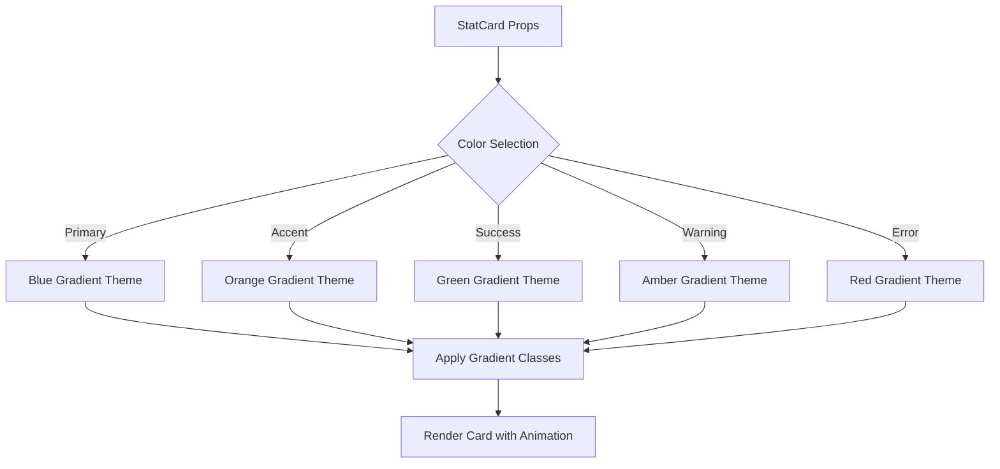

**Diagram sources**
- [StatCard.tsx](file://src/components/modern/StatCard.tsx#L20-L32)

**Section sources**
- [StatCard.tsx](file://src/components/modern/StatCard.tsx#L1-L111)

### ProgressRing Component

The ProgressRing component creates visually appealing circular progress indicators with smooth animations and customizable theming.

#### Technical Implementation

The component uses SVG for rendering with Framer Motion for animations:

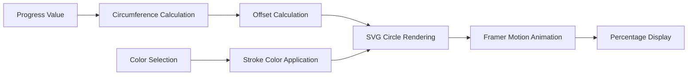

**Diagram sources**
- [ProgressRing.tsx](file://src/components/modern/ProgressRing.tsx#L31-L66)

#### Configuration Options

| Parameter | Type | Default | Description |
|-----------|------|---------|-------------|
| `progress` | number | - | Progress value (0-100) |
| `size` | number | 120 | Diameter in pixels |
| `strokeWidth` | number | 8 | Stroke width in pixels |
| `color` | string | 'primary' | Color theme |
| `showPercentage` | boolean | true | Display percentage text |
| `label` | string | - | Additional label text |

**Section sources**
- [ProgressRing.tsx](file://src/components/modern/ProgressRing.tsx#L1-L96)

### AnimatedSection Component

The AnimatedSection component provides reusable animation containers with multiple preset animation variants.

#### Animation Variants

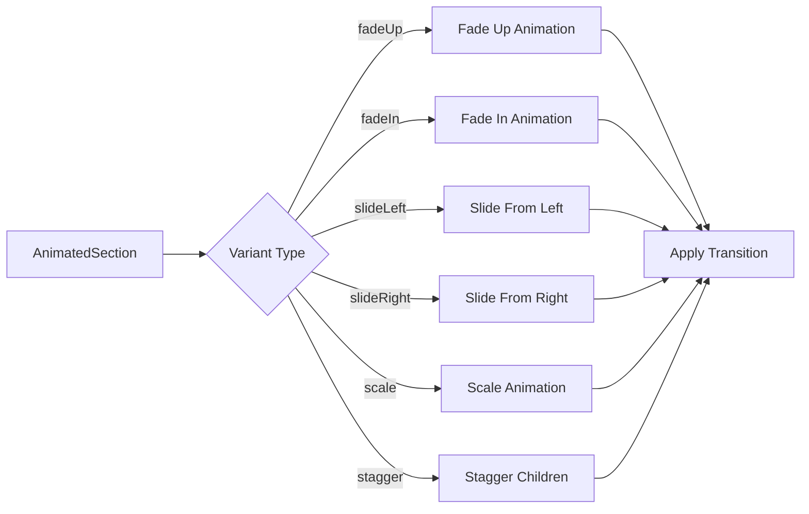

**Diagram sources**
- [AnimatedSection.tsx](file://src/components/AnimatedSection.tsx#L13-L42)

#### Performance Optimizations

The component implements several performance optimizations:

| Optimization | Implementation | Benefit |
|-------------|----------------|---------|
| **Will Change Property** | `willChange: transform, opacity` | GPU acceleration hint |
| **Viewport Intersection** | `viewport={{ once: true }}` | Lazy loading activation |
| **Stagger Children** | `staggerChildren` prop | Efficient list animations |
| **CSS Transform** | `transform: translateZ(0)` | Hardware acceleration |

**Section sources**
- [AnimatedSection.tsx](file://src/components/AnimatedSection.tsx#L1-L79)

### ScrollRevealSection Component

The ScrollRevealSection component creates immersive scroll-triggered animations with parallax effects and smooth transitions.

#### Scroll-Based Animations

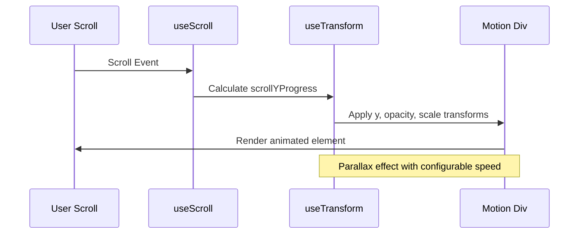

**Diagram sources**
- [ScrollRevealSection.tsx](file://src/components/ScrollRevealSection.tsx#L18-L26)

**Section sources**
- [ScrollRevealSection.tsx](file://src/components/ScrollRevealSection.tsx#L1-L44)

## Animation System

The animation system is built around Framer Motion with a comprehensive set of reusable variants and performance-optimized animations.

### Animation Library Structure

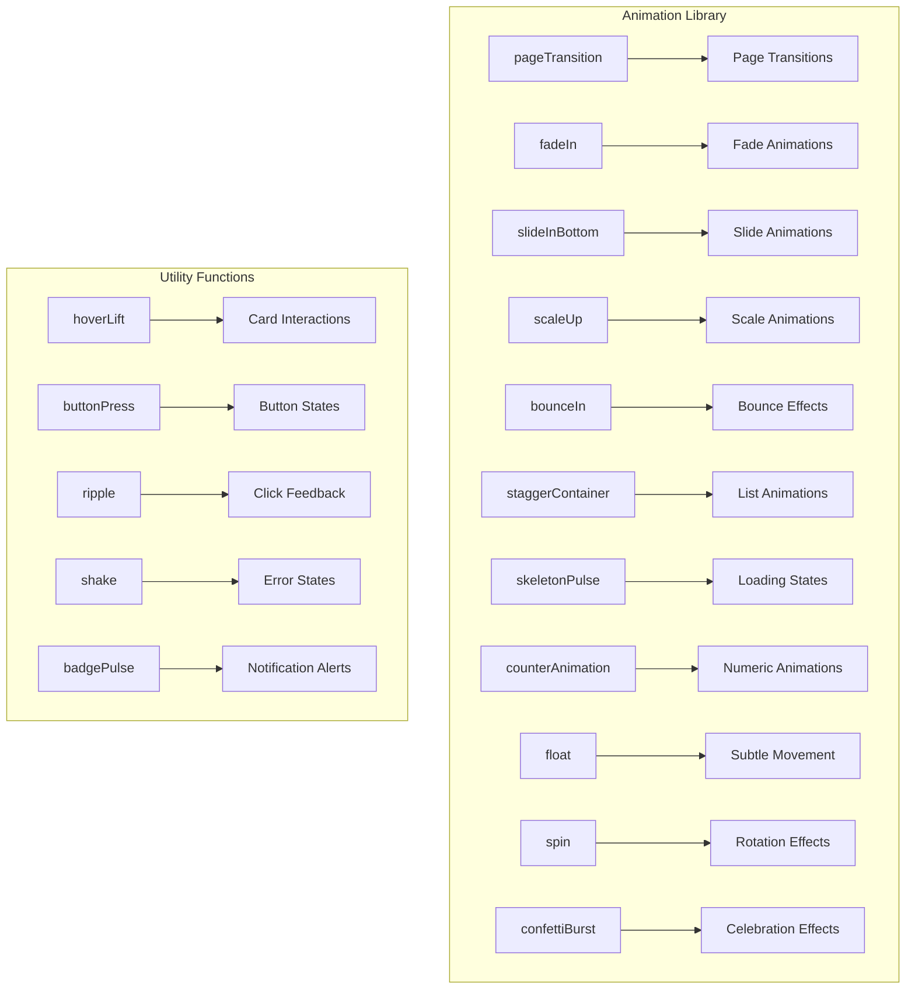

**Diagram sources**
- [animations.ts](file://src/lib/animations.ts#L1-L281)

### Performance Optimization Strategies

The animation system implements several performance optimization techniques:

| Strategy | Implementation | Impact |
|----------|----------------|--------|
| **Hardware Acceleration** | `willChange: transform` | GPU utilization |
| **Transform Optimization** | `transform: translateZ(0)` | Smooth animations |
| **Stagger Efficiency** | `staggerChildren` property | Reduced DOM manipulation |
| **Viewport Awareness** | `viewport={{ once: true }}` | Lazy loading |
| **Spring Physics** | `type: 'spring'` | Natural motion curves |

**Section sources**
- [animations.ts](file://src/lib/animations.ts#L1-L281)

## Design System Integration

The components integrate seamlessly with the shadcn/ui design system while maintaining brand consistency through custom design tokens.

### Design Token System

The design system provides comprehensive theming capabilities:

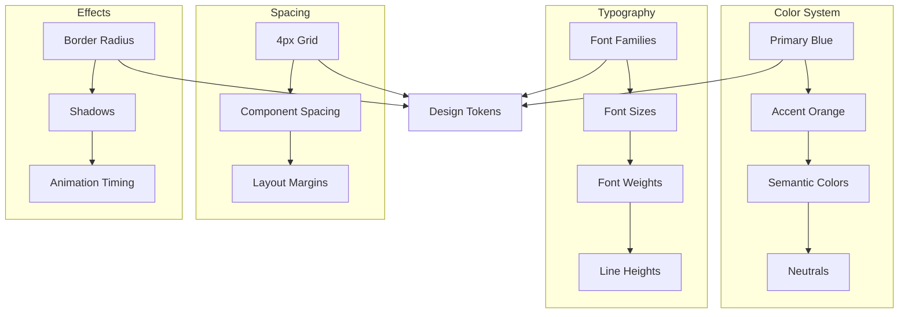

**Diagram sources**
- [designTokens.ts](file://src/lib/designTokens.ts#L6-L201)

### Component Theming

Each component leverages the design token system for consistent theming:

| Component | Theme Integration | Customization Options |
|-----------|------------------|----------------------|
| **Card** | `bg-card`, `border-border` | Shadow, padding, border radius |
| **Button** | `bg-primary`, `text-primary-foreground` | Variants, sizes, states |
| **Badge** | `bg-primary`, `text-primary-foreground` | Variants, border styles |
| **StatCard** | Gradient backgrounds, themed icons | Color themes, animation timing |

**Section sources**
- [designTokens.ts](file://src/lib/designTokens.ts#L1-L205)

## Performance Optimization

The component library implements multiple performance optimization strategies to ensure smooth user experiences across various devices and network conditions.

### Rendering Optimizations

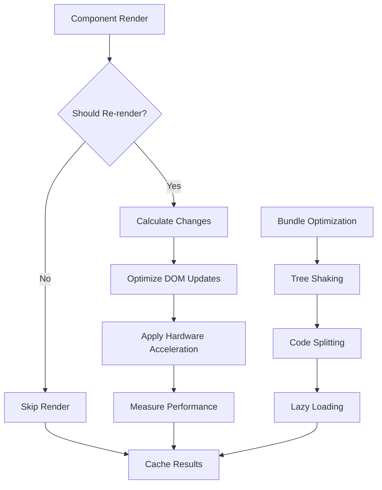

### Performance Metrics

| Metric | Target | Implementation |
|--------|--------|----------------|
| **First Contentful Paint** | < 1.5s | Bundle splitting, lazy loading |
| **Largest Contentful Paint** | < 2.5s | Optimized images, efficient animations |
| **Cumulative Layout Shift** | < 0.1 | Fixed dimensions, preloaded fonts |
| **Interaction to Next Paint** | < 100ms | Debounced events, optimized handlers |

## Responsive Design

The components implement a mobile-first responsive design strategy with flexible layouts and adaptive animations.

### Breakpoint System

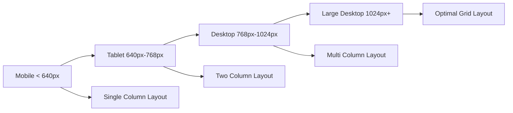

### Adaptive Behavior

| Component | Mobile Behavior | Desktop Behavior |
|-----------|----------------|------------------|
| **LoopTraceFeatures** | Stacked steps, simplified timeline | Grid layout with full animations |
| **StatCard** | Compact cards, reduced spacing | Full-sized cards with hover effects |
| **ProgressRing** | Fixed size, centered | Responsive sizing with container adaptation |
| **AnimatedSection** | Reduced animation intensity | Full animation suite |

## Integration Patterns

The components follow established integration patterns that promote reusability and maintainability.

### Pattern: Composition Over Inheritance

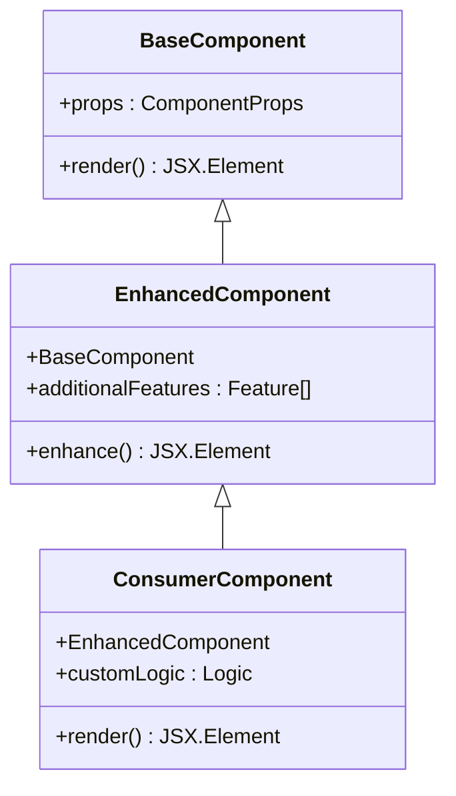

### Pattern: Provider-Consumer

The components utilize React Context for global state management:

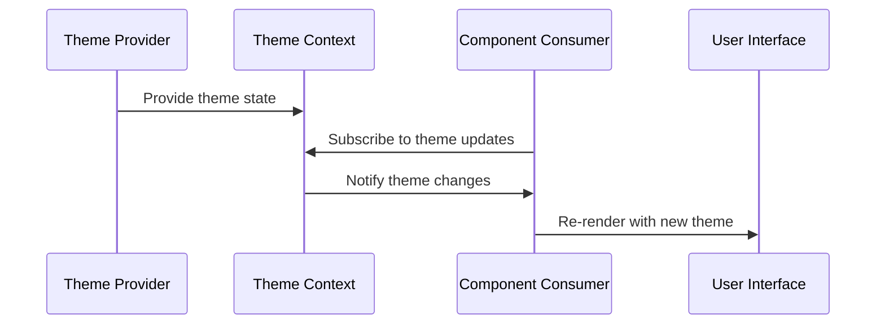

**Section sources**
- [Index.tsx](file://src/pages/Index.tsx#L28-L111)

## Best Practices

### Component Development Guidelines

1. **Type Safety**: Always use TypeScript interfaces for props
2. **Accessibility**: Implement ARIA attributes and keyboard navigation
3. **Performance**: Use memoization for expensive calculations
4. **Testing**: Write unit tests for complex logic
5. **Documentation**: Provide comprehensive prop documentation

### Animation Guidelines

1. **Performance**: Use hardware acceleration where possible
2. **Accessibility**: Respect motion preferences
3. **Consistency**: Maintain consistent timing and easing
4. **Progressive Enhancement**: Graceful degradation for older browsers

### Design System Guidelines

1. **Consistency**: Follow established design tokens
2. **Flexibility**: Allow customization through props
3. **Maintainability**: Centralize theme definitions
4. **Scalability**: Plan for future design system expansion

## Troubleshooting Guide

### Common Issues and Solutions

| Issue | Symptoms | Solution |
|-------|----------|----------|
| **Animation Lag** | Choppy animations, dropped frames | Reduce animation complexity, enable hardware acceleration |
| **Layout Shifts** | Elements moving during load | Use fixed dimensions, preload critical assets |
| **Theme Inconsistency** | Mixed color schemes | Verify design token usage, check provider setup |
| **Performance Degradation** | Slow rendering, memory leaks | Implement proper cleanup, optimize render cycles |

### Debugging Tools

1. **React DevTools**: Inspect component tree and props
2. **Framer Motion Debug**: Enable debug mode for animation insights
3. **Performance Monitor**: Track rendering performance metrics
4. **Console Logging**: Add strategic logging for state changes

### Optimization Checklist

- [ ] Enable tree shaking for unused animations
- [ ] Implement proper cleanup in useEffect hooks
- [ ] Use React.memo for pure components
- [ ] Optimize image assets and lazy load when appropriate
- [ ] Monitor bundle size and split large components
- [ ] Test on various devices and network conditions