# Data Display Components

<cite>
**Referenced Files in This Document**
- [StatCard.tsx](file://src/components/modern/StatCard.tsx)
- [ProgressRing.tsx](file://src/components/modern/ProgressRing.tsx)
- [StatsCounter.tsx](file://src/components/home/StatsCounter.tsx)
- [PricingSavingsCard.tsx](file://src/components/aggregation/PricingSavingsCard.tsx)
- [PriceComparison.tsx](file://src/components/quote/PriceComparison.tsx)
- [animations.ts](file://src/lib/animations.ts)
- [designTokens.ts](file://src/lib/designTokens.ts)
- [DashboardAnalytics.tsx](file://src/components/admin/DashboardAnalytics.tsx)
- [useRealtimeMessages.ts](file://src/hooks/useRealtimeMessages.ts)
- [useOptimisticUpdate.ts](file://src/hooks/useOptimisticUpdate.ts)
- [card.tsx](file://src/components/ui/card.tsx)
</cite>

## Table of Contents
1. [Introduction](#introduction)
2. [Component Architecture Overview](#component-architecture-overview)
3. [Core Data Display Components](#core-data-display-components)
4. [Animation and Interaction Systems](#animation-and-interaction-systems)
5. [Theming and Design System](#theming-and-design-system)
6. [Real-time Data Integration](#real-time-data-integration)
7. [Responsive Layout Patterns](#responsive-layout-patterns)
8. [Accessibility Implementation](#accessibility-implementation)
9. [Performance Optimization](#performance-optimization)
10. [Usage Patterns and Best Practices](#usage-patterns-and-best-practices)

## Introduction

The sleekapp-v100 data display components form a sophisticated ecosystem designed to present key performance metrics, financial savings, and production efficiency data in elegant, interactive dashboards. These components leverage modern React patterns, Framer Motion animations, and a comprehensive design system to create engaging user experiences for business intelligence and operational monitoring.

The component suite includes specialized displays for statistics (StatCard), progress visualization (ProgressRing), animated counters (StatsCounter), financial comparisons (PricingSavingsCard, PriceComparison), and real-time data updates through React Query integration.

## Component Architecture Overview

The data display components follow a modular architecture with clear separation of concerns:

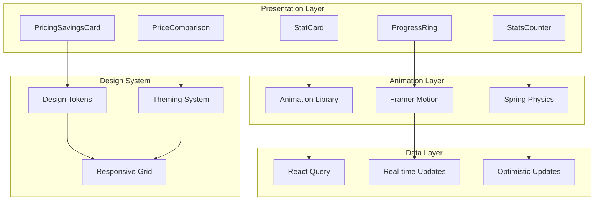

**Diagram sources**
- [StatCard.tsx](file://src/components/modern/StatCard.tsx#L1-L111)
- [ProgressRing.tsx](file://src/components/modern/ProgressRing.tsx#L1-L96)
- [animations.ts](file://src/lib/animations.ts#L1-L281)
- [designTokens.ts](file://src/lib/designTokens.ts#L1-L205)

## Core Data Display Components

### StatCard Component

The StatCard component serves as the primary metric display for key performance indicators, featuring animated number transitions, trend indicators, and contextual icons.

#### Props Interface and Implementation

The StatCard accepts comprehensive props for flexible data presentation:

| Prop | Type | Description | Default |
|------|------|-------------|---------|
| `title` | `string` | Metric label displayed above value | Required |
| `value` | `string \| number` | Primary metric value with animation | Required |
| `change` | `{value: number, label: string}` | Percentage change with direction | Optional |
| `icon` | `LucideIcon` | Visual indicator icon | Required |
| `trend` | `'up' \| 'down' \| 'neutral'` | Direction of change | `'neutral'` |
| `color` | `'primary' \| 'accent' \| 'success' \| 'warning' \| 'error'` | Theme color | `'primary'` |
| `onClick` | `() => void` | Click handler for interactivity | Optional |

#### Animation and Interaction Features

The component implements sophisticated animations using Framer Motion:

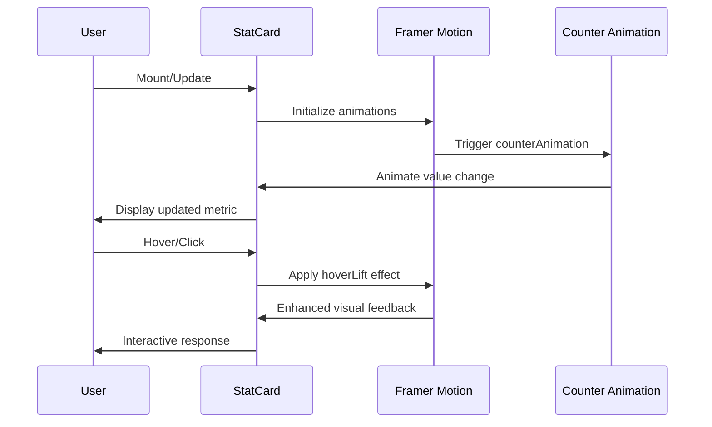

**Diagram sources**
- [StatCard.tsx](file://src/components/modern/StatCard.tsx#L44-L110)
- [animations.ts](file://src/lib/animations.ts#L150-L175)

**Section sources**
- [StatCard.tsx](file://src/components/modern/StatCard.tsx#L7-L18)
- [StatCard.tsx](file://src/components/modern/StatCard.tsx#L34-L110)

### ProgressRing Component

The ProgressRing provides circular progress visualization with customizable appearance and smooth animations.

#### Configuration Options

| Prop | Type | Description | Default |
|------|------|-------------|---------|
| `progress` | `number` | Progress value (0-100) | Required |
| `size` | `number` | Diameter in pixels | `120` |
| `strokeWidth` | `number` | Stroke thickness | `8` |
| `color` | `'primary' \| 'accent' \| 'success' \| 'warning' \| 'error'` | Progress color | `'primary'` |
| `showPercentage` | `boolean` | Display percentage text | `true` |
| `label` | `string` | Additional label text | Optional |

#### SVG Animation Implementation

The ProgressRing uses SVG circle elements with Framer Motion for smooth progress transitions:

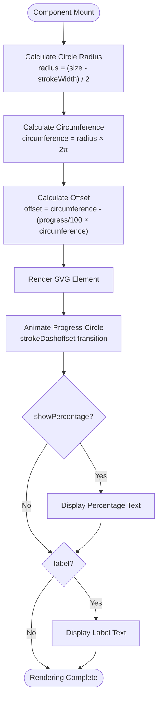

**Diagram sources**
- [ProgressRing.tsx](file://src/components/modern/ProgressRing.tsx#L31-L67)

**Section sources**
- [ProgressRing.tsx](file://src/components/modern/ProgressRing.tsx#L4-L12)
- [ProgressRing.tsx](file://src/components/modern/ProgressRing.tsx#L22-L96)

### StatsCounter Component

The StatsCounter provides animated number counting with spring physics for engaging numeric displays.

#### Counter Animation System

The component uses Framer Motion's useMotionValue and useSpring hooks for realistic physics-based animations:

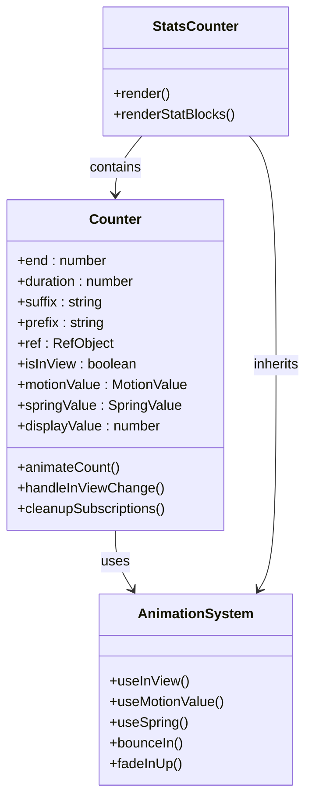

**Diagram sources**
- [StatsCounter.tsx](file://src/components/home/StatsCounter.tsx#L12-L42)
- [animations.ts](file://src/lib/animations.ts#L96-L109)

**Section sources**
- [StatsCounter.tsx](file://src/components/home/StatsCounter.tsx#L1-L152)

### PricingSavingsCard Component

The PricingSavingsCard specializes in financial comparison visualization, showing cost savings through aggregated production.

#### Financial Calculation Logic

The component performs real-time calculations for savings visualization:

| Metric | Formula | Purpose |
|--------|---------|---------|
| `savingsPerUnit` | `soloPrice - aggregatedPrice` | Per-unit cost difference |
| `totalSavings` | `savingsPerUnit × quantity` | Total monetary savings |
| `savingsPercentage` | `(savingsPerUnit / soloPrice) × 100` | Percentage savings |

#### Visual Comparison Structure

```mermaid
graph LR
subgraph "Pricing Comparison"
Solo[Solo Order<br/>${soloPrice}/pc<br/>${soloPrice×qty} total]
Agg[Aggregated Order<br/>${aggPrice}/pc<br/>${aggPrice×qty} total]
Savings[You Save<br/>${totalSavings}<br/>${savings%}% savings]
end
Solo -.->|line-through| Agg
Agg -.->|highlighted| Savings
```

**Diagram sources**
- [PricingSavingsCard.tsx](file://src/components/aggregation/PricingSavingsCard.tsx#L18-L20)
- [PricingSavingsCard.tsx](file://src/components/aggregation/PricingSavingsCard.tsx#L22-L87)

**Section sources**
- [PricingSavingsCard.tsx](file://src/components/aggregation/PricingSavingsCard.tsx#L1-L87)

### PriceComparison Component

The PriceComparison component provides comparative pricing visualization across different manufacturing locations.

#### Comparative Analysis Features

The component compares prices against US and China manufacturing benchmarks:

| Location | Multiplier | Quality Level | Premium Factor |
|----------|------------|---------------|----------------|
| US Manufacturers | 1.8x | Premium | Higher lead times |
| China Competitors | 1.3x | Standard | Lower quality risk |
| Sleek Apparels | 1.0x | Consistent | Best value proposition |

**Section sources**
- [PriceComparison.tsx](file://src/components/quote/PriceComparison.tsx#L1-L124)

## Animation and Interaction Systems

### Framer Motion Integration

The components extensively use Framer Motion for smooth, performant animations:

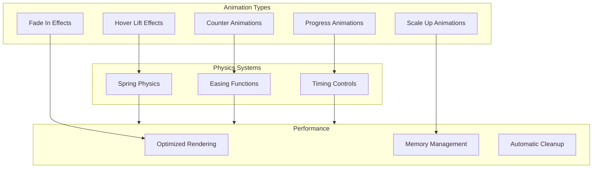

**Diagram sources**
- [animations.ts](file://src/lib/animations.ts#L178-L185)
- [animations.ts](file://src/lib/animations.ts#L151-L157)

### Animation Configuration

The animation library provides reusable variants for consistent behavior:

| Animation | Duration | Easing | Use Case |
|-----------|----------|--------|----------|
| `hoverLift` | 0.2s | Ease | Card hover effects |
| `counterAnimation` | 0.5s | Ease | Number transitions |
| `pageTransition` | 0.4s | EaseInOut | Page navigation |
| `fadeIn` | 0.3s | Linear | Element appearance |

**Section sources**
- [animations.ts](file://src/lib/animations.ts#L1-L281)

## Theming and Design System

### Design Token Architecture

The design system provides comprehensive theming through structured design tokens:

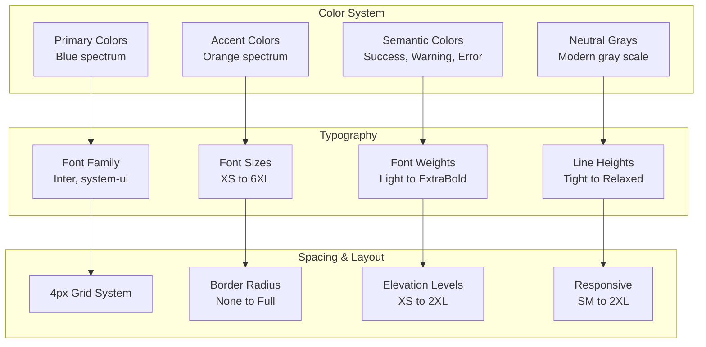

**Diagram sources**
- [designTokens.ts](file://src/lib/designTokens.ts#L8-L81)
- [designTokens.ts](file://src/lib/designTokens.ts#L85-L119)

### Color Palette Implementation

The components utilize the design system's color palette for consistent theming:

| Category | Colors | Usage |
|----------|--------|-------|
| Primary | `#3b82f6` (500), `#2563eb` (600) | Main brand color |
| Success | `#10b981` (500), `#059669` (600) | Positive indicators |
| Warning | `#f59e0b` (500), `#d97706` (600) | Cautionary elements |
| Error | `#ef4444` (500), `#dc2626` (600) | Error states |
| Accent | `#f97316` (500), `#ea580c` (600) | Secondary brand color |

**Section sources**
- [designTokens.ts](file://src/lib/designTokens.ts#L1-L205)

## Real-time Data Integration

### React Query Integration

The components integrate seamlessly with React Query for efficient data fetching and caching:

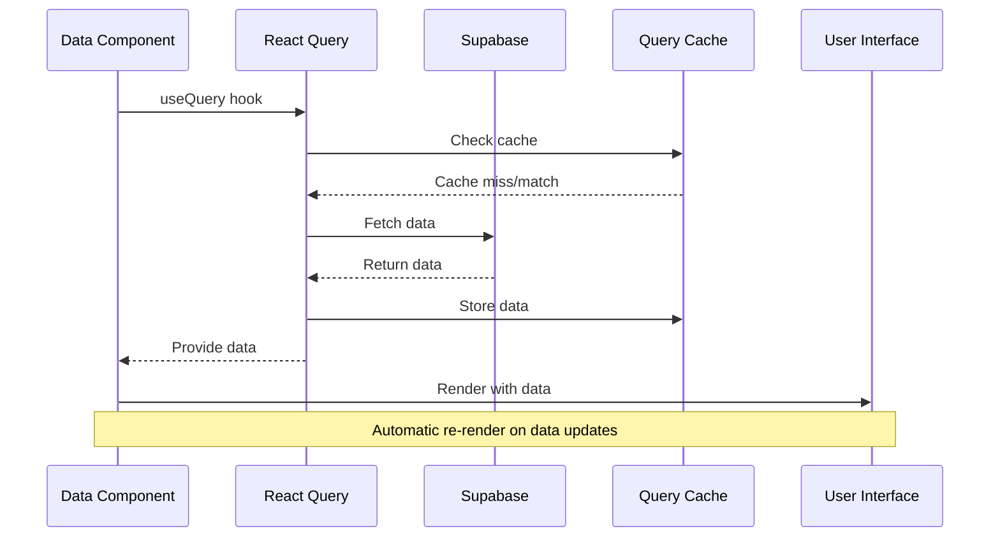

**Diagram sources**
- [DashboardAnalytics.tsx](file://src/components/admin/DashboardAnalytics.tsx#L100-L139)

### Real-time Messaging System

The application includes a real-time messaging system for immediate data updates:

**Section sources**
- [useRealtimeMessages.ts](file://src/hooks/useRealtimeMessages.ts#L1-L61)
- [DashboardAnalytics.tsx](file://src/components/admin/DashboardAnalytics.tsx#L100-L139)

### Optimistic Updates

The useOptimisticUpdate hook provides seamless user experience during data modifications:

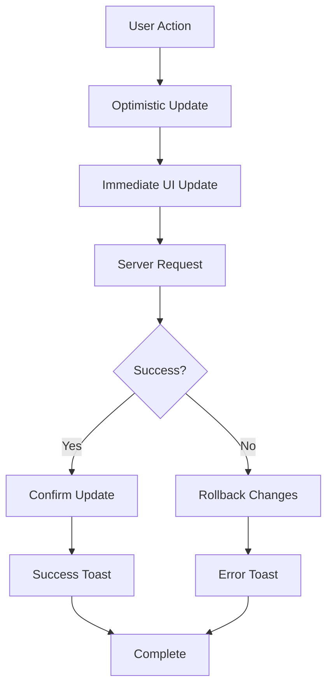

**Diagram sources**
- [useOptimisticUpdate.ts](file://src/hooks/useOptimisticUpdate.ts#L26-L66)

**Section sources**
- [useOptimisticUpdate.ts](file://src/hooks/useOptimisticUpdate.ts#L1-L176)

## Responsive Layout Patterns

### Grid System Implementation

The components utilize Tailwind CSS grid system for responsive layouts:

| Breakpoint | Width | Columns | Usage |
|------------|-------|---------|-------|
| SM | 640px | 1 | Mobile portrait |
| MD | 768px | 2 | Tablet landscape |
| LG | 1024px | 3-4 | Desktop |
| XL | 1280px | 4-6 | Large screens |
| 2XL | 1536px | 6+ | Ultra-wide displays |

### Card Layout Patterns

Common layout patterns for data display cards:

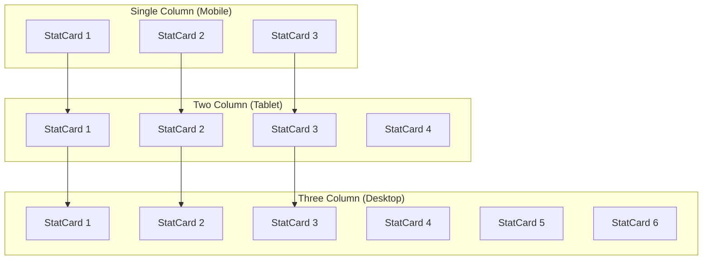

**Section sources**
- [DashboardAnalytics.tsx](file://src/components/admin/DashboardAnalytics.tsx#L1-L200)

## Accessibility Implementation

### Semantic HTML Structure

Components follow semantic HTML patterns for accessibility:

| Component | Semantic Elements | ARIA Roles |
|-----------|-------------------|------------|
| StatCard | `div`, `p`, `span` | `button` role for clickable cards |
| ProgressRing | `svg`, `circle`, `text` | `img` role with `aria-label` |
| PricingCard | `article`, `section` | `region` for content areas |
| PriceComparison | `table`, `th`, `td` | `table` semantics preserved |

### Screen Reader Support

The components include comprehensive screen reader support:

- **ProgressRing**: Includes `aria-label` with percentage and description
- **StatCard**: Provides `aria-label` for metric context
- **PricingCard**: Uses `aria-describedby` for detailed explanations
- **PriceComparison**: Maintains table semantics for assistive technologies

### Keyboard Navigation

All interactive components support keyboard navigation:

- **Focus Management**: Proper focus order and visible focus indicators
- **Keyboard Shortcuts**: Tab navigation and Enter/Space activation
- **Skip Links**: Available for complex dashboard navigation

**Section sources**
- [card.tsx](file://src/components/ui/card.tsx#L1-L44)

## Performance Optimization

### Animation Performance

The animation system prioritizes performance through several optimizations:

| Technique | Implementation | Benefit |
|-----------|----------------|---------|
| Hardware Acceleration | CSS transforms only | GPU acceleration |
| Motion Value Caching | Single motion value per counter | Reduced memory usage |
| Automatic Cleanup | Framer Motion lifecycle | Prevents memory leaks |
| Optimized Transitions | Custom easing functions | Smooth performance |

### Data Fetching Optimization

React Query integration provides several performance benefits:

- **Automatic Caching**: Prevents redundant network requests
- **Background Updates**: Keeps UI responsive during data refresh
- **Selective Revalidation**: Updates only affected components
- **Query Deduplication**: Prevents duplicate simultaneous requests

### Bundle Size Optimization

The component library minimizes bundle size through:

- **Tree Shaking**: Only exported components are included
- **Lazy Loading**: Non-critical components loaded on demand
- **Code Splitting**: Dynamic imports for heavy dependencies
- **Minification**: Production builds optimize file sizes

## Usage Patterns and Best Practices

### Dashboard Layout Integration

Common patterns for integrating data display components in dashboards:

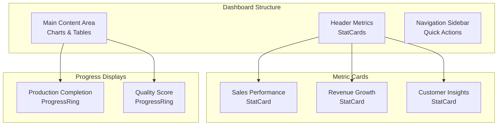

### Data Visualization Guidelines

Best practices for effective data display:

1. **Consistent Color Coding**: Use semantic colors for trends and states
2. **Clear Labeling**: Include units and time periods in metric labels
3. **Progressive Disclosure**: Show detailed views on interaction
4. **Responsive Design**: Adapt layouts for different screen sizes
5. **Accessibility First**: Ensure all components meet WCAG guidelines

### Performance Monitoring

Recommended approaches for monitoring component performance:

- **React DevTools Profiler**: Monitor rendering performance
- **Lighthouse**: Audit accessibility and performance
- **Bundle Analyzer**: Track bundle size growth
- **React Query DevTools**: Monitor query performance and cache effectiveness

### Error Handling Patterns

Robust error handling for data display components:

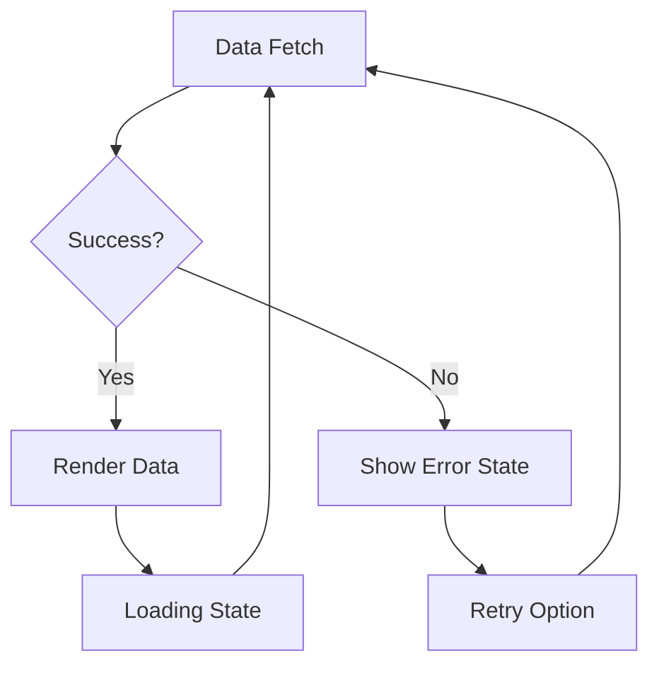

**Section sources**
- [DashboardAnalytics.tsx](file://src/components/admin/DashboardAnalytics.tsx#L100-L139)