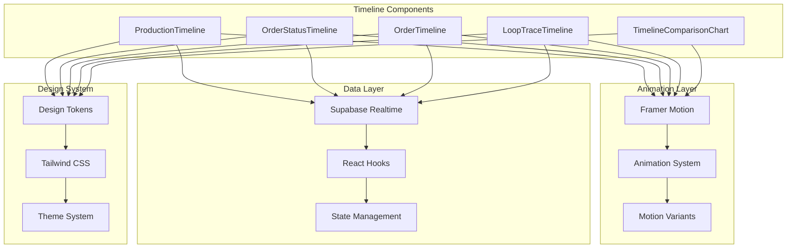
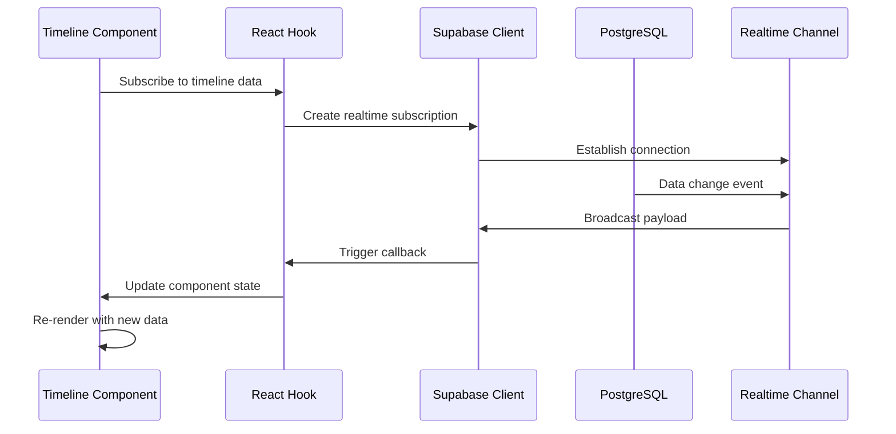

# Timeline Visualization Components

<cite>
**Referenced Files in This Document**
- [ProductionTimeline.tsx](file://src/components/ProductionTimeline.tsx)
- [OrderStatusTimeline.tsx](file://src/components/OrderStatusTimeline.tsx)
- [OrderTimeline.tsx](file://src/components/OrderTimeline.tsx)
- [LoopTraceTimeline.tsx](file://src/components/modern/LoopTraceTimeline.tsx)
- [TimelineComparisonChart.tsx](file://src/components/infographics/TimelineComparisonChart.tsx)
- [animations.ts](file://src/lib/animations.ts)
- [designTokens.ts](file://src/lib/designTokens.ts)
- [use-mobile.tsx](file://src/hooks/use-mobile.tsx)
- [ProductionTracking.tsx](file://src/pages/ProductionTracking.tsx)
</cite>

## Table of Contents
1. [Introduction](#introduction)
2. [Component Architecture Overview](#component-architecture-overview)
3. [Core Timeline Components](#core-timeline-components)
4. [Advanced Timeline Features](#advanced-timeline-features)
5. [Integration with Supabase Realtime](#integration-with-supabase-realtime)
6. [Framer Motion Animation System](#framer-motion-animation-system)
7. [Responsive Design Implementation](#responsive-design-implementation)
8. [Accessibility Considerations](#accessibility-considerations)
9. [Performance Optimization](#performance-optimization)
10. [Customization and Theming](#customization-and-theming)
11. [Usage Examples and Best Practices](#usage-examples-and-best-practices)
12. [Troubleshooting Guide](#troubleshooting-guide)

## Introduction

The sleekapp-v100 timeline visualization system provides comprehensive production tracking and order management capabilities through five distinct timeline components. These components leverage modern web technologies including Framer Motion for smooth animations, Supabase for real-time data synchronization, and Tailwind CSS for responsive design. The system enables stakeholders to monitor production stages, track order progress, compare timelines, and receive real-time updates with visual feedback.

## Component Architecture Overview

The timeline visualization system follows a modular architecture with clear separation of concerns:



**Diagram sources**
- [animations.ts](file://src/lib/animations.ts#L1-L281)
- [designTokens.ts](file://src/lib/designTokens.ts#L1-L205)

## Core Timeline Components

### ProductionTimeline Component

The ProductionTimeline component provides a comprehensive view of manufacturing stages with status indicators and completion percentages.

#### Props Interface
```typescript
interface ProductionTimelineProps {
  currentStage: ProductionStage;
  stageProgress: Record<ProductionStage, number>;
}

type ProductionStage = 
  | "yarn_received"
  | "knitting"
  | "linking"
  | "washing_finishing"
  | "final_qc"
  | "packing"
  | "ready_to_ship";
```

#### Component Structure
The component renders a vertical timeline with seven production stages, each displaying:
- Status indicator circles with appropriate colors
- Progress bars for in-progress stages
- Completion badges with percentage values
- Visual feedback through animations

#### Status Management
The `getStageStatus` function determines the visual state of each stage based on the current production stage and progress percentage.

**Section sources**
- [ProductionTimeline.tsx](file://src/components/ProductionTimeline.tsx#L1-L128)

### OrderStatusTimeline Component

This component tracks the complete lifecycle of an order from quote request to delivery.

#### Props Interface
```typescript
interface OrderStatusTimelineProps {
  currentStatus: string;
  history?: TimelineEvent[];
}

interface TimelineEvent {
  status: string;
  timestamp?: string;
  notes?: string;
}
```

#### Timeline Stages
The component defines 14 standard stages in the order fulfillment process:
- Quote Request → Quote Sent → Admin Review → Awaiting Payment
- Payment Received → Assigned to Supplier → Sample Requested → Sample Approved
- Bulk Production → QC Inspection → Ready to Ship → Shipped → Delivered → Completed

#### Event History Integration
The component supports historical data display with timestamps and notes for each completed stage.

**Section sources**
- [OrderStatusTimeline.tsx](file://src/components/OrderStatusTimeline.tsx#L1-L76)

### OrderTimeline Component

A simplified timeline focused on key order milestones with timestamp tracking.

#### Props Interface
```typescript
interface OrderTimelineProps {
  status: string;
  createdAt: string;
  updatedAt: string;
}
```

#### Timeline Items
The component displays six major milestones:
- Pending → Confirmed → In Production → Quality Check → Shipped → Delivered

#### Timestamp Management
Each timeline item includes creation and update timestamps for accurate temporal tracking.

**Section sources**
- [OrderTimeline.tsx](file://src/components/OrderTimeline.tsx#L1-L73)

## Advanced Timeline Features

### LoopTraceTimeline Component

The LoopTraceTimeline represents the flagship timeline component with advanced features including photo galleries, delay detection, and AI predictions.

#### Advanced Props Interface
```typescript
interface LoopTraceTimelineProps {
  orderId: string;
  productName: string;
  quantity: number;
  supplier: string;
  stages: TimelineStage[];
  overallProgress: number;
}

interface TimelineStage {
  id: string;
  name: string;
  status: 'completed' | 'in-progress' | 'pending';
  completedDate?: string;
  estimatedDate?: string;
  photos?: string[];
  notes?: string;
  delay?: {
    days: number;
    reason: string;
  };
}
```

#### Key Features
- **Expandable Stages**: Click to reveal detailed information
- **Photo Galleries**: Interactive image viewing with lightbox
- **Delay Detection**: Visual alerts for production delays
- **AI Predictions**: Confidence-based delivery estimates
- **Gradient Progress Bars**: Dynamic visual progress indication

#### Animation System Integration
The component leverages Framer Motion for sophisticated animations including:
- Staggered item entrance animations
- Smooth scaling transitions
- Pulse animations for active elements
- Lightbox photo gallery effects

**Section sources**
- [LoopTraceTimeline.tsx](file://src/components/modern/LoopTraceTimeline.tsx#L1-L350)

### TimelineComparisonChart Component

This infographic component provides comparative analysis between traditional manufacturing and LoopTrace™ processes.

#### Props Interface
```typescript
interface TimelineComparisonChartProps {
  className?: string;
  showLoopTraceIndicators?: boolean;
}
```

#### Comparative Data Model
The component compares two manufacturing approaches across six key stages:
- Sampling (5 vs 14 days)
- Fabric Sourcing (3 vs 21 days)
- Production (12 vs 35 days)
- Quality Control (2 vs 7 days)
- Finishing (2 vs 5 days)
- Shipping (1 vs 8 days)

#### Visual Elements
- Side-by-side comparisons with gradient bars
- Speed improvement metrics (typically 3x faster)
- Feature highlights for each approach
- Interactive timeline visualization

**Section sources**
- [TimelineComparisonChart.tsx](file://src/components/infographics/TimelineComparisonChart.tsx#L1-L306)

## Integration with Supabase Realtime

The timeline components integrate seamlessly with Supabase's real-time capabilities for live data updates.

### Real-time Subscription Patterns

#### Production Updates Subscription
```typescript
const channel = supabase
  .channel(`production-updates-${orderId}`)
  .on('postgres_changes', {
    event: '*',
    schema: 'public',
    table: 'production_stages',
    filter: `supplier_order_id=eq.${selectedOrder.id}`
  }, (payload) => {
    // Handle real-time updates
    fetchUserAndOrders();
  })
  .subscribe();
```

#### Message System Integration
The timeline components support real-time messaging through Supabase channels for production notifications and updates.

### Data Flow Architecture



**Diagram sources**
- [ProductionTracking.tsx](file://src/pages/ProductionTracking.tsx#L63-L88)

**Section sources**
- [ProductionTracking.tsx](file://src/pages/ProductionTracking.tsx#L63-L88)

## Framer Motion Animation System

The timeline components utilize a comprehensive animation system built on Framer Motion for smooth, performant transitions.

### Animation Variants

#### Staggered Animations
```typescript
// Container animation for lists
export const staggerContainer: Variants = {
  animate: {
    transition: {
      staggerChildren: 0.1,
    },
  },
};

// Individual item animation
export const staggerItem: Variants = {
  initial: { opacity: 0, y: 20 },
  animate: { 
    opacity: 1, 
    y: 0,
    transition: { duration: 0.4 }
  },
};
```

#### Progress Bar Animations
```typescript
// Dynamic progress fill animation
export const progressFill = (progress: number): Variants => ({
  initial: { width: 0 },
  animate: { 
    width: `${progress}%`,
    transition: { duration: 1, ease: [0.4, 0, 0.2, 1] }
  },
});
```

### Animation Integration Patterns

#### LoopTraceTimeline Animations
- **Scale Up**: Modal and card entrance animations
- **Pulse Effects**: Active stage indicators
- **Spin Animations**: Loading and progress indicators
- **Lightbox Transitions**: Photo gallery interactions

#### Timeline Comparison Animations
- **Gantt-style Bar Animations**: Duration-based timeline visualization
- **Fade In Effects**: Progressive content revelation
- **Gradient Animations**: Dynamic progress indicators

**Section sources**
- [animations.ts](file://src/lib/animations.ts#L1-L281)

## Responsive Design Implementation

The timeline components implement a mobile-first responsive design strategy with breakpoint-aware layouts.

### Breakpoint System
Based on the design tokens system, the application uses standard Tailwind CSS breakpoints:
- **sm**: 640px - Small tablets
- **md**: 768px - Tablets
- **lg**: 1024px - Desktop
- **xl**: 1280px - Large desktops
- **2xl**: 1536px - Extra large screens

### Responsive Layout Patterns

#### Mobile Adaptations
- **Vertical Timeline**: Stages stack vertically on small screens
- **Touch-friendly Interactions**: Larger tap targets and swipe gestures
- **Collapsed Information**: Expandable panels for detailed content

#### Tablet Optimizations
- **Hybrid Layouts**: Flexible column arrangements
- **Improved Readability**: Optimized typography and spacing
- **Enhanced Navigation**: Improved touch navigation patterns

#### Desktop Features
- **Multi-column Layouts**: Parallel timeline views
- **Advanced Interactions**: Hover states and complex animations
- **Full Feature Sets**: Complete functionality suite

### Mobile Detection Hook
```typescript
const useIsMobile = () => {
  const [isMobile, setIsMobile] = useState<boolean>(() => {
    if (typeof window !== 'undefined') {
      return window.innerWidth < 768;
    }
    return false;
  });
  
  useEffect(() => {
    const mql = window.matchMedia('(max-width: 767px)');
    const onChange = () => setIsMobile(window.innerWidth < 768);
    setIsMobile(window.innerWidth < 768);
    mql.addEventListener('change', onChange);
    return () => mql.removeEventListener('change', onChange);
  }, []);
  
  return isMobile;
};
```

**Section sources**
- [use-mobile.tsx](file://src/hooks/use-mobile.tsx#L1-L31)

## Accessibility Considerations

The timeline components implement comprehensive accessibility features to ensure usability for all users.

### Screen Reader Support

#### Semantic HTML Structure
- Proper heading hierarchies for content organization
- Descriptive labels for interactive elements
- Logical tab order for keyboard navigation

#### ARIA Attributes
- Role attributes for complex interactive elements
- Live regions for real-time updates
- Hidden states for collapsed content

### Keyboard Navigation

#### Focus Management
- Visible focus indicators for all interactive elements
- Logical focus progression through timeline stages
- Escape key support for modal interactions

#### Keyboard Shortcuts
- Arrow keys for navigating between timeline items
- Enter/Space for activating interactive elements
- Tab for moving between different timeline sections

### Visual Accessibility

#### Color Contrast
The design system ensures WCAG AA compliance with:
- Minimum 4.5:1 contrast ratio for normal text
- Enhanced contrast for interactive elements
- Color-independent status indicators

#### Motion Preferences
- Reduced motion support through prefers-reduced-motion media queries
- Optional animation controls for user preference
- Alternative visual indicators for motion-sensitive users

## Performance Optimization

The timeline components implement several performance optimization techniques for smooth rendering and efficient resource utilization.

### Virtualization Strategies

#### Long Timeline Handling
For timelines with numerous stages or extensive history:
- **Windowed Rendering**: Only render visible timeline items
- **Lazy Loading**: Load detailed content on demand
- **Pagination**: Implement infinite scrolling for history views

#### Memory Management
- **Component Memoization**: Prevent unnecessary re-renders
- **Cleanup Functions**: Proper event listener removal
- **Resource Pooling**: Efficient DOM element reuse

### Animation Performance

#### Hardware Acceleration
- GPU-accelerated transforms for smooth animations
- Will-change properties for optimal rendering
- Efficient animation composition

#### Frame Rate Optimization
- RequestAnimationFrame for smooth timing
- Debounced resize handlers
- Efficient state update batching

### Data Loading Optimization

#### Efficient Queries
- Selective field retrieval from Supabase
- Proper indexing for timeline data
- Caching strategies for frequently accessed data

#### Loading States
- Skeleton loading patterns for improved perceived performance
- Progressive enhancement for complex features
- Graceful degradation for performance-critical paths

## Customization and Theming

The timeline components support extensive customization through the design tokens system and Tailwind CSS utilities.

### Design Token Integration

#### Color System
The design tokens provide a comprehensive color palette:
- **Primary Brand Colors**: LoopTrace™ blue spectrum
- **Semantic Colors**: Success, warning, error, info states
- **Neutral Grays**: Consistent grayscale scale
- **Accent Colors**: Energy orange for emphasis

#### Typography System
- **Font Family**: Inter for modern readability
- **Font Sizes**: Hierarchical scaling from 0.75rem to 6.125rem
- **Line Heights**: Optimized for readability across sizes
- **Font Weights**: Light through extra-bold variations

#### Spacing and Layout
- **4px Grid System**: Consistent spacing increments
- **Border Radius**: Multiple radius values for different contexts
- **Shadows**: Depth hierarchy for layered components
- **Breakpoints**: Mobile-first responsive design

### Tailwind CSS Integration

#### Utility-First Approach
Components leverage Tailwind's utility classes for:
- **Responsive Design**: Mobile-first breakpoint utilities
- **Flexbox Layout**: Flexible positioning and alignment
- **Animation Classes**: Built-in animation utilities
- **Color Utilities**: Dynamic color application

#### Custom Utility Classes
Additional utility classes for timeline-specific functionality:
- **Timeline Lines**: Custom border and connector styles
- **Status Badges**: Dynamic status indicator styling
- **Progress Indicators**: Gradient and animated progress bars

**Section sources**
- [designTokens.ts](file://src/lib/designTokens.ts#L1-L205)

## Usage Examples and Best Practices

### Basic Timeline Implementation

#### Production Timeline Example
```typescript
const productionData = {
  currentStage: "knitting",
  stageProgress: {
    yarn_received: 100,
    knitting: 65,
    linking: 30,
    washing_finishing: 0,
    final_qc: 0,
    packing: 0,
    ready_to_ship: 0
  }
};

return (
  <ProductionTimeline
    currentStage={productionData.currentStage}
    stageProgress={productionData.stageProgress}
  />
);
```

#### Order Status Timeline Example
```typescript
const orderHistory = [
  { status: "quote_requested", timestamp: "2024-01-15T10:00:00Z" },
  { status: "quote_sent", timestamp: "2024-01-15T14:30:00Z" },
  { status: "payment_received", timestamp: "2024-01-16T09:00:00Z" }
];

return (
  <OrderStatusTimeline
    currentStatus="ready_to_ship"
    history={orderHistory}
  />
);
```

### Advanced Implementation Patterns

#### Real-time Updates Integration
```typescript
const [timelineData, setTimelineData] = useState<TimelineData>();

useEffect(() => {
  const channel = supabase
    .channel('timeline-updates')
    .on('postgres_changes', {
      event: '*',
      schema: 'public',
      table: 'timeline_events',
      filter: `order_id=eq.${orderId}`
    }, (payload) => {
      setTimelineData(processTimelineUpdate(payload));
    })
    .subscribe();

  return () => {
    supabase.removeChannel(channel);
  };
}, [orderId]);
```

#### Custom Animation Configuration
```typescript
const customVariants = {
  container: {
    hidden: { opacity: 0 },
    visible: {
      opacity: 1,
      transition: {
        staggerChildren: 0.2,
        delayChildren: 0.3
      }
    }
  },
  item: {
    hidden: { y: 20, opacity: 0 },
    visible: { y: 0, opacity: 1 }
  }
};
```

### Performance Best Practices

#### Efficient State Management
- Use shallow equality checks for prop comparisons
- Implement proper cleanup in effect hooks
- Batch state updates when possible

#### Memory Leak Prevention
- Remove event listeners on component unmount
- Cancel ongoing requests in cleanup functions
- Use useCallback for expensive computations

#### Bundle Size Optimization
- Import only necessary Framer Motion features
- Use tree-shaking for unused animation variants
- Optimize image assets for timeline components

## Troubleshooting Guide

### Common Issues and Solutions

#### Animation Performance Problems

**Issue**: Timeline animations appear choppy or slow
**Solution**: 
- Verify hardware acceleration is enabled
- Reduce animation complexity for mobile devices
- Implement prefers-reduced-motion support
- Check for conflicting CSS transitions

#### Real-time Data Synchronization

**Issue**: Timeline updates not reflecting immediately
**Solution**:
- Verify Supabase subscription is properly established
- Check network connectivity and authentication
- Implement proper error handling for subscription failures
- Verify data schema matches subscription filters

#### Responsive Design Issues

**Issue**: Timeline layout breaks on smaller screens
**Solution**:
- Ensure mobile-first CSS is properly implemented
- Verify breakpoint values match design system
- Test with various device configurations
- Implement proper viewport meta tag

#### Accessibility Concerns

**Issue**: Screen reader users cannot navigate timeline
**Solution**:
- Add proper ARIA labels and roles
- Implement keyboard navigation support
- Ensure focus management works correctly
- Test with assistive technology tools

### Debugging Tools and Techniques

#### Development Tools
- Browser DevTools for animation inspection
- Network tab for real-time subscription monitoring
- Console logging for state changes
- React Developer Tools for component inspection

#### Testing Strategies
- Cross-browser testing for animation compatibility
- Mobile device testing for responsive behavior
- Accessibility testing with screen readers
- Performance profiling during timeline interactions

**Section sources**
- [ProductionTracking.tsx](file://src/pages/ProductionTracking.tsx#L85-L131)