# Dashboard & Analytics Components

<cite>
**Referenced Files in This Document**
- [DashboardAnalytics.tsx](file://src/components/admin/DashboardAnalytics.tsx)
- [FinancialChartsEnhanced.tsx](file://src/components/admin/FinancialChartsEnhanced.tsx)
- [ProductionAnalytics.tsx](file://src/components/production/ProductionAnalytics.tsx)
- [MarketResearchInsights.tsx](file://src/components/quote/MarketResearchInsights.tsx)
- [PriceComparison.tsx](file://src/components/quote/PriceComparison.tsx)
- [QuoteComparison.tsx](file://src/components/quote/QuoteComparison.tsx)
- [FinancialDashboard.tsx](file://src/components/supplier/FinancialDashboard.tsx)
- [SupplierPerformanceMetrics.tsx](file://src/components/supplier/SupplierPerformanceMetrics.tsx)
- [MOQComparisonChart.tsx](file://src/components/infographics/MOQComparisonChart.tsx)
- [TimelineComparisonChart.tsx](file://src/components/infographics/TimelineComparisonChart.tsx)
- [chart.tsx](file://src/components/ui/chart.tsx)
- [AdminAnalytics.tsx](file://src/pages/AdminAnalytics.tsx)
- [ModernAdminDashboard.tsx](file://src/pages/ModernAdminDashboard.tsx)
</cite>

## Table of Contents
1. [Introduction](#introduction)
2. [Core Analytics Architecture](#core-analytics-architecture)
3. [Dashboard Analytics Components](#dashboard-analytics-components)
4. [Financial Analytics Components](#financial-analytics-components)
5. [Production Analytics Components](#production-analytics-components)
6. [Market Research Components](#market-research-components)
7. [Comparison Analytics Components](#comparison-analytics-components)
8. [Supplier Analytics Components](#supplier-analytics-components)
9. [Chart Infrastructure](#chart-infrastructure)
10. [Data Flow and Integration](#data-flow-and-integration)
11. [Performance Considerations](#performance-considerations)
12. [Accessibility and Responsive Design](#accessibility-and-responsive-design)
13. [Customization and Extension Guidelines](#customization-and-extension-guidelines)
14. [Best Practices](#best-practices)

## Introduction

The sleekapp-v100 dashboard and analytics system provides comprehensive visualization capabilities for monitoring business operations, financial performance, production metrics, and market intelligence. The system is built around a modular architecture that combines React components with sophisticated charting libraries to deliver interactive, responsive analytics experiences.

The analytics framework encompasses multiple specialized components designed for different stakeholders: administrators, suppliers, buyers, and production teams. Each component is optimized for specific use cases while maintaining consistent design patterns and data visualization standards.

## Core Analytics Architecture

The analytics system follows a hierarchical architecture with clear separation of concerns:

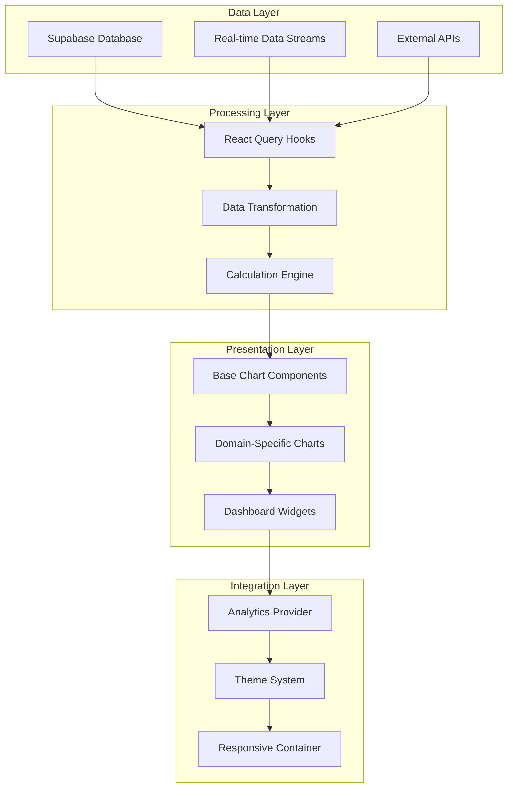

**Diagram sources**
- [chart.tsx](file://src/components/ui/chart.tsx#L1-L304)
- [DashboardAnalytics.tsx](file://src/components/admin/DashboardAnalytics.tsx#L1-L784)

The architecture emphasizes:
- **Modularity**: Each component serves a specific analytical purpose
- **Reusability**: Shared chart infrastructure supports multiple visualizations
- **Performance**: Efficient data fetching and caching through React Query
- **Accessibility**: Built-in support for screen readers and keyboard navigation
- **Responsiveness**: Adaptive layouts for different screen sizes

**Section sources**
- [chart.tsx](file://src/components/ui/chart.tsx#L1-L304)
- [DashboardAnalytics.tsx](file://src/components/admin/DashboardAnalytics.tsx#L1-L784)

## Dashboard Analytics Components

### DashboardAnalytics Component

The flagship dashboard analytics component provides comprehensive business intelligence through multiple visualization panels and interactive data exploration capabilities.

#### Component Architecture

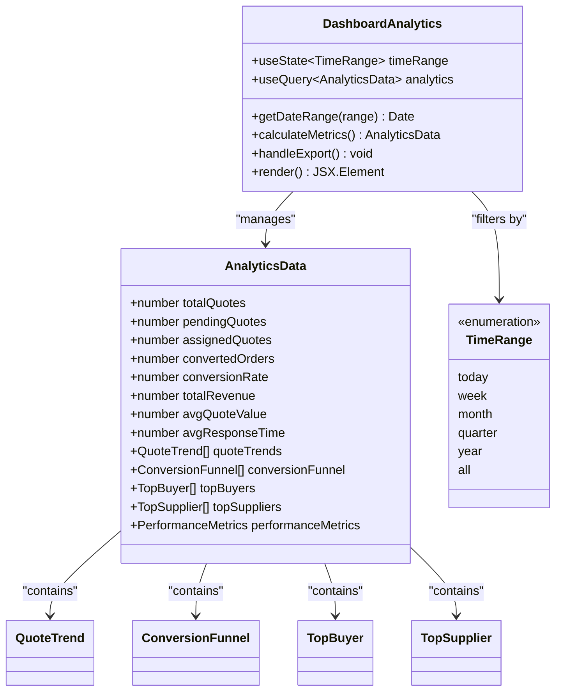

**Diagram sources**
- [DashboardAnalytics.tsx](file://src/components/admin/DashboardAnalytics.tsx#L37-L784)

#### Key Features

| Feature | Description | Implementation |
|---------|-------------|----------------|
| **Multi-Time Range Support** | Filter analytics by time periods (today, week, month, quarter, year, all) | Dynamic date calculation with `getDateRange()` function |
| **Real-time Data Updates** | Automatic refresh through React Query with stale-while-revalidate | `useQuery` hook with appropriate cache configuration |
| **Export Functionality** | Download analytics data as JSON for external analysis | Blob-based export with automatic filename generation |
| **Interactive Tabs** | Navigate between overview, funnel, performance, and leaderboard views | React Router-style tab navigation with smooth transitions |
| **Responsive Layout** | Adaptive grid system for optimal viewing across devices | CSS Grid with mobile-first responsive breakpoints |

#### Data Processing Pipeline

The component implements sophisticated data processing to transform raw database records into meaningful analytics insights:

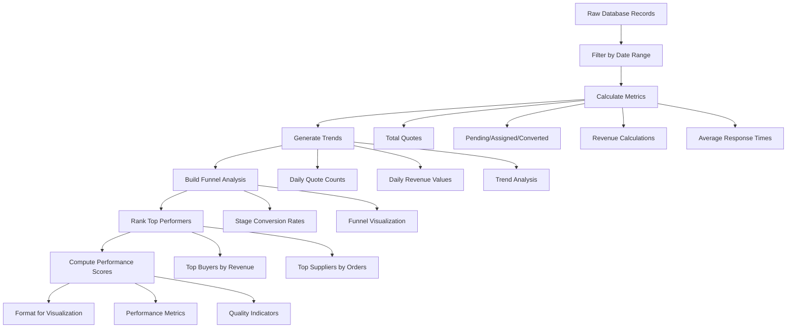

**Diagram sources**
- [DashboardAnalytics.tsx](file://src/components/admin/DashboardAnalytics.tsx#L99-L281)

**Section sources**
- [DashboardAnalytics.tsx](file://src/components/admin/DashboardAnalytics.tsx#L1-L784)

### FinancialChartsEnhanced Component

A specialized chart component for displaying financial data with professional-grade visualizations.

#### Chart Configuration

| Chart Type | Purpose | Data Structure | Key Features |
|------------|---------|----------------|--------------|
| **Line Chart** | Monthly earnings trend | `{month: string, earnings: number}` | Smooth interpolation, tooltip support |
| **Pie Chart** | Payment status distribution | `{name: string, value: number}` | Percentage labels, color coding |
| **Bar Chart** | Orders completed per month | `{month: string, orders: number}` | Stacked bars, hover effects |

#### Implementation Details

The component leverages Recharts library with custom styling and responsive behavior:

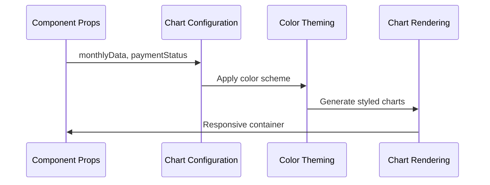

**Diagram sources**
- [FinancialChartsEnhanced.tsx](file://src/components/admin/FinancialChartsEnhanced.tsx#L1-L89)

**Section sources**
- [FinancialChartsEnhanced.tsx](file://src/components/admin/FinancialChartsEnhanced.tsx#L1-L89)

## Financial Analytics Components

### FinancialDashboard Component

Designed specifically for supplier-facing financial analytics, this component provides comprehensive visibility into payment status, revenue tracking, and invoice management.

#### Component Structure

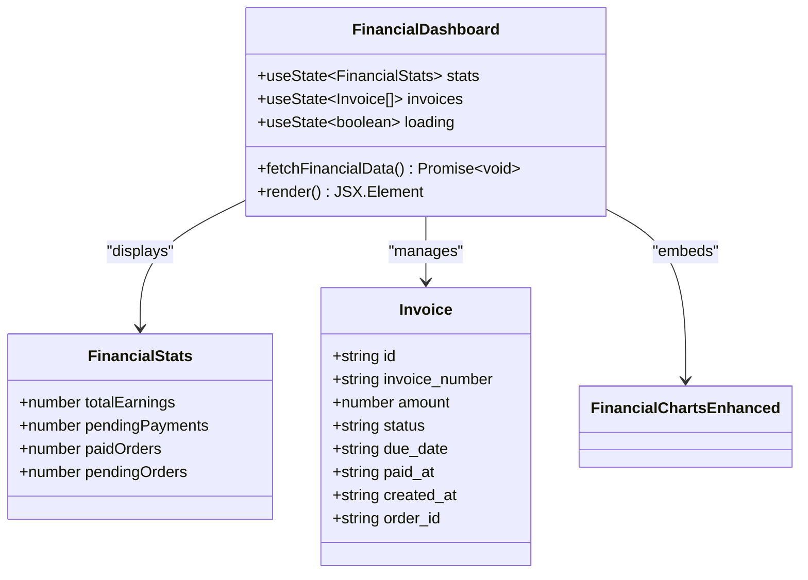

**Diagram sources**
- [FinancialDashboard.tsx](file://src/components/supplier/FinancialDashboard.tsx#L10-L232)

#### Key Analytics Features

| Metric | Calculation | Purpose |
|--------|-------------|---------|
| **Total Earnings** | Sum of completed orders | Revenue tracking |
| **Pending Payments** | Active order values | Cash flow projection |
| **Paid Orders** | Completed order count | Success rate |
| **Pending Orders** | Active order count | Work in progress |

#### Data Flow Architecture

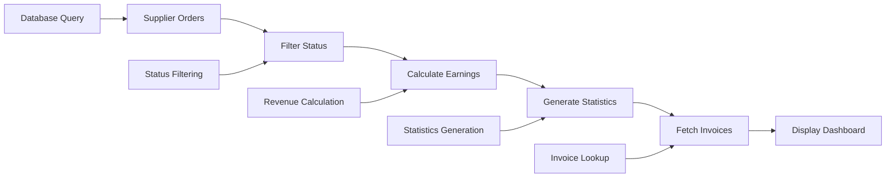

**Diagram sources**
- [FinancialDashboard.tsx](file://src/components/supplier/FinancialDashboard.tsx#L42-L98)

**Section sources**
- [FinancialDashboard.tsx](file://src/components/supplier/FinancialDashboard.tsx#L1-L232)

### SupplierPerformanceMetrics Component

Provides supplier-specific performance analytics with industry benchmarking and actionable insights.

#### Performance Scoring System

The component implements a comprehensive performance scoring mechanism:

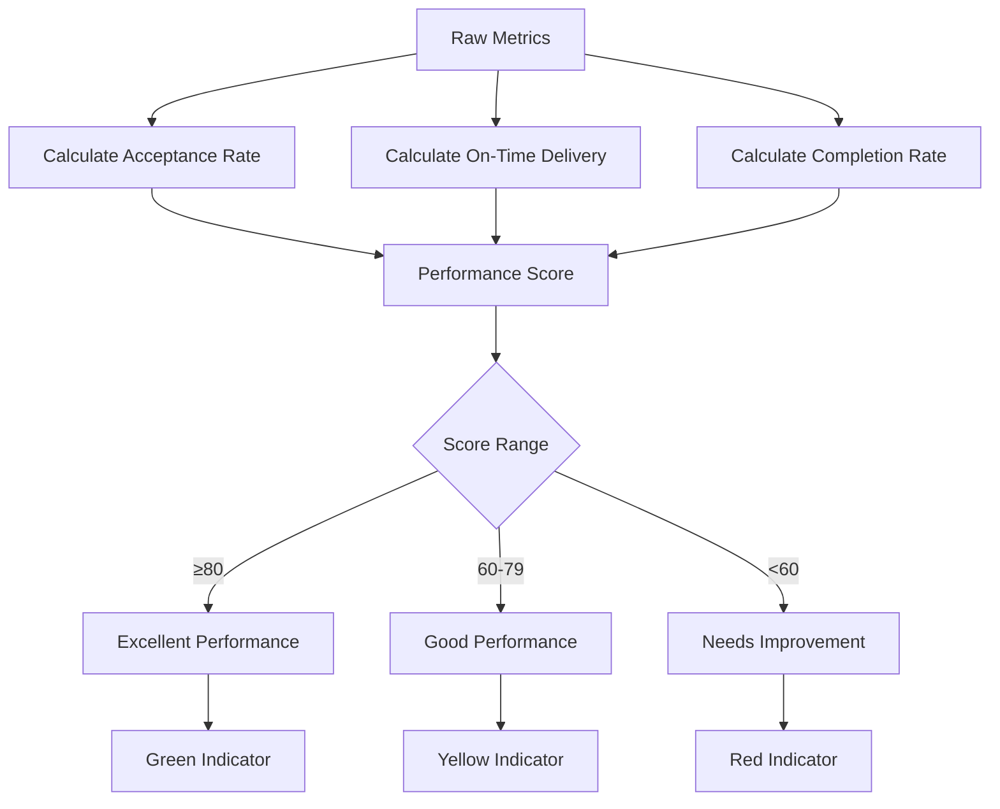

**Diagram sources**
- [SupplierPerformanceMetrics.tsx](file://src/components/supplier/SupplierPerformanceMetrics.tsx#L85-L93)

#### Key Performance Indicators

| KPI | Formula | Benchmark | Actionable Insights |
|-----|---------|-----------|-------------------|
| **Acceptance Rate** | Accepted Orders / Total Orders × 100 | >80% | Respond within 24 hours |
| **On-Time Delivery** | Delivered On-Time / Total Deliveries × 100 | >90% | Meet delivery commitments |
| **Completion Rate** | Completed Orders / Total Orders × 100 | >85% | Maintain quality standards |
| **Performance Score** | Weighted average of all metrics | 0-100 scale | Overall supplier ranking |

**Section sources**
- [SupplierPerformanceMetrics.tsx](file://src/components/supplier/SupplierPerformanceMetrics.tsx#L1-L221)

## Production Analytics Components

### ProductionAnalytics Component

Specialized for monitoring manufacturing processes, this component provides real-time production tracking with predictive analytics and bottleneck identification.

#### Production Stage Tracking

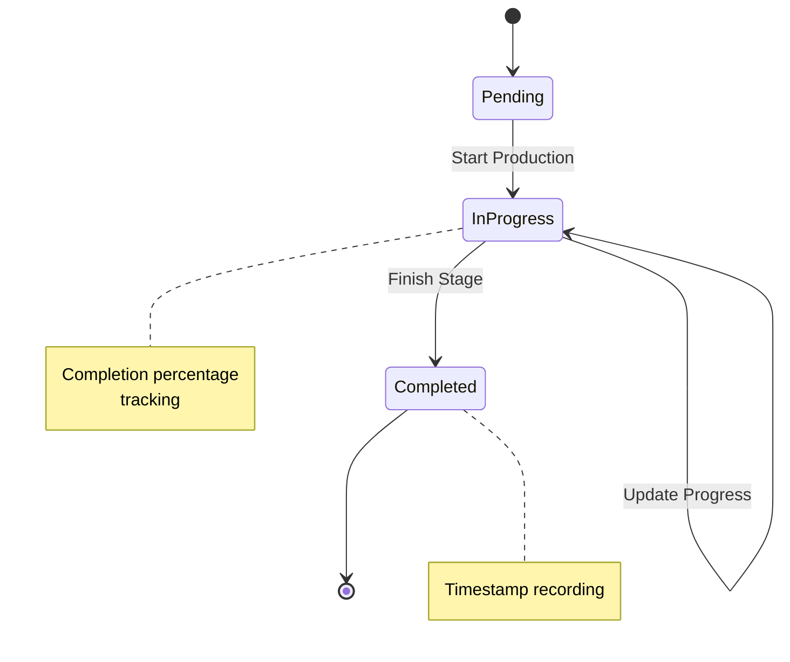

**Diagram sources**
- [ProductionAnalytics.tsx](file://src/components/production/ProductionAnalytics.tsx#L14-L249)

#### Progress Calculation Algorithm

The component implements sophisticated progress calculation based on multiple factors:

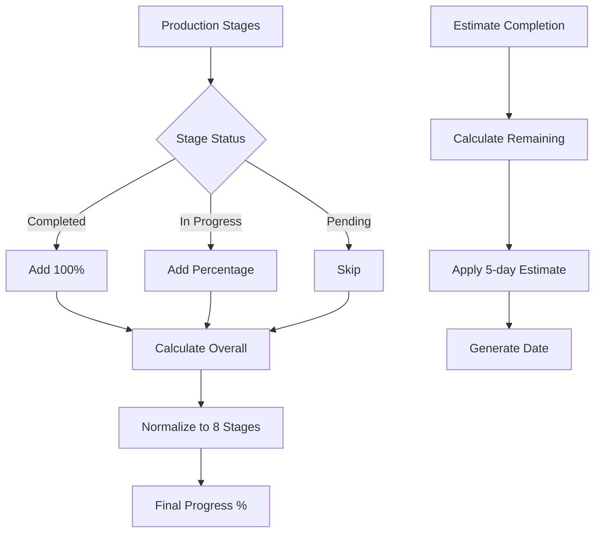

**Diagram sources**
- [ProductionAnalytics.tsx](file://src/components/production/ProductionAnalytics.tsx#L31-L57)

#### Performance Metrics

| Metric | Calculation | Purpose |
|--------|-------------|---------|
| **Overall Progress** | (Completed × 100 + In-Progress %) ÷ 8 | Complete production timeline |
| **Estimated Completion** | Current date + (Remaining Stages × 5 days) | Delivery scheduling |
| **Average Stage Time** | Sum of completed stage durations ÷ Count | Process efficiency |
| **Delayed Stages** | Count of overdue stages | Bottleneck identification |

**Section sources**
- [ProductionAnalytics.tsx](file://src/components/production/ProductionAnalytics.tsx#L1-L249)

## Market Research Components

### MarketResearchInsights Component

Delivers real-time market intelligence with confidence scoring and competitive analysis.

#### Research Data Structure

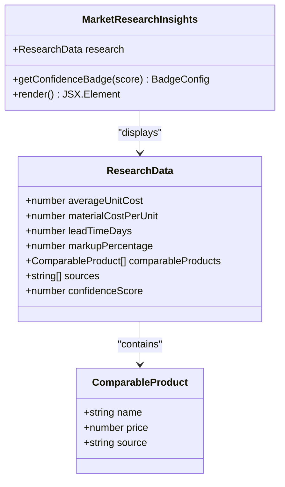

**Diagram sources**
- [MarketResearchInsights.tsx](file://src/components/quote/MarketResearchInsights.tsx#L5-L140)

#### Confidence Scoring System

The component implements a three-tier confidence scoring mechanism:

| Score Range | Confidence Level | Visual Indicator | Action Recommendation |
|-------------|------------------|------------------|----------------------|
| **85-100%** | High Confidence | Green badge ✓ | Reliable pricing |
| **70-84%** | Medium Confidence | Yellow badge ⚠ | Verify details |
| **0-69%** | Estimated | Orange badge ℹ | Use as reference |

**Section sources**
- [MarketResearchInsights.tsx](file://src/components/quote/MarketResearchInsights.tsx#L1-L140)

### PriceComparison Component

Provides comparative pricing analysis with visual bar charts and savings calculations.

#### Comparative Analysis Framework

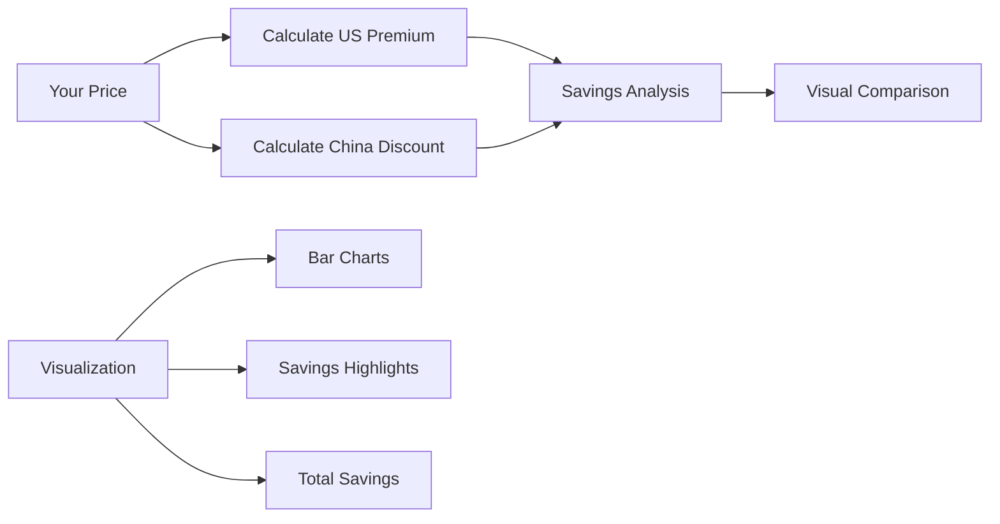

**Diagram sources**
- [PriceComparison.tsx](file://src/components/quote/PriceComparison.tsx#L1-L124)

#### Pricing Comparison Algorithm

| Comparison | Formula | Purpose |
|------------|---------|---------|
| **US Premium** | US Price - Your Price | Domestic premium analysis |
| **China Discount** | China Price - Your Price | International competitiveness |
| **Total Savings** | (US Premium + China Discount) × Quantity | Bulk purchasing benefits |

**Section sources**
- [PriceComparison.tsx](file://src/components/quote/PriceComparison.tsx#L1-L124)

## Comparison Analytics Components

### QuoteComparison Component

Advanced comparison tool for analyzing multiple quotes side-by-side with intelligent highlighting and analysis.

#### Comparison Matrix Structure

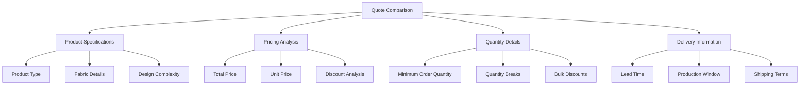

**Diagram sources**
- [QuoteComparison.tsx](file://src/components/quote/QuoteComparison.tsx#L20-L184)

#### Intelligent Highlighting System

The component automatically highlights optimal choices:

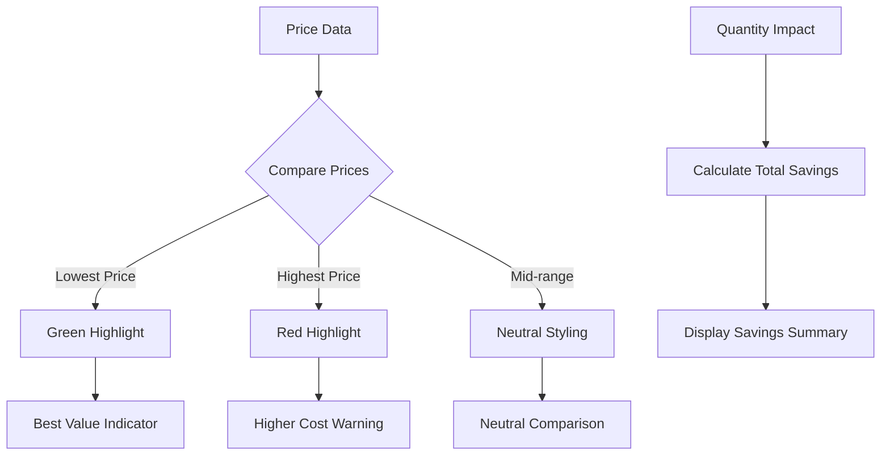

**Diagram sources**
- [QuoteComparison.tsx](file://src/components/quote/QuoteComparison.tsx#L88-L94)

**Section sources**
- [QuoteComparison.tsx](file://src/components/quote/QuoteComparison.tsx#L1-L184)

## Supplier Analytics Components

### MOQComparisonChart Component

Visualizes Minimum Order Quantity comparisons with risk/reward analysis.

#### Comparison Framework

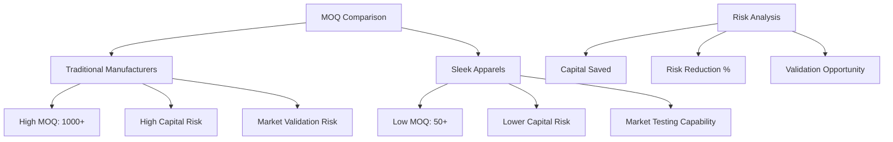

**Diagram sources**
- [MOQComparisonChart.tsx](file://src/components/infographics/MOQComparisonChart.tsx#L1-L220)

#### Risk/Reward Calculation

| Metric | Traditional | Sleek Apparels | Savings |
|--------|-------------|----------------|---------|
| **MOQ** | 1000+ pieces | 50-100 pieces | 94% lower |
| **Capital Risk** | High | Low | Significant reduction |
| **Market Validation** | Impossible | Possible | Opportunity gain |
| **Production Time** | 45-90 days | 10-20 days | 3x faster |

**Section sources**
- [MOQComparisonChart.tsx](file://src/components/infographics/MOQComparisonChart.tsx#L1-L220)

### TimelineComparisonChart Component

Provides comprehensive production timeline analysis with LoopTrace™ integration.

#### Production Stage Analysis

```mermaid
gantt
title Production Timeline Comparison
dateFormat DD-MM-YYYY
section Traditional
Sampling :21-01-2024, 14d
Fabric Sourcing :35-01-2024, 21d
Production :56-01-2024, 35d
Quality Control :91-01-2024, 7d
Finishing :98-01-2024, 5d
Shipping :106-01-2024, 8d
Total :21-01-2024, 114d
section Sleek Apparels
Sampling :21-01-2024, 5d
Fabric Sourcing :26-01-2024, 3d
Production :29-01-2024, 12d
Quality Control :41-01-2024, 2d
Finishing :43-01-2024, 2d
Shipping :45-01-2024, 1d
Total :21-01-2024, 34d
```

**Diagram sources**
- [TimelineComparisonChart.tsx](file://src/components/infographics/TimelineComparisonChart.tsx#L1-L306)

#### Timeline Benefits

| Benefit | Traditional | Sleek Apparels | Improvement |
|---------|-------------|----------------|-------------|
| **Total Time** | 45-90 days | 10-20 days | 3x faster |
| **Photo Updates** | None | 6 checkpoints | Transparency |
| **Delay Prediction** | Manual | AI-powered | Proactive management |
| **Quality Control** | Single stage | Multiple stages | Consistency |

**Section sources**
- [TimelineComparisonChart.tsx](file://src/components/infographics/TimelineComparisonChart.tsx#L1-L306)

## Chart Infrastructure

### Base Chart Component System

The foundation of all analytics visualizations is a robust chart infrastructure built on Recharts with custom enhancements.

#### Chart Configuration Architecture

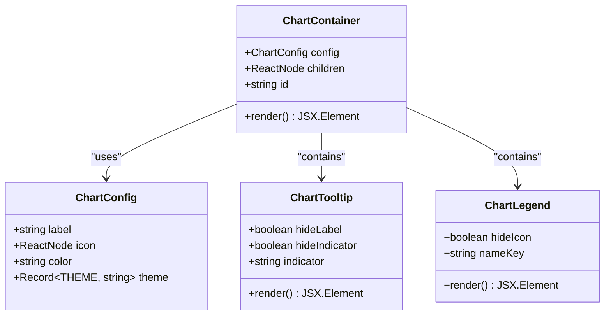

**Diagram sources**
- [chart.tsx](file://src/components/ui/chart.tsx#L6-L304)

#### Theme System Integration

The chart system supports dynamic theming with CSS custom properties:

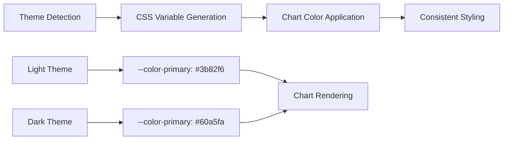

**Diagram sources**
- [chart.tsx](file://src/components/ui/chart.tsx#L61-L88)

#### Accessibility Features

| Feature | Implementation | Benefit |
|---------|----------------|---------|
| **Screen Reader Support** | ARIA labels and roles | Accessibility compliance |
| **Keyboard Navigation** | Tab order management | Keyboard-only operation |
| **High Contrast Mode** | Theme-aware styling | Visual accessibility |
| **Focus Indicators** | Clear focus states | Navigation clarity |

**Section sources**
- [chart.tsx](file://src/components/ui/chart.tsx#L1-L304)

## Data Flow and Integration

### React Query Integration

The analytics system leverages React Query for efficient data management:

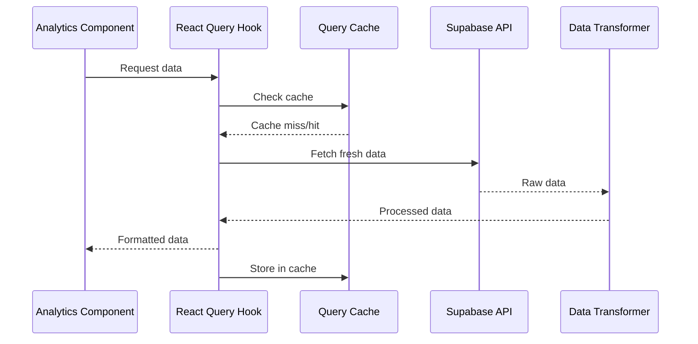

**Diagram sources**
- [DashboardAnalytics.tsx](file://src/components/admin/DashboardAnalytics.tsx#L99-L281)

### Data Transformation Pipeline

Each analytics component implements specific data transformation logic:

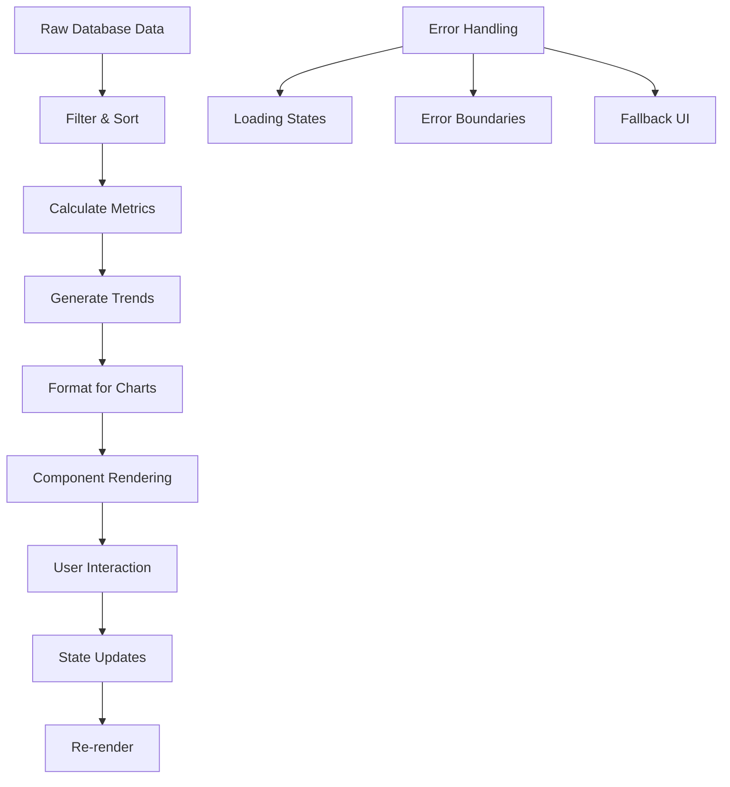

**Diagram sources**
- [DashboardAnalytics.tsx](file://src/components/admin/DashboardAnalytics.tsx#L129-L281)

**Section sources**
- [DashboardAnalytics.tsx](file://src/components/admin/DashboardAnalytics.tsx#L99-L281)

## Performance Considerations

### Chart Rendering Optimization

The analytics system implements several performance optimization strategies:

#### Memory Management

| Technique | Implementation | Benefit |
|-----------|----------------|---------|
| **Virtualization** | Large dataset pagination | Reduced memory footprint |
| **Memoization** | Component result caching | Prevents unnecessary re-renders |
| **Lazy Loading** | Chart component on-demand | Faster initial load |
| **Debounced Updates** | Input event throttling | Smooth user experience |

#### Rendering Performance

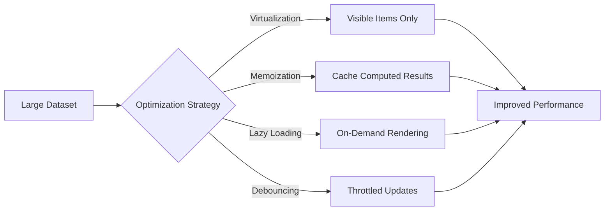

### Responsive Behavior

The chart system adapts to different screen sizes and orientations:

| Breakpoint | Layout Strategy | Chart Adaptation |
|------------|-----------------|------------------|
| **Mobile (<768px)** | Single column, stacked | Simplified legends, compact tooltips |
| **Tablet (768-1024px)** | Dual column, balanced | Moderate legend, inline tooltips |
| **Desktop (>1024px)** | Multi-column, detailed | Full legends, floating tooltips |

## Accessibility and Responsive Design

### Accessibility Compliance

The analytics components adhere to WCAG 2.1 AA standards:

#### Keyboard Navigation

```mermaid
flowchart TD
A[Tab Press] --> B[Focus Next Element]
B --> C{Element Type}
C --> |Chart| D[Navigate Series]
C --> |Legend| E[Select Series]
C --> |Button| F[Execute Action]
C --> |Dropdown| G[Open Menu]
D --> H[Arrow Keys for Selection]
E --> I[Space/Enter to Toggle]
F --> J[Execute Immediate]
G --> K[Arrow Keys for Options]
```

#### Screen Reader Support

| Element | ARIA Role | Description |
|---------|-----------|-------------|
| **Charts** | `img` with `aria-label` | Descriptive chart summaries |
| **Legends** | `list` with `aria-labelledby` | Series descriptions |
| **Tooltips** | `tooltip` with `aria-describedby` | Interactive data points |
| **Controls** | `button` with `aria-expanded` | Interactive elements |

### Responsive Design Patterns

The components implement fluid layouts that adapt to viewport changes:

```mermaid
graph TB
A[Viewport Width] --> B{Breakpoint Check}
B --> |<768px| C[Mobile Layout]
B --> |768-1024px| D[Tablet Layout]
B --> |>1024px| E[Desktop Layout]
C --> F[Single Column, Full Width]
D --> G[Two Column, Balanced]
E --> H[Multi Column, Detailed]
F --> I[Touch-Friendly Controls]
G --> J[Compact Interactions]
H --> K[Rich Tooltips & Legends]
```

## Customization and Extension Guidelines

### Chart Customization Framework

The chart system provides extensive customization options:

#### Color Scheme Customization

```typescript
// Example color configuration
const customColors = {
  primary: 'hsl(var(--primary))',
  secondary: 'hsl(var(--secondary))',
  accent: 'hsl(var(--accent))',
  muted: 'hsl(var(--muted))',
  background: 'hsl(var(--background))'
};
```

#### Component Extension Pattern

```typescript
// Custom chart component extension
const CustomAnalyticsChart = ({ data, config }: CustomChartProps) => {
  return (
    <ChartContainer config={config}>
      <ResponsiveContainer width="100%" height={400}>
        <LineChart data={data}>
          {/* Custom chart configuration */}
        </LineChart>
      </ResponsiveContainer>
    </ChartContainer>
  );
};
```

### Adding New Analytics Components

#### Step 1: Define Data Interface

```typescript
interface CustomAnalyticsData {
  metric1: number;
  metric2: number;
  categories: string[];
  timestamps: Date[];
}
```

#### Step 2: Create Component Structure

```typescript
export const CustomAnalyticsComponent = ({ 
  data, 
  timeRange 
}: CustomAnalyticsProps) => {
  // Data processing and state management
  // Chart rendering logic
  // Responsive behavior implementation
};
```

#### Step 3: Integrate with Chart System

```typescript
// Proper chart integration
return (
  <ChartContainer config={chartConfig}>
    <ResponsiveContainer width="100%" height={400}>
      <CustomChart data={processedData} />
    </ResponsiveContainer>
  </ChartContainer>
);
```

### Performance Extension Guidelines

#### Memory Optimization

| Strategy | Implementation | Impact |
|----------|----------------|--------|
| **Data Pagination** | Load chunks of data | Reduces initial memory usage |
| **Chart Virtualization** | Render visible chart segments | Improves scrolling performance |
| **Event Debouncing** | Throttle user interactions | Prevents excessive re-renders |
| **Component Memoization** | Cache expensive computations | Reduces CPU usage |

#### Scalability Considerations

```mermaid
flowchart TD
A[Large Dataset] --> B{Scaling Strategy}
B --> |Pagination| C[Chunked Loading]
B --> |Sampling| D[Statistical Sampling]
B --> |Aggregation| E[Server-side Aggregation]
B --> |Caching| F[Efficient Cache Strategy]
C --> G[Memory Efficient]
D --> G
E --> G
F --> G
```

## Best Practices

### Data Visualization Principles

#### Chart Selection Guidelines

| Data Type | Recommended Chart | Rationale |
|-----------|------------------|-----------|
| **Time Series** | Line Chart | Shows trends over time |
| **Comparisons** | Bar Chart | Easy value comparison |
| **Proportions** | Pie Chart | Part-to-whole relationships |
| **Correlations** | Scatter Plot | Relationship analysis |
| **Hierarchical** | Treemap | Nested data representation |

#### Design Principles

```mermaid
mindmap
root((Analytics Design))
Clarity
Simple visual hierarchy
Clear labeling
Minimal clutter
Accuracy
True data representation
Appropriate scales
Consistent units
Accessibility
Color-blind friendly
Screen reader compatible
Keyboard navigable
Performance
Fast loading
Smooth interactions
Mobile friendly
```

### Error Handling and Edge Cases

#### Robust Error Management

```typescript
// Comprehensive error handling pattern
const AnalyticsComponent = ({ data }: AnalyticsProps) => {
  if (!data) {
    return <EmptyState message="No data available" />;
  }
  
  if (data.error) {
    return <ErrorState error={data.error} />;
  }
  
  if (data.loading) {
    return <LoadingState />;
  }
  
  return <ChartComponent data={data} />;
};
```

#### Data Validation Strategies

| Validation Type | Implementation | Purpose |
|-----------------|----------------|---------|
| **Null Checks** | `if (!data)` | Handle missing data |
| **Type Guards** | `Array.isArray(data)` | Ensure data structure |
| **Range Validation** | `value >= 0 && value <= 100` | Prevent invalid values |
| **Consistency Checks** | Cross-reference calculations | Detect data anomalies |

### Monitoring and Maintenance

#### Performance Monitoring

```typescript
// Performance tracking implementation
const useAnalyticsPerformance = () => {
  const [metrics, setMetrics] = useState<PerformanceMetrics>({
    renderTime: 0,
    memoryUsage: 0,
    interactionLatency: 0
  });
  
  // Performance measurement logic
  return metrics;
};
```

#### Regular Maintenance Tasks

| Task | Frequency | Purpose |
|------|-----------|---------|
| **Data Freshness** | Real-time | Keep analytics current |
| **Chart Performance** | Weekly | Optimize rendering |
| **Accessibility Review** | Monthly | Ensure compliance |
| **Feature Testing** | Release | Validate functionality |

The sleekapp-v100 dashboard and analytics system represents a comprehensive solution for business intelligence visualization. Through its modular architecture, sophisticated data processing, and commitment to accessibility and performance, it provides stakeholders with the insights needed to make informed decisions while maintaining excellent user experience across all devices and accessibility requirements.