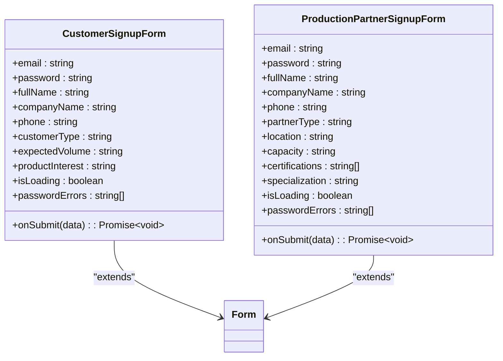
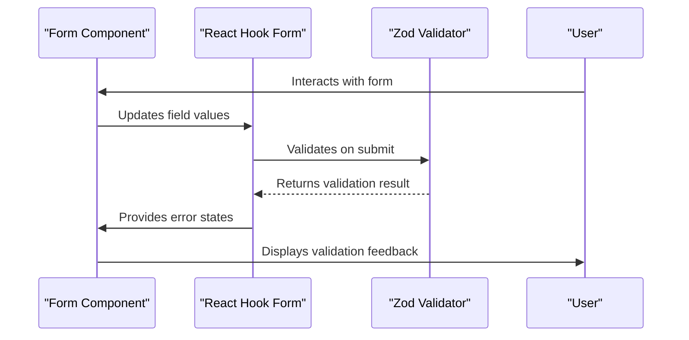
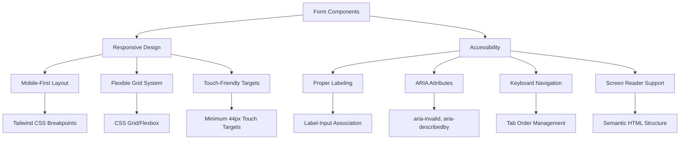
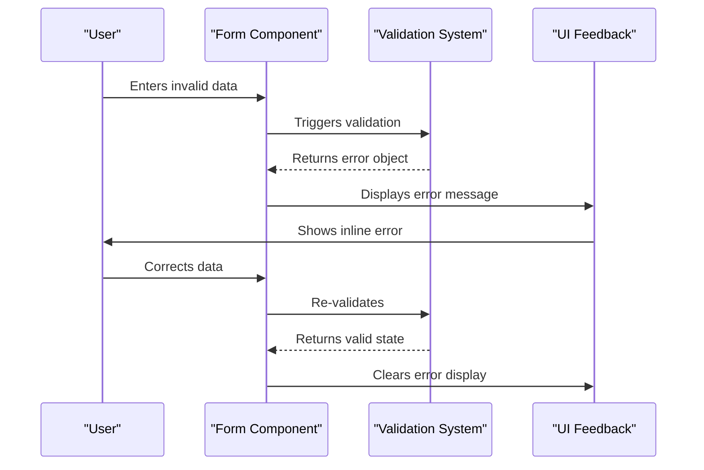
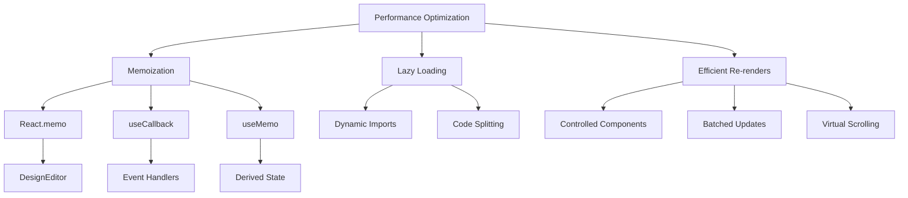

# Form & Input Components

<cite>
**Referenced Files in This Document**   
- [CustomerSignupForm.tsx](file://src/components/auth/CustomerSignupForm.tsx)
- [ProductionPartnerSignupForm.tsx](file://src/components/auth/ProductionPartnerSignupForm.tsx)
- [PaymentForm.tsx](file://src/components/payment/PaymentForm.tsx)
- [SpecificationsBuilder.tsx](file://src/components/marketplace/SpecificationsBuilder.tsx)
- [DesignEditor.tsx](file://src/components/design-studio/DesignEditor.tsx)
- [BlogEditor.tsx](file://src/components/blog/BlogEditor.tsx)
- [NaturalLanguageQuoteInput.tsx](file://src/components/quote/NaturalLanguageQuoteInput.tsx)
- [PainPointSelector.tsx](file://src/components/quote/PainPointSelector.tsx)
- [form.tsx](file://src/components/ui/form.tsx)
- [input.tsx](file://src/components/ui/input.tsx)
- [textarea.tsx](file://src/components/ui/textarea.tsx)
</cite>

## Table of Contents
1. [Introduction](#introduction)
2. [Core Form Components](#core-form-components)
3. [Input Components](#input-components)
4. [Complex Form Implementations](#complex-form-implementations)
5. [Integration with React Hook Form and Zod](#integration-with-react-hook-form-and-zod)
6. [AI-Powered Form Components](#ai-powered-form-components)
7. [Responsive Design and Accessibility](#responsive-design-and-accessibility)
8. [Styling and Theming](#styling-and-theming)
9. [Error Handling and Validation](#error-handling-and-validation)
10. [Performance Optimization](#performance-optimization)

## Introduction

The form and input components in sleekapp-v100 provide a comprehensive system for user data collection, validation, and processing. These components are designed to support various user interactions including customer registration, production partner onboarding, payment processing, content creation, and product specification management. The forms leverage modern React patterns with React Hook Form for state management, Zod for validation, and AI-powered features for enhanced user experience.

The component architecture follows a modular design with base UI components in the `ui` directory and specialized form components organized by feature domain. This structure enables consistent styling and behavior across the application while allowing for domain-specific customization.

**Section sources**
- [CustomerSignupForm.tsx](file://src/components/auth/CustomerSignupForm.tsx)
- [ProductionPartnerSignupForm.tsx](file://src/components/auth/ProductionPartnerSignupForm.tsx)

## Core Form Components

The application features several specialized form components tailored to different user roles and business processes. The `CustomerSignupForm` and `ProductionPartnerSignupForm` components handle user registration for customers and suppliers respectively, with distinct fields and validation requirements based on user type.



**Diagram sources**
- [CustomerSignupForm.tsx](file://src/components/auth/CustomerSignupForm.tsx#L13-L45)
- [ProductionPartnerSignupForm.tsx](file://src/components/auth/ProductionPartnerSignupForm.tsx#L14-L45)

## Input Components

The base input components provide consistent styling and accessibility features across the application. These components are built using Radix UI primitives and enhanced with Tailwind CSS for responsive design.

### Text Input
The `Input` component is a styled text input with accessibility features including proper labeling and error states.

```mermaid
classDiagram
class Input {
+type : string
+className : string
+ref : Ref~HTMLInputElement~
+...props : ComponentProps~"input"~
}
Input --> "React.forwardRef" : "uses"
Input --> "cn" : "uses utility classes"
```

**Diagram sources**
- [input.tsx](file://src/components/ui/input.tsx#L5-L19)

### Textarea
The `Textarea` component provides a multi-line text input with configurable height and responsive behavior.

```mermaid
classDiagram
class Textarea {
+className : string
+ref : Ref~HTMLTextAreaElement~
+...props : TextareaProps
}
Textarea --> "React.forwardRef" : "uses"
Textarea --> "cn" : "uses utility classes"
```

**Diagram sources**
- [textarea.tsx](file://src/components/ui/textarea.tsx#L7-L17)

### Form Context and Validation
The form system uses React Hook Form for state management and validation, with custom components that integrate seamlessly with the form context.

```mermaid
classDiagram
class Form {
+FormProvider : React Component
}
class FormField {
+name : FieldPath~TFieldValues~
+...ControllerProps
}
class FormItem {
+className : string
+...HTMLAttributes~HTMLDivElement~
}
class FormLabel {
+...LabelPrimitive.RootProps
}
class FormControl {
+...SlotProps
}
class FormDescription {
+...HTMLAttributes~HTMLParagraphElement~
}
class FormMessage {
+...HTMLAttributes~HTMLParagraphElement~
}
Form --> FormProvider : "exports"
FormField --> Controller : "wraps"
FormItem --> "space-y-2" : "layout"
FormLabel --> useFormField : "accesses error state"
FormControl --> useFormField : "accesses field state"
FormDescription --> useFormField : "accesses descriptionId"
FormMessage --> useFormField : "accesses error message"
```

**Diagram sources**
- [form.tsx](file://src/components/ui/form.tsx#L1-L129)

## Complex Form Implementations

### Payment Form
The `PaymentForm` component integrates with Stripe for secure payment processing, supporting different payment types and providing real-time feedback.

```mermaid
classDiagram
class PaymentForm {
+amount : number
+orderId : string
+paymentType : 'deposit' | 'balance' | 'full'
+onSuccess() : void
+isProcessing : boolean
}
PaymentForm --> "Stripe" : "uses"
PaymentForm --> "Elements" : "uses"
PaymentForm --> "PaymentElement" : "renders"
```

**Diagram sources**
- [PaymentForm.tsx](file://src/components/payment/PaymentForm.tsx#L7-L18)

### Specifications Builder
The `SpecificationsBuilder` component allows users to create detailed product specifications with template support and unit selection.

```mermaid
classDiagram
class SpecificationsBuilder {
+specifications : Record~string, any~
+onChange(specs) : void
+disabled : boolean
+specs : Specification[]
+selectedTemplate : string
}
class Specification {
+id : string
+key : string
+value : string
+unit? : string
}
SpecificationsBuilder --> Specification : "contains"
SpecificationsBuilder --> "SPEC_TEMPLATES" : "uses"
SpecificationsBuilder --> "COMMON_UNITS" : "uses"
```

**Diagram sources**
- [SpecificationsBuilder.tsx](file://src/components/marketplace/SpecificationsBuilder.tsx#L16-L276)

## Integration with React Hook Form and Zod

The form components integrate with React Hook Form for state management and Zod for validation. The `form.tsx` component provides a wrapper around React Hook Form that simplifies integration with the UI components.



**Diagram sources**
- [form.tsx](file://src/components/ui/form.tsx#L4-L129)
- [CustomerSignupForm.tsx](file://src/components/auth/CustomerSignupForm.tsx#L6-L203)

## AI-Powered Form Components

### Natural Language Quote Input
The `NaturalLanguageQuoteInput` component uses AI to parse natural language descriptions into structured quote data.

```mermaid
classDiagram
class NaturalLanguageQuoteInput {
+onParsedData(data) : void
+disabled : boolean
+description : string
+loading : boolean
}
NaturalLanguageQuoteInput --> "parse-quote-description" : "invokes function"
NaturalLanguageQuoteInput --> "supabase.functions" : "uses"
NaturalLanguageQuoteInput --> "useToast" : "provides feedback"
```

**Diagram sources**
- [NaturalLanguageQuoteInput.tsx](file://src/components/quote/NaturalLanguageQuoteInput.tsx#L17-L21)

### Pain Point Selector
The `PainPointSelector` component helps users identify their primary challenges with interactive selection and visual feedback.

```mermaid
classDiagram
class PainPointSelector {
+onSelect(id) : void
+selectedPainPoints : string[]
+multiSelect : boolean
+className : string
}
class PainPoint {
+id : string
+icon : ReactElement
+title : string
+description : string
+color : string
+bgColor : string
+impact : 'high' | 'medium'
}
PainPointSelector --> PainPoint : "displays"
PainPointSelector --> "framer-motion" : "uses for animation"
```

**Diagram sources**
- [PainPointSelector.tsx](file://src/components/quote/PainPointSelector.tsx#L7-L168)

### Design Editor
The `DesignEditor` component provides AI-powered design generation and text customization features.

```mermaid
classDiagram
class DesignEditor {
+onDesignGenerated(design) : void
+onTextChange(text, size, color) : void
+aiPrompt : string
+textDesign : string
+textSize : number
+textColor : string
+loading : boolean
}
DesignEditor --> "ai-design-generator" : "invokes function"
DesignEditor --> "supabase.functions" : "uses"
DesignEditor --> "zod" : "validates input"
```

**Diagram sources**
- [DesignEditor.tsx](file://src/components/design-studio/DesignEditor.tsx#L18-L229)

### Blog Editor
The `BlogEditor` component includes AI-assisted content creation with outline generation and full content writing capabilities.

```mermaid
classDiagram
class BlogEditor {
+postId? : string
+onSave?() : void
+title : string
+slug : string
+content : string
+category : string
+saving : boolean
+aiGenerating : boolean
}
BlogEditor --> "ai-blog-assistant" : "invokes function"
BlogEditor --> "supabase.functions" : "uses"
BlogEditor --> "sonner" : "provides toast notifications"
```

**Diagram sources**
- [BlogEditor.tsx](file://src/components/blog/BlogEditor.tsx#L12-L297)

## Responsive Design and Accessibility

All form components are designed with responsive layouts and accessibility compliance following WCAG standards. The components use semantic HTML, proper ARIA attributes, and keyboard navigation support.



**Diagram sources**
- [form.tsx](file://src/components/ui/form.tsx#L75-L127)
- [input.tsx](file://src/components/ui/input.tsx#L5-L19)

## Styling and Theming

The components use Tailwind CSS for styling with design tokens defined in the application's design system. Theming is supported through CSS variables and utility classes.

```mermaid
classDiagram
class DesignTokens {
+colors : map
+spacing : map
+typography : map
+borderRadius : map
+shadows : map
}
class TailwindConfig {
+theme : object
+extend : object
}
class Component {
+className : string
+style : object
}
DesignTokens --> TailwindConfig : "informs configuration"
TailwindConfig --> Component : "generates utility classes"
Component --> "cn()" : "combines classes"
```

**Diagram sources**
- [tailwind.config.ts](file://tailwind.config.ts)
- [designTokens.ts](file://src/lib/designTokens.ts)

## Error Handling and Validation

The form system implements comprehensive error handling with real-time validation feedback and user-friendly error messages.



**Diagram sources**
- [form.tsx](file://src/components/ui/form.tsx#L111-L127)
- [CustomerSignupForm.tsx](file://src/components/auth/CustomerSignupForm.tsx#L87-L96)

## Performance Optimization

The form components are optimized for performance with memoization, lazy loading, and efficient re-rendering patterns.



**Diagram sources**
- [DesignEditor.tsx](file://src/components/design-studio/DesignEditor.tsx#L23)
- [form.tsx](file://src/components/ui/form.tsx)