# Modal & Dialog Components

<cite>
**Referenced Files in This Document**   
- [OrderDetailModal.tsx](file://src/components/admin/OrderDetailModal.tsx)
- [OrderDetailsDialog.tsx](file://src/components/admin/OrderDetailsDialog.tsx)
- [CreateSupplierOrderDialog.tsx](file://src/components/admin/CreateSupplierOrderDialog.tsx)
- [PerformanceReviewDialog.tsx](file://src/components/admin/PerformanceReviewDialog.tsx)
- [SupplierAssignmentDialog.tsx](file://src/components/admin/SupplierAssignmentDialog.tsx)
- [EmailQuoteModal.tsx](file://src/components/quote/EmailQuoteModal.tsx)
- [QuoteLoadingStages.tsx](file://src/components/quote/QuoteLoadingStages.tsx)
- [OrderDetailDialog.tsx](file://src/components/supplier/OrderDetailDialog.tsx)
- [SupplierOrderDetailModal.tsx](file://src/components/supplier/SupplierOrderDetailModal.tsx)
- [dialog.tsx](file://src/components/ui/dialog.tsx)
- [sheet.tsx](file://src/components/ui/sheet.tsx)
- [drawer.tsx](file://src/components/ui/drawer.tsx)
</cite>

## Table of Contents
1. [Introduction](#introduction)
2. [Core Modal & Dialog Components](#core-modal--dialog-components)
3. [Component Architecture](#component-architecture)
4. [Detailed Component Analysis](#detailed-component-analysis)
5. [Responsive Design & Accessibility](#responsive-design--accessibility)
6. [Styling & Theming](#styling--theming)
7. [Performance Considerations](#performance-considerations)
8. [Usage Examples](#usage-examples)
9. [Conclusion](#conclusion)

## Introduction
The sleekapp-v100 application features a comprehensive suite of modal and dialog components designed to provide rich user interactions across different user roles including administrators, suppliers, and buyers. These components are built on top of the shadcn/ui library, extending the base Dialog, Sheet, and Drawer components to create specialized interfaces for order management, supplier assignment, quote handling, and performance reviews. The modal system follows consistent design patterns while providing role-specific functionality, with careful attention to accessibility, responsive behavior, and user experience.

## Core Modal & Dialog Components
The application implements a diverse set of modal components tailored to specific workflows and user roles. These components share a common foundation but are specialized for their particular use cases, providing targeted functionality while maintaining a consistent user experience across the application.

### OrderDetailModal
The OrderDetailModal component provides administrators with a comprehensive view of order details, allowing them to manage pricing, assign suppliers, and add administrative notes. This modal features a multi-section layout with pricing calculations, supplier assignment capabilities, and margin visualization.

**Section sources**
- [OrderDetailModal.tsx](file://src/components/admin/OrderDetailModal.tsx#L20-L228)

### OrderDetailsDialog
The OrderDetailsDialog offers a tabbed interface for viewing comprehensive order information, including details, financial data, and timeline information. This component provides a more detailed view than the basic modal, with organized sections that help administrators quickly access relevant information.

**Section sources**
- [OrderDetailsDialog.tsx](file://src/components/admin/OrderDetailsDialog.tsx#L27-L290)

### CreateSupplierOrderDialog
The CreateSupplierOrderDialog enables administrators to create new supplier orders with associated production stages. This form-based dialog includes fields for order details, pricing, and a dynamic interface for adding multiple production stages with target dates.

**Section sources**
- [CreateSupplierOrderDialog.tsx](file://src/components/admin/CreateSupplierOrderDialog.tsx#L12-L203)

### PerformanceReviewDialog
The PerformanceReviewDialog facilitates the submission of performance reviews for suppliers after order completion. This component includes star rating inputs for quality and communication, date selection for actual delivery, and a notes section for additional feedback.

**Section sources**
- [PerformanceReviewDialog.tsx](file://src/components/admin/PerformanceReviewDialog.tsx#L11-L152)

### SupplierAssignmentDialog
The SupplierAssignmentDialog allows administrators to assign orders to verified suppliers from a searchable list. Suppliers are displayed as selectable cards with performance metrics, MOQ information, and lead times, enabling data-driven assignment decisions.

**Section sources**
- [SupplierAssignmentDialog.tsx](file://src/components/admin/SupplierAssignmentDialog.tsx#L19-L238)

### EmailQuoteModal
The EmailQuoteModal captures user information when requesting a quote to be emailed. This modal includes form validation, pre-filled quote summary information, and optional checkboxes for swatch kits and newsletter subscription, providing a seamless quote delivery experience.

**Section sources**
- [EmailQuoteModal.tsx](file://src/components/quote/EmailQuoteModal.tsx#L11-L260)

### QuoteLoadingStages
The QuoteLoadingStages component displays a visual loading sequence when generating quotes, showing progress through multiple stages with animated indicators and rotating tips. This component enhances user experience during asynchronous operations.

**Section sources**
- [QuoteLoadingStages.tsx](file://src/components/quote/QuoteLoadingStages.tsx#L5-L139)

### OrderDetailDialog
The OrderDetailDialog provides suppliers with a concise view of order details, including product specifications, pricing, target dates, and special instructions. This component includes action buttons for accepting orders or requesting changes, facilitating quick supplier responses.

**Section sources**
- [OrderDetailDialog.tsx](file://src/components/supplier/OrderDetailDialog.tsx#L13-L143)

### SupplierOrderDetailModal
The SupplierOrderDetailModal offers suppliers a detailed interface for reviewing and responding to order assignments. This component includes tabs for accepting, counter-offering, or rejecting orders, with appropriate form fields for each action type.

**Section sources**
- [SupplierOrderDetailModal.tsx](file://src/components/supplier/SupplierOrderDetailModal.tsx#L19-L288)

## Component Architecture
The modal and dialog components in sleekapp-v100 are built on a layered architecture that extends the base shadcn/ui components while maintaining consistency across the application. The architecture follows a clear hierarchy from base components to specialized implementations.

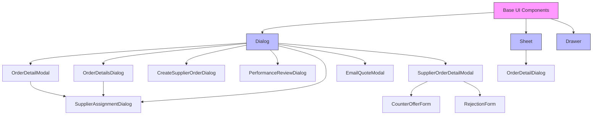

**Diagram sources**
- [dialog.tsx](file://src/components/ui/dialog.tsx#L7-L95)
- [sheet.tsx](file://src/components/ui/sheet.tsx#L8-L107)
- [drawer.tsx](file://src/components/ui/drawer.tsx#L6-L87)

## Detailed Component Analysis

### Base Dialog Implementation
The foundation of all modal components is the shadcn/ui Dialog component, which provides the core functionality for modal dialogs including proper focus management, accessibility features, and animation transitions.

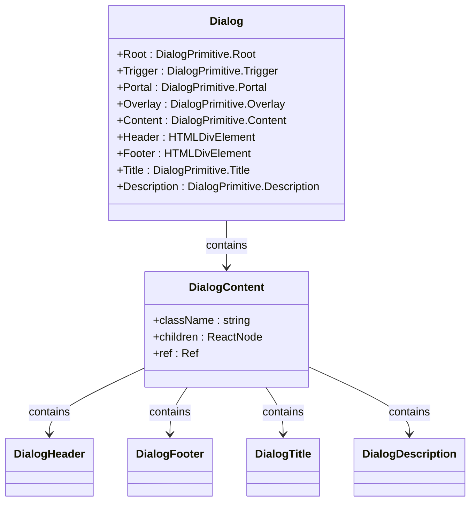

**Diagram sources**
- [dialog.tsx](file://src/components/ui/dialog.tsx#L7-L95)

### Admin-Focused Components
The administrative components provide comprehensive order management capabilities with specialized functionality for different aspects of order processing and supplier management.

#### OrderDetailModal Analysis
The OrderDetailModal component enables administrators to manage order pricing and supplier assignments. It calculates margins in real-time and provides a seamless interface for updating order details.

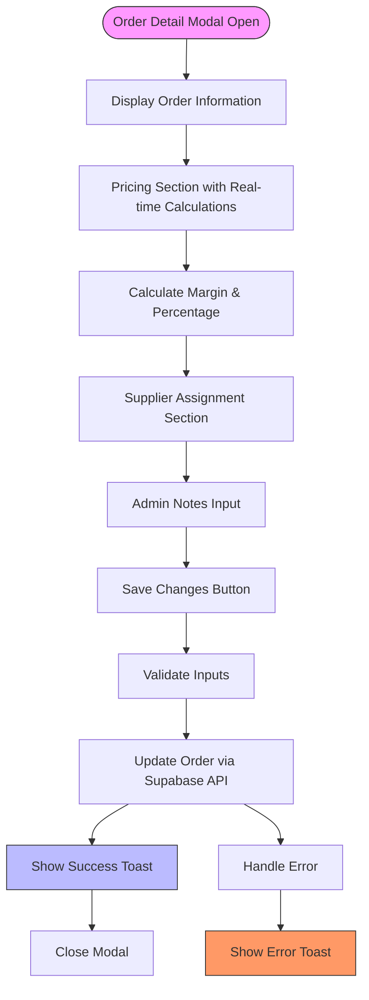

**Diagram sources**
- [OrderDetailModal.tsx](file://src/components/admin/OrderDetailModal.tsx#L27-L228)

#### SupplierAssignmentDialog Analysis
The SupplierAssignmentDialog provides a searchable interface for selecting suppliers, with performance metrics and lead time information to support data-driven decisions.

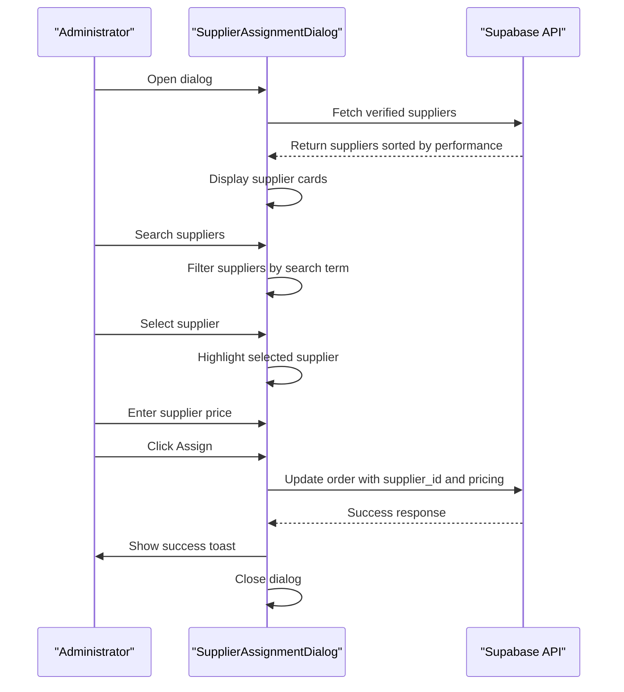

**Diagram sources**
- [SupplierAssignmentDialog.tsx](file://src/components/admin/SupplierAssignmentDialog.tsx#L26-L238)

### Supplier-Focused Components
The supplier-facing components are designed to facilitate order acceptance, negotiation, and management, with intuitive interfaces that support quick decision-making.

#### SupplierOrderDetailModal Analysis
The SupplierOrderDetailModal provides a tabbed interface for suppliers to respond to order assignments, with dedicated sections for acceptance, counter-offers, and rejections.

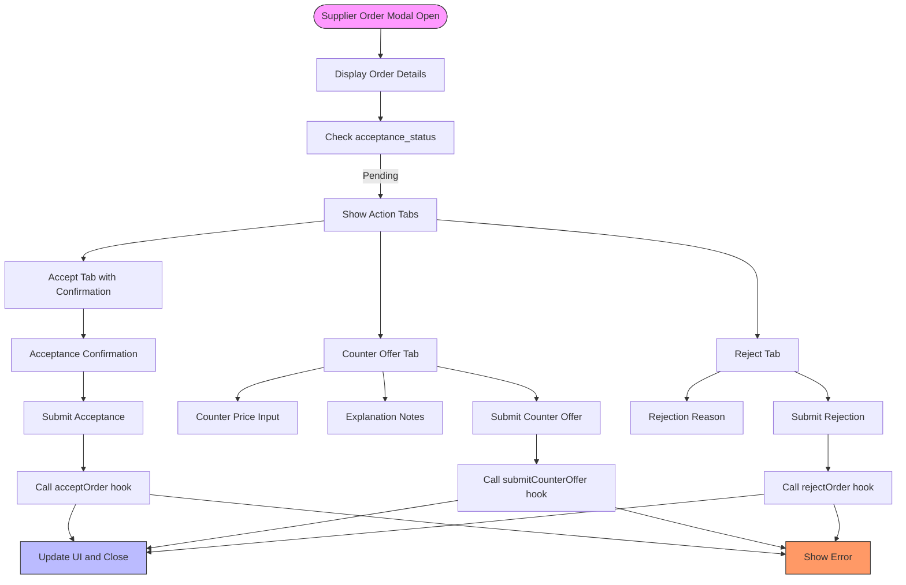

**Diagram sources**
- [SupplierOrderDetailModal.tsx](file://src/components/supplier/SupplierOrderDetailModal.tsx#L26-L288)

### Quote Management Components
The quote-related components handle the generation, loading, and delivery of quotes, providing a seamless experience from initial request to final delivery.

#### QuoteLoadingStages Analysis
The QuoteLoadingStages component provides visual feedback during the quote generation process, with animated progress indicators and rotating tips to maintain user engagement.

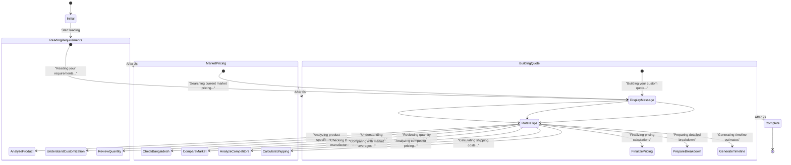

**Diagram sources**
- [QuoteLoadingStages.tsx](file://src/components/quote/QuoteLoadingStages.tsx#L5-L139)

## Responsive Design & Accessibility
The modal components in sleekapp-v100 are designed with responsive behavior and accessibility as core principles, ensuring a consistent experience across devices and compliance with WCAG standards.

### Responsive Behavior
All modal components adapt their layout and behavior based on screen size, utilizing the useIsMobile hook to adjust their presentation for optimal user experience.

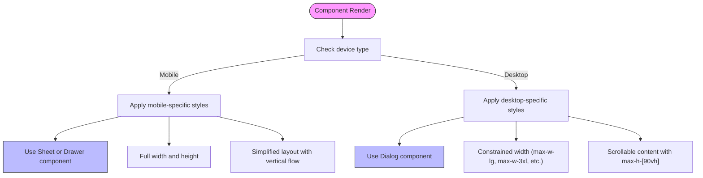

**Diagram sources**
- [use-mobile.tsx](file://src/hooks/use-mobile.tsx#L5-L32)
- [sheet.tsx](file://src/components/ui/sheet.tsx#L8-L107)
- [drawer.tsx](file://src/components/ui/drawer.tsx#L6-L87)

### Accessibility Features
The modal components implement comprehensive accessibility features to ensure compliance with WCAG standards and provide an inclusive user experience.

```mermaid
flowchart TD
AccessibilityFeatures[Accessibility Features] --> KeyboardNavigation["Keyboard Navigation"]
AccessibilityFeatures --> FocusManagement["Focus Management"]
AccessibilityFeatures --> ARIAAttributes["ARIA Attributes"]
AccessibilityFeatures --> ScreenReaderSupport["Screen Reader Support"]
AccessibilityFeatures --> ColorContrast["Color Contrast"]
KeyboardNavigation --> TabOrder["Logical tab order"]
KeyboardNavigation --> EscapeClose["Escape key closes modal"]
KeyboardNavigation --> EnterSubmit["Enter key submits forms"]
FocusManagement --> InitialFocus["Focus on first interactive element"]
FocusManagement --> TrapFocus["Trap focus within modal"]
FocusManagement --> ReturnFocus["Return focus to trigger"]
ARIAAttributes --> RoleDialog["role='dialog'"]
ARIAAttributes --> AriaLabelledby["aria-labelledby"]
ARIAAttributes --> AriaDescribedby["aria-describedby"]
ARIAAttributes --> AriaModal["aria-modal='true'"]
ScreenReaderSupport --> SROnly["sr-only class for hidden text"]
ScreenReaderSupport --> DescriptiveText["Clear, descriptive text"]
ColorContrast --> WCAGCompliance["WCAG AA/AAA compliance"]
ColorContrast --> TextBackground["Sufficient text/background contrast"]
```

**Diagram sources**
- [dialog.tsx](file://src/components/ui/dialog.tsx#L15-L51)
- [sheet.tsx](file://src/components/ui/sheet.tsx#L16-L28)
- [drawer.tsx](file://src/components/ui/drawer.tsx#L17-L22)

## Styling & Theming
The modal components leverage Tailwind CSS and design tokens for consistent styling and theming across the application, allowing for easy customization and brand alignment.

### Style Customization Options
The components provide various customization options through Tailwind CSS classes and component props, enabling developers to adapt the appearance to specific needs.

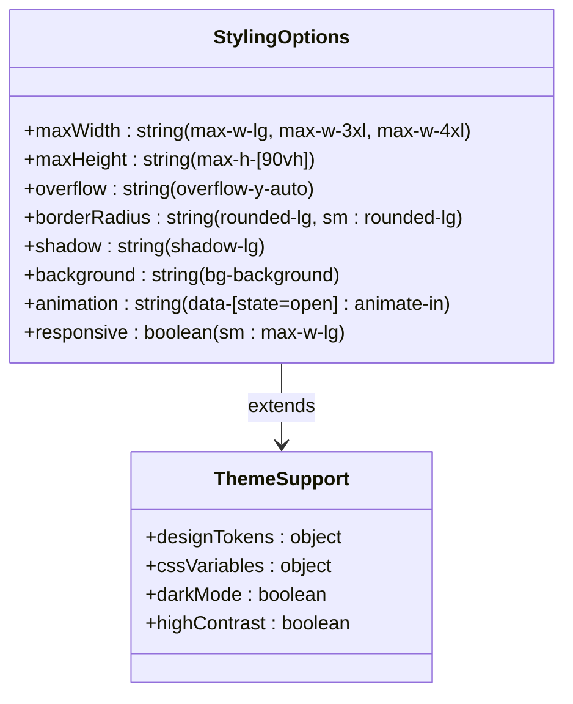

**Diagram sources**
- [dialog.tsx](file://src/components/ui/dialog.tsx#L30-L43)
- [sheet.tsx](file://src/components/ui/sheet.tsx#L31-L47)
- [lib/designTokens.ts](file://src/lib/designTokens.ts)

## Performance Considerations
The modal components are optimized for performance, with considerations for rendering efficiency, data loading, and user experience during asynchronous operations.

### Modal Rendering Optimization
The components implement several performance optimizations to ensure smooth rendering and interaction.

```mermaid
flowchart TD
PerformanceOptimizations[Performance Optimizations] --> LazyRendering["Lazy Rendering"]
PerformanceOptimizations --> EfficientRe renders["Efficient Re-renders"]
PerformanceOptimizations --> Memoization["Memoization"]
PerformanceOptimizations --> CodeSplitting["Code Splitting"]
LazyRendering --> ConditionalRender["Conditional rendering based on 'open' prop"]
LazyRendering --> PortalOptimization["Use of Portals for efficient DOM manipulation"]
EfficientRe renders --> StateMinimization["Minimize state updates"]
EfficientRe renders --> EventHandlers["Optimize event handlers with useCallback"]
Memoization --> ReactMemo["Use React.memo for pure components"]
Memoization --> useMemo["Use useMemo for expensive calculations"]
CodeSplitting --> DynamicImport["Dynamic import for heavy components"]
CodeSplitting --> BundleOptimization["Tree shaking and bundle optimization"]
```

**Diagram sources**
- [dialog.tsx](file://src/components/ui/dialog.tsx#L30-L51)
- [OrderDetailModal.tsx](file://src/components/admin/OrderDetailModal.tsx#L27-L228)
- [SupplierOrderDetailModal.tsx](file://src/components/supplier/SupplierOrderDetailModal.tsx#L26-L288)

### Data Loading Strategies
The components implement efficient data loading strategies to minimize latency and provide feedback during asynchronous operations.

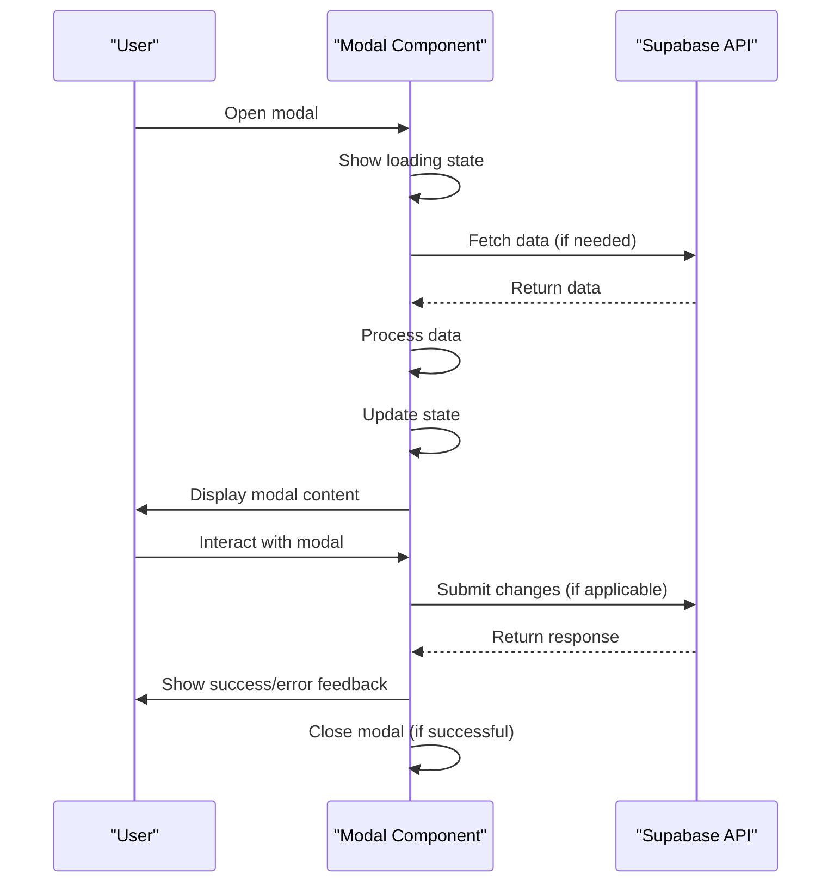

**Diagram sources**
- [SupplierAssignmentDialog.tsx](file://src/components/admin/SupplierAssignmentDialog.tsx#L40-L67)
- [OrderDetailsDialog.tsx](file://src/components/admin/OrderDetailsDialog.tsx#L37-L38)
- [EmailQuoteModal.tsx](file://src/components/quote/EmailQuoteModal.tsx#L32-L96)

## Usage Examples

### Integration with Base Components
The modal components are built by extending the base shadcn/ui components, demonstrating how to create specialized interfaces while maintaining consistency.

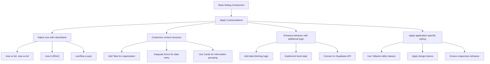

**Diagram sources**
- [dialog.tsx](file://src/components/ui/dialog.tsx#L30-L43)
- [OrderDetailsDialog.tsx](file://src/components/admin/OrderDetailsDialog.tsx#L48-L267)
- [CreateSupplierOrderDialog.tsx](file://src/components/admin/CreateSupplierOrderDialog.tsx#L105-L201)

### Responsive Implementation
The components adapt their presentation based on device type, using different base components for mobile and desktop experiences.

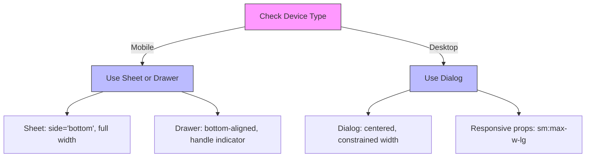

**Diagram sources**
- [use-mobile.tsx](file://src/hooks/use-mobile.tsx#L5-L32)
- [sheet.tsx](file://src/components/ui/sheet.tsx#L31-L47)
- [drawer.tsx](file://src/components/ui/drawer.tsx#L31-L38)

## Conclusion
The modal and dialog components in sleekapp-v100 provide a comprehensive system for user interactions across different roles and workflows. Built on the solid foundation of shadcn/ui components, these modals extend the base functionality with specialized features for order management, supplier assignment, quote handling, and performance reviews. The components follow consistent design patterns while adapting to specific use cases, with careful attention to responsive behavior, accessibility, and performance. By leveraging Tailwind CSS and design tokens, the components maintain visual consistency while allowing for customization. The architecture supports efficient data loading and provides clear feedback during asynchronous operations, creating a seamless user experience across the application.