# UI Components Library

<cite>
**Referenced Files in This Document**   
- [button.tsx](file://src/components/ui/button.tsx)
- [card.tsx](file://src/components/ui/card.tsx)
- [input.tsx](file://src/components/ui/input.tsx)
- [badge.tsx](file://src/components/ui/badge.tsx)
- [dialog.tsx](file://src/components/ui/dialog.tsx)
- [form.tsx](file://src/components/ui/form.tsx)
- [tabs.tsx](file://src/components/ui/tabs.tsx)
- [table.tsx](file://src/components/ui/table.tsx)
- [tooltip.tsx](file://src/components/ui/tooltip.tsx)
- [LoopTraceFeatures.tsx](file://src/components/home/LoopTraceFeatures.tsx)
- [designTokens.ts](file://src/lib/designTokens.ts)
- [animations.ts](file://src/lib/animations.ts)
- [tailwind.config.ts](file://tailwind.config.ts)
- [skeleton.tsx](file://src/components/ui/skeleton.tsx)
- [alert.tsx](file://src/components/ui/alert.tsx)
</cite>

## Table of Contents
1. [Introduction](#introduction)
2. [Design System Overview](#design-system-overview)
3. [Core UI Components](#core-ui-components)
4. [Form Components](#form-components)
5. [Interactive Components](#interactive-components)
6. [Custom Components](#custom-components)
7. [Theming and Styling](#theming-and-styling)
8. [Animations and Transitions](#animations-and-transitions)
9. [Accessibility and Responsive Design](#accessibility-and-responsive-design)
10. [Component Composition Patterns](#component-composition-patterns)

## Introduction

The UI Components Library for sleekapp-v100 is a comprehensive collection of reusable components built on modern React patterns with shadcn/ui primitives and custom components. The library follows a design system approach with consistent visual language, accessibility standards, and responsive behavior across all components.

The component library serves both buyer and supplier interfaces, providing a cohesive experience throughout the application. It leverages Tailwind CSS for styling, Framer Motion for animations, and implements WCAG 2.1 accessibility standards.

**Section sources**
- [tailwind.config.ts](file://tailwind.config.ts#L1-L196)

## Design System Overview

The design system for sleekapp-v100 is built around a comprehensive set of design tokens that ensure consistency across all components. The system follows modern design principles with a focus on usability, accessibility, and brand alignment.

### Color System
The color system is based on a primary blue palette (LoopTrace™ Blue) and accent orange (Energy Orange), with semantic colors for success, warning, error, and information states. The system includes a modern gray scale for neutral elements.

### Typography
The typography system uses Inter as the primary font family for headings and body text, with Open Sans and Lato as fallbacks. The system defines specific font sizes for headings (h1-h4) and body text, with mobile-specific variants for responsive design.

### Spacing and Layout
The layout system follows a 4px grid with consistent spacing values. Section spacing is defined at 80px (desktop) and 48px (mobile), with component spacing at 24px to ensure adequate white space and visual hierarchy.

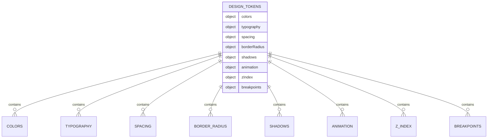

**Diagram sources**
- [designTokens.ts](file://src/lib/designTokens.ts#L6-L205)

**Section sources**
- [designTokens.ts](file://src/lib/designTokens.ts#L6-L205)
- [tailwind.config.ts](file://tailwind.config.ts#L19-L196)

## Core UI Components

The core UI components form the foundation of the component library, providing basic building blocks for the application interface.

### Button Component

The Button component supports multiple variants and sizes, with consistent styling and interactive states. It uses class-variance-authority (CVA) for variant management and implements accessible keyboard navigation.

**Props/Attributes:**
- `variant`: default, gold, coral, outline, outlineGold, secondary, ghost, link, destructive
- `size`: default, sm, lg, icon
- `asChild`: boolean to render as a child element
- Standard HTML button attributes

**Visual States:**
- Default: Primary blue background with white text
- Hover: Darker background with enhanced shadow
- Focus: Visible ring outline
- Disabled: Reduced opacity with pointer events disabled

**Accessibility Features:**
- Proper ARIA roles and attributes
- Keyboard navigation support
- Focus management
- Screen reader compatibility

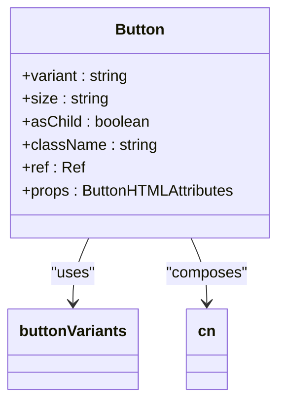

**Diagram sources**
- [button.tsx](file://src/components/ui/button.tsx#L7-L51)

### Card Component

The Card component provides a container for related content with consistent styling and interactive behavior. It supports multiple sub-components for structured content layout.

**Sub-components:**
- CardHeader: Top section for titles and descriptions
- CardTitle: Heading with semantic markup
- CardDescription: Supporting text
- CardContent: Main content area
- CardFooter: Bottom section for actions

**Visual Features:**
- Rounded corners (12px radius)
- Border with subtle shadow
- Hover state with enhanced shadow
- Consistent padding (32px)

**Accessibility Features:**
- Semantic HTML structure
- Proper heading hierarchy
- Focusable elements within card

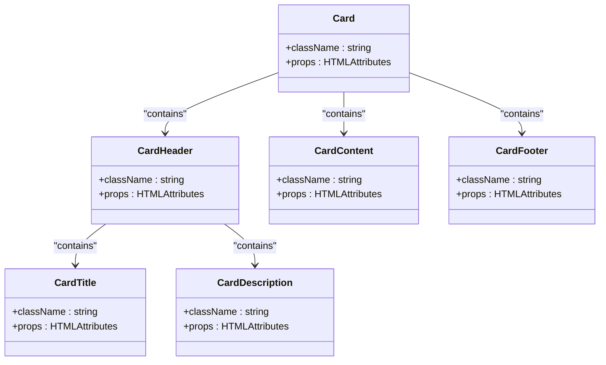

**Diagram sources**
- [card.tsx](file://src/components/ui/card.tsx#L5-L44)

### Badge Component

The Badge component displays small status indicators or labels with different visual styles based on context.

**Variants:**
- default: Primary blue background
- secondary: Secondary color background
- destructive: Red background for error states
- outline: Border-only style

**Visual Features:**
- Rounded pill shape (full border radius)
- Subtle border
- Consistent text size (12px)
- Hover states for interactive badges

**Accessibility Features:**
- Proper contrast ratios
- Screen reader visibility
- Keyboard focus support

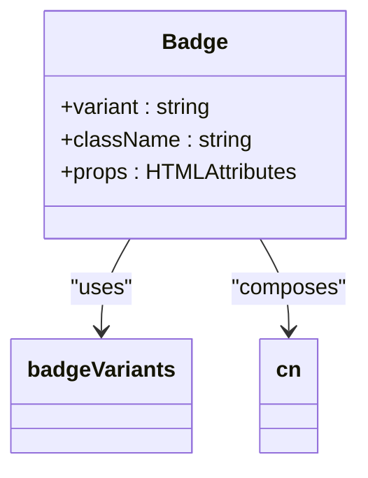

**Diagram sources**
- [badge.tsx](file://src/components/ui/badge.tsx#L6-L30)

**Section sources**
- [button.tsx](file://src/components/ui/button.tsx#L7-L51)
- [card.tsx](file://src/components/ui/card.tsx#L5-L44)
- [badge.tsx](file://src/components/ui/badge.tsx#L6-L30)

## Form Components

The form components provide a structured approach to user input with validation, accessibility, and consistent styling.

### Input Component

The Input component handles text-based user input with consistent styling and accessibility features.

**Props/Attributes:**
- Standard HTML input attributes
- type: text, email, password, number, etc.
- className for custom styling

**Visual States:**
- Default: Light border with white background
- Focus: Visible ring outline
- Disabled: Reduced opacity
- Error: Red border (when used with form validation)

**Accessibility Features:**
- Proper label association
- ARIA attributes for screen readers
- Keyboard navigation
- Focus management

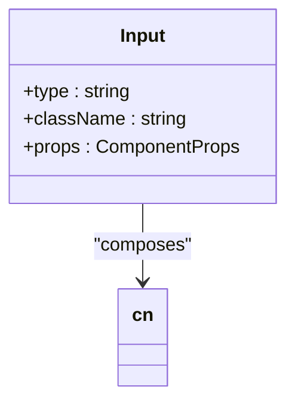

**Diagram sources**
- [input.tsx](file://src/components/ui/input.tsx#L5-L23)

### Form Component

The Form component provides a wrapper for form elements with React Hook Form integration for state management and validation.

**Composition:**
- Form: Root form provider
- FormItem: Wrapper for form fields
- FormLabel: Accessible labels
- FormControl: Input container
- FormDescription: Helper text
- FormMessage: Validation messages

**Features:**
- React Hook Form integration
- Context-based field management
- Automatic error handling
- Accessibility support

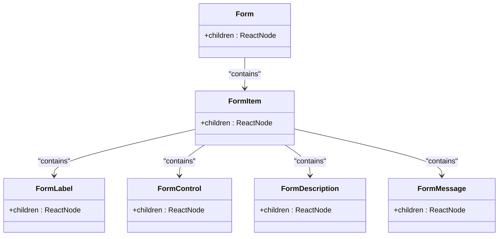

**Diagram sources**
- [form.tsx](file://src/components/ui/form.tsx#L9-L130)

### Dialog Component

The Dialog component provides modal dialogs with proper accessibility and focus management.

**Composition:**
- Dialog: Root component
- DialogTrigger: Opens the dialog
- DialogPortal: Renders content in portal
- DialogOverlay: Backdrop
- DialogContent: Main dialog container
- DialogHeader: Header section
- DialogFooter: Footer section
- DialogTitle: Accessible title
- DialogDescription: Accessible description

**Features:**
- Focus trapping
- Escape key dismissal
- Click outside dismissal
- Screen reader support
- Animation support

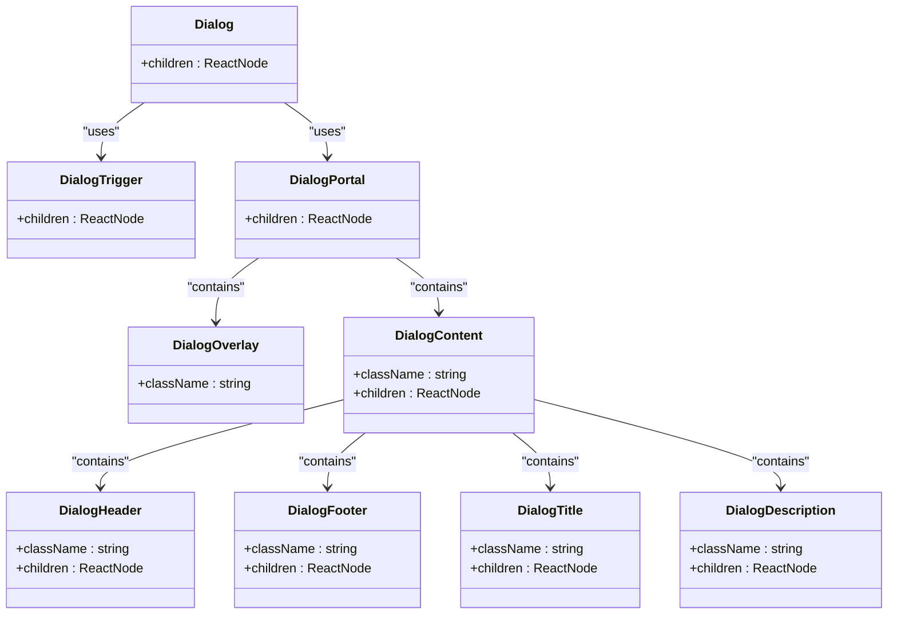

**Diagram sources**
- [dialog.tsx](file://src/components/ui/dialog.tsx#L7-L96)

**Section sources**
- [input.tsx](file://src/components/ui/input.tsx#L5-L23)
- [form.tsx](file://src/components/ui/form.tsx#L9-L130)
- [dialog.tsx](file://src/components/ui/dialog.tsx#L7-L96)

## Interactive Components

The interactive components enhance user experience with dynamic behavior and visual feedback.

### Tabs Component

The Tabs component allows users to switch between different content sections.

**Composition:**
- Tabs: Root component
- TabsList: Container for tab triggers
- TabsTrigger: Individual tab button
- TabsContent: Content for each tab

**Behavior:**
- Keyboard navigation (arrow keys)
- Focus management
- Smooth transitions between tabs
- Visual indication of active tab

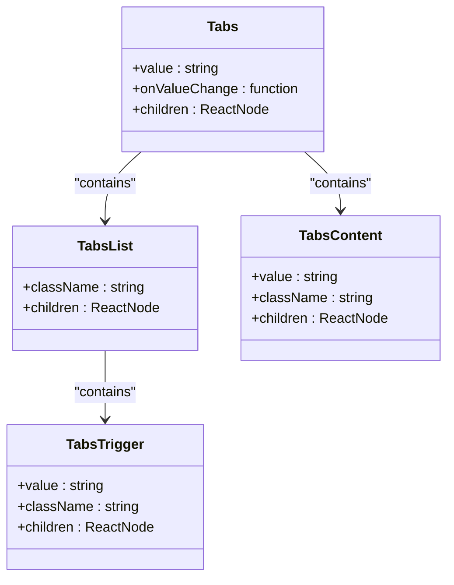

**Diagram sources**
- [tabs.tsx](file://src/components/ui/tabs.tsx#L6-L54)

### Table Component

The Table component displays tabular data with consistent styling and accessibility features.

**Composition:**
- Table: Root container
- TableHeader: Header section
- TableBody: Body section
- TableFooter: Footer section
- TableRow: Individual row
- TableHead: Header cell
- TableCell: Data cell
- TableCaption: Table description

**Features:**
- Responsive overflow handling
- Hover states for rows
- Selected state indication
- Consistent spacing and alignment

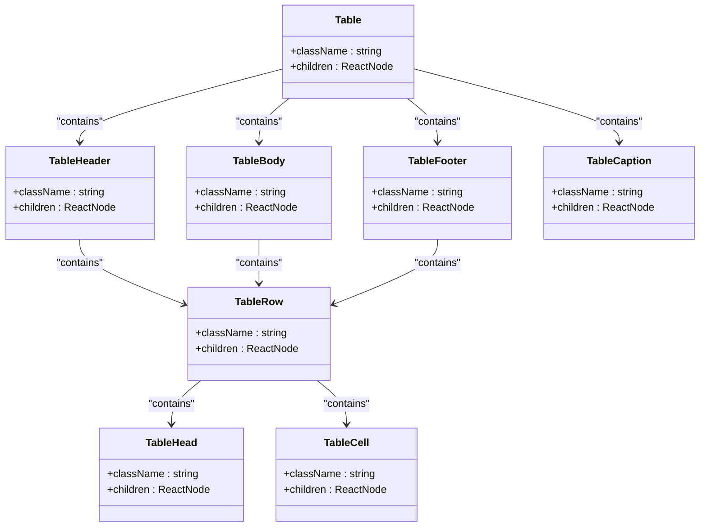

**Diagram sources**
- [table.tsx](file://src/components/ui/table.tsx#L5-L73)

### Tooltip Component

The Tooltip component provides additional information on hover or focus.

**Composition:**
- Tooltip: Root component
- TooltipTrigger: Element that triggers tooltip
- TooltipContent: Content displayed in tooltip
- TooltipProvider: Context provider for tooltip behavior

**Features:**
- Positioning (side offset)
- Animation (fade and zoom)
- Accessibility (keyboard navigation)
- Dismissal on escape key

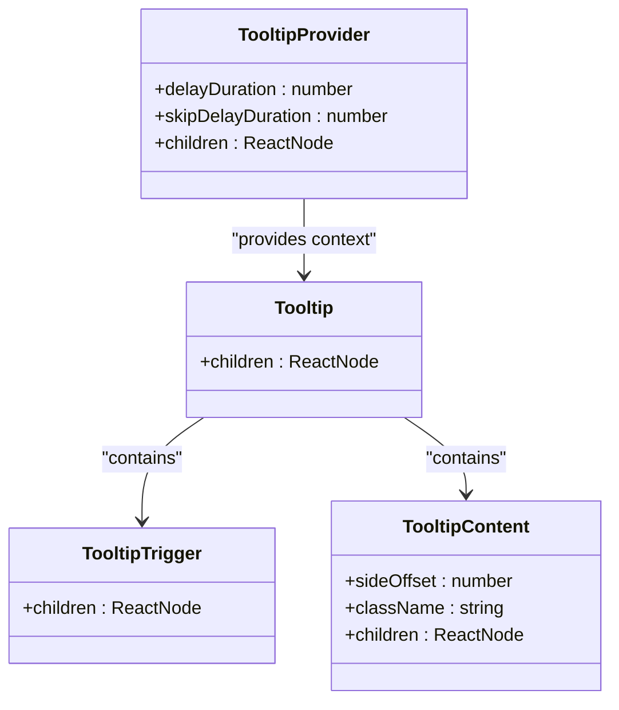

**Diagram sources**
- [tooltip.tsx](file://src/components/ui/tooltip.tsx#L8-L29)

**Section sources**
- [tabs.tsx](file://src/components/ui/tabs.tsx#L6-L54)
- [table.tsx](file://src/components/ui/table.tsx#L5-L73)
- [tooltip.tsx](file://src/components/ui/tooltip.tsx#L8-L29)

## Custom Components

The custom components extend the primitive components to provide application-specific functionality.

### LoopTraceFeatures Component

The LoopTraceFeatures component showcases the AI-powered features of the platform with animated visualizations.

**Composition:**
- AI Quote Generator: Animated step-by-step process
- Real-Time Stats: Performance metrics with badges
- LoopTrace Timeline: Production tracking visualization
- Call-to-Action: Primary action button

**Features:**
- Framer Motion animations
- Auto-advancing steps
- Real-time data visualization
- Responsive layout

**Props/Attributes:**
- No external props (self-contained component)

**Visual States:**
- Active step highlighting
- Animated progress indicators
- Hover effects on interactive elements
- Responsive layout adjustments

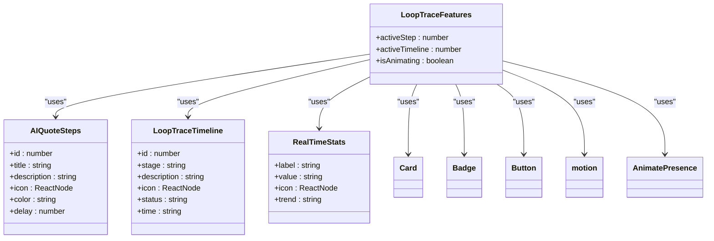

**Diagram sources**
- [LoopTraceFeatures.tsx](file://src/components/home/LoopTraceFeatures.tsx#L115-L412)

**Section sources**
- [LoopTraceFeatures.tsx](file://src/components/home/LoopTraceFeatures.tsx#L115-L412)

## Theming and Styling

The theming system provides consistent visual styling across all components using design tokens and Tailwind CSS.

### Design Tokens

The design tokens system defines all visual properties in a centralized location, ensuring consistency across the application.

**Token Categories:**
- Colors: Primary, accent, semantic, and neutral colors
- Typography: Font families, sizes, weights, and line heights
- Spacing: Grid-based spacing system
- Border Radius: Consistent corner rounding
- Shadows: Elevation levels
- Animation: Duration and easing curves
- Z-Index: Layering system
- Breakpoints: Responsive design thresholds

**Implementation:**
- Exported as a const object for type safety
- Individual token groups exported for convenience
- Used throughout components via direct import

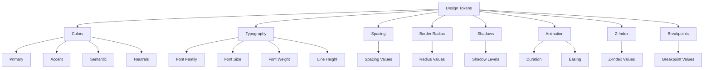

**Diagram sources**
- [designTokens.ts](file://src/lib/designTokens.ts#L6-L205)

### Tailwind Configuration

The Tailwind configuration extends the default theme with application-specific values that align with the design system.

**Customizations:**
- Font families with semantic naming
- Font sizes with responsive variants
- Spacing with semantic names
- Colors using CSS variables
- Border radius with component-specific values
- Box shadows with named variants
- Keyframes for custom animations
- Animation utilities

**CSS Variables:**
- Used for theme customization
- Support dark mode
- Enable runtime theme switching
- Provide fallback values

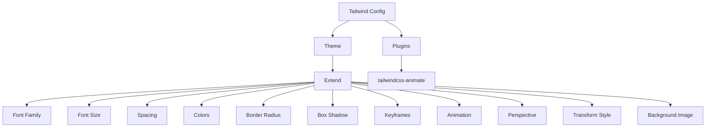

**Diagram sources**
- [tailwind.config.ts](file://tailwind.config.ts#L10-L196)

**Section sources**
- [designTokens.ts](file://src/lib/designTokens.ts#L6-L205)
- [tailwind.config.ts](file://tailwind.config.ts#L10-L196)

## Animations and Transitions

The animation system provides consistent motion design across the application using Framer Motion.

### Animation Variants

The animation variants system defines reusable motion configurations for common animation patterns.

**Variants:**
- pageTransition: Page entry and exit
- fadeIn: Simple fade in
- slideInBottom: Slide up from bottom
- slideInRight: Slide in from right
- slideInLeft: Slide in from left
- fadeInUp: Fade and move up
- scaleUp: Scale up with easing
- bounceIn: Spring-based bounce
- staggerContainer: Staggered children animation
- staggerItem: Individual item in stagger
- skeletonPulse: Loading skeleton pulse
- progressFill: Progress bar fill
- counterAnimation: Number counting
- shake: Error shake
- ripple: Ripple effect
- hoverLift: Card hover lift
- buttonPress: Button press feedback
- expandCollapse: Expand/collapse
- float: Subtle floating motion
- spin: Continuous rotation
- confettiBurst: Celebration burst
- badgePulse: Badge notification pulse
- drawerSlide: Drawer slide animation
- backdropFade: Modal backdrop fade
- tooltipArrow: Tooltip arrow animation

**Implementation:**
- Exported as const objects
- Type-safe with Framer Motion Variants
- Reusable across components
- Configurable duration and easing

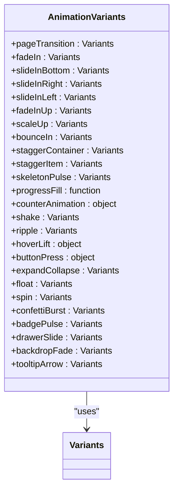

**Diagram sources**
- [animations.ts](file://src/lib/animations.ts#L8-L281)

### Animation Usage

Animations are applied to components using Framer Motion's motion components and animation props.

**Patterns:**
- Initial state definition
- Animate state definition
- Exit state definition
- Viewport triggering
- Staggered animations
- While hover/tap effects
- Custom transition curves

**Performance Considerations:**
- Hardware acceleration
- Optimized transforms
- Efficient re-renders
- Memoized variants

**Section sources**
- [animations.ts](file://src/lib/animations.ts#L8-L281)

## Accessibility and Responsive Design

The component library follows WCAG 2.1 guidelines and implements responsive design principles.

### Accessibility Features

The components implement comprehensive accessibility features to ensure usability for all users.

**WCAG Compliance:**
- Color contrast ratios meet AA standards
- Keyboard navigation support
- Screen reader compatibility
- Focus management
- ARIA attributes
- Semantic HTML
- Alternative text for icons
- Form validation with accessible feedback

**Implementation:**
- Proper heading hierarchy
- Label associations
- Focus indicators
- Skip links
- Landmark roles
- Accessible names
- Error identification
- Status messages

### Responsive Design

The components adapt to different screen sizes using a mobile-first approach.

**Breakpoints:**
- sm: 640px
- md: 768px
- lg: 1024px
- xl: 1280px
- 2xl: 1536px

**Responsive Patterns:**
- Fluid layouts
- Flexible grids
- Adaptive typography
- Touch-friendly targets
- Conditional rendering
- Stackable layouts
- Hidden/show based on screen size

**Mobile-Specific Features:**
- Larger touch targets
- Simplified navigation
- Collapsible sections
- Vertical stacking
- Gesture support

**Section sources**
- [tailwind.config.ts](file://tailwind.config.ts#L194-L196)
- [designTokens.ts](file://src/lib/designTokens.ts#L194-L200)

## Component Composition Patterns

The component library follows established composition patterns for flexibility and reusability.

### Slot Pattern

The slot pattern allows components to accept children and render them in specific locations.

**Implementation:**
- Uses @radix-ui/react-slot
- Preserves component props
- Enables polymorphic components
- Supports asChild prop

**Benefits:**
- Flexible content insertion
- Preserves event handlers
- Maintains component identity
- Enables wrapper components

### Compound Components

Compound components provide a structured API for related components that work together.

**Examples:**
- Card with Header, Title, Description, Content, Footer
- Form with Item, Label, Control, Description, Message
- Tabs with List, Trigger, Content
- Dialog with Trigger, Content, Header, Footer, Title, Description

**Benefits:**
- Clear component relationships
- Shared context
- Consistent styling
- Type-safe composition

### Context API

The context API provides shared state and functionality to component trees.

**Examples:**
- FormFieldContext for form field management
- FormItemContext for form item IDs
- Theme context for dark mode
- Animation context for shared motion values

**Benefits:**
- Avoids prop drilling
- Enables deep component composition
- Provides shared state
- Supports cross-component communication

**Section sources**
- [button.tsx](file://src/components/ui/button.tsx#L39-L40)
- [form.tsx](file://src/components/ui/form.tsx#L18-L60)
- [dialog.tsx](file://src/components/ui/dialog.tsx#L2-L3)