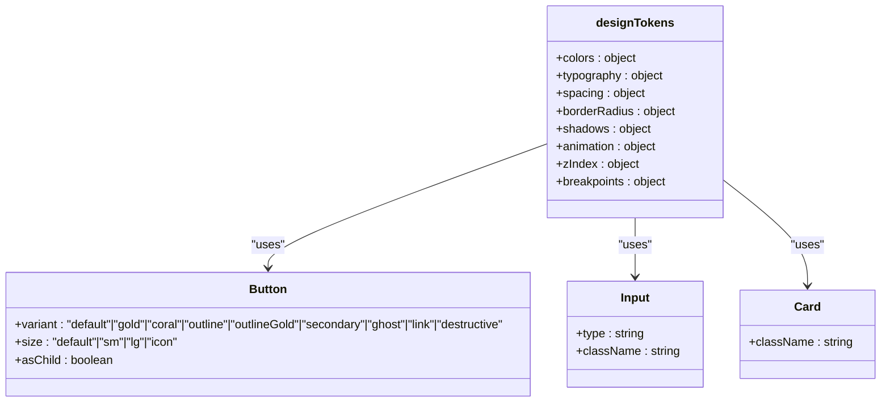
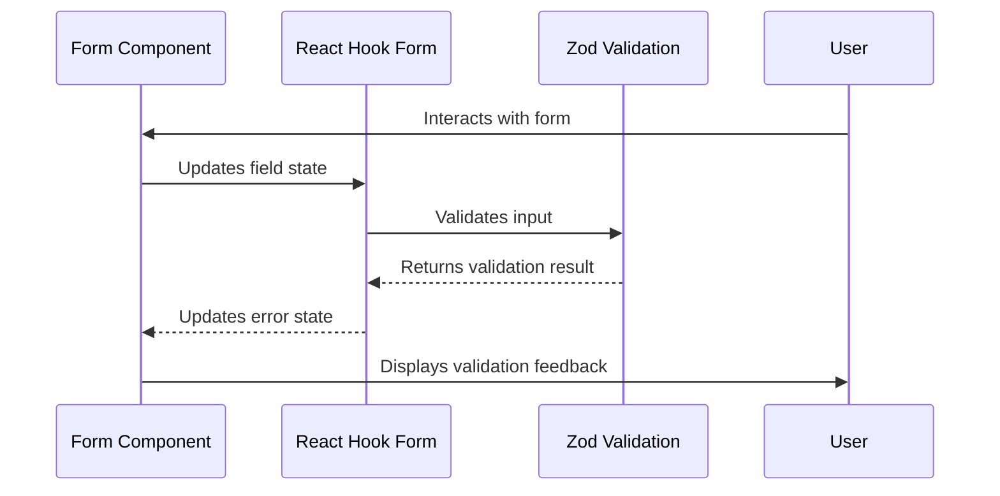

# shadcn/ui Primitives

<cite>
**Referenced Files in This Document**   
- [button.tsx](file://src/components/ui/button.tsx)
- [input.tsx](file://src/components/ui/input.tsx)
- [checkbox.tsx](file://src/components/ui/checkbox.tsx)
- [select.tsx](file://src/components/ui/select.tsx)
- [dialog.tsx](file://src/components/ui/dialog.tsx)
- [card.tsx](file://src/components/ui/card.tsx)
- [table.tsx](file://src/components/ui/table.tsx)
- [tabs.tsx](file://src/components/ui/tabs.tsx)
- [tooltip.tsx](file://src/components/ui/tooltip.tsx)
- [form.tsx](file://src/components/ui/form.tsx)
- [textarea.tsx](file://src/components/ui/textarea.tsx)
- [switch.tsx](file://src/components/ui/switch.tsx)
- [badge.tsx](file://src/components/ui/badge.tsx)
- [label.tsx](file://src/components/ui/label.tsx)
- [designTokens.ts](file://src/lib/designTokens.ts)
- [CustomerSignupForm.tsx](file://src/components/auth/CustomerSignupForm.tsx)
- [OfflineFormExample.tsx](file://src/components/examples/OfflineFormExample.tsx)
</cite>

## Table of Contents
1. [Introduction](#introduction)
2. [Design System Integration](#design-system-integration)
3. [Core Components](#core-components)
   - [Button](#button)
   - [Input](#input)
   - [Checkbox](#checkbox)
   - [Select](#select)
   - [Dialog](#dialog)
   - [Card](#card)
   - [Table](#table)
   - [Tabs](#tabs)
   - [Tooltip](#tooltip)
   - [Form](#form)
4. [Accessibility and WCAG Compliance](#accessibility-and-wcag-compliance)
5. [Component Composition Patterns](#component-composition-patterns)
6. [Best Practices](#best-practices)

## Introduction
The shadcn/ui primitive components in sleekapp-v100 provide a comprehensive design system for building consistent, accessible, and visually appealing user interfaces. These components leverage Tailwind CSS for styling and are built on top of Radix UI primitives to ensure proper accessibility and behavior. The components are designed to work seamlessly with React Hook Form and Zod validation, providing a robust foundation for form handling and user interaction.

**Section sources**
- [button.tsx](file://src/components/ui/button.tsx)
- [input.tsx](file://src/components/ui/input.tsx)
- [checkbox.tsx](file://src/components/ui/checkbox.tsx)

## Design System Integration
The shadcn/ui components integrate with the application's design system through the use of design tokens defined in the designTokens.ts file. These tokens provide a consistent color palette, typography, spacing, and other visual properties across all components.

**Diagram sources**
- [designTokens.ts](file://src/lib/designTokens.ts)
- [button.tsx](file://src/components/ui/button.tsx)
- [input.tsx](file://src/components/ui/input.tsx)
- [card.tsx](file://src/components/ui/card.tsx)

**Section sources**
- [designTokens.ts](file://src/lib/designTokens.ts)

## Core Components

### Button
The Button component provides multiple variants and sizes for different use cases. It supports accessibility features like focus rings and disabled states.

**Props:**
- `variant`: Controls the visual style (default, gold, coral, outline, outlineGold, secondary, ghost, link, destructive)
- `size`: Controls the size (default, sm, lg, icon)
- `asChild`: When true, renders as a Slot component
- Inherits all standard HTML button attributes

**Visual Appearance:**
- Default buttons have a primary background with hover effects
- Outline buttons have a border with hover background fill
- Icon buttons are square with a fixed size
- All buttons have focus rings and disabled opacity

**Section sources**
- [button.tsx](file://src/components/ui/button.tsx)

### Input
The Input component provides a styled text input with consistent styling across the application.

**Props:**
- Inherits all standard HTML input attributes
- Supports type attribute for different input types
- Automatically applies proper styling for focus, disabled, and error states

**Visual Appearance:**
- Rounded borders with consistent padding
- Focus ring with primary color
- Disabled state with reduced opacity
- Placeholder text styling
- File input styling with transparent background

**Section sources**
- [input.tsx](file://src/components/ui/input.tsx)

### Checkbox
The Checkbox component provides an accessible checkbox input with visual feedback.

**Props:**
- Inherits all standard checkbox attributes
- Visual indicator with check mark
- Supports data-state for checked/unchecked states
- Focus ring for keyboard navigation

**Visual Appearance:**
- Square with rounded corners
- Border that changes color when checked
- Check mark icon when selected
- Hover and focus states with visual feedback

**Section sources**
- [checkbox.tsx](file://src/components/ui/checkbox.tsx)

### Select
The Select component provides a dropdown menu for selecting from a list of options.

**Props:**
- `value`: Current selected value
- `onValueChange`: Callback when value changes
- Supports multiple subcomponents (Trigger, Content, Item, etc.)
- Accessibility attributes for screen readers

**Visual Appearance:**
- Trigger displays selected value with dropdown indicator
- Content appears as a floating menu with scrollable options
- Items have hover and focus states
- Checkmark indicator for selected items
- Supports grouping and separators

**Section sources**
- [select.tsx](file://src/components/ui/select.tsx)

### Dialog
The Dialog component provides a modal dialog for displaying content and collecting user input.

**Props:**
- Subcomponents for different parts (Trigger, Content, Header, Footer, etc.)
- Overlay with backdrop and fade animation
- Close button with X icon
- Focus trapping within the dialog
- Escape key to close

**Visual Appearance:**
- Centered modal with shadow
- Fixed positioning with transform
- Overlay with semi-transparent black
- Header with title and close button
- Footer with action buttons
- Responsive design for different screen sizes

**Section sources**
- [dialog.tsx](file://src/components/ui/dialog.tsx)

### Card
The Card component provides a container for grouping related content.

**Props:**
- Subcomponents for different sections (Header, Content, Footer, etc.)
- Title and description for semantic structure
- Consistent padding and spacing
- Hover effects with shadow changes

**Visual Appearance:**
- Rounded corners with border
- Shadow with hover enhancement
- Header with title styling
- Content with proper spacing
- Footer for actions or additional information
- Consistent padding throughout

**Section sources**
- [card.tsx](file://src/components/ui/card.tsx)

### Table
The Table component provides a styled table for displaying tabular data.

**Props:**
- Subcomponents for different table parts (Header, Body, Footer, etc.)
- Row selection states
- Hover effects for rows
- Proper accessibility attributes

**Visual Appearance:**
- Clean borders between rows
- Hover state for interactive rows
- Selected state with background color
- Proper spacing and alignment
- Responsive overflow handling
- Caption support for accessibility

**Section sources**
- [table.tsx](file://src/components/ui/table.tsx)

### Tabs
The Tabs component provides a tabbed interface for organizing content.

**Props:**
- Subcomponents for different parts (List, Trigger, Content)
- Active state indication
- Keyboard navigation support
- Focus management

**Visual Appearance:**
- Tab list with background
- Active tab with background and shadow
- Smooth transitions between states
- Proper spacing between tabs
- Visual feedback for hover and focus

**Section sources**
- [tabs.tsx](file://src/components/ui/tabs.tsx)

### Tooltip
The Tooltip component provides contextual information on hover or focus.

**Props:**
- Trigger element
- Content with positioning
- Side offset for placement
- Animation for appearance

**Visual Appearance:**
- Floating container with rounded corners
- Arrow indicator for direction
- Shadow for depth
- Fade and zoom animations
- Proper z-index stacking
- Truncation for long text

**Section sources**
- [tooltip.tsx](file://src/components/ui/tooltip.tsx)

### Form
The Form component provides integration with React Hook Form for form state management and validation.

**Props:**
- `FormField`: Wrapper for form fields with context
- `FormItem`: Container for form elements
- `FormLabel`: Accessible label with error state
- `FormControl`: Slot for form control elements
- `FormDescription`: Helper text
- `FormMessage`: Validation error display

**Visual Appearance:**
- Consistent spacing between form elements
- Error styling with destructive color
- Required field indication
- Helper text for guidance
- Inline validation messages
- Proper label association

**Diagram sources**
- [form.tsx](file://src/components/ui/form.tsx)
- [CustomerSignupForm.tsx](file://src/components/auth/CustomerSignupForm.tsx)

**Section sources**
- [form.tsx](file://src/components/ui/form.tsx)

## Accessibility and WCAG Compliance
The shadcn/ui components are designed with accessibility in mind, following WCAG 2.1 guidelines.

**Keyboard Navigation:**
- All interactive elements are focusable
- Logical tab order maintained
- Keyboard shortcuts where appropriate
- Focus indicators visible

**Screen Reader Support:**
- Proper ARIA attributes
- Semantic HTML structure
- Accessible names and labels
- Status messages for dynamic content

**Color Contrast:**
- Sufficient contrast ratios
- Color not used as only means of information
- Dark mode support

**Responsive Behavior:**
- Proper scaling on different devices
- Touch targets of appropriate size
- Orientation changes handled

**Section sources**
- [button.tsx](file://src/components/ui/button.tsx)
- [input.tsx](file://src/components/ui/input.tsx)
- [checkbox.tsx](file://src/components/ui/checkbox.tsx)
- [select.tsx](file://src/components/ui/select.tsx)

## Component Composition Patterns
The shadcn/ui components are designed to be composable, allowing for flexible UI construction.

**Form Composition:**
- Form components work together with React Hook Form
- Field-level validation with Zod
- Error message propagation
- Loading states with button variants

**Example: Customer Signup Form**

```mermaid
flowchart TD
Form["<Form>"] --> FormItem1["<FormItem>"]
FormItem1 --> FormLabel1["<FormLabel>"]
FormItem1 --> FormControl1["<FormControl>"]
FormItem1 --> FormMessage1["<FormMessage>"]
Form --> FormItem2["<FormItem>"]
FormItem2 --> FormLabel2["<FormLabel>"]
FormItem2 --> FormControl2["<FormControl>"]
FormItem2 --> FormMessage2["<FormMessage>"]
Form --> SubmitButton["<Button>"]
```

**Diagram sources**
- [CustomerSignupForm.tsx](file://src/components/auth/CustomerSignupForm.tsx)
- [form.tsx](file://src/components/ui/form.tsx)

**Section sources**
- [CustomerSignupForm.tsx](file://src/components/auth/CustomerSignupForm.tsx)
- [OfflineFormExample.tsx](file://src/components/examples/OfflineFormExample.tsx)

## Best Practices
When using shadcn/ui components in sleekapp-v100, follow these best practices:

**Consistent Styling:**
- Use design tokens for customizations
- Maintain consistent spacing
- Follow typography hierarchy

**Performance:**
- Use memoization for complex components
- Avoid unnecessary re-renders
- Optimize animations

**Accessibility:**
- Always provide proper labels
- Test with screen readers
- Ensure keyboard navigability

**Maintenance:**
- Document custom variants
- Keep dependencies updated
- Test across browsers

**Section sources**
- [designTokens.ts](file://src/lib/designTokens.ts)
- [button.tsx](file://src/components/ui/button.tsx)
- [form.tsx](file://src/components/ui/form.tsx)