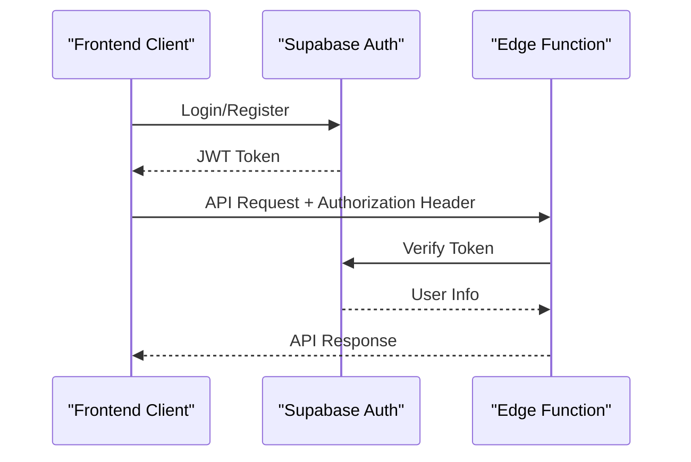
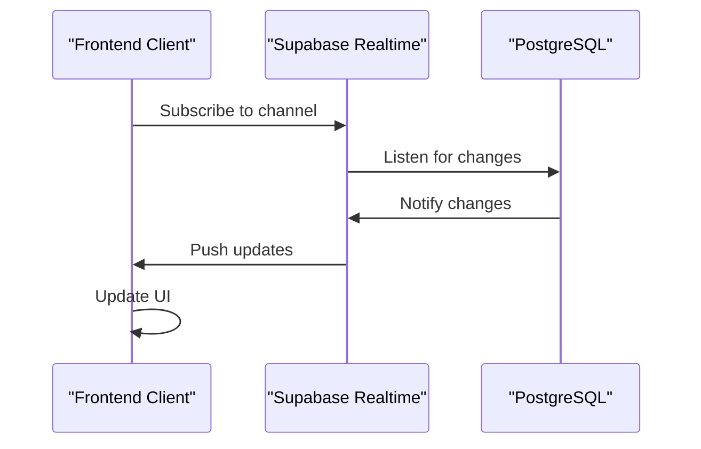

# API Reference

<cite>
**Referenced Files in This Document**
- [index.ts](file://supabase/functions/ai-conversational-quote/index.ts)
- [index.ts](file://supabase/functions/ai-quote-generator/index.ts)
- [index.ts](file://supabase/functions/parse-quote-description/index.ts)
- [index.ts](file://supabase/functions/convert-quote-to-order/index.ts)
- [index.ts](file://supabase/functions/admin-check/index.ts)
- [index.ts](file://supabase/functions/send-otp/index.ts)
- [index.ts](file://supabase/functions/submit-quote/index.ts)
- [aiQuote.ts](file://src/lib/api/aiQuote.ts)
- [client.ts](file://src/integrations/supabase/client.ts)
- [useAdminAuth.ts](file://src/hooks/useAdminAuth.ts)
- [useQuotes.ts](file://src/hooks/useQuotes.ts)
- [useRealtimeMessages.ts](file://src/hooks/useRealtimeMessages.ts)
- [database.ts](file://src/types/database.ts)
</cite>

## Table of Contents
1. [Introduction](#introduction)
2. [Authentication](#authentication)
3. [Edge Functions API](#edge-functions-api)
4. [Supabase REST API](#supabase-rest-api)
5. [Real-time Subscriptions](#real-time-subscriptions)
6. [Rate Limiting](#rate-limiting)
7. [Error Handling](#error-handling)
8. [Client Implementation Guidelines](#client-implementation-guidelines)
9. [Performance Optimization](#performance-optimization)
10. [Migration Guide](#migration-guide)

## Introduction

The sleekapp-v100 API provides comprehensive functionality for apparel manufacturing quote generation, order management, and real-time communication. The API consists of two main components:

- **Edge Functions**: Serverless functions hosted on Lovable Cloud for AI-powered quote generation and business logic
- **Supabase REST API**: Database operations and real-time subscriptions through Supabase platform

The API follows RESTful principles with JSON payloads and supports both authenticated and anonymous access patterns.

## Authentication

### JWT Token Authentication

The API uses JWT tokens for user authentication through Supabase's built-in authentication system.



**Diagram sources**
- [client.ts](file://src/integrations/supabase/client.ts#L14-L20)
- [useAdminAuth.ts](file://src/hooks/useAdminAuth.ts#L15-L46)

### Authentication Methods

| Method | Endpoint | Description |
|--------|----------|-------------|
| **Email/Password** | `/auth/v1/token` | Standard email/password authentication |
| **Magic Link** | `/auth/v1/magiclink` | Email magic link authentication |
| **OAuth** | `/auth/v1/authorize` | OAuth provider authentication |
| **JWT Token** | Header-based | Bearer token authentication |

### Admin Authentication

Admin privileges are verified through the `admin-check` edge function:

```typescript
// Example admin check request
const { data, error } = await supabase.functions.invoke('admin-check', {
  headers: {
    Authorization: `Bearer ${session.access_token}`,
  },
});
```

**Section sources**
- [client.ts](file://src/integrations/supabase/client.ts#L1-L20)
- [useAdminAuth.ts](file://src/hooks/useAdminAuth.ts#L1-L47)
- [index.ts](file://supabase/functions/admin-check/index.ts#L1-L74)

## Edge Functions API

### AI Quote Generation APIs

#### 1. ai-conversational-quote

**Endpoint**: `POST https://your-supabase-url/functions/v1/ai-conversational-quote`

**Purpose**: Generate comprehensive AI-powered quotes with market research and conversational capabilities.

**Request Schema**:
```typescript
interface QuoteRequest {
  productType: string;
  quantity: number;
  fabricType?: string;
  complexity?: string;
  additionalRequirements?: string;
  customerEmail: string;
  customerName?: string;
  country?: string;
  phoneNumber?: string;
  sessionId?: string;
  marketResearchId?: string;
  captchaToken?: string;
}
```

**Response Schema**:
```typescript
interface QuoteResponse {
  success: boolean;
  quote: {
    id: string;
    unitPrice: number;
    totalPrice: number;
    estimatedDeliveryDays: number;
    confidenceScore: number;
    priceBreakdown: {
      materials: number;
      labor: number;
      overhead: number;
      margin: number;
    };
    priceJustification: string;
    comparableProducts: Array<{
      name: string;
      price: number;
      supplier: string;
    }>;
    suggestions: string;
  };
}
```

**Rate Limits**:
- **IP-based**: 5 requests per hour
- **Email-based**: 10 requests per day
- **CAPTCHA required**: Prevents automated abuse

**Security Features**:
- reCAPTCHA v3 verification
- IP-based rate limiting
- Email validation
- Origin validation for production

**Common Use Cases**:
- Instant quote generation for customers
- Market research integration
- Price optimization recommendations
- Competitor analysis

**Section sources**
- [index.ts](file://supabase/functions/ai-conversational-quote/index.ts#L11-L24)

#### 2. ai-quote-generator

**Endpoint**: `POST https://your-supabase-url/functions/v1/ai-quote-generator`

**Purpose**: Generate AI-powered quotes with detailed manufacturing insights and cost analysis.

**Request Schema**:
```typescript
interface AIQuoteRequest {
  productType: string;
  quantity: number;
  complexityLevel?: 'simple' | 'medium' | 'complex';
  fabricType?: string;
  additionalRequirements?: string;
  customerEmail: string;
  customerName?: string;
  targetDate?: string;
  sessionId?: string;
  files?: Array<{
    name: string;
    type: string;
    data: string;
  }>;
}
```

**Response Schema**:
```typescript
interface AIQuoteResponse {
  success: boolean;
  quote: {
    id: string;
    total_price: number;
    estimated_delivery_days: number;
    quote_data: any;
    ai_suggestions: string;
  };
  timeline: Array<{
    stage: string;
    days: number;
    startDate: string;
    endDate: string;
  }>;
  aiInsights: string;
  requestId: string;
}
```

**Advanced Features**:
- **Image Analysis**: Upload design files for visual quote assessment
- **Volume Discounts**: Automatic calculation based on quantity tiers
- **Timeline Prediction**: Production stage breakdown with dates
- **Alternative Options**: Cost-effective alternatives suggestion

**Tiered Rate Limits**:
- **Authenticated Users**: 20 quotes per day
- **Anonymous Users**: 3 quotes per day per session

**Section sources**
- [index.ts](file://supabase/functions/ai-quote-generator/index.ts#L27-L37)
- [aiQuote.ts](file://src/lib/api/aiQuote.ts#L9-L25)

#### 3. parse-quote-description

**Endpoint**: `POST https://your-supabase-url/functions/v1/parse-quote-description`

**Purpose**: Extract structured information from natural language quote descriptions.

**Request Schema**:
```typescript
interface ParseRequest {
  description: string;
}
```

**Response Schema**:
```typescript
interface ParseResponse {
  success: boolean;
  parsed: {
    productType: string;
    quantity: number;
    fabricType?: string;
    complexityLevel: string;
    additionalRequirements?: string;
  };
  rawDescription: string;
}
```

**Use Cases**:
- Lead qualification from customer inquiries
- Automated quote processing
- Data enrichment for CRM systems

**Section sources**
- [index.ts](file://supabase/functions/parse-quote-description/index.ts#L15-L16)

#### 4. convert-quote-to-order

**Endpoint**: `POST https://your-supabase-url/functions/v1/convert-quote-to-order`

**Purpose**: Convert approved quotes into production orders.

**Request Schema**:
```typescript
interface ConvertRequest {
  quoteId: string;
}
```

**Response Schema**:
```typescript
interface ConvertResponse {
  success: boolean;
  order: {
    id: string;
    orderNumber: string;
    trackingToken: string;
    trackingUrl: string;
  };
}
```

**Order Creation Process**:
1. Validate quote existence and status
2. Create buyer account if needed
3. Generate order number and tracking token
4. Update quote status to "converted"
5. Send confirmation email

**Section sources**
- [index.ts](file://supabase/functions/convert-quote-to-order/index.ts#L12-L14)

### Utility Functions

#### 5. send-otp

**Endpoint**: `POST https://your-supabase-url/functions/v1/send-otp`

**Purpose**: Send one-time passwords for authentication and verification.

**Request Schema**:
```typescript
type OTPType = 'phone' | 'email-quote' | 'email-supplier';

interface OTPRequest {
  type: OTPType;
  phone?: string;
  email?: string;
  country?: string;
  captchaToken?: string;
}
```

**Response Schema**:
```typescript
interface OTPResponse {
  success: boolean;
  expiresAt: string;
  message: string;
}
```

**Rate Limits**:
- **Phone OTP**: 5 minutes between attempts
- **Email OTP**: 5 minutes between attempts
- **Daily Quote Limit**: 3 emails per day for quote requests

**Security Features**:
- Disposable email filtering
- CAPTCHA protection for supplier registration
- Email validation with regex
- Retry logic with exponential backoff

**Section sources**
- [index.ts](file://supabase/functions/send-otp/index.ts#L38-L44)

#### 6. submit-quote

**Endpoint**: `POST https://your-supabase-url/functions/v1/submit-quote`

**Purpose**: Submit quote requests from the website contact form.

**Request Schema**:
```typescript
interface SubmitQuoteRequest {
  name: string;
  email: string;
  company?: string;
  whatsapp?: string;
  productType: string;
  quantity: number;
  gauge?: string;
  targetDate?: string;
  notes: string;
}
```

**Response Schema**:
```typescript
interface SubmitQuoteResponse {
  success: boolean;
  message: string;
  id: string;
  sessionId: string;
}
```

**Section sources**
- [index.ts](file://supabase/functions/submit-quote/index.ts#L11-L21)

#### 7. admin-check

**Endpoint**: `POST https://your-supabase-url/functions/v1/admin-check`

**Purpose**: Verify admin privileges for protected routes.

**Request Headers**:
- `Authorization: Bearer <jwt-token>`

**Response Schema**:
```typescript
interface AdminCheckResponse {
  isAdmin: boolean;
  error?: string;
}
```

**Section sources**
- [index.ts](file://supabase/functions/admin-check/index.ts#L15-L74)

## Supabase REST API

### Core Tables

#### AI Quotes Table

| Field | Type | Description |
|-------|------|-------------|
| `id` | UUID | Primary key |
| `session_id` | Text | Anonymous user tracking |
| `customer_email` | Text | Customer email address |
| `customer_name` | Text | Customer name |
| `product_type` | Text | Product category |
| `quantity` | Integer | Order quantity |
| `total_price` | Decimal | Total order amount |
| `estimated_delivery_days` | Integer | Lead time in days |
| `status` | Text | Quote status |
| `created_at` | Timestamp | Quote creation time |

#### Orders Table

| Field | Type | Description |
|-------|------|-------------|
| `id` | UUID | Primary key |
| `order_number` | Text | Unique order identifier |
| `buyer_id` | UUID | Customer user ID |
| `product_type` | Text | Product category |
| `quantity` | Integer | Order quantity |
| `status` | Text | Order workflow status |
| `production_status` | Text | Production stage |
| `expected_delivery_date` | Date | Estimated completion date |

#### Suppliers Table

| Field | Type | Description |
|-------|------|-------------|
| `id` | UUID | Primary key |
| `user_id` | UUID | Associated user account |
| `company_name` | Text | Supplier company name |
| `factory_location` | Text | Manufacturing location |
| `tier` | Integer | Supplier quality tier |
| `verification_status` | Text | Verification level |

**Section sources**
- [database.ts](file://src/types/database.ts#L45-L72)

### CRUD Operations

#### Get User Quotes

```typescript
// Get quotes for authenticated users
const { data, error } = await supabase
  .from('ai_quotes')
  .select('*')
  .eq('customer_email', session.user.email)
  .order('created_at', { ascending: false });

// Get quotes for anonymous users
const { data, error } = await supabase
  .from('ai_quotes')
  .select('*')
  .eq('session_id', sessionId)
  .order('created_at', { ascending: false });
```

#### Create Quote

```typescript
const { data, error } = await supabase
  .from('quotes')
  .insert([{
    product_type: 't-shirt',
    quantity: 100,
    complexity_level: 'medium',
    fabric_type: 'cotton',
    additional_requirements: 'Screen printing on front',
    buyer_id: user?.id || null,
    session_id: !user ? sessionId : null,
  }])
  .select()
  .single();
```

#### Update Quote Status

```typescript
const { data, error } = await supabase
  .from('quotes')
  .update({ status: 'quote_provided' })
  .eq('id', quoteId)
  .select()
  .single();
```

**Section sources**
- [useQuotes.ts](file://src/hooks/useQuotes.ts#L56-L80)

## Real-time Subscriptions

### WebSocket Connections

The API provides real-time updates through Supabase's PostgreSQL change data capture (CDC) system.



**Diagram sources**
- [useRealtimeMessages.ts](file://src/hooks/useRealtimeMessages.ts#L23-L51)

### Available Channels

#### 1. Messages Channel

Real-time messaging between buyers and suppliers:

```typescript
const { data: { user } } = await supabase.auth.getUser();

const messagesChannel = supabase
  .channel('realtime-messages')
  .on('postgres_changes', {
    event: 'INSERT',
    schema: 'public',
    table: 'messages',
    filter: `recipient_id=eq.${user.id}`,
  }, (payload) => {
    console.log('New message received:', payload);
    // Update UI with new message
  })
  .subscribe();
```

#### 2. Production Updates Channel

Track order production stages:

```typescript
const productionChannel = supabase
  .channel('production-updates')
  .on('postgres_changes', {
    event: '*',
    schema: 'public',
    table: 'production_updates',
    filter: `order_id=eq.${orderId}`,
  }, (payload) => {
    // Update production timeline
  })
  .subscribe();
```

#### 3. Quote Status Channel

Monitor quote approval process:

```typescript
const quoteChannel = supabase
  .channel('quote-status')
  .on('postgres_changes', {
    event: 'UPDATE',
    schema: 'public',
    table: 'ai_quotes',
    filter: `id=eq.${quoteId}`,
  }, (payload) => {
    // Update quote status UI
  })
  .subscribe();
```

**Section sources**
- [useRealtimeMessages.ts](file://src/hooks/useRealtimeMessages.ts#L1-L61)

### Connection Management

#### Health Monitoring

```typescript
// Check connection status
const checkConnection = () => {
  const isConnected = supabase.connectionState === 'CONNECTED';
  const isReconnecting = supabase.connectionState === 'RECONNECTING';
  
  return { isConnected, isReconnecting };
};

// Periodic health check
setInterval(checkConnection, 30000);
```

#### Error Handling

```typescript
const messagesChannel = supabase
  .channel('messages')
  .on('postgres_changes', {
    event: '*',
    schema: 'public',
    table: 'messages',
  }, (payload) => {
    if (payload.eventType === 'ERROR') {
      console.error('Realtime error:', payload);
      // Attempt reconnection
      reconnectRealtime();
    }
  });
```

## Rate Limiting

### Edge Function Rate Limits

#### AI Quote Generator

| Limit Type | Daily Limit | Per IP Limit | Reset |
|------------|-------------|--------------|-------|
| **Authenticated Users** | 20 quotes/day | N/A | Midnight UTC |
| **Anonymous Users** | 3 quotes/session | N/A | Session end |
| **IP-based** | N/A | 15 quotes/day | Midnight UTC |

#### OTP Functions

| Function | Rate Limit | Window | Error Response |
|----------|------------|--------|----------------|
| **send-otp (phone)** | 1 request/5 minutes | 5 minutes | 429 Too Many Requests |
| **send-otp (email)** | 1 request/5 minutes | 5 minutes | 429 Too Many Requests |
| **send-otp (quote)** | 3 requests/day | 24 hours | 429 Too Many Requests |

#### General Edge Functions

| Function | Rate Limit | Window | Error Response |
|----------|------------|--------|----------------|
| **submit-quote** | 10 requests/hour | 1 hour | 429 Too Many Requests |
| **admin-check** | 100 requests/minute | 1 minute | 429 Too Many Requests |

### Supabase Rate Limits

| Operation | Limit | Window | Action |
|-----------|-------|--------|--------|
| **Insert** | 1,000/sec | 1 sec | Throttled |
| **Update** | 1,000/sec | 1 sec | Throttled |
| **Delete** | 1,000/sec | 1 sec | Throttled |
| **Query** | 10,000/sec | 1 sec | Throttled |

### Rate Limit Headers

```http
HTTP/1.1 200 OK
X-RateLimit-Limit: 20
X-RateLimit-Remaining: 15
X-RateLimit-Reset: 1640995200
Retry-After: 3600
```

## Error Handling

### Edge Function Errors

#### Common Error Codes

| Code | Status | Description | Resolution |
|------|--------|-------------|------------|
| `RATE_001` | 429 | Rate limit exceeded | Wait for reset time |
| `ENV_001` | 500 | Configuration error | Check environment variables |
| `CONF_001` | 404 | Product configuration unavailable | Contact support |
| `EMAIL_001` | 500 | Email service unavailable | Retry request |

#### Error Response Format

```typescript
interface ErrorResponse {
  error: string;
  code?: string;
  message?: string;
  details?: any;
  supportContact?: string;
  requestId?: string;
}
```

### Supabase Errors

#### Database Error Codes

| Code | Description | Solution |
|------|-------------|----------|
| `PGRST116` | No rows returned | Check query conditions |
| `PGRST202` | Not found | Verify resource exists |
| `PGRST211` | Conflict | Handle concurrent updates |
| `PGRST212` | Unprocessable | Validate input data |

#### Authentication Errors

```typescript
// Handle authentication errors
const { error } = await supabase.auth.signInWithPassword({
  email: 'user@example.com',
  password: 'password'
});

if (error) {
  switch (error.code) {
    case 'PGRST202':
      // User not found
      break;
    case 'PGRST211':
      // Invalid password
      break;
    default:
      // Other auth error
  }
}
```

### Client-Side Error Handling

```typescript
// Example error handling in React
const handleSubmit = async (formData) => {
  try {
    const { data, error } = await supabase.functions.invoke('ai-quote-generator', {
      body: formData
    });
    
    if (error) {
      throw new Error(error.message);
    }
    
    // Handle successful response
    setQuote(data.quote);
    
  } catch (error) {
    if (error.code === 'RATE_001') {
      toast.error('Rate limit exceeded. Please try again later.');
    } else if (error.code === 'ENV_001') {
      toast.error('Service temporarily unavailable. Please contact support.');
    } else {
      toast.error('Failed to generate quote. Please try again.');
    }
    console.error('Quote generation error:', error);
  }
};
```

## Client Implementation Guidelines

### Frontend Integration

#### 1. Supabase Client Setup

```typescript
// Initialize Supabase client
import { createClient } from '@supabase/supabase-js';
import { Database } from './types/database';

const supabase = createClient<Database>(
  import.meta.env.VITE_SUPABASE_URL,
  import.meta.env.VITE_SUPABASE_PUBLIC_KEY
);
```

#### 2. Quote Generation Workflow

```typescript
// Step 1: Generate AI Quote
const generateQuote = async (quoteData) => {
  try {
    const { data, error } = await supabase.functions.invoke('ai-quote-generator', {
      body: {
        ...quoteData,
        sessionId: getSessionId(),
        context: {
          localCalculations: getLocalPricingEstimate(quoteData),
        }
      }
    });
    
    if (error) throw error;
    return data.quote;
    
  } catch (error) {
    console.error('Quote generation failed:', error);
    throw error;
  }
};

// Step 2: Convert to Order
const convertToOrder = async (quoteId) => {
  try {
    const { data, error } = await supabase.functions.invoke('convert-quote-to-order', {
      body: { quoteId }
    });
    
    if (error) throw error;
    return data.order;
    
  } catch (error) {
    console.error('Order conversion failed:', error);
    throw error;
  }
};
```

#### 3. Real-time Updates

```typescript
// Subscribe to quote updates
const subscribeToQuotes = (quoteId, onUpdate) => {
  const channel = supabase
    .channel(`quote-${quoteId}`)
    .on('postgres_changes', {
      event: 'UPDATE',
      schema: 'public',
      table: 'ai_quotes',
      filter: `id=eq.${quoteId}`
    }, (payload) => {
      onUpdate(payload.new);
    })
    .subscribe();
    
  return () => channel.unsubscribe();
};
```

### Mobile SDK Integration

#### React Native Example

```typescript
import AsyncStorage from '@react-native-async-storage/async-storage';

// Persistent session management
const getSessionId = async () => {
  let sessionId = await AsyncStorage.getItem('quote_session_id');
  if (!sessionId) {
    sessionId = crypto.randomUUID();
    await AsyncStorage.setItem('quote_session_id', sessionId);
  }
  return sessionId;
};

// Secure token storage
const storeAuthToken = async (token) => {
  await AsyncStorage.setItem('auth_token', token);
};

const getAuthToken = async () => {
  return await AsyncStorage.getItem('auth_token');
};
```

### TypeScript Integration

```typescript
// Type-safe API calls
interface QuoteRequest {
  productType: string;
  quantity: number;
  complexityLevel?: 'simple' | 'medium' | 'complex';
  fabricType?: string;
}

interface QuoteResponse {
  id: string;
  totalPrice: number;
  estimatedDeliveryDays: number;
  confidenceScore: number;
}

const generateQuote = async (request: QuoteRequest): Promise<QuoteResponse> => {
  const { data, error } = await supabase.functions.invoke('ai-quote-generator', {
    body: request
  });
  
  if (error) throw error;
  return data.quote;
};
```

## Performance Optimization

### Edge Function Optimization

#### 1. Caching Strategies

```typescript
// In-memory caching for frequently accessed data
const cache = new Map<string, { data: any; expiresAt: number }>();

const getCachedData = async (key: string, ttl: number = 300000) => {
  const cached = cache.get(key);
  if (cached && cached.expiresAt > Date.now()) {
    return cached.data;
  }
  
  const data = await fetchDataFromAPI();
  cache.set(key, { data, expiresAt: Date.now() + ttl });
  return data;
};
```

#### 2. Concurrent Processing

```typescript
// Parallel processing for independent operations
const processQuoteRequest = async (requestData) => {
  const [marketResearch, pricingData, timelineData] = await Promise.all([
    fetchMarketResearch(requestData),
    calculatePricing(requestData),
    predictTimeline(requestData)
  ]);
  
  return {
    marketResearch,
    pricingData,
    timelineData
  };
};
```

#### 3. Connection Pooling

```typescript
// Reuse database connections
const pool = new Pool({
  connectionString: process.env.DATABASE_URL,
  max: 20,
  idleTimeoutMillis: 30000,
  connectionTimeoutMillis: 2000
});

const getConnection = async () => {
  const client = await pool.connect();
  return {
    query: (text: string, params?: any[]) => client.query(text, params),
    release: () => client.release()
  };
};
```

### Supabase Optimization

#### 1. Query Optimization

```typescript
// Efficient queries with proper indexing
const getQuotesByStatus = async (status: string) => {
  const { data, error } = await supabase
    .from('ai_quotes')
    .select('*, buyer:users(name, email)')
    .eq('status', status)
    .order('created_at', { ascending: false })
    .limit(50);
  
  return data;
};
```

#### 2. Batch Operations

```typescript
// Batch database operations
const batchUpdateProductionStages = async (updates) => {
  const { error } = await supabase.rpc('batch_update_production_stages', {
    updates: updates
  });
  
  if (error) throw error;
};
```

#### 3. Real-time Performance

```typescript
// Debounced real-time updates
const debouncedUpdate = debounce((payload) => {
  updateUI(payload.new);
}, 300);

const channel = supabase
  .channel('production-updates')
  .on('postgres_changes', {
    event: '*',
    schema: 'public',
    table: 'production_updates'
  }, debouncedUpdate)
  .subscribe();
```

### CDN and Asset Optimization

#### Static Assets

```typescript
// Optimize image loading
const loadImage = (url: string) => {
  return new Promise((resolve, reject) => {
    const img = new Image();
    img.onload = () => resolve(img);
    img.onerror = reject;
    img.src = `${url}?w=800&q=80`;
  });
};
```

#### API Response Caching

```typescript
// Client-side caching
const cache = new Map();

const fetchWithCache = async (url: string, options = {}) => {
  const key = `${url}-${JSON.stringify(options)}`;
  const cached = cache.get(key);
  
  if (cached && Date.now() - cached.timestamp < 300000) {
    return cached.data;
  }
  
  const response = await fetch(url, options);
  const data = await response.json();
  
  cache.set(key, { data, timestamp: Date.now() });
  return data;
};
```

## Migration Guide

### Version Compatibility

#### Current Version: v100

The API follows semantic versioning with backward compatibility guarantees for major versions.

#### Breaking Changes

| Version | Breaking Change | Migration Steps |
|---------|----------------|-----------------|
| v99 → v100 | Edge function URL format | Update function invocation URLs |
| v98 → v99 | Database schema changes | Run migration scripts |
| v97 → v98 | Authentication changes | Update token handling |

### Migration Checklist

#### 1. Edge Function Migration

```bash
# Deploy new edge functions
npm run deploy:functions

# Verify function availability
curl -X GET "https://your-supabase-url/functions/v1/health"
```

#### 2. Database Migration

```sql
-- Run migration scripts
BEGIN;
-- Apply schema changes
COMMIT;

-- Verify data integrity
SELECT COUNT(*) FROM ai_quotes WHERE created_at > '2024-01-01';
```

#### 3. Client Updates

```typescript
// Update API endpoints
const OLD_ENDPOINT = 'https://old-api.example.com';
const NEW_ENDPOINT = 'https://your-supabase-url/functions/v1';

// Update function calls
const oldCall = await fetch(`${OLD_ENDPOINT}/generate-quote`, { body: data });
const newCall = await supabase.functions.invoke('ai-quote-generator', { body: data });
```

### Backwards Compatibility

#### Deprecated Features

| Feature | Deprecated Since | Replacement | End of Life |
|---------|------------------|-------------|-------------|
| `legacy-quote-generator` | v99 | `ai-quote-generator` | v102 |
| `old-auth-flow` | v98 | `jwt-auth` | v101 |
| `direct-db-access` | v97 | `edge-functions` | v100 |

#### Migration Timeline

```typescript
// Grace period for deprecated features
const migrateLegacyFeature = (requestData) => {
  if (isLegacyFormat(requestData)) {
    console.warn('Legacy format detected. Please migrate to new format.');
    requestData = convertToNewFormat(requestData);
  }
  
  return processData(requestData);
};
```

### Testing Migration

#### 1. Unit Tests

```typescript
describe('API Migration', () => {
  it('should handle legacy and new formats', async () => {
    const legacyData = createLegacyQuoteData();
    const newData = createNewQuoteData();
    
    const legacyResult = await processQuote(legacyData);
    const newResult = await processQuote(newData);
    
    expect(legacyResult).toEqual(newResult);
  });
});
```

#### 2. Integration Tests

```typescript
// Test both old and new API versions
const testMigration = async () => {
  const oldVersion = await callOldAPI(quoteData);
  const newVersion = await callNewAPI(quoteData);
  
  assert.deepEqual(oldVersion, newVersion);
};
```

**Section sources**
- [aiQuote.ts](file://src/lib/api/aiQuote.ts#L1-L209)
- [useQuotes.ts](file://src/hooks/useQuotes.ts#L1-L261)