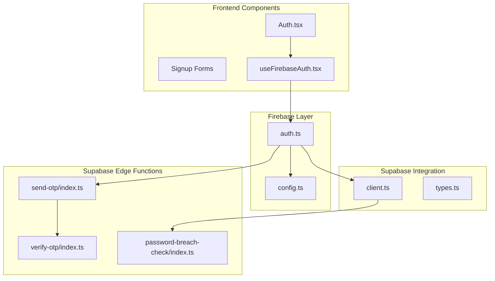
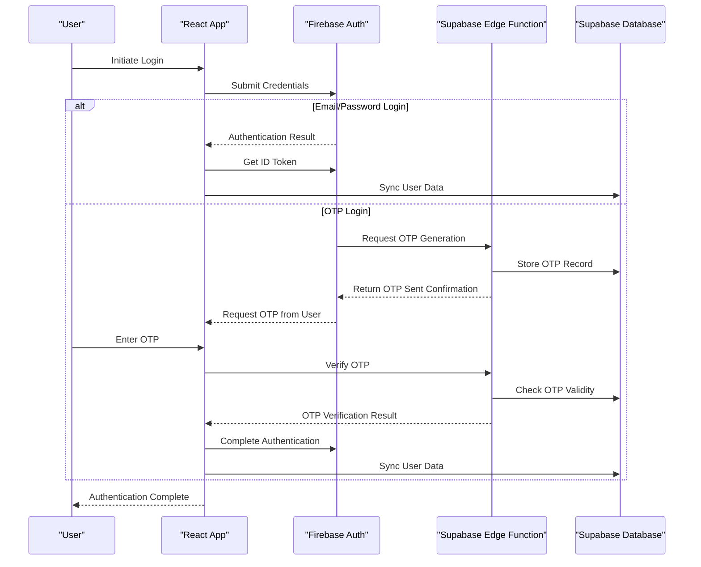
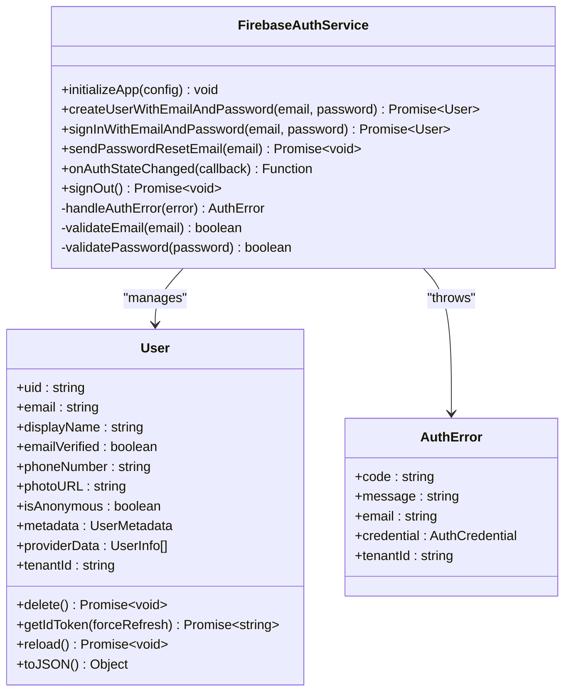
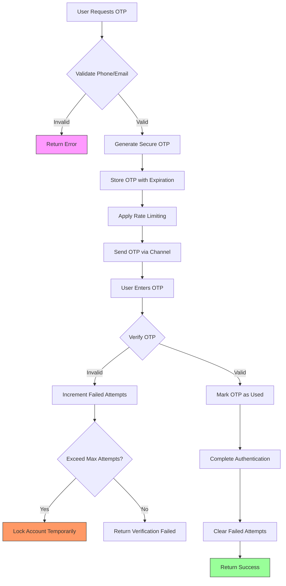
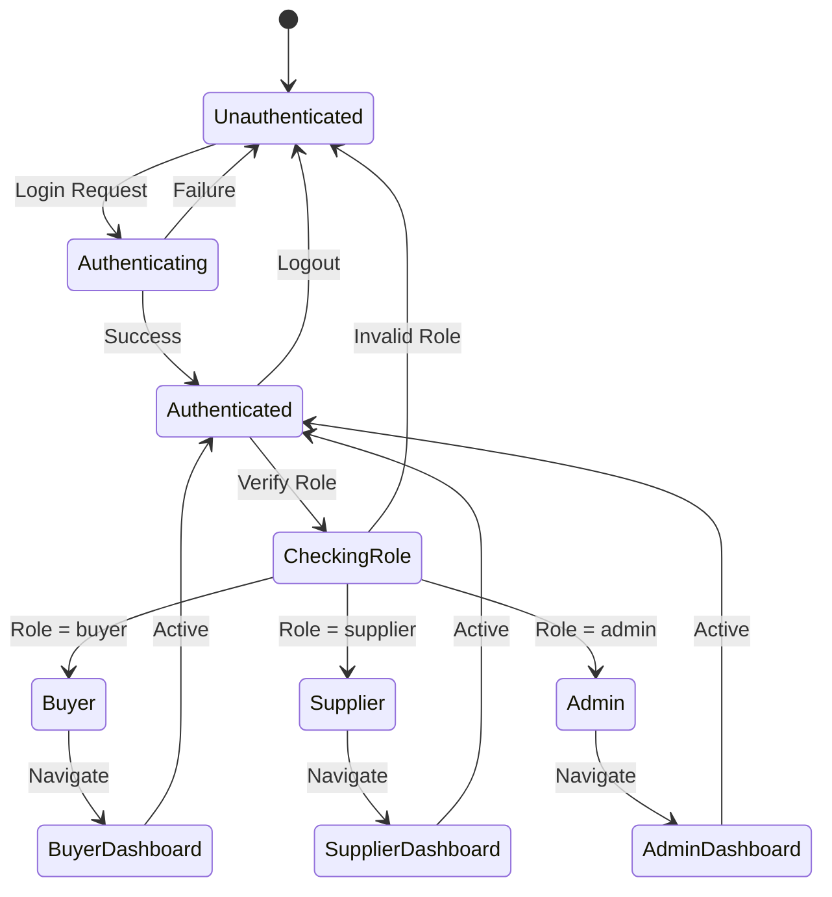
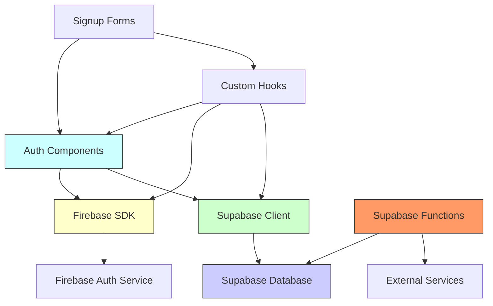

# Authentication API

<cite>
**Referenced Files in This Document**  
- [auth.ts](file://src/lib/firebase/auth.ts)
- [config.ts](file://src/lib/firebase/config.ts)
- [useFirebaseAuth.tsx](file://src/hooks/useFirebaseAuth.tsx)
- [Auth.tsx](file://src/pages/Auth.tsx)
- [client.ts](file://src/integrations/supabase/client.ts)
- [types.ts](file://src/integrations/supabase/types.ts)
- [send-otp/index.ts](file://supabase/functions/send-otp/index.ts)
- [verify-otp/index.ts](file://supabase/functions/verify-otp/index.ts)
- [password-breach-check/index.ts](file://supabase/functions/password-breach-check/index.ts)
- [CustomerSignupForm.tsx](file://src/components/auth/CustomerSignupForm.tsx)
- [ProductionPartnerSignupForm.tsx](file://src/components/auth/ProductionPartnerSignupForm.tsx)
</cite>

## Table of Contents
1. [Introduction](#introduction)
2. [Project Structure](#project-structure)
3. [Core Components](#core-components)
4. [Architecture Overview](#architecture-overview)
5. [Detailed Component Analysis](#detailed-component-analysis)
6. [Dependency Analysis](#dependency-analysis)
7. [Performance Considerations](#performance-considerations)
8. [Troubleshooting Guide](#troubleshooting-guide)
9. [Conclusion](#conclusion)

## Introduction
The Authentication API in sleekapp-v100 provides a robust, secure, and scalable authentication system that combines Firebase Auth with Supabase Edge Functions for OTP verification. This hybrid approach leverages Firebase's battle-tested authentication infrastructure while utilizing Supabase for custom business logic and data synchronization. The system supports multiple authentication methods including email/password login, one-time password (OTP) verification, and role-based access control for different user types (buyer, supplier, admin). This documentation details the complete authentication flow, integration patterns, security considerations, and implementation best practices.

## Project Structure
The authentication system is organized across multiple directories following a modular architecture. Firebase-related utilities are located in `src/lib/firebase`, Supabase integration code resides in `src/integrations/supabase`, authentication hooks are in `src/hooks`, and UI components are in `src/components/auth`. Supabase Edge Functions for authentication are defined in `supabase/functions` with dedicated endpoints for OTP operations. This separation of concerns ensures maintainability and clear responsibility boundaries between authentication layers.

**Diagram sources**
- [auth.ts](file://src/lib/firebase/auth.ts)
- [config.ts](file://src/lib/firebase/config.ts)
- [useFirebaseAuth.tsx](file://src/hooks/useFirebaseAuth.tsx)
- [Auth.tsx](file://src/pages/Auth.tsx)
- [client.ts](file://src/integrations/supabase/client.ts)
- [send-otp/index.ts](file://supabase/functions/send-otp/index.ts)
- [verify-otp/index.ts](file://supabase/functions/verify-otp/index.ts)

**Section sources**
- [auth.ts](file://src/lib/firebase/auth.ts)
- [config.ts](file://src/lib/firebase/config.ts)
- [useFirebaseAuth.tsx](file://src/hooks/useFirebaseAuth.tsx)
- [Auth.tsx](file://src/pages/Auth.tsx)

## Core Components
The authentication system comprises several core components that work together to provide a seamless and secure user experience. The Firebase Auth service handles user registration, login, and session management, while Supabase Edge Functions manage OTP generation and verification. The `useFirebaseAuth` custom hook provides a React-friendly interface for authentication state management. The system also includes specialized signup forms for different user roles (customer and production partner) with appropriate validation and data collection. User data synchronization between Firebase and Supabase ensures consistent user information across both platforms.

**Section sources**
- [auth.ts](file://src/lib/firebase/auth.ts)
- [useFirebaseAuth.tsx](file://src/hooks/useFirebaseAuth.tsx)
- [CustomerSignupForm.tsx](file://src/components/auth/CustomerSignupForm.tsx)
- [ProductionPartnerSignupForm.tsx](file://src/components/auth/ProductionPartnerSignupForm.tsx)

## Architecture Overview
The authentication architecture follows a hybrid model where Firebase Auth serves as the primary identity provider while Supabase Edge Functions handle custom authentication logic. When a user attempts to authenticate, the frontend interacts with Firebase for credential validation. For OTP-based flows, Firebase triggers Supabase Edge Functions via HTTP calls to generate and verify one-time passwords. User data is synchronized between Firebase Authentication and Supabase PostgreSQL database to maintain consistency. This architecture provides the reliability of Firebase's authentication infrastructure with the flexibility of custom business logic in Supabase.

**Diagram sources**
- [auth.ts](file://src/lib/firebase/auth.ts)
- [send-otp/index.ts](file://supabase/functions/send-otp/index.ts)
- [verify-otp/index.ts](file://supabase/functions/verify-otp/index.ts)
- [client.ts](file://src/integrations/supabase/client.ts)

## Detailed Component Analysis

### Firebase Authentication Integration
The Firebase authentication integration provides the foundation for user identity management. It handles user registration, login, password reset, and session persistence. The configuration is centralized in `config.ts` with environment-specific settings, while `auth.ts` exports utility functions for common authentication operations. The system implements proper error handling for various authentication scenarios including invalid credentials, network errors, and account restrictions.

#### Firebase Auth Service

**Diagram sources**
- [auth.ts](file://src/lib/firebase/auth.ts)
- [config.ts](file://src/lib/firebase/config.ts)

### OTP Verification Process
The OTP verification process leverages Supabase Edge Functions to provide secure one-time password functionality. When a user requests an OTP, the system generates a cryptographically secure code, stores it with an expiration time in the database, and sends it via the preferred channel (email or SMS). During verification, the system checks the code's validity, ensures it hasn't expired, and enforces rate limiting to prevent brute force attacks.

#### OTP Flow

**Diagram sources**
- [send-otp/index.ts](file://supabase/functions/send-otp/index.ts)
- [verify-otp/index.ts](file://supabase/functions/verify-otp/index.ts)

### Role-Based Access Control
The system implements role-based access control to differentiate permissions between user types (buyer, supplier, admin). User roles are stored in the Supabase database and synchronized with Firebase custom claims to enable client-side role checking. This allows for fine-grained control over UI elements and API access based on the user's role.

#### Role Management

**Diagram sources**
- [useFirebaseAuth.tsx](file://src/hooks/useFirebaseAuth.tsx)
- [types.ts](file://src/integrations/supabase/types.ts)

## Dependency Analysis
The authentication system has well-defined dependencies between components. The frontend authentication components depend on Firebase SDK for core authentication functionality and Supabase client for database operations. Supabase Edge Functions have dependencies on the Supabase database for storing OTP records and user data. The system also depends on external services for communication channels (email/SMS providers). All dependencies are managed through proper abstraction layers to minimize coupling and facilitate testing.

**Diagram sources**
- [package.json](file://package.json)
- [auth.ts](file://src/lib/firebase/auth.ts)
- [client.ts](file://src/integrations/supabase/client.ts)

## Performance Considerations
The authentication system is designed with performance in mind. Firebase Auth provides low-latency authentication operations with global CDN support. Supabase Edge Functions are optimized for fast execution with minimal cold start times. The system implements caching strategies for frequently accessed user data and uses efficient database queries with proper indexing. Rate limiting is implemented at both the Firebase and Supabase levels to prevent abuse while maintaining good performance for legitimate users. Network requests are minimized through batch operations and efficient data synchronization patterns.

## Troubleshooting Guide
Common authentication issues include session expiration, OTP delivery problems, and password breach alerts. For session expiration, ensure proper session persistence configuration and implement token refresh mechanisms. For OTP delivery issues, verify the Supabase function logs and check communication channel configurations. When password breach detection is triggered, prompt users to change their passwords immediately and consider implementing temporary account locks. Monitor both Firebase and Supabase logs for authentication errors and set up proper alerting for suspicious activities.

**Section sources**
- [auth.ts](file://src/lib/firebase/auth.ts)
- [password-breach-check/index.ts](file://supabase/functions/password-breach-check/index.ts)
- [useFirebaseAuth.tsx](file://src/hooks/useFirebaseAuth.tsx)

## Conclusion
The Authentication API in sleekapp-v100 provides a comprehensive, secure, and scalable solution for user authentication. By combining Firebase Auth with Supabase Edge Functions, the system leverages the strengths of both platforms while maintaining flexibility for custom business logic. The architecture supports multiple authentication methods, role-based access control, and robust security features including OTP verification and password breach detection. Proper implementation of this system ensures a seamless user experience while maintaining high security standards.