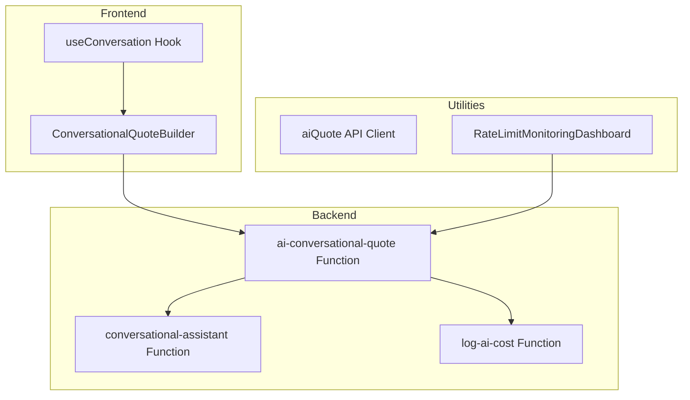
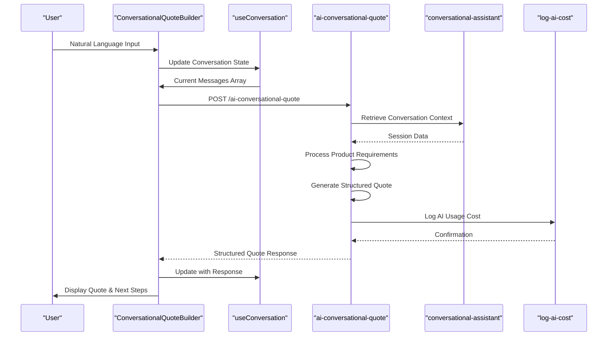
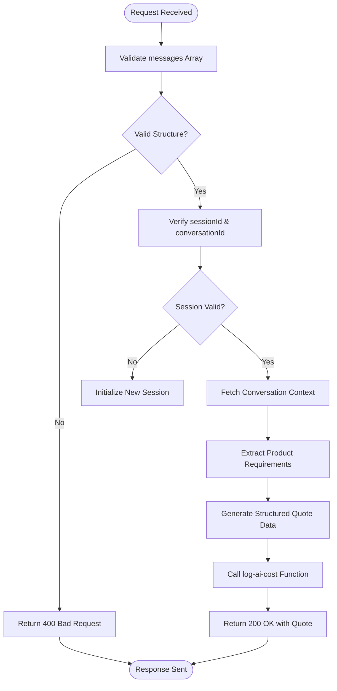
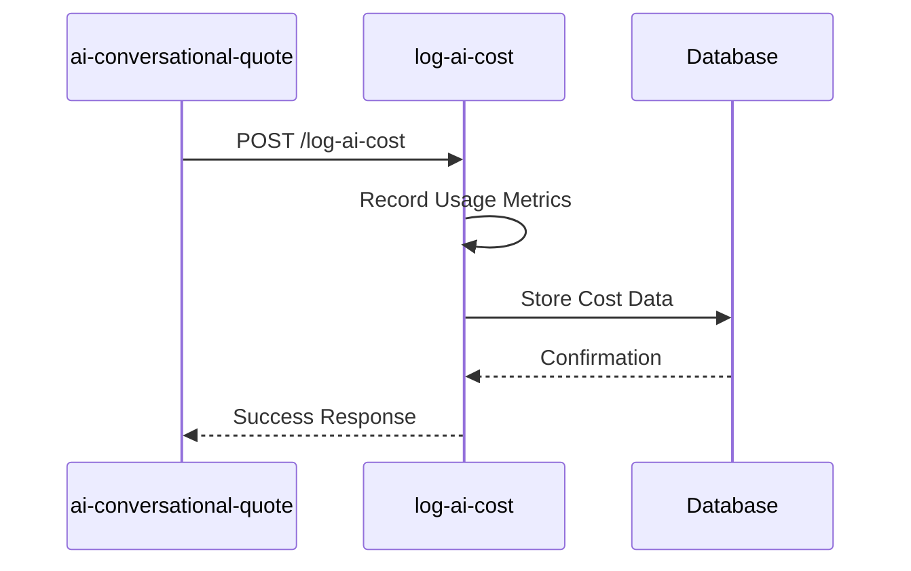
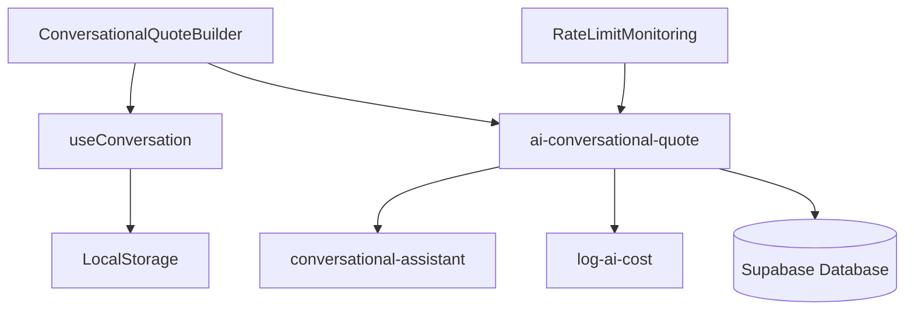

# AI Conversational Quote

<cite>
**Referenced Files in This Document**  
- [index.ts](file://supabase/functions/ai-conversational-quote/index.ts)
- [ConversationalQuoteBuilder.tsx](file://src/components/quote/ConversationalQuoteBuilder.tsx)
- [useConversation.ts](file://src/hooks/useConversation.ts)
- [aiQuote.ts](file://src/lib/api/aiQuote.ts)
- [conversational-assistant/index.ts](file://supabase/functions/conversational-assistant/index.ts)
- [log-ai-cost/index.ts](file://supabase/functions/log-ai-cost/index.ts)
- [RateLimitMonitoringDashboard.tsx](file://src/components/admin/RateLimitMonitoringDashboard.tsx)
</cite>

## Table of Contents
1. [Introduction](#introduction)
2. [Project Structure](#project-structure)
3. [Core Components](#core-components)
4. [Architecture Overview](#architecture-overview)
5. [Detailed Component Analysis](#detailed-component-analysis)
6. [Dependency Analysis](#dependency-analysis)
7. [Performance Considerations](#performance-considerations)
8. [Troubleshooting Guide](#troubleshooting-guide)
9. [Conclusion](#conclusion)

## Introduction
The AI Conversational Quote system is an intelligent edge function that enables users to generate product quotes through natural language conversations. This documentation provides a comprehensive overview of the system's architecture, request/response cycle, server-side processing logic, and integration points. The system leverages AI to interpret user inputs, extract product requirements, and generate structured quote data while maintaining conversation context across multiple interactions.

## Project Structure
The AI Conversational Quote system is organized across frontend components, backend edge functions, and supporting utilities. The core functionality resides in the Supabase functions directory for serverless execution, while the user interface components are located in the src/components/quote directory. Shared hooks for state management are housed in the src/hooks directory, and API utilities are centralized in src/lib/api.



**Diagram sources**
- [index.ts](file://supabase/functions/ai-conversational-quote/index.ts)
- [ConversationalQuoteBuilder.tsx](file://src/components/quote/ConversationalQuoteBuilder.tsx)
- [useConversation.ts](file://src/hooks/useConversation.ts)

**Section sources**
- [index.ts](file://supabase/functions/ai-conversational-quote/index.ts)
- [ConversationalQuoteBuilder.tsx](file://src/components/quote/ConversationalQuoteBuilder.tsx)

## Core Components
The AI Conversational Quote system consists of several interconnected components that work together to process natural language inputs and generate structured quotes. The system handles the complete conversation lifecycle from initial request to final quote generation, maintaining context and state throughout the interaction.

**Section sources**
- [index.ts](file://supabase/functions/ai-conversational-quote/index.ts)
- [ConversationalQuoteBuilder.tsx](file://src/components/quote/ConversationalQuoteBuilder.tsx)
- [useConversation.ts](file://src/hooks/useConversation.ts)

## Architecture Overview
The AI Conversational Quote system follows a serverless architecture with clear separation between frontend presentation logic and backend processing. The system processes user inputs through a series of coordinated functions that handle conversation management, AI processing, cost tracking, and rate limiting.



**Diagram sources**
- [index.ts](file://supabase/functions/ai-conversational-quote/index.ts)
- [ConversationalQuoteBuilder.tsx](file://src/components/quote/ConversationalQuoteBuilder.tsx)
- [useConversation.ts](file://src/hooks/useConversation.ts)

## Detailed Component Analysis

### Request/Response Cycle
The AI Conversational Quote function processes requests containing a messages array with role and content properties, along with sessionId and conversationId for context management. The response includes structured quote data with product specifications, pricing, and next steps.



**Diagram sources**
- [index.ts](file://supabase/functions/ai-conversational-quote/index.ts)
- [aiQuote.ts](file://src/lib/api/aiQuote.ts)

**Section sources**
- [index.ts](file://supabase/functions/ai-conversational-quote/index.ts)
- [aiQuote.ts](file://src/lib/api/aiQuote.ts)

### Server-Side Processing Logic
The server-side logic in the ai-conversational-quote function parses natural language inputs to extract product requirements such as garment type, quantities, materials, and customization options. This information is transformed into structured data that can be used for quote generation.

**Section sources**
- [index.ts](file://supabase/functions/ai-conversational-quote/index.ts)

### Conversational Assistant Integration
The system integrates with the conversational-assistant function to maintain context across multiple interactions. This allows the system to remember previous conversation history, user preferences, and partially completed quote requirements.

```mermaid
classDiagram
class ConversationalQuoteBuilder {
+messages : Array<{role : string, content : string}>
+sessionId : string
+conversationId : string
+handleSubmit(input : string) : Promise<void>
+resetConversation() : void
}
class useConversation {
+messages : Array<{role : string, content : string}>
+sessionId : string
+conversationId : string
+addMessage(message : {role : string, content : string}) : void
+clearMessages() : void
+getMessages() : Array<{role : string, content : string}>
}
class aiConversationalQuote {
+POST /ai-conversational-quote
+handleRequest(request : Request) : Promise<Response>
+validateRequest(data : any) : boolean
+extractRequirements(messages : Array<any>) : ProductRequirements
+generateQuoteData(requirements : ProductRequirements) : QuoteData
}
class conversationalAssistant {
+GET /conversational-assistant/{sessionId}
+POST /conversational-assistant/{sessionId}
+getSessionData(sessionId : string) : SessionData
+updateSessionData(sessionId : string, data : any) : void
}
ConversationalQuoteBuilder --> useConversation : "uses"
ConversationalQuoteBuilder --> aiConversationalQuote : "calls"
aiConversationalQuote --> conversationalAssistant : "integrates with"
```

**Diagram sources**
- [ConversationalQuoteBuilder.tsx](file://src/components/quote/ConversationalQuoteBuilder.tsx)
- [useConversation.ts](file://src/hooks/useConversation.ts)
- [index.ts](file://supabase/functions/ai-conversational-quote/index.ts)
- [conversational-assistant/index.ts](file://supabase/functions/conversational-assistant/index.ts)

**Section sources**
- [ConversationalQuoteBuilder.tsx](file://src/components/quote/ConversationalQuoteBuilder.tsx)
- [useConversation.ts](file://src/hooks/useConversation.ts)
- [index.ts](file://supabase/functions/ai-conversational-quote/index.ts)

### Rate Limiting Implementation
The system implements rate limiting to prevent abuse by tracking requests by customer email. The RateLimitMonitoringDashboard provides visibility into usage patterns and potential abuse attempts.

**Section sources**
- [index.ts](file://supabase/functions/ai-conversational-quote/index.ts)
- [RateLimitMonitoringDashboard.tsx](file://src/components/admin/RateLimitMonitoringDashboard.tsx)

### Cost Logging Mechanism
The system includes a cost logging mechanism that records AI usage for analytics and billing purposes. Each interaction with the AI conversational quote function triggers a call to the log-ai-cost function to record resource consumption.



**Diagram sources**
- [index.ts](file://supabase/functions/ai-conversational-quote/index.ts)
- [log-ai-cost/index.ts](file://supabase/functions/log-ai-cost/index.ts)

**Section sources**
- [index.ts](file://supabase/functions/ai-conversational-quote/index.ts)
- [log-ai-cost/index.ts](file://supabase/functions/log-ai-cost/index.ts)

## Dependency Analysis
The AI Conversational Quote system has several key dependencies that enable its functionality. These include the conversational-assistant function for context management, the log-ai-cost function for usage tracking, and various frontend components for user interaction.



**Diagram sources**
- [index.ts](file://supabase/functions/ai-conversational-quote/index.ts)
- [ConversationalQuoteBuilder.tsx](file://src/components/quote/ConversationalQuoteBuilder.tsx)
- [useConversation.ts](file://src/hooks/useConversation.ts)

**Section sources**
- [index.ts](file://supabase/functions/ai-conversational-quote/index.ts)
- [ConversationalQuoteBuilder.tsx](file://src/components/quote/ConversationalQuoteBuilder.tsx)
- [useConversation.ts](file://src/hooks/useConversation.ts)

## Performance Considerations
The AI Conversational Quote system is designed for optimal performance with considerations for response time, resource utilization, and scalability. The serverless architecture allows for automatic scaling based on demand, while the modular design ensures that individual components can be optimized independently.

## Troubleshooting Guide
The system includes comprehensive error handling for various scenarios including malformed requests, AI service failures, and session management issues. Error responses provide appropriate HTTP status codes and descriptive messages to aid in debugging.

**Section sources**
- [index.ts](file://supabase/functions/ai-conversational-quote/index.ts)
- [ConversationalQuoteBuilder.tsx](file://src/components/quote/ConversationalQuoteBuilder.tsx)

## Conclusion
The AI Conversational Quote system provides a sophisticated solution for generating product quotes through natural language interactions. By combining frontend components with backend edge functions, the system delivers a seamless user experience while maintaining robust server-side processing, context management, and usage tracking capabilities.