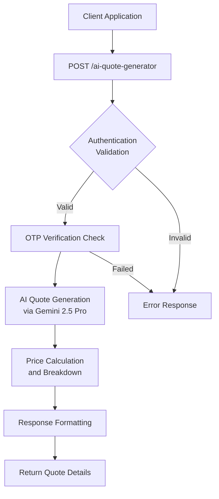
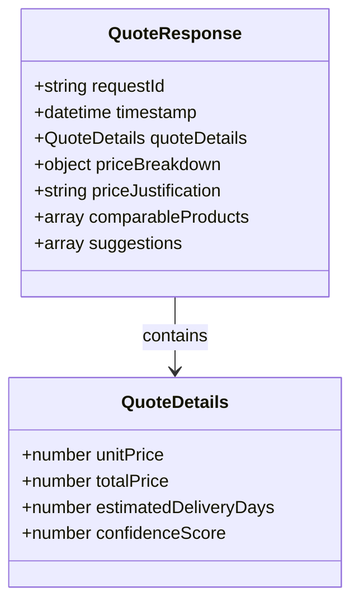
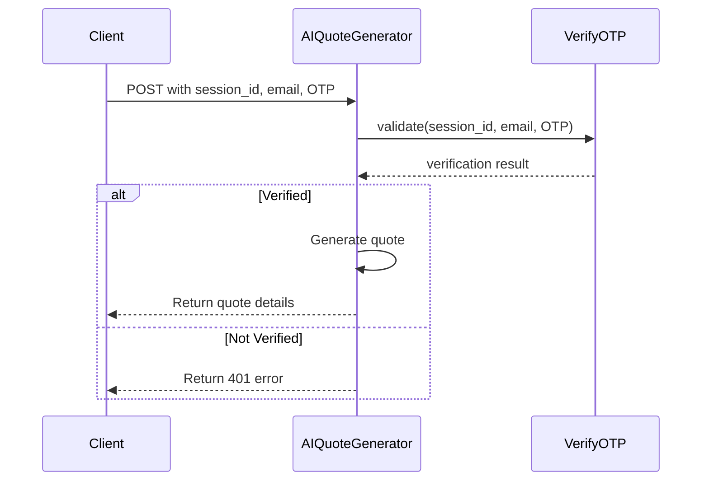
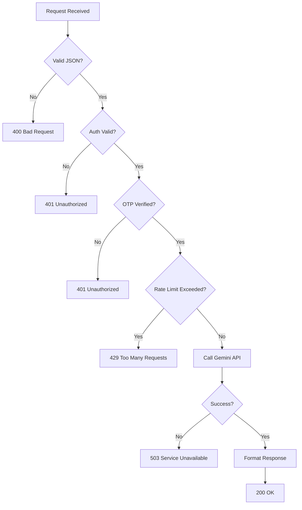
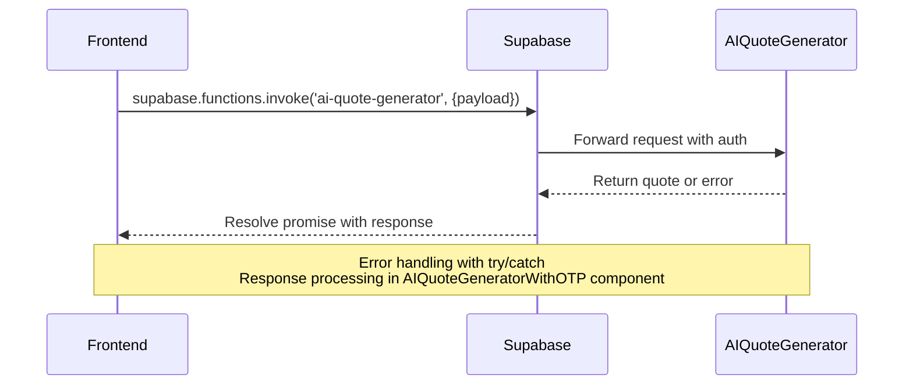

# AI Quote Generator

<cite>
**Referenced Files in This Document**  
- [index.ts](file://supabase/functions/ai-quote-generator/index.ts)
- [AIQuoteGeneratorWithOTP.tsx](file://src/components/AIQuoteGeneratorWithOTP.tsx)
- [aiQuote.ts](file://src/lib/api/aiQuote.ts)
</cite>

## Table of Contents
1. [Introduction](#introduction)
2. [API Endpoint Overview](#api-endpoint-overview)
3. [Request Payload Structure](#request-payload-structure)
4. [Response Schema](#response-schema)
5. [Authentication Mechanism](#authentication-mechanism)
6. [OTP Verification Process](#otp-verification-process)
7. [AI Integration with Gemini 2.5 Pro](#ai-integration-with-gemini-25-pro)
8. [Error Handling](#error-handling)
9. [Frontend Integration Example](#frontend-integration-example)
10. [Security Considerations](#security-considerations)
11. [Conclusion](#conclusion)

## Introduction
The AI Quote Generator is a Supabase Edge Function designed to provide intelligent, data-driven pricing estimates for custom apparel manufacturing. This API leverages advanced AI models to analyze product specifications and generate accurate quotes with detailed breakdowns, delivery timelines, and confidence scores. The system integrates OTP-based verification for secure access and uses the Gemini 2.5 Pro model for AI-powered price analysis and justification.

**Section sources**
- [index.ts](file://supabase/functions/ai-quote-generator/index.ts#L1-L50)

## API Endpoint Overview
The AI Quote Generator exposes an HTTP POST endpoint at `/functions/v1/ai-quote-generator` that accepts product and customer information to generate comprehensive pricing quotes. The endpoint is protected by Supabase service role authentication and implements rate limiting to prevent abuse. It processes requests containing detailed product specifications and returns structured quote information including pricing, delivery estimates, and AI-generated justifications.

**Diagram sources**
- [index.ts](file://supabase/functions/ai-quote-generator/index.ts#L50-L100)

## Request Payload Structure
The API accepts a JSON payload with the following parameters:

- **product_type**: String specifying the type of apparel product (e.g., "t-shirt", "hoodie")
- **quantity**: Number representing the order quantity
- **fabric_type**: String describing the fabric material (e.g., "cotton", "polyester")
- **complexity_level**: String indicating production complexity ("low", "medium", "high")
- **additional_requirements**: Array of strings for special production requirements
- **customer_email**: String containing the customer's email address
- **customer_name**: String with the customer's full name
- **country**: String indicating the customer's country
- **phone_number**: String with the customer's contact number
- **session_id**: String for tracking the user session

The function validates all input fields for type, format, and acceptable values before processing the quote request.

**Section sources**
- [index.ts](file://supabase/functions/ai-quote-generator/index.ts#L100-L200)

## Response Schema
The API returns a JSON response with the following structure:

- **quoteDetails**: Object containing:
  - *unitPrice*: Number representing cost per unit
  - *totalPrice*: Number for total order cost
  - *estimatedDeliveryDays*: Number of days for production and delivery
  - *confidenceScore*: Number (0-1) indicating AI confidence in the quote
- **priceBreakdown**: Object detailing cost components
- **priceJustification**: String with AI-generated explanation of pricing
- **comparableProducts**: Array of similar products used for price benchmarking
- **suggestions**: Array of AI-generated recommendations for cost optimization

The response includes metadata and timestamps for audit and tracking purposes.

**Diagram sources**
- [index.ts](file://supabase/functions/ai-quote-generator/index.ts#L200-L300)

## Authentication Mechanism
The AI Quote Generator uses Supabase service role key authentication to secure the endpoint. The function validates the presence of a valid service role key in the request headers, ensuring only authorized applications can access the quote generation service. This approach provides robust security while enabling seamless integration with the Supabase ecosystem.

The authentication process occurs early in the request lifecycle, rejecting unauthorized requests before any processing or AI invocation takes place, thus conserving resources and protecting against unauthorized access.

**Section sources**
- [index.ts](file://supabase/functions/ai-quote-generator/index.ts#L300-L350)

## OTP Verification Process
Before generating a quote, the system verifies the user's identity through a one-time password (OTP) mechanism. The process involves:

1. Checking for a valid session_id in the request
2. Validating the OTP associated with the session via the verify-otp function
3. Confirming the customer_email matches the verified session
4. Proceeding with quote generation only upon successful verification

This multi-step verification ensures that quote requests come from authenticated users and helps prevent automated scraping or abuse of the AI service.

**Diagram sources**
- [index.ts](file://supabase/functions/ai-quote-generator/index.ts#L350-L450)
- [verify-otp/index.ts](file://supabase/functions/verify-otp/index.ts#L1-L30)

## AI Integration with Gemini 2.5 Pro
The core functionality of the quote generator relies on integration with the Gemini 2.5 Pro AI model. The system uses prompt engineering to transform product specifications into structured queries that elicit accurate pricing information. The prompt includes:

- Current market pricing data
- Historical production costs
- Material and labor cost benchmarks
- Complexity assessment guidelines

The function parses the AI response to extract structured pricing data, validates it against business rules, and formats it for the client application. This integration enables dynamic pricing that adapts to market conditions and production capabilities.

**Section sources**
- [index.ts](file://supabase/functions/ai-quote-generator/index.ts#L450-L600)

## Error Handling
The API implements comprehensive error handling for various failure scenarios:

- **Validation failures**: Returns 400 Bad Request with specific error messages for invalid input
- **Authentication errors**: Returns 401 Unauthorized for missing or invalid credentials
- **Rate limiting**: Returns 429 Too Many Requests when email-based rate limits are exceeded
- **AI service unavailability**: Returns 503 Service Unavailable with retry instructions
- **Internal server errors**: Returns 500 with generic error message to avoid information leakage

Error responses include descriptive messages and error codes to help clients handle failures appropriately.

**Diagram sources**
- [index.ts](file://supabase/functions/ai-quote-generator/index.ts#L600-L750)

## Frontend Integration Example
Clients can invoke the AI Quote Generator using the Supabase client library:

The AIQuoteGeneratorWithOTP component manages the OTP flow, collects user input, invokes the function, and displays the results in a user-friendly format.

**Section sources**
- [AIQuoteGeneratorWithOTP.tsx](file://src/components/AIQuoteGeneratorWithOTP.tsx#L1-L200)
- [aiQuote.ts](file://src/lib/api/aiQuote.ts#L1-L50)

## Security Considerations
The implementation includes multiple security measures:

- **Input validation**: All request parameters are validated for type, format, and acceptable ranges
- **Rate limiting**: Requests are limited by customer_email to prevent abuse
- **Prompt injection protection**: AI prompts are sanitized and structured to prevent injection attacks
- **Authentication**: Service role key ensures only authorized access
- **Data sanitization**: User inputs are sanitized before AI processing
- **Error handling**: Generic error messages prevent information leakage

These measures protect both the AI service and customer data while ensuring reliable operation.

**Section sources**
- [index.ts](file://supabase/functions/ai-quote-generator/index.ts#L750-L850)

## Conclusion
The AI Quote Generator provides a secure, reliable, and intelligent solution for generating apparel manufacturing quotes. By leveraging Supabase Edge Functions and the Gemini 2.5 Pro AI model, it delivers accurate pricing with detailed justifications and recommendations. The integration of OTP verification and comprehensive security measures ensures a robust and protected service for both customers and the business.