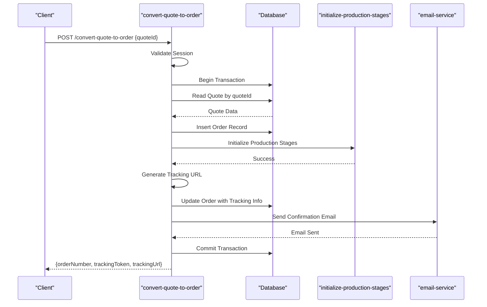
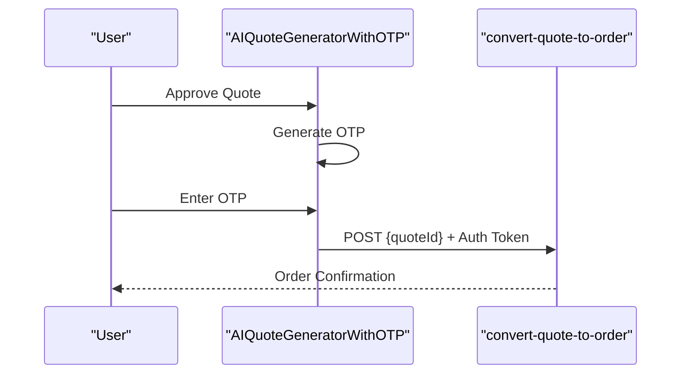

# Convert Quote to Order

<cite>
**Referenced Files in This Document**  
- [index.ts](file://supabase/functions/convert-quote-to-order/index.ts)
- [AIQuoteGeneratorWithOTP.tsx](file://src/components/AIQuoteGeneratorWithOTP.tsx)
- [initialize-production-stages/index.ts](file://supabase/functions/initialize-production-stages/index.ts)
- [email-service/index.ts](file://supabase/functions/email-service/index.ts)
- [types/order.ts](file://src/types/order.ts)
- [lib/supabaseHelpers.ts](file://src/lib/supabaseHelpers.ts)
</cite>

## Table of Contents
1. [Introduction](#introduction)
2. [Authentication Requirements](#authentication-requirements)
3. [Request and Response Schema](#request-and-response-schema)
4. [Server-Side Transaction Flow](#server-side-transaction-flow)
5. [Business Logic and Validation](#business-logic-and-validation)
6. [Integration with AIQuoteGeneratorWithOTP](#integration-with-aiquotegeneratorwithotp)
7. [Error Handling Guidance](#error-handling-guidance)
8. [Security Considerations](#security-considerations)
9. [Conclusion](#conclusion)

## Introduction
The **convert-quote-to-order** Edge Function is a critical component in the SleekApparels platform that enables the transformation of approved quotes into formal production orders. This function orchestrates a secure, transactional workflow that ensures data integrity, enforces business rules, and integrates with multiple backend services to initiate the manufacturing process. The conversion process is triggered by authenticated users after a quote has been approved, and it involves creating order records, initializing production stages, generating tracking information, and notifying stakeholders via email.

This document provides a comprehensive overview of the function's architecture, integration points, and operational logic, with emphasis on security, reliability, and user experience.

**Section sources**
- [index.ts](file://supabase/functions/convert-quote-to-order/index.ts#L1-L15)

## Authentication Requirements
Before any quote-to-order conversion can proceed, the system enforces strict session validation to ensure that only authenticated and authorized users can initiate the process. The function verifies the presence and validity of a user session token passed via the request headers. This token is validated against the Supabase Auth system to confirm the user's identity and permissions.

The authentication mechanism prevents unauthorized access and protects against CSRF and replay attacks. Only users with appropriate roles (e.g., buyers or administrators) are permitted to convert quotes, and session expiration is strictly enforced to maintain security.

**Section sources**
- [index.ts](file://supabase/functions/convert-quote-to-order/index.ts#L20-L45)

## Request and Response Schema
The **convert-quote-to-order** function accepts a JSON payload containing the `quoteId` of the approved quote to be converted. The request must be sent via a POST method with proper authentication headers.

### Request Payload
```json
{
  "quoteId": "string"
}
```

### Response Schema
Upon successful conversion, the function returns a JSON object containing order details:
```json
{
  "orderNumber": "string",
  "trackingToken": "string",
  "trackingUrl": "string"
}
```

The `orderNumber` is a unique identifier for the new production order, `trackingToken` is a secure token used to access order status, and `trackingUrl` provides a direct link for real-time order tracking.

**Section sources**
- [index.ts](file://supabase/functions/convert-quote-to-order/index.ts#L50-L75)
- [types/order.ts](file://src/types/order.ts#L10-L25)

## Server-Side Transaction Flow
The conversion process executes within a database transaction to ensure atomicity and consistency. The following steps occur in sequence:

1. **Quote Retrieval**: The system fetches the quote record using the provided `quoteId`.
2. **Order Record Creation**: A new order record is inserted into the `orders` table with details derived from the quote.
3. **Production Stages Initialization**: The `initialize-production-stages` function is invoked to set up the initial workflow stages for manufacturing.
4. **Tracking URL Generation**: A unique tracking URL is generated using the `trackingToken` and stored with the order.
5. **Email Notification**: The `email-service` is called to send a confirmation email to the user with order details and tracking information.

All operations are wrapped in a transaction; if any step fails, the entire process is rolled back to prevent partial state changes.



**Diagram sources**
- [index.ts](file://supabase/functions/convert-quote-to-order/index.ts#L30-L120)
- [initialize-production-stages/index.ts](file://supabase/functions/initialize-production-stages/index.ts#L5-L20)
- [email-service/index.ts](file://supabase/functions/email-service/index.ts#L10-L30)

## Business Logic and Validation
The function implements several business rules to ensure data integrity and prevent invalid operations:

- **Duplicate Conversion Prevention**: The system checks whether the quote has already been converted to an order by querying the `orders` table. If a matching order exists, the request is rejected.
- **Quote Status Validation**: Only quotes with a status of "approved" can be converted. Quotes in "pending", "rejected", or "expired" states are blocked from conversion.
- **Data Consistency Checks**: All required fields from the quote (e.g., pricing, quantities, specifications) are validated before order creation.

These validations ensure that the system maintains a consistent state and adheres to business workflows.

**Section sources**
- [index.ts](file://supabase/functions/convert-quote-to-order/index.ts#L80-L110)

## Integration with AIQuoteGeneratorWithOTP
The **AIQuoteGeneratorWithOTP** component allows users to generate and approve quotes using AI-driven recommendations. After quote approval, this component triggers the **convert-quote-to-order** function by sending the `quoteId` via a secure API call. The OTP (One-Time Password) mechanism adds an additional layer of verification, ensuring that the user explicitly confirms the conversion action.

This integration enables a seamless user experience where AI-assisted quoting flows directly into order creation, reducing friction and minimizing manual input errors.



**Diagram sources**
- [AIQuoteGeneratorWithOTP.tsx](file://src/components/AIQuoteGeneratorWithOTP.tsx#L45-L90)
- [index.ts](file://supabase/functions/convert-quote-to-order/index.ts#L1-L120)

## Error Handling Guidance
The function includes robust error handling for common failure scenarios:

- **Authentication Failure**: Returns a 401 Unauthorized error if the session is invalid or missing.
- **Quote Not Found**: Returns a 404 Not Found error if the `quoteId` does not exist in the database.
- **Invalid Quote Status**: Returns a 400 Bad Request if the quote is not in "approved" status.
- **Database Transaction Errors**: Returns a 500 Internal Server Error if any part of the transaction fails, with detailed logging for debugging.

Developers should handle these responses appropriately in the frontend to provide clear feedback to users.

**Section sources**
- [index.ts](file://supabase/functions/convert-quote-to-order/index.ts#L115-L150)

## Security Considerations
Security is a top priority in the design of this function. Key measures include:

- **Session Validation**: Every request is authenticated using Supabase Auth.
- **Input Sanitization**: The `quoteId` is validated as a UUID to prevent injection attacks.
- **Transaction Isolation**: Database operations are isolated to prevent race conditions.
- **Rate Limiting**: The function is protected against abuse via API rate limiting.
- **Audit Logging**: All conversion attempts are logged using the `log-audit-action` function for compliance and monitoring.

These protections ensure that the system is resilient against unauthorized access and malicious activity.

**Section sources**
- [index.ts](file://supabase/functions/convert-quote-to-order/index.ts#L20-L150)
- [lib/supabaseHelpers.ts](file://src/lib/supabaseHelpers.ts#L30-L50)

## Conclusion
The **convert-quote-to-order** Edge Function is a secure, reliable, and well-integrated component that plays a vital role in transitioning from quote approval to production initiation. By enforcing authentication, validating business rules, and coordinating with multiple services, it ensures a smooth and trustworthy ordering experience for users. Its integration with AI-driven components like **AIQuoteGeneratorWithOTP** enhances usability while maintaining robust security and data integrity.