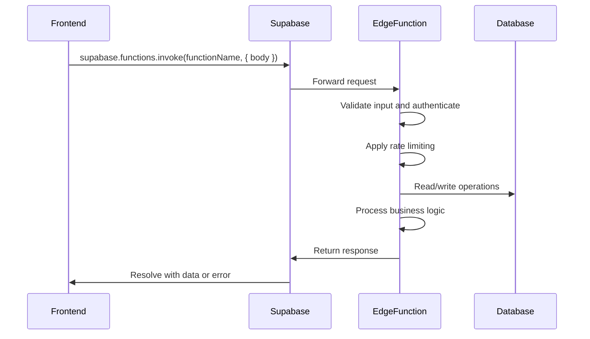
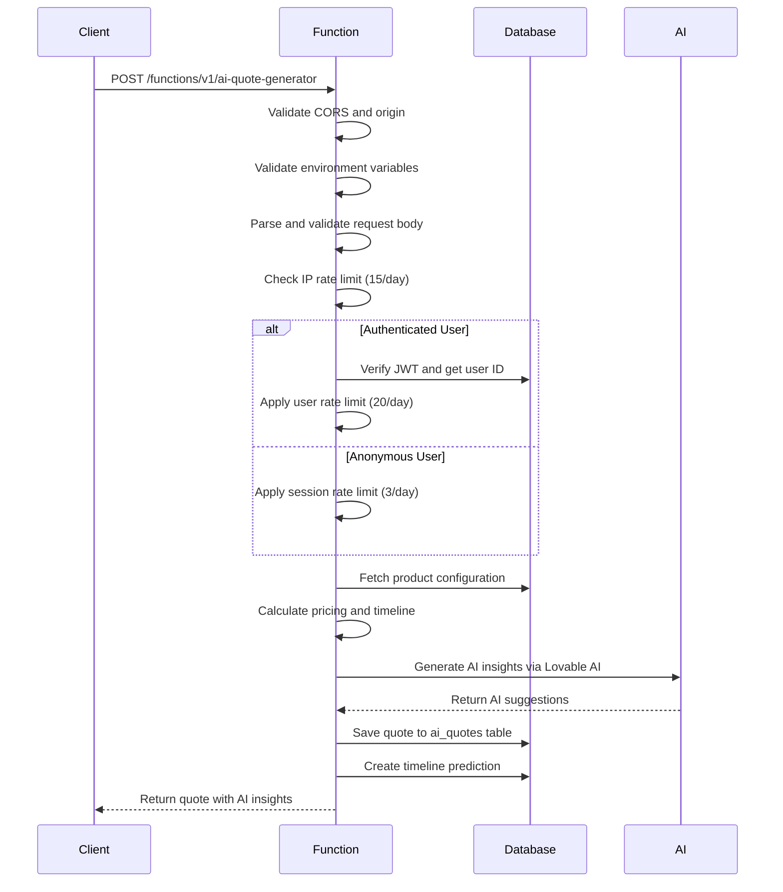
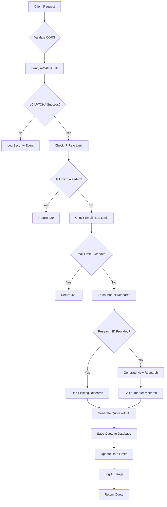
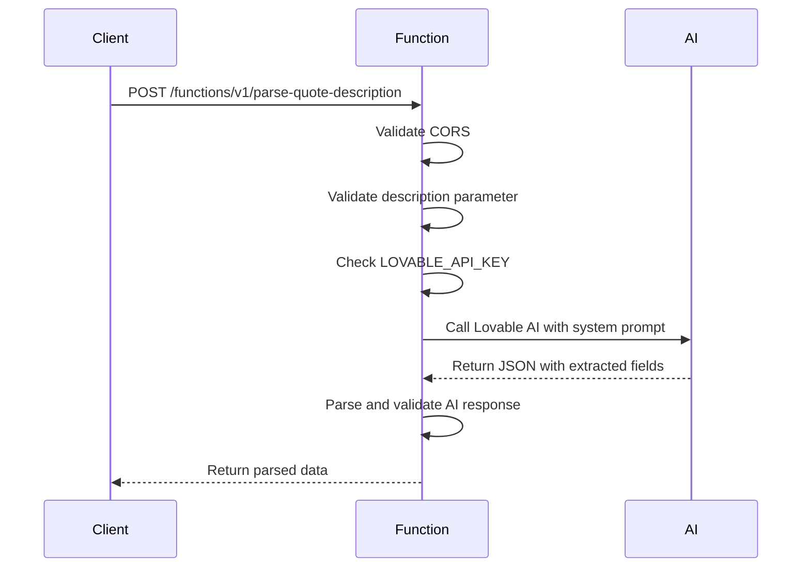
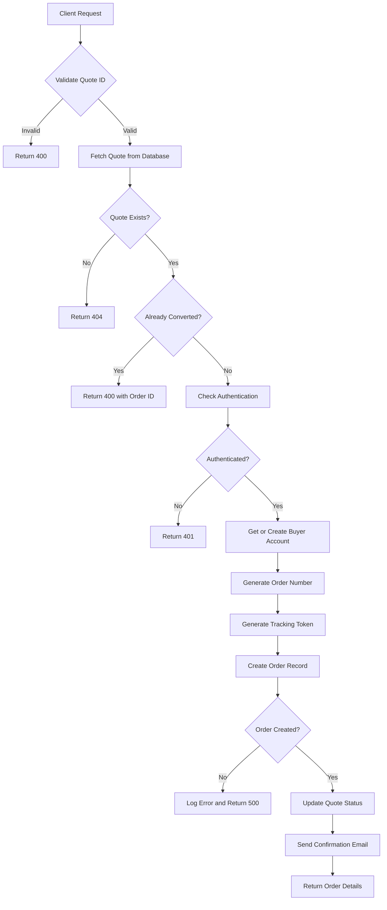
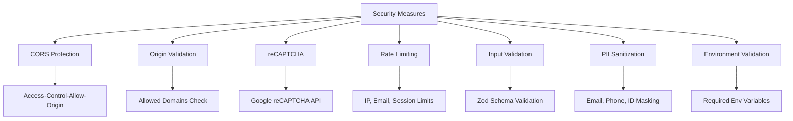
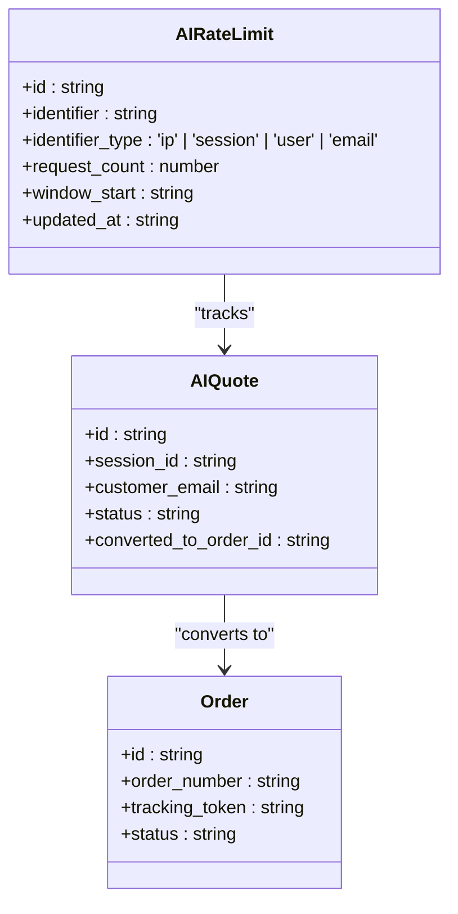
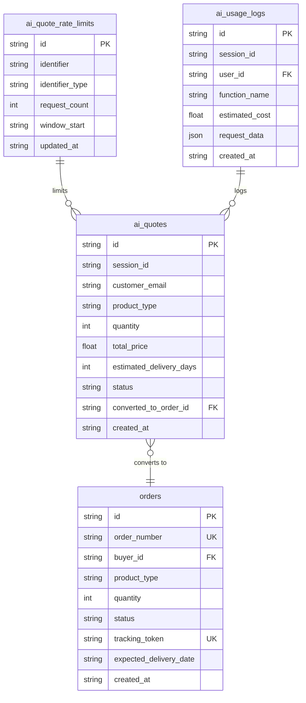

# Edge Functions API

<cite>
**Referenced Files in This Document**   
- [ai-quote-generator/index.ts](file://supabase/functions/ai-quote-generator/index.ts)
- [ai-conversational-quote/index.ts](file://supabase/functions/ai-conversational-quote/index.ts)
- [parse-quote-description/index.ts](file://supabase/functions/parse-quote-description/index.ts)
- [convert-quote-to-order/index.ts](file://supabase/functions/convert-quote-to-order/index.ts)
- [config.toml](file://supabase/config.toml)
- [logger.ts](file://supabase/functions/_shared/logger.ts)
- [aiQuote.ts](file://src/lib/api/aiQuote.ts)
- [client.ts](file://src/integrations/supabase/client.ts)
- [database.ts](file://src/types/database.ts)
</cite>

## Table of Contents
1. [Introduction](#introduction)
2. [Function Invocation Patterns](#function-invocation-patterns)
3. [ai-quote-generator](#ai-quote-generator)
4. [ai-conversational-quote](#ai-conversational-quote)
5. [parse-quote-description](#parse-quote-description)
6. [convert-quote-to-order](#convert-quote-to-order)
7. [Authentication and Security](#authentication-and-security)
8. [Rate Limiting Strategies](#rate-limiting-strategies)
9. [Logging and Monitoring](#logging-and-monitoring)
10. [Environment Variables](#environment-variables)
11. [Troubleshooting Guide](#troubleshooting-guide)

## Introduction

The Supabase Edge Functions API in sleekapp-v100 provides a suite of AI-powered functions for quote generation, order conversion, and natural language processing in the apparel manufacturing domain. These functions enable seamless interaction between the frontend application and backend services, leveraging AI to provide intelligent quote generation, conversational interfaces, and automated order processing.

The API consists of four core functions:
- `ai-quote-generator`: Generates AI-powered quotes with Bangladesh manufacturing intelligence
- `ai-conversational-quote`: Provides conversational quote generation with market research integration
- `parse-quote-description`: Parses natural language descriptions into structured quote data
- `convert-quote-to-order`: Converts approved quotes into production orders

These functions work together to create a comprehensive quote-to-order workflow, with robust security, rate limiting, and logging mechanisms in place.

**Section sources**
- [ai-quote-generator/index.ts](file://supabase/functions/ai-quote-generator/index.ts)
- [ai-conversational-quote/index.ts](file://supabase/functions/ai-conversational-quote/index.ts)
- [parse-quote-description/index.ts](file://supabase/functions/parse-quote-description/index.ts)
- [convert-quote-to-order/index.ts](file://supabase/functions/convert-quote-to-order/index.ts)

## Function Invocation Patterns

The Edge Functions are invoked from the frontend using the Supabase client's `invoke()` method. Each function follows a consistent pattern for request/response handling with proper error management and CORS support.



**Diagram sources**
- [aiQuote.ts](file://src/lib/api/aiQuote.ts)
- [client.ts](file://src/integrations/supabase/client.ts)

**Section sources**
- [aiQuote.ts](file://src/lib/api/aiQuote.ts)
- [client.ts](file://src/integrations/supabase/client.ts)

## ai-quote-generator

The `ai-quote-generator` function generates AI-powered manufacturing quotes with Bangladesh-specific pricing intelligence. It validates input, applies rate limiting, calculates pricing based on configuration, and returns a comprehensive quote with timeline and AI insights.

### Request/Response Payloads

**Request Payload:**
```json
{
  "productType": "string",
  "quantity": "number",
  "complexityLevel": "simple|medium|complex",
  "fabricType": "string",
  "additionalRequirements": "string",
  "customerEmail": "string",
  "customerName": "string",
  "targetDate": "string",
  "sessionId": "string",
  "files": [
    {
      "name": "string",
      "type": "string",
      "data": "base64"
    }
  ]
}
```

**Response Payload:**
```json
{
  "success": "boolean",
  "quote": "object",
  "timeline": "array",
  "aiInsights": "string",
  "requestId": "string"
}
```

### Authentication and Validation

The function supports both authenticated and anonymous users:
- Authenticated users are identified via the Authorization header
- Anonymous users are tracked via session ID
- Customer email is required for all requests
- Input validation is performed using Zod schema validation



**Diagram sources**
- [ai-quote-generator/index.ts](file://supabase/functions/ai-quote-generator/index.ts)
- [database.ts](file://src/types/database.ts)

**Section sources**
- [ai-quote-generator/index.ts](file://supabase/functions/ai-quote-generator/index.ts)
- [aiQuote.ts](file://src/lib/api/aiQuote.ts)

## ai-conversational-quote

The `ai-conversational-quote` function provides a conversational interface for quote generation, integrating market research data to provide more accurate pricing. It requires reCAPTCHA verification and implements multiple layers of rate limiting.

### Request/Response Payloads

**Request Payload:**
```json
{
  "productType": "string",
  "quantity": "number",
  "fabricType": "string",
  "complexity": "string",
  "additionalRequirements": "string",
  "customerEmail": "string",
  "customerName": "string",
  "country": "string",
  "phoneNumber": "string",
  "sessionId": "string",
  "marketResearchId": "string",
  "captchaToken": "string"
}
```

**Response Payload:**
```json
{
  "success": "boolean",
  "quote": {
    "id": "string",
    "unitPrice": "number",
    "totalPrice": "number",
    "estimatedDeliveryDays": "number",
    "confidenceScore": "number",
    "priceBreakdown": "object",
    "priceJustification": "string",
    "comparableProducts": "array",
    "suggestions": "string"
  }
}
```

### Business Process

The function follows a multi-step process:
1. Verify reCAPTCHA token to prevent abuse
2. Apply IP-based rate limiting (5 requests/hour)
3. Apply email-based rate limiting (10 requests/day)
4. Fetch or generate market research data
5. Generate quote using AI with market research context
6. Save quote to database with research references



**Diagram sources**
- [ai-conversational-quote/index.ts](file://supabase/functions/ai-conversational-quote/index.ts)
- [database.ts](file://src/types/database.ts)

**Section sources**
- [ai-conversational-quote/index.ts](file://supabase/functions/ai-conversational-quote/index.ts)

## parse-quote-description

The `parse-quote-description` function extracts structured data from natural language descriptions of manufacturing quotes. It uses AI to parse unstructured text into standardized fields for quote generation.

### Request/Response Payloads

**Request Payload:**
```json
{
  "description": "string"
}
```

**Response Payload:**
```json
{
  "success": "boolean",
  "parsed": {
    "productType": "string",
    "quantity": "number",
    "fabricType": "string",
    "complexityLevel": "simple|medium|complex",
    "additionalRequirements": "string"
  },
  "rawDescription": "string"
}
```

### Server-Side Logic

The function uses a specialized AI prompt to extract specific fields from the description:
- Maps product types to standardized categories
- Extracts quantity when mentioned
- Identifies fabric types
- Determines complexity level based on customization keywords
- Captures additional requirements like logos, prints, and shipping destinations



**Diagram sources**
- [parse-quote-description/index.ts](file://supabase/functions/parse-quote-description/index.ts)

**Section sources**
- [parse-quote-description/index.ts](file://supabase/functions/parse-quote-description/index.ts)

## convert-quote-to-order

The `convert-quote-to-order` function converts an approved quote into a production order. It handles user creation, order generation, and confirmation email sending.

### Request/Response Payloads

**Request Payload:**
```json
{
  "quoteId": "string"
}
```

**Response Payload:**
```json
{
  "success": "boolean",
  "order": {
    "id": "string",
    "orderNumber": "string",
    "trackingToken": "string",
    "trackingUrl": "string"
  }
}
```

### Business Process

The function executes the following steps:
1. Validate quote ID parameter
2. Fetch the quote from the database
3. Check if quote has already been converted
4. Ensure user is authenticated
5. Create or retrieve buyer user account
6. Generate unique order number and tracking token
7. Create order record in the orders table
8. Update quote status to "converted"
9. Send order confirmation email via Resend



**Diagram sources**
- [convert-quote-to-order/index.ts](file://supabase/functions/convert-quote-to-order/index.ts)
- [database.ts](file://src/types/database.ts)

**Section sources**
- [convert-quote-to-order/index.ts](file://supabase/functions/convert-quote-to-order/index.ts)
- [aiQuote.ts](file://src/lib/api/aiQuote.ts)

## Authentication and Security

The Edge Functions implement multiple security measures to protect sensitive operations and prevent abuse.

### Authentication Mechanisms

Different functions have varying authentication requirements:

| Function | Authentication Required | Method | Configuration |
|--------|------------------------|--------|---------------|
| ai-quote-generator | Optional | JWT via Authorization header | verify_jwt = false |
| ai-conversational-quote | Optional | reCAPTCHA token | verify_jwt = false |
| parse-quote-description | None | None | verify_jwt = false |
| convert-quote-to-order | Required | JWT via Supabase auth | verify_jwt = true |

The `config.toml` file configures JWT verification for each function, with most quote-related functions allowing anonymous access while order conversion requires authentication.

### Security Considerations

Key security features include:
- Origin validation for production requests
- reCAPTCHA verification for conversational quotes
- PII sanitization in logs using the shared logger
- Environment variable validation
- Input validation with Zod schemas
- Rate limiting at multiple levels



**Diagram sources**
- [config.toml](file://supabase/config.toml)
- [logger.ts](file://supabase/functions/_shared/logger.ts)
- [ai-quote-generator/index.ts](file://supabase/functions/ai-quote-generator/index.ts)

**Section sources**
- [config.toml](file://supabase/config.toml)
- [logger.ts](file://supabase/functions/_shared/logger.ts)

## Rate Limiting Strategies

The API implements tiered rate limiting to prevent abuse while accommodating legitimate usage patterns.

### Rate Limiting Implementation

Each function applies rate limiting based on different identifiers:

**ai-quote-generator:**
- IP-based: 15 requests per day
- Session-based: 3 requests per day (anonymous users)
- User-based: 20 requests per day (authenticated users)

**ai-conversational-quote:**
- IP-based: 5 requests per hour
- Email-based: 10 requests per day

The rate limiting data is stored in the `ai_quote_rate_limits` table with fields for identifier, identifier type, request count, and window start.



**Diagram sources**
- [ai-quote-generator/index.ts](file://supabase/functions/ai-quote-generator/index.ts)
- [ai-conversational-quote/index.ts](file://supabase/functions/ai-conversational-quote/index.ts)
- [database.ts](file://src/types/database.ts)

**Section sources**
- [ai-quote-generator/index.ts](file://supabase/functions/ai-quote-generator/index.ts)
- [ai-conversational-quote/index.ts](file://supabase/functions/ai-conversational-quote/index.ts)

## Logging and Monitoring

The API uses a comprehensive logging system with PII sanitization to ensure security while enabling effective monitoring and debugging.

### Shared Logger

The `_shared/logger.ts` file provides a structured logging utility that automatically sanitizes sensitive data:

- Email addresses: Shows first 3 characters and domain (e.g., joh***@example.com)
- Phone numbers: Shows first 4 and last 2 digits (e.g., +880****90)
- Order IDs: Shows first 8 characters (e.g., 550e8400-****)
- Passwords, tokens, secrets: Redacted as [REDACTED]

The logger supports different log levels:
- info: General operational messages
- warn: Recoverable issues
- error: Failures and exceptions
- success: Completed operations

### AI Usage Logging

Both quote functions log AI usage to track costs and monitor usage patterns:
- Function name
- Estimated cost
- Request data (sanitized)
- Session ID
- User ID (if authenticated)

This data is stored in the `ai_usage_logs` table for analysis and cost tracking.



**Diagram sources**
- [logger.ts](file://supabase/functions/_shared/logger.ts)
- [database.ts](file://src/types/database.ts)

**Section sources**
- [logger.ts](file://supabase/functions/_shared/logger.ts)

## Environment Variables

The Edge Functions require specific environment variables to operate securely and efficiently.

### Required Environment Variables

| Variable | Function | Purpose | Security Level |
|---------|--------|-------|---------------|
| SUPABASE_URL | All functions | Supabase project URL | Required |
| SUPABASE_SERVICE_ROLE_KEY | All functions | Service role key for database access | Secret |
| SUPABASE_ANON_KEY | generate-invoice | Anonymous key for authenticated requests | Secret |
| LOVABLE_API_KEY | ai-quote-generator, ai-conversational-quote, parse-quote-description | API key for Lovable AI service | Secret |
| RESEND_API_KEY | convert-quote-to-order | API key for email sending service | Secret |
| RECAPTCHA_SECRET_KEY | ai-conversational-quote | Secret key for reCAPTCHA verification | Secret |

The functions validate required environment variables at startup and return generic error messages to clients while logging specific error codes for debugging.

### Configuration Validation

The `ai-quote-generator` function validates its environment variables:
```typescript
const requiredEnvVars = ['SUPABASE_URL', 'SUPABASE_SERVICE_ROLE_KEY', 'LOVABLE_API_KEY'];
const missingVars = requiredEnvVars.filter(varName => !Deno.env.get(varName));
if (missingVars.length > 0) {
  console.error(`[${requestId}] Configuration error: ENV_CONFIG_001`);
  return new Response(
    JSON.stringify({
      error: 'Service temporarily unavailable',
      code: 'ENV_001',
      message: 'Please try again later or contact support.',
      supportContact: 'support@sleekapparels.com',
      requestId
    }),
    { status: 500, headers: { ...corsHeaders, 'Content-Type': 'application/json' } }
  );
}
```

**Section sources**
- [ai-quote-generator/index.ts](file://supabase/functions/ai-quote-generator/index.ts)
- [convert-quote-to-order/index.ts](file://supabase/functions/convert-quote-to-order/index.ts)

## Troubleshooting Guide

This section provides guidance for common issues encountered when using the Edge Functions API.

### CORS Errors

**Symptoms:**
- Browser console shows CORS errors
- Preflight OPTIONS requests failing
- "No 'Access-Control-Allow-Origin' header" errors

**Solutions:**
1. Ensure the request origin is in the allowed list:
   - Production: https://sleekapparels.com, https://www.sleekapparels.com
   - Development: http://localhost:5173, http://localhost:3000
2. Verify the request includes proper headers:
   ```typescript
   const corsHeaders = {
     'Access-Control-Allow-Origin': '*',
     'Access-Control-Allow-Headers': 'authorization, x-client-info, apikey, content-type',
   };
   ```
3. Ensure the function handles OPTIONS preflight requests:
   ```typescript
   if (req.method === 'OPTIONS') {
     return new Response(null, { headers: corsHeaders });
   }
   ```

### Authentication Failures

**Symptoms:**
- 401 Unauthorized errors
- "Authentication required" responses
- Session not persisting

**Solutions:**
1. For `convert-quote-to-order`, ensure the user is authenticated:
   ```typescript
   const { data: { session } } = await supabase.auth.getSession();
   if (!session) {
     throw new Error('Authentication required to place order');
   }
   ```
2. Verify the Supabase client is properly configured:
   ```typescript
   export const supabase = createClient<Database>(SUPABASE_URL, SUPABASE_PUBLISHABLE_KEY, {
     auth: {
       storage: localStorage,
       persistSession: true,
       autoRefreshToken: true,
     }
   });
   ```
3. Check that the JWT token is being sent in the Authorization header.

### Payload Validation Problems

**Symptoms:**
- 400 Bad Request errors
- "Invalid input data" responses
- Specific field validation errors

**Solutions:**
1. For `ai-quote-generator`, ensure all required fields are present:
   - `productType`: string, 1-100 characters
   - `quantity`: number, 50-100000
   - `customerEmail`: valid email address
2. Use the Zod schema for validation:
   ```typescript
   const quoteRequestSchema = z.object({
     productType: z.string().trim().min(1).max(100),
     quantity: z.number().int().min(50).max(100000),
     customerEmail: z.string().email("Valid email is required").max(255),
   });
   ```
3. Handle validation errors appropriately:
   ```typescript
   if (error instanceof z.ZodError) {
     return new Response(
       JSON.stringify({ 
         error: 'Invalid input data. Please check your form and try again.',
         details: error.errors.map(e => ({ field: e.path.join('.'), message: e.message })),
         requestId
       }),
       { status: 400, headers: { ...corsHeaders, 'Content-Type': 'application/json' } }
     );
   }
   ```

### Rate Limiting Issues

**Symptoms:**
- 429 Too Many Requests errors
- "Rate limit exceeded" responses
- Unexpected request blocking

**Solutions:**
1. Understand the rate limits:
   - `ai-quote-generator`: 15/day per IP, 3/day per session (anonymous), 20/day per user (authenticated)
   - `ai-conversational-quote`: 5/hour per IP, 10/day per email
2. Implement retry logic with exponential backoff:
   ```typescript
   const retryAfter = parseInt(response.headers.get('Retry-After') || '60');
   await new Promise(resolve => setTimeout(resolve, retryAfter * 1000));
   ```
3. Use session IDs to maintain rate limit state across requests:
   ```typescript
   let sessionId = localStorage.getItem('quote_session_id');
   if (!sessionId) {
     sessionId = crypto.randomUUID();
     localStorage.setItem('quote_session_id', sessionId);
   }
   ```

**Section sources**
- [ai-quote-generator/index.ts](file://supabase/functions/ai-quote-generator/index.ts)
- [ai-conversational-quote/index.ts](file://supabase/functions/ai-conversational-quote/index.ts)
- [client.ts](file://src/integrations/supabase/client.ts)