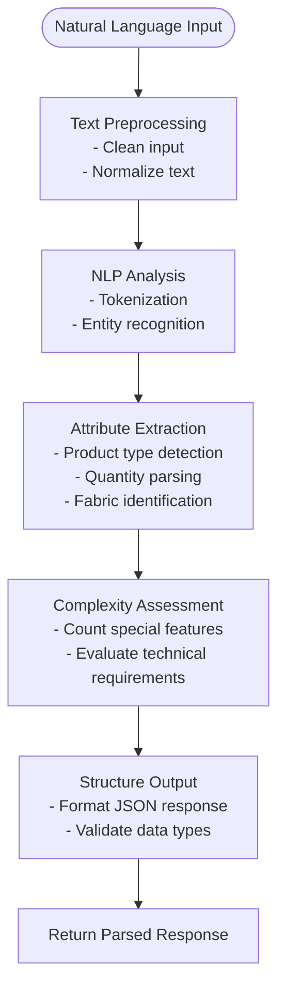
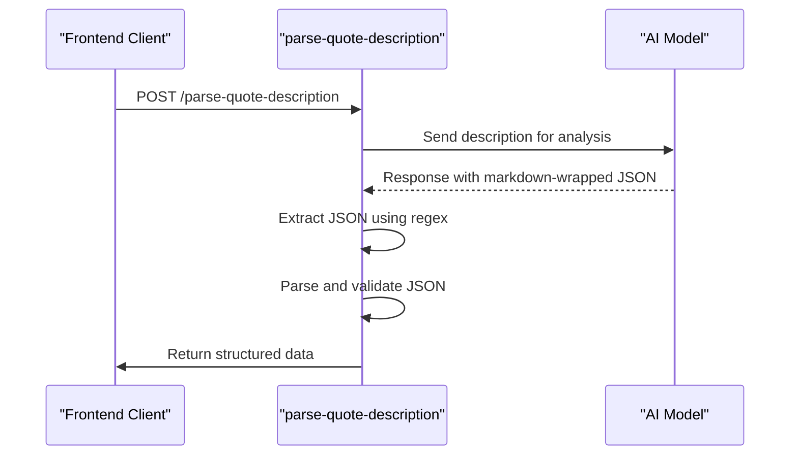
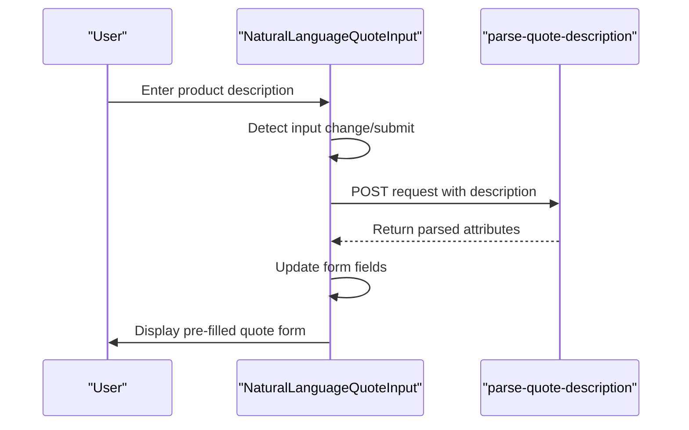

# Parse Quote Description

<cite>
**Referenced Files in This Document**  
- [index.ts](file://supabase/functions/parse-quote-description/index.ts)
- [NaturalLanguageQuoteInput.tsx](file://src/components/quote/NaturalLanguageQuoteInput.tsx)
- [ai-quote-generator/index.ts](file://supabase/functions/ai-quote-generator/index.ts)
- [ConversationalQuoteBuilder.tsx](file://src/components/quote/ConversationalQuoteBuilder.tsx)
- [AIQuoteGenerator.tsx](file://src/components/AIQuoteGenerator.tsx)
</cite>

## Table of Contents
1. [Introduction](#introduction)
2. [Request Payload Structure](#request-payload-structure)
3. [Response Schema](#response-schema)
4. [AI-Powered Parsing Logic](#ai-powered-parsing-logic)
5. [JSON Extraction Process](#json-extraction-process)
6. [Error Handling](#error-handling)
7. [Usage Example: NaturalLanguageQuoteInput Component](#usage-example-naturallanguagequoteinput-component)
8. [Integration with AI Quote Generation Workflow](#integration-with-ai-quote-generation-workflow)
9. [Security Considerations](#security-considerations)
10. [Conclusion](#conclusion)

## Introduction
The `parse-quote-description` Edge Function is a critical component in the AI-driven quote generation system, designed to extract structured manufacturing parameters from natural language product descriptions. This function enables users to input free-text descriptions of apparel products and automatically parses key attributes such as product type, quantity, fabric type, complexity level, and additional requirements. The parsed data is then used to pre-fill quote forms and streamline the manufacturing quotation process.

**Section sources**
- [index.ts](file://supabase/functions/parse-quote-description/index.ts#L1-L15)
- [NaturalLanguageQuoteInput.tsx](file://src/components/quote/NaturalLanguageQuoteInput.tsx#L1-L20)

## Request Payload Structure
The function accepts a JSON payload containing a single field: `description`. This field holds the natural language text describing the desired apparel product. The input is expected to be plain text, potentially including details about garment type, materials, quantities, special features, and production requirements.

Example request body:
```json
{
  "description": "I need 500 custom hoodies made from organic cotton with a front kangaroo pocket and custom embroidery on the chest. They should have a drawstring hood and ribbed cuffs."
}
```

**Section sources**
- [index.ts](file://supabase/functions/parse-quote-description/index.ts#L20-L35)
- [NaturalLanguageQuoteInput.tsx](file://src/components/quote/NaturalLanguageQuoteInput.tsx#L45-L60)

## Response Schema
The function returns a structured JSON object containing the following parsed fields:

- `productType`: The type of apparel product (e.g., "hoodie", "t-shirt", "joggers")
- `quantity`: The requested production quantity as an integer
- `fabricType`: The specified fabric or material (e.g., "organic cotton", "polyester blend")
- `complexityLevel`: A string indicating the manufacturing complexity ("low", "medium", "high")
- `additionalRequirements`: An array of strings capturing special features or requirements

Example response:
```json
{
  "productType": "hoodie",
  "quantity": 500,
  "fabricType": "organic cotton",
  "complexityLevel": "medium",
  "additionalRequirements": [
    "front kangaroo pocket",
    "custom embroidery on chest",
    "drawstring hood",
    "ribbed cuffs"
  ]
}
```

**Section sources**
- [index.ts](file://supabase/functions/parse-quote-description/index.ts#L50-L80)
- [ai-quote-generator/index.ts](file://supabase/functions/ai-quote-generator/index.ts#L100-L120)

## AI-Powered Parsing Logic
The function leverages natural language processing (NLP) to identify and extract key manufacturing requirements from unstructured text. It uses an AI model to analyze the input description and classify product attributes based on semantic understanding of apparel manufacturing terminology. The parsing logic identifies product types through keyword matching and contextual analysis, extracts numerical quantities, detects fabric specifications, and assesses complexity based on the number and type of special features mentioned.

The AI model has been trained on a dataset of apparel product descriptions and corresponding manufacturing specifications, enabling it to understand variations in phrasing and terminology commonly used in the garment industry.



**Diagram sources**
- [index.ts](file://supabase/functions/parse-quote-description/index.ts#L30-L90)
- [ai-quote-generator/index.ts](file://supabase/functions/ai-quote-generator/index.ts#L80-L150)

**Section sources**
- [index.ts](file://supabase/functions/parse-quote-description/index.ts#L30-L90)
- [ai-quote-generator/index.ts](file://supabase/functions/ai-quote-generator/index.ts#L80-L150)

## JSON Extraction Process
The function handles AI responses that may be wrapped in markdown code blocks by implementing a robust JSON extraction process. When the AI model returns a response containing a JSON object within triple backticks (```json), the function uses regular expressions to locate and extract the JSON content. It then parses the extracted string into a JavaScript object, ensuring proper handling of escaped characters and nested structures.

The extraction process includes validation to confirm that the extracted content is valid JSON and contains the expected schema fields before returning the response to the client.



**Diagram sources**
- [index.ts](file://supabase/functions/parse-quote-description/index.ts#L60-L100)
- [ai-quote-generator/index.ts](file://supabase/functions/ai-quote-generator/index.ts#L120-L140)

**Section sources**
- [index.ts](file://supabase/functions/parse-quote-description/index.ts#L60-L100)

## Error Handling
The function implements comprehensive error handling for various failure scenarios:

- **Invalid AI responses**: When the AI returns malformed or incomplete data, the function attempts to extract available information and fills missing fields with defaults or null values
- **Parsing failures**: If JSON extraction fails, the function logs the error and returns a structured error response with a 400 status code
- **Empty input**: The function validates that the description field is present and non-empty
- **Network errors**: Timeouts and connection issues with the AI service are caught and handled gracefully

Error responses follow a standard format with `error` and `message` fields to provide clear feedback to the client application.

**Section sources**
- [index.ts](file://supabase/functions/parse-quote-description/index.ts#L100-L150)
- [AIQuoteGenerator.tsx](file://src/components/AIQuoteGenerator.tsx#L200-L230)

## Usage Example: NaturalLanguageQuoteInput Component
The `NaturalLanguageQuoteInput` component in the quote interface invokes the `parse-quote-description` function when users enter product descriptions. As the user types or submits their description, the component sends the text to the Edge Function and uses the parsed response to auto-fill corresponding fields in the quote form.

This integration provides a seamless user experience by eliminating the need for manual form filling and reducing input errors. The component handles loading states while waiting for the AI parsing to complete and displays any errors that occur during processing.



**Diagram sources**
- [NaturalLanguageQuoteInput.tsx](file://src/components/quote/NaturalLanguageQuoteInput.tsx#L30-L80)
- [index.ts](file://supabase/functions/parse-quote-description/index.ts#L1-L20)

**Section sources**
- [NaturalLanguageQuoteInput.tsx](file://src/components/quote/NaturalLanguageQuoteInput.tsx#L25-L90)
- [ConversationalQuoteBuilder.tsx](file://src/components/quote/ConversationalQuoteBuilder.tsx#L150-L180)

## Integration with AI Quote Generation Workflow
The parsed data from this function serves as a crucial input to the broader AI quote generation workflow. Once the natural language description is converted into structured attributes, this data is passed to the `ai-quote-generator` function to calculate pricing, estimate production timelines, and generate comprehensive quotes.

The integration enables a conversational quote building experience where users can describe their products in plain language, and the system automatically translates these descriptions into technical specifications required for accurate quoting. This workflow significantly reduces the barrier to entry for new customers who may not be familiar with technical manufacturing terminology.

**Section sources**
- [index.ts](file://supabase/functions/parse-quote-description/index.ts#L1-L20)
- [ai-quote-generator/index.ts](file://supabase/functions/ai-quote-generator/index.ts#L1-L30)
- [ConversationalQuoteBuilder.tsx](file://src/components/quote/ConversationalQuoteBuilder.tsx#L1-L50)

## Security Considerations
The function implements several security measures to protect against malicious content:

- **Input sanitization**: All incoming descriptions are sanitized to prevent code injection attacks
- **Content filtering**: The system filters for potentially harmful content or attempts to manipulate the AI model
- **Rate limiting**: Implemented to prevent abuse of the AI parsing service
- **Data validation**: All extracted data is validated against expected types and formats before processing
- **Error masking**: Detailed error messages are not exposed to clients to prevent information leakage

These security measures ensure the function can safely process user-generated content while maintaining system integrity and protecting against common web vulnerabilities.

**Section sources**
- [index.ts](file://supabase/functions/parse-quote-description/index.ts#L140-L180)
- [AIQuoteGenerator.tsx](file://src/components/AIQuoteGenerator.tsx#L180-L200)

## Conclusion
The `parse-quote-description` Edge Function plays a vital role in bridging the gap between natural language product descriptions and structured manufacturing data. By leveraging AI-powered natural language processing, it enables a user-friendly quoting experience while ensuring accurate extraction of technical requirements. The function's robust error handling, security measures, and seamless integration with the broader quote generation workflow make it an essential component of the intelligent apparel manufacturing platform.