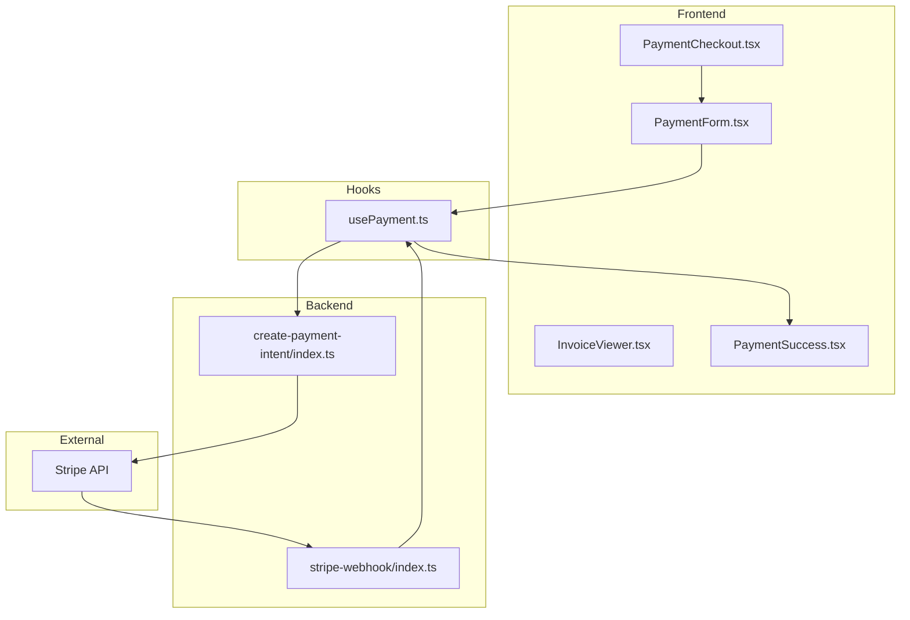
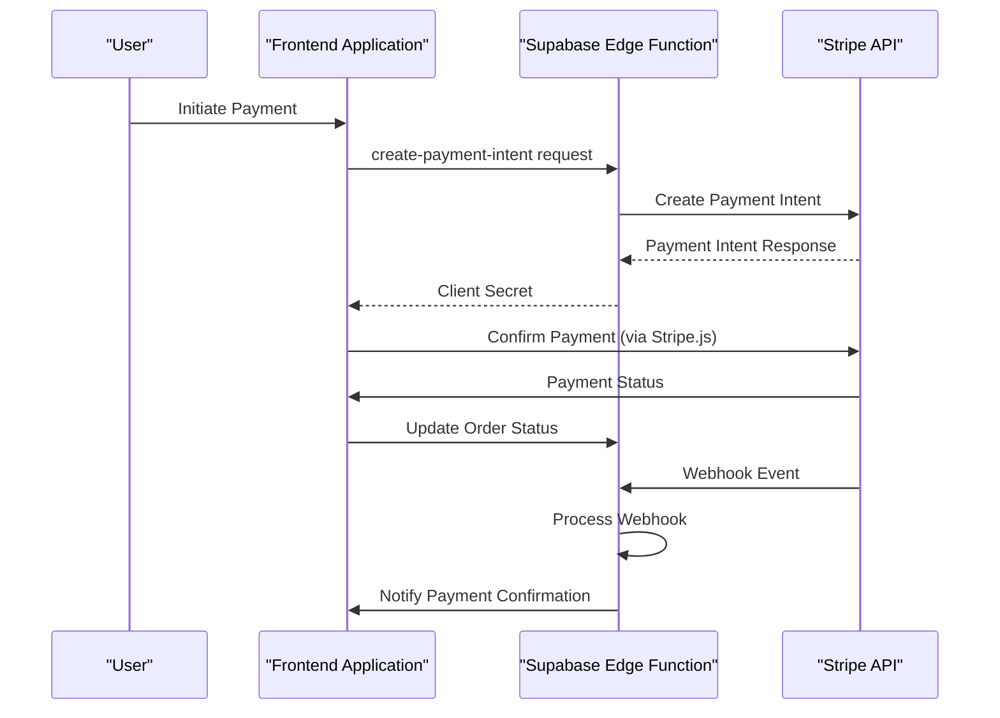
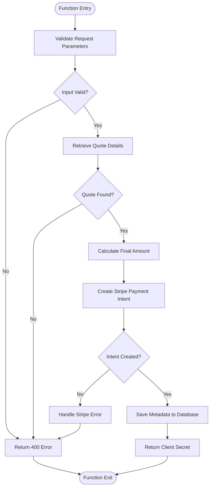
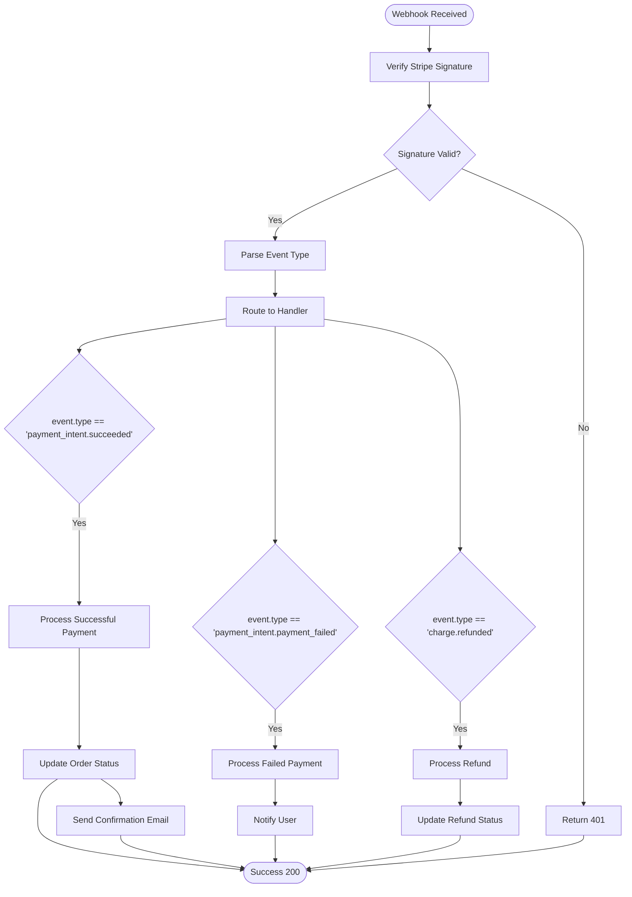
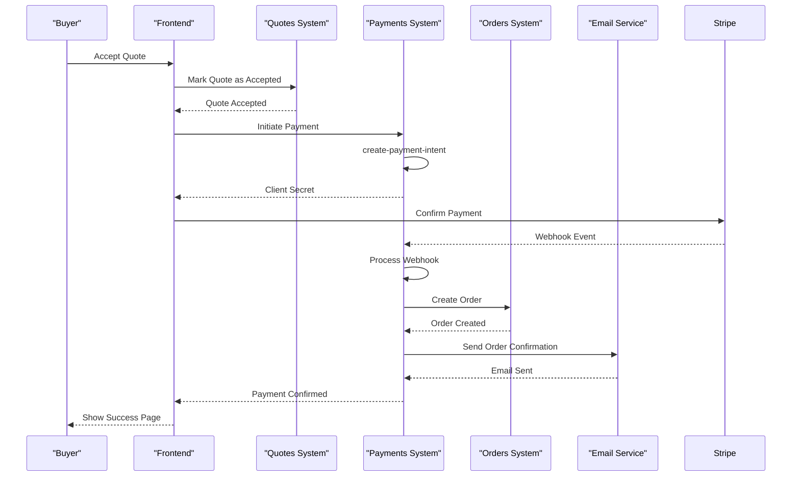
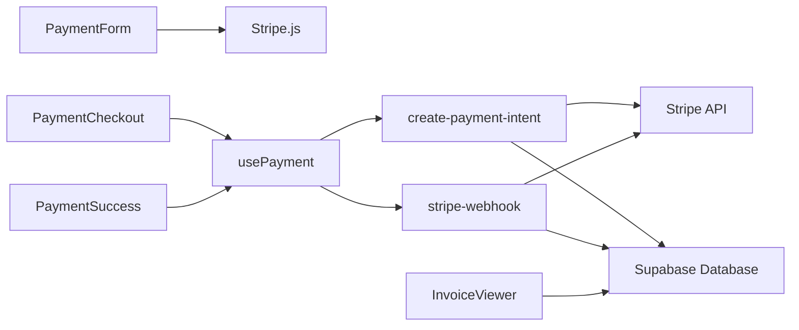

# Payment API

<cite>
**Referenced Files in This Document**  
- [create-payment-intent/index.ts](file://supabase/functions/create-payment-intent/index.ts)
- [stripe-webhook/index.ts](file://supabase/functions/stripe-webhook/index.ts)
- [usePayment.ts](file://src/hooks/usePayment.ts)
- [PaymentForm.tsx](file://src/components/payment/PaymentForm.tsx)
- [InvoiceViewer.tsx](file://src/components/payment/InvoiceViewer.tsx)
- [PaymentCheckout.tsx](file://src/pages/PaymentCheckout.tsx)
- [PaymentSuccess.tsx](file://src/pages/PaymentSuccess.tsx)
</cite>

## Table of Contents
1. [Introduction](#introduction)
2. [Project Structure](#project-structure)
3. [Core Components](#core-components)
4. [Architecture Overview](#architecture-overview)
5. [Detailed Component Analysis](#detailed-component-analysis)
6. [Dependency Analysis](#dependency-analysis)
7. [Performance Considerations](#performance-considerations)
8. [Troubleshooting Guide](#troubleshooting-guide)
9. [Conclusion](#conclusion)

## Introduction
This document provides comprehensive documentation for the payment API integration in sleekapp-v100, which leverages Stripe for secure transaction processing. The system centers around the `create-payment-intent` Edge Function that generates Stripe payment intents with appropriate metadata and webhook endpoints. It covers the complete payment lifecycle from quote conversion to order placement and payment confirmation. The documentation includes details on webhook handling for various payment events such as successful payments, failed payments, and refunds. Implementation guidance for the payment UI with proper error handling and success states is provided, along with critical security considerations for PCI compliance, protection of payment information, and fraud prevention. Troubleshooting guidance addresses common issues including declined cards, webhook delivery failures, and currency conversion problems.

## Project Structure
The payment system in sleekapp-v100 follows a modular architecture with clear separation between frontend components, backend functions, and integration layers. The core payment functionality is implemented through Supabase Edge Functions that interface with Stripe's API, while the frontend components provide the user interface for payment processing.

**Diagram sources**
- [PaymentForm.tsx](file://src/components/payment/PaymentForm.tsx)
- [usePayment.ts](file://src/hooks/usePayment.ts)
- [create-payment-intent/index.ts](file://supabase/functions/create-payment-intent/index.ts)
- [stripe-webhook/index.ts](file://supabase/functions/stripe-webhook/index.ts)
- [PaymentCheckout.tsx](file://src/pages/PaymentCheckout.tsx)
- [PaymentSuccess.tsx](file://src/pages/PaymentSuccess.tsx)

**Section sources**
- [PaymentForm.tsx](file://src/components/payment/PaymentForm.tsx)
- [create-payment-intent/index.ts](file://supabase/functions/create-payment-intent/index.ts)
- [stripe-webhook/index.ts](file://supabase/functions/stripe-webhook/index.ts)

## Core Components
The payment system consists of several core components that work together to provide a seamless and secure payment experience. The `create-payment-intent` Edge Function is responsible for creating Stripe payment intents with proper metadata, while the `stripe-webhook` function handles incoming payment events from Stripe. The frontend components include the `PaymentForm` for collecting payment information, `InvoiceViewer` for displaying invoice details, and dedicated pages for the checkout and success states. The `usePayment` custom hook orchestrates the payment flow between the frontend and backend components, managing state and handling callbacks.

**Section sources**
- [create-payment-intent/index.ts](file://supabase/functions/create-payment-intent/index.ts)
- [stripe-webhook/index.ts](file://supabase/functions/stripe-webhook/index.ts)
- [usePayment.ts](file://src/hooks/usePayment.ts)

## Architecture Overview
The payment architecture in sleekapp-v100 follows a secure, serverless pattern that minimizes the handling of sensitive payment information on the client side. The system uses Stripe's Payment Intents API to manage the payment lifecycle, with Supabase Edge Functions serving as the secure intermediary between the frontend application and Stripe's API.

**Diagram sources**
- [create-payment-intent/index.ts](file://supabase/functions/create-payment-intent/index.ts)
- [stripe-webhook/index.ts](file://supabase/functions/stripe-webhook/index.ts)

## Detailed Component Analysis

### create-payment-intent Edge Function
The `create-payment-intent` Edge Function is responsible for creating Stripe payment intents with the appropriate metadata and configuration. This serverless function receives payment details from the frontend, validates the request, and creates a payment intent with Stripe.

**Diagram sources**
- [create-payment-intent/index.ts](file://supabase/functions/create-payment-intent/index.ts)

**Section sources**
- [create-payment-intent/index.ts](file://supabase/functions/create-payment-intent/index.ts)

### Webhook Handling
The `stripe-webhook` function handles incoming events from Stripe, processing payment confirmations, failures, and other events. This function ensures that the application's internal state is synchronized with Stripe's records.

**Diagram sources**
- [stripe-webhook/index.ts](file://supabase/functions/stripe-webhook/index.ts)

**Section sources**
- [stripe-webhook/index.ts](file://supabase/functions/stripe-webhook/index.ts)

### Payment Flow from Quote to Order
The payment system integrates with the quote management system to enable seamless conversion from quote to order upon successful payment.

**Diagram sources**
- [create-payment-intent/index.ts](file://supabase/functions/create-payment-intent/index.ts)
- [stripe-webhook/index.ts](file://supabase/functions/stripe-webhook/index.ts)
- [convert-quote-to-order/index.ts](file://supabase/functions/convert-quote-to-order/index.ts)

## Dependency Analysis
The payment system has several critical dependencies that enable its functionality. The primary external dependency is Stripe's API for payment processing. The system also depends on Supabase for database operations and as the serverless function platform. The frontend components depend on Stripe.js for secure payment form handling.

**Diagram sources**
- [package.json](file://package.json)
- [create-payment-intent/index.ts](file://supabase/functions/create-payment-intent/index.ts)
- [stripe-webhook/index.ts](file://supabase/functions/stripe-webhook/index.ts)

**Section sources**
- [package.json](file://package.json)
- [create-payment-intent/index.ts](file://supabase/functions/create-payment-intent/index.ts)

## Performance Considerations
The payment system is designed with performance and reliability in mind. The use of serverless functions ensures scalability during peak payment periods. The system implements appropriate error handling and retry mechanisms for external API calls. Caching strategies are employed for frequently accessed data such as exchange rates and product information to minimize latency. The frontend components are optimized to provide immediate feedback to users during the payment process, with skeleton loaders and progress indicators to maintain perceived performance.

## Troubleshooting Guide
This section provides guidance for diagnosing and resolving common payment issues.

### Common Payment Issues
| Issue | Possible Causes | Solutions |
|------|----------------|----------|
| **Declined Cards** | Insufficient funds, expired card, bank fraud detection | Implement clear error messaging, suggest alternative payment methods, advise customer to contact their bank |
| **Webhook Delivery Failures** | Network issues, server downtime, incorrect webhook URL | Implement webhook retry logic, monitor delivery status, verify endpoint configuration |
| **Currency Conversion Problems** | Incorrect exchange rates, rounding errors, currency mismatch | Ensure exchange rates are updated regularly, implement proper rounding logic, validate currency codes |
| **Payment Intent Creation Failures** | Invalid parameters, authentication issues, rate limiting | Validate input data, check API keys, implement exponential backoff for retries |
| **Delayed Payment Confirmation** | Network latency, processing delays, asynchronous operations | Implement polling mechanism, provide clear status updates, set appropriate timeouts |

**Section sources**
- [create-payment-intent/index.ts](file://supabase/functions/create-payment-intent/index.ts)
- [stripe-webhook/index.ts](file://supabase/functions/stripe-webhook/index.ts)
- [usePayment.ts](file://src/hooks/usePayment.ts)

## Conclusion
The payment API integration in sleekapp-v100 provides a secure and reliable system for processing payments through Stripe. By leveraging Supabase Edge Functions, the system maintains PCI compliance while providing a seamless user experience. The architecture effectively separates concerns between frontend and backend components, with well-defined interfaces and error handling. The comprehensive webhook handling ensures that payment events are properly processed and the application state remains consistent. With proper implementation of the documented components and adherence to security best practices, the payment system can handle the full range of payment scenarios while providing robust error handling and troubleshooting capabilities.