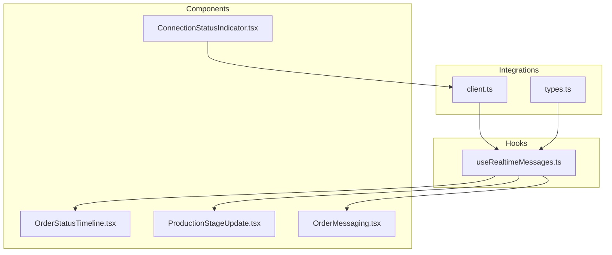
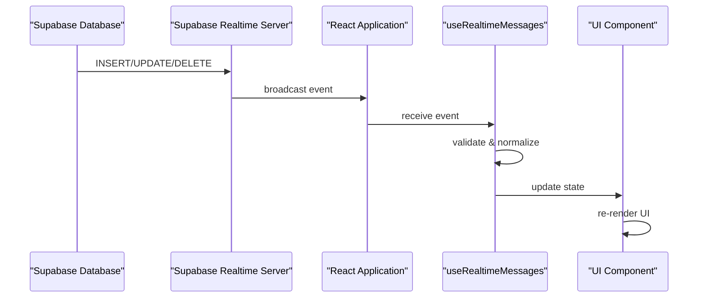
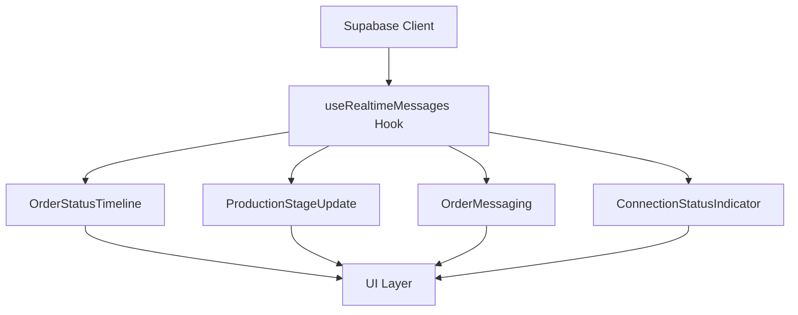

# Real-time Subscriptions

<cite>
**Referenced Files in This Document**  
- [client.ts](file://src/integrations/supabase/client.ts)
- [useRealtimeMessages.ts](file://src/hooks/useRealtimeMessages.ts)
- [types.ts](file://src/integrations/supabase/types.ts)
- [OrderStatusTimeline.tsx](file://src/components/OrderStatusTimeline.tsx)
- [ProductionStageUpdate.tsx](file://src/components/supplier/ProductionStageUpdate.tsx)
- [OrderMessaging.tsx](file://src/components/shared/OrderMessaging.tsx)
- [ConnectionStatusIndicator.tsx](file://src/components/production/ConnectionStatusIndicator.tsx)
</cite>

## Table of Contents
1. [Introduction](#introduction)
2. [Project Structure](#project-structure)
3. [Core Components](#core-components)
4. [Architecture Overview](#architecture-overview)
5. [Detailed Component Analysis](#detailed-component-analysis)
6. [Dependency Analysis](#dependency-analysis)
7. [Performance Considerations](#performance-considerations)
8. [Troubleshooting Guide](#troubleshooting-guide)
9. [Conclusion](#conclusion)

## Introduction
The real-time subscription system in sleekapp-v100 leverages Supabase's real-time capabilities to provide instant updates for order status changes, production stage updates, and messaging between buyers and suppliers. This documentation details the implementation patterns, channel conventions, and integration strategies used throughout the application to ensure seamless live data synchronization across client interfaces.

## Project Structure
The real-time functionality is organized across several key directories within the application structure. The Supabase integration layer resides in `src/integrations/supabase`, while real-time hooks are located in `src/hooks`. Component-level implementations are distributed across relevant feature directories such as `src/components/production`, `src/components/supplier`, and `src/components/shared`.



**Diagram sources**
- [client.ts](file://src/integrations/supabase/client.ts)
- [useRealtimeMessages.ts](file://src/hooks/useRealtimeMessages.ts)
- [OrderStatusTimeline.tsx](file://src/components/OrderStatusTimeline.tsx)

**Section sources**
- [client.ts](file://src/integrations/supabase/client.ts)
- [useRealtimeMessages.ts](file://src/hooks/useRealtimeMessages.ts)

## Core Components
The real-time system centers around the `useRealtimeMessages` custom hook, which provides a React-friendly interface for subscribing to Supabase real-time channels. This hook manages the lifecycle of subscriptions, handles reconnection logic, and normalizes incoming events for consistent consumption by UI components. Key functionality includes automatic subscription setup, error recovery, and memory leak prevention through proper cleanup.

**Section sources**
- [useRealtimeMessages.ts](file://src/hooks/useRealtimeMessages.ts)
- [client.ts](file://src/integrations/supabase/client.ts)

## Architecture Overview
The real-time architecture follows a publish-subscribe pattern where database changes trigger real-time events that are broadcast to authorized clients. The system uses Supabase's Postgres-backed real-time engine to push updates to subscribed channels, with client-side components consuming these updates through React hooks that automatically trigger UI re-renders.



**Diagram sources**
- [client.ts](file://src/integrations/supabase/client.ts)
- [useRealtimeMessages.ts](file://src/hooks/useRealtimeMessages.ts)

## Detailed Component Analysis

### Real-time Subscription Hook Analysis
The `useRealtimeMessages` hook encapsulates the complexity of managing Supabase real-time subscriptions within React components. It handles connection state, subscription lifecycle, and error recovery while providing a simple interface for components to receive real-time updates.

```mermaid
classDiagram
class useRealtimeMessages {
+subscribe(channel : string, callback : Function)
+unsubscribe(channel : string)
+reconnect()
-handleError(error)
-normalizeEvent(event)
-cleanupSubscriptions()
}
class SupabaseClient {
+channel(name : string)
+subscribe(callback)
+unsubscribe()
}
useRealtimeMessages --> SupabaseClient : "uses"
useRealtimeMessages ..> "UI Components" : "provides updates to"
```

**Diagram sources**
- [useRealtimeMessages.ts](file://src/hooks/useRealtimeMessages.ts)
- [client.ts](file://src/integrations/supabase/client.ts)

### Order Status Updates Implementation
The OrderStatusTimeline component subscribes to order status changes using channel names following the convention `order-status-{orderId}`. This allows for granular subscriptions to specific order updates, minimizing unnecessary data transfer and improving performance.

**Section sources**
- [OrderStatusTimeline.tsx](file://src/components/OrderStatusTimeline.tsx)
- [useRealtimeMessages.ts](file://src/hooks/useRealtimeMessages.ts)

### Production Stage Updates Implementation
The ProductionStageUpdate component enables suppliers to update production stages and broadcasts these changes to buyers in real-time. It uses channels named `production-stage-{orderId}` to ensure all stakeholders receive immediate updates about manufacturing progress.

**Section sources**
- [ProductionStageUpdate.tsx](file://src/components/supplier/ProductionStageUpdate.tsx)
- [useRealtimeMessages.ts](file://src/hooks/useRealtimeMessages.ts)

### Messaging System Implementation
The OrderMessaging component facilitates real-time communication between buyers and suppliers through dedicated message channels. Each conversation uses a channel named `messages-{orderId}` to isolate communications to specific orders, ensuring data privacy and efficient message routing.

**Section sources**
- [OrderMessaging.tsx](file://src/components/shared/OrderMessaging.tsx)
- [useRealtimeMessages.ts](file://src/hooks/useRealtimeMessages.ts)

## Dependency Analysis
The real-time system has a clear dependency hierarchy with well-defined interfaces between layers. The Supabase client provides the foundation, with the custom hook abstracting away implementation details for UI components.



**Diagram sources**
- [client.ts](file://src/integrations/supabase/client.ts)
- [useRealtimeMessages.ts](file://src/hooks/useRealtimeMessages.ts)

**Section sources**
- [client.ts](file://src/integrations/supabase/client.ts)
- [useRealtimeMessages.ts](file://src/hooks/useRealtimeMessages.ts)

## Performance Considerations
The real-time system implements several optimization strategies to ensure efficient operation:
- **Subscription Management**: Subscriptions are automatically cleaned up when components unmount to prevent memory leaks
- **Selective Listening**: Components subscribe only to relevant channels rather than broad broadcasts
- **Connection Pooling**: The Supabase client maintains a single connection for multiple subscriptions
- **Rate Limiting**: Server-side rate limiting prevents abuse of real-time channels
- **Payload Optimization**: Only necessary data fields are included in real-time events

**Section sources**
- [useRealtimeMessages.ts](file://src/hooks/useRealtimeMessages.ts)
- [client.ts](file://src/integrations/supabase/client.ts)

## Troubleshooting Guide
Common real-time issues and their solutions:

### Connection Interruptions
The system automatically attempts to reconnect when network interruptions occur. The ConnectionStatusIndicator component provides visual feedback about connection state and recovery attempts.

### Missed Events
For critical updates, the system implements a hybrid approach combining real-time events with periodic polling to ensure no updates are missed during brief disconnections.

### Authentication Issues
Channel access is controlled through Supabase's Row Level Security policies, ensuring users can only subscribe to channels for orders they are authorized to access.

**Section sources**
- [ConnectionStatusIndicator.tsx](file://src/components/production/ConnectionStatusIndicator.tsx)
- [client.ts](file://src/integrations/supabase/client.ts)

## Conclusion
The real-time subscription system in sleekapp-v100 provides a robust foundation for live updates across the platform. By leveraging Supabase's real-time capabilities with thoughtful client-side implementation, the system delivers immediate feedback for order status changes, production updates, and buyer-supplier communications while maintaining performance and security.