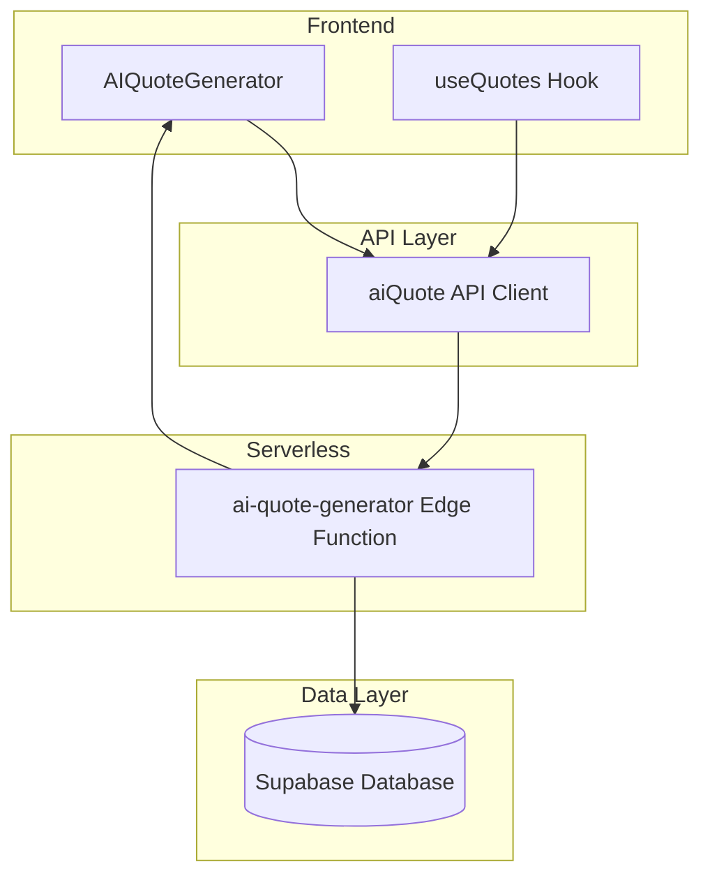
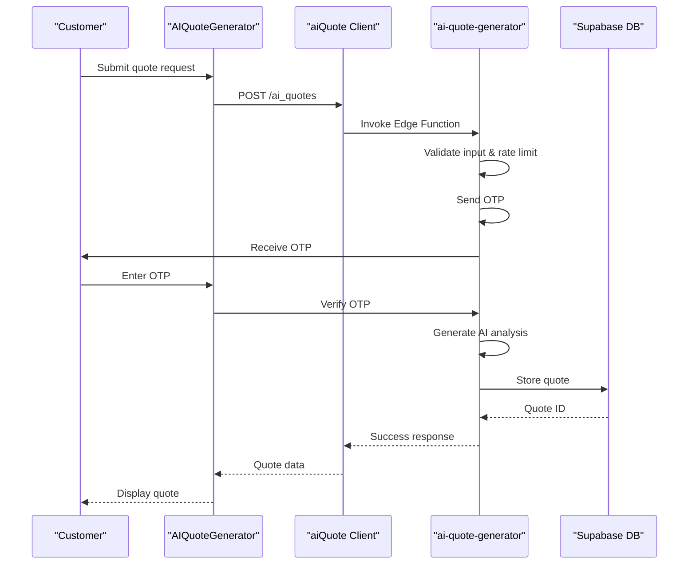
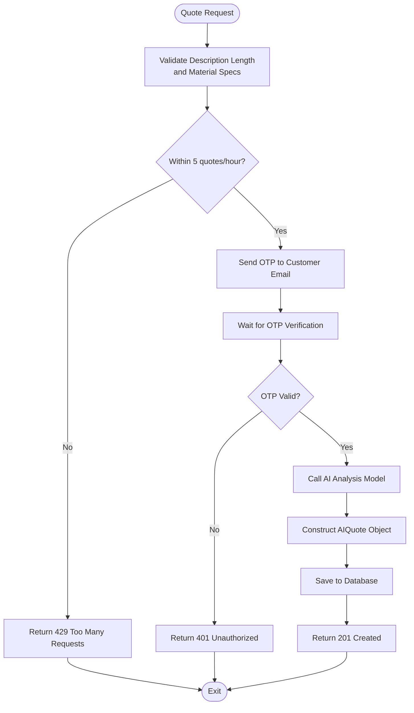
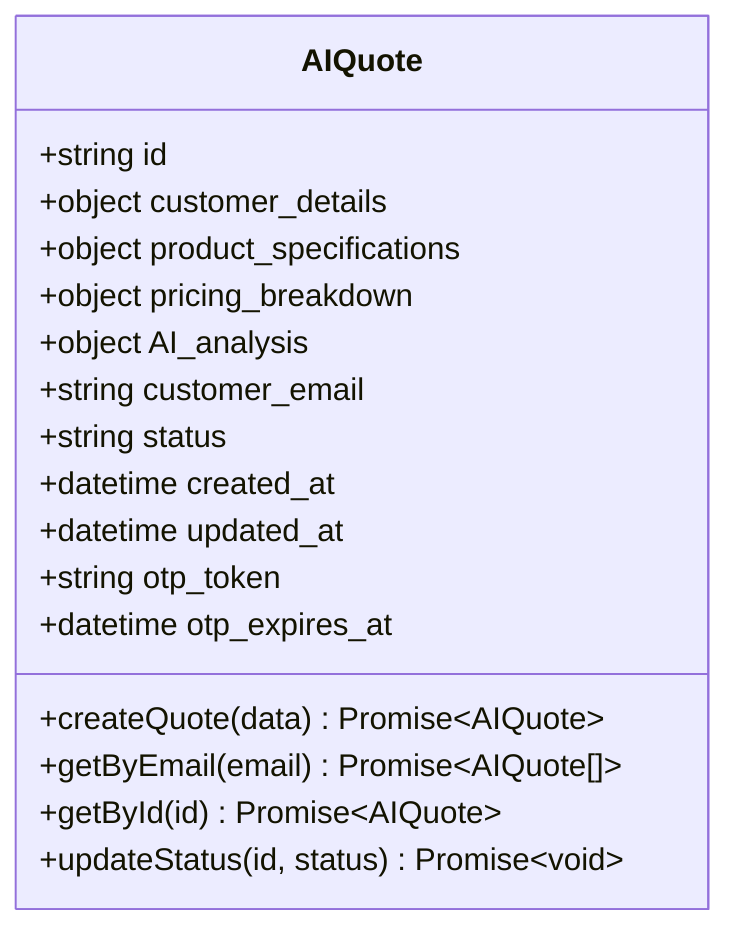
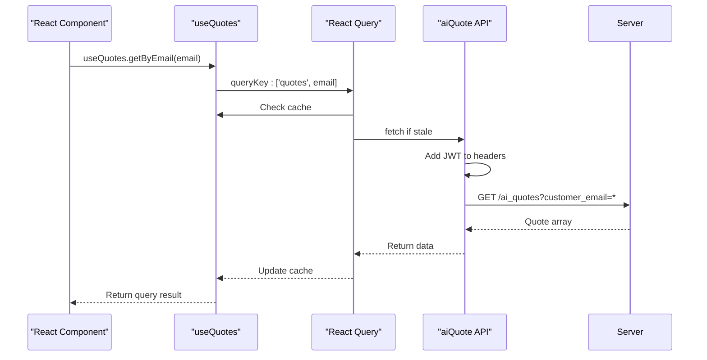
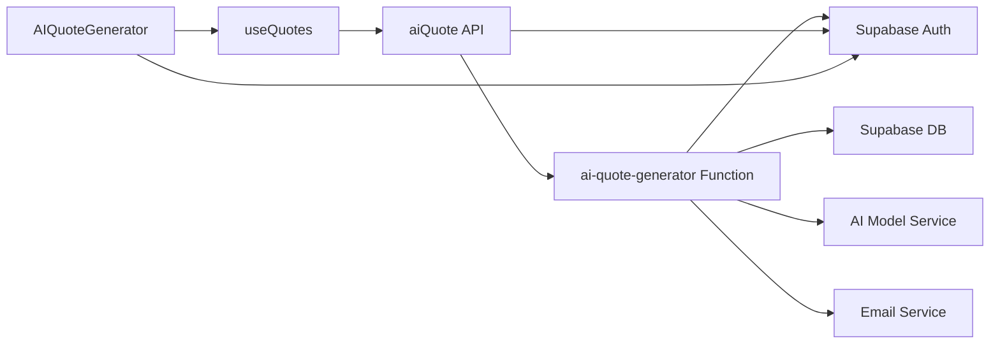

# AI Quotes API

<cite>
**Referenced Files in This Document**  
- [ai-quote-generator/index.ts](file://supabase/functions/ai-quote-generator/index.ts)
- [useQuotes.ts](file://src/hooks/useQuotes.ts)
- [AIQuoteGenerator.tsx](file://src/components/AIQuoteGenerator.tsx)
- [AIQuoteGeneratorWithOTP.tsx](file://src/components/AIQuoteGeneratorWithOTP.tsx)
- [database.ts](file://src/types/database.ts)
- [aiQuote.ts](file://src/lib/api/aiQuote.ts)
- [add_supplier_to_quotes.sql](file://supabase/migrations/add_supplier_to_quotes.sql)
</cite>

## Table of Contents
1. [Introduction](#introduction)
2. [Project Structure](#project-structure)
3. [Core Components](#core-components)
4. [Architecture Overview](#architecture-overview)
5. [Detailed Component Analysis](#detailed-component-analysis)
6. [Dependency Analysis](#dependency-analysis)
7. [Performance Considerations](#performance-considerations)
8. [Troubleshooting Guide](#troubleshooting-guide)
9. [Conclusion](#conclusion)

## Introduction
The AI Quotes API enables users to generate, retrieve, and manage AI-powered quotes for custom apparel manufacturing. This documentation details the endpoints, data structures, authentication mechanisms, and integration points for the AI quote system. The API supports public quote creation with OTP verification, authenticated retrieval of quotes by customer identifiers, and status updates through a secure JWT-protected interface.

## Project Structure
The AI Quotes functionality is distributed across frontend components, API utilities, Supabase Edge Functions, and database schema definitions. The system follows a modular architecture with clear separation between UI, business logic, and data processing layers.

**Diagram sources**
- [AIQuoteGenerator.tsx](file://src/components/AIQuoteGenerator.tsx)
- [aiQuote.ts](file://src/lib/api/aiQuote.ts)
- [ai-quote-generator/index.ts](file://supabase/functions/ai-quote-generator/index.ts)
- [database.ts](file://src/types/database.ts)

**Section sources**
- [AIQuoteGenerator.tsx](file://src/components/AIQuoteGenerator.tsx)
- [useQuotes.ts](file://src/hooks/useQuotes.ts)

## Core Components
The AI Quotes system consists of three primary components: the quote generation interface, the React hook for data management, and the serverless AI processing function. These components work together to provide a seamless experience for creating and managing manufacturing quotes.

**Section sources**
- [AIQuoteGenerator.tsx](file://src/components/AIQuoteGenerator.tsx)
- [useQuotes.ts](file://src/hooks/useQuotes.ts)
- [ai-quote-generator/index.ts](file://supabase/functions/ai-quote-generator/index.ts)

## Architecture Overview
The AI Quotes architecture follows a client-server pattern with React Query for state management, Supabase Edge Functions for AI processing, and a PostgreSQL database for persistent storage. The system implements rate limiting, OTP verification, and JWT-based authentication to ensure security and reliability.

**Diagram sources**
- [AIQuoteGeneratorWithOTP.tsx](file://src/components/AIQuoteGeneratorWithOTP.tsx)
- [ai-quote-generator/index.ts](file://supabase/functions/ai-quote-generator/index.ts)
- [aiQuote.ts](file://src/lib/api/aiQuote.ts)

## Detailed Component Analysis

### AI Quote Generation Process
The quote creation process begins with a public endpoint that accepts product specifications and customer details. The system implements OTP verification to prevent abuse and ensure valid email addresses.

#### Quote Creation Flow

**Diagram sources**
- [ai-quote-generator/index.ts](file://supabase/functions/ai-quote-generator/index.ts)
- [AIQuoteGeneratorWithOTP.tsx](file://src/components/AIQuoteGeneratorWithOTP.tsx)

**Section sources**
- [ai-quote-generator/index.ts](file://supabase/functions/ai-quote-generator/index.ts)
- [AIQuoteGeneratorWithOTP.tsx](file://src/components/AIQuoteGeneratorWithOTP.tsx)

### Data Model and Interface
The AIQuote interface defines the structure of quote data stored in the database and exchanged through the API.

#### AIQuote Interface Structure

**Diagram sources**
- [database.ts](file://src/types/database.ts)
- [aiQuote.ts](file://src/lib/api/aiQuote.ts)

**Section sources**
- [database.ts](file://src/types/database.ts)
- [aiQuote.ts](file://src/lib/api/aiQuote.ts)

### React Hook Integration
The useQuotes hook provides a React-friendly interface for interacting with the AI Quotes API, integrating with React Query for efficient data fetching and caching.

#### Data Fetching Sequence

**Diagram sources**
- [useQuotes.ts](file://src/hooks/useQuotes.ts)
- [aiQuote.ts](file://src/lib/api/aiQuote.ts)

**Section sources**
- [useQuotes.ts](file://src/hooks/useQuotes.ts)

## Dependency Analysis
The AI Quotes system depends on several external services and internal components to function properly. These dependencies are managed through environment variables and modular imports.

**Diagram sources**
- [package.json](file://package.json)
- [supabase/config.toml](file://supabase/config.toml)

**Section sources**
- [package.json](file://package.json)
- [supabase/functions/ai-quote-generator/index.ts](file://supabase/functions/ai-quote-generator/index.ts)

## Performance Considerations
The AI Quotes API implements several performance optimizations to ensure fast response times and efficient resource utilization.

- Database indexes on `customer_email` and `created_at` fields for fast retrieval
- React Query caching with stale-while-revalidate strategy
- CDN caching for static assets and function responses
- Connection pooling for database access
- Input validation at edge to prevent unnecessary processing

**Section sources**
- [add_supplier_to_quotes.sql](file://supabase/migrations/add_supplier_to_quotes.sql)
- [useQuotes.ts](file://src/hooks/useQuotes.ts)

## Troubleshooting Guide
Common issues and their solutions for the AI Quotes system:

- **OTP verification failures**: Ensure email service is configured correctly and check spam folder
- **Rate limit exceeded**: Implement client-side tracking of request frequency
- **AI analysis timeout**: Verify AI model service availability and increase timeout settings
- **JWT authentication errors**: Check token expiration and refresh logic
- **Database connection issues**: Verify Supabase connection limits and pool settings

**Section sources**
- [ai-quote-generator/index.ts](file://supabase/functions/ai-quote-generator/index.ts)
- [useQuotes.ts](file://src/hooks/useQuotes.ts)
- [AIQuoteGeneratorWithOTP.tsx](file://src/components/AIQuoteGeneratorWithOTP.tsx)

## Conclusion
The AI Quotes API provides a robust system for generating and managing manufacturing quotes with AI-powered analysis. By combining secure authentication, rate limiting, and efficient data handling, the system delivers a reliable experience for customers and administrators alike. The modular architecture allows for easy maintenance and future enhancements to the quote generation process.