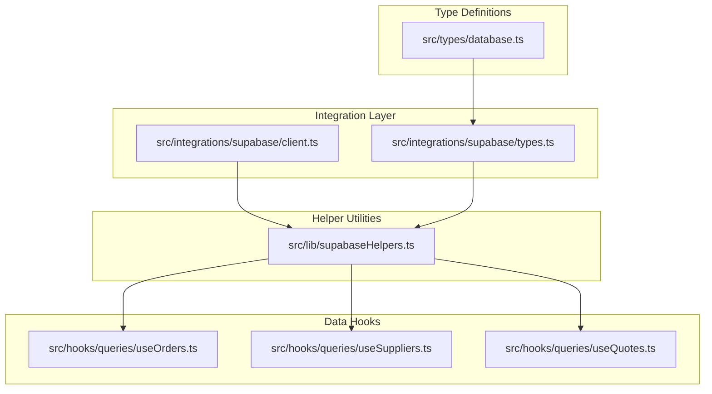
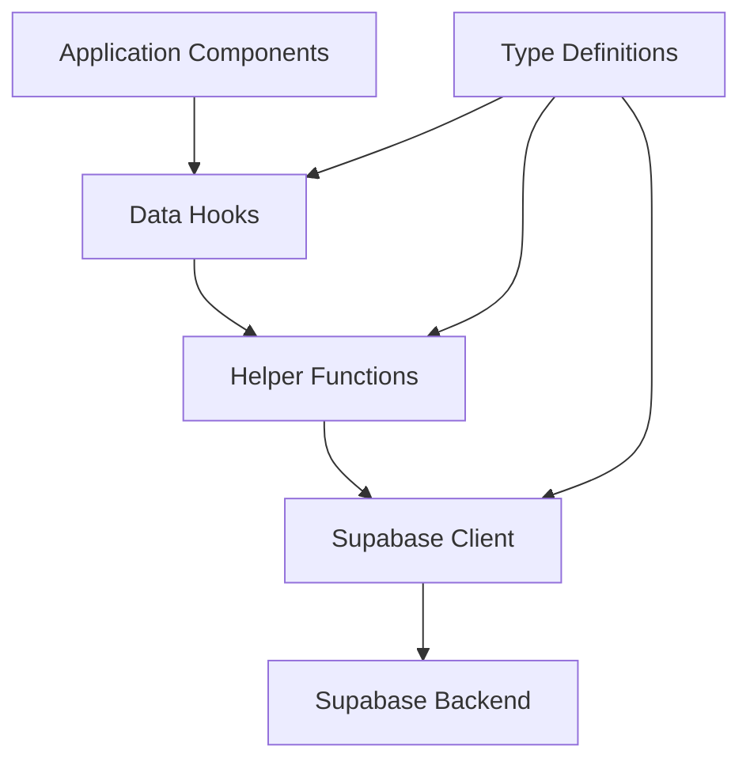
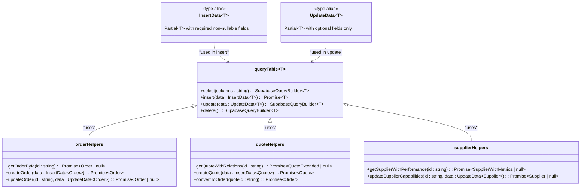
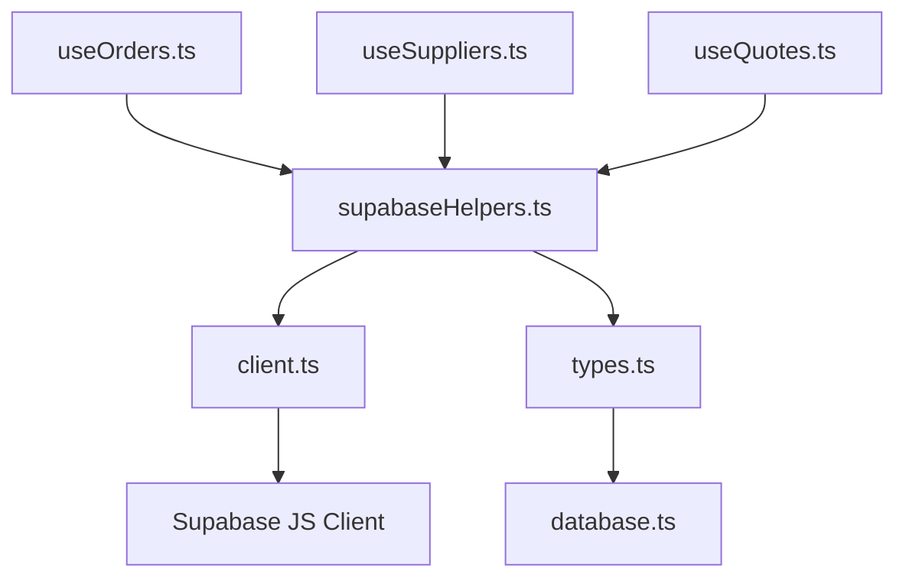

# Helper Functions

<cite>
**Referenced Files in This Document**  
- [supabaseHelpers.ts](file://src/lib/supabaseHelpers.ts)
- [types.ts](file://src/integrations/supabase/types.ts)
- [client.ts](file://src/integrations/supabase/client.ts)
- [database.ts](file://src/types/database.ts)
- [useOrders.ts](file://src/hooks/queries/useOrders.ts)
- [useSuppliers.ts](file://src/hooks/queries/useSuppliers.ts)
- [useQuotes.ts](file://src/hooks/queries/useQuotes.ts)
</cite>

## Table of Contents
1. [Introduction](#introduction)
2. [Project Structure](#project-structure)
3. [Core Components](#core-components)
4. [Architecture Overview](#architecture-overview)
5. [Detailed Component Analysis](#detailed-component-analysis)
6. [Dependency Analysis](#dependency-analysis)
7. [Performance Considerations](#performance-considerations)
8. [Troubleshooting Guide](#troubleshooting-guide)
9. [Conclusion](#conclusion)

## Introduction
This document provides comprehensive documentation for the type-safe helper functions used to abstract direct Supabase client usage within the application. These helpers—such as `orderHelpers`, `quoteHelpers`, and `supplierHelpers`—are designed to enhance type safety, reduce boilerplate, and prevent common errors associated with raw database queries. The system leverages TypeScript generics and utility types like `InsertData<T>` and `UpdateData<T>` to ensure compile-time type checking and proper inference during data operations. This documentation outlines best practices, usage patterns, performance benefits, and troubleshooting guidance for maintaining robust and maintainable data access throughout the codebase.

## Project Structure
The helper functions are organized in a modular structure that separates concerns between data access logic, type definitions, and integration layers. The core functionality resides in dedicated files under specific directories focused on Supabase integration and reusable utilities.

**Diagram sources**  
- [supabaseHelpers.ts](file://src/lib/supabaseHelpers.ts)
- [client.ts](file://src/integrations/supabase/client.ts)
- [types.ts](file://src/integrations/supabase/types.ts)
- [database.ts](file://src/types/database.ts)

**Section sources**  
- [supabaseHelpers.ts](file://src/lib/supabaseHelpers.ts)
- [client.ts](file://src/integrations/supabase/client.ts)

## Core Components
The core components of the type-safe helper system include the generic `queryTable<T>()` function for type-safe table access, the `InsertData<T>` and `UpdateData<T>` utility types for accurate type inference during mutations, and pre-built helper modules (`orderHelpers`, `quoteHelpers`, `supplierHelpers`) that encapsulate common query patterns. These components work together to eliminate type mismatches, enforce schema compliance, and streamline database interactions across the application.

**Section sources**  
- [supabaseHelpers.ts](file://src/lib/supabaseHelpers.ts)
- [types.ts](file://src/integrations/supabase/types.ts)
- [database.ts](file://src/types/database.ts)

## Architecture Overview
The architecture follows a layered approach where the Supabase client is abstracted behind a set of type-safe utility functions. This abstraction ensures that all database operations go through a consistent, validated interface rather than direct client calls. The type system is leveraged extensively to provide compile-time guarantees about data shape and operation validity.

**Diagram sources**  
- [supabaseHelpers.ts](file://src/lib/supabaseHelpers.ts)
- [useOrders.ts](file://src/hooks/queries/useOrders.ts)
- [useSuppliers.ts](file://src/hooks/queries/useSuppliers.ts)
- [useQuotes.ts](file://src/hooks/queries/useQuotes.ts)

## Detailed Component Analysis

### Type-Safe Query Abstraction
The `queryTable<T>()` function enables type-safe access to any Supabase table by accepting a generic type parameter that corresponds to the table's schema definition. This ensures that all queries return correctly typed results and that filter conditions align with the expected field types.

**Diagram sources**  
- [supabaseHelpers.ts](file://src/lib/supabaseHelpers.ts)
- [types.ts](file://src/integrations/supabase/types.ts)

**Section sources**  
- [supabaseHelpers.ts](file://src/lib/supabaseHelpers.ts)

### Best Practices for Helper Usage
When working with the helper functions, several best practices should be followed to maintain type safety and consistency:

- Always use `.maybeSingle()` instead of `.single()` to avoid runtime exceptions when no record is found; this returns a nullable type that must be explicitly handled.
- Use `InsertData<T>` when creating new records to ensure all required fields are provided while allowing optional ones to be omitted.
- Use `UpdateData<T>` for partial updates to guarantee that only modifiable fields are included and that immutable fields cannot be accidentally changed.
- Leverage pre-built helpers like `orderHelpers`, `quoteHelpers`, and `supplierHelpers` for common operations to benefit from optimized query patterns and built-in error handling.

These practices reduce the likelihood of runtime errors due to type mismatches or missing fields and promote more predictable, maintainable code.

**Section sources**  
- [supabaseHelpers.ts](file://src/lib/supabaseHelpers.ts)
- [useOrders.ts](file://src/hooks/queries/useOrders.ts)
- [useQuotes.ts](file://src/hooks/queries/useQuotes.ts)

### Performance Benefits
Using helper functions provides measurable performance benefits through optimized query construction and reduced boilerplate. By centralizing query logic, the system avoids redundant code paths and ensures consistent use of indexes and filtering strategies. Additionally, the type system eliminates the need for extensive runtime validation, reducing overhead during data operations.

The helpers also enable better caching behavior by standardizing query shapes, which improves cache hit rates both at the application level and within Supabase itself. Furthermore, the use of `maybeSingle()` over `single()` prevents unnecessary error handling overhead in cases where absence of a record is a valid state.

**Section sources**  
- [supabaseHelpers.ts](file://src/lib/supabaseHelpers.ts)

## Dependency Analysis
The helper system has well-defined dependencies that ensure separation of concerns while maintaining type integrity across layers.

**Diagram sources**  
- [supabaseHelpers.ts](file://src/lib/supabaseHelpers.ts)
- [client.ts](file://src/integrations/supabase/client.ts)
- [types.ts](file://src/integrations/supabase/types.ts)
- [useOrders.ts](file://src/hooks/queries/useOrders.ts)
- [useSuppliers.ts](file://src/hooks/queries/useSuppliers.ts)
- [useQuotes.ts](file://src/hooks/queries/useQuotes.ts)

**Section sources**  
- [supabaseHelpers.ts](file://src/lib/supabaseHelpers.ts)
- [client.ts](file://src/integrations/supabase/client.ts)
- [types.ts](file://src/integrations/supabase/types.ts)

## Performance Considerations
The type-safe helper functions contribute to improved application performance by reducing runtime errors, minimizing redundant validation, and enabling more efficient query execution. Standardized query patterns allow for better optimization at both the client and database levels. Additionally, the use of proper TypeScript types reduces bundle size by eliminating the need for runtime type-checking libraries.

## Troubleshooting Guide
In rare cases where direct Supabase client access is necessary (e.g., complex joins or raw SQL queries), developers should still maintain type safety by wrapping the result in appropriate type assertions or using `as const` with known schemas. When debugging issues related to type mismatches or missing fields, consult the `database.ts` type definitions to verify field names and nullability.

If a helper function does not support a required operation, extend it with a new method rather than bypassing it entirely. This preserves consistency and allows future users to benefit from the added functionality. Always ensure that new methods follow the same patterns for `InsertData<T>` and `UpdateData<T>` usage.

**Section sources**  
- [supabaseHelpers.ts](file://src/lib/supabaseHelpers.ts)
- [database.ts](file://src/types/database.ts)

## Conclusion
The type-safe helper functions provide a robust, maintainable abstraction over direct Supabase client usage. By leveraging TypeScript generics and utility types, they prevent common errors, enforce schema compliance, and improve developer productivity. Following best practices such as using `maybeSingle()`, `InsertData<T>`, and `UpdateData<T>` ensures consistent, reliable data access throughout the application. The architecture promotes performance, type safety, and long-term maintainability, making it a critical component of the codebase.