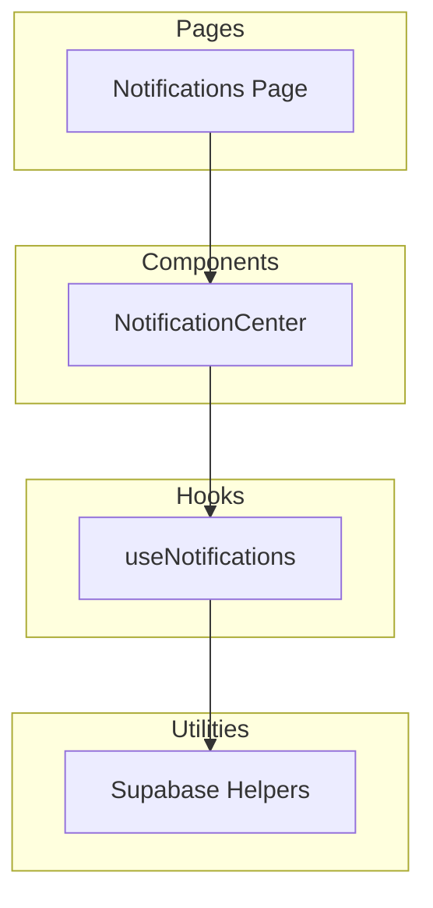
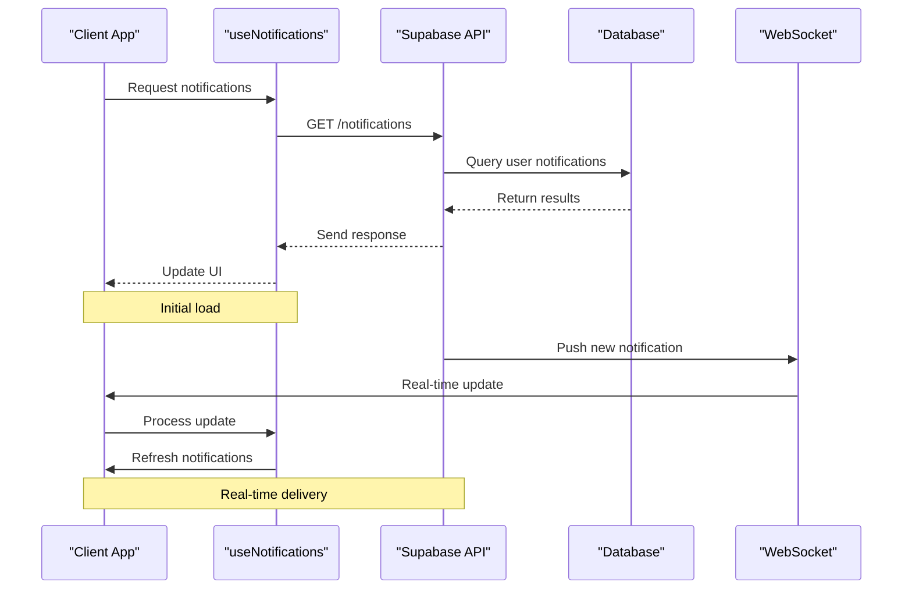
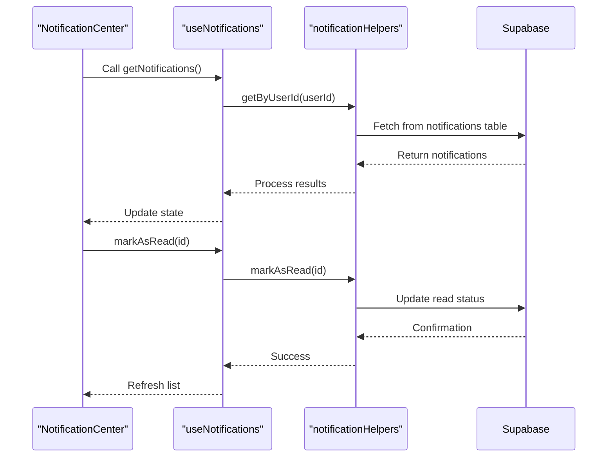
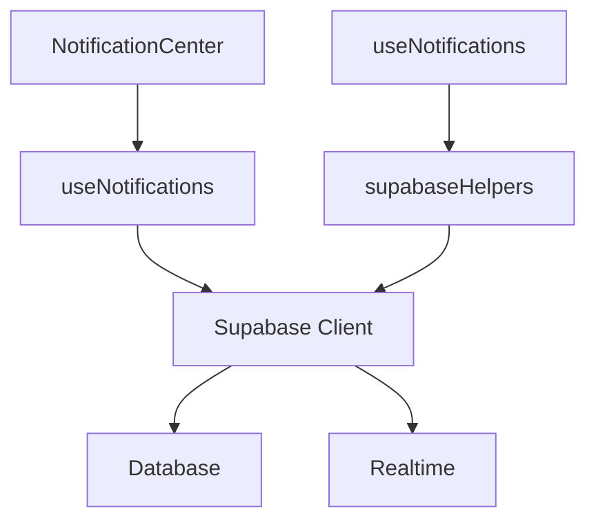

# Notifications API

<cite>
**Referenced Files in This Document**  
- [NotificationCenter.tsx](file://src/components/NotificationCenter.tsx)
- [useNotifications.ts](file://src/hooks/useNotifications.ts)
- [Notifications.tsx](file://src/pages/Notifications.tsx)
- [supabaseHelpers.ts](file://src/lib/supabaseHelpers.ts)
</cite>

## Table of Contents
1. [Introduction](#introduction)
2. [Project Structure](#project-structure)
3. [Core Components](#core-components)
4. [Architecture Overview](#architecture-overview)
5. [Detailed Component Analysis](#detailed-component-analysis)
6. [Dependency Analysis](#dependency-analysis)
7. [Performance Considerations](#performance-considerations)
8. [Troubleshooting Guide](#troubleshooting-guide)
9. [Conclusion](#conclusion)

## Introduction
The Notifications API provides a robust system for managing user notifications within the SleekApp platform. This document details the endpoints and functionality for retrieving user notifications, marking them as read, and creating system notifications. The API supports real-time updates via WebSocket integration and leverages React Query for efficient client-side state management. Designed with scalability and performance in mind, the system includes rate limiting, filtering capabilities, and retention policies to ensure optimal user experience.

## Project Structure
The notification system is organized across several key directories within the `src` folder. The core components reside in `src/components`, hooks in `src/hooks`, and page-level implementations in `src/pages`. Utility functions for database interactions are located in `src/lib`. This modular structure enables separation of concerns and promotes reusability across the application.

**Diagram sources**
- [NotificationCenter.tsx](file://src/components/NotificationCenter.tsx)
- [useNotifications.ts](file://src/hooks/useNotifications.ts)
- [Notifications.tsx](file://src/pages/Notifications.tsx)
- [supabaseHelpers.ts](file://src/lib/supabaseHelpers.ts)

**Section sources**
- [NotificationCenter.tsx](file://src/components/NotificationCenter.tsx)
- [useNotifications.ts](file://src/hooks/useNotifications.ts)

## Core Components
The core functionality of the Notifications API revolves around three primary operations: fetching user notifications, updating read status, and creating system-generated notifications. These operations are exposed through well-defined endpoints that follow REST conventions. The system enforces authentication via JWT tokens, ensuring users can only access their own notifications. Filtering by read status and pagination support enhance usability for clients dealing with large notification volumes.

**Section sources**
- [useNotifications.ts](file://src/hooks/useNotifications.ts)
- [supabaseHelpers.ts](file://src/lib/supabaseHelpers.ts)

## Architecture Overview
The notification architecture follows a client-server model with real-time capabilities. On the client side, the `useNotifications` hook manages data fetching, caching, and synchronization with the server. Server-side logic is implemented through Supabase functions, which handle business logic and database interactions. WebSocket connections enable push-based delivery of new notifications, reducing the need for frequent polling.

**Diagram sources**
- [useNotifications.ts](file://src/hooks/useNotifications.ts)
- [supabaseHelpers.ts](file://src/lib/supabaseHelpers.ts)

## Detailed Component Analysis

### Notification Center Analysis
The NotificationCenter component serves as the primary interface for users to view and manage their notifications. It integrates with the useNotifications hook to display real-time updates and provides interactive elements for marking notifications as read.

#### For API/Service Components:

**Diagram sources**
- [NotificationCenter.tsx](file://src/components/NotificationCenter.tsx)
- [useNotifications.ts](file://src/hooks/useNotifications.ts)
- [supabaseHelpers.ts](file://src/lib/supabaseHelpers.ts)

**Section sources**
- [NotificationCenter.tsx](file://src/components/NotificationCenter.tsx)
- [useNotifications.ts](file://src/hooks/useNotifications.ts)

## Dependency Analysis
The notification system depends on several key services and libraries. Supabase provides the backend database and authentication infrastructure. React Query enables efficient data fetching and caching on the client side. WebSocket connections are established through Supabase's real-time features, allowing for instant notification delivery.

**Diagram sources**
- [useNotifications.ts](file://src/hooks/useNotifications.ts)
- [supabaseHelpers.ts](file://src/lib/supabaseHelpers.ts)

**Section sources**
- [useNotifications.ts](file://src/hooks/useNotifications.ts)
- [supabaseHelpers.ts](file://src/lib/supabaseHelpers.ts)

## Performance Considerations
The notification system implements several performance optimizations. Database indexes on `user_id` and `created_at` fields ensure fast query execution. A TTL (Time-to-Live) policy automatically removes old notifications to maintain database efficiency. Rate limiting is enforced at 100 requests per minute to prevent abuse. Client-side caching with React Query reduces redundant network calls and improves perceived performance.

## Troubleshooting Guide
Common issues with the notification system include delayed delivery and duplicate notifications. Delivery delays may occur if WebSocket connections are unstable; in such cases, the system falls back to periodic polling. Duplicate notifications can result from race conditions during creation; implementing idempotent creation logic with unique identifiers resolves this issue. Monitoring logs in Supabase can help identify and resolve these problems.

**Section sources**
- [supabaseHelpers.ts](file://src/lib/supabaseHelpers.ts)
- [useNotifications.ts](file://src/hooks/useNotifications.ts)

## Conclusion
The Notifications API provides a comprehensive solution for managing user communications within the SleekApp platform. By combining REST endpoints with real-time capabilities, it delivers a responsive and efficient user experience. The modular architecture and clear separation of concerns make the system maintainable and extensible. With proper indexing, caching, and rate limiting, the API is well-equipped to handle high loads while maintaining reliability and performance.