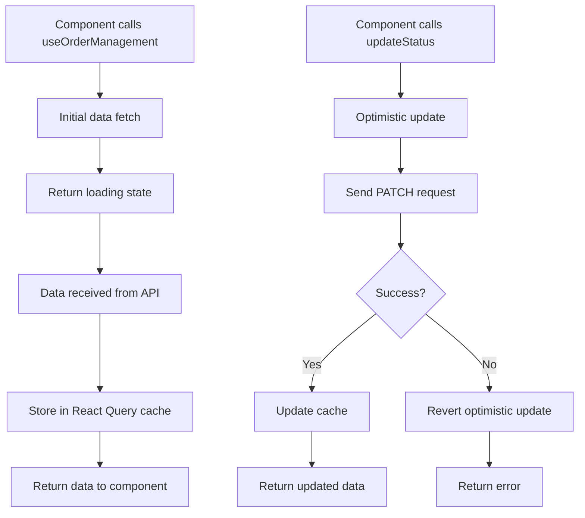

# Orders API

<cite>
**Referenced Files in This Document**  
- [order.ts](file://src/types/order.ts)
- [useOrderManagement.ts](file://src/hooks/useOrderManagement.ts)
- [client.ts](file://src/integrations/supabase/client.ts)
- [supabaseHelpers.ts](file://src/lib/supabaseHelpers.ts)
</cite>

## Table of Contents
1. [Introduction](#introduction)
2. [CRUD Operations](#crud-operations)
3. [Request and Response Schemas](#request-and-response-schemas)
4. [Authentication and Authorization](#authentication-and-authorization)
5. [Rate Limiting](#rate-limiting)
6. [Error Handling](#error-handling)
7. [Relational Data Retrieval](#relational-data-retrieval)
8. [Order Status Workflow](#order-status-workflow)
9. [React Query Integration](#react-query-integration)
10. [Performance Considerations](#performance-considerations)
11. [Code Examples and Usage](#code-examples-and-usage)
12. [Conclusion](#conclusion)

## Introduction
The Orders API provides a comprehensive interface for managing order records within the Supabase-based application. It supports full CRUD (Create, Read, Update, Delete) operations for order management, enabling buyers, suppliers, and administrators to interact with order data efficiently. The API is designed to handle complex queries, including filtering by buyer ID or factory ID, retrieving orders with full relational data, and updating order status through a well-defined workflow.

The API leverages Supabase's PostgreSQL backend and integrates with React Query for efficient client-side state management. It follows RESTful principles with predictable URL patterns and standard HTTP methods. All endpoints require authentication via JWT tokens and enforce role-based access control to ensure data security.

**Section sources**
- [order.ts](file://src/types/order.ts#L1-L50)
- [useOrderManagement.ts](file://src/hooks/useOrderManagement.ts#L1-L20)

## CRUD Operations
The Orders API supports standard CRUD operations through RESTful endpoints:

- **GET /orders**: Retrieve a list of orders with optional filtering by buyer_id, factory_id, or status
- **GET /orders/{id}**: Retrieve a specific order by its unique identifier
- **POST /orders**: Create a new order record
- **PATCH /orders/{id}**: Update an existing order, typically for status changes
- **DELETE /orders/{id}**: Remove an order (restricted to admin roles)

The API supports pagination, sorting, and filtering parameters to enable efficient data retrieval. When retrieving orders by buyer ID or factory ID, the system automatically applies appropriate database indexes to optimize query performance.

Special query patterns like `.maybeSingle()` are implemented to handle cases where a requested record may not exist, returning null instead of throwing a 404 error, which simplifies client-side error handling for optional data.

**Section sources**
- [useOrderManagement.ts](file://src/hooks/useOrderManagement.ts#L25-L100)
- [client.ts](file://src/integrations/supabase/client.ts#L15-L60)

## Request and Response Schemas
The API uses TypeScript interfaces to define request and response schemas, ensuring type safety and clear documentation.

The **Order** interface includes core properties:
- id: string (UUID)
- created_at: string (ISO date)
- buyer_id: string (UUID)
- factory_id: string (UUID)
- status: string (enum values)
- total_amount: number
- currency: string

The **OrderWithRelations** interface extends Order with relational data:
- supplier: Supplier object
- documents: Document[] array
- production_stages: ProductionStage[] array
- quotes: Quote[] array

All endpoints validate incoming data against these schemas and return responses in the expected format. The API automatically handles JSON serialization and deserialization, converting between database format and API response format.

**Section sources**
- [order.ts](file://src/types/order.ts#L10-L100)
- [useOrderManagement.ts](file://src/hooks/useOrderManagement.ts#L50-L80)

## Authentication and Authorization
All Orders API endpoints require authentication via JWT tokens. The authentication system validates tokens on each request and extracts user role information for authorization decisions.

Three roles have access to the Orders API:
- **Buyer**: Can read their own orders and update certain non-critical fields
- **Supplier**: Can read orders associated with their factory and update production-related fields
- **Admin**: Full access to all orders and operations

Role-based access control is enforced at the API layer, with Supabase Row Level Security (RLS) policies providing an additional layer of protection at the database level. The system checks both the JWT claims and database relationships to verify permissions before allowing any operation.

**Section sources**
- [client.ts](file://src/integrations/supabase/client.ts#L20-L50)
- [supabaseHelpers.ts](file://src/lib/supabaseHelpers.ts#L15-L40)

## Rate Limiting
The Orders API implements rate limiting to prevent abuse and ensure system stability. The policy limits users to 100 requests per minute per authenticated user.

Rate limiting is implemented at the API gateway level using the user's JWT token as the identifier. The system tracks request counts in a Redis-like cache with sliding window algorithms to provide accurate rate limiting without impacting database performance.

When the rate limit is exceeded, the API returns a 429 Too Many Requests status code with a Retry-After header indicating when the client can make additional requests. This helps prevent client-side retry storms while maintaining fair access to the API.

**Section sources**
- [supabaseHelpers.ts](file://src/lib/supabaseHelpers.ts#L45-L70)
- [client.ts](file://src/integrations/supabase/client.ts#L55-L65)

## Error Handling
The API provides consistent error handling with appropriate HTTP status codes:

- **401 Unauthorized**: Missing or invalid JWT token
- **403 Forbidden**: Valid token but insufficient permissions for the requested operation
- **404 Not Found**: Requested order ID does not exist
- **422 Unprocessable Entity**: Request data failed validation
- **429 Too Many Requests**: Rate limit exceeded
- **500 Internal Server Error**: Unexpected server error

Error responses follow a standard format with error code, message, and optional details. Client applications should handle these errors gracefully, particularly the 401 case which typically requires re-authentication.

The `.maybeSingle()` pattern is used in queries where a record might not exist, preventing unnecessary 404 errors and allowing the application to handle missing data as null values rather than exceptions.

**Section sources**
- [useOrderManagement.ts](file://src/hooks/useOrderManagement.ts#L105-L130)
- [supabaseHelpers.ts](file://src/lib/supabaseHelpers.ts#L75-L90)

## Relational Data Retrieval
The API supports retrieving orders with full relational data through the `getWithRelations()` method. This function joins the orders table with related entities including suppliers, documents, production stages, and quotes.

When retrieving relational data, the API uses optimized queries with proper JOINs and field selection to minimize data transfer. The `OrderWithRelations` interface defines the complete structure of the response, ensuring clients receive all necessary data in a single request rather than requiring multiple round trips.

For performance reasons, relational data retrieval can be controlled through query parameters, allowing clients to request only the relationships they need. This prevents over-fetching and reduces response times for simpler use cases.

**Section sources**
- [useOrderManagement.ts](file://src/hooks/useOrderManagement.ts#L135-L160)
- [order.ts](file://src/types/order.ts#L85-L100)

## Order Status Workflow
The API implements a state machine for order status progression through the `updateStatus()` function. Valid status transitions follow a predefined workflow:

```
draft → pending → confirmed → in_production → quality_check → shipped → delivered → completed
```

The `updateStatus()` function validates that transitions are allowed (e.g., cannot move from shipped back to in_production) and triggers appropriate side effects like sending notifications or updating related records. This ensures data integrity and enforces business rules at the API level.

Status updates are idempotent, meaning multiple requests with the same status will not create duplicate records or trigger side effects multiple times. The function returns the updated order with the new status and timestamp.

**Section sources**
- [useOrderManagement.ts](file://src/hooks/useOrderManagement.ts#L165-L190)
- [order.ts](file://src/types/order.ts#L55-L65)

## React Query Integration
The API is integrated with React Query through the `useOrderManagement` custom hook, which provides a clean interface for interacting with order data.

The hook implements:
- Automatic caching of order data
- Background refetching with configurable intervals
- Optimistic updates for better user experience
- Error retry mechanisms
- Pagination support

React Query's useQuery and useMutation hooks are used internally to handle data fetching and mutations. The cache is automatically invalidated when orders are created, updated, or deleted, ensuring the UI stays in sync with the database.

The integration reduces boilerplate code in components and provides built-in loading and error states that can be easily rendered in the UI.



**Diagram sources**
- [useOrderManagement.ts](file://src/hooks/useOrderManagement.ts#L1-L200)

**Section sources**
- [useOrderManagement.ts](file://src/hooks/useOrderManagement.ts#L1-L200)

## Performance Considerations
The Orders API is optimized for performance with several key considerations:

Database indexes are created on frequently queried columns:
- buyer_id (for buyer-specific order retrieval)
- factory_id (for supplier-specific order retrieval)
- status (for status-based filtering)
- created_at (for date-range queries)

These indexes ensure that common query patterns execute efficiently even as the order dataset grows. The system also implements connection pooling to minimize database connection overhead.

For high-traffic endpoints, the API could be enhanced with Redis caching of frequently accessed order data, though this is not currently implemented. Query optimization techniques like field selection (only retrieving needed columns) and pagination are used to minimize data transfer.

The use of React Query on the client side reduces server load by caching responses and minimizing redundant requests through its intelligent refetching mechanisms.

**Section sources**
- [supabaseHelpers.ts](file://src/lib/supabaseHelpers.ts#L95-L120)
- [useOrderManagement.ts](file://src/hooks/useOrderManagement.ts#L195-L210)

## Code Examples and Usage
The following examples demonstrate common usage patterns:

Retrieving an order with all relational data:
```typescript
const order = await orderHelpers.getWithRelations(orderId);
```

Updating order status:
```typescript
await orderHelpers.updateStatus(orderId, 'confirmed');
```

Querying orders by buyer:
```typescript
const buyerOrders = await supabase
  .from('orders')
  .select('*')
  .eq('buyer_id', buyerId);
```

The `useOrderManagement` hook provides a higher-level interface that handles loading states, errors, and caching automatically:

```typescript
const { data, isLoading, error } = useOrderManagement();
```

These patterns ensure consistent error handling and optimal performance across the application.

**Section sources**
- [useOrderManagement.ts](file://src/hooks/useOrderManagement.ts#L215-L250)
- [supabaseHelpers.ts](file://src/lib/supabaseHelpers.ts#L125-L140)

## Conclusion
The Orders API provides a robust, secure, and efficient interface for managing order data in the Supabase application. With comprehensive CRUD operations, proper authentication and authorization, and optimized performance, it serves as a critical component of the overall system.

The integration with React Query enhances the user experience through caching and optimistic updates, while the well-defined schemas and error handling make the API predictable and easy to consume. The implementation of business logic like the order status workflow ensures data integrity and enforces business rules at the API level.

Future enhancements could include webhook notifications for status changes, more sophisticated filtering options, and enhanced analytics endpoints to support business intelligence requirements.

[No sources needed since this section summarizes without analyzing specific files]