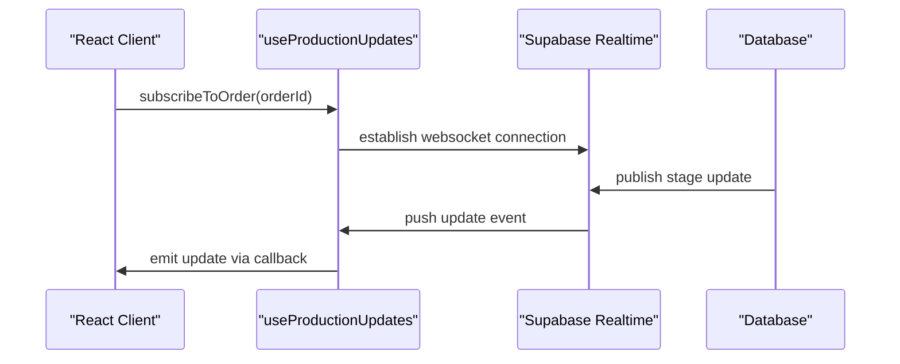
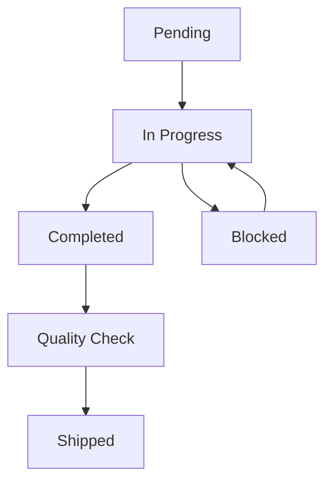
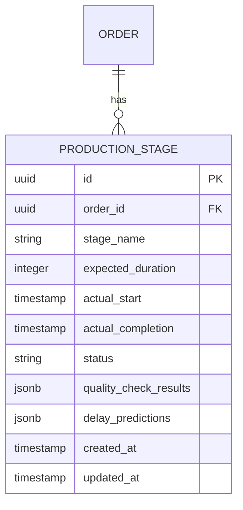

# Production Stages API

<cite>
**Referenced Files in This Document**  
- [ProductionTimeline.tsx](file://src/components/production/ProductionTimeline.tsx)
- [ProductionStageUpdate.tsx](file://src/components/supplier/ProductionStageUpdate.tsx)
- [useSupplierOrders.ts](file://src/hooks/useSupplierOrders.ts)
- [database.ts](file://src/types/database.ts)
- [initialize-production-stages/index.ts](file://supabase/functions/initialize-production-stages/index.ts)
</cite>

## Table of Contents
1. [Introduction](#introduction)
2. [API Endpoints](#api-endpoints)
3. [Authentication and Authorization](#authentication-and-authorization)
4. [Request/Response Schemas](#requestresponse-schemas)
5. [Real-Time Updates and Subscriptions](#real-time-updates-and-subscriptions)
6. [Performance and Data Management](#performance-and-data-management)
7. [Error Handling](#error-handling)
8. [Usage Examples](#usage-examples)
9. [Appendices](#appendices)

## Introduction
The Production Stages API powers the LoopTrace™ tracking system, enabling real-time monitoring of manufacturing workflows across supplier facilities. This API provides structured access to production timelines, stage status updates, and quality control data for apparel manufacturing orders. It supports role-based access for suppliers, buyers, and administrators, ensuring secure and appropriate data visibility.

The system is built on a Supabase backend with real-time capabilities, React frontend components, and TypeScript interfaces ensuring type safety across the stack. Key features include predictive delay analytics, quality risk alerts, and integration with React Query for efficient data synchronization.

**Section sources**
- [ProductionTimeline.tsx](file://src/components/production/ProductionTimeline.tsx#L1-L50)
- [database.ts](file://src/types/database.ts#L100-L150)

## API Endpoints

### GET /production_stages
Retrieves a list of all production stages for accessible orders. Admin users can access all stages, while suppliers and buyers are limited to their respective orders.

### GET /production_stages/order/{orderId}
Fetches the complete production timeline for a specific order, including all stages, their status, expected and actual completion times, quality check results, and delay predictions.

### PATCH /production_stages/{stageId}
Updates the status of a specific production stage. Requires validation of stage transition rules (e.g., cannot skip stages, must complete prerequisites).

### POST /production_stages/{stageId}/quality-check
Submits quality control data for a production stage, including inspection results, defect counts, and compliance status.

**Section sources**
- [initialize-production-stages/index.ts](file://supabase/functions/initialize-production-stages/index.ts#L15-L80)
- [ProductionStageUpdate.tsx](file://src/components/supplier/ProductionStageUpdate.tsx#L20-L60)

## Authentication and Authorization
The API requires JWT authentication for all endpoints. Access is controlled by user roles:
- **Supplier**: Can view and update stages for their assigned orders
- **Buyer**: Can view stages for orders they have placed
- **Admin**: Full access to all production stages across the platform

Rate limiting is enforced at 50 requests per minute per user to prevent abuse and ensure system stability.

**Section sources**
- [useSupplierOrders.ts](file://src/hooks/useSupplierOrders.ts#L30-L75)
- [database.ts](file://src/types/database.ts#L200-L230)

## Request/Response Schemas

### ProductionStage Interface
```typescript
interface ProductionStage {
  id: string;
  order_id: string;
  stage_name: string;
  expected_duration: number; // in hours
  actual_start: string | null;
  actual_completion: string | null;
  status: 'pending' | 'in_progress' | 'completed' | 'delayed' | 'blocked';
  quality_check_results: QualityCheck[];
  delay_predictions: DelayPrediction[];
  updated_at: string;
  created_at: string;
}
```

### Validation Rules
- Stage transitions must follow predefined workflow sequence
- `actual_completion` cannot precede `actual_start`
- Only users associated with the order's supplier can update stage status
- Quality checks require photo evidence for non-conformances

**Section sources**
- [database.ts](file://src/types/database.ts#L120-L200)
- [ProductionStageUpdate.tsx](file://src/components/supplier/ProductionStageUpdate.tsx#L45-L120)

## Real-Time Updates and Subscriptions
The API supports real-time subscriptions through Supabase's Realtime service. Clients can subscribe to:
- Production stage updates for specific orders
- Quality control submissions
- Delay prediction changes

The `useProductionUpdates` hook in React provides a convenient interface for components to receive live updates without manual polling.



**Diagram sources**
- [useSupplierOrders.ts](file://src/hooks/useSupplierOrders.ts#L15-L40)
- [ProductionTimeline.tsx](file://src/components/production/ProductionTimeline.tsx#L30-L60)

## Performance and Data Management
The system implements several performance optimizations:
- Time-series data indexing on production stage timestamps for fast timeline queries
- Archiving policy: completed orders older than 2 years are moved to cold storage
- Caching of frequently accessed production timelines
- Database partitioning by order creation date

Query performance is monitored, with alerts triggered for queries exceeding 500ms response time.

**Section sources**
- [database.ts](file://src/types/database.ts#L250-L300)
- [ProductionTimeline.tsx](file://src/components/production/ProductionTimeline.tsx#L70-L100)

## Error Handling
The API returns standardized error responses:
- 401: Unauthorized (missing or invalid JWT)
- 403: Forbidden (insufficient permissions for requested operation)
- 404: Not Found (invalid order or stage ID)
- 409: Conflict (invalid stage transition)
- 429: Too Many Requests (rate limit exceeded)
- 500: Internal Server Error

Error responses include a machine-readable code and human-readable message to facilitate troubleshooting.

**Section sources**
- [initialize-production-stages/index.ts](file://supabase/functions/initialize-production-stages/index.ts#L50-L90)
- [useSupplierOrders.ts](file://src/hooks/useSupplierOrders.ts#L80-L110)

## Usage Examples

### Fetching Production Timeline
```typescript
// In ProductionTimeline component
const { data: stages, isLoading } = useQuery({
  queryKey: ['production-stages', orderId],
  queryFn: () => fetchProductionStages(orderId)
});
```

### Updating Stage Status
```typescript
// In ProductionStageUpdate form
const updateStage = async (stageId, updates) => {
  const response = await api.patch(`/production_stages/${stageId}`, updates);
  if (response.ok) {
    queryClient.invalidateQueries(['production-stages', orderId]);
  }
};
```

**Section sources**
- [ProductionTimeline.tsx](file://src/components/production/ProductionTimeline.tsx#L100-L150)
- [ProductionStageUpdate.tsx](file://src/components/supplier/ProductionStageUpdate.tsx#L100-L140)

## Appendices

### Appendix A: Stage Transition Rules


**Diagram sources**
- [database.ts](file://src/types/database.ts#L180-L200)

### Appendix B: Database Schema


**Diagram sources**
- [database.ts](file://src/types/database.ts#L100-L150)