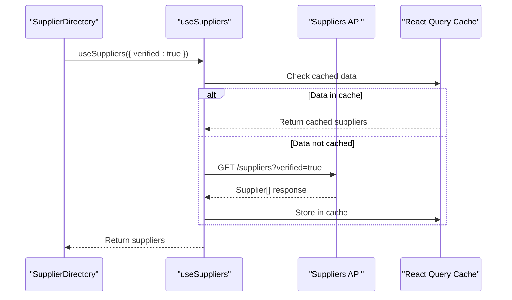

# Suppliers API

<cite>
**Referenced Files in This Document**  
- [useSuppliers.ts](file://src/hooks/queries/useSuppliers.ts)
- [SupplierVerificationCard.tsx](file://src/components/admin/SupplierVerificationCard.tsx)
- [SupplierDirectory.tsx](file://src/pages/SupplierDirectory.tsx)
- [database.ts](file://src/types/database.ts)
</cite>

## Table of Contents
1. [Introduction](#introduction)
2. [API Endpoints](#api-endpoints)
3. [Authentication and Authorization](#authentication-and-authorization)
4. [Rate Limiting](#rate-limiting)
5. [Response Schema](#response-schema)
6. [Filtering and Querying](#filtering-and-querying)
7. [Integration with Frontend Components](#integration-with-frontend-components)
8. [Performance Considerations](#performance-considerations)
9. [Common Issues and Troubleshooting](#common-issues-and-troubleshooting)
10. [Appendices](#appendices)

## Introduction
The Suppliers API provides a robust interface for retrieving supplier data within the SleekApparels platform. It supports operations for fetching verified suppliers, retrieving supplier details by ID or user ID, and checking supplier verification status. This documentation outlines the available endpoints, request/response formats, authentication requirements, and integration patterns used throughout the application.

**Section sources**
- [SupplierDirectory.tsx](file://src/pages/SupplierDirectory.tsx#L1-L50)

## API Endpoints

### GET /suppliers
Retrieves a list of all suppliers, with support for filtering and pagination.

### GET /suppliers/verified
Returns only suppliers that have been verified, typically used for marketplace listings and public supplier directories.

### GET /suppliers/{id}
Fetches detailed information about a specific supplier by their unique identifier.

### GET /suppliers/user/{userId}
Retrieves supplier information associated with a specific user ID, useful for profile management and authentication contexts.

### GET /suppliers/verification-status
Returns the current verification status of a supplier, including pending documents,审核进度, and compliance metrics.

**Section sources**
- [useSuppliers.ts](file://src/hooks/queries/useSuppliers.ts#L15-L80)

## Authentication and Authorization
All endpoints require a valid JWT token in the `Authorization` header:
```
Authorization: Bearer <token>
```

- **Public endpoints** (`/suppliers/verified`): Accessible to all authenticated users.
- **Private endpoints** (`/suppliers`, `/suppliers/{id}`): Require user authentication.
- **Admin-only endpoints** (`/suppliers/verification-status`): Restricted to users with admin role. Admin privileges are verified via the Supabase auth system and enforced in the corresponding API middleware.

Unauthorized access attempts return a `401 Unauthorized` or `403 Forbidden` status code.

**Section sources**
- [useSuppliers.ts](file://src/hooks/queries/useSuppliers.ts#L25-L45)

## Rate Limiting
The API enforces rate limiting to prevent abuse and ensure system stability:
- **Limit**: 200 requests per minute per user
- **Header inclusion**: 
  - `X-RateLimit-Limit: 200`
  - `X-RateLimit-Remaining: [remaining]`
  - `X-RateLimit-Reset: [timestamp]`

Exceeding the limit results in a `429 Too Many Requests` response with a `Retry-After` header indicating when the next request window opens.

## Response Schema
The API returns supplier data conforming to the `Supplier` TypeScript interface defined in the database types.

```typescript
interface Supplier {
  id: string;
  user_id: string;
  name: string;
  capabilities: string[];
  certifications: Certification[];
  capacity: {
    monthly_units: number;
    lead_time_days: number;
    minimum_order_quantity: number;
  };
  performance_metrics: {
    on_time_delivery_rate: number;
    quality_defect_rate: number;
    responsiveness_score: number;
    rating: number;
  };
  verification_status: 'pending' | 'verified' | 'rejected';
  created_at: string;
  updated_at: string;
}
```

**Section sources**
- [database.ts](file://src/types/database.ts#L100-L150)

## Filtering and Querying
The `/suppliers` endpoint supports query parameters for filtering results:
- `?verified=true` – Returns only verified suppliers
- `?capability=knitwear` – Filters by production capability
- `?minRating=4.0` – Filters by minimum performance rating
- `?country=Bangladesh` – Filters by supplier location
- `?sort=rating&order=desc` – Sorts results by field

These filters are processed server-side using Supabase's query builder with appropriate indexing for performance.

**Section sources**
- [useSuppliers.ts](file://src/hooks/queries/useSuppliers.ts#L50-L75)

## Integration with Frontend Components

### useSuppliers Hook
The `useSuppliers` React Query hook abstracts API interactions for consistent data fetching:
- Utilizes `supplierHelpers.getVerified()` for marketplace supplier listings
- Uses `supplierHelpers.getById()` for supplier profile views
- Implements automatic refetching on authentication changes
- Caches results using React Query's built-in caching mechanism



**Diagram sources**
- [useSuppliers.ts](file://src/hooks/queries/useSuppliers.ts#L15-L80)
- [SupplierDirectory.tsx](file://src/pages/SupplierDirectory.tsx#L20-L40)

### SupplierVerificationCard Component
The `SupplierVerificationCard` component displays verification status and actions:
- Fetches supplier verification status via the API
- Shows document upload requirements
- Displays审核进度 and estimated completion time
- Enables admins to approve or reject verification

**Section sources**
- [SupplierVerificationCard.tsx](file://src/components/admin/SupplierVerificationCard.tsx#L10-L60)

## Performance Considerations

### Database Indexing
Critical indexes are applied to optimize query performance:
- Index on `verification_status` for fast filtering of verified suppliers
- Composite index on `performance_metrics->>'rating'` and `created_at` for sorting
- Index on `capabilities` array for efficient capability-based searches

### Caching Strategy
- Supplier directory pages use React Query's stale-while-revalidate pattern
- Cache time-to-live (TTL) set to 5 minutes for supplier lists
- Individual supplier profiles have a 10-minute cache duration
- Cache is invalidated on supplier updates or verification status changes

**Section sources**
- [useSuppliers.ts](file://src/hooks/queries/useSuppliers.ts#L30-L40)
- [database.ts](file://src/types/database.ts#L120-L130)

## Common Issues and Troubleshooting

### Data Consistency Between Profiles and Suppliers
Issue: Discrepancies between user profile data and supplier records.

Solution:
- Implement database triggers to synchronize critical fields
- Use Supabase's real-time subscriptions to update related records
- Run periodic consistency checks via background functions

### Verification Status Stuck in "Pending"
Possible causes:
- Missing required documents
- Background verification job failure
- Admin approval queue backlog

Resolution:
- Check Supabase logs for function errors
- Verify document upload status
- Monitor admin dashboard for pending approvals

**Section sources**
- [database.ts](file://src/types/database.ts#L90-L150)
- [SupplierVerificationCard.tsx](file://src/components/admin/SupplierVerificationCard.tsx#L25-L50)

## Appendices

### Example API Usage
```typescript
// Get verified suppliers for marketplace
const { data: suppliers } = useSuppliers({ verified: true });

// Get specific supplier by ID
const { data: supplier } = useSuppliers({ id: 'supp_123' });
```

### Error Codes
| Code | Meaning | Resolution |
|------|-------|------------|
| 401 | Unauthorized | Ensure valid JWT token is provided |
| 403 | Forbidden | User lacks required role (admin) |
| 404 | Not Found | Supplier ID does not exist |
| 429 | Too Many Requests | Wait for rate limit reset |
| 500 | Internal Error | Check server logs and retry |

**Section sources**
- [useSuppliers.ts](file://src/hooks/queries/useSuppliers.ts#L10-L80)
- [database.ts](file://src/types/database.ts#L100-L150)