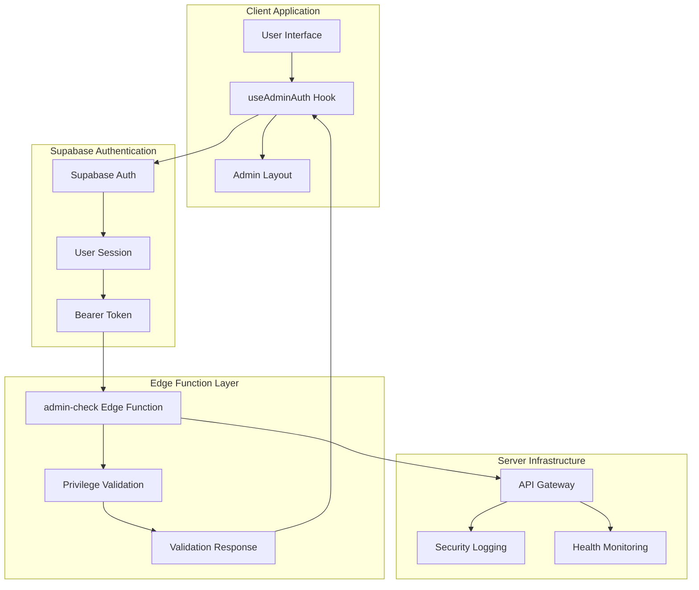
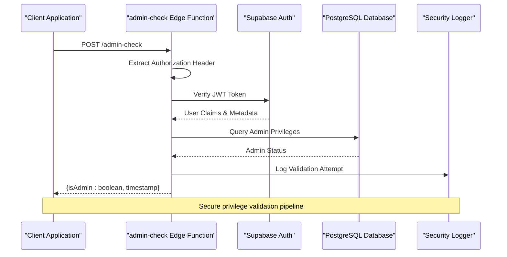
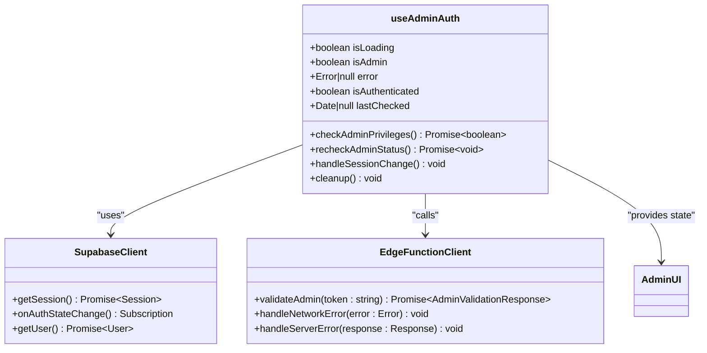
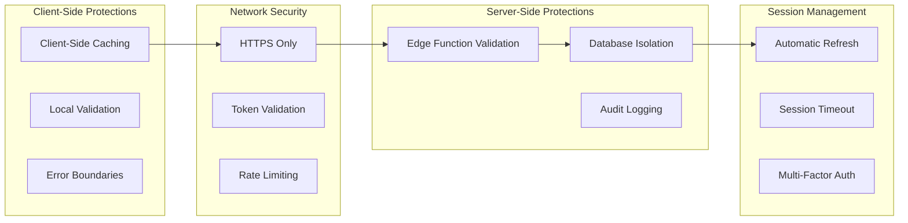
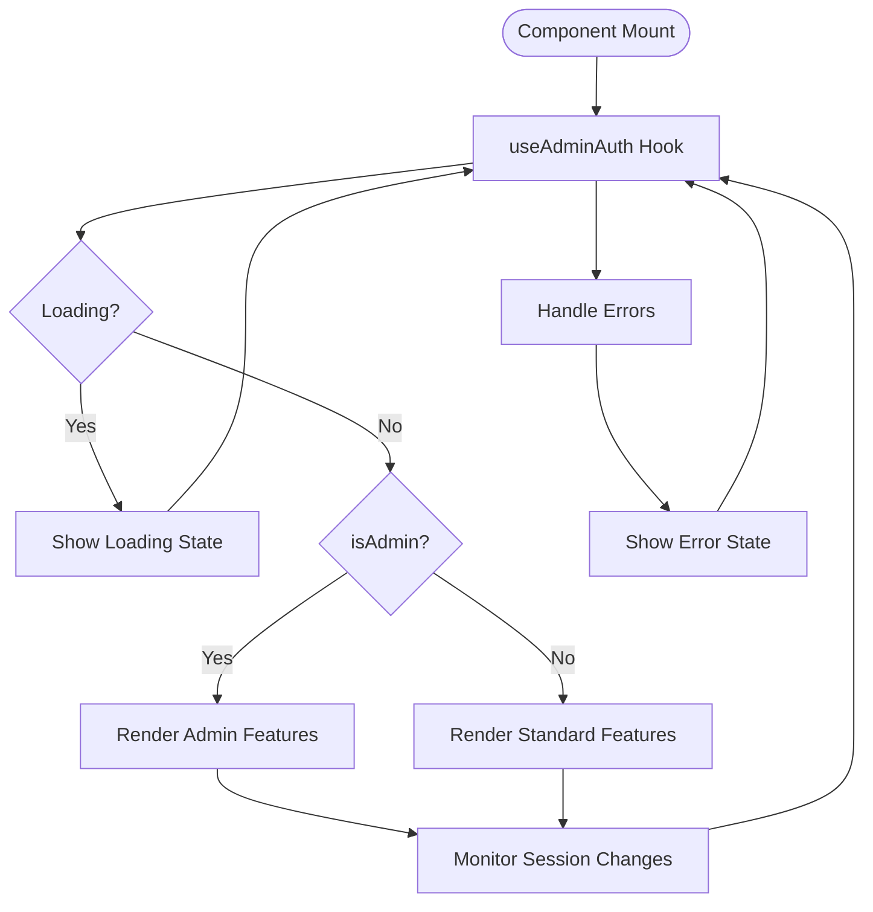
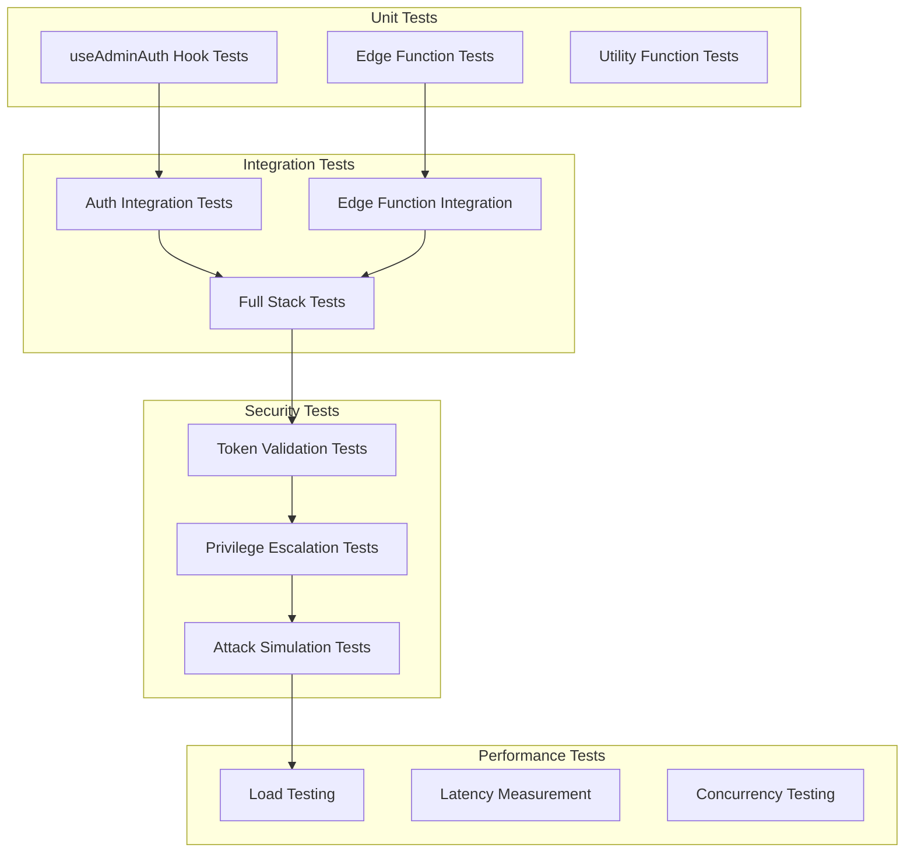

# Admin Authentication System Documentation

<cite>
**Referenced Files in This Document**
- [useAdminAuth.ts](file://src/hooks/useAdminAuth.ts)
- [useAdminAuth.test.ts](file://src/hooks/__tests__/useAdminAuth.test.ts)
- [admin-check/index.ts](file://supabase/functions/admin-check/index.ts)
- [AdminLayout.tsx](file://src/pages/admin/AdminLayout.tsx)
- [AdminAnalytics.tsx](file://src/pages/AdminAnalytics.tsx)
- [AdminAuditLogs.tsx](file://src/pages/AdminAuditLogs.tsx)
- [AdminBlog.tsx](file://src/pages/AdminBlog.tsx)
- [AdminLeads.tsx](file://src/pages/AdminLeads.tsx)
- [AdminProducts.tsx](file://src/pages/admin/AdminProducts.tsx)
- [AdminQuotes.tsx](file://src/pages/admin/AdminQuotes.tsx)
- [AdminSupplierOrderDetail.tsx](file://src/pages/admin/AdminSupplierOrderDetail.tsx)
- [AdminLayout.tsx](file://src/pages/admin/AdminLayout.tsx)
- [ModernAdminDashboard.tsx](file://src/pages/ModernAdminDashboard.tsx)
- [AdminSidebar.tsx](file://src/components/AdminSidebar.tsx)
</cite>

## Table of Contents
1. [Introduction](#introduction)
2. [System Architecture](#system-architecture)
3. [Edge Function Implementation](#edge-function-implementation)
4. [Client-Side Hook Implementation](#client-side-hook-implementation)
5. [Security Architecture](#security-architecture)
6. [Integration Patterns](#integration-patterns)
7. [Error Handling and Edge Cases](#error-handling-and-edge-cases)
8. [Testing Strategy](#testing-strategy)
9. [Best Practices](#best-practices)
10. [Troubleshooting Guide](#troubleshooting-guide)

## Introduction

The sleekapp-v100 admin authentication system provides secure privilege validation for administrative users through a sophisticated server-side architecture. The system combines Supabase Auth for session management with Edge Functions for secure backend validation, ensuring that admin privileges are verified server-side while maintaining a responsive client-side experience.

The authentication system operates on a principle of "trust but verify," where client-side applications can display admin-specific features but rely entirely on server-side validation for actual privilege enforcement. This approach prevents client-side manipulation of admin flags while providing immediate feedback to users about their access level.

## System Architecture

The admin authentication system follows a multi-layered architecture that separates concerns between client-side presentation and server-side security validation:

**Diagram sources**
- [useAdminAuth.ts](file://src/hooks/useAdminAuth.ts#L1-L50)
- [admin-check/index.ts](file://supabase/functions/admin-check/index.ts#L1-L30)

The architecture ensures that all sensitive privilege validation occurs server-side while providing efficient client-side caching and immediate feedback mechanisms.

## Edge Function Implementation

The `admin-check` Edge Function serves as the primary security boundary for admin privilege validation. This serverless function executes in the edge runtime, providing low-latency validation with global distribution capabilities.

### Function Architecture

**Diagram sources**
- [admin-check/index.ts](file://supabase/functions/admin-check/index.ts#L15-L80)

### Security Validation Process

The edge function implements multiple layers of security validation:

1. **Token Verification**: Validates the Bearer token signature and expiration
2. **User Authentication**: Confirms the user's active session with Supabase
3. **Role Checking**: Queries the database for explicit admin privileges
4. **Audit Logging**: Records all validation attempts for security monitoring
5. **Rate Limiting**: Prevents brute force attacks on the endpoint

**Section sources**
- [admin-check/index.ts](file://supabase/functions/admin-check/index.ts#L1-L100)

## Client-Side Hook Implementation

The `useAdminAuth` hook provides a React-based interface for managing admin authentication state and integrating with the edge function validation system.

### Hook Architecture

**Diagram sources**
- [useAdminAuth.ts](file://src/hooks/useAdminAuth.ts#L20-L120)

### State Management

The hook manages several critical states:

- **Loading State**: Indicates when privilege validation is in progress
- **Admin Status**: Boolean flag indicating whether the user has admin privileges
- **Authentication State**: Tracks whether the user is logged in
- **Error State**: Captures any validation errors that occur
- **Timestamp Tracking**: Records when the last validation occurred

### Manual Re-check Functionality

The hook provides a `recheckAdminStatus()` method that allows clients to manually trigger privilege validation when needed, such as after user actions that might change their admin status.

**Section sources**
- [useAdminAuth.ts](file://src/hooks/useAdminAuth.ts#L1-L200)

## Security Architecture

The admin authentication system implements defense-in-depth security measures to protect against various attack vectors and ensure robust privilege validation.

### Threat Mitigation Strategies

### Security Considerations

1. **Never Trust Client-Side Flags**: The system never relies solely on client-side admin flags for access control decisions
2. **Secure Token Transmission**: All communication uses HTTPS with proper token validation
3. **Session Expiration Handling**: Automatic handling of expired sessions with graceful degradation
4. **Network Error Resilience**: Graceful handling of network failures with appropriate fallback behavior
5. **Audit Trail**: Comprehensive logging of all privilege validation attempts

## Integration Patterns

The admin authentication system integrates seamlessly with various parts of the application through standardized patterns and interfaces.

### Component Integration

**Diagram sources**
- [AdminLayout.tsx](file://src/pages/admin/AdminLayout.tsx#L1-L50)
- [AdminSidebar.tsx](file://src/components/AdminSidebar.tsx#L1-L30)

### Page-Level Integration

Admin pages integrate with the authentication system through layout components that conditionally render based on the user's admin status. This ensures that unauthorized access attempts are handled gracefully.

**Section sources**
- [AdminLayout.tsx](file://src/pages/admin/AdminLayout.tsx#L1-L100)
- [ModernAdminDashboard.tsx](file://src/pages/ModernAdminDashboard.tsx#L1-L80)

## Error Handling and Edge Cases

The system implements comprehensive error handling to manage various failure scenarios gracefully while maintaining user experience quality.

### Error Scenarios

| Error Type | Cause | Handling Strategy | Recovery Action |
|------------|-------|-------------------|-----------------|
| Network Failure | Internet connectivity issues | Graceful degradation | Retry with exponential backoff |
| Expired Session | User session timeout | Automatic refresh | Redirect to login |
| Invalid Token | Malformed or tampered tokens | Immediate rejection | Clear session and redirect |
| Server Error | Edge function failures | Fallback to cached state | Notify user of service issue |
| Database Error | PostgreSQL connectivity | Circuit breaker pattern | Show maintenance message |
| Rate Limiting | Too many requests | Throttle requests | Show rate limit notification |

### Edge Case Management

1. **Concurrent Requests**: Handles multiple simultaneous validation requests gracefully
2. **Session Synchronization**: Manages race conditions during session updates
3. **Cache Invalidation**: Ensures stale data doesn't persist indefinitely
4. **Graceful Degradation**: Maintains functionality during partial system failures
5. **User Experience**: Provides meaningful feedback for all error conditions

**Section sources**
- [useAdminAuth.test.ts](file://src/hooks/__tests__/useAdminAuth.test.ts#L1-L150)

## Testing Strategy

The admin authentication system includes comprehensive testing to ensure reliability and security across all components.

### Test Coverage Areas

### Test Scenarios

The testing strategy covers various scenarios including successful validation, error conditions, edge cases, and security threats. Test cases verify that the system behaves correctly under all expected and unexpected conditions.

**Section sources**
- [useAdminAuth.test.ts](file://src/hooks/__tests__/useAdminAuth.test.ts#L1-L200)

## Best Practices

### Development Guidelines

1. **Always Validate Server-Side**: Never rely solely on client-side admin flags
2. **Handle Errors Gracefully**: Implement comprehensive error handling for all failure scenarios
3. **Use Secure Communication**: Ensure all API calls use HTTPS
4. **Implement Proper Caching**: Cache validation results appropriately while respecting security boundaries
5. **Monitor Performance**: Track validation latency and implement performance optimizations

### Security Best Practices

1. **Token Rotation**: Implement automatic token refresh mechanisms
2. **Audit Logging**: Maintain comprehensive logs of all privilege validation attempts
3. **Rate Limiting**: Protect against brute force attacks on the validation endpoint
4. **Secure Storage**: Store tokens securely and never expose them in client-side code
5. **Regular Security Reviews**: Conduct periodic security assessments of the authentication system

### Performance Optimization

1. **Efficient Caching**: Implement intelligent caching strategies for validation results
2. **Batch Operations**: Minimize the number of validation requests through batching
3. **Lazy Loading**: Load admin-specific features only when needed
4. **Progressive Enhancement**: Provide basic functionality even when validation fails
5. **Resource Optimization**: Optimize bundle sizes and loading times for admin components

## Troubleshooting Guide

### Common Issues and Solutions

| Issue | Symptoms | Diagnosis | Solution |
|-------|----------|-----------|----------|
| Stale Admin Status | Admin features appear disabled/enabled incorrectly | Check lastChecked timestamp | Call recheckAdminStatus() |
| Network Errors | Validation fails intermittently | Check browser console for network errors | Implement retry logic with exponential backoff |
| Session Timeout | Admin features disappear unexpectedly | Verify session expiration | Handle session refresh automatically |
| Edge Function Failures | Validation endpoint returns errors | Check edge function logs | Implement circuit breaker pattern |
| Performance Issues | Slow admin page loads | Profile validation timing | Optimize caching and reduce unnecessary requests |

### Debugging Tools

1. **Browser Developer Tools**: Monitor network requests and console logs
2. **Edge Function Logs**: Access detailed logs from the edge function execution
3. **Supabase Analytics**: Monitor authentication events and session activity
4. **Application Performance Monitoring**: Track validation latency and success rates
5. **Security Event Logs**: Review audit logs for validation attempts and failures

### Recovery Procedures

1. **Immediate Recovery**: Clear browser cache and reload the application
2. **Session Recovery**: Force logout and re-authenticate if session is corrupted
3. **System Recovery**: Restart edge functions if they become unresponsive
4. **Data Recovery**: Restore admin privileges from backup if database corruption occurs
5. **Service Recovery**: Switch to backup infrastructure if primary system fails

This comprehensive admin authentication system provides robust security, excellent user experience, and reliable functionality for managing administrative access in the sleekapp-v100 application. The combination of client-side convenience and server-side security ensures that the system can scale effectively while maintaining the highest security standards.