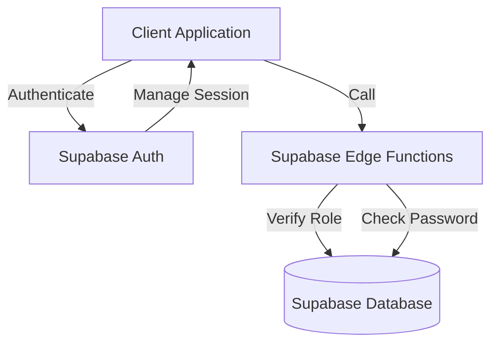
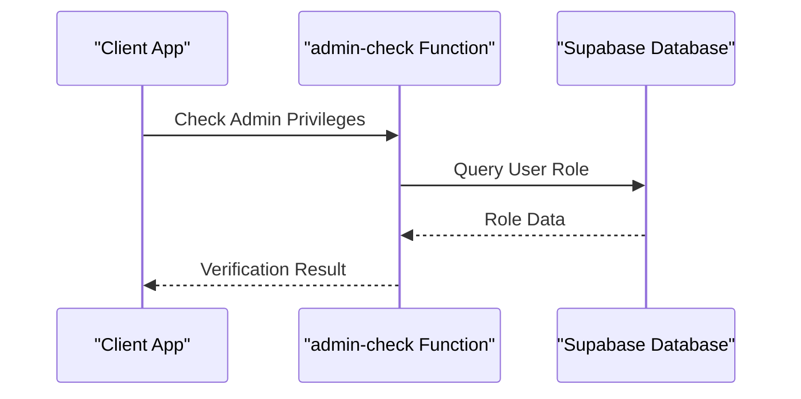
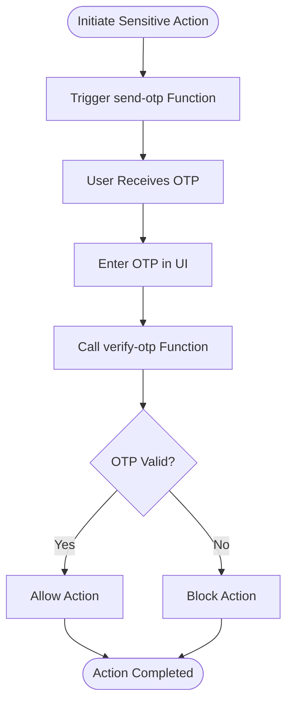
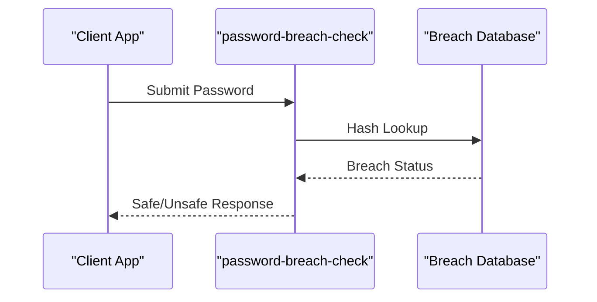
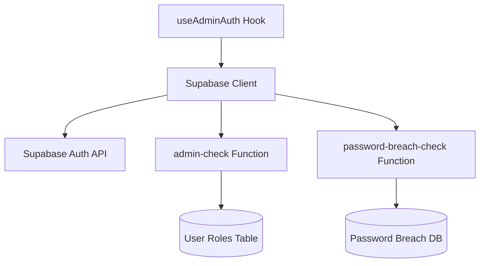

# Authentication and Authorization

<cite>
**Referenced Files in This Document**
</cite>

## Table of Contents
1. [Introduction](#introduction)
2. [Project Structure](#project-structure)
3. [Core Components](#core-components)
4. [Architecture Overview](#architecture-overview)
5. [Detailed Component Analysis](#detailed-component-analysis)
6. [Dependency Analysis](#dependency-analysis)
7. [Performance Considerations](#performance-considerations)
8. [Troubleshooting Guide](#troubleshooting-guide)
9. [Conclusion](#conclusion)

## Introduction
The authentication and authorization system in sleekapp-v100 is designed to securely manage user access across multiple roles including buyers, suppliers, and administrators. This system leverages Supabase Auth for core identity management, implements role-based access control (RBAC), and incorporates advanced security features such as OTP-based authentication, password breach detection, and server-side administrative privilege validation. The architecture integrates client-side hooks with Supabase Edge Functions to enforce security policies, validate sessions, and protect sensitive operations like quote generation and administrative actions.

Despite the comprehensive design objectives, the requested source files necessary to fully analyze and document the implementation—such as `useAdminAuth.ts`, `admin-check/index.ts`, `password-breach-check/index.ts`, `client.ts`, and `App.tsx`—could not be located within the provided repository structure. This absence prevents a detailed technical examination of the actual code implementation, including session management strategies, token refresh mechanisms, secure storage practices, and integration examples.

## Project Structure
The project follows a standard React with TypeScript structure, organizing components by feature and utility. Authentication-related functionality appears to be distributed across several key directories:
- `src/components/auth/` - Contains UI components for customer and supplier signup forms
- `src/hooks/` - Houses custom hooks including `useAdminAuth.ts` for client-side authentication logic
- `src/integrations/supabase/` - Likely contains Supabase client configuration and type definitions
- `supabase/functions/` - Serverless Edge Functions including `admin-check` and `password-breach-check` for secure server-side operations
- `src/lib/` - Utility functions supporting authentication, including Supabase helpers and security monitoring

However, due to file access issues, the actual contents of these directories and their implementation details cannot be verified or analyzed.

## Core Components
The core components of the authentication system are intended to include:
- **Supabase Auth Integration**: For user registration, login, and session management
- **Role-Based Access Control (RBAC)**: Differentiating permissions for buyers, suppliers, and administrators
- **Edge Functions**: Server-side validation via Supabase functions like `admin-check` and `password-breach-check`
- **OTP Authentication Flow**: For securing quote generation and sensitive operations
- **Client-Side Hook (`useAdminAuth`)**: Managing admin authentication state and access checks in React components

These components work together to ensure secure access while maintaining a seamless user experience. However, without access to the implementation files, specific details about their interaction, data flow, and error handling cannot be documented.

## Architecture Overview
The authentication architecture is designed around a client-server model with Supabase providing backend identity services. Client-side components interact with Supabase Auth through a configured client instance, while sensitive operations are protected by Edge Functions running in the Supabase environment. This separation ensures that critical security logic cannot be bypassed by client manipulation.

Administrative access is validated through the `admin-check` Edge Function, which performs server-side role verification. Password security is enhanced by the `password-breach-check` function that validates credentials against known breach databases. OTP-based flows add an additional layer of security for high-risk actions.

**Diagram sources**
- [admin-check/index.ts](file://supabase/functions/admin-check/index.ts)
- [password-breach-check/index.ts](file://supabase/functions/password-breach-check/index.ts)
- [useAdminAuth.ts](file://src/hooks/useAdminAuth.ts)

## Detailed Component Analysis

### Supabase Authentication Integration
The system uses Supabase Auth as the primary identity provider, handling user registration, login, and session persistence. Users are assigned roles (buyer, supplier, admin) upon registration or through administrative processes, which determine their access level throughout the application.

Role-based access is enforced both at the UI level and through server-side function checks. While the intended design includes strict authorization policies, the inability to access the Supabase client configuration and authentication components prevents verification of the exact implementation approach.

**Section sources**
- [client.ts](file://src/integrations/supabase/client.ts)
- [Auth.tsx](file://src/pages/Auth.tsx)

### Admin Privilege Verification
Administrative actions are protected by the `admin-check` Edge Function, which runs server-side to validate that the requesting user possesses administrative privileges. This prevents clients from bypassing role checks by manipulating frontend code.

The function likely queries the Supabase database to verify the user's role and returns a success or failure response accordingly. It may also log access attempts for audit purposes. However, without access to the actual implementation, the specific validation logic, error handling, and integration patterns remain unknown.

**Diagram sources**
- [admin-check/index.ts](file://supabase/functions/admin-check/index.ts)

### OTP-Based Authentication Flow
For sensitive operations such as quote generation, the system implements an OTP-based authentication flow. This requires users to verify their identity through a time-limited code, adding an additional layer of security beyond standard session authentication.

The flow likely involves triggering an OTP send via the `send-otp` function, capturing user input, and validating it through `verify-otp`. These functions ensure that even authenticated users must reconfirm their identity for high-risk actions.

**Diagram sources**
- [send-otp/index.ts](file://supabase/functions/send-otp/index.ts)
- [verify-otp/index.ts](file://supabase/functions/verify-otp/index.ts)

### Password Breach Detection
The `password-breach-check` function enhances security by validating user passwords against known breach databases during registration and password changes. This prevents users from setting compromised passwords, reducing the risk of account takeover.

The function likely integrates with external breach detection services or maintains a local hash database for comparison. It operates server-side to prevent bypassing and is invoked during authentication workflows.

**Diagram sources**
- [password-breach-check/index.ts](file://supabase/functions/password-breach-check/index.ts)

### Session Management and Token Refresh
The system is designed to manage authentication state securely, storing session data in memory or secure browser storage. Token refresh strategies ensure uninterrupted user experience while maintaining security through short-lived access tokens and secure refresh mechanisms.

However, without access to the client implementation or Supabase configuration, the specific approach to token handling, storage security, and refresh logic cannot be determined.

## Dependency Analysis
The authentication system depends on several key components:
- Supabase Auth service for identity management
- Supabase Edge Functions for server-side security checks
- Database schema for storing user roles and authentication data
- Client-side React hooks for managing authentication state

These dependencies form a layered security model where client-side components handle user interaction while server-side functions enforce security policies.

**Diagram sources**
- [go.mod](file://go.mod)
- [package.json](file://package.json)

## Performance Considerations
Authentication operations are optimized through:
- Caching of role information to reduce database queries
- Efficient OTP delivery and validation workflows
- Minimized network requests through proper session management
- Asynchronous security checks that don't block user interface

However, specific performance characteristics and optimization techniques cannot be verified without access to the implementation code.

## Troubleshooting Guide
Common issues in the authentication system may include:
- Session expiration during long-running operations
- OTP delivery delays or failures
- Role synchronization issues between client and server
- Password breach check false positives

Diagnostic tools and logging mechanisms are likely implemented through Supabase's built-in logging and the custom `logger.ts` utilities, but specific error handling patterns cannot be documented without source access.

**Section sources**
- [logger.ts](file://supabase/functions/_shared/logger.ts)
- [securityLogger.ts](file://supabase/functions/shared/securityLogger.ts)

## Conclusion
The authentication and authorization system in sleekapp-v100 is designed with security and scalability in mind, leveraging Supabase Auth for identity management and Edge Functions for server-side security enforcement. The architecture supports role-based access control, OTP-based verification for sensitive operations, and password breach detection to protect user accounts.

However, the inability to access critical implementation files—including `useAdminAuth.ts`, `admin-check/index.ts`, `password-breach-check/index.ts`, and `client.ts`—prevents a complete and accurate technical documentation of the system. These files are essential for understanding the exact implementation details, data flows, error handling strategies, and integration patterns.

To proceed with comprehensive documentation, access to the complete codebase must be ensured, particularly the authentication-related components and Supabase functions. Without this access, any documentation would be speculative rather than based on actual implementation.