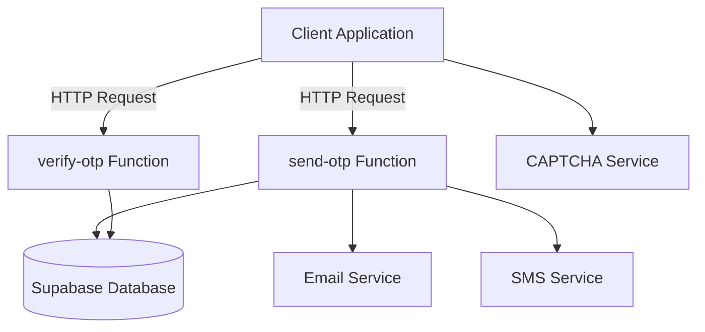
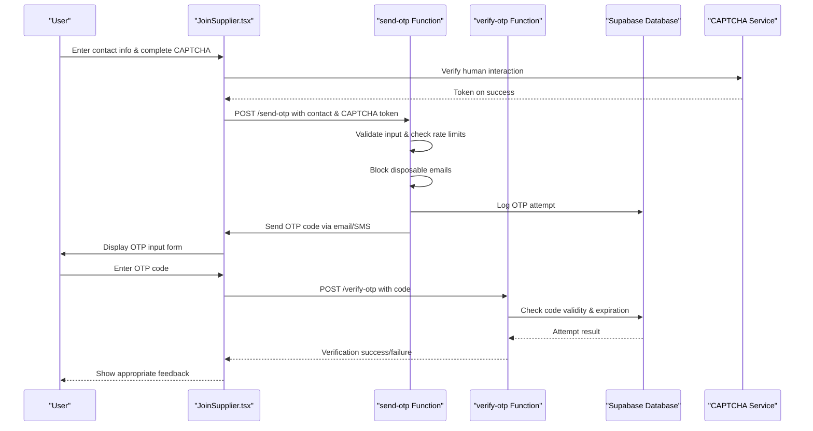
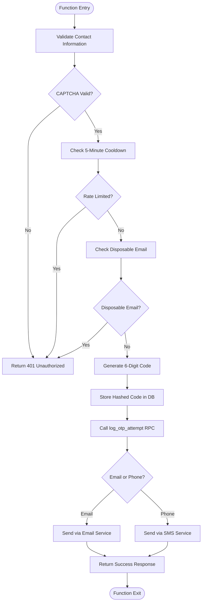
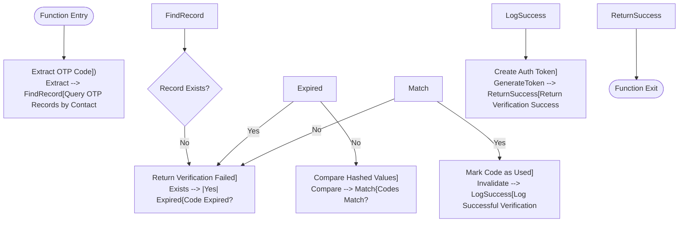
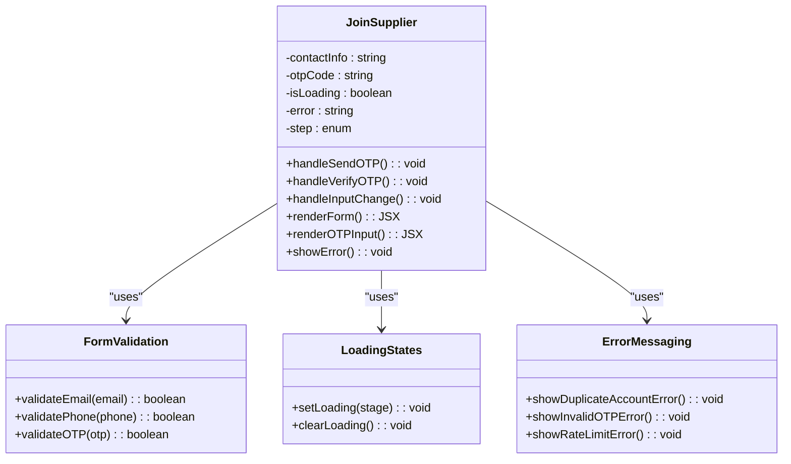
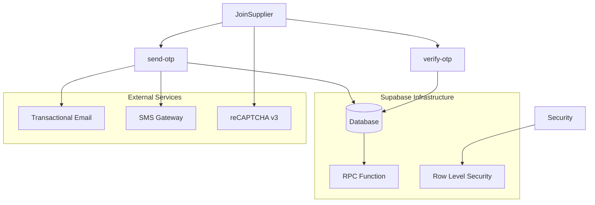

# OTP Authentication Flow

<cite>
**Referenced Files in This Document**  
- [JoinSupplier.tsx](file://src/pages/JoinSupplier.tsx)
- [send-otp/index.ts](file://supabase/functions/send-otp/index.ts)
- [verify-otp/index.ts](file://supabase/functions/verify-otp/index.ts)
- [Auth.test.tsx](file://src/pages/__tests__/Auth.test.tsx)
</cite>

## Table of Contents
1. [Introduction](#introduction)
2. [Project Structure](#project-structure)
3. [Core Components](#core-components)
4. [Architecture Overview](#architecture-overview)
5. [Detailed Component Analysis](#detailed-component-analysis)
6. [Dependency Analysis](#dependency-analysis)
7. [Performance Considerations](#performance-considerations)
8. [Troubleshooting Guide](#troubleshooting-guide)
9. [Conclusion](#conclusion)

## Introduction
The OTP-based authentication system in sleekapp-v100 provides a secure mechanism for user verification during registration and login processes. This document details the end-to-end flow of sending and verifying one-time passwords via email and phone, including abuse prevention measures, client-side integration, database logging, and security hardening.

## Project Structure
The OTP authentication functionality is distributed across frontend components, Supabase Edge Functions, and database-level security policies. The implementation follows a modular architecture with clear separation between presentation, business logic, and data layers.

**Diagram sources**
- [send-otp/index.ts](file://supabase/functions/send-otp/index.ts)
- [verify-otp/index.ts](file://supabase/functions/verify-otp/index.ts)
- [JoinSupplier.tsx](file://src/pages/JoinSupplier.tsx)

**Section sources**
- [src/pages/JoinSupplier.tsx](file://src/pages/JoinSupplier.tsx)
- [supabase/functions/send-otp/index.ts](file://supabase/functions/send-otp/index.ts)
- [supabase/functions/verify-otp/index.ts](file://supabase/functions/verify-otp/index.ts)

## Core Components
The OTP authentication system consists of three primary components: the client-side form in JoinSupplier.tsx, the send-otp Edge Function for generating and dispatching codes, and the verify-otp Edge Function for validating user input. These components work in concert with CAPTCHA integration for abuse prevention and rate limiting to prevent brute force attacks.

**Section sources**
- [JoinSupplier.tsx](file://src/pages/JoinSupplier.tsx)
- [send-otp/index.ts](file://supabase/functions/send-otp/index.ts)
- [verify-otp/index.ts](file://supabase/functions/verify-otp/index.ts)

## Architecture Overview
The OTP authentication flow follows a secure, stateless pattern leveraging Supabase Edge Functions as the backend-for-frontend. The architecture incorporates multiple security layers including rate limiting, disposable email detection, and request timeout handling.

**Diagram sources**
- [send-otp/index.ts](file://supabase/functions/send-otp/index.ts)
- [verify-otp/index.ts](file://supabase/functions/verify-otp/index.ts)
- [JoinSupplier.tsx](file://src/pages/JoinSupplier.tsx)

## Detailed Component Analysis

### send-otp Edge Function
The send-otp function handles the generation and delivery of one-time passwords while implementing several security measures to prevent abuse.

**Diagram sources**
- [send-otp/index.ts](file://supabase/functions/send-otp/index.ts)

**Section sources**
- [send-otp/index.ts](file://supabase/functions/send-otp/index.ts)

### verify-otp Edge Function
The verify-otp function validates user-submitted codes against stored values with proper expiration and attempt tracking.

**Diagram sources**
- [verify-otp/index.ts](file://supabase/functions/verify-otp/index.ts)

**Section sources**
- [verify-otp/index.ts](file://supabase/functions/verify-otp/index.ts)

### Client-Side Integration in JoinSupplier.tsx
The JoinSupplier component implements a user-friendly interface for OTP authentication with proper state management and error handling.

**Diagram sources**
- [JoinSupplier.tsx](file://src/pages/JoinSupplier.tsx)

**Section sources**
- [JoinSupplier.tsx](file://src/pages/JoinSupplier.tsx)

## Dependency Analysis
The OTP authentication system relies on several internal and external dependencies to function securely and efficiently.

**Diagram sources**
- [supabase/functions/send-otp/index.ts](file://supabase/functions/send-otp/index.ts)
- [supabase/functions/verify-otp/index.ts](file://supabase/functions/verify-otp/index.ts)
- [src/pages/JoinSupplier.tsx](file://src/pages/JoinSupplier.tsx)

**Section sources**
- [supabase/functions/send-otp/index.ts](file://supabase/functions/send-otp/index.ts)
- [supabase/functions/verify-otp/index.ts](file://supabase/functions/verify-otp/index.ts)

## Performance Considerations
The OTP authentication flow has been optimized for responsiveness and reliability with appropriate timeout handling and error recovery mechanisms. The 5-minute cooldown period balances security with user experience, while the CAPTCHA integration prevents automated abuse without significantly impacting legitimate users.

## Troubleshooting Guide
The system includes comprehensive logging through the log_otp_attempt RPC function, which records all OTP attempts for security monitoring and debugging purposes. Test coverage in Auth.test.tsx verifies both valid and invalid OTP scenarios, ensuring reliable behavior under various conditions.

**Section sources**
- [Auth.test.tsx](file://src/pages/__tests__/Auth.test.tsx)

## Conclusion
The OTP authentication flow in sleekapp-v100 provides a robust, secure mechanism for user verification with multiple layers of protection against abuse. The implementation combines client-side usability with server-side security controls, creating a seamless experience for legitimate users while effectively preventing automated attacks.