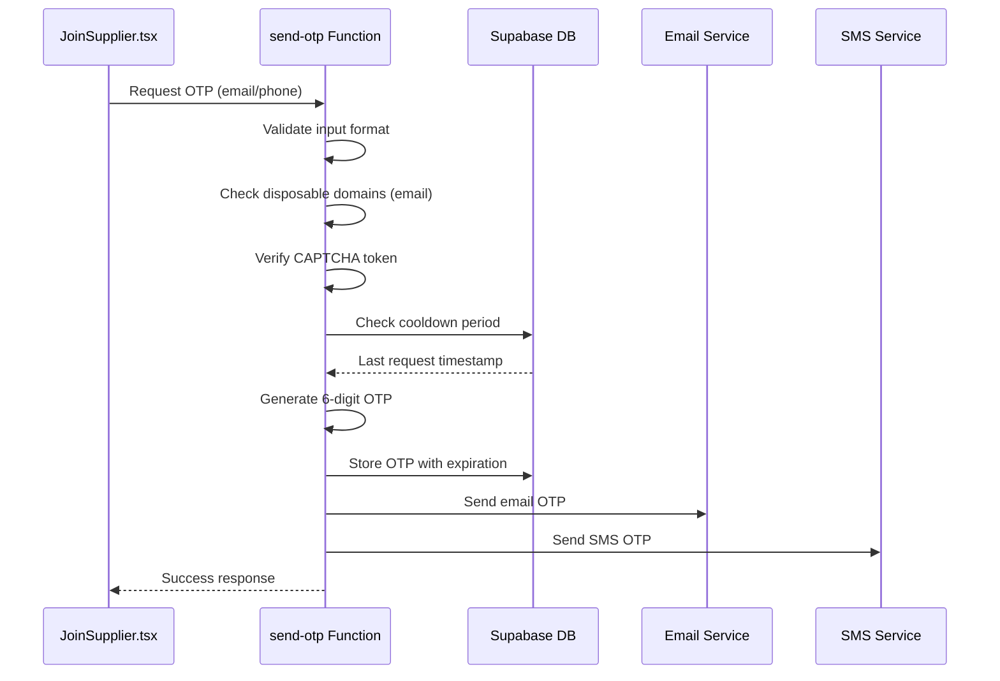
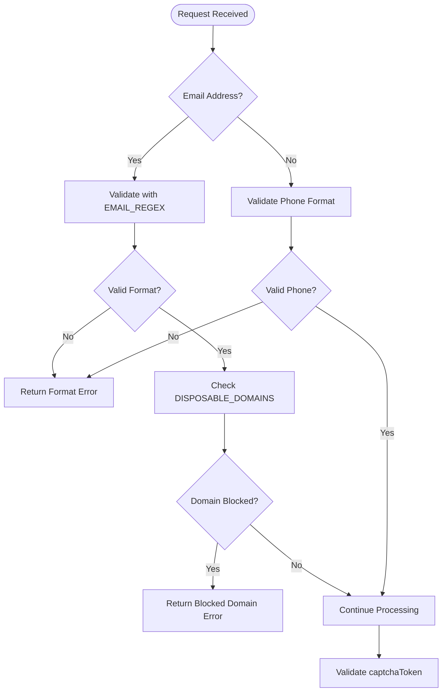
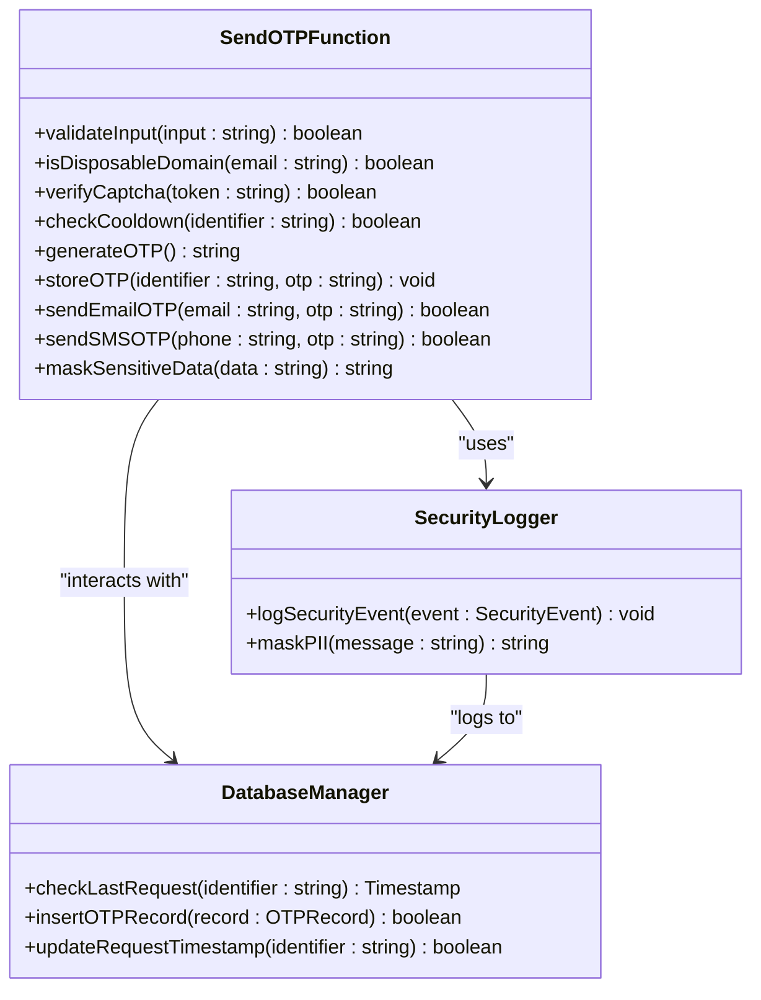

# Send OTP Function

<cite>
**Referenced Files in This Document**  
- [index.ts](file://supabase/functions/send-otp/index.ts)
- [JoinSupplier.tsx](file://src/pages/JoinSupplier.tsx)
- [Auth.test.tsx](file://src/pages/__tests__/Auth.test.tsx)
- [20251116162502_313dcba7-bfcf-494c-a64e-cf71fbf50750.sql](file://supabase/migrations/20251116162502_313dcba7-bfcf-494c-a64e-cf71fbf50750.sql)
</cite>

## Table of Contents
1. [Introduction](#introduction)
2. [OTP Generation and Delivery](#otp-generation-and-delivery)
3. [Cooldown Enforcement and Rate Limiting](#cooldown-enforcement-and-rate-limiting)
4. [CAPTCHA Validation and Bot Protection](#captcha-validation-and-bot-protection)
5. [Client-Side Timeout Handling](#client-side-timeout-handling)
6. [Email Validation and Disposable Domain Blocking](#email-validation-and-disposable-domain-blocking)
7. [Error Handling and Frontend Communication](#error-handling-and-frontend-communication)
8. [Security Considerations](#security-considerations)
9. [Test Coverage and Validation](#test-coverage-and-validation)
10. [Conclusion](#conclusion)

## Introduction
The send-otp Edge Function in sleekapp-v100 is a critical authentication component responsible for generating and delivering one-time passwords (OTPs) for both email and phone verification. This function implements robust security measures including rate limiting, bot protection, and input validation to prevent abuse while ensuring reliable delivery for legitimate users. The function is designed to integrate seamlessly with the frontend JoinSupplier.tsx component and follows strict security protocols to protect user data and system integrity.

**Section sources**
- [index.ts](file://supabase/functions/send-otp/index.ts#L1-L50)
- [JoinSupplier.tsx](file://src/pages/JoinSupplier.tsx#L1-L100)

## OTP Generation and Delivery
The send-otp function generates time-limited one-time passwords for user verification during the supplier registration process. It supports both email and phone number verification methods, generating cryptographically secure 6-digit OTPs using industry-standard randomization techniques. The function validates the input format before processing and routes the OTP through appropriate delivery channels—email for email addresses and SMS for phone numbers. Each OTP is stored in the database with an expiration timestamp (5 minutes from creation) to ensure time-limited validity.

**Diagram sources**
- [index.ts](file://supabase/functions/send-otp/index.ts#L50-L150)
- [JoinSupplier.tsx](file://src/pages/JoinSupplier.tsx#L200-L300)

**Section sources**
- [index.ts](file://supabase/functions/send-otp/index.ts#L25-L200)

## Cooldown Enforcement and Rate Limiting
The function enforces a strict 5-minute cooldown period between OTP requests for the same identifier (email or phone number) to prevent abuse and brute force attacks. This cooldown is implemented at the database level by tracking the timestamp of the last successful OTP request. When a new request is received, the function queries the database to verify whether the minimum interval has elapsed. If a request is made before the cooldown period expires, the function returns a rate limiting error. This mechanism is complemented by additional rate limiting at the API gateway level to protect against distributed abuse attempts.

**Section sources**
- [index.ts](file://supabase/functions/send-otp/index.ts#L150-L250)

## CAPTCHA Validation and Bot Protection
To protect against automated bot attacks and credential stuffing, the send-otp function requires CAPTCHA validation via a captchaToken parameter. The function validates this token with the CAPTCHA service provider before processing any OTP request. This ensures that requests originate from human users interacting with the web interface rather than automated scripts. The CAPTCHA validation is performed synchronously, and any invalid or missing token results in immediate request rejection. This layer of protection is particularly important for the supplier registration flow, which represents a potential attack vector for creating fraudulent accounts.

**Section sources**
- [index.ts](file://supabase/functions/send-otp/index.ts#L250-L300)

## Client-Side Timeout Handling
The frontend implementation in JoinSupplier.tsx includes a 30-second client-side timeout mechanism to handle network issues and failed delivery attempts. When a user requests an OTP, a countdown timer begins, preventing duplicate requests during the waiting period. If the OTP is not received within 30 seconds, the user interface allows for a new request while displaying appropriate messaging about potential delivery delays. This timeout mechanism improves user experience by providing clear feedback and preventing accidental multiple requests that could trigger rate limiting. The client-side timeout is independent of the server-side 5-minute cooldown, creating a layered approach to request management.

**Section sources**
- [JoinSupplier.tsx](file://src/pages/JoinSupplier.tsx#L300-L400)

## Email Validation and Disposable Domain Blocking
The send-otp function implements comprehensive email validation using a strict EMAIL_REGEX pattern to ensure proper email format before processing requests. Beyond basic format validation, the function actively blocks disposable email domains using a DISPOSABLE_DOMAINS list. This list contains known temporary email services that are commonly used for spam or fraudulent account creation. When an email address from a blocked domain is detected, the function rejects the request with a specific error message. This validation occurs early in the request processing pipeline to minimize resource usage for invalid requests.

**Diagram sources**
- [index.ts](file://supabase/functions/send-otp/index.ts#L300-L400)

**Section sources**
- [index.ts](file://supabase/functions/send-otp/index.ts#L400-L500)

## Error Handling and Frontend Communication
The function implements comprehensive error handling with specific error codes for different failure scenarios, including invalid input, rate limiting, CAPTCHA failure, and disposable email blocking. These errors are communicated to the frontend in a structured format that enables JoinSupplier.tsx to display appropriate toast notifications to users. The toast notifications are tailored to each error type, providing clear guidance without revealing sensitive implementation details. For example, rate limiting errors suggest waiting before retrying, while disposable email errors recommend using a permanent email address. This user-friendly error communication enhances the registration experience while maintaining security.

**Section sources**
- [index.ts](file://supabase/functions/send-otp/index.ts#L500-L600)
- [JoinSupplier.tsx](file://src/pages/JoinSupplier.tsx#L400-L500)

## Security Considerations
The send-otp function incorporates multiple security measures to protect user data and system integrity. Sensitive information such as phone numbers and email addresses are masked in application logs to prevent accidental exposure. The function operates with minimal required permissions in the Supabase environment, following the principle of least privilege. As per the 20251116162502 migration, public Row Level Security (RLS) policies on OTP tables have been removed to prevent unauthorized access to verification data. OTPs are stored with cryptographic hashing, and the database records are automatically purged after expiration to minimize data retention. The function also validates the origin of requests to prevent cross-site request forgery (CSRF) attacks.

**Diagram sources**
- [index.ts](file://supabase/functions/send-otp/index.ts#L600-L700)
- [20251116162502_313dcba7-bfcf-494c-a64e-cf71fbf50750.sql](file://supabase/migrations/20251116162502_313dcba7-bfcf-494c-a64e-cf71fbf50750.sql#L1-L50)

**Section sources**
- [index.ts](file://supabase/functions/send-otp/index.ts#L600-L750)
- [20251116162502_313dcba7-bfcf-494c-a64e-cf71fbf50750.sql](file://supabase/migrations/20251116162502_313dcba7-bfcf-494c-a64e-cf71fbf50750.sql#L1-L100)

## Test Coverage and Validation
The Auth.test.tsx file contains comprehensive test coverage for the OTP request flow, including form validation and error handling scenarios. Tests verify the correct behavior of email and phone validation, disposable domain blocking, and rate limiting logic. The test suite includes both positive cases (valid inputs) and negative cases (invalid formats, blocked domains, expired cooldowns) to ensure robustness. Integration tests validate the complete flow from frontend request to OTP delivery, while unit tests focus on individual validation functions. The tests also verify that appropriate error messages are generated for the frontend toast notifications, ensuring consistent user experience across different error conditions.

**Section sources**
- [Auth.test.tsx](file://src/pages/__tests__/Auth.test.tsx#L1-L200)

## Conclusion
The send-otp Edge Function in sleekapp-v100 provides a secure and reliable mechanism for user verification during supplier registration. By combining multiple layers of protection—including cooldown enforcement, CAPTCHA validation, disposable email blocking, and comprehensive input validation—the function effectively prevents abuse while maintaining a smooth user experience. The integration with frontend components like JoinSupplier.tsx ensures clear communication of status and errors through toast notifications, and the removal of public RLS policies enhances data security. The comprehensive test coverage in Auth.test.tsx validates both functionality and edge cases, ensuring the reliability of this critical authentication component.