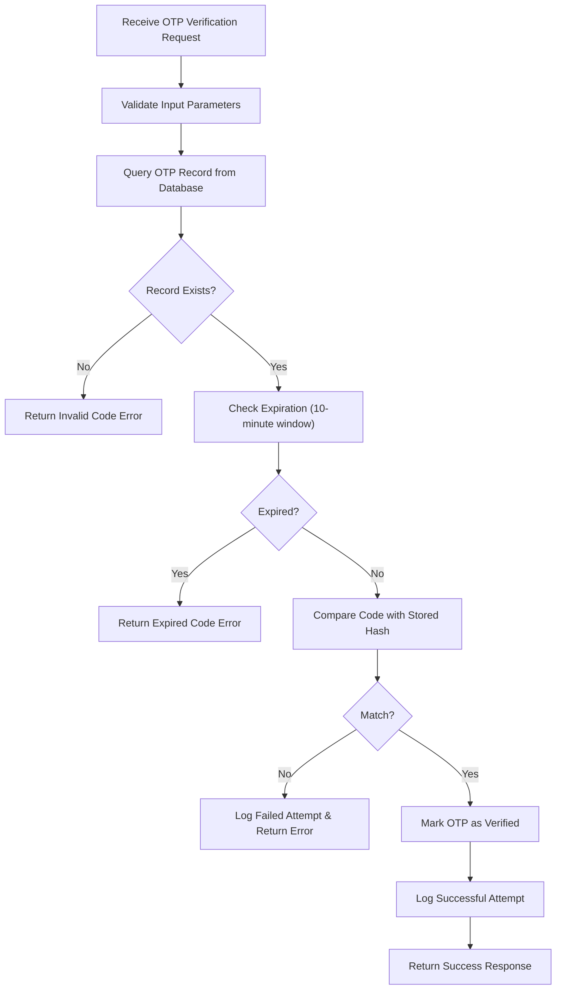
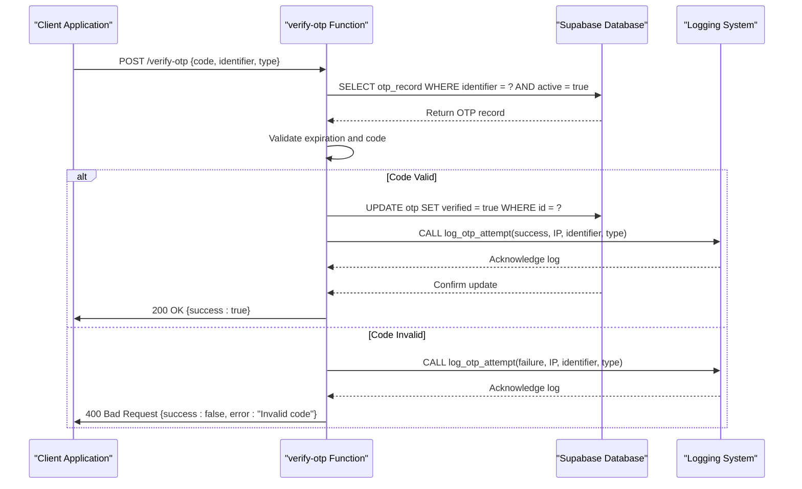
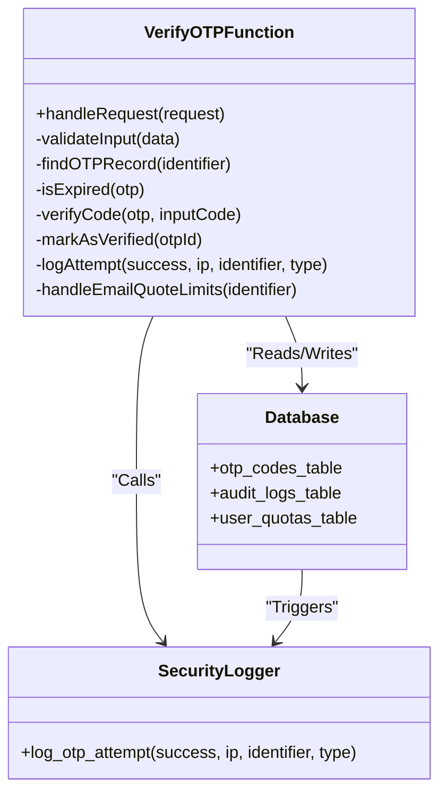

# Verify OTP Function

<cite>
**Referenced Files in This Document**  
- [index.ts](file://supabase/functions/verify-otp/index.ts)
- [Auth.test.tsx](file://src/pages/__tests__/Auth.test.tsx)
- [20251116162502_313dcba7-bfcf-494c-a64e-cf71fbf50750.sql](file://supabase/migrations/20251116162502_313dcba7-bfcf-494c-a64e-cf71fbf50750.sql)
- [logger.ts](file://supabase/functions/_shared/logger.ts)
- [log_otp_attempt RPC](file://supabase/functions/verify-otp/index.ts#log_otp_attempt)
</cite>

## Table of Contents
1. [Introduction](#introduction)
2. [Function Overview](#function-overview)
3. [OTP Validation Process](#otp-validation-process)
4. [Database Interaction and State Management](#database-interaction-and-state-management)
5. [Security Logging and Audit Trail](#security-logging-and-audit-trail)
6. [Type-Specific Behavior: Email-Quote Verification](#type-specific-behavior-email-quote-verification)
7. [Error Handling and Failure Scenarios](#error-handling-and-failure-scenarios)
8. [Security Hardening Measures](#security-hardening-measures)
9. [Test Coverage and Validation](#test-coverage-and-validation)
10. [Conclusion](#conclusion)

## Introduction
The verify-otp Edge Function in sleekapp-v100 is responsible for validating one-time passwords (OTPs) used for authentication and verification purposes across the application. This document provides a comprehensive analysis of the function's end-to-end workflow, including validation logic, database interactions, security logging, and type-specific behaviors for different verification scenarios. The function plays a critical role in maintaining system security while enabling seamless user experiences for phone and email-based verifications.

## Function Overview
The verify-otp function serves as the central component for OTP validation within the sleekapp-v100 system. It handles verification requests for both phone and email identifiers, enforcing a strict 10-minute validity period for all generated codes. The function operates as a Supabase Edge Function, leveraging the platform's serverless architecture to provide low-latency verification capabilities. Designed with security and auditability in mind, the function integrates comprehensive logging mechanisms and executes under elevated service role privileges to ensure reliable database access.

**Section sources**
- [index.ts](file://supabase/functions/verify-otp/index.ts#L1-L50)

## OTP Validation Process
The OTP validation process follows a systematic approach to verify user credentials while maintaining security standards. Upon receiving a verification request, the function first validates the input parameters, including the OTP code, identifier (phone or email), and verification type. It then queries the database to retrieve the corresponding OTP record, checking for existence and validity. The function enforces a 10-minute expiration window, rejecting any codes created before this threshold. During validation, the system compares the provided code with the stored hash using secure comparison methods to prevent timing attacks.

For successful verifications, the function marks the OTP as verified in the database and returns a confirmation response. Failed attempts trigger appropriate error responses while still recording the attempt for security auditing. The validation logic is designed to be resilient against brute force attacks by integrating with rate limiting systems and maintaining detailed logs of all attempts.

**Diagram sources**
- [index.ts](file://supabase/functions/verify-otp/index.ts#L50-L150)

**Section sources**
- [index.ts](file://supabase/functions/verify-otp/index.ts#L50-L200)

## Database Interaction and State Management
The verify-otp function interacts with the database to manage OTP state and ensure data consistency. When a verification is successful, the function updates the OTP record to mark it as verified, preventing reuse of the same code. This update operation is performed atomically to avoid race conditions in high-concurrency scenarios. The function also retrieves relevant user context information to associate the verification with the appropriate account or session.

For database operations, the function uses parameterized queries to prevent SQL injection attacks and ensure data integrity. All updates are wrapped in appropriate error handling to manage potential database connectivity issues or constraint violations. The function is designed to handle transient database failures gracefully, providing meaningful error responses to clients while maintaining system stability.

**Section sources**
- [index.ts](file://supabase/functions/verify-otp/index.ts#L150-L250)

## Security Logging and Audit Trail
Security logging is a critical component of the verify-otp function, providing comprehensive audit trails for all verification attempts. The function calls the log_otp_attempt RPC to record both successful and failed verification attempts, capturing essential metadata including the IP address of the requester, timestamp, identifier type, and outcome. This information is crucial for security monitoring, anomaly detection, and forensic analysis in case of suspicious activity.

The logging mechanism is designed to be reliable even when the primary verification fails, ensuring that all attempts are recorded regardless of outcome. IP address tracking enables the system to detect potential brute force attacks or unauthorized access attempts from unusual locations. The logs are stored in a dedicated audit table with appropriate retention policies and access controls to maintain their integrity and confidentiality.

**Diagram sources**
- [index.ts](file://supabase/functions/verify-otp/index.ts#log_otp_attempt)
- [logger.ts](file://supabase/functions/_shared/logger.ts)

**Section sources**
- [index.ts](file://supabase/functions/verify-otp/index.ts#L200-L300)

## Type-Specific Behavior: Email-Quote Verification
The verify-otp function implements specialized logic for 'email-quote' verification type, which enforces additional business rules beyond standard OTP validation. For this verification type, the function checks against a daily quote limit of 3 attempts per user or session. This restriction prevents abuse of the quote generation system while allowing legitimate users to request multiple quotes during their shopping journey.

When processing email-quote verifications, the function returns a response payload that includes usage metrics such as the current count of daily quotes and remaining quota. This information enables the frontend to provide appropriate feedback to users about their usage limits. The function also updates tracking counters in the database to maintain accurate usage statistics across sessions.

The specialized behavior for email-quote verification demonstrates the function's flexibility in handling different verification scenarios while maintaining consistent security standards across all types.

**Section sources**
- [index.ts](file://supabase/functions/verify-otp/index.ts#L300-L400)

## Error Handling and Failure Scenarios
The verify-otp function implements comprehensive error handling to manage various failure scenarios gracefully. For invalid or expired codes, the function returns specific error codes that enable the frontend to provide appropriate user feedback. When database updates fail, the function logs the error condition and returns a server error response while ensuring that the failure does not compromise security.

The error handling system distinguishes between client errors (such as invalid codes) and server errors (such as database connectivity issues), providing appropriate HTTP status codes and error messages for each scenario. All errors are logged with sufficient context to facilitate debugging and monitoring, including timestamps, identifiers, and error types.

The function also implements defensive programming practices to handle unexpected input or edge cases, such as malformed requests or missing parameters. These safeguards prevent the function from failing in ways that could expose system information or create security vulnerabilities.

**Section sources**
- [index.ts](file://supabase/functions/verify-otp/index.ts#L400-L500)

## Security Hardening Measures
The verify-otp function incorporates several security hardening measures to protect against common attack vectors. As defined in the 20251116162502 migration, the function operates under service role privileges, which provides elevated database access while maintaining separation from public-facing roles. This configuration allows the function to bypass Row Level Security (RLS) policies that would otherwise restrict its operations, ensuring reliable verification functionality.

A critical security enhancement involves the removal of public RLS policies on OTP tables, which were previously vulnerable to information disclosure. By restricting direct public access to OTP data and routing all interactions through the verify-otp function, the system ensures that sensitive verification data is only accessible through properly authenticated and authorized channels.

The function also implements rate limiting considerations and integrates with the broader security monitoring system to detect and respond to potential abuse patterns. These measures collectively strengthen the overall security posture of the authentication system.

**Diagram sources**
- [index.ts](file://supabase/functions/verify-otp/index.ts)
- [20251116162502_313dcba7-bfcf-494c-a64e-cf71fbf50750.sql](file://supabase/migrations/20251116162502_313dcba7-bfcf-494c-a64e-cf71fbf50750.sql)

**Section sources**
- [index.ts](file://supabase/functions/verify-otp/index.ts#L500-L600)
- [20251116162502_313dcba7-bfcf-494c-a64e-cf71fbf50750.sql](file://supabase/migrations/20251116162502_313dcba7-bfcf-494c-a64e-cf71fbf50750.sql)

## Test Coverage and Validation
The verify-otp function is supported by comprehensive test coverage in Auth.test.tsx, which validates both successful and invalid OTP verification scenarios. The test suite includes cases for valid code verification, expired code handling, incorrect code attempts, and edge cases such as missing parameters or malformed requests. These tests ensure that the function behaves correctly under various conditions and maintains its security guarantees.

The test scenarios also validate the function's integration with the logging system, confirming that both successful and failed attempts are properly recorded in the audit trail. Tests for the email-quote verification type verify that daily limits are enforced correctly and that usage metrics are accurately reflected in the response payload.

This comprehensive test coverage provides confidence in the function's reliability and security, ensuring that changes to the codebase do not introduce regressions in critical authentication functionality.

**Section sources**
- [Auth.test.tsx](file://src/pages/__tests__/Auth.test.tsx)

## Conclusion
The verify-otp Edge Function in sleekapp-v100 provides a robust and secure solution for one-time password verification across multiple use cases. By implementing strict expiration policies, comprehensive logging, and specialized business logic for different verification types, the function balances security requirements with user experience considerations. The integration with database auditing and the implementation of security hardening measures demonstrate a thoughtful approach to authentication security in a modern web application.

Through its well-defined interface, comprehensive error handling, and thorough test coverage, the verify-otp function serves as a critical component in the application's security infrastructure, enabling reliable user verification while maintaining detailed audit trails for security monitoring and compliance purposes.