# Backend Architecture

<cite>
**Referenced Files in This Document**   
- [config.toml](file://supabase/config.toml)
- [client.ts](file://src/integrations/supabase/client.ts)
- [database.ts](file://src/types/database.ts)
- [logger.ts](file://supabase/functions/_shared/logger.ts)
- [ai-quote-generator/index.ts](file://supabase/functions/ai-quote-generator/index.ts)
- [admin-check/index.ts](file://supabase/functions/admin-check/index.ts)
- [generate-invoice/index.ts](file://supabase/functions/generate-invoice/index.ts)
- [bootstrap-admin/index.ts](file://supabase/functions/bootstrap-admin/index.ts)
- [log-ai-cost/index.ts](file://supabase/functions/log-ai-cost/index.ts)
- [securityLogger.ts](file://supabase/functions/shared/securityLogger.ts)
- [create_marketplace_system.sql](file://supabase/migrations/20250122000000_create_marketplace_system.sql)
- [setup-database.js](file://scripts/setup-database.js)
- [package.json](file://package.json)
</cite>

## Table of Contents
1. [Introduction](#introduction)
2. [Technology Stack](#technology-stack)
3. [Supabase Architecture](#supabase-architecture)
4. [Database Schema Design](#database-schema-design)
5. [Edge Functions Organization](#edge-functions-organization)
6. [Row Level Security Implementation](#row-level-security-implementation)
7. [Migration Strategy](#migration-strategy)
8. [System Context Diagram](#system-context-diagram)
9. [AI Processing Domain](#ai-processing-domain)
10. [Authentication and Authorization](#authentication-and-authorization)
11. [Business Logic Implementation](#business-logic-implementation)
12. [Infrastructure Requirements](#infrastructure-requirements)
13. [Scalability Considerations](#scalability-considerations)
14. [Deployment Topology](#deployment-topology)
15. [Security Implementation](#security-implementation)
16. [Monitoring and Logging](#monitoring-and-logging)
17. [Disaster Recovery](#disaster-recovery)
18. [Third-Party Dependencies](#third-party-dependencies)
19. [Version Compatibility](#version-compatibility)
20. [Conclusion](#conclusion)

## Introduction

The backend architecture of sleekapp-v100 is built on Supabase as a backend-as-a-service platform, leveraging its comprehensive suite of tools for database management, authentication, and serverless computing. This architecture eliminates the need for traditional backend frameworks by utilizing Supabase's PostgreSQL database, Edge Functions for serverless computing, and Row Level Security (RLS) for data access control. The system is designed to handle AI workloads efficiently while maintaining high security standards and scalability. This document provides a comprehensive overview of the backend design, including database schema, migration strategy, Edge Functions organization, and technical decisions behind choosing Supabase over traditional backend frameworks.

**Section sources**
- [README.md](file://README.md)

## Technology Stack

The backend technology stack for sleekapp-v100 consists of Supabase as the primary backend-as-a-service platform, which provides PostgreSQL database, authentication, and Edge Functions. The frontend is built with React and TypeScript, using Vite as the build tool. Additional technologies include Deno for Edge Functions, Resend for email services, and Lovable AI for AI-powered features. The stack is designed to be modern, efficient, and scalable, with a focus on developer productivity and system reliability.

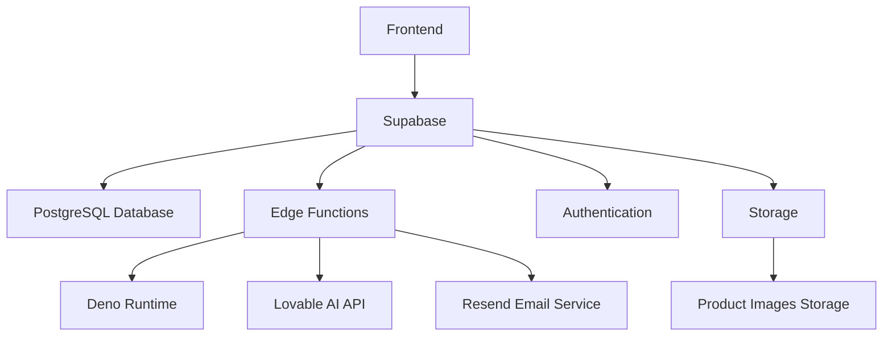

**Diagram sources**
- [package.json](file://package.json)
- [config.toml](file://supabase/config.toml)

## Supabase Architecture

The Supabase architecture for sleekapp-v100 is designed to provide a complete backend solution without the need for traditional server infrastructure. The architecture leverages Supabase's PostgreSQL database for data storage, Edge Functions for serverless computing, and Row Level Security for data access control. The system is organized into domains including AI processing, authentication, and business logic, with each domain implemented as a collection of Edge Functions. This architecture enables rapid development, automatic scaling, and reduced operational overhead compared to traditional backend frameworks.

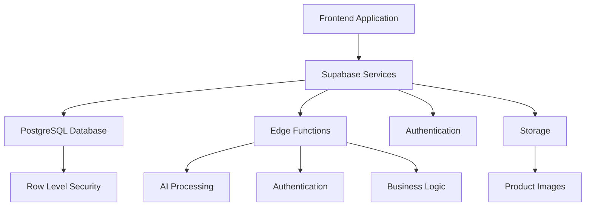

**Diagram sources**
- [client.ts](file://src/integrations/supabase/client.ts)
- [config.toml](file://supabase/config.toml)

## Database Schema Design

The database schema for sleekapp-v100 is designed to support a comprehensive B2B marketplace with product listings, supplier management, order processing, and AI-powered features. The schema includes tables for users, suppliers, products, orders, quotes, and various analytics and logging tables. Key design decisions include the use of UUIDs for primary keys, JSONB columns for flexible data storage, and generated columns for calculated values. The schema is optimized for performance with appropriate indexes and constraints, and it supports the application's complex business logic through well-defined relationships between entities.

```mermaid
erDiagram
USER {
uuid id PK
string email UK
string username UK
timestamp created_at
timestamp updated_at
boolean active
}
SUPPLIER {
uuid id PK
uuid user_id FK
string company_name
string contact_name
string email
string phone
string country
string[] specialties
string[] certifications
enum verification_status
decimal rating
integer total_orders
decimal on_time_delivery_rate
decimal quality_rating
timestamp created_at
timestamp updated_at
}
PRODUCT {
uuid id PK
uuid supplier_id FK
string product_type
string title
text description
string category
string subcategory
string slug UK
decimal base_price
decimal platform_fee_percentage
decimal platform_fee_amount
decimal final_price
integer available_quantity
integer moq
string unit
integer reserved_quantity
string[] images
string primary_image
string video_url
string[] sizes
string[] colors
string material
integer gsm
string fabric_composition
jsonb specifications
integer lead_time_days
string shipping_from
decimal shipping_weight_kg
enum status
string rejection_reason
text admin_feedback
integer quality_score
timestamp approval_date
uuid approved_by FK
integer views
integer inquiries
integer sales
decimal rating
string[] meta_keywords
text meta_description
boolean is_featured
timestamp featured_until
timestamp created_at
timestamp updated_at
timestamp published_at
}
ORDER {
uuid id PK
string order_number UK
uuid buyer_id FK
uuid supplier_id FK
uuid factory_id FK
uuid quote_id FK
string product_type
integer quantity
decimal buyer_price
decimal supplier_price
decimal admin_margin
decimal margin_percentage
enum status
enum payment_status
enum workflow_status
enum production_status
enum current_stage
jsonb stage_progress
jsonb milestone_tracker
timestamp target_date
timestamp expected_delivery_date
timestamp actual_delivery_date
decimal deposit_amount
decimal balance_amount
timestamp deposit_paid_at
timestamp balance_paid_at
uuid assigned_by FK
timestamp assigned_at
string tracking_token
boolean display_publicly
boolean is_demo_order
string anonymized_client_name
string stripe_customer_id
string stripe_payment_intent_id
text notes
text admin_notes
timestamp created_at
timestamp updated_at
}
AI_QUOTE {
uuid id PK
string session_id
string customer_email
string customer_name
string phone_number
string country
string product_type
integer quantity
string fabric_type
string complexity_level
text additional_requirements
jsonb quote_data
decimal total_price
integer estimated_delivery_days
text ai_suggestions
string status
enum lead_status
text lead_notes
string production_route
boolean specialty_sourcing_required
decimal bangladesh_cost
decimal specialty_cost
decimal admin_markup
jsonb alternative_options
uuid converted_to_order_id FK
timestamp created_at
}
USER ||--o{ SUPPLIER : "has"
SUPPLIER ||--o{ PRODUCT : "lists"
USER ||--o{ ORDER : "places"
PRODUCT ||--o{ ORDER : "fulfills"
USER ||--o{ AI_QUOTE : "requests"
```

**Diagram sources**
- [database.ts](file://src/types/database.ts)
- [create_marketplace_system.sql](file://supabase/migrations/20250122000000_create_marketplace_system.sql)

## Edge Functions Organization

The Edge Functions in sleekapp-v100 are organized by domain to ensure clear separation of concerns and maintainability. The main domains include AI processing, authentication, and business logic. Each function is designed to be stateless and idempotent, with proper error handling and logging. The functions are secured with appropriate JWT verification settings as defined in the config.toml file. This organization enables independent development and deployment of different system components while maintaining a consistent architecture across the codebase.

```mermaid
graph TD
A[Edge Functions] --> B[AI Processing]
A --> C[Authentication]
A --> D[Business Logic]
A --> E[Analytics]
A --> F[Email Services]
A --> G[Security]
B --> H[ai-quote-generator]
B --> I[ai-blog-assistant]
B --> J[ai-design-generator]
B --> K[ai-market-research]
B --> L[ai-supplier-assignment]
B --> M[predict-quality-risks]
C --> N[admin-check]
C --> O[bootstrap-admin]
C --> P[password-breach-check]
C --> Q[verify-otp]
C --> R[send-otp]
D --> S[convert-quote-to-order]
D --> T[create-payment-intent]
D --> U[generate-invoice]
D --> V[initialize-production-stages]
D --> W[submit-quote]
D --> X[track-product-interaction]
E --> Y[analytics-service]
E --> Z[conversation-analytics]
F --> AA[email-service]
F --> AB[send-resource-email]
F --> AC[submit-blog-comment]
G --> AD[log-security-event]
G --> AE[log-audit-action]
G --> AF[log-ai-cost]
```

**Diagram sources**
- [config.toml](file://supabase/config.toml)
- [functions directory](file://supabase/functions)

## Row Level Security Implementation

Row Level Security (RLS) is implemented throughout the sleekapp-v100 database to ensure that users can only access data they are authorized to see. The RLS policies are defined at the database level and enforced by PostgreSQL, providing a secure foundation for data access control. Policies are implemented for various tables including marketplace products, product inquiries, and user roles, with different access levels for buyers, suppliers, and administrators. This approach eliminates the need for application-level access control logic, reducing complexity and potential security vulnerabilities.

```mermaid
graph TD
A[Row Level Security] --> B[marketplace_products]
A --> C[product_inquiries]
A --> D[product_wishlist]
A --> E[user_roles]
A --> F[admin_audit_log]
B --> G[Anyone can view approved products]
B --> H[Suppliers can view their own products]
B --> I[Suppliers can create products]
B --> J[Suppliers can update their own products]
B --> K[Admins can view all products]
B --> L[Admins can update products]
C --> M[Buyers can create inquiries]
C --> N[Buyers can view their own inquiries]
C --> O[Suppliers can view inquiries for their products]
C --> P[Suppliers can respond to inquiries]
D --> Q[Users can manage their own wishlist]
E --> R[Users can view their own roles]
E --> S[Admins can view all roles]
F --> T[Admins can view audit logs]
```

**Diagram sources**
- [create_marketplace_system.sql](file://supabase/migrations/20250122000000_create_marketplace_system.sql)

## Migration Strategy

The migration strategy for sleekapp-v100 follows a structured approach using Supabase's migration system. Migrations are stored as SQL files in the supabase/migrations directory, with filenames prefixed with timestamps to ensure proper execution order. The strategy includes base migrations for initial schema setup, incremental migrations for schema changes, and seed files for initial data population. The setup-database.js script provides a convenient way to apply migrations and seed data during development and deployment, ensuring consistency across different environments.

```mermaid
graph TD
A[Migration Strategy] --> B[Base Migration]
A --> C[Incremental Migrations]
A --> D[Seed Data]
A --> E[Setup Script]
B --> F[BASE_MIGRATION_SAFE.sql]
B --> G[COMPLETE_SETUP.sql]
B --> H[TABLES_ONLY.sql]
C --> I[20250122000000_create_marketplace_system.sql]
C --> J[20250122010000_setup_product_images_storage.sql]
C --> K[20250123000000_relax_production_stages.sql]
D --> L[seed.sql]
D --> M[seed_FIXED.sql]
D --> N[seed_MINIMAL.sql]
D --> O[seed_READY_TO_RUN.sql]
D --> P[seed_SIMPLE.sql]
D --> Q[seed_ULTRA_MINIMAL.sql]
D --> R[seed_comprehensive_test_data.sql]
D --> S[seed_marketplace_products.sql]
E --> T[setup-database.js]
```

**Diagram sources**
- [migrations directory](file://supabase/migrations)
- [setup-database.js](file://scripts/setup-database.js)

## System Context Diagram

The system context diagram illustrates the interaction between the frontend, Supabase services, and third-party integrations in the sleekapp-v100 architecture. The frontend communicates with Supabase for all backend operations, including database access, authentication, and serverless functions. Supabase integrates with third-party services for AI processing, email delivery, and payment processing. This architecture provides a clear separation of concerns and enables independent scaling of different system components.

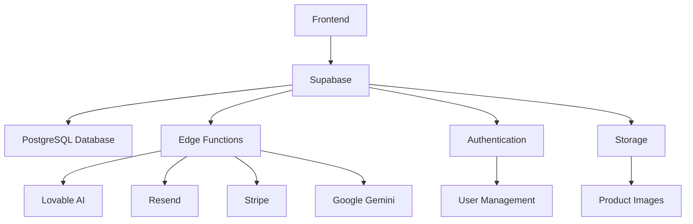

**Diagram sources**
- [client.ts](file://src/integrations/supabase/client.ts)
- [config.toml](file://supabase/config.toml)

## AI Processing Domain

The AI processing domain in sleekapp-v100 is implemented through a collection of Edge Functions that leverage external AI services to provide intelligent features. These functions include ai-quote-generator, ai-blog-assistant, ai-design-generator, ai-market-research, and ai-supplier-assignment. Each function is designed to handle specific AI-powered tasks, such as generating manufacturing quotes, creating blog content, designing products, conducting market research, and assigning suppliers to quotes. The AI functions are integrated with Lovable AI and Google Gemini services, providing advanced capabilities while maintaining a clean separation from the core application logic.

```mermaid
graph TD
A[AI Processing Domain] --> B[ai-quote-generator]
A --> C[ai-blog-assistant]
A --> D[ai-design-generator]
A --> E[ai-market-research]
A --> F[ai-supplier-assignment]
A --> G[predict-quality-risks]
B --> H[Input Validation]
B --> I[Rate Limiting]
B --> J[Configuration Fetch]
B --> K[Pricing Calculation]
B --> L[AI Analysis]
B --> M[Database Storage]
B --> N[Timeline Prediction]
C --> O[Content Generation]
C --> P[SEO Optimization]
C --> Q[Topic Research]
D --> R[Design Analysis]
D --> S[Pattern Recognition]
D --> T[Material Recommendation]
E --> U[Market Trends]
E --> V[Competitor Analysis]
E --> W[Price Benchmarking]
F --> X[Supplier Matching]
F --> Y[Capability Assessment]
F --> Z[Geographic Optimization]
G --> AA[Defect Prediction]
G --> AB[Quality Risk Assessment]
G --> AC[Process Optimization]
```

**Diagram sources**
- [ai-quote-generator/index.ts](file://supabase/functions/ai-quote-generator/index.ts)
- [ai-blog-assistant/index.ts](file://supabase/functions/ai-blog-assistant/index.ts)
- [ai-design-generator/index.ts](file://supabase/functions/ai-design-generator/index.ts)

## Authentication and Authorization

Authentication and authorization in sleekapp-v100 are implemented using Supabase Auth, which provides a secure and scalable solution for user management. The system supports various user roles including admin, buyer, supplier, and factory, with role-based access control enforced through the user_roles table. Authentication is handled through JWT tokens, with Edge Functions configured to verify JWTs as needed. Additional security features include email verification, OTP verification, and password breach checking to ensure account security.

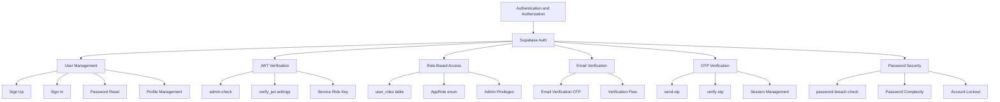

**Diagram sources**
- [admin-check/index.ts](file://supabase/functions/admin-check/index.ts)
- [database.ts](file://src/types/database.ts)
- [config.toml](file://supabase/config.toml)

## Business Logic Implementation

The business logic in sleekapp-v100 is implemented through a collection of Edge Functions that handle specific business processes. These functions include convert-quote-to-order, create-payment-intent, generate-invoice, initialize-production-stages, and submit-quote. Each function encapsulates a specific business process, ensuring that complex logic is contained and reusable. The functions are designed to be idempotent and stateless, with proper error handling and logging to ensure reliability and maintainability.

```mermaid
graph TD
A[Business Logic Implementation] --> B[convert-quote-to-order]
A --> C[create-payment-intent]
A --> D[generate-invoice]
A --> E[initialize-production-stages]
A --> F[submit-quote]
A --> G[track-product-interaction]
B --> H[Quote Validation]
B --> I[Order Creation]
B --> J[Payment Setup]
B --> K[Supplier Assignment]
B --> L[Notification]
C --> M[Order Validation]
C --> N[Stripe Integration]
C --> O[Payment Intent Creation]
C --> P[Status Update]
D --> Q[Invoice Generation]
D --> R[HTML Template]
D --> S[Storage]
D --> T[Email Delivery]
D --> U[Status Update]
E --> V[Stage Initialization]
E --> W[Timeline Calculation]
E --> X[Notification]
E --> Y[Status Update]
F --> Z[Quote Validation]
F --> AA[AI Analysis]
F --> AB[Database Storage]
F --> AC[Timeline Prediction]
F --> AD[Notification]
G --> AE[Interaction Tracking]
G --> AF[Analytics Update]
G --> AG[User Behavior Analysis]
```

**Diagram sources**
- [generate-invoice/index.ts](file://supabase/functions/generate-invoice/index.ts)
- [convert-quote-to-order/index.ts](file://supabase/functions/convert-quote-to-order/index.ts)
- [create-payment-intent/index.ts](file://supabase/functions/create-payment-intent/index.ts)

## Infrastructure Requirements

The infrastructure requirements for sleekapp-v100 are minimal due to the use of Supabase as a backend-as-a-service platform. The primary infrastructure components include the Supabase project, which provides PostgreSQL database, Edge Functions, authentication, and storage. Additional infrastructure includes third-party services for AI processing (Lovable AI, Google Gemini), email delivery (Resend), and payment processing (Stripe). The frontend is hosted on a static site hosting service such as Netlify or Vercel. This infrastructure setup reduces operational overhead and enables rapid scaling to meet demand.

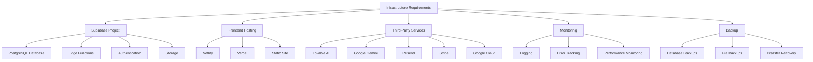

**Diagram sources**
- [config.toml](file://supabase/config.toml)
- [package.json](file://package.json)

## Scalability Considerations

The scalability of sleekapp-v100 is designed to handle increasing loads through the use of Supabase's scalable infrastructure. The PostgreSQL database can be scaled vertically and horizontally as needed, while Edge Functions automatically scale to handle incoming requests. The architecture is designed to be stateless, enabling horizontal scaling of components. Additional scalability considerations include database indexing, query optimization, and caching strategies to ensure optimal performance under load. The system is also designed to handle AI workloads efficiently, with rate limiting and cost monitoring to prevent excessive usage.

```mermaid
graph TD
A[Scalability Considerations] --> B[Database Scaling]
A --> C[Function Scaling]
A --> D[Performance Optimization]
A --> E[AI Workload Management]
A --> F[Monitoring]
B --> F1[Vertical Scaling]
B --> F2[Horizontal Scaling]
B --> F3[Indexing]
B --> F4[Query Optimization]
B --> F5[Connection Pooling]
C --> G1[Automatic Scaling]
C --> G2[Stateless Design]
C --> G3[Load Balancing]
C --> G4[Concurrency]
D --> H1[Caching]
D --> H2[CDN]
D --> H3[Compression]
D --> H4[Minification]
E --> I1[Rate Limiting]
E --> I2[Cost Monitoring]
E --> I3[Usage Tracking]
E --> I4[Quota Management]
F --> J1[Performance Monitoring]
F --> J2[Error Tracking]
F --> J3[Log Analysis]
F --> J4[Alerting]
```

**Diagram sources**
- [ai-quote-generator/index.ts](file://supabase/functions/ai-quote-generator/index.ts)
- [log-ai-cost/index.ts](file://supabase/functions/log-ai-cost/index.ts)

## Deployment Topology

The deployment topology for sleekapp-v100 follows a modern cloud-native architecture with separate environments for development, staging, and production. The frontend is deployed to a static site hosting service such as Netlify or Vercel, while the backend is deployed to Supabase. Each environment has its own Supabase project with isolated databases and configurations. The deployment process is automated through CI/CD pipelines, ensuring consistent and reliable deployments. This topology enables safe testing of changes before they reach production, with rollback capabilities in case of issues.

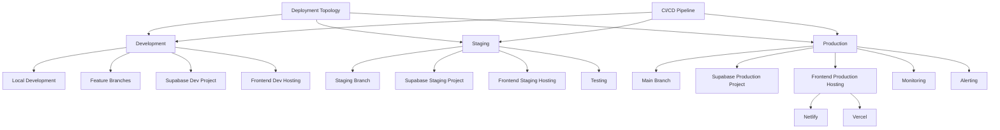

**Diagram sources**
- [vercel.json](file://vercel.json)
- [netlify.toml](file://netlify.toml)

## Security Implementation

Security in sleekapp-v100 is implemented through multiple layers of protection, starting with Supabase's built-in security features and extending to application-level controls. Key security measures include Row Level Security for database access control, JWT verification for API authentication, rate limiting to prevent abuse, and input validation to prevent injection attacks. Additional security features include email verification, OTP verification, and password breach checking. The system also includes comprehensive logging and monitoring to detect and respond to security incidents.

```mermaid
graph TD
A[Security Implementation] --> B[Authentication]
A --> C[Authorization]
A --> D[Data Protection]
A --> E[Input Validation]
A --> F[Rate Limiting]
A --> G[Logging]
A --> H[Monitoring]
B --> F1[Supabase Auth]
B --> F2[JWT Tokens]
B --> F3[Email Verification]
B --> F4[OTP Verification]
B --> F5[Password Security]
C --> G1[Row Level Security]
C --> G2[Role-Based Access]
C --> G3[Admin Privileges]
G3 --> G4[admin-check]
G3 --> G5[bootstrap-admin]
D --> H1[Data Encryption]
D --> H2[Secure Storage]
D --> H3[PII Sanitization]
H3 --> H4[logger.ts]
E --> I1[Input Validation]
E --> I2[Sanitization]
E --> I3[Schema Validation]
I3 --> I4[zod]
F --> J1[Rate Limiting]
F --> J2[IP Tracking]
F --> J3[Session Tracking]
J3 --> J4[ai-quote-generator]
G --> K1[Structured Logging]
G --> K2[Security Events]
K2 --> K3[securityLogger.ts]
K2 --> K4[log-security-event]
H --> L1[Error Monitoring]
H --> L2[Performance Monitoring]
H --> L3[Alerting]
```

**Diagram sources**
- [securityLogger.ts](file://supabase/functions/shared/securityLogger.ts)
- [logger.ts](file://supabase/functions/_shared/logger.ts)
- [admin-check/index.ts](file://supabase/functions/admin-check/index.ts)

## Monitoring and Logging

Monitoring and logging in sleekapp-v100 are implemented through a combination of Supabase's built-in monitoring tools and custom logging solutions. The system includes structured logging with PII sanitization to ensure sensitive data is not exposed in logs. Key monitoring features include performance monitoring, error tracking, and security event logging. The logging system is designed to provide detailed insights into system behavior while maintaining security and privacy. Logs are used for debugging, performance optimization, and security analysis.

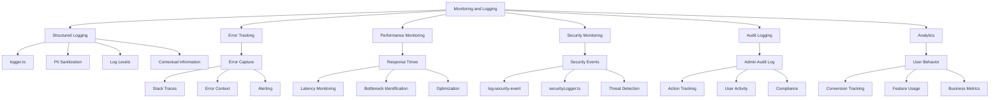

**Diagram sources**
- [logger.ts](file://supabase/functions/_shared/logger.ts)
- [securityLogger.ts](file://supabase/functions/shared/securityLogger.ts)
- [database.ts](file://src/types/database.ts)

## Disaster Recovery

Disaster recovery for sleekapp-v100 is implemented through Supabase's built-in backup and recovery features, combined with external backup strategies. The system includes automated database backups, with point-in-time recovery capabilities. Additional disaster recovery measures include regular data exports, redundant storage, and documented recovery procedures. The deployment topology with separate environments enables safe testing of recovery procedures, and the use of version control ensures that code can be restored to a known good state if needed.

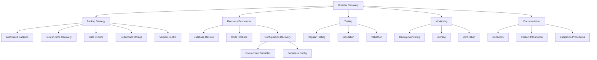

**Diagram sources**
- [supabase directory](file://supabase)
- [scripts directory](file://scripts)

## Third-Party Dependencies

The third-party dependencies for sleekapp-v100 include Supabase for backend services, Lovable AI for AI processing, Google Gemini for advanced AI capabilities, Resend for email delivery, and Stripe for payment processing. These dependencies are selected for their reliability, scalability, and feature completeness. The system is designed to be resilient to failures in third-party services through appropriate error handling and fallback mechanisms. Version compatibility is carefully managed to ensure stability and security.

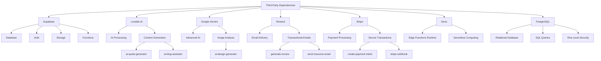

**Diagram sources**
- [package.json](file://package.json)
- [config.toml](file://supabase/config.toml)

## Version Compatibility

Version compatibility in sleekapp-v100 is managed through careful dependency management and testing. The system uses specific versions of key dependencies to ensure stability and security. The package.json file specifies exact versions for production dependencies, while allowing flexibility for development dependencies. The Edge Functions use specific versions of Deno and Supabase libraries to ensure compatibility. Regular updates are performed to keep dependencies current while maintaining system stability.

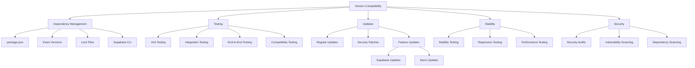

**Diagram sources**
- [package.json](file://package.json)
- [package-lock.json](file://package-lock.json)

## Conclusion

The backend architecture of sleekapp-v100 demonstrates a modern approach to application development using Supabase as a backend-as-a-service platform. By leveraging Supabase's PostgreSQL database, Edge Functions, and Row Level Security, the system achieves a high degree of scalability, security, and maintainability without the need for traditional backend frameworks. The architecture is designed to handle AI workloads efficiently, with a clear organization of Edge Functions by domain and comprehensive security measures. The use of third-party services for specialized functionality enables rapid development and innovation while maintaining a clean separation of concerns. This architecture provides a solid foundation for the continued growth and evolution of the sleekapp-v100 platform.