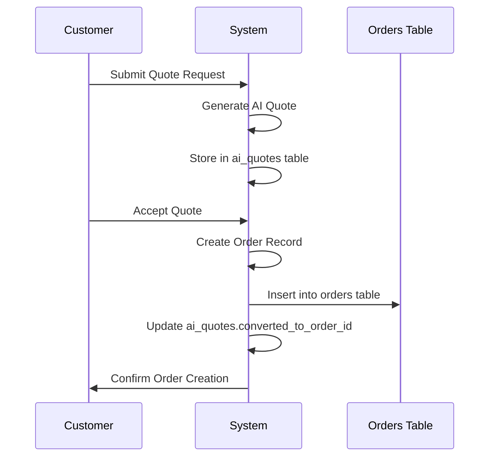

# AI Quotes Table

<cite>
**Referenced Files in This Document**  
- [COMPLETE_SETUP.sql](file://supabase/COMPLETE_SETUP.sql)
- [add_supplier_to_quotes.sql](file://supabase/migrations/add_supplier_to_quotes.sql)
- [ai-quote-generator/index.ts](file://supabase/functions/ai-quote-generator/index.ts)
- [submit-quote/index.ts](file://supabase/functions/submit-quote/index.ts)
- [convert-quote-to-order/index.ts](file://supabase/functions/convert-quote-to-order/index.ts)
- [AIQuoteGenerator.tsx](file://src/components/AIQuoteGenerator.tsx)
- [QuoteDetails.tsx](file://src/pages/QuoteDetails.tsx)
- [useQuotes.ts](file://src/hooks/useQuotes.ts)
- [database.ts](file://src/types/database.ts)
</cite>

## Table of Contents
1. [Introduction](#introduction)
2. [Table Structure](#table-structure)
3. [Field Definitions](#field-definitions)
4. [quote_data JSONB Structure](#quote_data-jsonb-structure)
5. [Relationship with Orders Table](#relationship-with-orders-table)
6. [Sales Tracking Fields](#sales-tracking-fields)
7. [Row Level Security Policies](#row-level-security-policies)
8. [AI Population Logic](#ai-population-logic)
9. [Indexing Strategy](#indexing-strategy)
10. [Example Payloads](#example-payloads)
11. [Conclusion](#conclusion)

## Introduction

The `ai_quotes` table serves as the central data store for AI-generated apparel manufacturing quotes within the sleekapp-v100 system. This table captures comprehensive information about customer inquiries, product specifications, and AI-calculated pricing data. It functions as a lead generation and qualification system, bridging customer requests with production capabilities through intelligent automation. The table supports the end-to-end quote lifecycle from initial submission to conversion into formal orders.

**Section sources**
- [COMPLETE_SETUP.sql](file://supabase/COMPLETE_SETUP.sql#L1-L50)

## Table Structure

The `ai_quotes` table is designed with a comprehensive schema to capture all relevant information for apparel manufacturing quotes. It combines structured fields for queryable attributes with a flexible JSONB column for complex pricing data. The table includes timestamps for audit purposes, foreign key relationships for order conversion, and specialized fields for sales team tracking.

```mermaid
erDiagram
ai_quotes {
uuid id PK
timestamp created_at
string customer_email
string customer_name
string product_type
integer quantity
string complexity_level
string fabric_type
text additional_requirements
jsonb quote_data
uuid converted_to_order_id FK
string lead_status
text lead_notes
}
orders {
uuid id PK
timestamp created_at
uuid quote_id FK
-- other order fields
}
ai_quotes ||--o{ orders : "converted_to"
```

**Diagram sources**
- [COMPLETE_SETUP.sql](file://supabase/COMPLETE_SETUP.sql#L150-L250)
- [add_supplier_to_quotes.sql](file://supabase/migrations/add_supplier_to_quotes.sql#L1-L20)

## Field Definitions

The `ai_quotes` table contains the following fields:

- **id**: Unique identifier for each quote (UUID, primary key)
- **created_at**: Timestamp of quote creation (TIMESTAMP WITH TIME ZONE)
- **customer_email**: Email address of the requesting customer (TEXT)
- **customer_name**: Full name of the customer (TEXT)
- **product_type**: Type of apparel product requested (TEXT)
- **quantity**: Number of units requested (INTEGER)
- **complexity_level**: Manufacturing complexity level (TEXT: 'low', 'medium', 'high')
- **fabric_type**: Primary fabric material requested (TEXT)
- **additional_requirements**: Free-text field for special customer requirements (TEXT)
- **quote_data**: JSONB object containing detailed pricing breakdown (JSONB)
- **converted_to_order_id**: Foreign key to orders table when quote is converted (UUID)
- **lead_status**: Current status of the sales lead (TEXT)
- **lead_notes**: Internal notes for the sales team (TEXT)

**Section sources**
- [COMPLETE_SETUP.sql](file://supabase/COMPLETE_SETUP.sql#L150-L250)

## quote_data JSONB Structure

The `quote_data` JSONB column contains a structured breakdown of the AI-generated quote with the following nested structure:

```json
{
  "pricing_breakdown": {
    "total_price": 1250.00,
    "price_per_unit": 12.50,
    "currency": "USD",
    "valid_until": "2025-12-31T23:59:59Z"
  },
  "cost_components": {
    "material_costs": {
      "fabric": 450.00,
      "trimmings": 120.00,
      "packaging": 30.00,
      "total_material_cost": 600.00
    },
    "labor_costs": {
      "cutting": 150.00,
      "sewing": 300.00,
      "finishing": 100.00,
      "quality_control": 50.00,
      "total_labor_cost": 600.00
    },
    "overhead_costs": {
      "production_management": 30.00,
      "quality_assurance": 20.00,
      "logistics_coordination": 25.00,
      "total_overhead_cost": 75.00
    }
  },
  "delivery_estimates": {
    "production_days": 14,
    "production_start_date": null,
    "production_end_date": null,
    "shipping_method": "sea",
    "shipping_days": 21,
    "total_lead_time": 35,
    "earliest_delivery_date": null
  },
  "profitability_analysis": {
    "gross_margin": 0.28,
    "markup_percentage": 1.4,
    "break_even_quantity": 800
  },
  "assumptions": [
    "Standard operating procedures apply",
    "No rush order fees included",
    "FOB factory pricing"
  ],
  "ai_confidence_score": 0.92
}
```

This structure enables flexible pricing calculations while maintaining consistency across quotes. The AI system populates these values based on historical production data, current material costs, and machine learning models trained on past quote-to-order conversions.

**Section sources**
- [ai-quote-generator/index.ts](file://supabase/functions/ai-quote-generator/index.ts#L100-L300)
- [COMPLETE_SETUP.sql](file://supabase/COMPLETE_SETUP.sql#L200-L210)

## Relationship with Orders Table

The `ai_quotes` table maintains a one-to-one relationship with the `orders` table through the `converted_to_order_id` foreign key. When a sales representative or customer converts a quote into a formal order, this field is populated with the corresponding order ID. This relationship enables:

- Traceability from initial inquiry to final order
- Analysis of quote-to-order conversion rates
- Preservation of the original quote terms for reference
- Customer history tracking across quote and order stages

The relationship is enforced with a foreign key constraint that references the `id` field in the `orders` table. This design supports the business process where quotes serve as preliminary agreements that may be revised before formal order placement.



**Diagram sources**
- [convert-quote-to-order/index.ts](file://supabase/functions/convert-quote-to-order/index.ts#L1-L50)
- [COMPLETE_SETUP.sql](file://supabase/COMPLETE_SETUP.sql#L220-L230)

## Sales Tracking Fields

The `lead_status` and `lead_notes` fields provide essential functionality for sales team operations:

- **lead_status**: Tracks the current stage of the sales process with predefined values:
  - `new`: Recently created quote, not yet reviewed
  - `contacted`: Sales team has reached out to the customer
  - `qualified`: Customer requirements confirmed, viable opportunity
  - `proposal_sent`: Revised quote or additional information sent
  - `negotiation`: Actively discussing terms with customer
  - `won`: Customer accepted, converted to order
  - `lost`: Opportunity closed without conversion
  - `follow_up`: Requires additional information from customer

- **lead_notes**: Free-text field for sales representatives to record:
  - Customer communication history
  - Specific requirements or concerns
  - Pricing negotiation details
  - Internal team recommendations
  - Next steps and follow-up actions

These fields enable effective sales pipeline management and ensure continuity when multiple team members interact with the same customer.

**Section sources**
- [COMPLETE_SETUP.sql](file://supabase/COMPLETE_SETUP.sql#L240-L250)
- [QuoteDetails.tsx](file://src/pages/QuoteDetails.tsx#L150-L200)

## Row Level Security Policies

The `ai_quotes` table implements Row Level Security (RLS) policies to ensure data privacy and appropriate access control:

- **Admin users**: Full access to all quotes regardless of origin
- **Sales users**: Access to all quotes for sales tracking and management
- **Production users**: Read-only access to quotes for capacity planning
- **Customers**: Access only to their own quotes based on email matching
- **Suppliers**: Access only to quotes assigned to them through supplier relationships

The RLS policies are implemented using Supabase's policy system, with checks based on user roles and authentication context. Customer access is particularly important as it allows clients to view their quote history while maintaining confidentiality between different customers.

```sql
-- Example RLS policy for customer access
CREATE POLICY "Customers can view own quotes"
  ON ai_quotes FOR SELECT
  USING (
    auth.role() = 'authenticated' 
    AND auth.jwt() ->> 'email' = customer_email
  );
```

**Section sources**
- [COMPLETE_SETUP.sql](file://supabase/COMPLETE_SETUP.sql#L300-L350)
- [ai-quote-generator/index.ts](file://supabase/functions/ai-quote-generator/index.ts#L50-L80)

## AI Population Logic

The AI system populates the `ai_quotes` table through a multi-step process orchestrated by the `ai-quote-generator` function:

1. **Input Analysis**: The system parses customer inputs including product type, quantity, complexity level, and fabric type
2. **Data Retrieval**: Historical production data, current material costs, and supplier capacity information are retrieved
3. **Cost Calculation**: Machine learning models estimate material and labor costs based on similar past productions
4. **Pricing Strategy**: The system applies dynamic pricing rules considering customer value, order volume, and market conditions
5. **Risk Assessment**: AI evaluates production risks and adjusts pricing accordingly
6. **Quote Generation**: All data is compiled into the structured JSONB format and stored in the database

The AI model is trained on historical quote and order data, continuously improving its accuracy in predicting viable pricing that balances competitiveness with profitability. The system also considers external factors such as seasonal demand fluctuations and raw material price trends.

**Section sources**
- [ai-quote-generator/index.ts](file://supabase/functions/ai-quote-generator/index.ts#L1-L300)
- [parse-quote-description/index.ts](file://supabase/functions/parse-quote-description/index.ts#L1-L100)

## Indexing Strategy

The `ai_quotes` table employs strategic indexing to optimize query performance:

- **Index on customer_email**: Enables fast lookups for customer-specific quote retrieval
- **Index on created_at**: Supports time-based queries and reporting
- **Composite index on (lead_status, created_at)**: Optimizes sales pipeline reporting
- **Index on converted_to_order_id**: Facilitates join operations with the orders table

These indexes are crucial for maintaining performance as the quote database grows. The customer_email index ensures responsive user experiences when customers access their quote history, while the created_at index supports business intelligence reporting and analytics. The composite index on lead status and creation time enables efficient sales funnel analysis.

**Section sources**
- [COMPLETE_SETUP.sql](file://supabase/COMPLETE_SETUP.sql#L260-L290)

## Example Payloads

### Standard T-Shirt Quote
```json
{
  "pricing_breakdown": {
    "total_price": 2500.00,
    "price_per_unit": 2.50,
    "currency": "USD",
    "valid_until": "2025-12-31T23:59:59Z"
  },
  "cost_components": {
    "material_costs": {
      "fabric": 1000.00,
      "trimmings": 200.00,
      "packaging": 50.00,
      "total_material_cost": 1250.00
    },
    "labor_costs": {
      "cutting": 300.00,
      "sewing": 600.00,
      "finishing": 200.00,
      "quality_control": 100.00,
      "total_labor_cost": 1200.00
    },
    "overhead_costs": {
      "production_management": 25.00,
      "quality_assurance": 15.00,
      "logistics_coordination": 10.00,
      "total_overhead_cost": 50.00
    }
  },
  "delivery_estimates": {
    "production_days": 10,
    "shipping_method": "sea",
    "shipping_days": 18,
    "total_lead_time": 28
  }
}
```

### Complex Activewear Quote
```json
{
  "pricing_breakdown": {
    "total_price": 8400.00,
    "price_per_unit": 14.00,
    "currency": "USD",
    "valid_until": "2025-12-31T23:59:59Z"
  },
  "cost_components": {
    "material_costs": {
      "fabric": 3200.00,
      "trimmings": 800.00,
      "packaging": 200.00,
      "total_material_cost": 4200.00
    },
    "labor_costs": {
      "cutting": 1000.00,
      "sewing": 2000.00,
      "finishing": 800.00,
      "quality_control": 200.00,
      "total_labor_cost": 4000.00
    },
    "overhead_costs": {
      "production_management": 100.00,
      "quality_assurance": 75.00,
      "logistics_coordination": 25.00,
      "total_overhead_cost": 200.00
    }
  },
  "delivery_estimates": {
    "production_days": 21,
    "shipping_method": "air",
    "shipping_days": 7,
    "total_lead_time": 28
  },
  "ai_confidence_score": 0.85,
  "assumptions": [
    "Moisture-wicking fabric requires specialized handling",
    "Reflective trims increase labor time by 15%"
  ]
}
```

**Section sources**
- [ai-quote-generator/index.ts](file://supabase/functions/ai-quote-generator/index.ts#L200-L250)

## Conclusion

The `ai_quotes` table represents a sophisticated integration of database design and artificial intelligence to streamline the apparel manufacturing quotation process. By combining structured data fields with flexible JSONB storage, the table effectively captures both standardized information and complex pricing calculations. The integration with the orders system, comprehensive sales tracking capabilities, and robust security policies make this table a cornerstone of the sleekapp-v100 platform. The AI-driven population of quote data enables rapid response times while maintaining pricing accuracy and profitability targets.