# Database Schema Design

<cite>
**Referenced Files in This Document**   
- [COMPLETE_SETUP.sql](file://supabase/COMPLETE_SETUP.sql)
- [BASE_MIGRATION_SAFE.sql](file://supabase/BASE_MIGRATION_SAFE.sql)
- [20250122000000_create_marketplace_system.sql](file://supabase/migrations/20250122000000_create_marketplace_system.sql)
</cite>

## Table of Contents
1. [Introduction](#introduction)
2. [Core Tables](#core-tables)
3. [Entity Relationships](#entity-relationships)
4. [Row Level Security Policies](#row-level-security-policies)
5. [Data Validation and Business Logic](#data-validation-and-business-logic)
6. [Performance Considerations](#performance-considerations)
7. [Data Lifecycle Management](#data-lifecycle-management)
8. [Schema Diagram](#schema-diagram)

## Introduction
This document provides comprehensive documentation for the PostgreSQL database schema used in the sleekapp-v100 application. The schema is designed to support a B2B apparel manufacturing platform that connects buyers with suppliers through an AI-powered quoting system, production tracking, and marketplace functionality. The database is built on Supabase and leverages PostgreSQL features including Row Level Security (RLS), triggers, functions, and advanced data types to enforce business rules and data integrity.

The core of the system revolves around the order fulfillment process, from initial quote requests through production stages to final delivery. The schema supports multiple user roles including buyers, suppliers, and administrators, with appropriate access controls and workflows for each role. Key features include AI-generated quotes, production stage tracking, supplier performance monitoring, and a marketplace for ready-to-ship products.

This documentation details the core tables, their relationships, constraints, and security policies that govern data access across different user roles.

## Core Tables

### production_stages
The `production_stages` table tracks the progress of supplier orders through various manufacturing stages. Each record represents a specific stage in the production process for a supplier order, with completion percentages, status updates, and timestamps.

**Key Attributes:**
- `id`: UUID primary key
- `supplier_order_id`: Foreign key to supplier_orders table
- `stage_number`: Integer indicating the sequence of the stage
- `stage_name`: Text name of the production stage
- `completion_percentage`: Integer (0-100) representing progress
- `status`: Text status (default 'pending')
- `started_at`: Timestamp when stage work began
- `completed_at`: Timestamp when stage was completed
- `updated_at`: Timestamp automatically updated on modifications

The table uses a custom enum type `production_stage` which includes values like 'yarn_received', 'knitting', 'linking', 'washing_finishing', 'final_qc', 'packing', and 'ready_to_ship'. Triggers automatically update the `started_at` timestamp when completion percentage moves from 0 to a positive value, and set `completed_at` when completion reaches 100%.

**Section sources**
- [COMPLETE_SETUP.sql](file://supabase/COMPLETE_SETUP.sql#L1415-L1431)

### supplier_orders
The `supplier_orders` table manages orders assigned to suppliers for fulfillment. It contains pricing information, order details, and status tracking for supplier-managed production.

**Key Attributes:**
- `id`: UUID primary key
- `order_number`: Unique text identifier
- `supplier_id`: Foreign key to suppliers table
- `buyer_order_id`: Foreign key to orders table
- `product_type`: Text describing the product
- `quantity`: Integer quantity ordered
- `buyer_price`: Numeric price charged to buyer
- `supplier_price`: Numeric price paid to supplier
- `margin`: Computed column (buyer_price - supplier_price)
- `target_date`: Date by which production should be completed
- `status`: Text status (default 'pending')
- `tech_pack_urls`: Text array of technical specification documents
- `reference_images`: Text array of reference images
- `special_instructions`: Text for any special requirements

The table includes a generated column `margin` that automatically calculates the difference between buyer and supplier prices. Status is constrained to values like 'pending', 'accepted', 'rejected', and 'counter_offered'. The table is linked to production tracking through the `production_stages` table.

**Section sources**
- [COMPLETE_SETUP.sql](file://supabase/COMPLETE_SETUP.sql#L1749-L1774)

### ai_quotes
The `ai_quotes` table stores AI-generated quotes created through the conversational AI interface. These quotes capture product requirements, pricing estimates, and customer information for potential orders.

**Key Attributes:**
- `id`: UUID primary key
- `created_at`: Timestamp with time zone (default now)
- `customer_email`: Text email of the customer
- `customer_name`: Text name of the customer
- `product_type`: Text type of product quoted
- `quantity`: Integer quantity requested
- `complexity_level`: Text describing product complexity
- `fabric_type`: Text describing fabric requirements
- `additional_requirements`: Text for any additional specifications
- `quote_data`: JSONB containing detailed quote information
- `total_price`: Numeric total price estimate
- `estimated_delivery_days`: Integer estimated delivery time
- `ai_suggestions`: Text containing AI-generated recommendations
- `alternative_options`: JSONB containing alternative product options
- `status`: Text status (default 'draft')
- `converted_to_order_id`: Foreign key to orders table if quote becomes order
- `session_id`: Text identifier for the user session
- `lead_status`: Text status of the sales lead
- `production_route`: Text indicating production path

The table includes constraints to validate `lead_status` (values: 'new', 'contacted', 'hot', 'warm', 'cold', 'lost') and `production_route` ('bangladesh_only', 'hybrid', 'specialty_only'). Indexes optimize queries by lead status, session, and specialty sourcing requirements.

**Section sources**
- [COMPLETE_SETUP.sql](file://supabase/COMPLETE_SETUP.sql#L790-L819)

### users
The `users` table is managed by Supabase Auth and stores user authentication and basic profile information. While not explicitly defined in the migration files, it is referenced throughout the schema as `auth.users`.

**Key Relationships:**
- Referenced by `profiles.id` (one-to-one relationship)
- Referenced by `suppliers.user_id` (one-to-one relationship)
- Referenced by various tables for audit trails (created_by, updated_by)

The table handles authentication, session management, and identity verification. User roles are managed separately in the `user_roles` table to support multiple roles per user.

### suppliers
The `suppliers` table contains detailed information about manufacturing partners in the network. Each supplier is associated with a user account and contains business and production capabilities.

**Key Attributes:**
- `id`: UUID primary key
- `user_id`: Foreign key to auth.users table
- `company_name`: Text legal name of the company
- `factory_location`: Text location of the factory
- `address`: Text full address
- `workforce_size`: Integer number of employees
- `moq_minimum`: Integer minimum order quantity
- `lead_time_days`: Integer typical lead time in days
- `verification_status`: Enum ('pending', 'verified', 'rejected', 'suspended')
- `tier`: Enum ('bronze', 'silver', 'gold')
- `about`: Text description of the supplier
- `specializations`: Text array of product specializations
- `website_url`: Text company website
- `contact_person`: Text primary contact name
- `contact_phone`: Text contact phone number
- `contact_email`: Text contact email
- `performance_score`: Numeric rating based on delivery and quality
- `total_orders_completed`: Integer count of completed orders
- `on_time_delivery_rate`: Numeric percentage of on-time deliveries

The table includes performance metrics that are automatically updated based on order completion data. Suppliers can be verified by administrators, and their tier reflects their capabilities and performance.

**Section sources**
- [COMPLETE_SETUP.sql](file://supabase/COMPLETE_SETUP.sql#L1848-L1878)

### products
The `products` table manages the catalog of products offered through the platform, including both standard products and AI-generated product concepts.

**Key Attributes:**
- `id`: UUID primary key
- `title`: Text product title
- `category`: Text product category
- `gauge`: Text knitting gauge specification
- `yarn`: Text yarn specification
- `colors`: Text array of available colors
- `image_url`: Text URL to product image
- `description`: Text detailed description
- `featured`: Boolean indicating if product is featured
- `ai_generated_image`: Boolean indicating if image was AI-generated
- `image_generation_prompt`: Text prompt used for AI image generation
- `image_approved_by_admin`: Boolean indicating if AI image was approved

The table supports both traditional product listings and AI-generated product concepts, with metadata tracking the AI generation process and approval status.

**Section sources**
- [COMPLETE_SETUP.sql](file://supabase/COMPLETE_SETUP.sql#L1438-L1454)

## Entity Relationships

```mermaid
erDiagram
users ||--o{ profiles : ""
users ||--o{ suppliers : ""
users ||--o{ user_roles : ""
users ||--o{ notifications : ""
users ||--o{ conversation_context : ""
suppliers ||--o{ supplier_capabilities : ""
suppliers ||--o{ supplier_certifications : ""
suppliers ||--o{ supplier_media : ""
suppliers ||--o{ supplier_mou_terms : ""
suppliers ||--o{ factory_capacity : ""
suppliers ||--o{ supplier_orders : ""
suppliers ||--o{ supplier_performance : ""
suppliers ||--o{ production_batches : ""
supplier_orders ||--o{ production_stages : ""
supplier_orders ||--o{ supplier_messages : ""
supplier_orders ||--o{ supplier_quotes : ""
orders ||--o{ order_updates : ""
orders ||--o{ order_messages : ""
orders ||--o{ order_documents : ""
orders ||--o{ shipping_info : ""
orders ||--o{ qc_checks : ""
orders ||--o{ invoices : ""
orders ||--o{ sample_requests : ""
ai_quotes ||--o{ timeline_predictions : ""
quotes ||--o{ supplier_quotes : ""
quotes ||--o{ timeline_predictions : ""
conversation_context ||--o{ conversation_messages : ""
user_roles }|--|| app_role : ""
orders }o--|| buyers : "buyer_id → users.id"
orders }o--|| suppliers : "supplier_id → suppliers.id"
orders }o--|| factory : "factory_id → users.id"
orders }o--|| quotes : "quote_id → quotes.id"
supplier_orders }o--|| orders : "buyer_order_id → orders.id"
supplier_orders }o--|| suppliers : "supplier_id → suppliers.id"
production_stages }o--|| production_stage : "stage_name → production_stage"
ai_quotes }o--|| orders : "converted_to_order_id → orders.id"
profiles }|--|| users : "id → users.id"
supplier_performance }o--|| supplier_orders : "supplier_order_id → supplier_orders.id"
qc_checks }o--|| production_stage : "stage → production_stage"
timeline_predictions }o--|| ai_quotes : "quote_id → ai_quotes.id"
timeline_predictions }o--|| orders : "order_id → orders.id"
class users {
id UUID
email TEXT
raw_user_meta_data JSONB
}
class profiles {
id UUID
full_name TEXT
company_name TEXT
phone TEXT
address TEXT
bio TEXT
role TEXT
}
class suppliers {
id UUID
user_id UUID
company_name TEXT
factory_location TEXT
verification_status verification_status
tier supplier_tier
performance_score NUMERIC
total_orders_completed INTEGER
on_time_delivery_rate NUMERIC
}
class supplier_capabilities {
id UUID
supplier_id UUID
product_category TEXT
materials TEXT[]
techniques TEXT[]
}
class supplier_certifications {
id UUID
supplier_id UUID
certification_name TEXT
certification_body TEXT
issue_date DATE
expiry_date DATE
document_url TEXT
verified BOOLEAN
}
class supplier_media {
id UUID
supplier_id UUID
media_type TEXT
url TEXT
caption TEXT
}
class supplier_mou_terms {
id UUID
supplier_id UUID
tier TEXT
moq_per_batch INTEGER
base_price NUMERIC
lead_time_days INTEGER
status TEXT
}
class factory_capacity {
id UUID
supplier_id UUID
date DATE
total_capacity INTEGER
current_utilization INTEGER
available_capacity INTEGER
updated_at TIMESTAMPTZ
}
class supplier_orders {
id UUID
order_number TEXT
supplier_id UUID
buyer_order_id UUID
product_type TEXT
quantity INTEGER
buyer_price NUMERIC
supplier_price NUMERIC
margin NUMERIC
target_date DATE
status TEXT
acceptance_status TEXT
}
class production_stages {
id UUID
supplier_order_id UUID
stage_number INTEGER
stage_name TEXT
completion_percentage INTEGER
status TEXT
started_at TIMESTAMPTZ
completed_at TIMESTAMPTZ
updated_at TIMESTAMPTZ
}
class orders {
id UUID
order_number TEXT
buyer_id UUID
supplier_id UUID
product_type TEXT
quantity INTEGER
workflow_status order_workflow_status
current_stage production_stage
supplier_id UUID
quote_id UUID
expected_delivery_date DATE
actual_delivery_date DATE
buyer_price NUMERIC
supplier_price NUMERIC
}
class order_updates {
id UUID
order_id UUID
stage production_stage
message TEXT
photos TEXT[]
completion_percentage INTEGER
created_at TIMESTAMPTZ
}
class order_messages {
id UUID
order_id UUID
sender_id UUID
sender_role TEXT
message TEXT
attachments TEXT[]
created_at TIMESTAMPTZ
}
class order_documents {
id UUID
order_id UUID
file_name TEXT
file_url TEXT
uploaded_by UUID
created_at TIMESTAMPTZ
}
class shipping_info {
id UUID
order_id UUID
tracking_number TEXT
carrier TEXT
status TEXT
shipped_date TIMESTAMPTZ
estimated_delivery DATE
actual_delivery DATE
}
class qc_checks {
id UUID
order_id UUID
inspector_id UUID
stage production_stage
total_pieces_checked INTEGER
passed_pieces INTEGER
failed_pieces INTEGER
notes TEXT
photos TEXT[]
check_date TIMESTAMPTZ
}
class defects {
id UUID
qc_check_id UUID
defect_type TEXT
severity TEXT
quantity INTEGER
description TEXT
photo_url TEXT
}
class invoices {
id UUID
order_id UUID
invoice_number TEXT
amount NUMERIC
status TEXT
due_date DATE
paid_at TIMESTAMPTZ
pdf_url TEXT
}
class sample_requests {
id UUID
order_id UUID
requested_by UUID
approved_at TIMESTAMPTZ
rejected_at TIMESTAMPTZ
sample_type TEXT
status TEXT
}
class ai_quotes {
id UUID
created_at TIMESTAMPTZ
customer_email TEXT
customer_name TEXT
product_type TEXT
quantity INTEGER
complexity_level TEXT
fabric_type TEXT
additional_requirements TEXT
quote_data JSONB
total_price NUMERIC
estimated_delivery_days INTEGER
ai_suggestions TEXT
alternative_options JSONB
status TEXT
converted_to_order_id UUID
lead_status TEXT
production_route TEXT
}
class quotes {
id UUID
buyer_id UUID
product_type TEXT
quantity INTEGER
complexity_level TEXT
fabric_type TEXT
customization_details TEXT
status TEXT
ai_estimation JSONB
customer_name TEXT
customer_email TEXT
}
class timeline_predictions {
id UUID
quote_id UUID
order_id UUID
stages JSONB
total_days INTEGER
estimated_completion_date DATE
confidence_score NUMERIC
}
class conversation_context {
id UUID
session_id TEXT
user_id UUID
email TEXT
intent TEXT
status TEXT
stage TEXT
lead_score INTEGER
}
class conversation_messages {
id UUID
conversation_id UUID
role TEXT
content TEXT
audio_url TEXT
created_at TIMESTAMPTZ
}
class user_roles {
id UUID
user_id UUID
role app_role
}
class app_role {
retailer
wholesaler
educational
corporate
sports_team
factory
admin
supplier
}
class production_stage {
yarn_received
knitting
linking
washing_finishing
final_qc
packing
ready_to_ship
}
class order_workflow_status {
quote_requested
quote_sent
admin_review
awaiting_payment
payment_received
assigned_to_supplier
sample_requested
sample_submitted
sample_approved
bulk_production
qc_inspection
ready_to_ship
shipped
delivered
completed
cancelled
on_hold
}
class verification_status {
pending
verified
rejected
suspended
}
class supplier_tier {
bronze
silver
gold
}
```

**Diagram sources**
- [COMPLETE_SETUP.sql](file://supabase/COMPLETE_SETUP.sql)
- [BASE_MIGRATION_SAFE.sql](file://supabase/BASE_MIGRATION_SAFE.sql)

## Row Level Security Policies

The database implements a comprehensive Row Level Security (RLS) model to control data access based on user roles and relationships. The policy framework supports three primary user roles: buyers, suppliers, and administrators, with precise access controls for each entity.

### Administrator Policies
Administrators have broad access to manage the entire system:
- Can view and manage all orders, supplier profiles, and user roles
- Can assign and revoke user roles (including admin role)
- Can manage all invoices, audit logs, and system configurations
- Can view all QC checks, production stages, and performance metrics
- Have full access to marketplace products and blog content

Administrator access is granted through policies that check for the 'admin' role in the `user_roles` table using the `has_role()` function.

### Buyer Policies
Buyers have access limited to their own data and related entities:
- Can view and update their own orders and associated documents
- Can view production updates and QC checks for their orders
- Can view shipping information for their orders
- Can create and view their own quotes (both AI and traditional)
- Can manage their notification preferences

Buyer access is typically granted through direct ownership (buyer_id = auth.uid()) or through relationships with their orders.

### Supplier Policies
Suppliers have access to data related to their factory and assigned orders:
- Can view and update their own supplier profile
- Can manage their capabilities, certifications, and media
- Can view and update production stages for their assigned orders
- Can view shipping information for orders assigned to them
- Can view and respond to product inquiries for their marketplace products
- Can manage their capacity utilization data

Supplier access is granted through the supplier's user_id relationship and verified through the suppliers table.

### Marketplace-Specific Policies
The marketplace system has specialized access controls:
- Anyone can view approved marketplace products
- Suppliers can create and manage products through their supplier account
- Buyers can create inquiries for products
- Suppliers can view and respond to inquiries on their products
- Users can manage their own wishlist items

The RLS policies use PostgreSQL's `auth.uid()` function to get the current user's ID and `has_role()` function to check role membership. Policies are implemented at the table level using `CREATE POLICY` statements with appropriate `USING` and `WITH CHECK` clauses to control SELECT, INSERT, UPDATE, and DELETE operations.

**Section sources**
- [COMPLETE_SETUP.sql](file://supabase/COMPLETE_SETUP.sql#L3566-L4753)

## Data Validation and Business Logic

The database schema incorporates extensive data validation and business logic through constraints, triggers, and stored functions to maintain data integrity and automate business processes.

### Check Constraints
The schema uses CHECK constraints to enforce data validity at the column level:
- `ai_quotes` table validates `lead_status` against allowed values ('new', 'contacted', 'hot', 'warm', 'cold', 'lost')
- `ai_quotes` table validates `production_route` against allowed values ('bangladesh_only', 'hybrid', 'specialty_only')
- `orders` table ensures `quantity > 0`
- `production_stages` table ensures `completion_percentage` is between 0 and 100
- `supplier_performance` table validates quality and communication scores between 1 and 5
- `marketplace_products` table ensures `base_price > 0` and `available_quantity >= 0`

### Generated Columns
Several tables use generated columns to automatically calculate derived values:
- `supplier_orders.margin`: Automatically calculated as `buyer_price - supplier_price`
- `marketplace_products.platform_fee_amount`: Calculated as `base_price * platform_fee_percentage / 100`
- `marketplace_products.final_price`: Calculated as `base_price + platform_fee_amount`
- `supplier_performance.overall_score`: Calculated as the average of quality and communication scores
- `supplier_ratings.overall_score`: Calculated as the average of quality, communication, and delivery scores

### Triggers and Functions
The schema implements business logic through triggers that execute functions on data modifications:

**Production Stage Automation**
The `update_production_stage_status()` function automatically manages timestamps for production stages:
- Sets `started_at` when completion percentage moves from 0 to a positive value
- Sets `completed_at` when completion percentage reaches 100
- Updates `updated_at` on every modification

**Supplier Performance Updates**
The `update_supplier_performance_metrics()` function automatically updates supplier performance metrics when a new performance record is inserted or updated:
- Calculates total orders completed
- Computes on-time delivery rate as a percentage
- Updates performance score based on quality and communication ratings

**Factory Capacity Management**
The `update_factory_capacity_on_order()` function manages factory capacity utilization:
- Updates capacity utilization when a supplier order is created
- Logs capacity utilization when an order is completed
- Maintains accurate capacity data for production planning

**Timestamp Management**
The `update_updated_at_column()` function is used by multiple tables to automatically update the `updated_at` timestamp on any row modification, ensuring accurate audit trails.

**Quote to Order Conversion**
The `update_order_status()` function manages the order workflow status changes, logging each status transition in the `order_status_history` table with the changing user and optional notes.

### Custom Functions
The schema includes several custom functions to support business operations:

**AI Quote Management**
- `check_otp_rate_limit()`: Manages rate limiting for OTP verification
- `log_otp_attempt()`: Logs OTP verification attempts for security monitoring

**User Role Management**
- `assign_admin_role()`: Securely assigns admin role with authorization checks
- `assign_user_role()`: Assigns non-admin roles with proper authorization
- `remove_user_role()`: Removes roles with appropriate permissions

**Supplier Management**
- `calculate_factory_match_score()`: Calculates a match score between a supplier and production requirements based on capacity, quality, and speed metrics

**Notification System**
- `create_update_notification()`: Generates notifications when production updates are created, alerting buyers to progress on their orders

**Section sources**
- [COMPLETE_SETUP.sql](file://supabase/COMPLETE_SETUP.sql#L640-L747)

## Performance Considerations

The database schema incorporates several performance optimization strategies to ensure responsive queries and efficient data operations at scale.

### Indexing Strategy
The schema implements a comprehensive indexing strategy to optimize query performance:

**Primary and Unique Indexes**
- All tables have primary key indexes on their `id` columns (UUID type)
- Unique constraints on business identifiers like `order_number`, `invoice_number`, and `tracking_token`
- Unique constraints on role assignments (`user_roles.user_id_role_key`)

**Common Query Patterns**
- `idx_orders_supplier_id`: Index on supplier_id for queries filtering by supplier
- `idx_orders_quote_id`: Index on quote_id for quote-to-order tracking
- `idx_supplier_orders_status`: Index on status for workflow management
- `idx_production_stages_order_id`: Index on supplier_order_id for production tracking
- `idx_ai_quotes_lead_status`: Index on lead_status for sales pipeline management
- `idx_ai_quotes_session_created`: Composite index on session_id and created_at for session-based queries

**Marketplace Optimization**
- `idx_marketplace_products_search`: GIN index using `to_tsvector` for full-text search on product titles and descriptions
- `idx_marketplace_products_price`: Index on final_price for price range filtering
- `idx_marketplace_products_category`: Index on category for category-based browsing
- `idx_marketplace_products_approved`: Partial index on approved products for published content queries

### Query Optimization
The schema design follows PostgreSQL best practices for query optimization:

**Efficient Data Types**
- UUIDs are used for primary keys to ensure global uniqueness and distributed system compatibility
- ENUM types are used for fixed sets of values (e.g., `production_stage`, `order_workflow_status`) to improve storage efficiency and query performance
- JSONB is used for flexible, semi-structured data that may vary between records
- Generated columns reduce the need for complex calculations in queries

**Partitioning Considerations**
While not explicitly implemented in the current schema, time-series data like `order_updates`, `qc_checks`, and `conversation_messages` would benefit from time-based partitioning in a production environment with high data volume.

**Connection Pooling**
The Supabase platform handles connection pooling automatically, but the application should implement connection pooling at the application level using tools like `pgBouncer` for high-traffic scenarios. The schema design assumes connection pooling is in place, avoiding long-running transactions that could tie up connections.

**Caching Strategy**
The schema supports application-level caching through:
- Stable primary keys (UUIDs) that can be used as cache keys
- Timestamp columns (`created_at`, `updated_at`) that enable cache invalidation
- Read-only views of frequently accessed data that can be cached

**Section sources**
- [COMPLETE_SETUP.sql](file://supabase/COMPLETE_SETUP.sql#L2496-L3005)

## Data Lifecycle Management

The database schema incorporates strategies for data lifecycle management, retention policies, and backup procedures to ensure data integrity and compliance.

### Data Retention Policies
The schema design considers data retention requirements for different entity types:

**Transactional Data**
- Orders, supplier orders, and associated documents are retained indefinitely as business records
- Financial data (invoices, payments) is retained for at least 7 years to comply with tax regulations
- Audit logs are retained for 7 years for compliance and security purposes

**Operational Data**
- Production stage updates and QC checks are retained with their associated orders
- Conversation transcripts are retained for 2 years from the last activity
- Quote requests are retained for 1 year from creation

**Temporary Data**
- OTP verification attempts are automatically cleaned up after 24 hours
- Session data in `conversation_context` is retained for 2 hours of inactivity
- Rate limit data is retained for 1 hour from creation

### Backup Procedures
The Supabase platform provides automated backup procedures:

**Automated Backups**
- Daily backups are performed automatically
- Point-in-time recovery is available for up to 7 days
- Backups are stored in encrypted format

**Manual Backup Options**
- Database dumps can be created using pg_dump
- The COMPLETE_SETUP.sql script can be used to recreate the entire schema
- Data can be exported in various formats through the Supabase dashboard

### Data Archiving
The schema supports data archiving through status flags rather than deletion:

**Soft Deletion Patterns**
- Records are marked with status flags (e.g., 'archived', 'cancelled') rather than being deleted
- RLS policies can hide archived records from regular users while allowing administrators to access them
- The `marketplace_products` table uses 'archived' status instead of physical deletion

**Historical Data**
- Status changes are tracked in `order_status_history` rather than overwriting previous states
- Supplier performance metrics are retained even if a supplier is suspended
- Audit logs preserve a record of all administrative actions

### Data Purging
For data that must be removed, the schema supports secure purging:

**Automated Cleanup**
- The `cleanup_sample_data.sql` script can be used to remove sample data
- Temporary verification data (OTP attempts) is automatically expired
- Session data is automatically cleaned up after expiration

**Compliance with Regulations**
- The schema design supports GDPR right to be forgotten through the ability to anonymize user data
- Personal data can be securely removed while preserving transactional integrity
- Audit trails maintain records of data modification and deletion operations

**Section sources**
- [COMPLETE_SETUP.sql](file://supabase/COMPLETE_SETUP.sql)
- [cleanup_sample_data.sql](file://supabase/cleanup_sample_data.sql)

## Schema Diagram

```mermaid
graph TD
subgraph "Authentication"
A[auth.users] --> B[profiles]
A --> C[user_roles]
C --> D[app_role]
end
subgraph "Core Entities"
E[orders] --> F[order_updates]
E --> G[order_messages]
E --> H[order_documents]
E --> I[shipping_info]
E --> J[qc_checks]
E --> K[invoices]
E --> L[sample_requests]
E --> M[order_status_history]
end
subgraph "Supplier Management"
N[suppliers] --> O[supplier_capabilities]
N --> P[supplier_certifications]
N --> Q[supplier_media]
N --> R[supplier_mou_terms]
N --> S[factory_capacity]
N --> T[supplier_performance]
N --> U[production_batches]
end
subgraph "Order Fulfillment"
V[supplier_orders] --> W[production_stages]
V --> X[supplier_messages]
V --> Y[supplier_quotes]
V --> Z[order_status_history]
end
subgraph "Quoting System"
AA[ai_quotes] --> AB[timeline_predictions]
AC[quotes] --> AD[supplier_quotes]
AC --> AB
end
subgraph "Communication"
AE[conversation_context] --> AF[conversation_messages]
AE --> AG[notifications]
end
subgraph "Marketplace"
AH[marketplace_products] --> AI[product_inquiries]
AH --> AJ[product_analytics]
AH --> AK[product_wishlist]
AH --> AL[product_approval_log]
end
A --> N
A --> E
A --> V
A --> J
A --> K
A --> AE
A --> AG
A --> AI
A --> AK
A --> AL
N --> V
E --> V
E --> F
E --> G
E --> H
E --> I
E --> J
E --> K
E --> L
E --> M
V --> W
V --> X
V --> Y
V --> Z
AA --> AB
AC --> AD
AC --> AB
AE --> AF
AE --> AG
N --> O
N --> P
N --> Q
N --> R
N --> S
N --> T
N --> U
AH --> AI
AH --> AJ
AH --> AK
AH --> AL
classDef default fill:#f9f9f9,stroke:#333,stroke-width:1px;
class A,B,C,D,E,F,G,H,I,J,K,L,M,N,O,P,Q,R,S,T,U,V,W,X,Y,Z,AA,AB,AC,AD,AE,AF,AG,AH,AI,AJ,AK,AL default;
```



**Diagram sources**
- [COMPLETE_SETUP.sql](file://supabase/COMPLETE_SETUP.sql)
- [BASE_MIGRATION_SAFE.sql](file://supabase/BASE_MIGRATION_SAFE.sql)