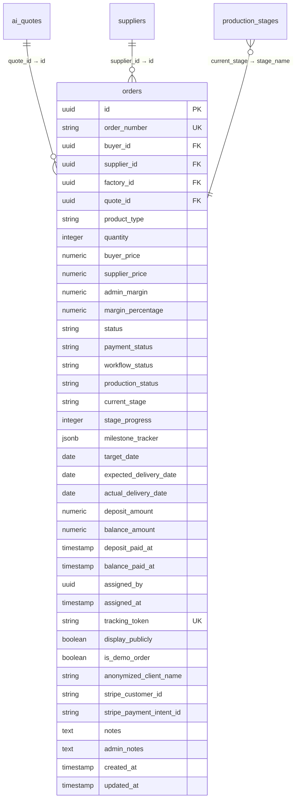
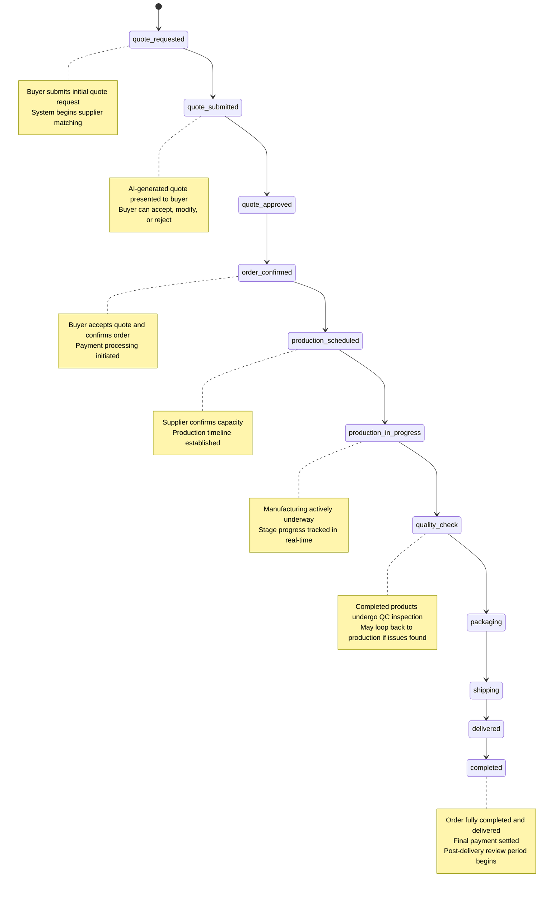
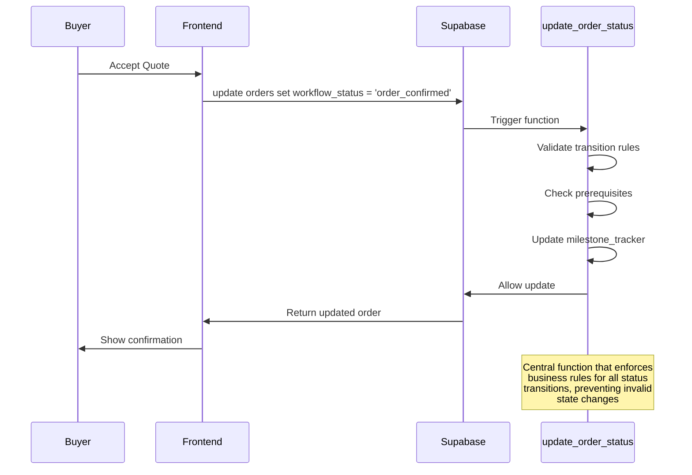
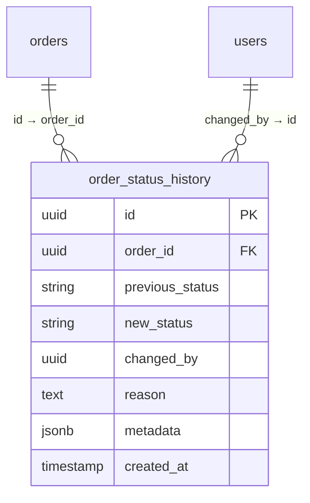

# Orders Table

<cite>
**Referenced Files in This Document**  
- [COMPLETE_SETUP.sql](file://supabase/COMPLETE_SETUP.sql)
- [migrations/](file://supabase/migrations/)
- [src/hooks/useOrderManagement.ts](file://src/hooks/useOrderManagement.ts)
- [src/types/order.ts](file://src/types/order.ts)
- [src/lib/supabaseHelpers.ts](file://src/lib/supabaseHelpers.ts)
</cite>

## Table of Contents
1. [Introduction](#introduction)
2. [Orders Table Schema](#orders-table-schema)
3. [Field Descriptions](#field-descriptions)
4. [Workflow Status Lifecycle](#workflow-status-lifecycle)
5. [Relationships with Other Tables](#relationships-with-other-tables)
6. [Row-Level Security (RLS) Policies](#row-level-security-rls-policies)
7. [Order Status Management](#order-status-management)
8. [Audit Logging with order_status_history](#audit-logging-with-order_status_history)
9. [Conclusion](#conclusion)

## Introduction
The `orders` table in the sleekapp-v100 system serves as the central data model for managing the complete lifecycle of manufacturing orders from initial quote request to final delivery. This document provides comprehensive documentation of the table structure, field definitions, workflow states, relationships, and security mechanisms that govern order data. The table integrates with multiple systems including quoting, production tracking, payment processing, and user role-based access control.

**Section sources**
- [COMPLETE_SETUP.sql](file://supabase/COMPLETE_SETUP.sql#L1-L500)

## Orders Table Schema
The `orders` table is defined with comprehensive fields to track all aspects of an order's lifecycle, financial details, production progress, and metadata. The schema supports a multi-tenant architecture with data isolation between buyers, suppliers, and administrators.



**Diagram sources**
- [COMPLETE_SETUP.sql](file://supabase/COMPLETE_SETUP.sql#L100-L300)

## Field Descriptions
The following table details all fields in the `orders` table, their data types, constraints, and business purposes:

| Field Name | Data Type | Constraints | Description |
|------------|-----------|-----------|-------------|
| id | uuid | PRIMARY KEY | Unique identifier for the order |
| order_number | string | UNIQUE | Human-readable order identifier |
| buyer_id | uuid | FOREIGN KEY | Reference to the buyer who placed the order |
| supplier_id | uuid | FOREIGN KEY | Reference to the supplier responsible for fulfillment |
| factory_id | uuid | FOREIGN KEY | Reference to the specific factory handling production |
| quote_id | uuid | FOREIGN KEY | Reference to the originating AI quote |
| product_type | string | NOT NULL | Category of product being manufactured |
| quantity | integer | NOT NULL | Number of units ordered |
| buyer_price | numeric | NOT NULL | Total price charged to the buyer |
| supplier_price | numeric | NOT NULL | Agreed price with the supplier |
| admin_margin | numeric | NOT NULL | Platform's profit margin amount |
| margin_percentage | numeric | NOT NULL | Platform's profit margin as percentage |
| status | string | NOT NULL | Current operational status (e.g., active, cancelled) |
| payment_status | string | NOT NULL | Payment processing state (e.g., pending, paid) |
| workflow_status | string | NOT NULL | Current stage in the order lifecycle |
| production_status | string | NOT NULL | Current production phase |
| current_stage | string | NOT NULL | Specific production stage being executed |
| stage_progress | integer | CHECK (0-100) | Percentage completion of current stage |
| milestone_tracker | jsonb | NOT NULL | Structured tracking of key milestones |
| target_date | date | NOT NULL | Original target completion date |
| expected_delivery_date | date | NOT NULL | Current projected delivery date |
| actual_delivery_date | date | NULLABLE | Date when order was actually delivered |
| deposit_amount | numeric | NOT NULL | Initial deposit amount |
| balance_amount | numeric | NOT NULL | Remaining balance to be paid |
| deposit_paid_at | timestamp | NULLABLE | Timestamp when deposit was paid |
| balance_paid_at | timestamp | NULLABLE | Timestamp when final balance was paid |
| assigned_by | uuid | FOREIGN KEY | User who assigned the order to a supplier |
| assigned_at | timestamp | NULLABLE | Timestamp when supplier assignment occurred |
| tracking_token | string | UNIQUE | Secure token for order tracking access |
| display_publicly | boolean | NOT NULL | Whether order can be shown in public showcases |
| is_demo_order | boolean | NOT NULL | Flag indicating if this is a demonstration order |
| anonymized_client_name | string | NULLABLE | Pseudonymized name for public display |
| stripe_customer_id | string | NULLABLE | Stripe customer reference for payment |
| stripe_payment_intent_id | string | NULLABLE | Stripe payment intent identifier |
| notes | text | NULLABLE | Buyer-visible notes about the order |
| admin_notes | text | NULLABLE | Internal administrative notes |
| created_at | timestamp | NOT NULL | Creation timestamp |
| updated_at | timestamp | NOT NULL | Last modification timestamp |

**Section sources**
- [COMPLETE_SETUP.sql](file://supabase/COMPLETE_SETUP.sql#L100-L300)

## Workflow Status Lifecycle
The `workflow_status` field uses an ENUM-like pattern (implemented as a TEXT field with constraints) to represent the complete order lifecycle. The workflow progresses through the following states:



**Diagram sources**
- [COMPLETE_SETUP.sql](file://supabase/COMPLETE_SETUP.sql#L200-L250)
- [migrations/](file://supabase/migrations/)

## Relationships with Other Tables
The `orders` table maintains critical relationships with several other entities in the system:

```mermaid
graph TD
orders --> ai_quotes: "quote_id → id"
orders --> suppliers: "supplier_id → id"
orders --> users: "buyer_id → id"
orders --> production_stages: "current_stage → stage_name"
orders --> order_status_history: "id → order_id"
orders --> payments: "id → order_id"
orders --> messages: "id → order_id"
classDef table fill:#f0f8ff,stroke:#333,stroke-width:1px;
class orders,ai_quotes,suppliers,users,production_stages,order_status_history,payments,messages table;
```

### Key Relationships:
- **ai_quotes**: Each order originates from an AI-generated quote, creating a one-to-one relationship that preserves the original pricing and specifications
- **suppliers**: Orders are assigned to specific suppliers who fulfill the manufacturing requirements
- **production_stages**: The `current_stage` field references the production_stages table to maintain standardized stage definitions across all orders
- **order_status_history**: Every status change is logged in this audit table, maintaining a complete history of the order's progression

**Section sources**
- [COMPLETE_SETUP.sql](file://supabase/COMPLETE_SETUP.sql#L150-L250)

## Row-Level Security (RLS) Policies
The `orders` table implements comprehensive Row-Level Security (RLS) policies to ensure data isolation between different user roles:

```mermaid
graph TD
A[User Request] --> B{User Role}
B --> |Buyer| C[Can view only their orders]
B --> |Supplier| D[Can view assigned orders]
B --> |Admin| E[Can view all orders]
C --> F[SELECT: buyer_id = auth.uid()]
D --> G[SELECT: supplier_id = auth.uid()]
E --> H[SELECT: true]
F --> I[No access to admin_notes]
G --> J[No access to financial margins]
H --> K[Full access to all fields]
style C fill:#e1f5fe,stroke:#333
style D fill:#e1f5fe,stroke:#333
style E fill:#e1f5fe,stroke:#333
```

The RLS policies enforce the following access rules:
- **Buyers**: Can only access orders where `buyer_id` matches their user ID. They can view order status, production progress, and delivery information but cannot see supplier pricing or admin margins.
- **Suppliers**: Can only access orders where `supplier_id` matches their organization ID. They can update production status and stage progress but cannot modify pricing or payment information.
- **Administrators**: Have full access to all orders and fields, including financial margins and internal admin notes. They can also override status transitions when necessary.

These policies are implemented using PostgreSQL RLS with security-definer functions that validate user permissions before allowing data access or modification.

**Section sources**
- [COMPLETE_SETUP.sql](file://supabase/COMPLETE_SETUP.sql#L400-L450)

## Order Status Management
The system uses a combination of database functions and application logic to manage order status transitions:



The `update_order_status()` function serves as the central mechanism for state transitions, ensuring that:
- Only valid state transitions are allowed (e.g., cannot go from "delivered" back to "production_scheduled")
- Prerequisites are met before advancing (e.g., payment must be confirmed before production starts)
- Audit records are created for every status change
- Related systems are notified of status updates (e.g., messaging, notifications)

**Section sources**
- [COMPLETE_SETUP.sql](file://supabase/COMPLETE_SETUP.sql#L300-L350)

## Audit Logging with order_status_history
To maintain a complete audit trail of order progression, the system uses the `order_status_history` table:



This audit table captures:
- Every workflow status change
- The user who initiated the change
- Optional reason for the transition
- Timestamp of the change
- Contextual metadata about the transition

The history is automatically populated via database triggers whenever the `workflow_status` field is updated, providing a complete record for customer service, dispute resolution, and operational analysis.

**Section sources**
- [COMPLETE_SETUP.sql](file://supabase/COMPLETE_SETUP.sql#L350-L380)

## Conclusion
The `orders` table in sleekapp-v100 represents a comprehensive data model for managing the end-to-end manufacturing order lifecycle. With its rich set of fields, well-defined workflow states, robust security policies, and audit capabilities, the table serves as the central hub for order management in the platform. The integration with AI quoting, production tracking, and payment systems creates a seamless experience for buyers and suppliers while maintaining the data isolation and audit requirements necessary for a production-grade application.