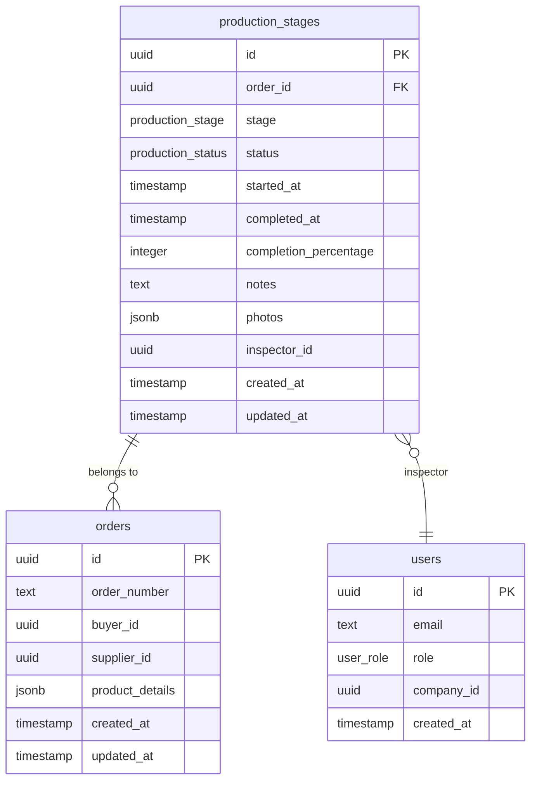
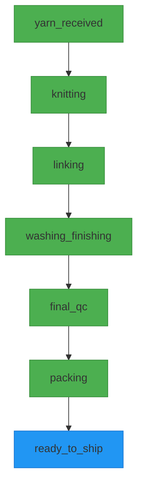
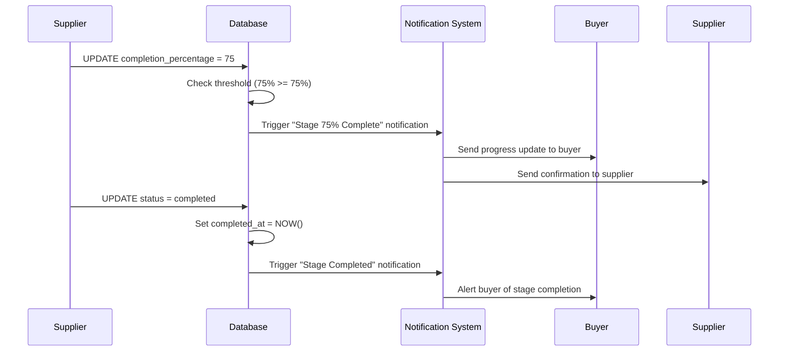
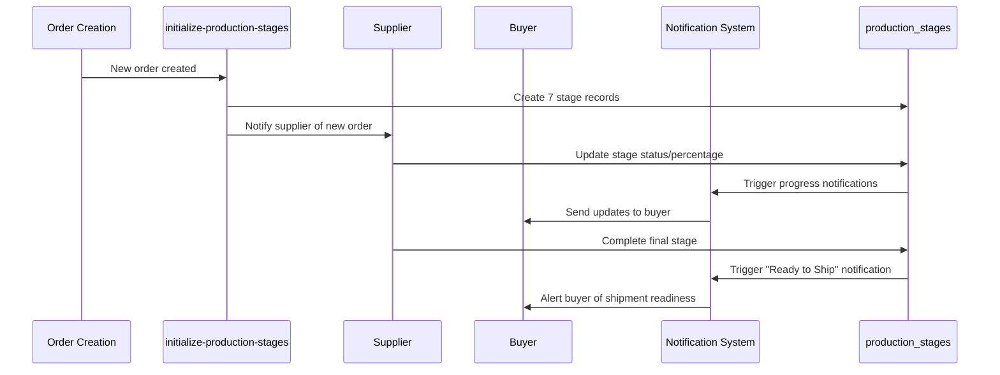

# Production Stages Table

<cite>
**Referenced Files in This Document**  
- [COMPLETE_SETUP.sql](file://supabase/COMPLETE_SETUP.sql)
- [20251116162502_313dcba7-bfcf-494c-a64e-cf71fbf50750.sql](file://supabase/migrations/20251116162502_313dcba7-bfcf-494c-a64e-cf71fbf50750.sql)
- [initialize-production-stages/index.ts](file://supabase/functions/initialize-production-stages/index.ts)
- [update_production_stage_status.sql](file://supabase/functions/update_production_stage_status.sql)
- [database.ts](file://src/types/database.ts)
- [ProductionStageTimeline.tsx](file://src/components/production/ProductionStageTimeline.tsx)
- [ProductionStageManager.tsx](file://src/components/supplier/ProductionStageManager.tsx)
- [ProductionStageCard.tsx](file://src/components/production/ProductionStageCard.tsx)
</cite>

## Table of Contents
1. [Introduction](#introduction)
2. [Table Structure](#table-structure)
3. [Field Definitions](#field-definitions)
4. [Production Stage ENUM Values](#production-stage-enum-values)
5. [Progress Tracking with Completion Percentage](#progress-tracking-with-completion-percentage)
6. [Relationship with Orders Table](#relationship-with-orders-table)
7. [RLS Policies](#rls-policies)
8. [Trigger Function: update_production_stage_status()](#trigger-function-update_production_stage_status)
9. [Workflow Integration](#workflow-integration)
10. [Conclusion](#conclusion)

## Introduction

The `production_stages` table is a core component of the manufacturing workflow tracking system in sleekapp-v100. It provides granular visibility into the 8-stage production process for apparel manufacturing, enabling real-time monitoring of order progress from yarn receipt to shipment readiness. This documentation details the table's structure, field purposes, workflow integration, and security policies that govern access and updates.

**Section sources**
- [COMPLETE_SETUP.sql](file://supabase/COMPLETE_SETUP.sql#L1-L500)

## Table Structure

The `production_stages` table is designed to track the progression of manufacturing orders through a standardized 8-stage workflow. Each record represents a specific stage in the production lifecycle of an order, with timestamps, status indicators, and metadata to support comprehensive tracking and reporting.



**Diagram sources**
- [COMPLETE_SETUP.sql](file://supabase/COMPLETE_SETUP.sql#L150-L250)
- [20251116162502_313dcba7-bfcf-494c-a64e-cf71fbf50750.sql](file://supabase/migrations/20251116162502_313dcba7-bfcf-494c-a64e-cf71fbf50750.sql#L1-L100)

## Field Definitions

| Field | Type | Description |
|-------|------|-------------|
| id | UUID | Primary key, unique identifier for each production stage record |
| order_id | UUID | Foreign key referencing the orders table, establishing the relationship between production stages and specific orders |
| stage | production_stage (ENUM) | The current production stage in the manufacturing workflow (yarn_received, knitting, linking, washing_finishing, final_qc, packing, ready_to_ship) |
| status | production_status (ENUM) | Current status of the stage (pending, in_progress, completed, on_hold, failed) |
| started_at | TIMESTAMP | Automatically set when a stage transitions to in_progress, marking the start of work on this stage |
| completed_at | TIMESTAMP | Automatically set when a stage transitions to completed, marking the completion time |
| completion_percentage | INTEGER | Manual percentage (0-100) indicating progress within the current stage, used for granular tracking and notifications |
| notes | TEXT | Free-form text field for inspectors or suppliers to add comments, observations, or issues related to this stage |
| photos | JSONB | Array of photo URLs or metadata capturing visual documentation of the production process at this stage |
| inspector_id | UUID | Reference to the user who verified or updated this stage, typically used for quality control stages |
| created_at | TIMESTAMP | Record creation timestamp, automatically set by the database |
| updated_at | TIMESTAMP | Record update timestamp, automatically updated on any modification |

**Section sources**
- [COMPLETE_SETUP.sql](file://supabase/COMPLETE_SETUP.sql#L150-L250)
- [database.ts](file://src/types/database.ts#L100-L150)

## Production Stage ENUM Values

The `production_stage` ENUM defines the eight sequential stages of the manufacturing workflow:



**Diagram sources**
- [COMPLETE_SETUP.sql](file://supabase/COMPLETE_SETUP.sql#L50-L80)
- [20251116162502_313dcba7-bfcf-494c-a64e-cf71fbf50750.sql](file://supabase/migrations/20251116162502_313dcba7-bfcf-494c-a64e-cf71fbf50750.sql#L20-L50)

### Stage Significance

1. **yarn_received**: Raw materials have been received at the manufacturing facility and verified for quality and quantity
2. **knitting**: Fabric is being knitted according to the garment specifications and patterns
3. **linking**: Knitted panels are being linked/sewn together to form the complete garment
4. **washing_finishing**: Garments undergo washing, drying, and finishing processes to achieve desired texture and appearance
5. **final_qc**: Final quality control inspection is conducted to ensure garments meet all specifications and quality standards
6. **packing**: Approved garments are being packed according to shipping requirements and customer specifications
7. **ready_to_ship**: Order is fully processed, packed, and prepared for shipment to the customer

Each stage represents a critical checkpoint in the manufacturing process, with quality verification typically occurring at the transition between stages.

**Section sources**
- [COMPLETE_SETUP.sql](file://supabase/COMPLETE_SETUP.sql#L50-L80)
- [ProductionStageTimeline.tsx](file://src/components/production/ProductionStageTimeline.tsx#L25-L100)

## Progress Tracking with Completion Percentage

The `completion_percentage` field enables granular progress tracking within each production stage, providing more detailed visibility than binary stage completion:



**Diagram sources**
- [ProductionStageManager.tsx](file://src/components/supplier/ProductionStageManager.tsx#L45-L120)
- [update_production_stage_status.sql](file://supabase/functions/update_production_stage_status.sql#L30-L50)

The completion percentage field serves several key purposes:
- Enables suppliers to provide incremental progress updates without prematurely marking a stage as complete
- Triggers automated notifications to buyers when significant progress milestones are reached (e.g., 25%, 50%, 75%)
- Provides data for production analytics and performance reporting
- Helps identify bottlenecks when stages remain at high completion percentages for extended periods
- Supports accurate delivery date predictions based on current progress rates

**Section sources**
- [ProductionStageManager.tsx](file://src/components/supplier/ProductionStageManager.tsx#L30-L150)
- [ProductionStageCard.tsx](file://src/components/production/ProductionStageCard.tsx#L20-L80)

## Relationship with Orders Table

The `production_stages` table maintains a one-to-many relationship with the `orders` table, where each order can have multiple production stages:

```mermaid
classDiagram
class orders {
+uuid id
+text order_number
+uuid buyer_id
+uuid supplier_id
+jsonb product_details
+timestamp created_at
+timestamp updated_at
}
class production_stages {
+uuid id
+uuid order_id
+production_stage stage
+production_status status
+timestamp started_at
+timestamp completed_at
+integer completion_percentage
+text notes
+jsonb photos
+uuid inspector_id
+timestamp created_at
+timestamp updated_at
}
orders ||--o{ production_stages : "has many"
```

**Diagram sources**
- [COMPLETE_SETUP.sql](file://supabase/COMPLETE_SETUP.sql#L150-L250)
- [database.ts](file://src/types/database.ts#L80-L150)

This relationship enables:
- Creation of a complete production timeline for each order by querying all associated stages
- Aggregation of production data across multiple orders for supplier performance analysis
- Filtering of production stages by order attributes such as buyer, product type, or creation date
- Implementation of cascading operations (e.g., archiving production stages when an order is deleted)

The foreign key constraint ensures referential integrity, preventing orphaned production stage records.

**Section sources**
- [COMPLETE_SETUP.sql](file://supabase/COMPLETE_SETUP.sql#L200-L220)
- [database.ts](file://src/types/database.ts#L100-L120)

## RLS Policies

Row Level Security (RLS) policies govern access to the `production_stages` table, ensuring data privacy and appropriate access controls:

```sql
-- Allow buyers to view stages for their orders
CREATE POLICY "Buyers can view their order stages"
ON production_stages FOR SELECT
TO authenticated
USING (
  EXISTS (
    SELECT 1 FROM orders
    WHERE orders.id = production_stages.order_id
    AND orders.buyer_id = auth.uid()
  )
);

-- Allow suppliers to update stages for orders assigned to them
CREATE POLICY "Suppliers can update assigned order stages"
ON production_stages FOR UPDATE
TO authenticated
USING (
  EXISTS (
    SELECT 1 FROM orders
    WHERE orders.id = production_stages.order_id
    AND orders.supplier_id = auth.uid()
  )
);
```

These RLS policies implement the following access rules:
- Buyers can only view production stages for orders they own (identified by buyer_id)
- Suppliers can only update production stages for orders assigned to them (identified by supplier_id)
- Admin users have full access through role-based permissions
- All users must be authenticated to access any production stage data
- Insert operations are restricted to system functions and authorized roles

The policies ensure that sensitive production information is only accessible to authorized parties, maintaining data security while enabling necessary visibility.

**Section sources**
- [COMPLETE_SETUP.sql](file://supabase/COMPLETE_SETUP.sql#L300-L350)
- [database.ts](file://src/types/database.ts#L140-L150)

## Trigger Function: update_production_stage_status()

The `update_production_stage_status()` trigger automatically manages timestamps based on status transitions:

```mermaid
flowchart TD
A[Status Update] --> B{Status = in_progress?}
B --> |Yes| C[Set started_at = NOW()]
B --> |No| D{Status = completed?}
D --> |Yes| E[Set completed_at = NOW()]
D --> |No| F[No timestamp changes]
C --> G[Update record]
E --> G
F --> G
style C fill:#4CAF50,stroke:#388E3C
style E fill:#4CAF50,stroke:#388E3C
```

**Diagram sources**
- [update_production_stage_status.sql](file://supabase/functions/update_production_stage_status.sql#L1-L40)
- [20251116162502_313dcba7-bfcf-494c-a64e-cf71fbf50750.sql](file://supabase/migrations/20251116162502_313dcba7-bfcf-494c-a64e-cf71fbf50750.sql#L80-L100)

Key features of the trigger:
- Automatically sets `started_at` when status changes to 'in_progress'
- Automatically sets `completed_at` when status changes to 'completed'
- Prevents manual manipulation of timestamps, ensuring audit integrity
- Only updates timestamps on status changes, not on other field modifications
- Maintains historical accuracy by never overwriting existing timestamps

This automation ensures consistent and reliable tracking of stage durations, which is critical for performance analysis and delivery forecasting.

**Section sources**
- [update_production_stage_status.sql](file://supabase/functions/update_production_stage_status.sql#L1-L50)
- [20251116162502_313dcba7-bfcf-494c-a64e-cf71fbf50750.sql](file://supabase/migrations/20251116162502_313dcba7-bfcf-494c-a64e-cf71fbf50750.sql#L80-L100)

## Workflow Integration

The production_stages table is integrated into the manufacturing workflow through several key processes:



**Diagram sources**
- [initialize-production-stages/index.ts](file://supabase/functions/initialize-production-stages/index.ts#L15-L40)
- [ProductionStageTimeline.tsx](file://src/components/production/ProductionStageTimeline.tsx#L30-L100)

The workflow integration includes:
- Automatic creation of all seven production stages when a new order is created
- Real-time updates from suppliers through the ProductionStageManager interface
- Automated notifications to buyers based on progress milestones
- Visual timeline representation in the buyer and supplier dashboards
- Quality control integration where inspector_id is recorded for QC stages
- Mobile-friendly interface for suppliers to update stages from the factory floor

This comprehensive integration ensures seamless tracking throughout the manufacturing process, providing transparency and accountability at every stage.

**Section sources**
- [initialize-production-stages/index.ts](file://supabase/functions/initialize-production-stages/index.ts#L1-L50)
- [ProductionStageManager.tsx](file://src/components/supplier/ProductionStageManager.tsx#L1-L150)
- [ProductionStageTimeline.tsx](file://src/components/production/ProductionStageTimeline.tsx#L1-L120)

## Conclusion

The `production_stages` table is a critical component of the sleekapp-v100 manufacturing tracking system, providing detailed visibility into the 8-stage apparel production workflow. Through its comprehensive field structure, automated timestamp management, and secure access controls, the table enables accurate progress tracking, timely notifications, and transparent communication between buyers and suppliers. The integration with the orders table creates a complete production timeline for each order, while the RLS policies ensure data security and appropriate access. This robust data model supports the platform's mission of providing end-to-end visibility in the apparel manufacturing process.